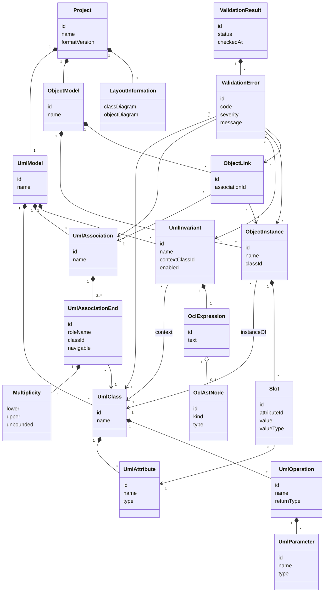

# Domain Model

## Zweck dieser Datei

Diese Datei entwirft das fachliche Domänenmodell des neuen UML/OCL-Websystems.

Sie beschreibt die zentralen Domänenbereiche und Kernobjekte, die für den MVP und spätere Erweiterungen relevant sind. Das Modell ist fachlich motiviert und dient als Grundlage für:

- Backend-Domänenmodell,
- API- und DTO-Design,
- Frontend-State und Diagramm-Mapping,
- JSON-Projektformat,
- OCL-Verarbeitung,
- Validation Results,
- spätere Testfälle.

Das originale USE-Projekt dient als fachliche Referenz für UML/OCL-Konzepte, Systemzustände und Validierung. Die technische Struktur des USE-Cores wird nicht übernommen.

## Grundprinzipien

| Prinzip | Bedeutung |
|---|---|
| Trennung von UML-Modell und Objektmodell | Das UML-Modell beschreibt Klassen, Attribute, Assoziationen und Invarianten. Das Objektmodell beschreibt konkrete Instanzen in einem Snapshot. |
| OCL gehört fachlich zum UML-Modell | Invarianten sind Teil der Modellstruktur, werden aber gegen konkrete Snapshots ausgewertet. |
| Snapshot ist ein prüfbarer Zustand | Ein Snapshot enthält Objekte, Slots und Objektlinks, die gegen das UML-Modell validiert werden. |
| Validierung ist ein eigenes Ergebnis | Validation Results sind nicht Teil des Modells selbst, sondern Ergebnis einer Prüfung. |
| Stabile IDs sind Pflicht | Frontend, Backend, API, Layout und Validation Results müssen dieselben Elemente eindeutig referenzieren können. |
| Layout ist keine fachliche Semantik | Diagrammpositionen und UI-Zustand helfen der Weboberfläche, ändern aber nicht die UML/OCL-Bedeutung. |
| MVP klein, Modell erweiterbar | Das Domänenmodell unterstützt den MVP, soll aber Vererbung, Enumerationen, weitere OCL-Features und mehrere Snapshots später aufnehmen können. |

## Modellbereiche

| Bereich | Zweck | Enthaltene Kernobjekte |
|---|---|---|
| Project | Oberster Container eines Nutzerprojekts. | `Project`, `LayoutInformation` |
| UML Model | Fachliches Klassenmodell und Constraints. | `UmlModel`, `UmlClass`, `UmlAssociation`, `UmlInvariant` |
| Class Model | Klassen, Attribute, Operationen und Parameter. | `UmlClass`, `UmlAttribute`, `UmlOperation`, `UmlParameter` |
| Association Model | Beziehungen zwischen Klassen. | `UmlAssociation`, `UmlAssociationEnd`, `Multiplicity` |
| OCL Model | OCL-Invarianten und Ausdrucksrepräsentation. | `UmlInvariant`, `OclExpression`, `OclAstNode` |
| Object Model / Snapshot | Konkrete Objektzustände. | `ObjectModel`, `ObjectInstance`, `Slot`, `ObjectLink` |
| Validation Model | Ergebnis einer Constraint-Prüfung. | `ValidationResult`, `ValidationError` |
| Layout Model | UI- und Diagrammdaten. | `LayoutInformation` |

## Project

`Project` ist der oberste fachliche Container. Ein Projekt enthält genau ein UML-Modell und im MVP genau ein Objektmodell als aktiven Snapshot.

| Aspekt | Beschreibung |
|---|---|
| Zweck | Bündelt Modell, Snapshot, Layout und Metadaten. |
| Wichtigste Felder | `id`, `name`, `description`, `formatVersion`, `umlModel`, `objectModel`, `layout`, `createdAt`, `updatedAt`. |
| Beziehungen | Enthält `UmlModel`, `ObjectModel` und `LayoutInformation`. Validation Results werden aus einem Project-Zustand erzeugt, aber nicht dauerhaft als fachlicher Projektbestandteil benötigt. |
| MVP-Relevanz | Hoch. Ohne Project gibt es keinen speicherbaren Arbeitszustand. |
| Spätere Erweiterbarkeit | Mehrere Snapshots, Projektversionen, Nutzer-/Workspace-Metadaten, Datenbankpersistenz. |
| Frontend-Relevanz | Liefert initialen Zustand für Explorer, Canvas, Properties Panel und Import/Export. |
| Backend-Relevanz | Aggregate Root für Speichern, Laden und Validieren. |

## UML Model

`UmlModel` enthält die fachliche Modellstruktur. Es entspricht konzeptionell dem Kernbereich, den USE über `MModel` und `uml/mm` abbildet.

| Aspekt | Beschreibung |
|---|---|
| Zweck | Container für Klassen, Assoziationen und OCL-Invarianten. |
| Wichtigste Felder | `id`, `name`, `classes`, `associations`, `invariants`, `primitiveTypes`, später `enumerations`, `generalizations`. |
| Beziehungen | Enthält `UmlClass`, `UmlAssociation`, `UmlInvariant`. Wird von `ObjectModel` referenziert. |
| MVP-Relevanz | Hoch. Grundlage für Class Diagram, Object Diagram und OCL-Typechecking. |
| Spätere Erweiterbarkeit | Vererbung, Enumerationen, Aggregation/Komposition, Assoziationsklassen, `.use` Import/Export. |
| Frontend-Relevanz | Quelle für Class Diagram, Explorer und Properties Panel. |
| Backend-Relevanz | Grundlage für Modellvalidierung, Snapshot-Validierung, OCL-Typechecking und Validation Service. |

## Class Model

### UmlClass

`UmlClass` beschreibt eine Klasse im UML-Klassenmodell.

| Aspekt | Beschreibung |
|---|---|
| Zweck | Definiert einen Objekttyp mit Attributen, Operationensignaturen und Invariantenbezug. |
| Wichtigste Felder | `id`, `name`, `attributes`, `operations`, später `superClassIds`, `isAbstract`. |
| Beziehungen | Enthält `UmlAttribute` und `UmlOperation`; wird von `UmlAssociationEnd`, `UmlInvariant` und `ObjectInstance` referenziert. |
| MVP-Relevanz | Hoch. Zentrales Element des Klassendiagramms. |
| Spätere Erweiterbarkeit | Vererbung, abstrakte Klassen, Interfaces, zusätzliche Constraints. |
| Frontend-Relevanz | Klasse wird als Diagrammknoten, Explorer-Eintrag und Properties-Element angezeigt. |
| Backend-Relevanz | Typquelle für Objekte, Slots und OCL-Kontext. |

### UmlAttribute

`UmlAttribute` beschreibt ein typisiertes Merkmal einer Klasse.

| Aspekt | Beschreibung |
|---|---|
| Zweck | Definiert einen benannten Wert, der in Objekt-Slots konkret belegt wird. |
| Wichtigste Felder | `id`, `name`, `type`, später `isDerived`, `deriveExpression`, `initExpression`, `visibility`. |
| Beziehungen | Gehört zu genau einer `UmlClass`; wird von `Slot` über `attributeId` referenziert; kann in `OclExpression` verwendet werden. |
| MVP-Relevanz | Hoch. Grundlage für Attributwerte und OCL-Attributzugriff. |
| Spätere Erweiterbarkeit | Derived Attributes, Init Values, Sichtbarkeit, Mehrwertigkeit. |
| Frontend-Relevanz | Anzeige und Bearbeitung im Class Properties Panel; Slot-Editoren im Object Diagram. |
| Backend-Relevanz | Typechecking, Slot-Validierung, OCL-Auswertung. |

### UmlOperation

`UmlOperation` beschreibt im MVP nur eine Signatur.

| Aspekt | Beschreibung |
|---|---|
| Zweck | Dokumentiert Operationen einer Klasse ohne Ausführungssemantik. |
| Wichtigste Felder | `id`, `name`, `parameters`, `returnType`, später `preconditions`, `postconditions`, `bodyExpression`. |
| Beziehungen | Gehört zu genau einer `UmlClass`; enthält `UmlParameter`. |
| MVP-Relevanz | Mittel. Sichtbar im Klassendiagramm, aber nicht ausführbar. |
| Spätere Erweiterbarkeit | Preconditions, Postconditions, Query-Operationen, Operation Bodies. |
| Frontend-Relevanz | Anzeige und Bearbeitung als Operationssignatur. |
| Backend-Relevanz | Speicherung und spätere Bindung von Pre-/Postconditions. |

### UmlParameter

`UmlParameter` beschreibt einen Parameter einer Operation.

| Aspekt | Beschreibung |
|---|---|
| Zweck | Definiert Name und Typ eines Operationsparameters. |
| Wichtigste Felder | `id`, `name`, `type`, optional `direction`. |
| Beziehungen | Gehört zu genau einer `UmlOperation`. |
| MVP-Relevanz | Niedrig bis mittel. Nur relevant, wenn Operationensignaturen Parameter enthalten. |
| Spätere Erweiterbarkeit | Parameter-Richtungen, Default Values, Pre-/Postcondition-Kontext. |
| Frontend-Relevanz | Anzeige und Bearbeitung in Operationen. |
| Backend-Relevanz | Speicherung und spätere OCL-Kontexte für Operation Constraints. |

## Association Model

### UmlAssociation

`UmlAssociation` beschreibt eine Beziehung zwischen Klassen.

| Aspekt | Beschreibung |
|---|---|
| Zweck | Definiert, welche Klassen über welche Rollen und Multiplizitäten verbunden werden können. |
| Wichtigste Felder | `id`, `name`, `ends`, später `kind`, `isDerived`, `associationClassId`. |
| Beziehungen | Enthält mindestens zwei `UmlAssociationEnd`; wird von `ObjectLink` referenziert. |
| MVP-Relevanz | Hoch. Grundlage für Klassendiagramm-Kanten, Objektlinks, Navigation und Multiplizitäten. |
| Spätere Erweiterbarkeit | N-äre Assoziationen, Aggregation, Komposition, Assoziationsklassen, Qualifier. |
| Frontend-Relevanz | Diagrammkante und Association Properties. |
| Backend-Relevanz | Linkvalidierung, Navigation, Multiplicity Checks. |

### UmlAssociationEnd

`UmlAssociationEnd` beschreibt ein Ende einer Assoziation.

| Aspekt | Beschreibung |
|---|---|
| Zweck | Bindet eine Assoziation an eine Klasse und definiert Rolle sowie Multiplizität. |
| Wichtigste Felder | `id`, `classId`, `roleName`, `multiplicity`, `navigable`, später `aggregationKind`, `qualifiers`. |
| Beziehungen | Gehört zu einer `UmlAssociation`; referenziert eine `UmlClass`; enthält `Multiplicity`. |
| MVP-Relevanz | Hoch. Rollen sind OCL-Navigationsnamen; Multiplizitäten werden validiert. |
| Spätere Erweiterbarkeit | Aggregation/Komposition, Qualifier, subsets/redefines, Navigierbarkeit. |
| Frontend-Relevanz | Properties Panel, Diagramm-Labels, Add Association Modal. |
| Backend-Relevanz | Typechecking von Navigation, Objektlink-Validierung, Multiplicity Checks. |

### Multiplicity

`Multiplicity` beschreibt zulässige Kardinalitäten an einem Association End.

| Aspekt | Beschreibung |
|---|---|
| Zweck | Legt fest, wie viele verknüpfte Objekte an einem Association End erlaubt sind. |
| Wichtigste Felder | `lower`, `upper`, `unbounded`, optional `raw`. |
| Beziehungen | Bestandteil eines `UmlAssociationEnd`. |
| MVP-Relevanz | Hoch. Pflicht für Multiplizitätsprüfung. |
| Spätere Erweiterbarkeit | Mehrere Ranges, UML-konforme Spezialfälle, bessere Notation. |
| Frontend-Relevanz | Eingabe und Anzeige von `0..1`, `1`, `0..*`, `1..*`. |
| Backend-Relevanz | Kardinalitätsprüfung im Validation Service. |

Hinweis: Das originale USE-Projekt nutzt intern `MMultiplicity` und repräsentiert `*` unter anderem über `MANY = -1`. Das neue System sollte im JSON- und DTO-Modell eine explizitere Darstellung wie `unbounded: true` verwenden.

## OCL Model

### UmlInvariant

`UmlInvariant` beschreibt einen OCL-Constraint im Kontext einer Klasse.

| Aspekt | Beschreibung |
|---|---|
| Zweck | Definiert eine Bedingung, die für alle Objekte der Kontextklasse gelten muss. |
| Wichtigste Felder | `id`, `name`, `contextClassId`, `expression`, `enabled`, optional `parseStatus`, `typeStatus`. |
| Beziehungen | Gehört zu `UmlModel`; referenziert eine `UmlClass`; enthält oder referenziert `OclExpression`. |
| MVP-Relevanz | Hoch. Wichtigster OCL-Constraint-Typ. |
| Spätere Erweiterbarkeit | Mehrere Kontextvariablen, Severity, Tags, Gruppierung, aktiv/inaktiv je Check. |
| Frontend-Relevanz | Explorer, Invariant Properties, OCL Editor, Validation Results. |
| Backend-Relevanz | OCL Parsing, Typechecking, Evaluation und Invariant Checks. |

### OclExpression

`OclExpression` repräsentiert den textuellen und optional analysierten OCL-Ausdruck.

| Aspekt | Beschreibung |
|---|---|
| Zweck | Speichert OCL-Text und verweist auf Analyseergebnisse. |
| Wichtigste Felder | `id`, `text`, `languageVersion`, `ast`, `sourceRange`, `diagnostics`. |
| Beziehungen | Bestandteil von `UmlInvariant`; kann ein `OclAstNode`-Wurzelobjekt besitzen. |
| MVP-Relevanz | Hoch. Ohne Ausdruck keine Invariantenauswertung. |
| Spätere Erweiterbarkeit | Syntax Highlighting, Autocomplete, Evaluation Trace, Source Mapping. |
| Frontend-Relevanz | OCL-Eingabe, Anzeige von Fehlerpositionen. |
| Backend-Relevanz | Parser-Eingabe, Typechecker-Eingabe, Evaluator-Eingabe. |

### OclAstNode

`OclAstNode` ist die fachliche Repräsentation eines geparsten OCL-Ausdrucks.

| Aspekt | Beschreibung |
|---|---|
| Zweck | Strukturierte, typprüfbare und auswertbare Form des OCL-Texts. |
| Wichtigste Felder | `id`, `kind`, `type`, `children`, `value`, `name`, `sourceRange`. |
| Beziehungen | Gehört zu einem `OclExpression`; referenziert indirekt Modellbestandteile wie Attribute oder Association Ends. |
| MVP-Relevanz | Hoch als Konzept. Die Persistenz des AST im Projektformat ist optional. |
| Spätere Erweiterbarkeit | Neue Node-Kinds für Quantoren, Let, If, AllInstances, Operation Calls. |
| Frontend-Relevanz | Optional für Diagnose, Syntaxfehler und spätere Editorfunktionen. |
| Backend-Relevanz | Grundlage für Typechecking und Evaluation. |

## Object Model / Snapshot

### ObjectModel

`ObjectModel` beschreibt den aktuellen Snapshot.

| Aspekt | Beschreibung |
|---|---|
| Zweck | Enthält konkrete Objekte, Slots und Objektlinks eines prüfbaren Zustands. |
| Wichtigste Felder | `id`, `name`, `objects`, `links`, später `createdFrom`, `timestamp`. |
| Beziehungen | Gehört zu `Project`; referenziert über Objekte und Links das `UmlModel`. |
| MVP-Relevanz | Hoch. Grundlage des Objektdiagramms und der Validierung. |
| Spätere Erweiterbarkeit | Mehrere Snapshots, Snapshot-Vergleich, Historie, Import aus `.cmd`. |
| Frontend-Relevanz | Quelle für Object Diagram View und Object Explorer. |
| Backend-Relevanz | Bewertungsgrundlage für Validation Service und OCL Evaluator. |

### ObjectInstance

`ObjectInstance` ist eine Instanz einer `UmlClass`.

| Aspekt | Beschreibung |
|---|---|
| Zweck | Repräsentiert ein konkretes Objekt im Snapshot. |
| Wichtigste Felder | `id`, `name`, `classId`, `slots`. |
| Beziehungen | Gehört zu `ObjectModel`; referenziert `UmlClass`; enthält `Slot`; wird von `ObjectLink` referenziert. |
| MVP-Relevanz | Hoch. Zentrales Element des Objektdiagramms. |
| Spätere Erweiterbarkeit | Objektlebenszyklus, mehrere Snapshots, instanzbezogene Annotationen. |
| Frontend-Relevanz | Diagrammknoten, Properties Panel, Fehler-Markierung. |
| Backend-Relevanz | OCL-`self`, Slot-Validierung, Invariant Checks. |

### Slot

`Slot` enthält den Wert eines Attributs für ein konkretes Objekt.

| Aspekt | Beschreibung |
|---|---|
| Zweck | Ordnet einem Objekt einen Wert für ein Attribut zu. |
| Wichtigste Felder | `id`, `attributeId`, `value`, `valueType`, optional `isUnset`. |
| Beziehungen | Gehört zu `ObjectInstance`; referenziert `UmlAttribute`. |
| MVP-Relevanz | Hoch. Grundlage für Attributzugriff in OCL. |
| Spätere Erweiterbarkeit | Undefined/Invalid-Semantik, Init Values, Derived Values, Wertquellen. |
| Frontend-Relevanz | Slot-Editor im Object Properties Panel. |
| Backend-Relevanz | Typprüfung, OCL-Evaluation, Snapshot-Validierung. |

### ObjectLink

`ObjectLink` ist eine Instanz einer `UmlAssociation` zwischen Objekten.

| Aspekt | Beschreibung |
|---|---|
| Zweck | Beschreibt eine konkrete Verbindung zwischen Objektinstanzen. |
| Wichtigste Felder | `id`, `associationId`, `endValues`, optional `name`. |
| Beziehungen | Gehört zu `ObjectModel`; referenziert `UmlAssociation`; `endValues` referenzieren `UmlAssociationEnd` und `ObjectInstance`. |
| MVP-Relevanz | Hoch. Grundlage für Objektdiagramm-Kanten, Navigation und Multiplizitätsprüfung. |
| Spätere Erweiterbarkeit | Qualifier, Link-Attribute über Assoziationsklassen, n-äre Links. |
| Frontend-Relevanz | Diagrammkante, Association Properties, Fehler-Markierung. |
| Backend-Relevanz | Linkvalidierung, Navigation, Multiplicity Checks. |

## Validation Model

### ValidationResult

`ValidationResult` beschreibt das Ergebnis eines Constraint Checks.

| Aspekt | Beschreibung |
|---|---|
| Zweck | Bündelt Gesamtstatus, Fehler und optionale Warnungen eines Validierungslaufs. |
| Wichtigste Felder | `id`, `projectId`, `objectModelId`, `status`, `checkedAt`, `errors`, `warnings`, `summary`. |
| Beziehungen | Referenziert `Project`, `UmlModel` und `ObjectModel`; enthält `ValidationError`. |
| MVP-Relevanz | Hoch. Grundlage des Validation Results Panels. |
| Spätere Erweiterbarkeit | Evaluation Trace, Performance-Daten, Check-Konfiguration, Historie. |
| Frontend-Relevanz | Anzeige von Status, Fehleranzahl und Details. |
| Backend-Relevanz | Rückgabeobjekt des Validation Service. |

### ValidationError

`ValidationError` beschreibt einen einzelnen Fehler oder eine Warnung.

| Aspekt | Beschreibung |
|---|---|
| Zweck | Macht einen Validierungsbefund strukturiert und UI-mappbar. |
| Wichtigste Felder | `id`, `code`, `severity`, `message`, `modelElementIds`, `objectIds`, `linkIds`, `invariantId`, `sourceRange`, `details`. |
| Beziehungen | Gehört zu `ValidationResult`; referenziert Modell-, Snapshot- und OCL-Elemente. |
| MVP-Relevanz | Hoch. Ohne Elementreferenzen keine zuverlässige Fehler-Markierung. |
| Spätere Erweiterbarkeit | Quick Fixes, Gruppierung, Ursachenketten, mehrsprachige Meldungen. |
| Frontend-Relevanz | Validation Results Panel, Diagramm-Markierung, Navigation zum Element. |
| Backend-Relevanz | Standardisiertes Error Contract für API und Tests. |

MVP-Fehlercodes:

| Code | Bedeutung |
|---|---|
| `MODEL_STRUCTURE_ERROR` | Fehler in Klassenmodell oder Modellreferenzen. |
| `SNAPSHOT_STRUCTURE_ERROR` | Fehler in Objekten, Slots oder Links. |
| `TYPE_ERROR` | Wert- oder Typinkonsistenz. |
| `MULTIPLICITY_VIOLATION` | Multiplizität wird verletzt. |
| `OCL_SYNTAX_ERROR` | OCL-Ausdruck ist syntaktisch ungültig. |
| `OCL_TYPE_ERROR` | OCL-Ausdruck ist semantisch oder typbezogen ungültig. |
| `INVARIANT_VIOLATION` | OCL-Invariante ergibt `false`. |
| `EVALUATION_ERROR` | Ausdruck kann zur Laufzeit nicht ausgewertet werden. |

## Layout Model

### LayoutInformation

`LayoutInformation` enthält UI- und Diagrammdaten, die für die Weboberfläche wichtig sind, aber keine fachliche UML/OCL-Semantik besitzen.

| Aspekt | Beschreibung |
|---|---|
| Zweck | Speichert Positionen, Größen, Sichtbarkeit und UI-Zustände von Diagrammelementen. |
| Wichtigste Felder | `classDiagram`, `objectDiagram`, `positions`, `sizes`, `selectedElementId`, optional `viewport`. |
| Beziehungen | Referenziert fachliche IDs aus `UmlModel` und `ObjectModel`. |
| MVP-Relevanz | Mittel bis hoch. Ohne Layout kann die UI schlechter reproduzierbar sein. |
| Spätere Erweiterbarkeit | Mehrere Layouts, automatische Layouts, gespeicherte Views, Kollaborationscursor. |
| Frontend-Relevanz | Sehr hoch für Canvas, Explorer-Selektion und Properties Panel. |
| Backend-Relevanz | Speicherung und Auslieferung; keine fachliche Validierungssemantik. |

Wichtige Regel:

> Layoutdaten dürfen nie entscheiden, ob ein UML/OCL-Modell gültig ist. Sie dürfen nur beeinflussen, wie es angezeigt wird.

## IDs und Referenzen

Stabile IDs sind eine Grundvoraussetzung für das neue System.

| Element | Warum stabile ID nötig ist |
|---|---|
| `Project` | Speichern, Laden, Deployment späterer Persistenz. |
| `UmlClass` | Objekte, Invarianten, Assoziationsenden und Layout referenzieren Klassen. |
| `UmlAttribute` | Slots und OCL-Attributzugriffe referenzieren Attribute. |
| `UmlOperation` | Operationssignaturen und spätere Pre-/Postconditions referenzieren Operationen. |
| `UmlAssociation` | Objektlinks und Layout referenzieren Assoziationen. |
| `UmlAssociationEnd` | Rollen, Navigation, Multiplizitäten und Link-End-Werte referenzieren Ends. |
| `UmlInvariant` | Validation Errors und OCL Editor referenzieren Invarianten. |
| `ObjectInstance` | Validation Errors und Diagramm-Markierungen referenzieren Objekte. |
| `Slot` | Typfehler und UI-Editoren können konkrete Slot-Werte markieren. |
| `ObjectLink` | Multiplizitäts- und Linkfehler referenzieren Links. |
| `ValidationError` | UI kann Fehler selektieren, gruppieren und aktualisieren. |
| `LayoutInformation` | Positionen müssen fachlichen Elementen zugeordnet werden. |

Empfehlung für das fachliche Modell:

- sichtbare Namen sind editierbar und nicht als alleinige Identität geeignet,
- Referenzen zwischen Objekten sollen über IDs laufen,
- Namen bleiben für Anzeige, OCL-Syntax und Fehlermeldungen wichtig,
- IDs sollten stabil bleiben, wenn ein Element umbenannt wird.

## Mermaid-Domänenmodell



## JSON-Beispiel: Library-Modell

Das folgende Beispiel ist ein reduziertes MVP-Projektformat. Es ist kein finaler API-Vertrag, sondern eine fachliche Orientierung für spätere DTO- und JSON-Format-Dokumente.

```json
{
  "id": "project-library",
  "name": "Library Example",
  "formatVersion": "0.1",
  "umlModel": {
    "id": "uml-library",
    "name": "Library",
    "classes": [
      {
        "id": "class-book",
        "name": "Book",
        "attributes": [
          {
            "id": "attr-book-title",
            "name": "title",
            "type": "String"
          },
          {
            "id": "attr-book-author",
            "name": "author",
            "type": "String"
          },
          {
            "id": "attr-book-available",
            "name": "available",
            "type": "Boolean"
          }
        ],
        "operations": []
      },
      {
        "id": "class-user",
        "name": "User",
        "attributes": [
          {
            "id": "attr-user-name",
            "name": "name",
            "type": "String"
          },
          {
            "id": "attr-user-books",
            "name": "books",
            "type": "Integer"
          }
        ],
        "operations": [
          {
            "id": "op-user-borrow",
            "name": "borrow",
            "parameters": [],
            "returnType": "Void"
          }
        ]
      }
    ],
    "associations": [
      {
        "id": "assoc-borrows",
        "name": "Borrows",
        "ends": [
          {
            "id": "assocend-borrows-user",
            "classId": "class-user",
            "roleName": "borrower",
            "navigable": true,
            "multiplicity": {
              "lower": 0,
              "upper": null,
              "unbounded": true,
              "raw": "0..*"
            }
          },
          {
            "id": "assocend-borrows-book",
            "classId": "class-book",
            "roleName": "borrowedBooks",
            "navigable": true,
            "multiplicity": {
              "lower": 0,
              "upper": 5,
              "unbounded": false,
              "raw": "0..5"
            }
          }
        ]
      }
    ],
    "invariants": [
      {
        "id": "inv-user-max-books",
        "name": "maxBooks",
        "contextClassId": "class-user",
        "enabled": true,
        "expression": {
          "id": "expr-user-max-books",
          "text": "self.borrowedBooks->size() <= 5",
          "languageVersion": "mvp-ocl"
        }
      }
    ]
  },
  "objectModel": {
    "id": "snapshot-main",
    "name": "Main Snapshot",
    "objects": [
      {
        "id": "obj-alice",
        "name": "alice",
        "classId": "class-user",
        "slots": [
          {
            "id": "slot-alice-name",
            "attributeId": "attr-user-name",
            "value": "Alice",
            "valueType": "String"
          },
          {
            "id": "slot-alice-books",
            "attributeId": "attr-user-books",
            "value": 6,
            "valueType": "Integer"
          }
        ]
      },
      {
        "id": "obj-moby-dick",
        "name": "mobyDick",
        "classId": "class-book",
        "slots": [
          {
            "id": "slot-moby-title",
            "attributeId": "attr-book-title",
            "value": "Moby Dick",
            "valueType": "String"
          },
          {
            "id": "slot-moby-author",
            "attributeId": "attr-book-author",
            "value": "Herman Melville",
            "valueType": "String"
          },
          {
            "id": "slot-moby-available",
            "attributeId": "attr-book-available",
            "value": false,
            "valueType": "Boolean"
          }
        ]
      }
    ],
    "links": [
      {
        "id": "link-alice-moby",
        "associationId": "assoc-borrows",
        "endValues": [
          {
            "associationEndId": "assocend-borrows-user",
            "objectId": "obj-alice"
          },
          {
            "associationEndId": "assocend-borrows-book",
            "objectId": "obj-moby-dick"
          }
        ]
      }
    ]
  },
  "layout": {
    "classDiagram": {
      "positions": {
        "class-user": { "x": 420, "y": 120 },
        "class-book": { "x": 120, "y": 120 }
      }
    },
    "objectDiagram": {
      "positions": {
        "obj-alice": { "x": 420, "y": 140 },
        "obj-moby-dick": { "x": 120, "y": 140 }
      }
    }
  }
}
```

Beispiel für ein mögliches Validation Result zu diesem Projekt:

```json
{
  "id": "validation-001",
  "projectId": "project-library",
  "objectModelId": "snapshot-main",
  "status": "INVALID",
  "summary": {
    "errorCount": 1,
    "warningCount": 0
  },
  "errors": [
    {
      "id": "error-001",
      "code": "INVARIANT_VIOLATION",
      "severity": "ERROR",
      "message": "Object 'alice' violates invariant 'maxBooks'.",
      "invariantId": "inv-user-max-books",
      "modelElementIds": ["class-user"],
      "objectIds": ["obj-alice"],
      "linkIds": [],
      "sourceRange": {
        "expressionId": "expr-user-max-books",
        "start": 0,
        "end": 33
      }
    }
  ]
}
```

## Erweiterbarkeit

| Konzept | MVP | Perspektivisch |
|---|---|---|
| Klassen | Name, Attribute, Operationensignaturen | Vererbung, abstrakte Klassen, Interfaces |
| Attribute | Primitive Typen | Derived Attributes, Init Values, Sichtbarkeit |
| Operationen | Signaturen | Pre-/Postconditions, Bodies, Query-Operationen |
| Assoziationen | Binär, Rollen, Multiplizitäten | N-är, Aggregation, Komposition, Qualifier, Association Classes |
| Typen | `String`, `Integer`, `Real`, `Boolean` | Enumerationen, eigene Datentypen, Collection-Typen |
| OCL | Invarianten mit kleinem Subset | Quantoren, `let`, `if-then-else`, `allInstances`, Pre/Post |
| Snapshot | Ein aktiver Snapshot | Mehrere Snapshots, Vergleich, Historie, Import aus `.cmd` |
| Validierung | Struktur, Multiplicity, Invariant Checks | Evaluation Trace, Quick Fixes, erweiterte Fehlertypen |
| Layout | Positionen für Class/Object Diagram | Mehrere Views, Auto-Layout, gespeicherte Perspektiven |
| Projektformat | JSON-MVP-Format | Versionierung, Migration, `.use` Import/Export |

## Bezug zum originalen USE-Projekt

| Neues Domänenobjekt | USE-Referenz | Nutzung |
|---|---|---|
| `Project` | Kein direktes 1:1-Konzept; fachlich Kombination aus Modell und Systemzustand. | Neues Webprojekt als eigener Container. |
| `UmlModel` | `MModel` | Fachliche Referenz für Modellcontainer. |
| `UmlClass` | `MClass`, `MClassImpl` | Referenz für Klassenkonzept. |
| `UmlAttribute` | `MAttribute` | Referenz für Name, Typ, derive/init später. |
| `UmlOperation` | `MOperation` | Referenz für Signaturen, Pre/Post später. |
| `UmlAssociation` | `MAssociation`, `MAssociationImpl` | Referenz für Beziehungen. |
| `UmlAssociationEnd` | `MAssociationEnd` | Referenz für Klasse, Rolle, Multiplizität, Navigation. |
| `Multiplicity` | `MMultiplicity` | Referenz für Kardinalitätsregeln. |
| `UmlInvariant` | `MClassInvariant` | Referenz für Kontextklasse und boolean OCL-Body. |
| `OclExpression` | `Expression`, Parser-AST | Referenz für OCL-Ausdrucksmodell. |
| `OclAstNode` | `uml/ocl/expr/*`, `parser/ocl/*` | Referenz für AST- und Expression-Struktur. |
| `ObjectModel` | `MSystemState` | Referenz für Snapshot/Systemzustand. |
| `ObjectInstance` | `MObject`, `MObjectImpl` | Referenz für Objektinstanzen. |
| `Slot` | `MObjectState` | Referenz für Attributwerte. |
| `ObjectLink` | `MLink`, `MLinkEnd`, `MLinkSet` | Referenz für Linkstruktur. |
| `ValidationResult` | `MSystemState.check(...)` | Verhaltenreferenz, aber neues strukturiertes Ergebnis. |
| `ValidationError` | `ParseErrorHandler`, `SemanticException`, Multiplicity-/Invariantenausgaben | Fehlerarten übernehmen, Format neu. |
| `LayoutInformation` | Neue Screenshots, nicht USE-Core | Web-UI-spezifisch. |

Nicht übernommen werden:

- Java-Klassen aus `use-core`,
- interne USE-Objektmodelle als Runtime Dependency,
- Swing-/JavaFX-GUI,
- textuelle Fehlerausgabe als API-Format,
- vollständige `.use`-Syntax als MVP-Projektformat.

## Offene Fragen

| Frage | Bedeutung |
|---|---|
| Soll der OCL-AST im Projektformat gespeichert oder bei Bedarf aus dem OCL-Text neu erzeugt werden? | Einfluss auf Persistenz, Performance und Migration. |
| Wie wird `Void` für Operationssignaturen im MVP typisiert? | Einfluss auf Typmodell und JSON-Format. |
| Werden fehlende Slot-Werte als `isUnset`, `null`, `undefined` oder Validation Error modelliert? | Einfluss auf OCL-Evaluation und UI. |
| Werden Association Ends im MVP immer navigierbar sein? | Einfluss auf OCL-Navigation und UI. |
| Wie wird die Richtung von `ObjectLink.endValues` für binäre Assoziationen in der UI abgebildet? | Einfluss auf Link-Erstellung und Properties Panel. |
| Soll Layout pro Diagrammtyp getrennt versioniert werden? | Einfluss auf UI-Speicherung und Projektformat. |
| Welche Felder sind Teil des stabilen API-Vertrags und welche sind interne Backend-Domäne? | Muss in API-/DTO-Dokumenten geklärt werden. |

## Zusammenfassung

Das Domänenmodell trennt klar zwischen:

- `UmlModel` als fachlicher Modellstruktur,
- `ObjectModel` als konkretem Snapshot,
- `OclExpression` und `UmlInvariant` als Constraint-Schicht,
- `ValidationResult` als Ergebnis einer Prüfung,
- `LayoutInformation` als UI-relevantem, aber nicht semantischem Zusatz.

Diese Trennung folgt fachlich den zentralen USE-Konzepten, wird aber für ein neues Websystem neu modelliert. Stabile IDs sind dabei die wichtigste Grundlage, damit Backend, Frontend, API, OCL Engine, Validation Service und Diagramm-UI dieselben Elemente zuverlässig referenzieren können.
