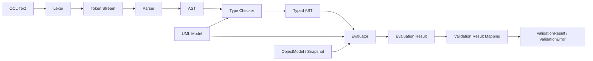
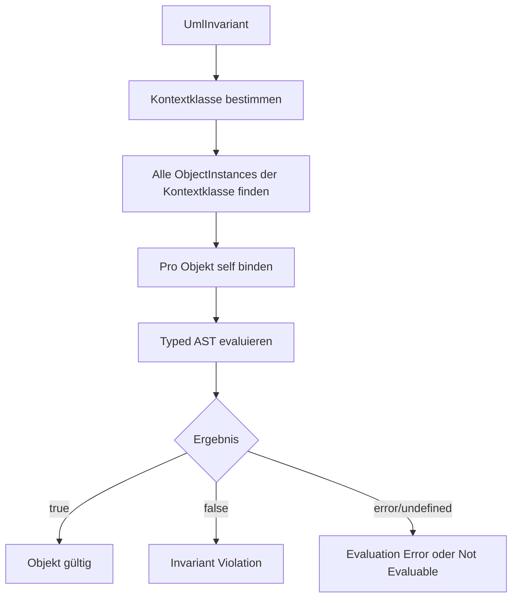
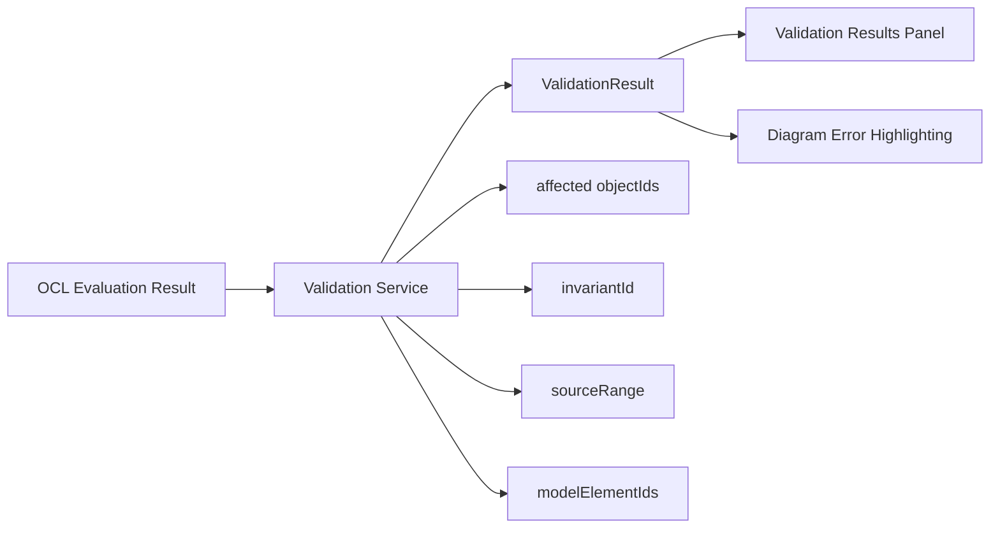
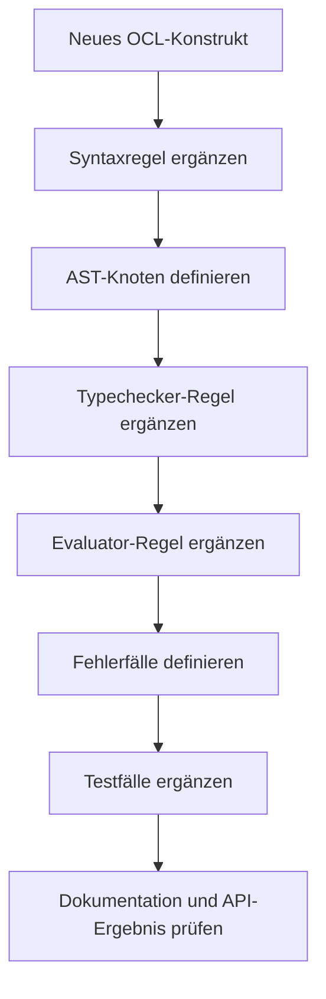

# OCL Architecture and Extension Strategy

## Zweck dieser Datei

Diese Datei beschreibt die fachliche Architektur der OCL-Verarbeitung im neuen UML/OCL-Websystem und die Strategie zur späteren Erweiterung des OCL-Sprachumfangs.

Der MVP soll nur ein begrenztes OCL-Subset unterstützen. Die Architektur muss aber von Beginn an so angelegt sein, dass neue OCL-Konstrukte schrittweise ergänzt werden können, ohne die gesamte Verarbeitung neu zu bauen.

Wichtige Leitlinie:

> OCL darf nicht als reine Regex- oder String-Auswertung umgesetzt werden. Das neue System braucht eine echte OCL-Verarbeitung mit Lexer, Parser, AST, Typechecker, Evaluator und strukturiertem Ergebnis.

Das originale USE-Projekt dient als fachliche Referenz für OCL-Konzepte, Syntax, Typechecking, Evaluation und Validierungsverhalten. Es wird keine Implementierung aus USE übernommen.

## OCL-Anforderungen

| Anforderung | MVP-Relevanz | Beschreibung |
|---|---|---|
| OCL-Invarianten speichern | Muss | Jede Invariante enthält Kontextklasse, Name und OCL-Ausdruck. |
| OCL syntaktisch prüfen | Muss | Fehlerhafte Ausdrücke müssen erkannt und mit Position gemeldet werden. |
| OCL typprüfen | Muss | Attribute, Rollen, Operatoren und Rückgabetypen müssen zum UML-Modell passen. |
| OCL gegen Snapshot auswerten | Muss | Invarianten werden gegen Objekte und Objektlinks des aktuellen Snapshots geprüft. |
| Betroffene Objekte ermitteln | Muss | Invariant-Verletzungen müssen auf konkrete Objekt-IDs abbildbar sein. |
| Strukturierte Fehler liefern | Muss | Frontend darf Fehler nicht aus Textmeldungen parsen müssen. |
| Erweiterbares AST-Modell | Muss | Neue OCL-Konstrukte sollen durch neue AST-Knoten ergänzt werden können. |
| Frontend-Feedback ermöglichen | Should | Syntax- und Typecheck-Fehler sollen im OCL Editor oder Properties Panel sichtbar werden. |
| Evaluation Trace ermöglichen | Later | Später kann eine detaillierte Auswertung pro Teilausdruck angezeigt werden. |

## Warum eine echte OCL-Engine notwendig ist

OCL ist keine einfache Mustererkennung. Selbst das MVP-Subset braucht Kontextwissen aus dem UML-Modell und konkrete Daten aus dem Snapshot.

Beispiel:

```ocl
self.borrowedBooks->size() <= 5
```

Dieser Ausdruck kann nur korrekt verarbeitet werden, wenn das System weiß:

- welche Klasse der Kontext von `self` ist,
- ob `borrowedBooks` eine Rolle an einer Association ist,
- ob die Navigation eine Collection ergibt,
- ob `size()` auf dieser Collection erlaubt ist,
- ob `<=` zwischen `Integer` und `Integer` zulässig ist,
- welche Objektlinks im Snapshot existieren,
- welche Objekte bei Verletzung markiert werden müssen.

Eine Regex-basierte Umsetzung könnte den Text oberflächlich erkennen, aber nicht robust typisieren, erweitern oder fachlich korrekt auswerten.

| Problem bei Regex/String-Auswertung | Konsequenz |
|---|---|
| Kein echtes Syntaxmodell | Klammern, Operatorpräzedenz und verschachtelte Ausdrücke werden fehleranfällig. |
| Kein Typechecking | Ungültige Attribute, Rollen oder Operatoren werden zu spät oder gar nicht erkannt. |
| Keine stabile Erweiterbarkeit | Neue Konstrukte wie `forAll` oder `let` erzwingen Ad-hoc-Sonderfälle. |
| Schlechte Fehlermeldungen | Frontend bekommt keine präzisen Positionen oder Fehlerarten. |
| Keine saubere Evaluation | Navigation, Collections und Snapshot-Bezug bleiben unklar. |
| Keine Testbarkeit | Einzelne Phasen lassen sich nicht isoliert prüfen. |

## Verarbeitungs-Pipeline

Die OCL-Verarbeitung soll fachlich in klar getrennten Phasen erfolgen:



Die Phasen haben unterschiedliche Verantwortlichkeiten:

| Phase | Hauptaufgabe | Eingabe | Ausgabe |
|---|---|---|---|
| Lexer | Text in Tokens zerlegen. | OCL-Text | Tokens mit Positionen |
| Parser | Tokenfolge syntaktisch strukturieren. | Tokens | AST oder Syntaxfehler |
| AST | Ausdrucksstruktur repräsentieren. | Parser-Ergebnis | Knotenbaum |
| Type Checker | Semantik und Typen prüfen. | AST + UML-Modell | Typed AST oder Type Errors |
| Evaluator | Ausdruck gegen Snapshot auswerten. | Typed AST + Snapshot | Wert oder Evaluation Error |
| Validation Mapping | Evaluation in UI-fähige Ergebnisse übersetzen. | Evaluationsergebnisse | Validation Results |

## Lexer

Der Lexer erkennt elementare Bestandteile des OCL-Texts.

MVP-relevante Token:

| Token-Kategorie | Beispiele |
|---|---|
| Schlüsselwörter | `self`, `true`, `false`, `and`, `or`, `not` |
| Identifier | `books`, `borrowedBooks`, `maxBooks` |
| Literale | `'Alice'`, `5`, `12.5`, `true` |
| Operatoren | `=`, `<>`, `<`, `<=`, `>`, `>=` |
| Navigation/Collection | `.`, `->` |
| Klammern | `(`, `)` |
| Trennzeichen | optional `,`, `:` für spätere Erweiterungen |

Der Lexer muss für jedes Token Quellpositionen liefern:

```json
{
  "kind": "IDENTIFIER",
  "text": "borrowedBooks",
  "start": 5,
  "end": 18
}
```

Diese Positionen sind wichtig für:

- Syntaxfehler,
- Typecheck-Fehler,
- UI-Markierung im OCL Editor,
- spätere Autocomplete- und Diagnosefunktionen.

## Parser

Der Parser erzeugt aus Tokens eine syntaktische Struktur.

MVP-Aufgaben:

- Operatorpräzedenz korrekt behandeln,
- Klammern auswerten,
- Attributzugriff und Navigation unterscheiden,
- Collection-Operationen erkennen,
- Literale und `self` korrekt einordnen,
- klare Syntaxfehler mit Position liefern.

Beispiel:

```ocl
(self.books <= 5) and self.active
```

Mögliche AST-Struktur:

```text
And
├─ LessOrEqual
│  ├─ PropertyAccess(self, books)
│  └─ IntegerLiteral(5)
└─ PropertyAccess(self, active)
```

Der Parser darf keine vollständige semantische Prüfung übernehmen. Er prüft, ob der Ausdruck syntaktisch formulierbar ist. Ob `books` ein gültiges Attribut ist, ist Aufgabe des Typecheckers.

## AST

Der AST ist die zentrale interne Struktur für Typechecking und Evaluation.

MVP-AST-Knoten:

| AST-Knoten | Zweck | Beispiel |
|---|---|---|
| `SelfExpression` | Kontextobjekt. | `self` |
| `PropertyAccessExpression` | Attribut- oder Rollen-Zugriff. | `self.books`, `self.borrowedBooks` |
| `NavigationExpression` | Explizite Association Navigation. | `self.borrowedBooks` |
| `CollectionOperationExpression` | `size`, `isEmpty`, `notEmpty`. | `self.books->size()` |
| `LiteralExpression` | String, Integer, Real, Boolean. | `5`, `'Alice'`, `true` |
| `ComparisonExpression` | Vergleichsoperatoren. | `self.books <= 5` |
| `BooleanExpression` | `and`, `or`, `not`. | `a and b` |
| `ParenthesizedExpression` | Gruppierung, optional später im AST vereinfachbar. | `(a)` |

Post-MVP-AST-Knoten:

| AST-Knoten | OCL-Konstrukt |
|---|---|
| `IteratorExpression` | `forAll`, `exists`, `select`, `collect` |
| `LetExpression` | `let` |
| `IfExpression` | `if-then-else` |
| `AllInstancesExpression` | `Class.allInstances` |
| `OperationCallExpression` | Operation Calls |
| `PreStateExpression` | `@pre` |
| `ResultExpression` | `result` in Postconditions |

Empfehlung:

- AST-Knoten sollten `sourceRange` enthalten.
- Typechecker sollte Typinformationen ergänzen, statt den Ursprungstext zu verlieren.
- AST muss nicht zwingend dauerhaft im Projektformat gespeichert werden; er kann aus dem OCL-Text neu erzeugt werden.

## Type Checker

Der Typechecker prüft den AST gegen das UML-Modell.

Er braucht:

- Kontextklasse der Invariante,
- bekannte primitive Typen,
- Klassen, Attribute und Assoziationsrollen,
- Multiplizitäten oder navigationsbezogene Kardinalitäten,
- Regeln für Operatoren und Collection-Operationen.

MVP-Typechecking:

| Prüfung | Beispiel | Erwartung |
|---|---|---|
| `self` hat Kontexttyp | `context User` | `self : User` |
| Attribut existiert | `self.books` | `books` muss Attribut von `User` sein. |
| Rolle existiert | `self.borrowedBooks` | Rolle muss über eine Association erreichbar sein. |
| Navigationstyp bestimmen | `self.borrowedBooks` | Ergebnis ist Objekt oder Collection. |
| Collection-Operation erlaubt | `self.borrowedBooks->size()` | Ziel muss Collection sein. |
| Vergleichstypen passen | `self.books <= 5` | Beide Seiten numerisch oder vergleichbar. |
| Boolean-Operatoren passen | `a and b` | Beide Operanden müssen Boolean sein. |
| Invariante ergibt Boolean | `inv maxBooks: ...` | Gesamtausdruck muss Boolean sein. |

Beispiel für Typecheck-Fehler:

```ocl
self.unknownAttribute <= 5
```

Möglicher Fehler:

```json
{
  "code": "OCL_TYPE_ERROR",
  "message": "Unknown property 'unknownAttribute' for context class 'User'.",
  "sourceRange": { "start": 5, "end": 21 },
  "modelElementIds": ["class-user"]
}
```

Typechecking soll explizit als eigene Phase modelliert werden. Das ist ein bewusster Unterschied zu enger gekoppelten Parser-/AST-Generierungsansätzen.

## Evaluator

Der Evaluator wertet einen typgeprüften AST gegen einen Snapshot aus.

Er braucht:

- das UML-Modell,
- den aktuellen `ObjectModel`/Snapshot,
- eine Variable Binding für `self`,
- Zugriff auf Slots und Objektlinks,
- typisierte Werte,
- Regeln für Collection-Operationen.

Evaluation einer Invariante:



Beispiel:

```ocl
self.borrowedBooks->size() <= 5
```

Auswertungsschritte:

1. `self` wird an `obj-alice` gebunden.
2. Navigation `borrowedBooks` sucht Links über die passende Association Role.
3. Ergebnis ist eine Collection von `Book`-Objekten.
4. `size()` zählt die Collection.
5. `<= 5` vergleicht den Zählwert.
6. `false` erzeugt eine `INVARIANT_VIOLATION` für `obj-alice`.

## Validation Result Mapping

Die OCL Engine soll keine UI-Elemente direkt manipulieren. Sie liefert strukturierte Ergebnisse, die der Validation Service in `ValidationResult` und `ValidationError` übersetzt.



MVP-Mapping:

| OCL-Ergebnis | Validation Mapping | UI-Wirkung |
|---|---|---|
| Ausdruck ergibt `true` | Kein Fehler. | Keine Markierung. |
| Ausdruck ergibt `false` | `INVARIANT_VIOLATION`. | Betroffene Objekte markieren. |
| Syntaxfehler | `OCL_SYNTAX_ERROR`. | Ausdruck im Editor/Panel markieren. |
| Typecheck-Fehler | `OCL_TYPE_ERROR`. | Invariante und ggf. Modellbestandteil markieren. |
| Evaluation-Fehler | `EVALUATION_ERROR` oder `NOT_EVALUABLE`. | Fehler im Validation Panel anzeigen. |

Wichtige Felder für Validation Errors:

- `code`,
- `severity`,
- `message`,
- `invariantId`,
- `objectIds`,
- `linkIds`,
- `modelElementIds`,
- `sourceRange`,
- `details`.

## MVP-OCL-Subset

| OCL-Konstrukt | Status | Beispiel | Hinweise |
|---|---|---|---|
| `self` | Muss | `self` | Kontextobjekt. |
| Attributzugriff | Muss | `self.books` | Attribut der Kontextklasse. |
| Einfache Association Navigation | Muss | `self.borrowedBooks` | Über Rollen an binären Assoziationen. |
| String-Literale | Muss | `'Alice'` | Schreibweise final festlegen. |
| Integer-Literale | Muss | `5` | Für Zählwerte und Vergleiche. |
| Real-Literale | Muss | `12.5` | Für numerische Attribute. |
| Boolean-Literale | Muss | `true`, `false` | Für boolesche Attribute und Ausdrücke. |
| Vergleichsoperatoren | Muss | `=`, `<>`, `<`, `<=`, `>`, `>=` | Typkompatibilität prüfen. |
| Boolean-Operatoren | Muss | `and`, `or`, `not` | Ergebnis jeweils Boolean. |
| Klammern | Muss | `(self.books <= 5)` | Gruppierung. |
| `size` | Muss | `self.borrowedBooks->size() <= 5` | Collection-Grundoperation. |
| `isEmpty` | Muss | `self.borrowedBooks->isEmpty()` | Collection-Grundoperation. |
| `notEmpty` | Muss | `self.borrowedBooks->notEmpty()` | Collection-Grundoperation. |

MVP-Beispiele:

```ocl
self.books <= 5
```

```ocl
self.borrowedBooks->size() <= 5
```

```ocl
self.name <> ''
```

```ocl
self.active and self.borrowedBooks->notEmpty()
```

Hinweis: Original-USE-Beispiele verwenden teilweise `->size` ohne Klammern. Für das neue System sollte eine kanonische MVP-Schreibweise festgelegt werden. Eine pragmatische Entscheidung wäre, im MVP `size()`, `isEmpty()` und `notEmpty()` zu dokumentieren und optional die USE-nahe Schreibweise später zu akzeptieren.

## Post-MVP-Erweiterungen

| Konstrukt | Beschreibung | Architekturauswirkung |
|---|---|---|
| `forAll` | Alle Elemente einer Collection erfüllen Bedingung. | Iterator-AST, Variable Scopes, Collection Typechecking. |
| `exists` | Mindestens ein Element erfüllt Bedingung. | Iterator-AST, Boolean-Auswertung über Collections. |
| `select` | Collection filtern. | Collection-Ergebnis-Typen, Iterator-Scopes. |
| `collect` | Werte aus Collection projizieren. | Ergebnis-Collection-Typ aus Body-Typ ableiten. |
| `includes` | Membership-Prüfung. | Elementtyp-Kompatibilität prüfen. |
| `excludes` | Negierte Membership-Prüfung. | Wie `includes`. |
| `if-then-else` | Bedingter Ausdruck. | Branch-Typen vereinheitlichen. |
| `let` | Lokale Variable. | Symboltabelle und Scope-Stack. |
| `allInstances` | Alle Objekte einer Klasse. | Klassenreferenz im AST, Snapshot-weite Evaluation. |
| Preconditions | Vorbedingungen für Operationen. | Operation-Kontext, Parameterbindung. |
| Postconditions | Nachbedingungen für Operationen. | Pre-/Post-Snapshot, `result`, `@pre`. |
| Derived Attributes | Berechnete Attribute. | Attributauswertung über OCL, Zyklusprüfung. |
| Init Values | Initialwerte für Slots. | Objektanlage und Default Evaluation. |

## Erweiterungsstrategie

Neue OCL-Konstrukte sollen über definierte Erweiterungspunkte ergänzt werden.



Für jedes neue Konstrukt muss dokumentiert werden:

| Frage | Beispiel für `forAll` |
|---|---|
| Welche Syntax wird akzeptiert? | `self.books->forAll(b | b.available)` |
| Welche AST-Node wird benötigt? | `IteratorExpression(kind=forAll)` |
| Welche Typregeln gelten? | Source muss Collection sein, Body muss Boolean sein. |
| Welche Variablen werden gebunden? | Iteratorvariable `b`. |
| Wie wird evaluiert? | Body für jedes Collection-Element auswerten. |
| Welche Fehler können auftreten? | Nicht-Collection-Source, falscher Body-Typ, unbekannte Iteratorvariable. |
| Welche Tests sind nötig? | Leerfall, gültiger Fall, verletzter Fall, Type Error. |

Empfohlene Reihenfolge nach dem MVP:

1. `includes` / `excludes`
2. `forAll`
3. `exists`
4. `select`
5. `collect`
6. `if-then-else`
7. `let`
8. `allInstances`
9. derived attributes und init values
10. preconditions und postconditions

Diese Reihenfolge ist pragmatisch: Erst einfache Collection-Operationen, dann Iteratoren, danach komplexere Scope- und Zustandskonzepte.

## Fehlerbehandlung

OCL-Fehler sollen nach Phase getrennt werden.

| Phase | Fehlercode | Beispiel |
|---|---|---|
| Lexer | `OCL_LEXICAL_ERROR` | Unerlaubtes Zeichen. |
| Parser | `OCL_SYNTAX_ERROR` | Fehlende Klammer. |
| Type Checker | `OCL_TYPE_ERROR` | Unbekanntes Attribut oder falscher Operator. |
| Evaluator | `EVALUATION_ERROR` | Navigation nicht auswertbar. |
| Validation Mapping | `INVARIANT_VIOLATION` | Ausdruck ergibt `false`. |

Beispielhafte Fehlerstruktur:

```json
{
  "code": "OCL_TYPE_ERROR",
  "severity": "ERROR",
  "message": "Operation 'size' can only be used on a collection.",
  "invariantId": "inv-user-max-books",
  "modelElementIds": ["class-user"],
  "objectIds": [],
  "linkIds": [],
  "sourceRange": {
    "expressionId": "expr-user-max-books",
    "start": 12,
    "end": 18
  }
}
```

Fehlerbehandlungsprinzipien:

- Syntaxfehler verhindern Typechecking.
- Typecheck-Fehler verhindern Evaluation.
- Strukturfehler im Snapshot können OCL-Evaluation verhindern oder als separate Validation Errors erscheinen.
- Eine verletzte Invariante ist kein technischer Fehler, sondern ein fachlicher Validierungsbefund.
- Fehlermeldungen müssen für Nutzer verständlich sein und gleichzeitig maschinenlesbare Codes liefern.

## Typprüfung

Der Typechecker arbeitet mit einem symbolischen Kontext.

MVP-Kontext einer Invariante:

| Symbol | Typ |
|---|---|
| `self` | Kontextklasse der Invariante |

Beispiel:

```ocl
context User inv maxBooks:
  self.borrowedBooks->size() <= 5
```

Typechecking:

| Teilausdruck | Typregel | Ergebnis |
|---|---|---|
| `self` | Kontextklasse ist `User`. | `User` |
| `self.borrowedBooks` | Rolle an Association von `User` zu `Book`. | `Collection(Book)` |
| `size()` | Auf Collection erlaubt. | `Integer` |
| `5` | Integer-Literal. | `Integer` |
| `<=` | Numerischer Vergleich. | `Boolean` |
| Gesamtausdruck | Invariante muss Boolean sein. | gültig |

Post-MVP braucht der Typechecker zusätzlich:

- Symboltabellen für Iteratorvariablen,
- lokale Bindungen für `let`,
- Typvereinheitlichung für `if-then-else`,
- Pre-/Post-Kontexte für `@pre`,
- `result`-Variable für Postconditions,
- Vererbung und Subtyping,
- Collection-Typen mit Elementtypen.

## Auswertung gegen Snapshots

Die OCL-Auswertung erfolgt gegen das `ObjectModel`.

MVP-Auswertung einer Invariante:

1. Kontextklasse lesen.
2. Alle Objekte im Snapshot finden, deren `classId` der Kontextklasse entspricht.
3. Für jedes Objekt `self` binden.
4. Typed AST evaluieren.
5. Ergebnis interpretieren:
   - `true`: Objekt erfüllt Invariante.
   - `false`: Objekt verletzt Invariante.
   - Fehler/undefined: Ausdruck nicht auswertbar oder Evaluation Error.
6. Validation Result mit betroffenen Objekt-IDs erzeugen.

Navigation gegen Snapshot:

| Ausdruck | Auswertungslogik |
|---|---|
| `self.attribute` | Slot mit passender `attributeId` am aktuellen Objekt lesen. |
| `self.role` | Objektlinks finden, die über eine Association mit passender Rolle erreichbar sind. |
| `navigation->size()` | Navigierte Collection zählen. |
| `navigation->isEmpty()` | Prüfen, ob Collection leer ist. |
| `navigation->notEmpty()` | Prüfen, ob Collection nicht leer ist. |

Offen bleibt für den MVP, wie fehlende Slot-Werte exakt behandelt werden:

- als `undefined`,
- als `null`,
- als Validation Error,
- als nicht auswertbarer Ausdruck.

Diese Entscheidung muss vor Implementierung der OCL Engine verbindlich getroffen werden.

## Backend-/Frontend-Zusammenspiel

### Backend-Verantwortung

Das Backend ist die autoritative Stelle für OCL-Semantik.

| Aufgabe | Backend |
|---|---|
| OCL lexen/parsen | Ja |
| AST erzeugen | Ja |
| OCL typprüfen | Ja |
| OCL gegen Snapshot evaluieren | Ja |
| Validation Results erzeugen | Ja |
| Fehlercodes und Source Ranges liefern | Ja |
| Betroffene Objekt- und Link-IDs liefern | Ja |

### Frontend-Verantwortung

Das Frontend macht OCL sichtbar und nutzbar.

| Aufgabe | Frontend |
|---|---|
| OCL-Ausdruck eingeben | Ja |
| Invariant Properties anzeigen | Ja |
| Syntax-/Typecheck-Feedback anzeigen | Ja, auf Basis Backend-Ergebnis |
| Check Constraints auslösen | Ja |
| Validation Results rendern | Ja |
| Betroffene Diagrammelemente markieren | Ja |
| Autocomplete | Post-MVP |
| Lokales vollständiges Typechecking | Nein im MVP |

Das Frontend kann einfache Komfortprüfungen durchführen, darf aber nicht die fachlich verbindliche OCL-Semantik ersetzen.

## Bezug zum originalen USE-Projekt

Das originale USE-Projekt zeigt eine reife OCL-Verarbeitung, die fachlich als Referenz dient.

| USE-Bereich | Relevanz | Nutzung im neuen System |
|---|---|---|
| `use-core/src/main/java/org/tzi/use/parser/ocl/OCLCompiler.java` | OCL-Compile-Ablauf. | Fachliche Referenz für Parse- und Semantikphasen. |
| `use-core/src/main/java/org/tzi/use/uml/ocl/expr/` | Ausdrucksmodell. | Referenz für AST-/Expression-Konzepte. |
| `use-core/src/main/java/org/tzi/use/uml/ocl/type/` | OCL-Typmodell. | Referenz für Typechecking. |
| `use-core/src/main/java/org/tzi/use/uml/ocl/value/` | Wertmodell. | Referenz für Evaluationswerte. |
| `use-core/src/main/java/org/tzi/use/uml/ocl/expr/Evaluator.java` | Evaluation gegen Systemzustand. | Verhaltenreferenz für Auswertung. |
| `use-core/src/main/java/org/tzi/use/uml/mm/MClassInvariant.java` | Invariantenkontext und `self`. | Referenz für Klasseninvarianten. |
| `use-core/src/main/java/org/tzi/use/uml/sys/MSystemState.java` | Check-Ablauf und Invariantenauswertung. | Verhaltenreferenz für Validation Flow. |
| `use-core/src/main/resources/examples/Documentation/Cars/Cars.use` | Einfache Invariante. | MVP-Testfallquelle. |
| `use-core/src/main/resources/examples/Documentation/Demo/Demo.use` | Navigation, Collections, Invarianten. | MVP-/Post-MVP-Testfallquelle. |

Nicht übernommen werden:

- USE-OCL-Klassen als Dependency,
- ANTLR-3-Grammatik als direkte technische Grundlage,
- interne `Expression`- und `Value`-Klassen,
- Textausgabeformate,
- vollständiger USE-OCL-Umfang im MVP.

## Risiken

| Risiko | Auswirkung | Gegenmaßnahme |
|---|---|---|
| OCL-Subset wächst unkontrolliert | MVP wird zu groß. | Harte MVP-Liste und Post-MVP-Liste pflegen. |
| Regex-basierte Abkürzung | Erweiterbarkeit bricht früh. | Pipeline mit AST und Typechecker verbindlich machen. |
| Typechecking zu spät betrachtet | Fehler erscheinen erst bei Evaluation. | Typechecker als eigene Phase dokumentieren und testen. |
| Undefined-/Invalid-Semantik unklar | Uneinheitliche Evaluation. | MVP-Regeln vor Implementierung festlegen. |
| Navigation ohne klare Rollenregeln | OCL-Ausdrücke werden mehrdeutig. | Rollen und Navigierbarkeit explizit im Modell führen. |
| Fehler ohne Element-IDs | Frontend kann nichts markieren. | Validation Error Contract mit IDs verpflichtend machen. |
| USE-Kompatibilität zu früh priorisiert | MVP wird unnötig komplex. | `.use` Import/Export Post-MVP halten. |
| AST zu eng für MVP gebaut | Spätere Features schwer ergänzbar. | Node-Kategorien und Extension Points bewusst offen halten. |

## Offene Fragen

| Frage | Bedeutung |
|---|---|
| Soll der MVP `->size` ohne Klammern akzeptieren oder nur `->size()`? | Einfluss auf Parser und USE-Nähe. |
| Welche String-Literal-Schreibweise ist verbindlich: einfache oder doppelte Anführungszeichen? | Einfluss auf Lexer und UI-Beispiele. |
| Wie werden fehlende Slot-Werte behandelt? | Einfluss auf Evaluation und Fehlercodes. |
| Soll bei Snapshot-Strukturfehlern OCL-Evaluation abgebrochen werden? | Einfluss auf Validation Flow. |
| Werden alle Association Ends im MVP als navigierbar behandelt? | Einfluss auf OCL-Navigation. |
| Wie wird Single-Navigation bei mehreren Zielobjekten behandelt? | Einfluss auf Evaluation Errors und Multiplicity Checks. |
| Wird der AST im Projekt gespeichert oder pro Check neu erzeugt? | Einfluss auf Persistenz, Performance und Debugging. |
| Soll der OCL Editor im MVP Syntaxfeedback beim Tippen oder erst beim Speichern/Check anzeigen? | Einfluss auf Frontend/API-Flows. |

## Zusammenfassung

Die OCL-Architektur des neuen Systems soll klein starten, aber fachlich sauber aufgebaut sein.

Für den MVP reicht ein begrenztes OCL-Subset:

- `self`,
- Attributzugriff,
- einfache Association Navigation,
- Literale,
- Vergleichsoperatoren,
- Boolean-Operatoren,
- Klammern,
- `size`,
- `isEmpty`,
- `notEmpty`.

Trotz dieses kleinen Subsets braucht das System eine echte Pipeline:

```text
Lexer -> Parser -> AST -> Type Checker -> Evaluator -> Validation Result
```

Diese Pipeline ermöglicht präzise Fehler, Backend-validierte Semantik, UI-Markierung betroffener Elemente und spätere Erweiterungen wie `forAll`, `exists`, `let`, `if-then-else`, `allInstances`, Pre-/Postconditions, derived attributes und init values.

USE liefert dafür wichtige fachliche Referenzen, aber keine technische Grundlage. Das neue System baut eine eigene OCL Engine, die auf das eigene UML-Modell, den eigenen Snapshot und den eigenen Validation Result Contract ausgerichtet ist.
