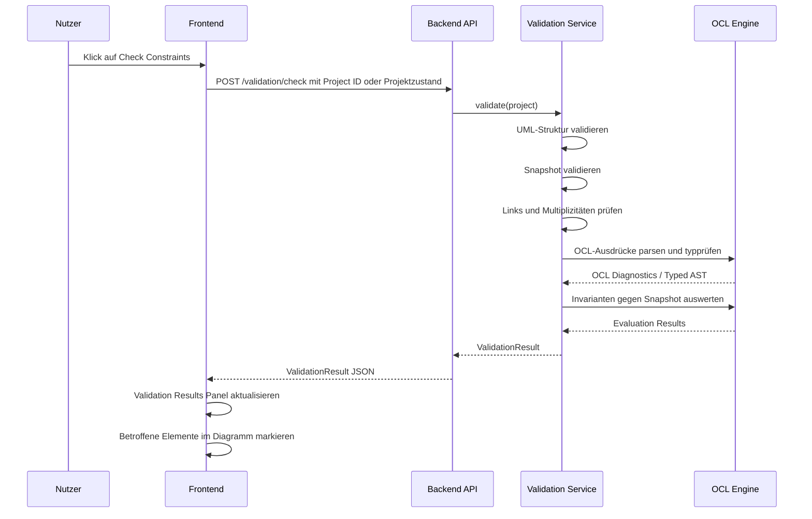
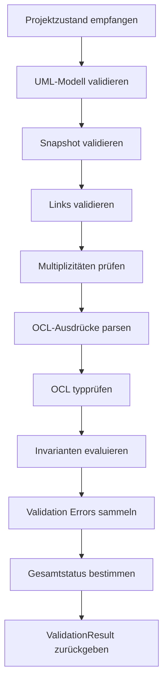
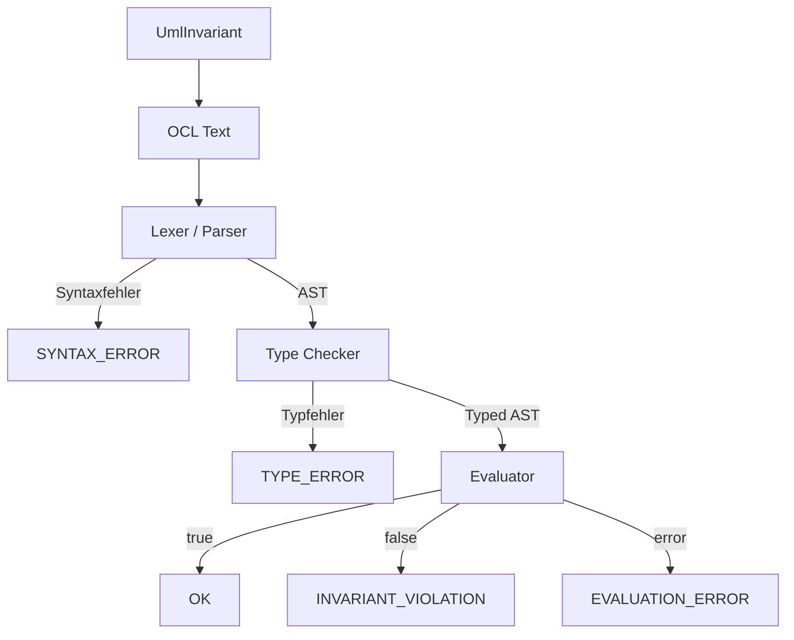
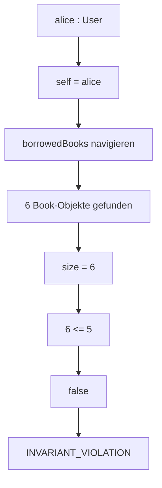

# Validation Concept

## Zweck dieser Datei

Diese Datei beschreibt das fachliche Validierungskonzept des neuen UML/OCL-Websystems.

Validierung bedeutet hier nicht nur OCL-Auswertung. Eine vollständige Prüfung umfasst:

- UML-Modellvalidierung,
- Typvalidierung,
- Objektzustandsvalidierung,
- Linkvalidierung,
- Multiplizitätsvalidierung,
- OCL-Syntaxprüfung,
- OCL-Typprüfung,
- OCL-Invariantenauswertung,
- strukturierte Validierungsergebnisse für Backend, API und Frontend.

Das originale USE-Projekt dient als fachliche Referenz für Validierungsverhalten, insbesondere durch Modellstruktur, Systemzustände, Multiplizitätsprüfung und Invariantenauswertung. Die technische Implementierung wird nicht übernommen.

## Validierungsziele

| Ziel | Beschreibung |
|---|---|
| Fachliche Konsistenz prüfen | Das Klassenmodell, der Snapshot und die Invarianten müssen zusammenpassen. |
| Fehler früh erkennen | Struktur-, Typ- und OCL-Fehler sollen getrennt und verständlich gemeldet werden. |
| Backend als Semantikquelle nutzen | Die verbindliche Validierung erfolgt zentral im Backend. |
| UI-Markierung ermöglichen | Fehler müssen auf Klassen, Objekte, Links, Invarianten oder OCL-Textbereiche verweisen können. |
| Ergebnisse maschinenlesbar machen | Das Frontend darf keine Textausgaben parsen müssen. |
| MVP klein halten | Der MVP validiert Kernkonzepte, bleibt aber für spätere UML/OCL-Erweiterungen offen. |

## Validierungsebenen

| Ebene | Prüft | Typische Fehler |
|---|---|---|
| UML-Strukturvalidierung | Klassen, Attribute, Operationen, Assoziationen, Rollen, Multiplizitäten. | `UNKNOWN_CLASS`, `TYPE_ERROR`, `SYNTAX_ERROR` |
| Typvalidierung | Primitive Typen, Attributtypen, Slot-Werte, OCL-Typen. | `TYPE_ERROR`, `INVALID_SLOT_VALUE` |
| Snapshot-Validierung | Objekte, Slots, Objektlinks und Referenzen auf das UML-Modell. | `UNKNOWN_CLASS`, `UNKNOWN_ATTRIBUTE`, `INVALID_LINK` |
| Multiplizitätsvalidierung | Anzahl der Links pro Association End und Objekt. | `MULTIPLICITY_VIOLATION` |
| OCL-Syntaxprüfung | Lexing und Parsing der OCL-Ausdrücke. | `SYNTAX_ERROR` |
| OCL-Typprüfung | Existenz von Attributen/Rollen, Operator- und Collection-Typen. | `TYPE_ERROR`, `UNKNOWN_ATTRIBUTE` |
| OCL-Invariantenauswertung | Boolean-Ergebnis einer Invariante pro Objekt der Kontextklasse. | `INVARIANT_VIOLATION`, `EVALUATION_ERROR` |
| Ergebnis-Mapping | Elementbezug, Severity, Codes, UI-relevante Referenzen. | unvollständige oder nicht mappbare Fehler |

## Ablauf einer vollständigen Validierung

Beim Klick auf `Check Constraints` wird eine vollständige fachliche Prüfung ausgelöst.



Der fachliche Ablauf im Backend:



Empfohlene Regel für den MVP:

- Struktur- und Typfehler werden immer gemeldet.
- Wenn ein OCL-Ausdruck syntaktisch oder typbezogen ungültig ist, wird diese Invariante nicht evaluiert.
- Wenn der Snapshot strukturell schwer fehlerhaft ist, können betroffene OCL-Auswertungen als `EVALUATION_ERROR` oder `NOT_EVALUABLE` erscheinen.
- Der Gesamtstatus ist `VALID`, wenn keine Fehler vorhanden sind.

## UML-Strukturvalidierung

Die UML-Strukturvalidierung prüft das Klassenmodell unabhängig vom konkreten Snapshot.

| Prüfung | Beschreibung | Fehlercode | Elementbezug |
|---|---|---|---|
| Eindeutige Klassennamen | Klassen dürfen im Modell nicht doppelt benannt sein. | `TYPE_ERROR` | `classIds` |
| Gültige Attributtypen | Attributtyp muss bekannt sein. | `TYPE_ERROR` | `classId`, `attributeId` |
| Eindeutige Attributnamen pro Klasse | Eine Klasse darf nicht zwei gleichnamige Attribute besitzen. | `TYPE_ERROR` | `classId`, `attributeIds` |
| Gültige Operationstypen | Parameter- und Rückgabetypen müssen bekannt sein. | `TYPE_ERROR` | `operationId` |
| Assoziationsenden referenzieren Klassen | Jedes Association End braucht eine existierende Klasse. | `UNKNOWN_CLASS` | `associationId`, `associationEndId` |
| Rollen sind gültig | Rollen müssen nicht leer und für Navigation eindeutig genug sein. | `TYPE_ERROR` | `associationEndId` |
| Multiplizitäten sind gültig | Untere und obere Grenze müssen zulässig sein. | `SYNTAX_ERROR` oder `TYPE_ERROR` | `associationEndId` |
| Invarianten referenzieren Kontextklasse | Kontextklasse einer Invariante muss existieren. | `UNKNOWN_CLASS` | `invariantId`, `classId` |

Beispiel:

```json
{
  "code": "UNKNOWN_CLASS",
  "severity": "ERROR",
  "message": "Association end references unknown class 'Member'.",
  "modelElementIds": ["assocend-borrows-member"],
  "objectIds": [],
  "linkIds": [],
  "invariantId": null
}
```

## Snapshot-Validierung

Snapshot-Validierung prüft, ob das `ObjectModel` zum `UmlModel` passt.

| Prüfung | Beschreibung | Fehlercode | Elementbezug |
|---|---|---|---|
| Objektklasse existiert | Jedes Objekt referenziert eine existierende Klasse. | `UNKNOWN_CLASS` | `objectId`, `classId` |
| Objektname eindeutig | Objektnamen sollen im Snapshot eindeutig sein. | `TYPE_ERROR` | `objectIds` |
| Slot-Attribut existiert | Jeder Slot referenziert ein Attribut der Objektklasse. | `UNKNOWN_ATTRIBUTE` | `objectId`, `slotId`, `attributeId` |
| Slot-Wert passt zum Typ | Der Wert muss zum Attributtyp passen. | `INVALID_SLOT_VALUE` | `objectId`, `slotId`, `attributeId` |
| Pflicht-Slots vorhanden | Für MVP ist zu klären, ob jedes Attribut einen Slot braucht. | `INVALID_SLOT_VALUE` oder Warning | `objectId`, `attributeId` |
| Link-Assoziation existiert | Jeder Link referenziert eine existierende Association. | `INVALID_LINK` | `linkId`, `associationId` |
| Link-Ende passt zur Association | Jedes Link-Ende referenziert ein existierendes Association End. | `INVALID_LINK` | `linkId`, `associationEndId` |
| Link-Objekt passt zur Klasse | Objekt am Link-Ende muss Instanz der Klasse des Association Ends sein. | `INVALID_LINK` | `linkId`, `objectId`, `associationEndId` |

Beispiel für ungültigen Slot-Wert:

```json
{
  "code": "INVALID_SLOT_VALUE",
  "severity": "ERROR",
  "message": "Slot 'books' of object 'alice' expects Integer but contains String.",
  "modelElementIds": ["attr-user-books"],
  "objectIds": ["obj-alice"],
  "linkIds": [],
  "details": {
    "expectedType": "Integer",
    "actualType": "String"
  }
}
```

## Multiplizitätsvalidierung

Multiplizitätsvalidierung prüft, ob Objektlinks die Multiplizitäten der Association Ends erfüllen.

Fachliche Regel:

```text
Für jedes Association End und jedes passende Objekt:
  Zähle die verbundenen Zielobjekte.
  Prüfe count gegen lower/upper/unbounded.
```

Beispiel:

| Association | End | Multiplicity | Objekt | Linkanzahl | Ergebnis |
|---|---|---|---|---:|---|
| `Borrows` | `borrowedBooks` | `0..5` | `alice` | 6 | Fehler |
| `Borrows` | `borrower` | `0..*` | `mobyDick` | 1 | OK |

Fehlerformat:

```json
{
  "code": "MULTIPLICITY_VIOLATION",
  "severity": "ERROR",
  "message": "Object 'alice' has 6 linked Book objects for role 'borrowedBooks', but multiplicity is 0..5.",
  "modelElementIds": ["assocend-borrows-book"],
  "objectIds": ["obj-alice"],
  "linkIds": [
    "link-alice-book-1",
    "link-alice-book-2",
    "link-alice-book-3",
    "link-alice-book-4",
    "link-alice-book-5",
    "link-alice-book-6"
  ],
  "details": {
    "associationId": "assoc-borrows",
    "roleName": "borrowedBooks",
    "expectedMultiplicity": "0..5",
    "actualCount": 6
  }
}
```

Die Multiplizitätsprüfung ist unabhängig von OCL. Eine OCL-Invariante wie `self.borrowedBooks->size() <= 5` kann fachlich ähnlich wirken, ist aber ein separater Constraint-Typ.

## OCL-Validierung

OCL-Validierung besteht aus drei Stufen:

1. Syntaxprüfung,
2. Typprüfung,
3. Invariantenauswertung.



### OCL-Syntaxprüfung

| Prüfung | Beispiel | Fehlercode |
|---|---|---|
| Token erkennbar | Unerlaubtes Zeichen | `SYNTAX_ERROR` |
| Klammern korrekt | Fehlende schließende Klammer | `SYNTAX_ERROR` |
| Operatorfolge gültig | `self.books <= <= 5` | `SYNTAX_ERROR` |
| Collection-Aufruf syntaktisch gültig | `self.books->` | `SYNTAX_ERROR` |

### OCL-Typprüfung

| Prüfung | Beispiel | Fehlercode |
|---|---|---|
| Kontextklasse existiert | `context User` | `UNKNOWN_CLASS` |
| Attribut existiert | `self.books` | `UNKNOWN_ATTRIBUTE` |
| Rolle existiert | `self.borrowedBooks` | `UNKNOWN_ATTRIBUTE` oder `TYPE_ERROR` |
| Collection-Operation erlaubt | `self.name->size()` | `TYPE_ERROR` |
| Vergleichstypen passen | `self.books <= 'five'` | `TYPE_ERROR` |
| Invariante ergibt Boolean | `self.name` | `TYPE_ERROR` |

### OCL-Invariantenauswertung

Für jede Invariante:

1. Kontextklasse bestimmen.
2. Alle Objekte der Kontextklasse im Snapshot finden.
3. Pro Objekt `self` binden.
4. Ausdruck auswerten.
5. Bei `false` eine `INVARIANT_VIOLATION` mit betroffener Objekt-ID erzeugen.

Beispiel:

```ocl
context User inv maxBooks:
  self.borrowedBooks->size() <= 5
```

## Fehlerklassen

Die folgenden Fehlerklassen bilden die fachliche MVP-Basis.

| Fehlercode | Ebene | Bedeutung | Typische Referenzen |
|---|---|---|---|
| `SYNTAX_ERROR` | Modell/OCL | Syntax ist ungültig. | `sourceRange`, `invariantId`, `modelElementIds` |
| `TYPE_ERROR` | Modell/OCL | Typen passen nicht zusammen oder ein Ausdruck ist nicht boolean. | `attributeId`, `invariantId`, `sourceRange` |
| `UNKNOWN_CLASS` | Modell/Snapshot/OCL | Referenzierte Klasse existiert nicht. | `classId`, `objectId`, `associationEndId`, `invariantId` |
| `UNKNOWN_ATTRIBUTE` | Snapshot/OCL | Referenziertes Attribut oder Property existiert nicht. | `attributeId`, `slotId`, `invariantId`, `sourceRange` |
| `INVALID_SLOT_VALUE` | Snapshot | Slot-Wert passt nicht zum Attributtyp oder ist nicht zulässig. | `objectId`, `slotId`, `attributeId` |
| `INVALID_LINK` | Snapshot | Objektlink passt nicht zu Association oder Association Ends. | `linkId`, `associationId`, `associationEndId`, `objectId` |
| `MULTIPLICITY_VIOLATION` | Snapshot/UML | Linkanzahl verletzt Multiplizität. | `associationEndId`, `objectId`, `linkIds` |
| `INVARIANT_VIOLATION` | OCL/Evaluation | OCL-Invariante ergibt `false`. | `invariantId`, `objectIds`, `sourceRange` |
| `EVALUATION_ERROR` | OCL/Evaluation | Ausdruck kann zur Laufzeit nicht ausgewertet werden. | `invariantId`, `objectIds`, `sourceRange` |

Severity-Stufen:

| Severity | Bedeutung |
|---|---|
| `ERROR` | Zustand ist fachlich ungültig oder Prüfung kann nicht korrekt abgeschlossen werden. |
| `WARNING` | Zustand ist auffällig, aber nicht zwingend ungültig. Für den MVP optional. |
| `INFO` | Zusatzinformation, z. B. erfolgreiche Prüfung. Für den MVP optional. |

## Validation Result Format

Das Validation Result muss stabil genug sein, damit Frontend, Tests und API darauf aufbauen können.

Empfohlenes Format:

```json
{
  "id": "validation-001",
  "projectId": "project-library",
  "umlModelId": "uml-library",
  "objectModelId": "snapshot-main",
  "status": "INVALID",
  "checkedAt": "2026-07-11T17:00:00Z",
  "summary": {
    "errorCount": 1,
    "warningCount": 0,
    "infoCount": 0
  },
  "errors": [
    {
      "id": "error-001",
      "code": "INVARIANT_VIOLATION",
      "severity": "ERROR",
      "message": "Object 'alice' violates invariant 'maxBooks'.",
      "modelElementIds": ["class-user"],
      "objectIds": ["obj-alice"],
      "linkIds": [],
      "invariantId": "inv-user-max-books",
      "sourceRange": {
        "expressionId": "expr-user-max-books",
        "start": 0,
        "end": 33
      },
      "details": {
        "contextClass": "User",
        "invariantName": "maxBooks",
        "expression": "self.borrowedBooks->size() <= 5"
      }
    }
  ]
}
```

Statuswerte:

| Status | Bedeutung |
|---|---|
| `VALID` | Keine Fehler gefunden. |
| `INVALID` | Mindestens ein fachlicher Fehler oder Constraint-Verstoß. |
| `NOT_EVALUABLE` | Prüfung konnte wegen Syntax-, Typ- oder Strukturproblemen nicht vollständig durchgeführt werden. |

## Frontend-Mapping

Das Frontend nutzt Validation Results für zwei Hauptaufgaben:

1. textuelle Darstellung im Validation Results Panel,
2. visuelle Markierung im Diagramm.

| Validation-Feld | Frontend-Nutzung |
|---|---|
| `status` | Anzeige von gültig/ungültig/nicht auswertbar. |
| `summary.errorCount` | Fehleranzahl im Panel oder Badge. |
| `code` | Icon, Farbe, Gruppierung oder Filter. |
| `message` | Haupttext im Validation Results Panel. |
| `modelElementIds` | Markierung von Klassen, Attributen, Association Ends oder Invarianten. |
| `objectIds` | Markierung von Objekten im Objektdiagramm. |
| `linkIds` | Markierung von Objektlinks im Objektdiagramm. |
| `invariantId` | Navigation zur Invariante oder Anzeige im Properties Panel. |
| `sourceRange` | Markierung im OCL Editor oder Invariant Properties. |
| `details` | Zusatzinformationen im aufgeklappten Fehlerdetail. |

Mapping-Regeln:

| Fehlercode | Primäre UI-Markierung |
|---|---|
| `SYNTAX_ERROR` | OCL-Ausdruck oder Eingabefeld. |
| `TYPE_ERROR` | OCL-Ausdruck und betroffener Modellbestandteil. |
| `UNKNOWN_CLASS` | Modellreferenz, Objekt oder Association End. |
| `UNKNOWN_ATTRIBUTE` | Slot, Attribut oder OCL-Ausdruck. |
| `INVALID_SLOT_VALUE` | Objekt und konkreter Slot. |
| `INVALID_LINK` | Objektlink und beteiligte Objekte. |
| `MULTIPLICITY_VIOLATION` | Association End, Objekt und betroffene Links. |
| `INVARIANT_VIOLATION` | Betroffenes Objekt und Invariante. |
| `EVALUATION_ERROR` | Invariante, Ausdruck und ggf. betroffene Objekte. |

Frontend-Verhalten nach `Check Constraints`:

- alte Fehlermarkierungen entfernen,
- neue Validation Results anzeigen,
- betroffene Diagrammelemente markieren,
- Validation Results Panel öffnen oder aktualisieren,
- Auswahl eines Fehlers kann zum betroffenen Element navigieren,
- erneute Validierung ersetzt alte Ergebnisse.

## Beispiel: maxBooks-Verletzung

Fachliches Modell:

```text
Class User
Association Borrows
Role borrowedBooks
Invariant maxBooks: self.borrowedBooks->size() <= 5
```

Snapshot:

```text
alice : User
alice ist mit 6 Book-Objekten über Borrows verbunden
```

OCL:

```ocl
context User inv maxBooks:
  self.borrowedBooks->size() <= 5
```

Validierung:



Validation Error:

```json
{
  "id": "error-max-books-alice",
  "code": "INVARIANT_VIOLATION",
  "severity": "ERROR",
  "message": "Object 'alice' violates invariant 'maxBooks': borrowedBooks size is 6, expected at most 5.",
  "modelElementIds": ["class-user"],
  "objectIds": ["obj-alice"],
  "linkIds": [
    "link-alice-book-1",
    "link-alice-book-2",
    "link-alice-book-3",
    "link-alice-book-4",
    "link-alice-book-5",
    "link-alice-book-6"
  ],
  "invariantId": "inv-user-max-books",
  "sourceRange": {
    "expressionId": "expr-user-max-books",
    "start": 0,
    "end": 33
  },
  "details": {
    "contextClass": "User",
    "invariantName": "maxBooks",
    "actualValue": 6,
    "expected": "<= 5"
  }
}
```

Frontend-Darstellung:

- `alice : User` erhält eine Fehler-Markierung im Objektdiagramm.
- Validation Results Panel zeigt `1 Error`.
- Fehlerdetail nennt `User`, `maxBooks`, `alice` und den OCL-Ausdruck.
- Klick auf den Fehler selektiert `alice` oder die Invariante.

## Bezug zum originalen USE-Projekt

Das originale USE-Projekt ist fachlich besonders relevant für den Validierungsablauf.

| USE-Bereich | Relevanz | Übertragung in neues System |
|---|---|---|
| `MSystemState.check(...)` | Kombiniert Strukturprüfung und Invariantenprüfung. | `Check Constraints` im Backend. |
| `MSystemState.checkStructure(...)` | Prüft Systemzustand und Multiplizitäten. | Snapshot-, Link- und Multiplicity Validation. |
| `reportMultiplicityViolation(...)` | Meldet Multiplizitätsverletzungen textuell. | Strukturierter `MULTIPLICITY_VIOLATION` Error. |
| `MClassInvariant` | Repräsentiert Klasseninvarianten und Kontext. | `UmlInvariant` mit Kontextklasse und OCL-Ausdruck. |
| `Evaluator` | Wertet OCL-Ausdrücke gegen `MSystemState` aus. | Eigener Evaluator gegen `ObjectModel`. |
| `ParseErrorHandler` | Meldet Syntaxfehler mit Position. | Strukturierter `SYNTAX_ERROR` mit `sourceRange`. |
| `SemanticException` | Meldet semantische Fehler. | Strukturierte Type-/Domain-Errors. |
| `Demo.use` / `Demo.cmd` | Beispiele für Modell, Snapshot und Constraints. | Testfall- und Demo-Referenz. |

Bewusste Abweichungen:

- keine textuelle `PrintWriter`-Ausgabe als Produkt-API,
- keine direkte Nutzung von `MSystemState`,
- keine USE-Core-Dependency,
- kein Shell-/SOIL-Modell als primärer Bedienweg,
- strukturierte JSON-Ergebnisse statt Konsolenausgabe.

## Offene Fragen

| Frage | Bedeutung |
|---|---|
| Soll bei Strukturfehlern die OCL-Evaluation komplett übersprungen werden? | Einfluss auf Fehleranzahl und Nutzerfeedback. |
| Wie werden fehlende Slot-Werte im MVP behandelt? | Einfluss auf `INVALID_SLOT_VALUE` vs `EVALUATION_ERROR`. |
| Soll ein Validierungslauf Warnungen enthalten oder nur Fehler? | Einfluss auf Result Format und UI. |
| Werden OCL-Syntaxfehler bereits beim Speichern einer Invariante oder erst bei `Check Constraints` erzeugt? | Einfluss auf UX und API. |
| Welche Fehlercodes werden final vereinheitlicht: `SYNTAX_ERROR` vs `OCL_SYNTAX_ERROR`? | Einfluss auf Error Contract. |
| Wie detailliert sollen `details` im MVP sein? | Einfluss auf Frontend-Fehlerdetails und Tests. |
| Soll `ValidationResult` dauerhaft gespeichert oder nur als transienter API-Response behandelt werden? | Einfluss auf Projektformat und Historie. |
| Wie wird Mehrdeutigkeit zwischen Attributnamen und Rollennamen aufgelöst? | Einfluss auf OCL-Typechecking. |

## Zusammenfassung

Das Validierungskonzept des neuen Systems besteht aus mehreren klar getrennten Ebenen:

- UML-Strukturvalidierung,
- Snapshot-Validierung,
- Link- und Multiplizitätsvalidierung,
- OCL-Syntaxprüfung,
- OCL-Typprüfung,
- OCL-Invariantenauswertung,
- strukturiertes Result Mapping.

Beim Klick auf `Check Constraints` sendet das Frontend den Projektzustand oder eine Projekt-ID an das Backend. Das Backend führt die fachliche Validierung zentral aus und liefert ein maschinenlesbares `ValidationResult`. Das Frontend nutzt dieses Ergebnis, um betroffene Objekte, Links, Klassen, Invarianten oder OCL-Ausdrucksbereiche zu markieren und Details im Validation Results Panel anzuzeigen.

USE liefert dafür wichtige fachliche Referenzen, vor allem durch `MSystemState.check(...)`, `checkStructure(...)`, `MClassInvariant` und den OCL `Evaluator`. Das neue System übernimmt diese Verhaltensidee, aber nicht die technische Implementierung.
