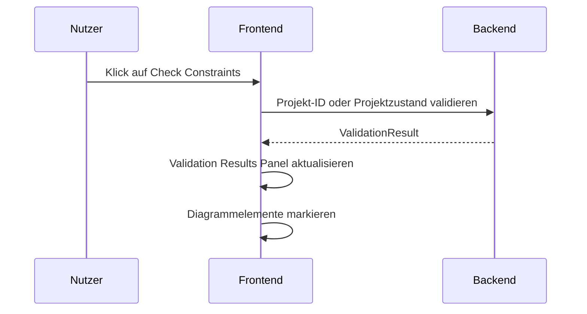

# UI Overview

## Zweck dieser Datei

Diese Datei beschreibt die Gesamtstruktur der geplanten Weboberfläche für das neue UML/OCL-System.

Sie dient als übergreifende UI-Landkarte und erklärt:

- welche Hauptbereiche die Anwendung besitzt,
- welchen Zweck jeder Bereich erfüllt,
- welche Daten dort angezeigt werden,
- welche Nutzeraktionen möglich sind,
- welche Backend-Daten benötigt werden,
- welche lokalen UI-Zustände erforderlich sind,
- wie Validierungsergebnisse sichtbar werden,
- welche Screenshots den jeweiligen Bereich belegen.

Details zu Class Diagram, Object Diagram, OCL/Validation und Screenshot-Traceability werden in eigenen Dateien beschrieben.

Hinweis zur Ablage: Der globale Zielkontext nennt `assets/screenshots/*.png`. Im aktuellen Repository liegen die Dateien real unter `assets/screenshots/*.png`. Die Bildlinks in dieser Datei verwenden die aktuell vorhandenen Pfade. Falls die Assets später nach `assets/screenshots/` verschoben werden, müssen die Links angepasst werden.

## Gesamtaufbau

Die Screenshots zeigen drei UI-Ebenen:

1. Dashboard / Start Page als Einstieg vor einem geöffneten Projekt.
2. Projektverwaltung / All Projects als Liste aller gespeicherten oder verfügbaren Projekte.
3. Projektarbeitsfläche mit Diagramm-Views, Panels und Validierung.

Das Dashboard liegt vor den Diagramm-Views und führt in ein neues oder bestehendes Projekt.


`+ Start Project` führt nicht direkt in den Workspace, sondern öffnet zuerst die Erfassung des Projektnamens:


`Open Existing` führt in der geplanten UI in ein eigenes Importmodal für lokale `.use`-Dateien:


`View all` aus dem Dashboard führt in eine vollständige Projektliste:


Die Projektarbeitsfläche besitzt anschließend eine dauerhaft sichtbare Struktur:

```text
Top Bar
├─ Hauptnavigation: Class Diagram | Object Diagram | OCL Editor
├─ globale Aktionen: Check Constraints, Refresh, Save, Search

Main Workspace
├─ Explorer Sidebar
├─ Diagram Canvas
└─ Properties Panel

Bottom Area
├─ Console
└─ Validation Results

Overlay Layer
└─ Modale Dialoge für Create-Flows
```


Der sichtbare MVP-Kern besteht aus vier dauerhaft wiederkehrenden Arbeitsflächen:

| Bereich | Primäre Aufgabe |
|---|---|
| Explorer Sidebar | Modell- und Snapshot-Elemente navigierbar machen. |
| Diagram Canvas | Klassen- und Objektdiagramme visuell bearbeiten. |
| Properties Panel | Das ausgewählte Element bearbeiten. |
| Bottom Panel | Console-Ausgaben und Validierungsergebnisse anzeigen. |

## Dashboard / Start Page

Das Dashboard ist der erste sichtbare UI-Bereich nach dem Öffnen der Anwendung.

| Bereich | Zweck | Daten | Nutzeraktionen | Backend/API-Bezug |
|---|---|---|---|---|
| Header mit Logo | Produktidentität und Orientierung. | Produkttitel `USE`, Untertitel `UML-based Specification Environment` | keine primäre Fachaktion | keiner oder App-Konfiguration |
| Benutzeravatar | Platzhalter für Nutzerprofil oder Workspace-Kontext. | Nutzerinitiale oder Avatar | Profil öffnen, später Account-Menü | später User/Profile API |
| `Create New Model` Card | Primärer Start für neue Projekte. | Beschreibung des Modellierungsworkflows | `+ Start Project` klicken | öffnet Create-New-Project-Dialog/Formular |
| `Create New Project` Dialog/Formular | Projektname vor der Anlage erfassen. | Projektname, Submit-/Cancel-Zustand, Feldfehler | Projektname eingeben, Projekt erstellen, abbrechen | `POST /api/v1/projects` mit `CreateProjectRequestDto.name` |
| `Open Existing` Card | Einstieg zum Öffnen oder Importieren vorhandener Modelle. | Hinweis auf `.use`-Import | Open-Existing-Modal öffnen | JSON Open/Import, `.use` Model-Text-Import als Should |
| `Open Existing Project` Modal | Lokale USE-Spezifikation aus Datei übernehmen. | `.use`-Datei, Dateiname, Importstatus, Diagnosen | Datei auswählen, Drag-and-drop, `Open Project`, `Cancel` | Import-/Model-Text-Apply-Flow, später vollständiger `.use` Import |
| `Recent Projects` | Schneller Zugriff auf zuletzt genutzte Projekte. | Projektname, optional Typ/Datum | Recent Project öffnen, `View all` | `GET /api/v1/projects/recent` oder Mockdaten im MVP |
| `Learn & Support` | Einstieg in Hilfe und Beispiele. | `Documentation`, `Examples` | Dokumentation oder Beispiele öffnen | optional statische Links oder Example API |

MVP-Regel:

- Dashboard und `Start Project` sind MVP-relevant.
- Ein neues Projekt benötigt im MVP einen nicht leeren Projektnamen.
- `.use` Import wird als Produktziel sichtbar. Der MVP-nahe Flow liest lokale `.use`-Dateien als Modelltext und zeigt Diagnosen; vollständige USE-Kompatibilität bleibt Post-MVP.
- Recent Projects können im MVP zunächst Demo- oder Mockdaten sein.

## Projektliste / All Projects

Die Projektliste ist die Zielansicht für `View all` aus dem Dashboard. Sie liegt wie das Dashboard vor dem projektbezogenen Workspace und zeigt mehrere Projekte als Karten.

| Bereich | Zweck | Daten | Nutzeraktionen | Backend/API-Bezug |
|---|---|---|---|---|
| Header / Zurück | Rückkehr zum Dashboard und Orientierung in der Projektverwaltung. | Logo, Back-Icon, Seitentitel | zurück zum Dashboard | Routing-State |
| Suchfeld | Projekte nach Namen oder Beschreibung finden. | Suchbegriff, Trefferliste | Suchtext eingeben | `GET /api/v1/projects?search=...` oder clientseitiger Filter |
| `Filter` Button | Spätere Einschränkung nach Typ, Datum, Besitz oder Status. | Filterauswahl | Filter öffnen | Post-MVP: Query-Parameter |
| `Open` Button | Bestehendes Projekt oder Datei öffnen. | aktuell selektiertes Projekt oder Dateiimport | Projekt öffnen, Importflow starten | `GET /api/v1/projects/{projectId}` oder Importflow |
| `+ New Project` Button | Neues Projekt aus der Projektliste starten. | Projektname nach Dialog | Create-New-Project-Dialog öffnen | `POST /api/v1/projects` |
| Projektkarten | Alle oder gefilterte Projekte anzeigen. | `ProjectSummaryDto[]` mit Name, Beschreibung, `updatedAt` | Karte anklicken, Projekt öffnen | `GET /api/v1/projects`, danach `GET /api/v1/projects/{projectId}` |

MVP-/Should-Regel:

- Die Seite ist Should-relevant, weil Screenshot `19-projects.png` den `View all`-Flow konkretisiert.
- Die UI kann zunächst mit vorhandenen Project Summaries arbeiten.
- Serverseitige Suche, Filter, Sortierung und Pagination sind Post-MVP, wenn echte Persistenz und viele Projekte hinzukommen.

## Top Bar

Die Top Bar ist der globale Kopfbereich der Anwendung.

| Aspekt | Beschreibung |
|---|---|
| Zweck | Globale Orientierung, Wechsel zwischen Hauptansichten und Zugriff auf zentrale Aktionen. |
| Sichtbare Daten | Produkt-/Projektkontext, aktive View, globale Aktionsicons. |
| Nutzeraktionen | Hauptansicht wechseln, `Check Constraints` auslösen, speichern, aktualisieren, suchen. |
| Backend-Daten | Projektstatus, Speicherstatus, ggf. letzter Validierungsstatus. |
| Lokaler UI-Zustand | Aktiver Tab, Ladezustand, Dirty State, ausgewählte globale Aktion. |
| Validierungsergebnisse | Globaler Validierungsstatus kann über Button, Badge oder Panelzustand sichtbar werden. |
| Screenshots | `01`, `02`, `03`, `04`, `06`, `07`, `12` |

Wichtige sichtbare Elemente:

- `Class Diagram`,
- `Object Diagram`,
- `OCL Editor`,
- `Check Constraints`,
- Refresh Icon,
- Save Icon,
- Search/Command Icon.

## Hauptnavigation

Die Hauptnavigation trennt die Arbeitsmodi des Systems.

| Tab | Zweck | Datenbasis | MVP-Relevanz |
|---|---|---|---|
| `Class Diagram` | UML-Klassenmodell bearbeiten. | `UmlModel`, Klassen, Attribute, Operationen, Assoziationen, Invarianten. | Muss |
| `Object Diagram` | Snapshot mit Objekten, Slots und Objektlinks bearbeiten. | `ObjectModel`, `ObjectInstance`, `Slot`, `ObjectLink`. | Muss |
| `OCL Editor` | Textuellen USE-/OCL-Modelltext anzeigen, bearbeiten, über `Apply Changes` anwenden und Backend-Diagnosen darstellen. | Modelltext, `UmlModel`, `UmlInvariant`, Diagnostics, Console Events. | Muss |

Beim Wechsel der Hauptnavigation ändern sich:

- Explorer-Inhalt,
- Diagram Canvas,
- verfügbare Properties Tabs,
- relevante Create-Aktionen,
- Validation- und Fehler-Markierungen.

Beispiel: Im Class Diagram zeigt der Explorer Modellpakete und deren Classes;
Associations und Invariants werden über die ausgewählte Class erschlossen. Im
Object Diagram zeigt der Explorer `Objects` und `Object Links` des aktuellen
Snapshots.

## Explorer Sidebar

Die Explorer Sidebar befindet sich links und strukturiert das Modell als navigierbaren Baum.


| Aspekt | Beschreibung |
|---|---|
| Zweck | Schneller Zugriff auf Klassen, Assoziationen, Invarianten, Objekte und Objektlinks. |
| Sichtbare Daten | Listen oder Gruppen je aktiver View. |
| Nutzeraktionen | Element auswählen, neue Elemente über `+` erstellen, ggf. Element suchen oder aufklappen. |
| Backend-Daten | IDs, Namen, Typen und Beziehungen aus `UmlModel` und `ObjectModel`. |
| Lokaler UI-Zustand | Aktive Gruppe, aufgeklappte Gruppen, selektiertes Element, Hover-/Focus-Zustand. |
| Validierungsergebnisse | Fehler-Badges an Objekten, Links, Invarianten oder Gruppen möglich. |
| Screenshots | `01`, `03`, `06`, `07` |

Kontextabhängige Explorer-Struktur:

| Aktive View | Explorer-Gruppen |
|---|---|
| Class Diagram | `Classes`, `Associations`, `Invariants` |
| Object Diagram | `Objects`, `Object Links` |
| OCL Editor | optionaler Explorer; Screenshot `13` fokussiert Texteditor und Bottom Panel |

MVP-Anforderungen:

- Auswahl im Explorer selektiert das zugehörige Element im Canvas oder Properties Panel.
- Create-Aktionen im Explorer öffnen passende Modals.
- Explorer nutzt stabile IDs, nicht nur Namen.

## Diagram Canvas

Der Diagram Canvas ist der zentrale Arbeitsbereich.


| Aspekt | Beschreibung |
|---|---|
| Zweck | Visuelle Darstellung und Bearbeitung von Klassen- und Objektdiagrammen. |
| Sichtbare Daten | Diagrammknoten, Kanten, Labels, Selektion, Fehlerzustände. |
| Nutzeraktionen | Elemente auswählen, ggf. verschieben, Kanten betrachten, Create-Flows auslösen. |
| Backend-Daten | Fachliche Elemente aus `UmlModel` und `ObjectModel`; Layoutdaten aus `LayoutInformation`. |
| Lokaler UI-Zustand | Selektion, Hover, Drag State, Viewport, Zoom/Pan, temporäre Kanteninteraktion. |
| Validierungsergebnisse | Fehlerhafte Objekte, Links oder Modellbestandteile werden markiert. |
| Screenshots | `01`, `02`, `03`, `04`, `06`, `07`, `12` |

Canvas-Ausprägungen:

| View | Canvas-Inhalt |
|---|---|
| Class Diagram | Klassen als Knoten, Attribute, Operationen, Invariantenreferenzen, Associations als Kanten. |
| Object Diagram | Objekte als Knoten, Slots als Werte, Objektlinks als Kanten. |

Wichtige UX-Regel:

> Selektion im Canvas, Explorer und Properties Panel muss immer synchron bleiben.

## OCL Editor View

Der `OCL Editor` ist eine eigene Hauptansicht neben Class Diagram und Object Diagram. Screenshot `13-ocl-editor.png` zeigt ihn als textbasierte Modell-/OCL-Arbeitsfläche mit Zeilennummern, USE-ähnlichem Modelltext, `Apply Changes`, globalem `Check Constraints`, Save/Refresh und Bottom Panel.

Erwartete Struktur der Ansicht:

| Bereich | Zweck | Daten | MVP-Relevanz |
|---|---|---|---|
| Text Editor | USE-ähnlichen Modell-/OCL-Text anzeigen und bearbeiten. | Modelltext, Draft State, Dirty State | Muss |
| Line Number Gutter | Orientierung und späteres Error Mapping auf Zeilen/Spalten ermöglichen. | Zeilennummern, Cursorposition | Muss |
| Apply Changes | Änderungen explizit in Projektzustand/API übernehmen. | Editor Draft, Parse-/Import-Ergebnis | Muss |
| Global Actions | `Check Constraints`, Refresh und Save auslösen. | API Loading State, Error State | Muss |
| Bottom Panel | Console und Validation Results anzeigen. | Console Events, `ValidationResult` | Muss |

Die OCL Editor View ersetzt nicht das Invariant Properties Panel. Sie ergänzt es um eine textuelle Perspektive auf Modell und Constraints. Diagnosen aus `Apply Changes`, Parse/Typecheck oder `Check Constraints` müssen auf Textpositionen und stabile Modell-IDs wie `classId`, `associationId` oder `invariantId` rückführbar sein.

### Stabile Properties-Hauptnavigation

Die Screenshots `15-properties-association.png`,
`16-properties-invariants.png` und `17-new-class.png` legen für das
Class Diagram drei stabile Properties-Hauptseiten fest:

```text
Class | Association | Invariant
```

Neue UML-/OCL-Funktionen erweitern diese Struktur, statt weitere gleichrangige
Hauptseiten anzulegen. Generalisierung, Attribute, Operationen und
Operationsverträge liegen unter `Class`. Association Ends, Qualifier, n-äre
Associations, Association Classes und Aggregation/Composition liegen unter
`Association`, soweit die Association selbst selektiert ist. `Invariant` bleibt
für Klasseninvarianten. Objektbezogene Properties im Object Diagram behalten
ihre eigene bestehende Struktur.

## Properties Panel

Das Properties Panel befindet sich rechts und zeigt die Details des aktuell selektierten Elements.


| Aspekt | Beschreibung |
|---|---|
| Zweck | Bearbeitung des ausgewählten Modell- oder Snapshot-Elements. |
| Sichtbare Daten | Elementname, Typ, Attribute, Operationen, Rollen, OCL-Ausdruck, Slots oder Linkdaten. |
| Nutzeraktionen | Felder bearbeiten, Attribute/Operationen hinzufügen, Rollen ändern, OCL-Ausdruck bearbeiten. |
| Backend-Daten | Detail-DTO des selektierten Elements plus abhängige Auswahllisten. |
| Lokaler UI-Zustand | Aktiver Properties-Tab, Form State, Validierungsfeedback, Dirty State. |
| Validierungsergebnisse | Feldbezogene Fehler, OCL-Diagnostics, Hinweise aus Validation Results. |
| Screenshots | `01`, `02`, `03`, `04`, `06`, `12` |

Sichtbare Properties-Kontexte:

| Kontext | Screenshot | Inhalt |
|---|---|---|
| Class | `01`, `04` | Class Name, Attributes, Operations. |
| Class Association | `02` | Association Name, Source/Target Class, Source/Target Role. |
| Invariant | `03` | Invariant Name, OCL Expression. |
| Object | `06` | Object Name, Type, Attribute Slots. |
| Object Association | `12` | Source Object, Target Object, Association Name. |

MVP-Anforderungen:

- Properties Panel ist typabhängig.
- Änderungen werden im Canvas und Explorer reflektiert.
- Formulare nutzen IDs für Speicherung, Namen für Anzeige.
- Validierungsfehler können auf konkrete Felder oder Elemente verweisen.

## Bottom Panel

Das Bottom Panel ist der untere Informationsbereich.

| Aspekt | Beschreibung |
|---|---|
| Zweck | Ausgabe von Systemereignissen und Validierungsergebnissen. |
| Sichtbare Daten | Console-Einträge, Validation Results, Error Count, Constraint-Details. |
| Nutzeraktionen | Zwischen Console und Validation Results wechseln, Fehler auswählen, ggf. Details aufklappen. |
| Backend-Daten | Validation Results; optional Log-/Event-Daten. |
| Lokaler UI-Zustand | Aktiver Bottom-Tab, Scrollposition, selektierter Fehler, aufgeklappte Details. |
| Validierungsergebnisse | Zentraler Ort für textuelle Fehlerdarstellung. |
| Screenshots | `01`, `06`, `07` |

Das Bottom Panel muss im MVP mindestens den Validation Results-Zustand unterstützen. Die Console ist sichtbar und hilfreich, kann aber zunächst einfach gehalten werden.

## Console

Die Console zeigt protokollartige Ereignisse.


| Aspekt | Beschreibung |
|---|---|
| Zweck | Nutzer über Projekt-, Modell- und Validierungsereignisse informieren. |
| Sichtbare Daten | Ladeereignisse, Erstellungsereignisse, Validierungsläufe, Statusmeldungen. |
| Nutzeraktionen | Console lesen, ggf. kopieren oder filtern. Interaktive Eingabe ist nicht MVP-Pflicht. |
| Backend-Daten | Optional Server-Events oder Rückmeldungen aus API-Aktionen. |
| Lokaler UI-Zustand | Logliste, aktiver Tab, Scrollposition. |
| Validierungsergebnisse | Kann Start/Ende von `Check Constraints` protokollieren, Details liegen im Validation Results Panel. |
| Screenshots | `01`, `06` |

MVP-Grenze:

- Console ist informativ.
- Keine vollständige USE-Shell im MVP.
- Keine SOIL-/Command-Ausführung im MVP.

## Validation Results

Validation Results sind der zentrale textuelle Fehlerbereich.


| Aspekt | Beschreibung |
|---|---|
| Zweck | Validierungsstatus und konkrete Fehler verständlich anzeigen. |
| Sichtbare Daten | Gesamtstatus, Fehleranzahl, betroffene Entität, Fehlermeldung, Kontext, Invariante, OCL-Ausdruck. |
| Nutzeraktionen | Fehler lesen, Fehler auswählen, ggf. zum betroffenen Element navigieren. |
| Backend-Daten | `ValidationResult`, `ValidationError`, IDs zu Objekten, Links, Invarianten und Source Ranges. |
| Lokaler UI-Zustand | Aktiver Fehler, aufgeklappte Details, Filter nach Severity oder Code. |
| Validierungsergebnisse | Primärer Darstellungsort für `INVARIANT_VIOLATION`, `MULTIPLICITY_VIOLATION`, OCL-Fehler usw. |
| Screenshots | `07` |

Sichtbare Struktur aus Screenshot `07`:

- `1 Error`,
- betroffenes Objekt `alice`,
- fachliche Erklärung,
- `context: User`,
- `inv maxBooks`,
- OCL-Ausdruck `self.borrowedBooks->size() <= 5`.

MVP-Anforderungen:

- Fehler müssen aus strukturierten Backend-Daten gerendert werden.
- Fehler dürfen nicht aus Freitext geparst werden.
- Fehler müssen auf Diagrammelemente abbildbar sein.

## Quick Help

Quick Help erscheint als kontextbezogener Hilfebereich unten rechts.

| Aspekt | Beschreibung |
|---|---|
| Zweck | Kurze Hinweise zur aktuellen View oder Selektion geben. |
| Sichtbare Daten | Kontextabhängige Hilfetexte oder kurze Bedienhinweise. |
| Nutzeraktionen | Lesen, ggf. ausblenden. |
| Backend-Daten | Keine fachlichen Backend-Daten erforderlich. |
| Lokaler UI-Zustand | Sichtbarkeit, Kontext, ggf. dismissed state. |
| Validierungsergebnisse | Kann optional erklären, wie Fehler behoben werden; nicht primärer Validierungsbereich. |
| Screenshots | `01`, `02`, `03`, `06` |

MVP-Einordnung:

- Quick Help ist aufgrund der priorisierten Anfängerfreundlichkeit und
  Systemunterstützung ein verpflichtender Redesign-Bestandteil.
- Sie bleibt kurz und kontextbezogen und ersetzt keine ausführliche
  Documentation oder Examples.
- Sie muss per Tastatur erreichbar und schließbar sein und darf den
  Modellierungsbereich nicht dauerhaft überdecken.

## Modal Dialogs

Modale Dialoge dienen fokussierten Create-Flows.


| Modal | Screenshot | Zweck | Eingaben |
|---|---|---|---|
| Add New Class | `08` | Neue Klasse erstellen. | Class Name |
| Add Invariant | `09` | Neue Invariante erstellen. | Context Class, Invariant Name, OCL Expression |
| Add Class Association | `10` | Klassenassoziation erstellen. | Association Name, Source Class, Target Class, Source Role, Target Role |
| Add Object Association | `11` | Objektlink erstellen. | Source Object, Target Object, Association Name |
| Open Existing Project | `14` | Lokale `.use`-Datei öffnen/importieren. | Local File, Upload/Dropzone, Open Project |


| Aspekt | Beschreibung |
|---|---|
| Zweck | Erstellung neuer fachlicher Elemente ohne Ablenkung vom Hauptlayout. |
| Nutzeraktionen | Eingaben machen, bestätigen, abbrechen, schließen. |
| Backend-Daten | Auswahllisten für Klassen, Objekte, Assoziationen; Create-API oder lokales Projektmodell. |
| Lokaler UI-Zustand | Offenes Modal, Form State, Validierungsfeedback, Loading State. |
| Validierungsergebnisse | Pflichtfeld- und Domänenfehler können direkt im Modal erscheinen. |
| Screenshots | `08`, `09`, `10`, `11`, `14` |

Offene UI-Frage:

Der Add-Class-Association-Dialog zeigt keine Multiplizitätsfelder. Da Multiplizitäten MVP-relevant sind, müssen sie entweder im Modal ergänzt oder im Properties Panel direkt nach Erstellung bearbeitbar sein.

## Validierungsinteraktion

Die zentrale Validierungsinteraktion ist `Check Constraints`.



| Aspekt | Beschreibung |
|---|---|
| Auslöser | Globaler Button `Check Constraints`. |
| Backend-Daten | Vollständiges Projekt oder Projekt-ID mit serverseitigem Projektzustand. |
| Backend-Ergebnis | Strukturierter `ValidationResult`. |
| Frontend-Aktion | Panel aktualisieren, Fehleranzahl anzeigen, Objekte/Links/Invarianten markieren. |
| Screenshots | `07` |

Validierungsfeedback im UI:

| Fehlerart | UI-Ort |
|---|---|
| OCL-Syntaxfehler | Invariant Properties oder OCL Editor. |
| OCL-Typefehler | OCL-Ausdruck, Invariante, ggf. Klasse/Attribut. |
| Invariant-Verletzung | Validation Results und betroffene Objekte im Object Diagram. |
| Multiplicity-Verletzung | Validation Results und betroffene Links/Objekte. |
| Slot-Wertfehler | Object Properties und betroffene Objektkarte. |

## Screenshot-Referenzen

| Screenshot | Eingebunden | Hauptbereiche |
|---|---|---|
| `00-dashboard-start-page.png` |  | Dashboard, Projektstart, `Open Existing`, Recent Projects, Learn & Support |
| `18-create-new-projects.png` |  | Create New Project, Projektname, Projektanlage |
| `14-open-existing-project.png` |  | Open Existing Project Modal, lokaler `.use` Dateiimport |
| `19-projects.png` |  | All Projects, Projektliste, Suche, Filter, Projektkarten, `Open`, `+ New Project` |
| `01-class-diagram-class-properties.png` |  | Top Bar, Class Diagram, Explorer, Canvas, Class Properties, Console, Quick Help |
| `02-class-diagram-association-properties.png` |  | Association Properties, Class Diagram Canvas |
| `03-class-diagram-invariant-properties.png` |  | Invariant Properties, OCL Expression, Explorer Invariants |
| `04-class-diagram-new-class-selected.png` |  | Neue Klasse selektiert, Class Properties |
| `06-object-diagram-object-properties.png` |  | Object Diagram, Object Explorer, Object Properties |
| `07-object-diagram-validation-error.png` |  | Validation Results, Fehler-Markierung |
| `08-modal-add-class.png` |  | Add Class Modal |
| `09-modal-add-invariant.png` |  | Add Invariant Modal |
| `10-modal-add-class-association.png` |  | Add Class Association Modal |
| `11-modal-add-object-association.png` |  | Add Object Association Modal |
| `12-object-diagram-association-properties.png` |  | Object Association Properties |
| `13-ocl-editor.png` |  | OCL Editor View, textueller Modell-/OCL-Editor, `Apply Changes`, Console |

## UX-Prinzipien

| Prinzip | Bedeutung |
|---|---|
| Drei-Wege-Synchronisation | Explorer, Canvas und Properties Panel zeigen immer dieselbe Auswahl. |
| Modell und Snapshot trennen | Class Diagram bearbeitet Typstruktur; Object Diagram bearbeitet konkrete Instanzen. |
| Validierung sichtbar machen | Fehler müssen gleichzeitig textuell und visuell erfassbar sein. |
| Backend-Semantik respektieren | Frontend zeigt Validierungsergebnisse an, erfindet aber keine verbindliche Semantik. |
| Create-Flows fokussieren | Modals erfassen nur notwendige Daten und führen danach zurück in den Kontext. |
| Namen anzeigen, IDs verwenden | Nutzer sehen Namen; UI und API referenzieren stabile IDs. |
| Fehler behebbar machen | Jeder Fehler braucht einen klaren Bezug zu Objekt, Link, Invariante oder OCL-Ausdruck. |
| Keine Desktop-GUI-Migration | Die neue UI orientiert sich an Web-Arbeitsflächen, nicht an der alten USE-GUI. |

## MVP-Anforderungen

| UI-Bereich | MVP-Pflicht |
|---|---|
| Top Bar | Hauptnavigation und `Check Constraints` sichtbar. |
| Hauptnavigation | `Class Diagram`, `Object Diagram` und `OCL Editor` sind funktionsfähige Hauptviews. |
| Explorer Sidebar | Kontextabhängige Modell-/Snapshot-Navigation. |
| Diagram Canvas | Klassen, Assoziationen, Objekte und Objektlinks anzeigen und selektieren. |
| OCL Editor View | Textuellen Modell-/OCL-Editor anzeigen, Änderungen anwenden und Diagnosen darstellen. |
| Properties Panel | Klassen, Assoziationen, Invarianten, Objekte und Objektlinks bearbeiten. |
| Bottom Panel | Validation Results anzeigen; Console optional einfach. |
| Modals | Add Class, Add Invariant, Add Class Association, Add Object Association. |
| Open Existing Modal | Lokale `.use`-Datei aus dem Dashboard auswählen oder droppen und Importdiagnosen anzeigen. |
| All Projects Page | Projektliste über `View all` öffnen, Projekte suchen und öffnen. |
| Check Constraints | Backend-Validierung auslösen und Ergebnisse anzeigen. |
| Fehler-Markierung | Betroffene Objekte und möglichst Links im Diagramm markieren. |
| Save/Load | Save-Aktion oder JSON Import/Export im MVP-Format erreichbar machen. |

## Post-MVP-Erweiterungen

| Erweiterung | Nutzen |
|---|---|
| Erweiterter OCL Editor | Syntax Highlighting, Autocomplete, Inline Source-Ranges und Evaluation Trace. |
| Fehlernavigation | Klick auf Validation Error selektiert Element und scrollt es in den Fokus. |
| Undo/Redo | Modellierungsaktionen rückgängig machen. |
| Auto-Layout | Diagramme automatisch anordnen. |
| Search/Command Palette | Schneller Zugriff auf Elemente und Aktionen. |
| Mehrere Snapshots | Snapshot-Liste und Vergleichsansichten. |
| Erweiterte Console | Filter, Export, eventuell OCL-Abfragen. |
| Erweiterte Projektliste | Serverseitige Filter, Sortierung, Pagination, Projekt-Thumbnails und Projektstatus. |
| Persistenzstatus | Klarer Hinweis auf gespeicherte/ungespeicherte Änderungen. |
| Inline-Validation | OCL- und Formfehler bereits während der Eingabe anzeigen. |
| Erweiterte Accessibility-Prüfung | Automatisierte und manuelle Prüfung über die bereits verpflichtende Basis aus Kontrast, Lesbarkeit, Tastaturbedienung, Fokusführung und zugänglichen Namen hinaus. |

## Offene Fragen

| Frage | Bedeutung |
|---|---|
| Sollen die Screenshots in die geplante Struktur `assets/screenshots/` verschoben werden? | Betrifft Dokumentationspfade und Traceability. |
| Wie vollständig wird die originale `.use`-Syntax im MVP unterstützt? | Entscheidung: Der Editor zeigt und sendet den gesamten Modelltext; fachlich umgesetzt wird im MVP nur der definierte UML/OCL-Subset. Nicht unterstützte Syntax wird strukturiert diagnostiziert. |
| Wo werden Multiplizitäten in der UI erfasst? | Add Association Modal zeigt sie aktuell nicht sichtbar; Anzeige als Association-Endlabels im Canvas ist dennoch MVP-Pflicht. Erfassung erfolgt mindestens im Properties Panel oder über erweiterte Modal-Felder. |
| Gibt es ein Add-Object-Modal? | Screenshots zeigen Objektbearbeitung, aber keinen Objekt-Erstellungsdialog. |
| Wie werden Attribute und Operationen konkret hinzugefügt? | Screenshots zeigen Add Buttons, aber keine Modals. |
| Soll `Check Constraints` automatisch Validation Results öffnen? | Betrifft Fehlerauffindbarkeit. |
| Welche Filter bietet die All-Projects-Seite? | Screenshot zeigt `Filter`, aber keine geöffneten Filteroptionen. |
| Soll die Console interaktiv werden? | MVP sollte keine USE-Shell nachbilden. |
| Wie werden Save/Refresh-Zustände visualisiert? | Betrifft Dirty State, Ladezustand und Konflikte. |
| Welche Diagramm-Bibliothek wird verwendet? | Betrifft Canvas-Interaktion, Kanten, Layout und Markierung. |

## Zusammenfassung

Die geplante Weboberfläche ist als produktive Modellierungs- und Validierungsumgebung aufgebaut:

- Top Bar und Hauptnavigation geben den Arbeitsmodus vor.
- Explorer Sidebar, Diagram Canvas und Properties Panel bilden den primären Modellierungsdreiklang.
- Bottom Panel zeigt Console und Validation Results.
- Modale Dialoge unterstützen fokussierte Erstellungsaktionen.
- `Check Constraints` verbindet UI, Backend-Validierung und visuelle Fehlerdarstellung.

Die Screenshots zeigen damit einen klaren MVP-Aufbau: Nutzer modellieren Klassen und Invarianten, wechseln zum Snapshot, bearbeiten Objekte und Objektlinks, starten die Validierung und verstehen Fehler direkt im Diagramm und im Validation Results Panel.
