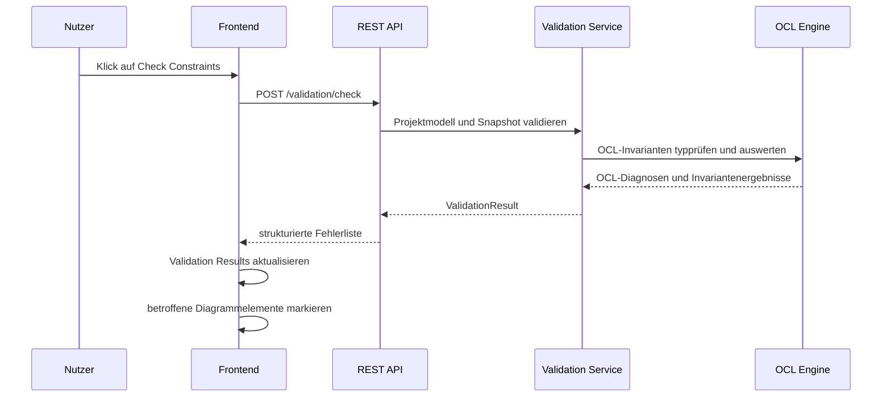

# OCL and Validation UI

## Zweck dieser Datei

Diese Datei beschreibt die Benutzeroberfläche für OCL-Invarianten, OCL-Ausdrücke und Validierungsergebnisse im neuen webbasierten UML/OCL-System.

Der Fokus liegt auf der sichtbaren Interaktion im Frontend:

- Invarianten erstellen und bearbeiten,
- OCL-Ausdrücke anzeigen und erfassen,
- Constraints prüfen,
- Validierungsergebnisse verstehen,
- betroffene Diagrammelemente visuell markieren,
- Fehler aus dem Validation Results Panel auf Diagrammelemente zurückführen.

Die fachliche OCL-Auswertung erfolgt nicht im Frontend. Das Frontend darf einfache Eingabeprüfungen durchführen, etwa Pflichtfelder, leere Ausdrücke oder offensichtliche UI-Fehler. Syntaxprüfung, Typprüfung, Invariantenauswertung und Multiplicity Checks liegen im Backend.

## Relevante Screenshots

Die folgenden Screenshots sind für OCL und Validierung besonders relevant:

| Screenshot | Sichtbarer Fokus | Bedeutung für diese Datei |
|---|---|---|
| `03-class-diagram-invariant-properties.png` | Invariante im Klassendiagramm, Explorer-Eintrag, Properties Panel | Bearbeitung von Invariant Name und OCL Expression |
| `07-object-diagram-validation-error.png` | Fehlerhaftes Objekt, Fehler-Badge, Validation Results | Darstellung von Constraint-Verletzungen im Objektdiagramm |
| `09-modal-add-invariant.png` | Modal zum Anlegen einer Invariante | Eingabe von Kontextklasse, Name und OCL Expression |
| `13-ocl-editor.png` | OCL Editor View | textbasierte Modell-/OCL-Bearbeitung mit Zeilennummern, `Apply Changes`, `Check Constraints`, Save/Refresh und Console |


Hinweis: Die Screenshots liegen in der normalisierten Zielstruktur unter `assets/screenshots/`. `13-ocl-editor.png` ist vorhanden und konkretisiert die OCL Editor View als textuelle Modell-/OCL-Arbeitsfläche.

## Rolle von OCL in der UI

OCL ist in der UI als fachlicher Constraint-Text sichtbar. Nutzer erfassen OCL-Ausdrücke für Invarianten und lösen anschließend eine Validierung aus. Die UI ist dafür verantwortlich, OCL-Eingaben verständlich darzustellen, Backend-Ergebnisse nachvollziehbar anzuzeigen und Fehler mit Modell- oder Diagrammelementen zu verbinden.

Die UI interpretiert OCL im MVP nicht vollständig selbst. Sie behandelt OCL-Ausdrücke primär als strukturierte Eingabe mit Metadaten:

| Aspekt | Rolle der UI | Rolle des Backends |
|---|---|---|
| OCL-Ausdruck erfassen | Textfeld oder Editor bereitstellen | Ausdruck speichern und fachlich prüfen |
| Kontextklasse wählen | Auswahl aus vorhandenen UML-Klassen | Kontext gegen Modell prüfen |
| Syntaxfeedback anzeigen | Backend-Diagnosen visualisieren | Lexer und Parser ausführen |
| Typecheck-Feedback anzeigen | Typfehler lesbar darstellen | AST gegen UML-Modell typprüfen |
| Constraints prüfen | Aktion auslösen und Ladezustand anzeigen | UML-, Snapshot-, Multiplicity- und OCL-Validierung durchführen |
| Fehler markieren | Diagrammelemente hervorheben | Betroffene Modell- und Snapshot-Elemente referenzieren |

Damit bleibt die fachliche Wahrheit zentral im Backend, während das Frontend eine schnelle, verständliche und navigierbare Oberfläche bietet.

## Invariant Modal

Das `AddInvariantModal` dient zum Anlegen einer neuen OCL-Invariante. Der Screenshot zeigt ein kompaktes Modal mit Kontextklasse, Invariantennamen und OCL-Ausdruck.

### Sichtbare Felder

| Feld | Zweck | MVP-Verhalten |
|---|---|---|
| Context Class | Klasse, gegen deren Instanzen die Invariante geprüft wird | Auswahl aus vorhandenen Klassen |
| Invariant Name | Stabiler fachlicher Name der Invariante | Pflichtfeld, innerhalb der Kontextklasse eindeutig |
| OCL Expression | Ausdruck, der pro Instanz der Kontextklasse ausgewertet wird | Textfeld mit MVP-OCL-Subset |
| Add Invariant | Bestätigt die Anlage | Erst aktiv, wenn Pflichtfelder gefüllt sind |

Beispielausdrücke:

```ocl
self.books <= 5
```

```ocl
self.borrowedBooks->size() <= 5
```

### Erwartetes Verhalten

1. Nutzer öffnet das Modal über eine Aktion im Klassendiagramm oder Explorer.
2. Nutzer wählt eine Kontextklasse, etwa `User`.
3. Nutzer vergibt einen Namen, etwa `maxBooks`.
4. Nutzer erfasst einen OCL-Ausdruck, etwa `self.books <= 5`.
5. Das Frontend prüft nur einfache UI-Regeln.
6. Beim Speichern wird die Invariante an Backend oder lokalen Projektzustand übergeben.
7. Fachliche OCL-Fehler werden spätestens beim Speichern oder beim nächsten `Check Constraints` über Backend-Diagnosen zurückgegeben.

## Invariant Properties Panel

The current unified visual and interaction reference is
`33-invariant-properties.md`. It keeps Invariant Properties synchronized with
the OCL Editor, Diagnostics and Validation Results through one stable selection.

Das `InvariantPropertiesPanel` zeigt und bearbeitet eine ausgewählte Invariante. Im Screenshot ist die Invariante `maxBooks` selektiert. Das Panel zeigt mindestens:

- Invariant Name,
- OCL Expression.

Zusätzlich sollte das Panel im Zielsystem die Kontextklasse sichtbar machen, auch wenn sie im Screenshot nicht als eigenes Feld erkennbar ist.

| Eigenschaft | Beschreibung | MVP-Relevanz |
|---|---|---|
| `id` | Stabile interne ID für Mapping und API | Pflicht |
| `contextClassId` | Referenz auf die Kontextklasse | Pflicht |
| `name` | Nutzerlesbarer Name, z. B. `maxBooks` | Pflicht |
| `expression` | OCL-Ausdruck, z. B. `self.books <= 5` | Pflicht |
| `diagnostics` | Backend-Rückmeldungen zu Syntax oder Typen | Pflicht für Fehleranzeige |
| `sourceRange` | Positionen innerhalb des OCL-Ausdrucks | Post-MVP, hilfreich für Inline-Markierung |

Änderungen im Properties Panel erzeugen einen lokalen Draft-Zustand. Je nach späterer Produktentscheidung kann der Draft sofort gespeichert, über einen expliziten Save-Button übernommen oder beim Verlassen des Panels bestätigt werden.

## OCL Editor View

Der Top-Bereich zeigt einen eigenen Tab `OCL Editor`. Screenshot `13-ocl-editor.png` macht diese Ansicht zu einer MVP-relevanten Hauptansicht. Der `OclEditorView` dient als textbasierte Arbeitsfläche für USE-ähnlichen Modelltext inklusive Klassen, Attribute, Operationen, Associations und Constraints.

Entscheidung: Der Editor arbeitet auf dem gesamten Modelltext, nicht nur auf einzelnen OCL-Ausdrücken. Die originalen `.use`-Beispiele unter `examples/` enthalten vollständige Spezifikationen mit mehreren Modellbestandteilen; genau solche Dateien sollen im OCL Editor angezeigt werden können.

MVP-Funktion:

- textbasierter Editor mit Zeilennummern,
- Anzeige und Bearbeitung von USE-ähnlichem Modell-/OCL-Text,
- `Apply Changes` zum Übernehmen des Editor-Drafts,
- Anzeige von Syntax-, Typ- und Validierungsfeedback,
- Aktion zum Speichern oder Prüfen.

Erwartete View-Struktur:

| Bereich | Zweck | Komponente |
|---|---|---|
| Editorfläche | Bearbeitung des USE-ähnlichen Modell-/OCL-Texts. | `ModelTextEditor` |
| Zeilennummern | Orientierung und Mapping von Diagnosen auf Textpositionen. | `LineNumberGutter` |
| Apply Actions | Übernahme und Prüfung von Editoränderungen. | `ApplyChangesButton`, `OclEditorActions` |
| Metadaten | Name, Kontextklasse und optional Aktivierungsstatus bearbeiten. | `InvariantMetadataPanel` |
| Diagnosen | Syntax-, Typ- und Validierungsfehler anzeigen. | `OclDiagnosticsPanel` |
| Aktionen | Speichern, Parse, Typecheck, Check Constraints. | `OclEditorActions` |

Synchronisationsregel:

> `InvariantPropertiesPanel`, `InvariantList`, Explorer und Klassendiagramm referenzieren dieselbe Invariante über `invariantId`.

Post-MVP kann der OCL Editor stärker ausgebaut werden:

- Syntax Highlighting,
- Autocomplete für `self`, Attribute, Rollen und Operationen,
- Inline-Diagnosen,
- Sprung zu betroffenen Klassen, Objekten oder Links,
- Unterstützung weiterer OCL-Konstrukte wie `forAll`, `exists`, `let` und `if-then-else`.

## OCL Expression Input

Das `OclExpressionInput` ist die zentrale Eingabekomponente für OCL-Ausdrücke. Im MVP reicht ein robustes mehrzeiliges Textfeld oder ein einfacher Code-Editor ohne vollständige IDE-Funktionalität.

Anforderungen:

| Anforderung | Beschreibung | Priorität |
|---|---|---|
| Monospace-Darstellung | OCL-Ausdrücke müssen gut lesbar sein | MVP |
| Mehrzeilige Eingabe | längere Invarianten müssen erfassbar sein | MVP |
| Kein horizontaler Layoutbruch | lange Ausdrücke dürfen das Panel nicht zerstören | MVP |
| Pflichtfeldvalidierung | leere OCL-Ausdrücke lokal markieren | MVP |
| Backend-Diagnosen anzeigen | Syntax- und Typfehler unter dem Eingabefeld darstellen | MVP |
| Source-Range-Markierung | fehlerhafte Textstellen direkt markieren | Post-MVP |
| Syntax Highlighting | OCL-Schlüsselwörter und Navigation hervorheben | Post-MVP |
| Autocomplete | Attribute, Rollen und Operationen vorschlagen | Post-MVP |

Beispiele für MVP-Ausdrücke:

```ocl
self.books <= 5
```

```ocl
self.borrowedBooks->size() <= 5 and self.name <> ''
```

## Syntax- und Typecheck-Feedback

Das Frontend zeigt Feedback zu OCL-Ausdrücken, erzeugt die fachlichen Diagnosen aber nicht selbst. Die Diagnosequelle ist das Backend.

### Lokale UI-Vorvalidierung

Das Frontend darf einfache, nicht-fachliche Prüfungen durchführen:

- Kontextklasse fehlt,
- Invariant Name fehlt,
- OCL Expression ist leer,
- Ausdruck enthält nur Whitespace,
- Speichern ist wegen unvollständiger Felder deaktiviert.

### Backend-Diagnosen

Backend-Diagnosen werden strukturiert zurückgegeben und in der UI angezeigt.

| Fehlertyp | UI-Darstellung | Beispiel |
|---|---|---|
| `SYNTAX_ERROR` | Meldung am OCL-Feld und im Validation Panel | Unerwartetes Token in `self.books <=` |
| `TYPE_ERROR` | Meldung mit erwarteten und gefundenen Typen | Vergleich zwischen Collection und Integer ohne `size()` |
| `UNKNOWN_CLASS` | Kontextklasse oder Referenz ist ungültig | Kontext `Reader` existiert nicht |
| `UNKNOWN_ATTRIBUTE` | Attribut oder Rolle ist nicht bekannt | `self.bookz` existiert nicht |
| `EVALUATION_ERROR` | Ausdruck konnte zur Laufzeit nicht ausgewertet werden | Navigation führt auf unzulässigen Wert |

Die genaue Benennung der Fehlercodes muss mit dem Backend-Error-Contract abgestimmt werden. Für die UI ist entscheidend, dass jeder Fehler einen Code, eine lesbare Meldung und möglichst eine Referenz auf Invariante, Ausdruck und betroffenes Element enthält.

## Check Constraints

Der `Check Constraints` Button ist im oberen Bereich sichtbar und löst die zentrale Validierung aus.

Erwarteter Ablauf:



Während der Prüfung sollte der Button einen Ladezustand anzeigen und doppelte parallele Checks verhindern. Nach Abschluss aktualisiert das Frontend das Validation Results Panel und die Markierungen im Diagramm.

## Validation Results Panel

Das `ValidationResultsPanel` ist im unteren Bereich sichtbar. Im Fehler-Screenshot zeigt es einen Fehlerzustand mit `1 Error`. Es muss sowohl eine kompakte Übersicht als auch verständliche Details liefern.

### Mindestinhalte pro Fehler

| Feld | Beschreibung | Beispiel |
|---|---|---|
| Severity | Schweregrad | `ERROR` |
| Code | maschinenlesbarer Fehlertyp | `INVARIANT_VIOLATION` |
| Message | nutzerlesbare Erklärung | `User alice violates invariant maxBooks` |
| Context | Kontextklasse oder Modellbereich | `User` |
| Invariant | betroffene Invariante | `maxBooks` |
| Expression | relevanter OCL-Ausdruck | `self.books <= 5` |
| Affected Element | Objekt, Link, Klasse oder Invariante | `alice : User` |
| Navigation Target | Ziel für Klick/Fokus | Object Diagram, Objekt `alice` |

### Gruppierung

Für den MVP genügt eine einfache Liste. Sinnvolle Gruppierungen für später:

- nach Severity,
- nach Fehlertyp,
- nach Kontextklasse,
- nach Invariante,
- nach betroffenem Objekt oder Link,
- nach Diagrammansicht.

## Fehlerdarstellung im Diagramm

Validierungsfehler müssen nicht nur textuell, sondern auch visuell im Diagramm sichtbar sein. Der Screenshot zeigt ein fehlerhaftes Objekt mit rotem Rahmen und Fehler-Badge.

| Fehlerart | Primäre UI-Markierung | Zusätzliche Anzeige |
|---|---|---|
| Invariantverletzung | roter Rahmen am betroffenen Objekt | Badge und Validation Results Eintrag |
| Multiplizitätsverletzung | Markierung an Objektlink oder betroffenen Objekten | Fehlermeldung mit Association/Rolle |
| Ungültiger Slot-Wert | Markierung am Objekt und ggf. am Slot | Detail im Properties Panel |
| OCL-Syntaxfehler | Markierung an Invariante oder OCL-Feld | Validation Results und OCL Feedback |
| OCL-Typefehler | Markierung an Invariante oder OCL-Feld | Typecheck-Meldung im Editor |

Der Klick auf einen Fehler im Validation Results Panel sollte:

1. die passende Diagrammansicht öffnen oder fokussieren,
2. das betroffene Element auswählen,
3. das Properties Panel passend aktualisieren,
4. den Fehler visuell hervorheben,
5. optional den relevanten OCL-Ausdruck oder die Invariante anzeigen.

## Fehlerdetailansicht

Eine `ValidationErrorDetails` Ansicht ist hilfreich, um komplexere Fehler nachvollziehbar zu machen. Im MVP kann sie als aufklappbarer Bereich im Validation Results Panel umgesetzt werden.

Beispielstruktur:

```json
{
  "code": "INVARIANT_VIOLATION",
  "severity": "ERROR",
  "message": "Object alice violates invariant maxBooks.",
  "contextClassId": "class-user",
  "contextClassName": "User",
  "invariantId": "inv-max-books",
  "invariantName": "maxBooks",
  "expression": "self.books <= 5",
  "affectedElements": [
    {
      "elementType": "OBJECT",
      "elementId": "obj-alice",
      "label": "alice : User"
    }
  ]
}
```

Für OCL-Syntax- oder Typfehler sollte die Detailansicht zusätzlich auf die betroffene Textstelle verweisen können:

```json
{
  "code": "TYPE_ERROR",
  "severity": "ERROR",
  "message": "Cannot compare collection 'books' directly with Integer.",
  "invariantId": "inv-max-books",
  "expression": "self.books <= 5",
  "sourceRange": {
    "startLine": 1,
    "startColumn": 1,
    "endLine": 1,
    "endColumn": 11
  }
}
```

## Nutzeraktionen

| Aktion | UI-Komponente | Erwartete Systemreaktion | Backend-Bezug |
|---|---|---|---|
| Invariante anlegen | `AddInvariantModal` | neue Invariante erscheint im Explorer und an der Klasse | Invariante speichern |
| Kontextklasse wählen | `AddInvariantModal`, `OclEditorView` | verfügbare Attribute/Rollen werden ableitbar | Klassenmodell lesen |
| OCL-Ausdruck ändern | `OclExpressionInput` | Draft-Zustand und ggf. Feedback aktualisieren | später Syntax-/Typecheck |
| Invariante auswählen | Explorer, Diagramm, OCL Editor | Properties Panel zeigt Details | Projektzustand lesen |
| Constraints prüfen | `CheckConstraintsButton` | Validation Results und Diagramm-Markierungen aktualisieren | vollständige Validierung |
| Fehler anklicken | `ValidationErrorItem` | betroffenes Element wird fokussiert | Mapping über IDs |
| Fehler korrigieren | Properties Panel, Objekt- oder OCL-Editor | Markierung bleibt bis zur erneuten Validierung oder wird als veraltet gekennzeichnet | erneuter Check |

## Backend-Datenbedarf

Die UI benötigt strukturierte Daten aus Backend oder lokalem Projektzustand:

| Datenbereich | Benötigte Informationen |
|---|---|
| UML-Klassen | ID, Name, Attribute, Operationen, Associations/Rollen |
| Invarianten | ID, Kontextklasse, Name, OCL Expression, Status/Diagnosen |
| Objektmodell | Objekte, Klassenreferenzen, Slots, Links |
| Validierungsergebnis | Gesamtstatus, Fehlerliste, Warnungen, betroffene Element-IDs |
| OCL-Diagnosen | Fehlercode, Meldung, Invariant-ID, Source Range, erwarteter/gefundenen Typ |
| Layout | Positionen der betroffenen Diagrammelemente für Fokus und Highlighting |

Stabile IDs sind zwingend, damit Fehler aus dem Backend zuverlässig auf UI-Elemente gemappt werden können.

## API-Bezug

Die UI für OCL und Validierung benötigt im MVP mindestens API-Funktionen für:

| API-Funktion | Zweck | MVP-Relevanz |
|---|---|---|
| Invariante erstellen | neue Invariante mit Kontext und Ausdruck speichern | Pflicht |
| Invariante bearbeiten | Name oder OCL Expression ändern | Pflicht |
| Invariante löschen | fehlerhafte oder nicht mehr benötigte Invariante entfernen | Pflicht |
| Constraints prüfen | vollständige Validierung auslösen | Pflicht |
| Projekt laden/speichern | Invarianten und Validierungskontext persistieren | Pflicht |
| OCL-Ausdruck separat prüfen | Syntax-/Typecheck ohne vollständigen Snapshot | Optional im MVP |

Mögliche Endpunkte werden in der API-Dokumentation konkretisiert. Für diese UI-Datei ist wichtiger, dass die Antwortformate elementbezogene IDs und strukturierte Fehler enthalten.

## State-Bezug

Das Frontend benötigt lokalen Zustand, um OCL- und Validierungsinteraktionen flüssig darzustellen.

| State | Zweck |
|---|---|
| `selectedInvariantId` | aktuell ausgewählte Invariante |
| `selectedValidationErrorId` | aktuell fokussierter Fehler |
| `oclDraftByInvariantId` | noch nicht gespeicherte OCL-Änderungen |
| `modelTextDraft` | noch nicht angewendeter Modell-/OCL-Text aus der OCL Editor View |
| `oclDiagnosticsByInvariantId` | Syntax- und Typecheck-Meldungen |
| `validationResult` | zuletzt empfangenes Validierungsergebnis |
| `highlightedElementIds` | im Diagramm markierte Objekte, Links, Klassen oder Invarianten |
| `activeBottomPanelTab` | Console oder Validation Results |
| `checkInProgress` | Ladezustand für Constraint Check |
| `validationResultStale` | zeigt an, dass Ergebnisse nicht mehr zum aktuellen Draft passen |

Wenn Nutzer nach einer Validierung Änderungen am Modell oder an OCL-Ausdrücken vornehmen, sollte das UI kenntlich machen, dass die bestehenden Validation Results veraltet sein können.

## MVP-Anforderungen

| ID | Anforderung | Beschreibung |
|---|---|---|
| UI-OCL-001 | Invariante anlegen | Nutzer kann Kontextklasse, Namen und OCL Expression erfassen |
| UI-OCL-002 | Invariante anzeigen | Invarianten sind im Explorer, an der Klasse und im Properties Panel sichtbar |
| UI-OCL-003 | OCL bearbeiten | OCL-Ausdruck kann im Properties Panel oder OCL Editor geändert werden |
| UI-OCL-003A | OCL Editor View anzeigen | OCL Editor ist als eigene Hauptansicht mit textuellem Modell-/OCL-Editor, `Apply Changes`, Console und Diagnosen erreichbar |
| UI-OCL-004 | Check Constraints auslösen | Top-Bar-Button startet Backend-Validierung |
| UI-OCL-005 | Validation Results anzeigen | Fehler werden textuell mit Code, Meldung und Kontext dargestellt |
| UI-OCL-006 | Fehler im Diagramm markieren | betroffene Objekte oder Links werden visuell hervorgehoben |
| UI-OCL-007 | Fehler anklicken | Klick auf Fehler fokussiert das betroffene Element |
| UI-OCL-008 | OCL-Fehler anzeigen | Syntax- und Typfehler werden am Ausdruck oder in der Fehlerliste angezeigt |
| UI-OCL-009 | Backend als Wahrheit | Frontend zeigt Backend-Ergebnisse an und ersetzt keine fachliche Validierung |

## Post-MVP-Erweiterungen

| Erweiterung | Nutzen |
|---|---|
| Syntax Highlighting | bessere Lesbarkeit längerer OCL-Ausdrücke |
| Autocomplete | Vorschläge für Attribute, Rollen, Operationen und OCL-Keywords |
| Inline-Diagnosen | direkte Markierung fehlerhafter Textstellen |
| Live-Typecheck | schnelles Feedback ohne vollständigen Constraint Check |
| Evaluation Trace | erklärt, warum eine Invariante verletzt wurde |
| Ergebnisfilter | Fehler nach Typ, Invariante oder Diagrammelement filtern |
| Erweiterte OCL-Konstrukte | `forAll`, `exists`, `select`, `collect`, `let`, `if-then-else` |
| Pre-/Postconditions | spätere Unterstützung für Operation Contracts |
| Derived Attributes und Init Values | weitere OCL-Verwendungsarten |
| Quick Fixes | Vorschläge für typische Fehler, z. B. `->size()` ergänzen |

## Offene Fragen

| Frage | Bedeutung |
|---|---|
| Wie vollständig wird die originale `.use`-Syntax im MVP unterstützt? | Entscheidung: `Apply Changes` bezieht sich auf den gesamten Modelltext. Der MVP muss aber nur den definierten UML/OCL-Subset verarbeiten; übrige Syntax wird als nicht unterstützt diagnostiziert. |
| Wann wird ein OCL-Ausdruck fachlich geprüft: beim Speichern, beim Verlassen des Feldes oder nur bei `Check Constraints`? | beeinflusst API-Last und UX |
| Werden Syntax- und Typecheck-Ergebnisse separat von Snapshot-Validierung angeboten? | beeinflusst API-Design |
| Welche Fehlercode-Namen werden final verwendet? | muss mit Error Contract abgestimmt werden |
| Wird `self.books <= 5` als gültige Navigation behandelt oder muss bei Collections zwingend `self.books->size() <= 5` verwendet werden? | betrifft OCL-Typechecker und Beispieltexte |
| Springt ein Klick auf einen Fehler automatisch zwischen Tabs? | beeinflusst Navigation und Nutzerführung |
| Wie werden Multiplicity Violations ohne OCL-Invariante visuell priorisiert? | betrifft Fehlerdarstellung im Objektdiagramm |
| Werden Validation Results persistiert oder immer neu berechnet? | beeinflusst Projektformat und Backend-Speicherung |

## Zusammenfassung

Die OCL- und Validierungs-UI verbindet drei zentrale Arbeitsbereiche: Invarianten erfassen, Constraints prüfen und Fehler verständlich machen. Im MVP muss die UI OCL-Ausdrücke zuverlässig anzeigen und bearbeiten, Backend-Validierungen auslösen und strukturierte Ergebnisse auf Diagrammelemente mappen.

Das Frontend bleibt bewusst Anzeige- und Interaktionsschicht. Es kann einfache UI-Vorvalidierung leisten, aber Syntaxprüfung, Typechecking, OCL-Auswertung, Multiplicity Checks und fachliche Constraint Validation liegen im Backend. Diese Trennung ist entscheidend, damit das System später um einen größeren OCL-Sprachumfang erweitert werden kann.
