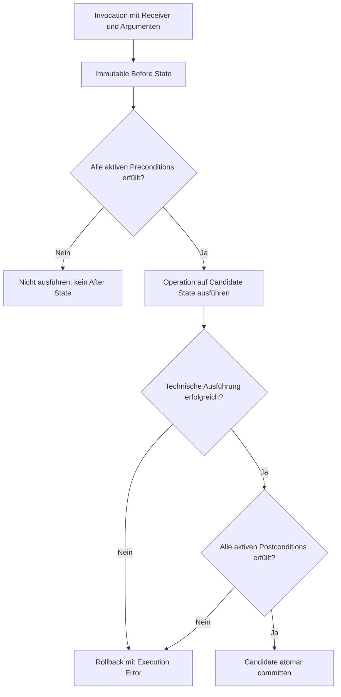

# M8 Pre-/Postconditions und Vor-/Nachzustand

## Zweck und Status

Dieses Dokument ist das Ergebnis von Mockup-Roadmap-Schritt M8. Es definiert
die Bearbeitung von Operationsverträgen und die verständliche Darstellung der
Precondition- und Postcondition-Auswertung innerhalb einer atomaren Operation
Invocation.

**Status:** `READY_FOR_REVIEW`  
**Verbindliches Mockup:**
`assets/mockups/operation-contracts.html`

Das Mockup übernimmt die gemeinsame M2-bis-M7-Struktur mit den
Hauptsegmenten `Class`, `Association`, `Invariant` und den Class-Unterbereichen
`Details`, `Attributes`, `Operations`, `Generalizations`. Contracts liegen
innerhalb der ausgewählten Operation unter `Signature`, `Preconditions`,
`Postconditions` und `Body`. Das frühere separate Mockup wurde entfernt, weil
alle fachlich relevanten Zustände in der vereinheitlichten Darstellung
enthalten sind.

M8 ist ein Analyse- und Mockup-Schritt. Es wurden keine produktiven Frontend-
oder Backendfunktionen implementiert.

## Verwendete Analysegrundlagen

| Bereich | Dokumente |
|---|---|
| Überblick | `00-overview/03-documentation-map.md` |
| UI/UX | `04-ui-ux-analysis/01-ui-overview.md`, `02-class-diagram-ui.md`, `03-object-diagram-ui.md`, `04-ocl-and-validation-ui.md`, `05-screenshot-traceability.md`, `07-m1-ui-baseline.md`, `10-redesign-design-principles.md`, `14-m7-operation-signatures-invocation.md` |
| Domäne | `03-uml-ocl-domain/01-uml-ocl-scope.md`, `02-domain-model.md`, `03-ocl-architecture-and-extension-strategy.md`, `04-validation-concept.md` |
| Frontend | `06-frontend-analysis/03-frontend-architecture.md`, `08-object-diagram-component.md`, `10-validation-error-ui.md`, `11-properties-panel.md`, `12-modal-dialogs.md`, `14-state-management.md` |
| Integration | `07-integration-and-api/01-frontend-backend-contract.md`, `03-validation-flow.md`, `05-ocl-evaluation-flow.md`, `07-dto-reference.md`, `08-error-contract.md` |
| OCL-Erweiterung | `09-ocl-extension-analysis/07-pre-post-derived-init.md`, `08-ocl-error-handling-and-source-locations.md`, `14-full-ocl-uml-compliance-matrix.md`, `15-full-ocl-uml-implementation-plan.md` |

Als visuelle Referenz wurden `01-class-diagram-class-properties.png`,
`03-class-diagram-invariant-properties.png`, `06-object-diagram-object-properties.png`,
`07-object-diagram-validation-error.png`, `09-modal-add-invariant.png`,
`13-ocl-editor.png` und `16-properties-invariants.png` geprüft.

Das aktuelle Backend enthält bereits fachliche Bausteine für
`OperationContract`, `OperationContext`, getrennte Snapshots, `result`, `@pre`
und `oclIsNew()`. Diese bilden noch keine vollständige produktive
Operationsplattform mit durchgängigem REST-Vertrag. Im aktuellen Frontend wurde
kein vollständiger Contract-/Before-/After-Workflow gefunden. Das originale
USE-Projekt wurde nicht zusätzlich geprüft, weil OCL-Analyse, Compliance-Matrix
und vorhandene Backendtests die für das Mockup erforderliche Semantik abdecken.

## Abgrenzung

M8 umfasst:

- Pre- und Postconditions als benannte, aktivierbare Operation Contracts,
- Kontextanzeige für `self`, Parameter und Rückgabetyp,
- OCL-Editor mit Source Diagnostics,
- Precondition-Gate vor der Ausführung,
- Postcondition-Prüfung auf einem Candidate-After-State,
- immutable Before State und Candidate After State als Zustandspaar,
- `result`, `@pre` und `oclIsNew()` im Post-Kontext,
- geänderte, neue und gelöschte Objekte,
- atomaren Commit oder vollständigen Rollback,
- Desktop-, Fehler-, Bestätigungs- und responsive Zustände.

Nicht enthalten sind Operation Body, `derive`, `init` und `def`; diese gehören
zu M9. M8 definiert auch keine allgemeine historische Snapshotverwaltung und
keinen State-Machine- oder Operation-Trace-Editor.

## Informationsarchitektur

Das Properties Panel behält seine drei Hauptseiten:

```text
Class | Association | Invariant
```

Operationsverträge sind keine Klasseninvarianten und erzeugen keine neue
gleichrangige Hauptseite. Nach Auswahl einer Operation bleibt `Class` aktiv.
Innerhalb von `Class` ist `Operations` aktiv. Nach Auswahl einer Operation
erscheinen dort die Untersegmente:

```text
Signature | Preconditions | Postconditions | Body
```

`Body` ist in M8 nur als deaktivierter, klar begründeter M9-Ausblick sichtbar.
Preconditions und Postconditions nutzen denselben Contract-Editor, unterscheiden
sich aber durch dauerhaft sichtbares Kind, Kontextvariablen und Hilfetext.

Der Explorer verwendet dieselbe Hierarchie wie das M2-bis-M7-Operationsmockup:
Package, Klasse, Featuregruppe und Operation bleiben sichtbar. Unter der
ausgewählten Operation folgen `Preconditions` und `Postconditions`; darunter
stehen die benannten Contracts. Die Auswahl eines Contracts synchronisiert
Explorer, Operation, Contracttab und Editor. Contracts erscheinen nicht als
gleichrangige Elemente neben Klassen oder Operationen.

| Feld | Bedeutung |
|---|---|
| Name | fachlich lesbarer Contractname |
| Kind | `PRE` oder `POST`; kein unauffälliges Umschalten während Editing |
| Enabled | Teilnahme an der nächsten Invocation |
| Expression | OCL-Ausdruck mit Boolean-Erwartung |
| Context | Operation, Receiver-Typ, Parameter und gegebenenfalls Result |
| Diagnostic | Error Code, verständliche Meldung und Source Range |

Create, Edit, Delete und Enable/Disable sind Modelländerungen. Sie sind vom
Runtime-Ergebnis einer Invocation getrennt und werden serverseitig validiert.

Precheck, Postcheck und Before-/After-Ergebnis bleiben entsprechend dem
korrigierten M7-Workflow im Object Diagram beziehungsweise in dessen unterem
Ergebnisbereich. Dieser besitzt die gleichrangigen Tabs `Console`,
`Validation Results` und `Invocation Results`. Nach einer gestarteten
Invocation wird `Invocation Results` automatisch aktiviert. Reguläre
blockierte oder abgeschlossene Invocations öffnen kein zusätzliches
Ergebnis-Modal.

## OCL-Kontexte

| Sprachelement | Precondition | Postcondition |
|---|---:|---:|
| `self` | ja, im Before State | ja, im Candidate After State |
| Operationsparameter | ja | ja |
| `result` | nein | bei Operation mit Rückgabewert |
| `@pre` | nein | ja, für zulässigen Vorzustandszugriff |
| `oclIsNew()` | nein | ja, für im Aufruf erzeugte Objekte |
| erwarteter Contracttyp | Boolean | Boolean |

Beispiel:

```ocl
context BankAccount::transfer(target : BankAccount, amount : Real) : Boolean
pre EnoughFunds:
  amount > 0 and self.balance >= amount

post BalancesUpdated:
  self.balance = self.balance@pre - amount and
  target.balance = target.balance@pre + amount and
  result = true
```

Eine Source Diagnostic markiert den exakten Ausdrucksbereich und nennt den
fachlichen Kontext. Unbekannte Properties, illegales `result`, illegales
`@pre`, falscher Body-Typ und fehlende Kontextwerte besitzen unterscheidbare
Codes und Meldungen.

## Invocation- und Contract-Ablauf



Eine Precondition-Verletzung ist keine Postcondition-Verletzung und kein
technischer Ausführungsfehler. Eine Postcondition wird nur geprüft, wenn die
Operation technisch einen Candidate After State und gegebenenfalls ein Result
erzeugt hat. Ein fehlgeschlagener Postcheck verwirft alle Candidate-Änderungen.

## Before-/After-Darstellung

Desktop zeigt Before und Candidate After standardmäßig nebeneinander. Der
Header macht deutlich, dass beide Ansichten zu derselben Invocation gehören.
Der Candidate State trägt bis zum erfolgreichen Contractabschluss die
Kennzeichnung `not committed`.

| Delta | Darstellung |
|---|---|
| unverändert | neutral, bei Bedarf einklappbar |
| geändert | alter und neuer fachlicher Wert, Text `changed` |
| neu | Objektname, Klasse und Text `new`; `oclIsNew() = true` im Detail |
| gelöscht | letzter fachlicher Name, Klasse und Text `deleted` |
| Linkänderung | Association- und Rollennamen sowie hinzugefügt/entfernt |

Farbe ist nie das einzige Signal. Interne Snapshot-, Objekt- und Invocation-IDs
werden nicht als primäre Überschriften verwendet. Bei langen Zuständen sind
beide Snapshotbereiche unabhängig intern scrollbar und können synchron nach
fachlichem Objekt gefiltert werden.

Auf schmalen Viewports werden Before und After über ein Segmented Control
umgeschaltet. Eine dauerhaft sichtbare Invocation-Zusammenfassung verhindert,
dass die Ansichten wie unabhängige Projekte wirken.

## Invocation Results und Navigation

`Invocation Results` gehört zum unteren Workspace-Bereich und enthält genau
die Ergebnisse eines konkreten Operationsaufrufs. Der Bereich `Object
Properties > Operations` bleibt für Receiver, Operationsauswahl, Argumente und
Start der Ausführung zuständig. Nach dem Start zeigt er nur eine kompakte
Statuszusammenfassung; die ausführlichen Contract- und Zustandsresultate stehen
im automatisch aktivierten unteren Tab.

Die benachbarten Tabs haben getrennte Aufgaben: `Console` zeigt chronologische
Textmeldungen. `Validation Results` zeigt Ergebnisse von `Check Constraints`,
insbesondere Invarianten. `Invocation Results` zeigt Pre-/Postconditions,
Rückgabewert, Out-Werte, Before/Candidate After sowie Commit, Block oder
Rollback der ausgewählten Invocation.

Innerhalb von `Invocation Results` steht zuerst eine kompakte
Invocation-Zusammenfassung mit Receiver, Operation, Argumenten und Gesamtstatus.
Darunter folgt eine Ergebnisliste der ausgewerteten Contracts. Die Auswahl
eines Eintrags klappt im selben Bottom Panel dessen Details auf. Ein verletzter
Pre-Eintrag erklärt den Block ohne After State. Ein verletzter Post-Eintrag
zeigt Before und Candidate After sowie den Rollback. Das Panel darf über einen
Ziehgriff vergrößert werden und bleibt intern scrollbar; es ist weder ein Modal
noch eine zusätzliche Workspace-Seite.

Ein Runtime-Ergebnis nennt:

- Operation und Receiver,
- Contractkind und Contractname,
- Status `SATISFIED`, `VIOLATED`, `CONTEXT_ERROR` oder `NOT_EVALUATED`,
- verständliche Erwartung und tatsächlichen Wert,
- betroffene Parameter, Objekte, Attribute oder Association-Rollen,
- Source Range im Contracttext,
- Before-/After-Bezug,
- Commit- oder Rollbackstatus.

`Open contract` selektiert Operation, Segment und Contract und fokussiert die
Source Range. `Show object change` öffnet das Object Diagram mit demselben
Invocation-Kontext. Der normale Button `Check Constraints` prüft Invarianten,
nicht kontextlose Pre-/Postconditions. Contracts werden im Invocation Flow
ausgewertet.

## Zustandskatalog

| Zustand | M8-Festlegung |
|---|---|
| Default | Operation zeigt Contractanzahl, kein Runtime-Ergebnis ist geöffnet. |
| Selected | Segment und Contract sind eindeutig selektiert. |
| Editing | Name, Enabled, Expression, Kontext und Diagnostic sind sichtbar. |
| Loading | Typecheck, Precheck, Execution oder Postcheck benennt seine Phase. |
| Error | Source-, Kontext-, Pre-, Execution- und Postfehler sind unterscheidbar. |
| Disabled | Body-Segment, Save oder Invocation besitzt eine sichtbare Begründung. |
| Empty | Leere Pre-/Postliste bietet eine passende Create-Aktion. |
| Confirmation | Delete und Verwerfen ungespeicherter Änderungen verlangen Bestätigung. |
| Success | Contract gespeichert oder Invocation vollständig committed. |
| Pre violated | Ausführung blockiert; kein After State wird behauptet. |
| Post violated | Candidate sichtbar, aber vollständig zurückgerollt. |
| Result | Contractliste, Result und Zustandspaar bleiben miteinander verknüpft. |

## Accessibility und Redesign

- Der Anfänger-Kernweg bleibt Operation auswählen, Contractart öffnen, Ausdruck
  bearbeiten und speichern.
- `PRE` und `POST` werden zusätzlich zu Farbe textuell gekennzeichnet.
- Quick Help erklärt den Unterschied zwischen Voraussetzung und zugesichertem
  Nachzustand sowie `@pre` in einfachen Sätzen.
- Source Errors sind per Tastatur erreichbar und bewegen den Editorfokus zur
  betroffenen Stelle.
- Before-/After-Toggles besitzen programmatische Namen und Status.
- Result, Properties und Snapshotbereiche bleiben intern scrollbar.
- Fokus kehrt nach Dialogschluss zur auslösenden Aktion zurück.

Damit werden `RD-NAV-001` bis `RD-NAV-005`, `RD-VIS-001` bis `RD-VIS-004` und
`RD-A11Y-001` bis `RD-A11Y-005` berücksichtigt.

## Compliance-Zuordnung

| Matrix-ID | M8-Bezug |
|---|---|
| `CM-CTX-002` | Operation Precondition mit Receiver, Parameterbindung und Before State |
| `CM-CTX-003` | Operation Postcondition mit Result sowie Vor-/Nachzustand |
| `CM-OCL-025` | `@pre`, `result` und `oclIsNew()` im zulässigen Post-Kontext |
| `CM-UML-016` | atomare Invocation, Contract-Gates, Commit und Rollback |
| `CM-UML-017` | neue und gelöschte Objekte innerhalb des Zustandspaars |
| `CM-UML-015` | Operation und stabile Parameter als Contractkontext |

M8 visualisiert diese Compliance Points, setzt sie aber nicht technisch um und
ändert ihren aktuellen Matrixstatus nicht.

## Vorläufige Domänen-, API- und DTO-Anforderungen

```ts
type ContractKindDto = 'PRE' | 'POST';
type ContractStatusDto =
  | 'SATISFIED'
  | 'VIOLATED'
  | 'CONTEXT_ERROR'
  | 'NOT_EVALUATED';

interface OperationContractDto {
  id: string;
  operationId: string;
  name: string;
  kind: ContractKindDto;
  expression: string;
  enabled: boolean;
  sourceRange?: SourceRangeDto;
}

interface OperationInvocationResultDto {
  invocationId: string;
  operation: NamedOperationReferenceDto;
  receiver: NamedObjectReferenceDto;
  status: 'COMMITTED' | 'BLOCKED' | 'ROLLED_BACK';
  result?: TypedValueDto;
  contractResults: OperationContractResultDto[];
  statePair?: InvocationStatePairDto;
  diagnostics: DiagnosticDto[];
  revision: number;
}

interface InvocationStatePairDto {
  before: SnapshotSummaryDto;
  candidateAfter: SnapshotSummaryDto;
  changes: ObjectChangeDto[];
  committed: boolean;
}
```

| Bereich | Spätere Anforderung |
|---|---|
| Domäne | Contracts über stabile Operation-/Parameter-IDs referenzieren |
| Context | getrennte typisierte Pre- und Postkontexte statt vieler Nullable-Felder |
| Snapshot | immutable Before und isolierter Candidate After mit stabiler Objektidentität |
| Lifecycle | created, changed und deleted innerhalb derselben Invocation bestimmen |
| Evaluation | `result`, `@pre` und `oclIsNew()` ausschließlich kontextgerecht binden |
| Atomicity | Postverletzung oder Execution Error darf keine Teilpersistenz hinterlassen |
| API | CRUD/Typecheck für Contracts und Invocation Result mit Zustandspaar |
| Errors | Contract, Operation, Parameter, Objekt, Property, Rolle und Source Range strukturieren |
| Concurrency | Before Revision prüfen und nur nach Commit eine neue Revision ausgeben |

Ein möglicher API-Schnitt trennt Modellpflege und Runtime:

```http
POST   /api/v1/projects/{projectId}/operations/{operationId}/contracts
PUT    /api/v1/projects/{projectId}/operations/{operationId}/contracts/{contractId}
DELETE /api/v1/projects/{projectId}/operations/{operationId}/contracts/{contractId}
POST   /api/v1/projects/{projectId}/operations/{operationId}/invoke
```

## Vorläufige Frontend-Anforderungen

- unveränderte Properties-Hauptseiten `Class`, `Association`, `Invariant`,
- Untersegmente `Signature`, `Preconditions`, `Postconditions` und später
  `Body` nur innerhalb der Operation Details unter `Class`,
- Contractliste mit Create, Edit, Delete und Enable/Disable,
- OCL-Editor mit Operation Context und Source Diagnostics,
- getrennte UI-States für Precondition Block, Execution Error und Postrollback,
- Before-/After-Komponente mit fachlichem Delta-Modell,
- gekoppelte Navigation zwischen Contract, Validation Result und Object Diagram,
- responsive Side-by-side-/Toggle-Strategie,
- Fokusmanagement und scrollbare Langinhalte,
- keine lokale Contractbewertung oder fachliche Commitentscheidung,
- kein optimistisches Anwenden des Candidate State.

## Annahmen und offene Entscheidungen

| Art | Punkt |
|---|---|
| Annahme | Preconditions werden vor jeder fachlichen Operation Invocation geprüft. |
| Annahme | Postconditions werden vor Commit auf einem isolierten Candidate State geprüft. |
| Annahme | Eine verletzte Postcondition rollt die gesamte Invocation zurück. |
| Annahme | `Check Constraints` wertet ohne Invocation keine Pre-/Postconditions aus. |
| Offen | Ob erfolgreiche Zustandspaare dauerhaft gespeichert oder nur request-lokal gehalten werden. |
| Offen | Aufbewahrungsdauer fehlgeschlagener Candidate States für Diagnosezwecke. |
| Offen | Vollständiger normativer Umfang zulässiger `@pre`-Formen. |
| Offen | Semantik gelöschter Objekte und Navigation im Postkontext. |
| Offen | Darstellung sehr großer Snapshot-Deltas und serverseitiges Paging. |
| Offen | Verhalten deaktivierter Contracts in Import und Invocation Result. |
| Offen | Ob ein technischer Execution Error Postconditions grundsätzlich als `NOT_EVALUATED` markiert. |

## Akzeptanzkriterien

- [x] Pre- und Postconditions sind als getrennte Operationssegmente entworfen.
- [x] Contractname, Expression, Enabled und Source Diagnostic sind sichtbar.
- [x] Precondition-Verletzung blockiert Ausführung ohne After State.
- [x] Before und Candidate After gehören sichtbar zu derselben Invocation.
- [x] Geänderte, neue und gelöschte Objekte sind ohne reine Farbcodierung erkennbar.
- [x] `@pre`, `result` und `oclIsNew()` sind im Postkontext erläutert.
- [x] Postcondition-Verletzung zeigt Candidate State und vollständigen Rollback.
- [x] Default, Selected, Editing, Loading, Error, Disabled, Empty, Confirmation und Success sind festgelegt.
- [x] Desktop und schmaler Viewport sind dokumentiert.
- [x] Properties, Results und Zustandspanele sind intern scrollbar.
- [x] M8 verwendet dieselbe Class-Properties-Hierarchie wie M2 bis M7.
- [x] Der Explorer ordnet Contracts unter der ausgewählten Operation ein.
- [x] Hauptsegmente werden als echte UI-Elemente und nicht als CSS-Pseudotext dargestellt.
- [x] Runtime-Ergebnisse bleiben ohne redundantes Modal im Object-Diagram-Kontext.
- [x] Domänen-, API-, DTO-, Frontend- und Compliance-Anforderungen sind abgeleitet.
- [x] Operation Body, Derived, Init und Def aus M9 wurden nicht vorgezogen.

## Ergebnis

M8 verbindet die Modellpflege von Operationsverträgen mit einer klaren,
atomaren Laufzeitdarstellung. Preconditions wirken als Gate vor der Ausführung;
Postconditions prüfen einen isolierten Candidate After State gegen den
unveränderlichen Before State. Das Mockup macht Result, `@pre`, neue und
gelöschte Objekte sowie Commit oder Rollback nachvollziehbar, ohne technische
IDs in den Vordergrund zu stellen oder M9-Funktionen vorwegzunehmen.
