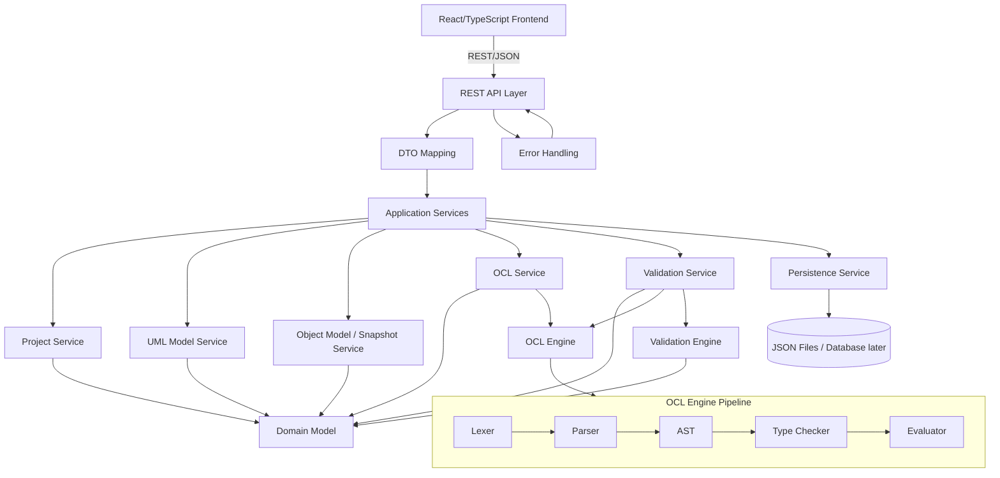
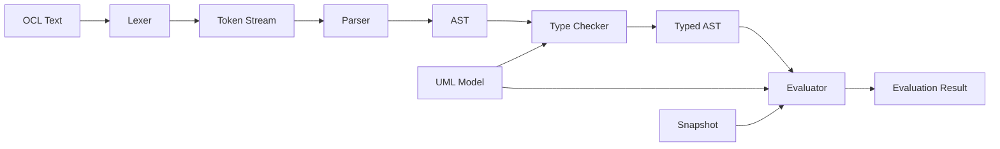
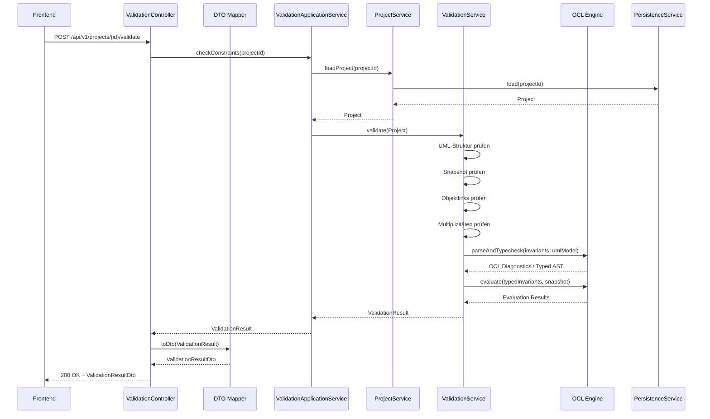

# Backend Architecture

## Zweck dieser Datei

Diese Datei beschreibt die Zielarchitektur des neuen Backends für das webbasierte UML/OCL-System.

Sie erklärt:

- welche Architekturschichten das Backend besitzt,
- wie REST API, Application Services, Domänenmodell, OCL Engine, Validation Engine und Persistence zusammenspielen,
- warum das Backend die fachliche Validierung zentral übernimmt,
- wie das Backend unabhängig vom Frontend bleibt,
- wie die Architektur spätere OCL-Erweiterungen vorbereitet,
- wie das originale USE-Projekt fachlich als Referenz eingeordnet wird, ohne dessen Code zu übernehmen.

## Architekturziele

| Ziel | Bedeutung |
|---|---|
| Eigenständiges Backend | Neues Java/Spring-Boot-Backend, kein Teil des alten USE-Repositories. |
| Fachliche Semantik im Backend | UML-Struktur, Snapshot-Konsistenz, OCL und Validierung werden zentral geprüft. |
| Klare REST/JSON-Grenze | Das Frontend kommuniziert über strukturierte DTOs, nicht über interne Domain-Objekte. |
| Erweiterbare OCL-Verarbeitung | Lexer, Parser, AST, Typechecker und Evaluator sind getrennte Phasen. |
| Testbare Fachlogik | OCL, Validation und Services sind unabhängig von UI und HTTP testbar. |
| Stabile Fehlerausgabe | Validation Results enthalten maschinenlesbare Codes und Elementreferenzen. |
| MVP-fokussiert | Das Backend unterstützt einen vertikalen Durchstich, keine vollständige USE-Feature-Parität. |

## Architekturprinzipien

### Backend als Semantikquelle

Das Frontend visualisiert und editiert, aber das Backend entscheidet fachlich. Diese Trennung ist zentral, weil OCL, Typprüfung, Association Navigation, Snapshot-Regeln und Multiplizitäten nicht zuverlässig im UI dupliziert werden sollten.

Das Backend ist verantwortlich für:

- gültige UML-Modellstruktur,
- gültige Objektzustände,
- OCL-Syntaxprüfung,
- OCL-Typechecking,
- OCL-Evaluation gegen Snapshots,
- Multiplicity Checks,
- strukturierte Fehler- und Validation Results.

### Frontend-Unabhängigkeit

Das Backend kennt keine Canvas-Interaktionen, keine React-Komponenten und kein visuelles Rendering. Es kann Layoutdaten speichern, behandelt diese aber als persistierbare UI-Metadaten, nicht als fachliche UML-Semantik.

### Schichten statt technischer Kopplung

Controller, DTOs, Application Services, Domain Model, OCL Engine, Validation Engine und Persistence haben getrennte Verantwortlichkeiten. Diese Trennung verhindert, dass OCL-Logik in Controllern oder UI-spezifische Annahmen in Domain-Objekten landen.

### USE als Referenz, nicht als Runtime

Das originale USE-Projekt ist fachlich relevant für Konzepte, Syntax, Verhalten und Testfälle. Es wird nicht als Dependency verwendet und nicht technisch migriert.

## Schichtenmodell

Das Backend kann als geschichtete Architektur mit fachlichen Kernkomponenten verstanden werden:

```text
REST API Layer
  -> DTO Mapping
  -> Application Services
  -> Domain Model
  -> OCL Engine
  -> Validation Engine
  -> Persistence
  -> Error Handling
```

Die Schichten sind nicht alle strikt linear. Validation nutzt Domain Model und OCL Engine. Application Services koordinieren Persistence und fachliche Services. DTO Mapping bildet zwischen API-Vertrag und internen Modellen ab.

## Komponentenübersicht



## Komponenten und Verantwortlichkeiten

| Komponente | Verantwortung | Nutzt | Liefert |
|---|---|---|---|
| REST API Layer | HTTP-Endpunkte für Projekt, UML, Snapshot, OCL und Validierung. | DTOs, Application Services | JSON-Antworten |
| DTO Mapping | Übersetzt zwischen API-DTOs und internen Modellen/Commands. | DTOs, Domain, Commands | stabile API-Grenze |
| Application Services | Koordinieren Use Cases und Transaktionen. | Domain Services, Persistence, Validation | fachliche Anwendungsergebnisse |
| Project Service | Projekt als Aggregat aus UML-Modell, Snapshot, Layout und Metadaten verwalten. | Domain, Persistence | Projektzustand |
| UML Model Service | Klassen, Attribute, Operationen, Associations, Rollen und Multiplizitäten verwalten. | Domain UML | konsistentes UML-Modell |
| Object Model / Snapshot Service | Objekte, Slots und Objektlinks verwalten. | Domain Snapshot, UML-Modell | validierbarer Snapshot |
| OCL Service | Invarianten verwalten und OCL-Diagnosen koordinieren. | OCL Engine, Domain OCL | OCL-Diagnosen, gespeicherte Invarianten |
| OCL Engine | OCL lexen, parsen, typprüfen und auswerten. | UML-Modell, Snapshot | Typed AST, Evaluation Results, Diagnostics |
| Validation Service | Vollständigen Constraint Check orchestrieren. | UML, Snapshot, OCL Engine, Validation Engine | `ValidationResult` |
| Validation Engine | Einzelne Validierungsregeln ausführen. | Domain Model | `ValidationError`-Sammlung |
| Persistence Service | Projekte laden und speichern. | JSON-Format, Repository | persistierter Projektzustand |
| Error Handling | Exceptions und fachliche Fehler in einheitliche API-Antworten übersetzen. | Fehlercodes, Exceptions | API Error Responses |
| Domain Model | Fachliche Kernobjekte und stabile IDs. | keine UI-/HTTP-Details | semantische Basis |

## REST API Layer

Der REST API Layer ist die einzige direkte Schnittstelle zum Frontend.

Typische Controller:

| Controller | Aufgabe |
|---|---|
| `ProjectController` | Projekt erstellen, laden, speichern, importieren/exportieren. |
| `UmlModelController` | Klassen, Attribute, Operationen und Associations bearbeiten. |
| `SnapshotController` | Objekte, Slots und Objektlinks bearbeiten. |
| `OclController` | Invarianten erstellen, ändern, löschen und optional OCL prüfen. |
| `ValidationController` | `Check Constraints` ausführen. |

Der API Layer sollte keine fachliche Validierungslogik enthalten. Er validiert nur technische Request-Struktur, ruft Application Services auf und gibt DTOs zurück.

## Application Services

Application Services bilden die Use-Case-Schicht. Sie koordinieren fachliche Operationen, ohne HTTP-Details zu kennen.

Beispiele:

| Application Service | Beispielhafte Use Cases |
|---|---|
| `ProjectApplicationService` | Projekt anlegen, Projekt laden, Projekt speichern. |
| `UmlModelApplicationService` | Klasse erstellen, Association ändern, Multiplicity speichern. |
| `SnapshotApplicationService` | Objekt erstellen, Slot-Wert setzen, Objektlink erstellen. |
| `OclApplicationService` | Invariante anlegen, OCL-Ausdruck prüfen. |
| `ValidationApplicationService` | vollständigen Constraint Check ausführen. |

Diese Services sind gute Einstiegspunkte für Integrationstests, weil sie fachliche Workflows ohne HTTP-Schicht abbilden.

## Domain Model

Das Domain Model enthält die fachlichen Kernobjekte des neuen Systems:

- `Project`,
- `UmlModel`,
- `UmlClass`,
- `UmlAttribute`,
- `UmlOperation`,
- `UmlAssociation`,
- `UmlAssociationEnd`,
- `Multiplicity`,
- `UmlInvariant`,
- `ObjectModel` oder `Snapshot`,
- `ObjectInstance`,
- `Slot`,
- `ObjectLink`,
- `ValidationResult`,
- `ValidationError`,
- `LayoutInformation`.

Wichtige Regeln:

- UML-Modell und Snapshot bleiben getrennt.
- OCL-Invarianten gehören zum UML-Modell, werden aber gegen Snapshots ausgewertet.
- Validierungsergebnisse referenzieren Domain-Elemente über stabile IDs.
- Layoutinformationen sind persistierbar, aber nicht Teil der fachlichen UML-Semantik.
- Domain-Objekte enthalten keine React-, Canvas- oder HTTP-spezifischen Details.

## OCL Engine

Die OCL Engine ist eine eigenständige fachliche Komponente. Sie darf nicht durch Regex- oder String-Sonderfälle ersetzt werden.

Pipeline:



MVP-Aufgaben:

| OCL-Phase | MVP-Verantwortung |
|---|---|
| Lexer | Tokens für `self`, Identifier, Literale, Operatoren, Klammern, `.`, `->` erzeugen. |
| Parser | AST für Attributzugriff, Navigation, Vergleiche, Boolean-Ausdrücke und Collection-Grundoperationen erzeugen. |
| AST | Ausdrucksstruktur unabhängig vom Quelltext repräsentieren. |
| Type Checker | Attribute, Rollen, Operatoren und Collection-Operationen gegen das UML-Modell prüfen. |
| Evaluator | Ausdruck pro Kontextobjekt gegen den aktuellen Snapshot auswerten. |
| Diagnostics | Syntax-, Typ- und Evaluationsfehler strukturiert liefern. |

Post-MVP kann die OCL Engine um `forAll`, `exists`, `select`, `collect`, `let`, `if-then-else`, `allInstances`, pre/post conditions, derived attributes und init values erweitert werden.

## Validation Engine

Die Validation Engine prüft das Zusammenspiel von UML-Modell, Snapshot und OCL.

Validierungsebenen:

| Ebene | Beschreibung | Typische Fehler |
|---|---|---|
| UML-Strukturvalidierung | Klassen, Attribute, Operationen, Associations, Rollen und Multiplizitäten prüfen. | `UNKNOWN_CLASS`, `TYPE_ERROR` |
| Snapshot-Validierung | Objekte, Slots, Objektlinks und Referenzen auf das UML-Modell prüfen. | `INVALID_SLOT_VALUE`, `INVALID_LINK` |
| Linkvalidierung | Prüfen, ob Objektlinks zu Associations und Klassentypen passen. | `INVALID_LINK` |
| Multiplizitätsvalidierung | Linkanzahlen gegen Association-End-Multiplizitäten prüfen. | `MULTIPLICITY_VIOLATION` |
| OCL-Syntaxprüfung | OCL-Ausdrücke lexen und parsen. | `SYNTAX_ERROR` |
| OCL-Typprüfung | OCL-Ausdrücke gegen UML-Modell typprüfen. | `TYPE_ERROR`, `UNKNOWN_ATTRIBUTE` |
| OCL-Invariantenauswertung | Invarianten gegen alle Objekte der Kontextklasse auswerten. | `INVARIANT_VIOLATION`, `EVALUATION_ERROR` |

Der `ValidationService` orchestriert diese Prüfungen und erzeugt am Ende ein strukturiertes `ValidationResult`.

## Persistence

Die Persistenzschicht speichert und lädt Projekte. Im MVP ist ein JSON-basiertes Projektformat sinnvoll, weil es:

- gut zur REST/JSON-API passt,
- einfach testbar ist,
- Import/Export im MVP ermöglicht,
- später in Datenbankpersistenz überführt werden kann.

Mögliche Persistenzvarianten:

| Variante | Rolle |
|---|---|
| In-Memory Repository | Frühe Entwicklung und Tests. |
| File-basiertes JSON Repository | MVP-Projektformat und lokale Speicherung. |
| Datenbank Repository | Post-MVP, falls mehrere Nutzer, Versionierung oder persistente Serverprojekte nötig werden. |

Die Persistence-Schicht sollte nicht entscheiden, ob ein Projekt fachlich gültig ist. Sie prüft Format und Version, fachliche Validierung bleibt Aufgabe der Domain-/Validation-Schicht.

## Error Handling

Das Backend unterscheidet technische Fehler, API-Fehler und fachliche Validierungsergebnisse.

| Kategorie | Beispiel | Behandlung |
|---|---|---|
| Technischer Fehler | unerwartete Exception, nicht erreichbare Persistenz | API Error Response, Logging |
| API-Fehler | ungültiger Request Body, fehlende Pflichtfelder | HTTP-Fehler mit strukturiertem Body |
| Domain-Fehler | referenzierte Klasse existiert nicht | fachliche Fehlermeldung oder API-Fehler je nach Operation |
| OCL-Diagnostic | Syntax- oder Typecheck-Problem | Teil von OCL-Diagnosen oder `ValidationResult` |
| Constraint-Verletzung | Invariante verletzt, Multiplizität falsch | kein technischer Fehler, sondern `ValidationError` |

Constraint-Verletzungen dürfen nicht als technische Exceptions modelliert werden. Sie sind erwartbare fachliche Ergebnisse eines Constraint Checks.

## DTO Mapping

DTO Mapping trennt API-Vertrag und internes Domain Model.

Gründe für getrennte DTOs:

- API kann stabil bleiben, auch wenn interne Klassen geändert werden.
- Frontend bekommt genau die Daten, die es benötigt.
- Domain-Objekte müssen keine JSON-/HTTP-Anmerkungen tragen.
- Fehler- und Validation Results können UI-freundlich strukturiert werden.

Beispiele:

| Domain-Objekt | DTO |
|---|---|
| `Project` | `ProjectDto` |
| `UmlClass` | `UmlClassDto` |
| `UmlAssociation` | `UmlAssociationDto` |
| `UmlInvariant` | `InvariantDto` |
| `ObjectInstance` | `ObjectInstanceDto` |
| `ObjectLink` | `ObjectLinkDto` |
| `ValidationResult` | `ValidationResultDto` |
| `ValidationError` | `ValidationErrorDto` |

## Ablauf: Check Constraints

Das folgende Sequenzdiagramm beschreibt den MVP-Ablauf für `Check Constraints`.



Falls das Frontend einen ungespeicherten Projektzustand validieren soll, kann eine alternative API den aktuellen Projektzustand im Request Body senden. Die Architektur bleibt gleich: Der API Layer mappt DTOs, die Application-Schicht koordiniert, und Validation/OCL erzeugen das Ergebnis.

## Bezug zum originalen USE-Projekt

Das originale USE-Projekt ist besonders relevant für die fachliche Architektur, aber nicht als technische Grundlage.

| Original-USE-Bereich | Bedeutung für neue Architektur | Übernahme? |
|---|---|---|
| `org.tzi.use.uml.mm` | Referenz für UML-Modellkonzepte wie Klassen, Attribute, Associations, Multiplizitäten, Invarianten. | Keine Codeübernahme |
| `org.tzi.use.uml.sys` | Referenz für Systemzustände, Objekte, Objektzustände und Links. | Keine Codeübernahme |
| `org.tzi.use.uml.ocl.expr` | Referenz für OCL-Ausdrucksmodell und Evaluation gegen Zustände. | Keine Codeübernahme |
| `org.tzi.use.uml.ocl.type` | Referenz für OCL-Typkonzepte. | Keine Codeübernahme |
| `org.tzi.use.parser` | Referenz für Parsing, Semantikfehler und spätere `.use`-Importfragen. | Keine Codeübernahme |
| `use-core/src/main/resources/examples/` | Quelle für Beispielmodelle und Testfallableitung. | Testfallquelle, nicht Runtime |
| `use-gui` | Historische Desktop-UI. | Nicht übernehmen |

Die neue Architektur übernimmt die fachliche Idee, dass ein Modell, ein Systemzustand und OCL-Constraints zusammen validiert werden. Sie übernimmt nicht die technischen Klassen, Parser, GUI oder Build-Struktur des Originals.

## Erweiterbarkeit

Die Architektur bereitet spätere Erweiterungen bewusst vor.

| Erweiterungsbereich | Architekturvorbereitung |
|---|---|
| OCL-Sprachausbau | Neue Lexer-Tokens, Parser-Regeln, AST-Knoten, Typechecker- und Evaluator-Regeln können ergänzt werden. |
| Iteratoren | Evaluation Context kann um Iterator-Variablen erweitert werden. |
| Vererbung | Domain UML und Typechecker können Klasshierarchien ergänzen. |
| Enumerationen | Typmodell kann um Enum-Typen erweitert werden. |
| `.use` Import/Export | Persistence/API kann um Import-/Export-Adapter ergänzt werden. |
| Mehrere Snapshots | Snapshot Service kann mehrere benannte Snapshots verwalten. |
| Datenbankpersistenz | Repository-Interface kann von File/JSON auf Datenbankimplementierung erweitert werden. |
| Frontend-Features | API liefert strukturierte Daten für Autocomplete, Diagnostics, Source Ranges und Evaluation Traces. |

## Offene Fragen

| Frage | Bedeutung |
|---|---|
| Soll `Check Constraints` gespeicherte Projekte validieren oder auch ungespeicherte Frontend-Drafts akzeptieren? | Beeinflusst API-Design und DTO-Größe. |
| Wird OCL-Syntax-/Typechecking als eigener Endpunkt angeboten? | Beeinflusst OCL Service und Editor-Feedback. |
| Wie fein müssen Source Ranges im MVP sein? | Beeinflusst Lexer/Parser und UI-Diagnosen. |
| Wird das JSON-Projektformat im Backend versioniert? | Beeinflusst Persistence und Migration. |
| Wie strikt wird bei Modelländerungen mit abhängigen Snapshots und Invarianten umgegangen? | Beeinflusst Application Services und Domain-Regeln. |
| Wird das Backend im MVP stateless betrieben oder hält es serverseitige Projektzustände? | Beeinflusst Persistence und Deployment. |

## Zusammenfassung

Die Backend-Zielarchitektur trennt REST API, DTO Mapping, Application Services, Domain Model, OCL Engine, Validation Engine, Persistence und Error Handling klar voneinander. Das Backend bleibt unabhängig vom Frontend und übernimmt die zentrale fachliche Semantik.

Für den MVP ist entscheidend, dass `Check Constraints` durchgängig funktioniert: Projekt laden, UML-Modell und Snapshot prüfen, OCL-Invarianten parsen, typprüfen und auswerten, anschließend ein strukturiertes `ValidationResult` zurückgeben. Die Architektur ist bewusst so geschnitten, dass spätere OCL- und UML-Erweiterungen möglich sind, ohne den MVP-Kern neu zu bauen.
