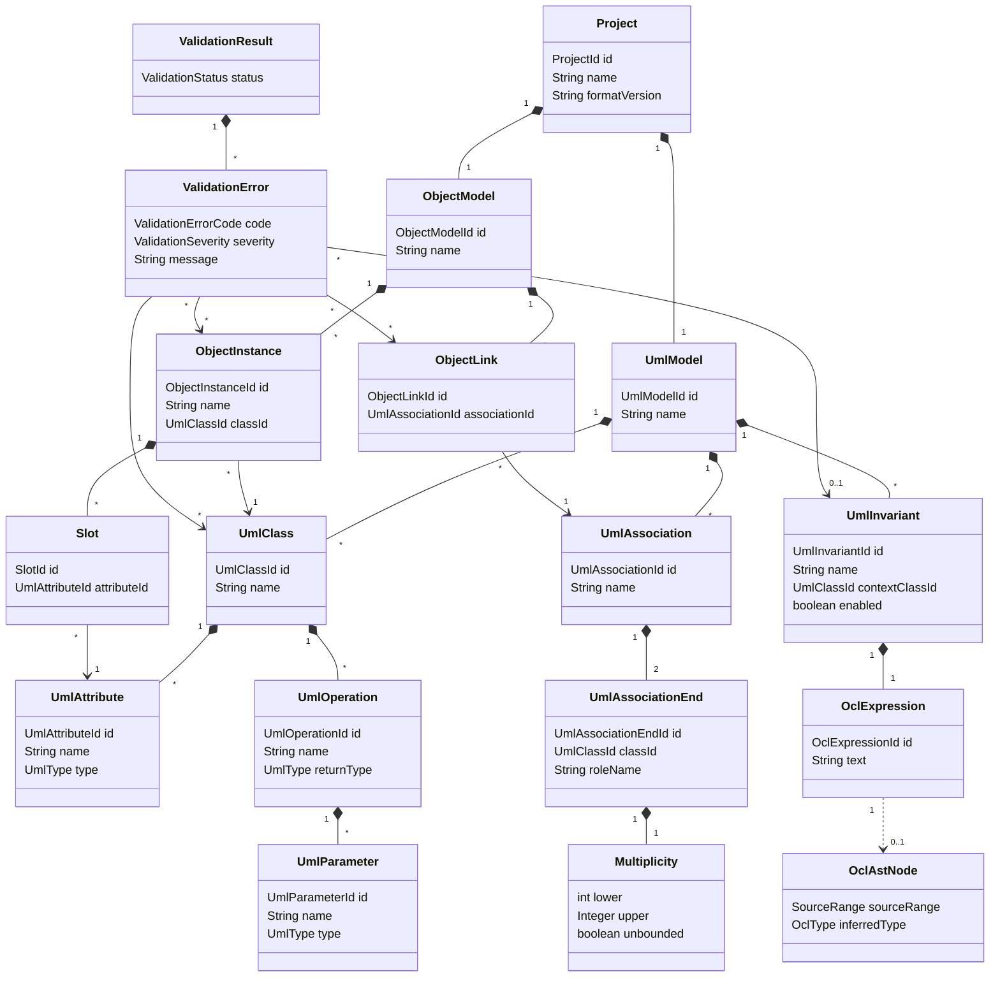

# Domain Model Implementation

## Zweck dieser Datei

Diese Datei beschreibt, wie das fachliche Domänenmodell im neuen Java/Spring-Boot-Backend umgesetzt werden soll.

Sie konkretisiert die Backend-Sicht auf:

- Project,
- UML Model,
- Class Model,
- Association Model,
- Object Model / Snapshot,
- OCL Model,
- Validation Model.

Die Datei bleibt bewusst konzeptionell. Sie beschreibt sinnvolle Java-Repräsentationen, ohne bereits Implementierungscode festzulegen. Das originale USE-Projekt dient als fachliche Referenz für UML/OCL-Konzepte, Systemzustände und Validierung, wird aber nicht technisch übernommen.

## Grundprinzipien

| Prinzip | Bedeutung für die Backend-Umsetzung |
|---|---|
| Domain vor API | Das Domänenmodell ist nicht identisch mit REST-DTOs. |
| Stabile IDs | Alle fachlichen Elemente brauchen IDs für Frontend-Mapping, Validation Results und JSON-Projektformat. |
| UML und Snapshot trennen | Klassenmodell und Objektzustand sind unterschiedliche Domänenbereiche. |
| OCL als Modellbestandteil | Invarianten gehören zum UML-Modell, werden aber gegen Snapshots ausgewertet. |
| Validation Results sind Ergebnisse | Validierungsergebnisse sind nicht Teil der Modellsemantik, sondern Resultat eines Checks. |
| Layout ist optional | Layoutdaten können gespeichert werden, sind aber frontendnahe Metadaten und keine Kernsemantik. |
| MVP klein halten | Das Modell unterstützt Klassen, Attribute, Operationensignaturen, Associations, Rollen, Multiplizitäten, Invarianten, Objekte, Slots und Links. |
| Erweiterbarkeit vorbereiten | Vererbung, Enumerationen, Assoziationsklassen, mehrere Snapshots und OCL-Erweiterungen sollen später ergänzbar bleiben. |

## Trennung von UML-Modell und Snapshot

Das UML-Modell beschreibt die Struktur. Der Snapshot beschreibt einen konkreten Zustand dieser Struktur.

| Bereich | Enthält | Wird genutzt für |
|---|---|---|
| UML Model | Klassen, Attribute, Operationen, Associations, Rollen, Multiplizitäten, Invarianten. | Class Diagram, OCL-Typechecking, Snapshot-Validierung. |
| Object Model / Snapshot | Objekte, Slots, Objektlinks. | Object Diagram, OCL-Evaluation, Multiplicity Checks. |
| Validation Model | Fehler und Resultate eines Checks. | Validation Results Panel, Diagramm-Markierungen, Tests. |

Beispiel:

- `UmlClass User` definiert, dass ein Objekt vom Typ `User` Attribute und Links besitzen kann.
- `ObjectInstance alice : User` ist eine konkrete Instanz dieser Klasse.
- `UmlInvariant maxBooks` definiert eine OCL-Regel im Kontext `User`.
- Der OCL Evaluator prüft diese Regel für `alice` im aktuellen Snapshot.

## Project

`Project` ist der oberste Aggregate Root des Backends.

| Aspekt | Beschreibung |
|---|---|
| Zweck | Bündelt UML-Modell, Snapshot, optionale Layoutdaten und Projektmetadaten. |
| Wichtigste Felder | `ProjectId id`, `String name`, `String description`, `String formatVersion`, `UmlModel umlModel`, `ObjectModel objectModel`, optional `LayoutInformation layout`, `Instant createdAt`, `Instant updatedAt`. |
| Beziehungen | Enthält genau ein `UmlModel`; im MVP genau ein aktives `ObjectModel`. |
| MVP-Relevanz | Hoch. Grundlage für Speichern, Laden und Validieren. |
| Spätere Erweiterbarkeit | Mehrere Snapshots, Projektversionen, Datenbankpersistenz, Nutzer-/Workspace-Zuordnung. |
| Mögliche Java-Repräsentation | Klasse oder Record mit Value Objects für IDs; als Aggregate Root in `domain.project`. |

Java-ähnliches Beispiel:

```java
public final class Project {
    private final ProjectId id;
    private String name;
    private String description;
    private String formatVersion;
    private UmlModel umlModel;
    private ObjectModel objectModel;
    private LayoutInformation layout;
}
```

## UML Model

`UmlModel` ist der fachliche Container für die statische Modellstruktur.

| Aspekt | Beschreibung |
|---|---|
| Zweck | Enthält Klassen, Associations und Invarianten. |
| Wichtigste Felder | `UmlModelId id`, `String name`, `List<UmlClass> classes`, `List<UmlAssociation> associations`, `List<UmlInvariant> invariants`. |
| Beziehungen | Wird von `Project` gehalten; wird von Snapshot, OCL Typechecker und Validation Service gelesen. |
| MVP-Relevanz | Hoch. |
| Spätere Erweiterbarkeit | Enumerationen, Vererbung, Datentypen, Assoziationsklassen, Modellpakete. |
| Mögliche Java-Repräsentation | Aggregate oder Domain-Container in `domain.uml`. |

Für effiziente Validierung sollten zusätzlich Lookup-Methoden existieren:

```java
Optional<UmlClass> findClass(UmlClassId classId);
Optional<UmlAttribute> findAttribute(UmlAttributeId attributeId);
Optional<UmlAssociation> findAssociation(UmlAssociationId associationId);
Optional<UmlInvariant> findInvariant(UmlInvariantId invariantId);
```

## Class Model

### UmlClass

| Aspekt | Beschreibung |
|---|---|
| Zweck | Definiert einen Objekttyp mit Attributen und Operationensignaturen. |
| Wichtigste Felder | `UmlClassId id`, `String name`, `List<UmlAttribute> attributes`, `List<UmlOperation> operations`. |
| Beziehungen | Wird von `UmlAssociationEnd`, `UmlInvariant` und `ObjectInstance` referenziert. |
| MVP-Relevanz | Hoch. |
| Spätere Erweiterbarkeit | `superClassIds`, `isAbstract`, Interfaces, Stereotypes. |
| Mögliche Java-Repräsentation | Domain-Klasse in `domain.uml.UmlClass`. |

### UmlAttribute

| Aspekt | Beschreibung |
|---|---|
| Zweck | Beschreibt ein typisiertes Attribut einer Klasse. |
| Wichtigste Felder | `UmlAttributeId id`, `String name`, `UmlType type`. |
| Beziehungen | Gehört zu `UmlClass`; wird von `Slot` und OCL-Attributzugriff referenziert. |
| MVP-Relevanz | Hoch. |
| Spätere Erweiterbarkeit | `isDerived`, `deriveExpression`, `initExpression`, Sichtbarkeit. |
| Mögliche Java-Repräsentation | Value-orientierte Domain-Klasse in `domain.uml`. |

### UmlOperation

| Aspekt | Beschreibung |
|---|---|
| Zweck | Beschreibt eine Operation als Signatur. |
| Wichtigste Felder | `UmlOperationId id`, `String name`, `List<UmlParameter> parameters`, `UmlType returnType`. |
| Beziehungen | Gehört zu `UmlClass`; enthält `UmlParameter`. |
| MVP-Relevanz | Mittel. Sichtbar und speicherbar, aber nicht ausführbar. |
| Spätere Erweiterbarkeit | Preconditions, Postconditions, Body Expressions. |
| Mögliche Java-Repräsentation | Domain-Klasse in `domain.uml`. |

### UmlParameter

| Aspekt | Beschreibung |
|---|---|
| Zweck | Definiert Name und Typ eines Operationsparameters. |
| Wichtigste Felder | `UmlParameterId id`, `String name`, `UmlType type`. |
| Beziehungen | Gehört zu `UmlOperation`. |
| MVP-Relevanz | Niedrig bis mittel. |
| Spätere Erweiterbarkeit | Direction, Default Value, Parameter-Constraints. |
| Mögliche Java-Repräsentation | Kleines Value Object oder Domain-Klasse. |

### UmlType

Obwohl im Prompt nicht als Kernobjekt genannt, braucht das Backend eine Typrepräsentation.

MVP-Typen:

- `String`,
- `Integer`,
- `Real`,
- `Boolean`,
- einfache Object-/Class-Typen,
- einfache Collection-Typen für Navigation.

Mögliche Java-Repräsentation:

```java
public sealed interface UmlType permits PrimitiveType, ClassType, CollectionType {
}
```

Für den MVP kann ein pragmatischeres Modell genügen:

```java
public enum PrimitiveType {
    STRING, INTEGER, REAL, BOOLEAN
}
```

## Association Model

### UmlAssociation

| Aspekt | Beschreibung |
|---|---|
| Zweck | Definiert eine Beziehung zwischen Klassen. |
| Wichtigste Felder | `UmlAssociationId id`, `String name`, `List<UmlAssociationEnd> ends`. |
| Beziehungen | Enthält Association Ends; wird von `ObjectLink` referenziert. |
| MVP-Relevanz | Hoch. |
| Spätere Erweiterbarkeit | N-äre Associations, Association Classes, Aggregation, Komposition, Qualifier. |
| Mögliche Java-Repräsentation | Domain-Klasse in `domain.uml`. |

Für den MVP können Associations binär sein. Das Modell kann dennoch eine Liste von Ends halten, wenn spätere n-äre Associations vorbereitet werden sollen.

### UmlAssociationEnd

| Aspekt | Beschreibung |
|---|---|
| Zweck | Bindet eine Association an eine Klasse und definiert Rolle sowie Multiplizität. |
| Wichtigste Felder | `UmlAssociationEndId id`, `UmlClassId classId`, `String roleName`, `Multiplicity multiplicity`, `boolean navigable`. |
| Beziehungen | Gehört zu `UmlAssociation`; referenziert `UmlClass`; enthält `Multiplicity`. |
| MVP-Relevanz | Hoch. |
| Spätere Erweiterbarkeit | AggregationKind, Qualifier, ordering, uniqueness, subsets/redefines. |
| Mögliche Java-Repräsentation | Domain-Klasse oder Value Object innerhalb `UmlAssociation`. |

Rollen sind für OCL wichtig, weil einfache Association Navigation im MVP über Rollennamen aufgelöst wird.

### Multiplicity

| Aspekt | Beschreibung |
|---|---|
| Zweck | Beschreibt zulässige Linkanzahlen an einem Association End. |
| Wichtigste Felder | `int lower`, `Integer upper`, `boolean unbounded`, optional `String raw`. |
| Beziehungen | Bestandteil von `UmlAssociationEnd`. |
| MVP-Relevanz | Hoch. |
| Spätere Erweiterbarkeit | Mehrere Ranges, UML-konforme Spezialnotationen. |
| Mögliche Java-Repräsentation | Immutable Value Object. |

Java-ähnliches Beispiel:

```java
public record Multiplicity(int lower, Integer upper, boolean unbounded) {
    public boolean contains(int count) {
        return count >= lower && (unbounded || (upper != null && count <= upper));
    }
}
```

Im Gegensatz zu USE sollte `*` nicht intern als magische Zahl wie `-1` modelliert werden, sondern explizit über `unbounded`.

## OCL Model

### UmlInvariant

| Aspekt | Beschreibung |
|---|---|
| Zweck | Definiert eine OCL-Bedingung im Kontext einer Klasse. |
| Wichtigste Felder | `UmlInvariantId id`, `String name`, `UmlClassId contextClassId`, `OclExpression expression`, `boolean enabled`. |
| Beziehungen | Gehört zu `UmlModel`; referenziert `UmlClass`; enthält `OclExpression`. |
| MVP-Relevanz | Hoch. |
| Spätere Erweiterbarkeit | Severity, Tags, aktiv/inaktiv pro Check, mehrere Kontextvariablen. |
| Mögliche Java-Repräsentation | Domain-Klasse in `domain.ocl` oder `domain.uml`. |

### OclExpression

| Aspekt | Beschreibung |
|---|---|
| Zweck | Hält den originalen OCL-Text und optional Analysemetadaten. |
| Wichtigste Felder | `OclExpressionId id`, `String text`, optional `String languageVersion`. |
| Beziehungen | Gehört zu `UmlInvariant`; wird von OCL Lexer/Parser gelesen. |
| MVP-Relevanz | Hoch. |
| Spätere Erweiterbarkeit | Source Ranges, Diagnostics, cached AST, Evaluation Trace. |
| Mögliche Java-Repräsentation | Kleines Domain-Objekt; AST normalerweise nicht dauerhaft speichern. |

Empfehlung:

- Der OCL-Text ist persistenter Modellbestandteil.
- Der AST ist im MVP ein berechnetes Ergebnis der OCL Engine.
- Diagnostics und Typed AST können temporär im Validation-Lauf entstehen.

### OclAstNode

| Aspekt | Beschreibung |
|---|---|
| Zweck | Strukturierte Repräsentation eines geparsten OCL-Ausdrucks. |
| Wichtigste Felder | `SourceRange sourceRange`, `OclType inferredType`, spezifische Felder je Node. |
| Beziehungen | Wird aus `OclExpression` erzeugt; referenziert nach Typechecking ggf. Attribute, Association Ends oder Klassen. |
| MVP-Relevanz | Hoch als interne OCL-Engine-Struktur. |
| Spätere Erweiterbarkeit | Neue Node-Typen für Iteratoren, Let, If, allInstances, Operation Calls. |
| Mögliche Java-Repräsentation | Sealed Interface mit konkreten Node-Klassen in `ocl.ast`. |

Java-ähnliches Beispiel:

```java
public sealed interface OclAstNode permits SelfExpression,
        PropertyAccessExpression,
        CollectionOperationExpression,
        ComparisonExpression,
        BooleanExpression,
        LiteralExpression {
    SourceRange sourceRange();
}
```

## Object Model / Snapshot

### ObjectModel

| Aspekt | Beschreibung |
|---|---|
| Zweck | Repräsentiert den aktuellen Snapshot mit Objekten und Links. |
| Wichtigste Felder | `ObjectModelId id`, `String name`, `List<ObjectInstance> objects`, `List<ObjectLink> links`. |
| Beziehungen | Gehört zu `Project`; referenziert das `UmlModel` indirekt über Klassen-, Attribut- und Association-IDs. |
| MVP-Relevanz | Hoch. |
| Spätere Erweiterbarkeit | Mehrere Snapshots, Snapshot-Historie, Vergleich, Import aus USE-Command-Dateien. |
| Mögliche Java-Repräsentation | Domain-Container in `domain.snapshot`. |

### ObjectInstance

| Aspekt | Beschreibung |
|---|---|
| Zweck | Konkretes Objekt im Snapshot. |
| Wichtigste Felder | `ObjectInstanceId id`, `String name`, `UmlClassId classId`, `List<Slot> slots`. |
| Beziehungen | Gehört zu `ObjectModel`; referenziert `UmlClass`; wird von `ObjectLink` referenziert. |
| MVP-Relevanz | Hoch. |
| Spätere Erweiterbarkeit | Objektlebenszyklus, Snapshot-Versionen, Annotationen. |
| Mögliche Java-Repräsentation | Domain-Klasse in `domain.snapshot`. |

`ObjectInstance` ist der konkrete Wert von `self`, wenn eine Invariante evaluiert wird.

### Slot

| Aspekt | Beschreibung |
|---|---|
| Zweck | Enthält den Wert eines Attributs für ein Objekt. |
| Wichtigste Felder | `SlotId id`, `UmlAttributeId attributeId`, `Value value`. |
| Beziehungen | Gehört zu `ObjectInstance`; referenziert `UmlAttribute`. |
| MVP-Relevanz | Hoch. |
| Spätere Erweiterbarkeit | Undefined/Invalid, Derived Values, Init Values. |
| Mögliche Java-Repräsentation | Domain-Klasse oder Value Object mit typisiertem Wertmodell. |

Mögliche Wertrepräsentation:

```java
public sealed interface Value permits StringValue, IntegerValue, RealValue, BooleanValue {
}
```

Für JSON kann eine explizite Struktur sinnvoll sein:

```json
{
  "attributeId": "attr-user-name",
  "value": {
    "type": "String",
    "value": "Alice"
  }
}
```

### ObjectLink

| Aspekt | Beschreibung |
|---|---|
| Zweck | Konkreter Link zwischen Objekten auf Basis einer `UmlAssociation`. |
| Wichtigste Felder | `ObjectLinkId id`, `UmlAssociationId associationId`, `List<ObjectLinkEnd> ends` oder `sourceObjectId`/`targetObjectId` im binären MVP. |
| Beziehungen | Gehört zu `ObjectModel`; referenziert `UmlAssociation` und `ObjectInstance`. |
| MVP-Relevanz | Hoch. |
| Spätere Erweiterbarkeit | N-äre Links, Association Classes, Link-Attribute. |
| Mögliche Java-Repräsentation | Domain-Klasse in `domain.snapshot`. |

Für den binären MVP kann eine einfache Form reichen:

```java
public final class ObjectLink {
    private ObjectLinkId id;
    private UmlAssociationId associationId;
    private ObjectInstanceId sourceObjectId;
    private ObjectInstanceId targetObjectId;
}
```

Falls n-äre Associations später realistisch werden, ist eine End-basierte Struktur langfristig sauberer.

## Validation Model

### ValidationResult

| Aspekt | Beschreibung |
|---|---|
| Zweck | Ergebnis eines vollständigen oder partiellen Checks. |
| Wichtigste Felder | `ValidationStatus status`, `List<ValidationError> errors`, `List<ValidationError> warnings`, optional `Instant checkedAt`. |
| Beziehungen | Wird aus `Project`, `UmlModel`, `ObjectModel` und OCL-Auswertung erzeugt. |
| MVP-Relevanz | Hoch. |
| Spätere Erweiterbarkeit | Grouping, Evaluation Trace, Performance-Metriken, Check-Konfiguration. |
| Mögliche Java-Repräsentation | Immutable Result-Objekt in `domain.validation`. |

Statuswerte:

- `VALID`,
- `INVALID`,
- `NOT_EVALUABLE`.

### ValidationError

| Aspekt | Beschreibung |
|---|---|
| Zweck | Strukturierter fachlicher Fehler mit UI-mappbaren Referenzen. |
| Wichtigste Felder | `ValidationErrorCode code`, `ValidationSeverity severity`, `String message`, `List<String> modelElementIds`, `List<ObjectInstanceId> objectIds`, `List<ObjectLinkId> linkIds`, optional `UmlInvariantId invariantId`, optional `SourceRange sourceRange`, `Map<String,Object> details`. |
| Beziehungen | Referenziert Klassen, Attribute, Associations, Invarianten, Objekte, Links oder OCL-Textbereiche. |
| MVP-Relevanz | Hoch. |
| Spätere Erweiterbarkeit | Quick Fixes, Trace, Gruppierung, Lokalisierung. |
| Mögliche Java-Repräsentation | Immutable Domain-Objekt oder Builder-basiertes Result-Objekt. |

MVP-Fehlercodes:

- `SYNTAX_ERROR`,
- `TYPE_ERROR`,
- `UNKNOWN_CLASS`,
- `UNKNOWN_ATTRIBUTE`,
- `INVALID_SLOT_VALUE`,
- `INVALID_LINK`,
- `MULTIPLICITY_VIOLATION`,
- `INVARIANT_VIOLATION`,
- `EVALUATION_ERROR`.

## IDs und Referenzen

Stabile IDs sind eine Kernanforderung. Das Frontend braucht sie für Explorer, Canvas, Properties Panel, Layout, Selection und Fehler-Markierungen. Das Backend braucht sie für Persistenz, Validierung und API.

| Element | ID-Typ | Wird referenziert von |
|---|---|---|
| Project | `ProjectId` | API, Persistence |
| UmlClass | `UmlClassId` | `ObjectInstance`, `UmlAssociationEnd`, `UmlInvariant`, Validation Errors |
| UmlAttribute | `UmlAttributeId` | `Slot`, OCL Typechecker, Validation Errors |
| UmlOperation | `UmlOperationId` | Operationensignaturen, später pre/post conditions |
| UmlAssociation | `UmlAssociationId` | `ObjectLink`, Validation Errors |
| UmlAssociationEnd | `UmlAssociationEndId` | Multiplicity Errors, OCL Navigation |
| UmlInvariant | `UmlInvariantId` | OCL Diagnostics, Invariant Violations |
| ObjectInstance | `ObjectInstanceId` | `ObjectLink`, Validation Errors, OCL `self` |
| Slot | `SlotId` | Slot-Validierung, Properties Panel |
| ObjectLink | `ObjectLinkId` | Link-Validierung, Multiplicity Errors |

Empfehlung:

- IDs als Value Objects statt rohe Strings im Domain Model.
- Strings in DTOs und JSON.
- Mapping-Schicht übersetzt zwischen DTO-Strings und Domain-ID-Typen.

## Java-Repräsentation

Empfohlene Packages:

```text
domain/
├─ project/
├─ uml/
├─ snapshot/
├─ ocl/
├─ validation/
└─ layout/

ocl/
├─ ast/
├─ typecheck/
├─ evaluation/
└─ value/
```

Die Domain-Klassen sollten keine Spring-Web-Annotationen tragen. Spring-Komponenten gehören in Application Services, Persistence, API oder Validation Services.

Java-nahe Modellierung:

| Modelltyp | Empfehlung |
|---|---|
| IDs | kleine Value Objects oder Records, z. B. `record UmlClassId(String value)`. |
| einfache Wertobjekte | Java Records, z. B. `Multiplicity`. |
| Aggregate | Klassen mit kontrollierten Änderungsmethoden, z. B. `Project`, `UmlModel`. |
| Typen | Enum für MVP-Primitive; später Interface/Hierarchy. |
| ValidationResult | immutable Result-Objekt. |
| OCL AST | sealed interface plus konkrete Node-Klassen. |
| DTOs | separate Klassen/Records in `api.dto`, nicht Domain. |

Beispiel:

```java
public record UmlClassId(String value) {
}

public final class UmlClass {
    private final UmlClassId id;
    private String name;
    private final List<UmlAttribute> attributes;
    private final List<UmlOperation> operations;
}
```

## Mermaid-Klassendiagramm



## Beispiel: Library-Modell

Das Beispiel zeigt eine backendnahe JSON-Struktur. Es ist kein finaler API-Vertrag, sondern ein Modellbeispiel.

```json
{
  "id": "project-library",
  "name": "Library Example",
  "formatVersion": "0.1",
  "umlModel": {
    "id": "uml-library",
    "classes": [
      {
        "id": "class-book",
        "name": "Book",
        "attributes": [
          {
            "id": "attr-book-title",
            "name": "title",
            "type": "String"
          }
        ],
        "operations": []
      },
      {
        "id": "class-user",
        "name": "User",
        "attributes": [
          {
            "id": "attr-user-name",
            "name": "name",
            "type": "String"
          }
        ],
        "operations": []
      }
    ],
    "associations": [
      {
        "id": "assoc-borrows",
        "name": "Borrows",
        "ends": [
          {
            "id": "end-borrows-user",
            "classId": "class-user",
            "roleName": "borrower",
            "multiplicity": {
              "lower": 0,
              "upper": null,
              "unbounded": true
            }
          },
          {
            "id": "end-borrows-books",
            "classId": "class-book",
            "roleName": "books",
            "multiplicity": {
              "lower": 0,
              "upper": 5,
              "unbounded": false
            }
          }
        ]
      }
    ],
    "invariants": [
      {
        "id": "inv-max-books",
        "name": "maxBooks",
        "contextClassId": "class-user",
        "expression": {
          "id": "expr-max-books",
          "text": "self.books->size() <= 5"
        },
        "enabled": true
      }
    ]
  },
  "objectModel": {
    "id": "snapshot-current",
    "name": "Current Snapshot",
    "objects": [
      {
        "id": "obj-alice",
        "name": "alice",
        "classId": "class-user",
        "slots": [
          {
            "id": "slot-alice-name",
            "attributeId": "attr-user-name",
            "value": {
              "type": "String",
              "value": "Alice"
            }
          }
        ]
      },
      {
        "id": "obj-book-1",
        "name": "mobyDick",
        "classId": "class-book",
        "slots": [
          {
            "id": "slot-book-title",
            "attributeId": "attr-book-title",
            "value": {
              "type": "String",
              "value": "Moby Dick"
            }
          }
        ]
      }
    ],
    "links": [
      {
        "id": "link-alice-book-1",
        "associationId": "assoc-borrows",
        "sourceObjectId": "obj-alice",
        "targetObjectId": "obj-book-1"
      }
    ]
  }
}
```

## Abgrenzung zu DTOs

Domain-Objekte und API-DTOs dürfen nicht vermischt werden.

| Thema | Domain Model | API DTO |
|---|---|---|
| Zweck | Fachliche Semantik und interne Regeln. | Stabiler JSON-Vertrag mit Frontend. |
| IDs | Value Objects wie `UmlClassId`. | Strings. |
| Methoden | Darf fachliche Methoden enthalten. | Keine Fachlogik. |
| Validierung | Domain- und Application Services prüfen Regeln. | DTOs prüfen nur Request-Struktur und Pflichtfelder. |
| OCL AST | Interne Engine-Struktur. | Im MVP normalerweise nicht an Frontend senden. |
| Layout | Optionales Domain-nahes Metadata-Modell. | Für Frontend direkt serialisierbar. |

Beispiel:

```java
public record UmlClassDto(
    String id,
    String name,
    List<UmlAttributeDto> attributes,
    List<UmlOperationDto> operations
) {
}
```

Das DTO ist bewusst flach und serialisierbar. Die Domain-Klasse kann dagegen Value Objects, Methoden und interne Invarianten besitzen.

## Bezug zum originalen USE-Projekt

Das originale USE-Projekt ist fachlich besonders relevant für folgende Modellbereiche:

| Original-USE-Konzept | Neue Backend-Repräsentation | Nutzung |
|---|---|---|
| `MModel` | `UmlModel` | fachliche Referenz für Modellcontainer |
| `MClass`, `MClassImpl` | `UmlClass` | fachliche Referenz für Klassen |
| `MAttribute` | `UmlAttribute` | fachliche Referenz für Attribute |
| `MOperation` | `UmlOperation` | fachliche Referenz für Operationssignaturen |
| `MAssociation`, `MAssociationEnd` | `UmlAssociation`, `UmlAssociationEnd` | fachliche Referenz für Rollen und Enden |
| `MMultiplicity` | `Multiplicity` | Verhaltenreferenz für Kardinalitätsprüfung |
| `MClassInvariant` | `UmlInvariant` | fachliche Referenz für Invarianten |
| `MSystemState` | `ObjectModel` / `Snapshot` | Verhaltenreferenz für Objektzustände |
| `MObject`, `MObjectState` | `ObjectInstance`, `Slot` | fachliche Referenz für Objekte und Attributwerte |
| `MLink` | `ObjectLink` | fachliche Referenz für Objektlinks |
| OCL Expression Model | `OclAstNode` Hierarchie | Verhaltenreferenz, keine Codeübernahme |

Unterschiede:

- Das neue Modell nutzt stabile webfähige IDs.
- Das neue JSON-Modell ist API- und Frontend-freundlich.
- Das MVP-Modell ist kleiner als USE.
- USE-Desktop-, Shell- und SOIL-Konzepte werden nicht in das MVP-Domänenmodell übernommen.

## Erweiterbarkeit

| Erweiterung | Vorbereitung im Modell |
|---|---|
| Vererbung | `UmlClass` kann später `superClassIds` oder `generalizations` erhalten. |
| Enumerationen | `UmlModel` kann `enumerations` und `EnumType` aufnehmen. |
| Aggregation/Komposition | `UmlAssociationEnd` kann `aggregationKind` erhalten. |
| Assoziationsklassen | `UmlAssociation` kann `associationClassId` erhalten. |
| Mehrere Snapshots | `Project` kann `List<ObjectModel>` statt eines aktiven Snapshots halten. |
| Derived Attributes | `UmlAttribute` kann `deriveExpression` referenzieren. |
| Init Values | `UmlAttribute` kann `initExpression` aufnehmen. |
| Preconditions/Postconditions | `UmlOperation` kann Listen von OCL Conditions erhalten. |
| OCL-Erweiterungen | `OclAstNode` Hierarchie kann neue Node-Typen aufnehmen. |
| Evaluation Trace | `ValidationError` oder `ValidationResult` kann Trace-Informationen referenzieren. |

## Offene Fragen

| Frage | Bedeutung |
|---|---|
| Sollen ASTs im Projektformat gespeichert oder immer neu erzeugt werden? | Empfehlung: im MVP neu erzeugen, Text persistieren. |
| Wird `ObjectLink` im MVP binär oder bereits end-basiert modelliert? | End-basierte Struktur ist zukunftssicherer, binär ist einfacher. |
| Soll `Project` im MVP genau einen Snapshot oder bereits eine Snapshot-Liste enthalten? | Beeinflusst JSON-Format und API. |
| Wie detailliert soll das Typmodell im MVP sein? | Primitive plus einfache Collections reichen, aber OCL braucht klare Regeln. |
| Werden fehlende Slots als Fehler, Warning oder implizit `undefined` behandelt? | Beeinflusst Snapshot-Validierung und OCL-Evaluation. |
| Werden Layoutdaten im Domain Model oder nur in Persistence/API-Metadaten geführt? | Beeinflusst Abgrenzung zwischen Semantik und UI-Metadaten. |
| Sollen Domain-Klassen mutable oder immutable modelliert werden? | Beeinflusst Application Services, Tests und Mapping. |

## Zusammenfassung

Das Backend-Domänenmodell sollte klar zwischen UML-Modell, Snapshot, OCL-Modell und Validation Results trennen. `Project` bündelt diese Bereiche, aber Validierungsergebnisse bleiben Resultate eines Checks und keine dauerhafte Modellsemantik.

Stabile IDs sind die wichtigste technische Voraussetzung für Frontend-Mapping, OCL-Diagnosen, Validation Results, JSON-Projektformat und Tests. Das originale USE-Projekt liefert fachliche Referenzpunkte für Klassen, Associations, Invarianten, Systemzustände und OCL, aber die Java-Repräsentation im neuen Backend entsteht eigenständig und bleibt API- sowie webfähig.
