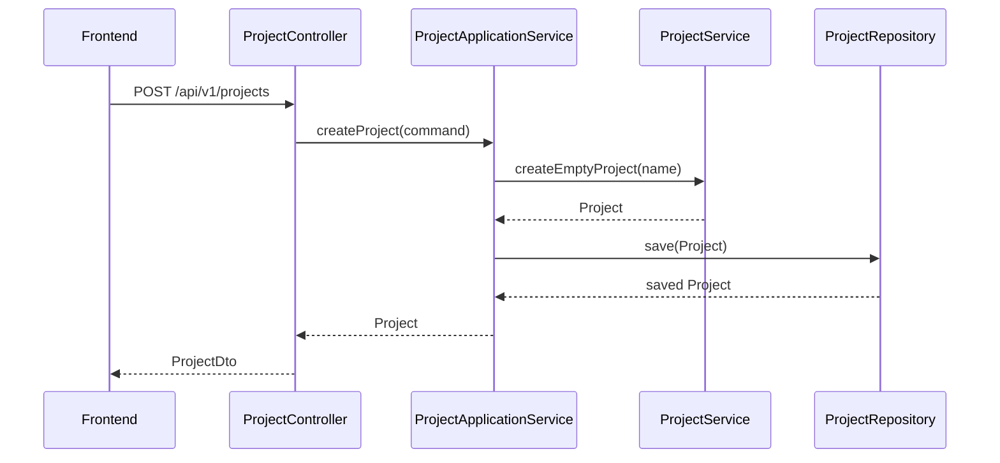
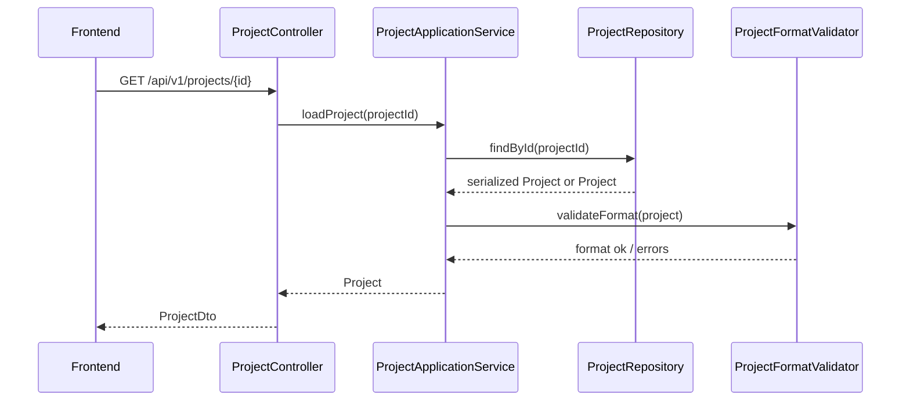
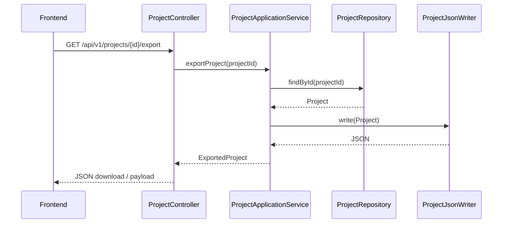
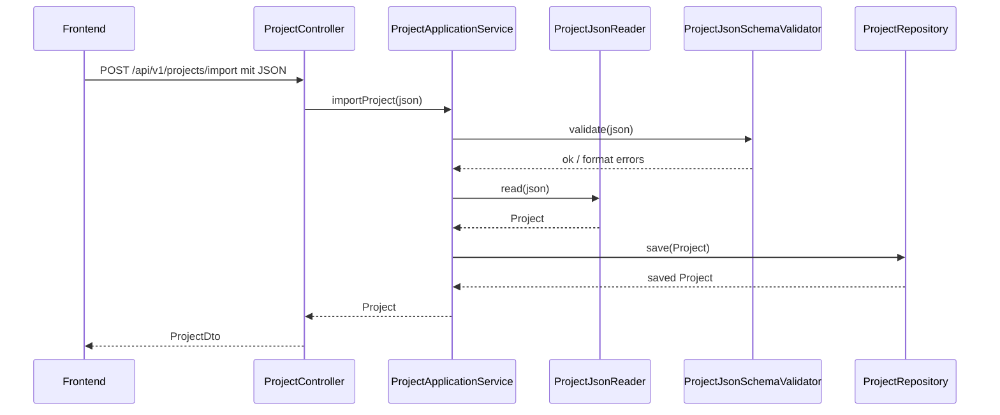

# Project and Persistence Service

## Zweck dieser Datei

Diese Datei beschreibt Projektverwaltung und Persistenzkonzept des neuen Backends.

Sie definiert, wie Projekte im MVP angelegt, geladen, gespeichert, aktualisiert, importiert und exportiert werden sollen. Außerdem beschreibt sie, wie das JSON-basierte Projektformat im MVP genutzt wird und wie die Persistenz später auf eine Datenbank erweitert werden kann.

Der Fokus liegt auf dem neuen Java/Spring-Boot-Backend. Es gibt keine technische Kopplung an den originalen USE-Core.

## Anforderungen an Projektverwaltung

Ein Projekt ist der speicherbare Arbeitszustand des Systems. Es bündelt mindestens:

- Projektmetadaten,
- UML-Modell,
- vollständigen USE-ähnlichen Modelltext für den OCL Editor,
- Objektmodell beziehungsweise aktuellen Snapshot,
- OCL-Invarianten,
- Layoutinformationen für das Frontend,
- Format- und Versionsinformationen.

| Anforderung | Beschreibung | MVP-Relevanz |
|---|---|---|
| Projekt anlegen | Backend erzeugt ein neues Projekt mit leerem UML-Modell und leerem Snapshot. | Hoch |
| Projekt laden | Backend lädt ein vorhandenes Projekt aus Repository oder Importdaten. | Hoch |
| Projekt speichern | Backend persistiert den aktuellen Projektzustand. | Hoch |
| Projekt aktualisieren | Backend nimmt Änderungen an Modell, Snapshot oder Layout entgegen. | Hoch |
| Projekt exportieren | Backend gibt den Projektzustand als JSON-Datei oder JSON-Payload aus. | Hoch |
| Projekt importieren | Backend nimmt JSON entgegen, validiert Format und erzeugt daraus ein Projekt. | Hoch |
| Modelltext speichern | Backend kann den vollständigen Editor-Text als `modelText` im Projektzustand erhalten. | Hoch |
| Modelltext anwenden | Backend verarbeitet `Apply Changes` aus dem OCL Editor für das unterstützte MVP-Subset. | Hoch |
| Formatversion verwalten | JSON-Projektformat enthält eine Version. | Hoch |
| Layoutdaten speichern | Frontend-Positionen und UI-Metadaten können gespeichert werden. | Hoch |
| Datenbankfähigkeit vorbereiten | Repository-Abstraktion erlaubt spätere DB-Persistenz. | Should |
| Projektversionierung vorbereiten | Spätere Historie, Migrationen oder Revisionen möglich halten. | Later |

## Projektlebenszyklus

Der Projektlebenszyklus im MVP:

```text
Create Project
-> Edit UML Model
-> Apply Model Text
-> Edit Invariants
-> Edit Snapshot
-> Save Project
-> Load Project
-> Check Constraints
-> Export Project
-> Import Project
```

Sequenz für das Anlegen und Speichern:



Sequenz für das Laden:



## MVP-Persistenz

Für den MVP soll Persistenz einfach, testbar und austauschbar bleiben.

Empfohlene MVP-Optionen:

| Persistenzoption | Nutzen | Grenze |
|---|---|---|
| In-Memory Repository | Sehr einfach für Entwicklung und Tests. | Daten gehen bei Neustart verloren. |
| File-basiertes JSON Repository | Gut für Save/Load, Import/Export und Demo. | Keine Mehrbenutzerfähigkeit, keine komplexen Queries. |
| JSON Export ohne Serverpersistenz | Minimaler MVP möglich. | Backend hält Projekte nur temporär. |

Pragmatische Empfehlung:

1. Repository-Interface von Beginn an definieren.
2. In-Memory-Implementierung für Tests und frühe Entwicklung verwenden.
3. File-basiertes JSON Repository für MVP-Demo und lokale Persistenz ergänzen.
4. Datenbankpersistenz erst einführen, wenn reale Serverprojekte, Versionierung oder Benutzerverwaltung benötigt werden.

## JSON-basiertes Projektformat

Das JSON-Projektformat ist im MVP das zentrale Austausch- und Speicherformat.

Es enthält:

- `formatVersion`,
- Projektmetadaten,
- `umlModel`,
- `objectModel`,
- `layout`,
- optional spätere `validationState` oder `lastValidationSummary`.

Beispielstruktur:

```json
{
  "formatVersion": "0.1",
  "project": {
    "id": "project-library",
    "name": "Library Example",
    "description": "MVP example for UML/OCL validation"
  },
  "modelText": {
    "text": "model Library\n\nclass User\nattributes\n  books : Integer\nend\n",
    "language": "USE_MODEL_TEXT",
    "languageVersion": "mvp-subset"
  },
  "umlModel": {
    "id": "uml-library",
    "classes": [],
    "associations": [],
    "invariants": []
  },
  "objectModel": {
    "id": "snapshot-current",
    "name": "Current Snapshot",
    "objects": [],
    "links": []
  },
  "layout": {
    "classDiagram": {
      "nodes": [],
      "edges": []
    },
    "objectDiagram": {
      "nodes": [],
      "edges": []
    }
  }
}
```

Minimaler Library-Ausschnitt:

```json
{
  "formatVersion": "0.1",
  "project": {
    "id": "project-library",
    "name": "Library Example"
  },
  "umlModel": {
    "classes": [
      {
        "id": "class-user",
        "name": "User",
        "attributes": [
          {
            "id": "attr-user-name",
            "name": "name",
            "type": "String"
          }
        ],
        "operations": []
      }
    ],
    "associations": [],
    "invariants": [
      {
        "id": "inv-max-books",
        "name": "maxBooks",
        "contextClassId": "class-user",
        "expression": {
          "id": "expr-max-books",
          "text": "self.books->size() <= 5"
        },
        "enabled": true
      }
    ]
  },
  "objectModel": {
    "objects": [
      {
        "id": "obj-alice",
        "name": "alice",
        "classId": "class-user",
        "slots": [
          {
            "id": "slot-alice-name",
            "attributeId": "attr-user-name",
            "value": {
              "type": "String",
              "value": "Alice"
            }
          }
        ]
      }
    ],
    "links": []
  }
}
```

Wichtig:

- Der OCL Editor darf vollständigen USE-ähnlichen Modelltext speichern und laden.
- Das Backend wendet daraus im MVP nur ein begrenztes Subset an und schreibt daraus strukturierte `umlModel`-/Invarianten-Daten.
- Der OCL-Text wird gespeichert.
- AST, Typed AST und Evaluation Results müssen im MVP nicht persistiert werden.
- Validation Results können neu berechnet werden und müssen nicht dauerhaft Projektbestandteil sein.
- Formatversion ist Pflicht, damit spätere Migrationen möglich sind.

## Speicherung von Layoutdaten

Layoutdaten sind für die Weboberfläche wichtig, aber keine fachliche UML/OCL-Semantik.

Sie sollten getrennt von Modellinhalten gespeichert werden:

```json
{
  "layout": {
    "classDiagram": {
      "nodes": [
        {
          "elementId": "class-user",
          "x": 120,
          "y": 80,
          "width": 220,
          "height": 160
        }
      ],
      "edges": [
        {
          "elementId": "assoc-borrows",
          "labelPosition": {
            "x": 420,
            "y": 140
          }
        }
      ]
    },
    "objectDiagram": {
      "nodes": [
        {
          "elementId": "obj-alice",
          "x": 160,
          "y": 120
        }
      ],
      "edges": []
    }
  }
}
```

Prinzipien:

| Prinzip | Bedeutung |
|---|---|
| Layout referenziert Domain-IDs | Keine doppelten Modellinformationen im Layout. |
| Layout darf fehlen | Backend muss Projekte auch ohne Layout laden können. |
| Layoutfehler sind nicht automatisch Modellfehler | Ungültige Layoutreferenzen können bereinigt oder als Warning gemeldet werden. |
| Frontend entscheidet Darstellung | Backend speichert Layout, berechnet aber im MVP kein Diagramm-Rendering. |

## Spätere Datenbankpersistenz

Die Architektur soll Datenbankpersistenz vorbereiten, ohne sie im MVP zu erzwingen.

Mögliche Entwicklung:

| Stufe | Beschreibung | Nutzen |
|---|---|---|
| MVP 1 | In-Memory + JSON Import/Export. | Schnell testbar. |
| MVP 2 | File-basiertes JSON Repository. | Projekte über Neustarts erhalten. |
| Post-MVP | Datenbank mit Projektaggregaten. | Serverbetrieb, Benutzerprojekte, Versionierung. |
| Later | Projektversionierung und Migrationen. | Nachvollziehbare Historie und Teamnutzung. |

Datenbankoptionen bleiben offen. Für das Domänenmodell ist wichtiger, dass `ProjectRepository` als Port existiert und die konkrete Speicherung austauschbar bleibt.

## Project Service

Der `ProjectService` ist fachlich für Projektoperationen verantwortlich.

Aufgaben:

| Aufgabe | Beschreibung |
|---|---|
| Neues Projekt erzeugen | Initiales `Project` mit leerem `UmlModel`, leerem `ObjectModel` und optional leerem Layout anlegen. |
| Projektmetadaten ändern | Name, Beschreibung und Änderungszeitpunkt verwalten. |
| Modellbestandteile bündeln | UML-Modell, Snapshot und Layout als einen konsistenten Projektzustand behandeln. |
| Projekt für Validierung bereitstellen | `Project` an Validation Service übergeben. |
| Formatversion beachten | Neue Projekte mit aktueller `formatVersion` versehen. |

Der `ProjectService` sollte keine HTTP-DTOs kennen. Er arbeitet mit Domain-Objekten und Commands aus der Application-Schicht.

Mögliche Service-Methoden:

```java
Project createEmptyProject(CreateProjectCommand command);
Project loadProject(ProjectId projectId);
Project saveProject(Project project);
Project updateProject(ProjectId projectId, UpdateProjectCommand command);
ExportedProject exportProject(ProjectId projectId);
Project importProject(ProjectImportData importData);
```

## Persistence Service

Der `PersistenceService` koordiniert technische Speicherung und Formatbehandlung.

Aufgaben:

| Aufgabe | Beschreibung |
|---|---|
| Laden | Projekt aus Repository lesen und in Domain Model überführen. |
| Speichern | Domain Project serialisieren und im Repository speichern. |
| Import | JSON entgegennehmen, Format prüfen, Domain Project erzeugen. |
| Modelltext erhalten | `modelText` als Editor-Draft speichern, ohne daraus automatisch fachliche Wahrheit abzuleiten. |
| Modelltext anwenden | Bei explizitem `Apply Changes` den unterstützten Text-Subset parsen und Domain-Modell aktualisieren. |
| Export | Domain Project in JSON-Projektformat schreiben. |
| Migration vorbereiten | Formatversionen erkennen und später Migrationen ausführen. |
| Technische Fehler kapseln | IO-, Format- und Repository-Fehler in klare Backend-Fehler übersetzen. |

Der Persistence Service sollte fachliche Constraint Validation nicht ausführen. Er darf aber Format- und Strukturvalidierung beim Laden oder Import durchführen.

## Repository-Abstraktion

Das Repository ist eine Schnittstelle zwischen Application/Persistence-Schicht und konkreter Speicherung.

Vorgeschlagene Abstraktion:

```java
public interface ProjectRepository {
    Project save(Project project);
    Optional<Project> findById(ProjectId id);
    boolean existsById(ProjectId id);
    void deleteById(ProjectId id);
    List<ProjectSummary> findAll();
}
```

Mögliche Implementierungen:

| Implementierung | Zweck |
|---|---|
| `InMemoryProjectRepository` | Tests, frühe Entwicklung, temporäre Sessions. |
| `FileProjectRepository` | MVP-Speicherung als JSON-Dateien. |
| `DatabaseProjectRepository` | Post-MVP-Datenbankpersistenz. |

Package-Vorschlag:

```text
persistence/
├─ project/
│  ├─ ProjectRepository.java
│  ├─ InMemoryProjectRepository.java
│  └─ FileProjectRepository.java
├─ json/
│  ├─ ProjectJsonReader.java
│  ├─ ProjectJsonWriter.java
│  ├─ ProjectJsonSchemaValidator.java
│  ├─ ProjectJsonMigrator.java
│  └─ ProjectJsonVersion.java
└─ repository/
   └─ RepositoryException.java
```

Ein separater Modelltext-Apply-Service kann in der Application-Schicht liegen und den Persistence Service nur zum Speichern des Ergebnisses nutzen:

```text
application/
├─ ModelTextApplicationService.java
└─ ModelTextApplyResult.java

modeltext/
├─ ModelTextParser.java
├─ ModelTextDiagnostic.java
└─ ModelTextToDomainMapper.java
```

Der `ModelTextParser` ist vom OCL-Expression-Parser zu trennen. Er erkennt die äußere Modellstruktur (`model`, `class`, `association`, `constraints`) und delegiert Invariantenausdrücke an die OCL-Pipeline.

## Import/Export

Import und Export sind im MVP wichtig, weil sie Projektzustände testbar und teilbar machen.

### Export



### Import



Importvalidierung sollte zwei Ebenen unterscheiden:

| Ebene | Prüft | Ergebnis |
|---|---|---|
| Formatvalidierung | JSON ist lesbar, Pflichtfelder vorhanden, Formatversion bekannt. | Import akzeptieren oder ablehnen. |
| Fachvalidierung | Klassen, Associations, Snapshot und OCL sind konsistent. | Validation Result oder Warnings nach Import. |

Ein importiertes Projekt kann fachlich ungültig sein und trotzdem geladen werden, damit Nutzer Fehler sehen und korrigieren können. Schwere Formatfehler verhindern dagegen den Import.

## Fehlerfälle

| Fehlerfall | Beispiel | Behandlung |
|---|---|---|
| Projekt nicht gefunden | `GET /api/v1/projects/unknown` | `404 NOT_FOUND` mit `PROJECT_NOT_FOUND`. |
| Ungültiges JSON | defekter JSON-Body | `400 BAD_REQUEST` mit Parserdetails. |
| Unbekannte Formatversion | `formatVersion: "99.0"` | `400 BAD_REQUEST` oder Migrationsfehler. |
| Fehlende Pflichtfelder | kein `umlModel` | Import ablehnen mit strukturiertem Fehler. |
| Nicht unterstützte Modelltext-Syntax | `import`, `associationclass`, komplexe Vererbung im MVP | Projekttext erhalten, Apply mit Diagnostics ablehnen oder teilweise mit Warnings anwenden. |
| Doppelte IDs | zwei Klassen mit gleicher ID | Format- oder Domain-Fehler melden. |
| Defekte Referenzen | ObjectInstance referenziert unbekannte Klasse | Projekt ggf. laden, aber Validation Error erzeugen. |
| Layout referenziert gelöschtes Element | NodeLayout für unbekannte Klasse | Layout-Warning oder Bereinigung. |
| Speichern fehlgeschlagen | IO-Fehler | `500` oder Repository-Fehler mit klarer Meldung. |
| Nebenläufige Änderung | zwei Clients speichern gleichzeitig | Post-MVP über Versionierung lösen. |

Wichtig: Constraint-Verletzungen sind keine technischen Persistenzfehler. Sie gehören in `ValidationResult`, nicht in `ApiErrorResponse`.

## API-Bezug

Mögliche Endpunkte:

| Methode | Pfad | Zweck | MVP |
|---|---|---|---|
| `POST` | `/projects` | Projekt anlegen. | Ja |
| `GET` | `/projects/{id}` | Projekt laden. | Ja |
| `PUT` | `/projects/{id}` | Vollständigen Projektzustand speichern/ersetzen. | Ja |
| `PATCH` | `/projects/{id}` | Projektmetadaten oder Teilzustand ändern. | Optional |
| `GET` | `/projects/{id}/export` | Projekt als JSON exportieren. | Ja |
| `POST` | `/projects/import` | Projekt aus JSON importieren. | Ja |
| `GET` | `/projects/{id}/model-text` | Vollständigen Modelltext für den Editor laden. | Ja |
| `POST` | `/projects/{id}/model-text/apply` | Vollständigen Editor-Text auf das unterstützte MVP-Subset anwenden. | Ja |
| `GET` | `/projects` | Projektliste abrufen. | Optional |
| `DELETE` | `/projects/{id}` | Projekt löschen. | Optional |

Beispiel `ProjectDto`:

```json
{
  "id": "project-library",
  "name": "Library Example",
  "description": "MVP example",
  "formatVersion": "0.1",
  "umlModel": {},
  "objectModel": {},
  "layout": {},
  "updatedAt": "2026-07-11T19:30:00Z"
}
```

API-Grundregel:

- API-DTOs sind nicht das Domain Model.
- DTO Mapper übersetzen IDs als Strings in Domain-ID-Value-Objects.
- Fehlermeldungen sind strukturiert und maschinenlesbar.

## Teststrategie

Tests sollten Projektverwaltung und Persistenz auf mehreren Ebenen absichern.

| Testtyp | Ziel | Beispiel |
|---|---|---|
| Unit-Test Project Service | Projektanlage und Metadatenlogik prüfen. | Neues Projekt enthält leeres UML- und ObjectModel. |
| Unit-Test JSON Writer | Domain Project korrekt serialisieren. | Export enthält `formatVersion`, Klassen, Snapshot und Layout. |
| Unit-Test JSON Reader | JSON korrekt in Domain Project lesen. | Library-Beispiel wird vollständig geladen. |
| Formatvalidierungstest | Fehlerhafte JSON-Strukturen erkennen. | Fehlendes `umlModel` erzeugt Formatfehler. |
| Modelltext-Apply-Test | USE-ähnlichen Text in Domain-Modell übernehmen. | Library-Text erzeugt Klassen `User`, `Book`, Association `Borrows` und Invariante `maxBooks`. |
| Modelltext-Diagnose-Test | Nicht unterstützte Syntax melden. | `import Date from "Dates.use"` erzeugt `UNSUPPORTED_SYNTAX`. |
| Roundtrip-Test | Laden und Speichern ohne Informationsverlust. | `read(write(project))` ergibt äquivalenten Projektzustand. |
| Repository-Test | In-Memory und File Repository verhalten sich gleich. | `save` und `findById` liefern konsistente Ergebnisse. |
| API-Test | REST-Endpunkte liefern erwartete Statuscodes und DTOs. | `POST /api/v1/projects`, `GET /api/v1/projects/{id}`, `POST /api/v1/projects/import`. |
| Import-Fehlertest | Ungültige JSON- und Referenzfehler sauber melden. | Unbekannte Formatversion oder doppelte IDs. |
| Layout-Test | Layoutdaten werden gespeichert, fehlen dürfen sie aber. | Projekt ohne Layout ist ladbar. |

Testressourcen:

```text
src/test/resources/
├─ projects/
│  ├─ minimal-project.json
│  ├─ library-valid.project.json
│  ├─ library-invalid-reference.project.json
│  └─ unknown-format-version.project.json
└─ snapshots/
   └─ library-current-snapshot.json
```

## Offene Fragen

| Frage | Bedeutung |
|---|---|
| Soll der MVP serverseitig Projekte dauerhaft speichern oder reicht JSON Import/Export? | Beeinflusst File Repository und Deployment. |
| Wird `PUT /api/v1/projects/{id}` den vollständigen Zustand ersetzen oder nur speichern? | Beeinflusst API-Vertrag und Konfliktbehandlung. |
| Soll ein importiertes Projekt mit fachlichen Fehlern geladen werden dürfen? | Empfehlung: ja, solange das Format lesbar ist. |
| Wie werden Formatmigrationen versioniert? | Beeinflusst `ProjectJsonMigrator`. |
| Werden Layoutdaten vom Backend normalisiert oder unverändert gespeichert? | Beeinflusst Frontend-Verantwortung. |
| Braucht der MVP Optimistic Locking mit `revision` oder `updatedAt`? | Relevant bei mehreren Clients oder Tabs. |
| Werden letzte Validation Results gespeichert oder immer neu berechnet? | Empfehlung: im MVP neu berechnen. |
| Wird `modelText` bei jeder strukturierten Modelländerung automatisch neu generiert? | Empfehlung: zunächst gespeicherten Text erhalten und nach `Apply Changes` synchronisieren; automatische Formatierung später. |

## Zusammenfassung

Projektverwaltung und Persistenz sollen im MVP einfach bleiben, aber sauber abstrahiert sein. Ein `Project` bündelt Modelltext, UML-Modell, Snapshot, OCL-Invarianten und optionale Layoutdaten. Das JSON-basierte Projektformat dient als Speicher-, Import- und Exportformat.

Die wichtigste technische Entscheidung ist die Repository-Abstraktion. Sie erlaubt eine schnelle MVP-Implementierung mit In-Memory- oder File-Persistenz und hält den Weg für spätere Datenbankpersistenz, Projektversionierung und Migrationen offen.
