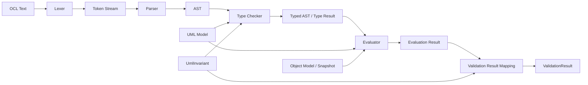
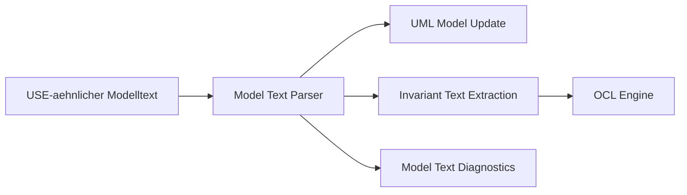
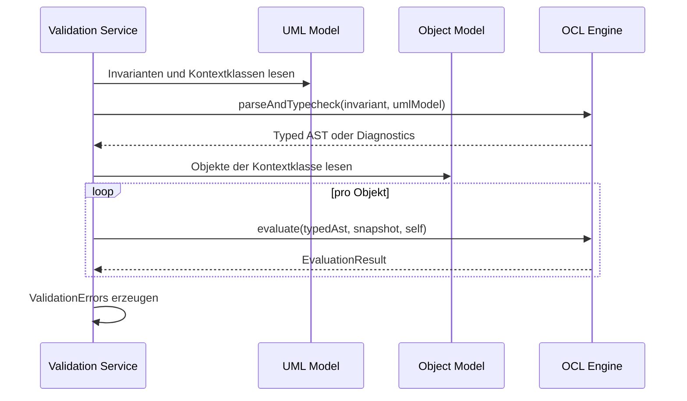

# OCL Engine Design

## Zweck dieser Datei

Diese Datei beschreibt das Gesamtdesign der neuen OCL Engine im Backend.

Sie ist eine zentrale Architekturdatei, weil die OCL Engine den fachlichen Kern des Systems absichert: OCL-Invarianten werden nicht als einfache Textmuster behandelt, sondern über eine erweiterbare Verarbeitungspipeline analysiert, typgeprüft und gegen Snapshots ausgewertet.

Das originale USE-Projekt dient als fachliche Referenz für OCL-Konzepte, Syntax, Typechecking, Evaluation und Constraint-Prüfung. Es wird keine Implementierung aus USE übernommen.

Abgrenzung zum OCL Editor: Der neue Editor zeigt vollständigen USE-ähnlichen Modelltext. Die OCL Engine verarbeitet darin nur die OCL-Ausdrücke, etwa Invarianten nach `context ... inv ...`. Das Parsen der äußeren Modelltextstruktur (`model`, `class`, `attributes`, `association`, `constraints`) gehört zu einer separaten Modelltext-/Import-Komponente.

## Ziele der OCL Engine

| Ziel | Beschreibung |
|---|---|
| Echte Sprachverarbeitung | OCL wird über Lexer, Parser, AST, Typechecker und Evaluator verarbeitet. |
| MVP-Subset unterstützen | Der MVP unterstützt ein bewusst kleines, aber echtes OCL-Subset. |
| Erweiterbarkeit vorbereiten | Spätere Konstrukte wie `forAll`, `exists`, `let` und `if-then-else` sollen ergänzbar sein. |
| UML-Modell integrieren | Typechecking nutzt Klassen, Attribute, Rollen, Multiplizitäten und Invariantenkontext. |
| Snapshot integrieren | Evaluation nutzt Objekte, Slots und Objektlinks. |
| Validierungsergebnisse liefern | Fehler und Invariantverletzungen werden strukturiert in `ValidationResult` überführt. |
| Frontend-Mapping ermöglichen | Diagnostics enthalten Codes, Messages, Source Ranges und betroffene IDs. |
| Testbarkeit sicherstellen | Jede Pipeline-Phase ist isoliert testbar. |
| Integration mit Modelltext | Invariantenausdrücke aus vollständigem Modelltext werden extrahiert und dann durch dieselbe OCL-Pipeline verarbeitet. |

## Warum keine Regex-Auswertung

OCL ist bereits im MVP kein reines Textmuster. Ein Ausdruck wie:

```ocl
self.borrowedBooks->size() <= 5
```

kann nur korrekt geprüft werden, wenn das Backend weiß:

- welche Kontextklasse `self` hat,
- ob `borrowedBooks` ein Attribut oder eine Association-Rolle ist,
- ob die Navigation eine Collection liefert,
- ob `size()` auf diesem Wert zulässig ist,
- ob `<=` mit den Ergebnistypen erlaubt ist,
- welche Objektlinks im Snapshot existieren,
- welches Objekt bei einer Verletzung betroffen ist.

| Problem bei Regex/String-Auswertung | Konsequenz |
|---|---|
| Keine Syntaxstruktur | Klammern und Operatorpräzedenz werden fehleranfällig. |
| Kein AST | Spätere Erweiterungen werden zu Sonderfällen. |
| Kein Typechecking | Unbekannte Attribute, Rollen oder falsche Operatoren werden nicht sauber erkannt. |
| Keine Source Ranges | UI kann Fehlerstellen nicht präzise markieren. |
| Keine Snapshot-Semantik | Navigation und Collection-Auswertung bleiben unzuverlässig. |
| Schlechte Testbarkeit | Einzelne Phasen lassen sich nicht isoliert prüfen. |

Die OCL Engine muss daher als kleine, echte Spracheengine konzipiert werden.

## Gesamtpipeline

Die Pipeline verarbeitet OCL-Text bis zum Ergebnis einer Invariantenauswertung:



Für den vollständigen Editor-Text liegt davor eine separate Modelltext-Pipeline:



Diese Trennung verhindert, dass der OCL-Parser zu einem vollständigen `.use`-Compiler ausgebaut wird. Vollständige USE-Kompatibilität bleibt Post-MVP.

Pipeline-Phasen:

| Phase | Eingabe | Ausgabe | Hauptverantwortung |
|---|---|---|---|
| Lexer | OCL-Text | Token Stream | Text in Tokens mit Positionen zerlegen. |
| Parser | Token Stream | AST oder Syntaxdiagnosen | Grammatik und Ausdrucksstruktur erkennen. |
| AST | Parser-Ergebnis | Knotenbaum | Ausdruck unabhängig vom Text repräsentieren. |
| Type Checker | AST + UML Model + Kontextklasse | Typed AST oder Typdiagnosen | Namen, Rollen, Operatoren und Ergebnistyp prüfen. |
| Evaluator | Typed AST + Snapshot + `self` | OCL-Wert oder Evaluationsfehler | Ausdruck gegen Objektzustand auswerten. |
| Validation Mapping | Evaluation Results + Invariante | `ValidationError`/`ValidationResult` | Ergebnisse UI- und API-fähig machen. |

## Komponentenübersicht

Vorgeschlagene Packages:

```text
ocl/
├─ lexer/
├─ parser/
├─ ast/
├─ typecheck/
├─ evaluation/
├─ diagnostics/
└─ value/
```

| Komponente | Aufgabe | MVP |
|---|---|---|
| `OclLexer` | Tokenisierung inklusive Source Position. | Pflicht |
| `OclParser` | Aufbau eines AST aus Tokens. | Pflicht |
| `OclAstNode` | Basismodell für Ausdrucksknoten. | Pflicht |
| `OclTypeChecker` | Semantische Prüfung gegen UML-Modell. | Pflicht |
| `TypeEnvironment` | Kontextklasse, `self`, bekannte Typen, Rollen und Attribute. | Pflicht |
| `OclEvaluator` | Evaluation gegen Snapshot. | Pflicht |
| `EvaluationContext` | Bindings wie `self`, Zugriff auf Objekte, Slots und Links. | Pflicht |
| `OclDiagnostic` | Strukturierte Syntax-, Typ- und Evaluationsdiagnosen. | Pflicht |
| `OclValue` | Typisierte Ergebniswerte. | Pflicht |
| `ValidationResultMapper` | Übersetzt OCL-Ergebnisse in Validation Errors. | Pflicht |
| `ModelTextParser` | Extrahiert UML-Struktur und Invariantentexte aus vollständigem Editor-Text. | Separat, MVP-Subset |

## MVP-OCL-Subset

Das MVP-Subset soll klein bleiben, aber vollständig durch die Pipeline laufen.

| Sprachbestandteil | Beispiele | MVP-Verhalten |
|---|---|---|
| `self` | `self` | Kontextobjekt der Invariante. |
| Attributzugriff | `self.name`, `self.available` | Zugriff auf Slots des aktuellen Objekts. |
| einfache Navigation | `self.borrowedBooks` | Navigation über Association-Rollen. |
| String-Literale | `''`, `'Moby Dick'` | String-Werte. |
| Integer-Literale | `5` | Ganzzahlen. |
| Real-Literale | `3.14` | Dezimalzahlen. |
| Boolean-Literale | `true`, `false` | Boolesche Werte. |
| Vergleichsoperatoren | `=`, `<>`, `<`, `<=`, `>`, `>=` | Typgeprüfte Vergleiche. |
| Boolean-Operatoren | `and`, `or`, `not` | Boolesche Verknüpfung. |
| Klammern | `(self.books <= 5)` | Gruppierung und Präzedenz. |
| Collection `size` | `self.borrowedBooks->size()` | Anzahl navigierter Objekte. |
| Collection `isEmpty` | `self.borrowedBooks->isEmpty()` | true bei leerer Collection. |
| Collection `notEmpty` | `self.borrowedBooks->notEmpty()` | true bei nicht leerer Collection. |

MVP-Beispiele:

```ocl
self.books <= 5
```

```ocl
self.name <> ''
```

```ocl
self.available = false
```

```ocl
self.borrowedBooks->size() <= 5
```

```ocl
self.borrowedBooks->notEmpty()
```

Hinweis: `self.books <= 5` ist nur gültig, wenn `books` als Integer-Attribut typisiert ist. Wenn `books` eine Association-Rolle mit Collection-Ergebnis ist, muss im MVP voraussichtlich `self.books->size() <= 5` verwendet werden.

## Post-MVP-OCL-Erweiterungen

Post-MVP soll der Sprachumfang schrittweise wachsen.

| Erweiterung | Beispiel | Benötigte Architekturergänzung |
|---|---|---|
| `forAll` | `self.borrowedBooks->forAll(b | b.available = false)` | Iterator AST, Iterator-Kontext, Collection Evaluation. |
| `exists` | `Book.allInstances()->exists(b | b.title = 'Moby Dick')` | AllInstances, Iterator Evaluation. |
| `select` | `self.books->select(b | b.available)` | Collection-Filter. |
| `collect` | `self.books->collect(b | b.title)` | Collection-Projektion. |
| `includes/excludes` | `self.books->includes(book)` | Membership-Operationen. |
| `if-then-else` | `if self.books > 5 then false else true endif` | IfExpression und Typvereinigung. |
| `let` | `let max : Integer = 5 in self.books <= max` | lokale Bindings im Type- und Eval-Kontext. |
| `allInstances` | `Book.allInstances()` | Zugriff auf Snapshot-Objekte pro Klasse. |
| pre/post conditions | `context User::borrow(b: Book) pre ...` | Operation-Kontext, `@pre`, `result`. |
| derived attributes | `derive: ...` | OCL-Auswertung außerhalb Invarianten. |
| init values | `init: ...` | Objektanlage und Default-Werte. |

Diese Erweiterungen dürfen nicht zu einem Umbau der Engine führen. Sie sollen neue Token, AST-Knoten, Typechecker-Regeln und Evaluator-Regeln ergänzen.

## Integration mit UML Model

Der Typechecker integriert das UML-Modell.

Benötigte Informationen:

| UML-Information | Verwendung in der OCL Engine |
|---|---|
| Kontextklasse | Typ von `self`. |
| Attribute | Auflösung von `self.attribute`. |
| Attributtypen | Typprüfung von Zugriffen und Vergleichen. |
| Associations | Grundlage für Navigation. |
| Association Ends | Rollenname, Zielklasse und Multiplizität. |
| Rollen | Auflösung von `self.roleName`. |
| Multiplizitäten | Entscheidung zwischen Einzelwert und Collection. |
| Operationensignaturen | Post-MVP für Operation Calls und pre/post conditions. |
| Enumerationen | Post-MVP für Enum-Literale und Typprüfung. |

Beispiel Typechecking:

```ocl
self.borrowedBooks->size() <= 5
```

| Schritt | Prüfung |
|---|---|
| `self` | Kontextklasse ist `User`. |
| `borrowedBooks` | Rolle ist von `User` aus erreichbar. |
| Navigationstyp | Ergebnis ist Collection von `Book`. |
| `size()` | Operation ist auf Collection erlaubt und liefert `Integer`. |
| `5` | Literal ist `Integer`. |
| `<=` | Vergleich zwischen `Integer` und `Integer` ist erlaubt. |
| Gesamtausdruck | Ergebnis ist `Boolean`, damit als Invariante gültig. |

## Integration mit Object Model

Der Evaluator integriert den konkreten Snapshot.

Benötigte Informationen:

| Snapshot-Information | Verwendung |
|---|---|
| Objekte | Invarianten werden pro Objekt der Kontextklasse geprüft. |
| Objektklasse | Filtert passende Objekte für Kontextklasse. |
| Slots | Attributzugriffe lesen konkrete Werte. |
| Objektlinks | Navigation über Associations. |
| Link-Association | Ermittelt relevante Links für eine Rolle. |
| Link-Enden | Bestimmt navigierte Zielobjekte. |

Evaluation läuft nicht abstrakt nur gegen das UML-Modell, sondern gegen einen konkreten Zustand.

Beispiel:

```ocl
self.name <> ''
```

Für `self = alice : User`:

1. Evaluator liest Slot `name`.
2. Slot liefert `StringValue("Alice")`.
3. Literal `''` liefert `StringValue("")`.
4. `<>` ergibt `BooleanValue(true)`.

## Integration mit Validation Service

Der Validation Service orchestriert die OCL Engine im Constraint Check.



Regeln:

- Syntaxfehler verhindern Evaluation der betroffenen Invariante.
- Typecheck-Fehler verhindern Evaluation der betroffenen Invariante.
- Evaluation-Fehler werden als `EVALUATION_ERROR` gemeldet.
- Boolean `false` erzeugt `INVARIANT_VIOLATION`.
- Boolean `true` erzeugt keinen Fehler.
- Nicht-Boolean-Gesamtausdruck ist ein Typecheck-Fehler.

## Fehlerbehandlung

Die Engine muss Fehler strukturiert ausgeben.

| Fehlerphase | Fehlerart | Beispielcode | Beispiel |
|---|---|---|---|
| Lexer | unbekanntes Zeichen | `SYNTAX_ERROR` | ungültiges Token |
| Parser | unerwartetes Token | `SYNTAX_ERROR` | `self.books <=` |
| Typechecker | unbekannte Klasse | `UNKNOWN_CLASS` | Kontextklasse existiert nicht |
| Typechecker | unbekanntes Attribut/Rolle | `UNKNOWN_ATTRIBUTE` | `self.bookz` |
| Typechecker | falscher Operator | `TYPE_ERROR` | `self.name <= 5` |
| Typechecker | falsches Gesamtergebnis | `TYPE_ERROR` | Invariante liefert `String` |
| Evaluator | ungültiger Slot | `INVALID_SLOT_VALUE` oder `EVALUATION_ERROR` | Slotwert passt nicht |
| Evaluator | defekter Link | `INVALID_LINK` oder `EVALUATION_ERROR` | Navigation nicht auswertbar |
| Evaluation Mapping | Invariante false | `INVARIANT_VIOLATION` | `maxBooks` verletzt |

Beispiel-Diagnostic:

```json
{
  "code": "TYPE_ERROR",
  "severity": "ERROR",
  "message": "Unknown property 'bookz' for context class 'User'.",
  "invariantId": "inv-max-books",
  "sourceRange": {
    "startLine": 1,
    "startColumn": 6,
    "endLine": 1,
    "endColumn": 11
  },
  "modelElementIds": ["class-user"]
}
```

Beispiel-Invariantverletzung:

```json
{
  "code": "INVARIANT_VIOLATION",
  "severity": "ERROR",
  "message": "Object 'alice' violates invariant 'maxBooks'.",
  "invariantId": "inv-max-books",
  "objectIds": ["obj-alice"],
  "modelElementIds": ["class-user"],
  "details": {
    "expression": "self.borrowedBooks->size() <= 5"
  }
}
```

## Erweiterungsstrategie

Die OCL Engine soll durch neue Bausteine erweitert werden, nicht durch Änderungen an einer monolithischen Auswertung.

| Erweiterungsschritt | Änderung |
|---|---|
| Neues Keyword | Lexer Token ergänzen. |
| Neue Syntax | Parser-Regel ergänzen. |
| Neues Sprachkonstrukt | AST-Knoten ergänzen. |
| Neuer Typfall | Typechecker-Regel ergänzen. |
| Neue Laufzeitsemantik | Evaluator-Regel ergänzen. |
| Neue Fehlermeldung | Diagnostic-Code und Mapping ergänzen. |
| Neues UI-Feedback | Source Range und API-DTO erweitern. |

Beispiel `forAll`:

| Phase | Ergänzung |
|---|---|
| Lexer | Token für `forAll` und `|`. |
| Parser | Iterator-Ausdruck parsen. |
| AST | `IteratorExpression`. |
| Typechecker | Iteratorvariable in TypeEnvironment einführen. |
| Evaluator | Collection iterieren, Binding pro Element setzen. |
| Validation Mapping | Verletzungen ggf. mit betroffener Collection und Objekt-ID melden. |

## Beispielauswertung

Beispielinvariante:

```ocl
self.borrowedBooks->size() <= 5
```

Kontext:

```text
context User inv maxBooks
```

Vereinfachter Ablauf:

```mermaid
flowchart TD
    A[Text: self.borrowedBooks->size() <= 5] --> B[Lexer]
    B --> C[Tokens: self, ., borrowedBooks, ->, size, (, ), <=, 5]
    C --> D[Parser]
    D --> E[AST: LessOrEqual(CollectionSize(Navigation(Self, borrowedBooks)), IntLiteral(5))]
    E --> F[Type Checker]
    F --> G[Typed AST: Boolean]
    G --> H[Evaluator fuer alice]
    H --> I[Navigation borrowedBooks liefert 6 Books]
    I --> J[size = 6]
    J --> K[6 <= 5 ist false]
    K --> L[INVARIANT_VIOLATION fuer obj-alice]
```

Typechecker-Ausgabe konzeptionell:

```json
{
  "status": "OK",
  "resultType": "Boolean",
  "root": "ComparisonExpression",
  "diagnostics": []
}
```

Evaluation-Ausgabe konzeptionell:

```json
{
  "invariantId": "inv-max-books",
  "selfObjectId": "obj-alice",
  "value": {
    "type": "Boolean",
    "value": false
  }
}
```

## Bezug zum originalen USE-Projekt

Relevante Referenzbereiche im originalen USE-Projekt:

| Originalbereich | Relevanz für neue Engine | Nutzung |
|---|---|---|
| `use-core/src/main/resources/grammars/ocl/` | OCL-Syntaxreferenz. | Syntax analysieren, nicht kopieren. |
| `use-core/src/main/resources/grammars/base/` | Lexer-/Basisregeln. | Referenz für Tokens und Operatoren. |
| `org.tzi.use.parser.ocl.OCLCompiler` | Pipeline von Text zu Expression. | Verhaltenreferenz. |
| `org.tzi.use.parser.ParseErrorHandler` | Fehlerbehandlung bei Parsing. | Referenz für Diagnostics. |
| `org.tzi.use.parser.SemanticException` | Semantikfehler. | Referenz für Typecheck-Fehler. |
| `org.tzi.use.uml.ocl.expr` | Expression-Modell und Evaluator. | Verhaltenreferenz, keine Klassenübernahme. |
| `org.tzi.use.uml.ocl.type` | OCL-Typsystem. | Fachliche Referenz. |
| `org.tzi.use.uml.ocl.value` | OCL-Werte und Collections. | Fachliche Referenz. |
| `MClassInvariant` | Kontextklasse, `self`, Invariantenauswertung. | Fachliche Referenz. |
| `MSystemState` | Snapshot für Evaluation. | Verhaltenreferenz. |

Abgrenzung:

- Keine ANTLR-3-Grammatikübernahme.
- Keine Nutzung von `OCLCompiler` als Dependency.
- Kein Wrapper um USE-Evaluator.
- Kein Ziel vollständiger OCL-Parität im MVP.
- Kein Vermischen von OCL-Ausdrucksparser und vollständigem `.use`-Modelltextparser.

## Teststrategie

Tests müssen jede Pipeline-Phase isoliert und integriert prüfen.

| Testbereich | Ziel | Beispiele |
|---|---|---|
| Lexer Tests | Tokens korrekt erzeugen. | `self.name <> ''`, `self.books->size() <= 5`. |
| Parser Tests | AST korrekt erzeugen. | Klammern, Präzedenz, Collection Calls. |
| AST Tests | Knotenstruktur stabil halten. | `ComparisonExpression`, `PropertyAccessExpression`. |
| Typechecker Tests | UML-Namen und Typregeln prüfen. | unbekanntes Attribut, falscher Vergleich. |
| Evaluator Tests | Ausdruck gegen Snapshot auswerten. | Slotzugriff, Navigation, `size`, `notEmpty`. |
| Diagnostic Tests | Fehler enthalten Code und Source Range. | `self.books <=` erzeugt Syntaxfehler. |
| Validation Integration | Invarianten erzeugen Validation Errors. | `alice` verletzt `maxBooks`. |
| Regression aus USE-Beispielen | Verhalten aus einfachen USE-Beispielen ableiten. | reduzierte Library-/Demo-Modelle. |
| Modelltext-Integration | Vollständiger USE-ähnlicher Text wird in Invarianten und Domain-Modell überführt. | reduzierter Library-Text mit `model`, `class`, `association`, `constraints`. |

MVP-Testfälle:

```ocl
self.books <= 5
self.name <> ''
self.available = false
self.borrowedBooks->size() <= 5
self.borrowedBooks->notEmpty()
```

Negative Tests:

```ocl
self.unknown <= 5
self.name <= 5
self.borrowedBooks->unknown()
self.borrowedBooks->size() <= 'five'
self.books <=
```

Test-Fixtures:

```text
src/test/resources/ocl/
├─ lexer-valid-expressions.txt
├─ parser-valid-expressions.txt
├─ parser-syntax-errors.txt
├─ typecheck-errors.txt
├─ evaluation-library-valid.json
└─ evaluation-library-invalid.json
```

## Risiken

| Risiko | Auswirkung | Gegenmaßnahme |
|---|---|---|
| OCL-Subset wächst zu schnell | MVP wird unkontrollierbar. | MVP-Subset strikt halten. |
| Parser wird ad hoc gebaut | Erweiterungen werden teuer. | AST- und Typechecker-Phasen sauber trennen. |
| Typechecker zu spät geplant | Evaluation produziert schwer verständliche Fehler. | Typechecking als Pflichtphase. |
| Snapshot-Navigation unklar | OCL-Ergebnisse werden falsch. | Association Ends und Link-Auswertung früh testen. |
| Fehler ohne Source Range | Frontend kann OCL-Fehler schlecht anzeigen. | Tokens und AST mit Positionen versehen. |
| USE-Verhalten wird überschätzt | Scope wird zu groß. | USE als Referenz, nicht als Feature-Verpflichtung behandeln. |

## Offene Fragen

| Frage | Bedeutung |
|---|---|
| Wird der MVP-Parser handgeschrieben oder über einen Parsergenerator erzeugt? | Beeinflusst Build-System und Parserstruktur. |
| Welche genaue Syntax akzeptieren Collection-Operationen: `size` oder `size()`? | Muss für MVP verbindlich festgelegt werden. |
| Wird `self.books <= 5` für Collection-Rollen abgelehnt oder automatisch als Größe interpretiert? | Empfehlung: nicht automatisch interpretieren. |
| Wie wird Undefined/Unset im MVP behandelt? | Beeinflusst Evaluator und Fehlercodes. |
| Werden Typecheck-Ergebnisse gecacht? | Performance bei größeren Modellen, nicht MVP-kritisch. |
| Wie detailliert müssen Evaluation Traces im MVP sein? | Vermutlich Post-MVP. |
| Soll OCL-Syntax-/Typecheck separat per API angeboten werden? | Wichtig für OCL Editor Feedback. |
| Welche Modelltext-Konstrukte werden im MVP vor dem OCL-Parser akzeptiert? | Muss getrennt von OCL-Sprachumfang dokumentiert und getestet werden. |

## Zusammenfassung

Die neue OCL Engine muss als echte, erweiterbare Verarbeitungspipeline aufgebaut werden: OCL Text wird lexikalisch analysiert, geparst, als AST repräsentiert, gegen das UML-Modell typgeprüft und gegen den aktuellen Snapshot ausgewertet. Das Ergebnis wird in strukturierte Validation Results überführt.

Der MVP unterstützt nur ein kleines OCL-Subset, aber dieses Subset muss sauber durch alle Pipeline-Phasen laufen. Genau diese Architektur ermöglicht später Erweiterungen wie `forAll`, `exists`, `let`, `if-then-else`, `allInstances`, pre/post conditions, derived attributes und init values, ohne die Engine neu zu konzipieren.
