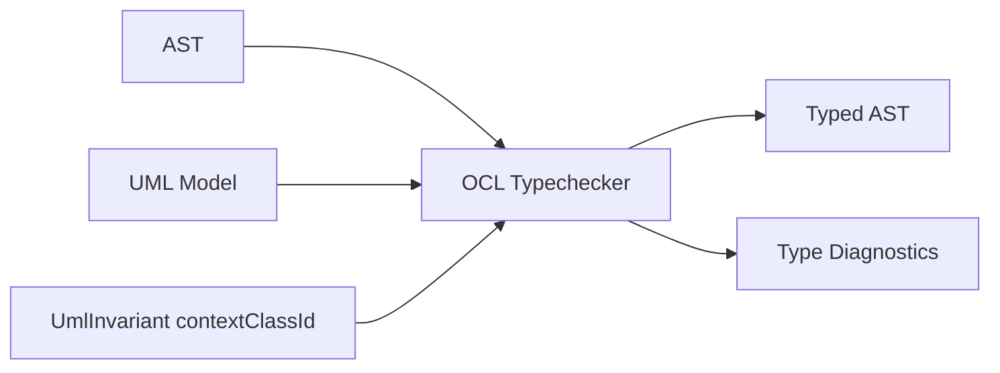
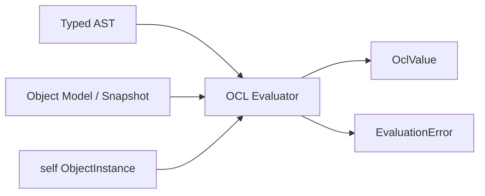
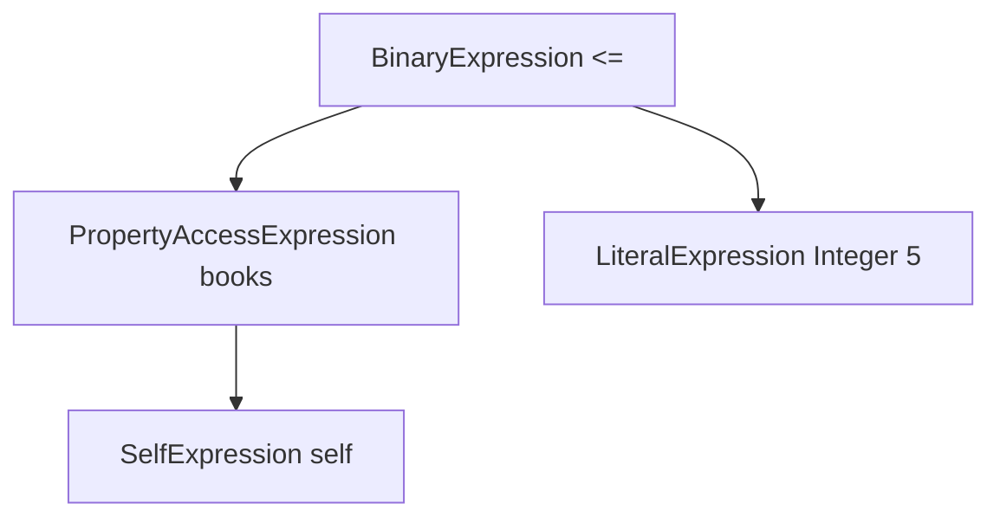

# OCL Parser and AST

## Zweck dieser Datei

Diese Datei beschreibt Konzept und Anforderungen für Lexer, Parser und AST der neuen OCL-Komponente im Backend.

Sie konkretisiert den vorderen Teil der OCL Engine:

```text
OCL Text
-> Lexer
-> Token Stream
-> Parser
-> AST
-> Type Checker
-> Evaluator
```

Das originale USE-Projekt dient als fachliche Referenz für OCL-Syntax und Ausdrucksformen. Die neue Implementierung übernimmt keine Grammatikdateien, Parserklassen oder AST-Klassen aus USE.

Abgrenzung: Diese Datei beschreibt nur den Parser für OCL-Ausdrücke. Der OCL Editor zeigt vollständigen USE-ähnlichen Modelltext; die äußere Struktur dieses Texts (`model`, `class`, `attributes`, `association`, `constraints`) wird von einer separaten `modeltext`-Komponente verarbeitet. Diese Komponente extrahiert Invariantenausdrücke und übergibt sie anschließend an den hier beschriebenen OCL-Parser.

## Rolle von Lexer und Parser

Lexer und Parser sind notwendig, weil OCL-Ausdrücke nicht robust als reine Strings verarbeitet werden können.

Aufgaben:

| Komponente | Aufgabe | Ergebnis |
|---|---|---|
| Lexer | OCL-Text in Tokens zerlegen. | Token Stream mit Source Positions. |
| Parser | Tokenfolge syntaktisch analysieren. | AST oder Parserfehler. |
| AST | Ausdrucksstruktur repräsentieren. | Grundlage für Typechecker und Evaluator. |

Der Parser prüft nur Syntax. Er entscheidet nicht, ob `books` ein gültiges Attribut oder eine gültige Rolle ist. Diese semantische Prüfung gehört zum Typechecker.

Beispiel:

```ocl
self.borrowedBooks->size() <= 5
```

Parser-Aufgabe:

- `self` erkennen,
- Navigation über `borrowedBooks` erkennen,
- Collection Operation `size()` erkennen,
- Vergleich `<= 5` erkennen,
- AST mit korrekter Operatorstruktur erzeugen.

Typechecker-Aufgabe danach:

- Prüfen, ob `borrowedBooks` im Kontext der Klasse existiert,
- prüfen, ob `size()` auf dem Navigationsergebnis erlaubt ist,
- prüfen, ob `<=` zwischen den Typen erlaubt ist.

## MVP-Token

Der MVP-Lexer benötigt folgende Token.

| Token-Kategorie | Beispiele | Bemerkung |
|---|---|---|
| Identifier | `books`, `borrowedBooks`, `name` | Namen von Attributen, Rollen, später Variablen. |
| Keyword `self` | `self` | Implizites Kontextobjekt. |
| String-Literal | `''`, `'Moby Dick'` | Einfache Strings im MVP. |
| Integer-Literal | `5`, `42` | Ganzzahlen. |
| Real-Literal | `3.14`, `0.5` | Dezimalzahlen. |
| Boolean-Literal | `true`, `false` | Boolesche Literale. |
| Vergleichsoperatoren | `=`, `<>`, `<`, `<=`, `>`, `>=` | Binary Expressions. |
| Boolean-Operatoren | `and`, `or`, `not` | Boolesche Ausdrücke. |
| Punkt | `.` | Property Access. |
| Pfeil | `->` | Collection Operation Call. |
| Klammern | `(`, `)` | Gruppierung und Operation Calls. |
| Collection-Operationsnamen | `size`, `isEmpty`, `notEmpty` | Lexikalisch Identifier oder eigene Keywords. |
| EOF | Ende des Inputs | Für saubere Parserfehler. |

Empfohlene Token-Daten:

```json
{
  "type": "IDENTIFIER",
  "text": "borrowedBooks",
  "startLine": 1,
  "startColumn": 6,
  "endLine": 1,
  "endColumn": 19
}
```

### Tokenisierungshinweise

| Thema | Empfehlung |
|---|---|
| Keywords vs Identifier | `self`, `true`, `false`, `and`, `or`, `not` als Keywords behandeln. |
| Collection Operations | Im Lexer als Identifier möglich; Parser/Typechecker entscheidet, ob `size` erlaubt ist. |
| String Quotes | MVP kann einfache Single-Quoted Strings unterstützen. |
| Whitespace | Ignorieren, aber Positionen korrekt weiterzählen. |
| Kommentare | Nicht MVP, später möglich. |
| Unicode-Identifier | Für MVP ASCII-Identifier bevorzugen. |

## MVP-Grammatik

Die MVP-Grammatik soll klein bleiben, aber Operatorpräzedenz korrekt behandeln.

EBNF-ähnlicher Vorschlag:

```text
expression
  ::= orExpression

orExpression
  ::= andExpression ("or" andExpression)*

andExpression
  ::= equalityExpression ("and" equalityExpression)*

equalityExpression
  ::= relationalExpression (("=" | "<>") relationalExpression)*

relationalExpression
  ::= unaryExpression (("<" | "<=" | ">" | ">=") unaryExpression)?

unaryExpression
  ::= "not" unaryExpression
   |  postfixExpression

postfixExpression
  ::= primaryExpression postfixPart*

postfixPart
  ::= "." IDENTIFIER
   |  "->" collectionOperation

collectionOperation
  ::= ("size" | "isEmpty" | "notEmpty") "(" ")"

primaryExpression
  ::= "self"
   |  literal
   |  "(" expression ")"

literal
  ::= STRING
   |  INTEGER
   |  REAL
   |  BOOLEAN
```

Unterstützte Beispiele:

```ocl
self.books <= 5
```

```ocl
self.name <> ''
```

```ocl
self.available = false
```

```ocl
self.borrowedBooks->size() <= 5
```

```ocl
not self.borrowedBooks->isEmpty()
```

Nicht im MVP:

```ocl
self.borrowedBooks->forAll(b | b.available = false)
```

```ocl
let max : Integer = 5 in self.books <= max
```

```ocl
if self.books > 5 then false else true endif
```

## AST-Grundprinzipien

Der AST ist die stabile interne Struktur zwischen Parser, Typechecker und Evaluator.

Prinzipien:

| Prinzip | Bedeutung |
|---|---|
| Source Range an jedem Knoten | Fehler können im OCL-Editor markiert werden. |
| Keine Semantik im Parser erzwingen | Ob ein Identifier Attribut oder Rolle ist, prüft der Typechecker. |
| Ausdrucksbaum statt Textauswertung | Evaluator arbeitet auf AST/Typed AST, nicht auf Strings. |
| Erweiterbare Node-Hierarchie | Post-MVP-Konstrukte ergänzen neue Node-Typen. |
| Trennung von AST und Typed AST | Parser erzeugt syntaktische Knoten; Typechecker ergänzt Typinformationen. |
| Keine Pflichtpersistenz | AST muss im MVP nicht im Projektformat gespeichert werden. |

Java-nahe Skizze:

```java
public sealed interface OclAstNode permits
        SelfExpression,
        AttributeAccessExpression,
        AssociationNavigationExpression,
        LiteralExpression,
        BinaryExpression,
        UnaryExpression,
        CollectionOperationExpression,
        ParenthesizedExpression {
    SourceRange sourceRange();
}
```

## MVP-AST-Knoten

| AST-Knoten | Zweck | Beispiel |
|---|---|---|
| `SelfExpression` | Repräsentiert `self`. | `self` |
| `AttributeAccessExpression` | Zugriff per Punkt auf einen Namen, der später als Attribut aufgelöst werden kann. | `self.name` |
| `AssociationNavigationExpression` | Zugriff per Punkt auf einen Namen, der später als Association-Rolle aufgelöst werden kann. | `self.borrowedBooks` |
| `LiteralExpression` | String, Integer, Real oder Boolean. | `5`, `''`, `false` |
| `BinaryExpression` | Vergleichs- oder Boolean-Binäroperator. | `a <= b`, `a and b` |
| `UnaryExpression` | Unärer Operator. | `not a` |
| `CollectionOperationExpression` | Operation auf Collection-Ausdruck. | `self.books->size()` |
| `ParenthesizedExpression` | Gruppierter Ausdruck. | `(self.books <= 5)` |

### AttributeAccess vs AssociationNavigation

Der Parser kann bei `self.books` syntaktisch noch nicht wissen, ob `books` ein Attribut oder eine Association-Rolle ist.

Zwei mögliche Designs:

| Design | Beschreibung | Bewertung |
|---|---|---|
| Generischer `PropertyAccessExpression` | Parser erzeugt nur `receiver + propertyName`; Typechecker entscheidet Attribut oder Rolle. | Empfohlen für MVP. |
| Getrennte AST-Knoten direkt im Parser | Parser erzeugt `AttributeAccessExpression` oder `AssociationNavigationExpression`. | Nur möglich, wenn Parser bereits UML-Modell kennt; nicht empfohlen. |

Empfehlung:

- Parser erzeugt intern einen generischen Property Access.
- Typechecker annotiert oder transformiert ihn zu Attribute Access oder Association Navigation.
- Die MVP-Knoten aus dem Prompt können logisch unterschieden werden, aber die Parserphase sollte semantikfrei bleiben.

## Post-MVP-AST-Erweiterungen

| AST-Knoten | OCL-Konstrukt | Beispiel |
|---|---|---|
| `IteratorExpression` | `forAll`, `exists`, `select`, `collect` | `self.books->forAll(b | b.available)` |
| `LetExpression` | lokale Bindung | `let max : Integer = 5 in self.books <= max` |
| `IfExpression` | bedingter Ausdruck | `if a then b else c endif` |
| `AllInstancesExpression` | alle Objekte einer Klasse | `Book.allInstances()` |
| `OperationCallExpression` | Operation Calls | `self.canBorrow(book)` |
| `PrePostConditionExpression` | pre/post-Kontexte | `salary@pre`, `result` |

Erweiterungsprinzip:

```text
Neues Syntaxkonstrukt
-> neue Tokens falls nötig
-> neue Parserregel
-> neuer AST-Knoten
-> neue Typechecker-Regel
-> neue Evaluator-Regel
-> neue Tests
```

## Parserfehler

Parserfehler müssen strukturiert zurückgegeben werden. Das Frontend darf keine Freitextmeldungen parsen.

Typische Parserfehler:

| Fehler | Beispiel | Erwartete Diagnose |
|---|---|---|
| Unerwartetes Ende | `self.books <=` | Erwarteter Ausdruck nach `<=`. |
| Fehlende schließende Klammer | `(self.books <= 5` | Erwartet `)`. |
| Unerwartetes Token | `self. <= 5` | Erwarteter Identifier nach `.`. |
| Ungültiger Collection Call | `self.books->` | Erwarteter Collection-Operationsname. |
| Fehlende Call-Klammern | `self.books->size` | Im MVP erwartetes `size()`. |
| Ungültiges Literal | `'abc` | Nicht geschlossenes String-Literal. |

Beispiel:

```json
{
  "code": "SYNTAX_ERROR",
  "severity": "ERROR",
  "message": "Expected expression after operator '<='.",
  "sourceRange": {
    "startLine": 1,
    "startColumn": 12,
    "endLine": 1,
    "endColumn": 14
  },
  "expected": ["SELF", "IDENTIFIER", "STRING", "INTEGER", "REAL", "BOOLEAN", "LPAREN"],
  "actual": "EOF"
}
```

Parser-Ergebnis:

```json
{
  "success": false,
  "ast": null,
  "diagnostics": [
    {
      "code": "SYNTAX_ERROR",
      "message": "Expected expression after operator '<='."
    }
  ]
}
```

## Integration mit Typechecker

Der Typechecker erhält AST, Kontextklasse und UML-Modell.



Der Typechecker:

- setzt `self` auf die Kontextklasse,
- löst Property Access auf Attribute oder Rollen auf,
- bestimmt Collection- oder Einzelwerttypen,
- prüft Operatoren,
- prüft Collection Operation Calls,
- stellt sicher, dass Invarianten `Boolean` ergeben.

Beispiel:

```ocl
self.books <= 5
```

Mögliche Typechecker-Ergebnisse:

| Modellfall | Ergebnis |
|---|---|
| `books : Integer` ist Attribut von `User`. | gültig, Ergebnis `Boolean`. |
| `books` ist Rolle zu `Book[*]`. | Typefehler, wenn kein `->size()` genutzt wird. |
| `books` existiert nicht. | `UNKNOWN_ATTRIBUTE`. |

## Integration mit Evaluator

Der Evaluator soll nur typgeprüfte Ausdrücke auswerten.



Evaluator-Anforderungen:

- `SelfExpression` liefert das aktuelle Objekt.
- Attribute Access liest Slot-Werte.
- Association Navigation liest Objektlinks.
- `size/isEmpty/notEmpty` arbeiten auf Collection-Werten.
- Binary Expressions arbeiten auf typisierten Werten.
- Evaluation Errors bleiben strukturiert.

Parser und AST dürfen keine Snapshotdaten enthalten. Snapshotbezug entsteht erst im Evaluator.

## Bezug zum originalen USE-Projekt

Relevante Referenzpunkte:

| Originalbereich | Relevanz | Nutzung |
|---|---|---|
| `use-core/src/main/resources/grammars/ocl/` | OCL-Grammatikreferenz. | Syntaxvarianten analysieren, nicht übernehmen. |
| `use-core/src/main/resources/grammars/base/OCLBase.gpart` | Basisregeln für OCL. | Referenz für Operatoren und Ausdrucksstruktur. |
| `use-core/src/main/resources/grammars/base/OCLLexerRules.gpart` | Lexer-Regeln. | Tokenreferenz. |
| `org.tzi.use.parser.ocl.OCLCompiler` | Pipeline Text -> AST -> Expression. | Verhaltenreferenz. |
| `org.tzi.use.parser.ocl.*` | AST-Klassen im Parserbereich. | Fachliche Orientierung, keine Codeübernahme. |
| `org.tzi.use.uml.ocl.expr.*` | OCL-Ausdrucksmodell. | Referenz für spätere AST-/Evaluator-Formen. |
| `ParseErrorHandler` | Parserfehlerbehandlung. | Referenz für strukturierte Diagnosen. |

Abgrenzung:

- Das neue Backend nutzt nicht die ANTLR-3-Grammatik des Originals als technische Basis.
- Das neue System muss im MVP nicht `.use`- oder vollständige OCL-Syntax akzeptieren.
- Die OCL-Parser-Komponente ist kein vollständiger `.use`-Modellparser.
- USE-Beispiele dienen als Testfall- und Syntaxreferenz, nicht als Feature-Verpflichtung.

## Beispiel: AST für self.books <= 5

Ausdruck:

```ocl
self.books <= 5
```

Tokenfolge:

```text
SELF("self")
DOT(".")
IDENTIFIER("books")
LESS_EQUAL("<=")
INTEGER("5")
EOF
```

Syntaktischer AST:



JSON-nahe AST-Skizze:

```json
{
  "kind": "BinaryExpression",
  "operator": "<=",
  "sourceRange": "1:1-1:15",
  "left": {
    "kind": "PropertyAccessExpression",
    "propertyName": "books",
    "sourceRange": "1:1-1:11",
    "receiver": {
      "kind": "SelfExpression",
      "sourceRange": "1:1-1:5"
    }
  },
  "right": {
    "kind": "LiteralExpression",
    "literalType": "Integer",
    "value": 5,
    "sourceRange": "1:15-1:16"
  }
}
```

Typechecker kann daraus später ableiten:

- `books` ist Attribut `Integer`, dann Ausdruck gültig,
- oder `books` ist Collection-Rolle, dann Typefehler ohne `->size()`,
- oder `books` ist unbekannt, dann `UNKNOWN_ATTRIBUTE`.

## Teststrategie

Tests sollen Lexer, Parser und AST isoliert prüfen.

| Testbereich | Ziel | Beispiele |
|---|---|---|
| Lexer gültig | Tokenfolge korrekt erzeugen. | `self.name <> ''`, `self.borrowedBooks->size() <= 5`. |
| Lexer Fehler | Ungültige Zeichen oder Strings erkennen. | nicht geschlossenes String-Literal. |
| Parser gültig | AST-Struktur korrekt erzeugen. | Klammern, `and/or`, Vergleiche. |
| Parser Fehler | Strukturierte Syntaxdiagnosen liefern. | `self.books <=`, `self. <= 5`. |
| AST Source Ranges | Jeder Knoten enthält Position. | Fehler-Markierung im UI. |
| Präzedenztests | Operatoren korrekt binden. | `a or b and c`, `not a and b`. |
| Collection Calls | `size/isEmpty/notEmpty` korrekt parsen. | `self.books->notEmpty()`. |
| Modelltext-Extraktion | Invarianten aus vollständigem Editor-Text werden an den OCL-Parser übergeben. | `context User inv maxBooks: self.books <= 5`. |
| Negative MVP-Syntax | Post-MVP-Syntax im MVP ablehnen. | `forAll`, `let`, `if`. |

Beispiel-Testfälle:

```ocl
self.books <= 5
self.name <> ''
self.available = false
self.borrowedBooks->size() <= 5
self.borrowedBooks->notEmpty()
(self.books <= 5) and self.active
```

Negative Parserfälle:

```ocl
self.books <=
self. <= 5
self.books->size(
self.books->unknown()
if self.books > 5 then false else true endif
```

## Offene Fragen

| Frage | Bedeutung |
|---|---|
| Wird der MVP-Parser handgeschrieben oder über Parsergenerator gebaut? | Beeinflusst Build-System und Fehlermeldungsqualität. |
| Werden Collection-Operationen ohne Klammern erlaubt, z. B. `->size`? | Empfehlung: MVP nur `->size()`. |
| Wird `size` als Keyword oder Identifier tokenisiert? | Identifier ist flexibler, Typechecker kann Operation prüfen. |
| Soll der Parser generischen `PropertyAccessExpression` oder getrennte Access-Knoten erzeugen? | Empfehlung: generisch, Typechecker spezialisiert. |
| Wie genau werden Source Ranges gespeichert: Offset, Line/Column oder beides? | Für UI und Tests relevant. |
| Welche String-Escape-Sequenzen unterstützt der MVP? | Kann zunächst minimal bleiben. |
| Werden Fehler gesammelt oder bricht der Parser beim ersten Fehler ab? | MVP kann beim ersten Syntaxfehler abbrechen, später Recovery. |
| Wie werden Source Ranges aus vollständigem Modelltext auf OCL-Ausdrucksbereiche gemappt? | Wichtig für Fehleranzeige im OCL Editor. |

## Zusammenfassung

Lexer, Parser und AST bilden die Grundlage der neuen OCL Engine. Der MVP braucht nur ein kleines OCL-Subset, aber dieses muss sauber tokenisiert, geparst und als AST repräsentiert werden.

Der Parser bleibt syntaktisch: Er kennt keine UML-Modellsemantik und keine Snapshotdaten. Der Typechecker löst Attribute, Rollen und Typen auf; der Evaluator arbeitet später auf dem typgeprüften AST gegen den Snapshot. Diese Trennung macht die Engine testbar und ermöglicht schrittweise Post-MVP-Erweiterungen wie Iteratoren, `let`, `if-then-else`, `allInstances` und pre/post conditions.

Für vollständigen Editor-Modelltext gibt es eine zusätzliche vorgelagerte `modeltext`-Komponente. Sie ersetzt den OCL-Parser nicht, sondern extrahiert OCL-Fragmente und meldet nicht unterstützte Modelltext-Syntax separat.
