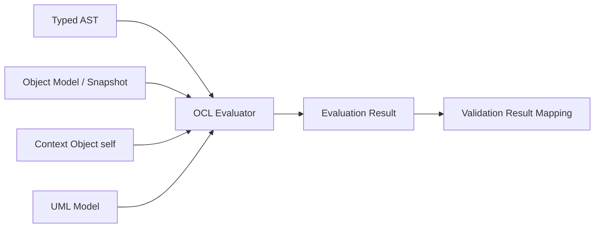
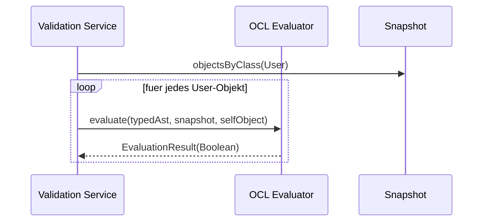
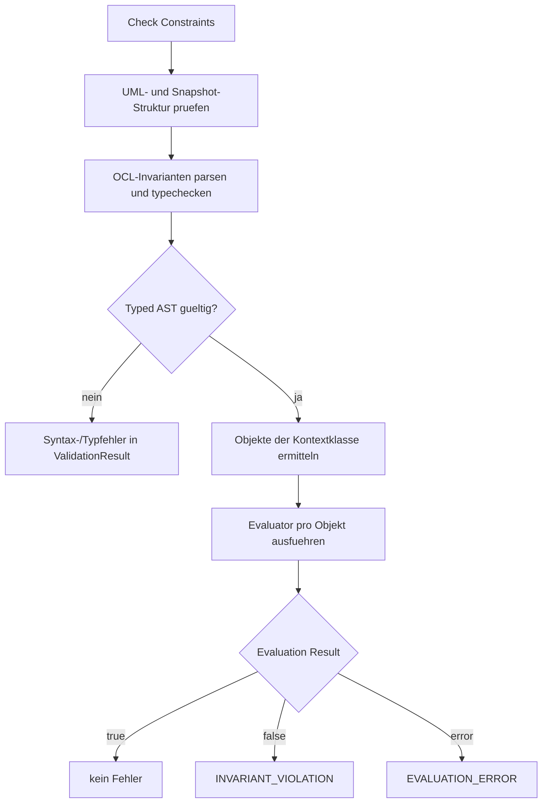

# OCL Evaluator

## Zweck dieser Datei

Diese Datei beschreibt den OCL Evaluator des neuen Backends. Der Evaluator wertet bereits geparste und typgeprüfte OCL-Ausdrücke gegen einen konkreten Snapshot aus.

Im MVP wird der Evaluator für OCL-Invarianten benötigt. Er entscheidet pro Kontextobjekt, ob ein getypter OCL-Ausdruck `true`, `false` oder einen Evaluationsfehler ergibt. Das Ergebnis wird vom Validation Service in strukturierte Validation Results überführt.

Das originale USE-Projekt dient als fachliche Referenz für OCL-Auswertung, Werte, Objektzustände und Invariant Checks. Es wird keine Implementierung, kein Evaluator und kein USE-Core als Dependency übernommen.

## Rolle des Evaluators

Der Evaluator ist die Laufzeitphase der OCL Engine:



Der Typechecker stellt sicher, dass der Ausdruck strukturell und typfachlich gültig ist. Der Evaluator nutzt diese typisierte Struktur, um konkrete Werte aus dem Snapshot zu lesen und Operationen auszuführen.

| Verantwortung | Beschreibung |
|---|---|
| Kontextobjekt binden | `self` zeigt auf das aktuell geprüfte Objekt. |
| Slot-Werte lesen | Attributzugriffe werden auf konkrete Objektwerte abgebildet. |
| Objektlinks navigieren | Association Navigation wird über Links des Snapshots ausgewertet. |
| Operatoren auswerten | Vergleiche und Boolean-Operationen werden auf OCL-Werten ausgeführt. |
| Collection-Operationen auswerten | `size`, `isEmpty`, `notEmpty` werden auf navigierten Collections ausgeführt. |
| Ergebnisse liefern | Liefert typisierte Werte, Evaluationsfehler und optional Debug-Informationen. |

Nicht-Verantwortlichkeiten:

| Nicht-Aufgabe | Zuständig |
|---|---|
| OCL-Text tokenisieren oder parsen | Lexer / Parser |
| Attribute und Rollen semantisch auflösen | Typechecker |
| Operator-Typregeln prüfen | Typechecker |
| Snapshots strukturell vollständig prüfen | Validation Service / Object Model Service |
| Invariantverletzungen UI-fähig formatieren | Validation Result Mapping |

## Eingaben und Ausgaben

### Eingaben

| Eingabe | Zweck |
|---|---|
| `TypedAstNode` | Typgeprüfter Ausdruck mit aufgelösten Attribut-, Association- und Rollenreferenzen. |
| `UmlModel` | Referenzmodell für Klassen, Attribute und Associations. |
| `ObjectModel` / `Snapshot` | Konkreter Objektzustand mit Objekten, Slots und Links. |
| `ObjectInstance self` | Kontextobjekt der aktuellen Invariantenauswertung. |
| `EvaluationOptions` | Optional: Debug-Modus, Fehlerstrategie, Trace-Tiefe. |

### Ausgaben

| Ausgabe | Beschreibung |
|---|---|
| `EvaluationResult` | Ergebnis einer Auswertung für ein Kontextobjekt. |
| `OclValue` | Typisierter Wert, z. B. `BooleanValue(false)`. |
| `EvaluationDiagnostic` | Strukturierter Fehler während der Laufzeit-Auswertung. |
| `EvaluationTrace` | Optionale Debug-Informationen für Fehlermeldungen und Entwicklung. |

Konzeptionelles Ergebnis:

```json
{
  "invariantId": "inv-user-max-books",
  "selfObjectId": "obj-alice",
  "status": "OK",
  "value": {
    "type": "Boolean",
    "value": false
  },
  "diagnostics": []
}
```

## Evaluation Context

Der Evaluation Context bündelt alle Daten, die während einer Auswertung benötigt werden.

| Bestandteil | Beschreibung |
|---|---|
| `self` | Aktuelles Objekt der Kontextklasse. |
| `snapshot` | Zugriff auf alle Objekte, Slots und Links. |
| `umlModel` | Referenz auf Klassen, Attribute und Associations. |
| `bindings` | Sichtbare Variablen; im MVP nur `self`. |
| `trace` | Optionaler Auswertungsverlauf. |

Im MVP wird eine Invariante pro Objekt der Kontextklasse ausgewertet:



Beispiel:

```text
context User inv maxBooks:
  self.books <= 5
```

Für `alice : User` wird `self` im Evaluation Context auf `obj-alice` gesetzt.

## Attributzugriff

Attributzugriffe lesen Slot-Werte des aktuellen oder navigierten Objekts. Der Typechecker hat bereits entschieden, welches Attribut gemeint ist.

```ocl
self.name
self.books
self.available
```

Auswertungsregel:

1. Linker Ausdruck wird zu einem `ObjectValue` ausgewertet.
2. Der Typed AST enthält die aufgelöste `attributeId`.
3. Der Evaluator sucht am Objekt den Slot mit dieser `attributeId`.
4. Der Slot-Wert wird in einen `OclValue` übersetzt.

| Ausdruck | Snapshot-Zugriff | Ergebnis |
|---|---|---|
| `self.name` | Slot `attr-user-name` von `obj-alice` | `StringValue("Alice")` |
| `self.books` | Slot `attr-user-books` von `obj-alice` | `IntegerValue(6)` |
| `self.available` | Slot `attr-book-available` von `obj-book-1` | `BooleanValue(false)` |

Fehlerfälle:

| Fehlerfall | Code | Behandlung |
|---|---|---|
| Slot fehlt | `EVALUATION_ERROR` oder `INVALID_SLOT_VALUE` | Evaluation für diese Invariante und dieses Objekt schlägt fehl. |
| Slot-Wert passt nicht zum getypten Attribut | `INVALID_SLOT_VALUE` | Sollte idealerweise vor Evaluation als Snapshot-Fehler erkannt werden. |
| Objekt existiert nicht mehr | `EVALUATION_ERROR` | Inkonsistenter Snapshot. |
| Wert ist unset/null | abhängig von MVP-Regel | Siehe Abschnitt zu null und fehlenden Werten. |

## Association Navigation

Association Navigation wertet Rollen über konkrete Objektlinks im Snapshot aus.

```ocl
self.borrowedBooks
self.borrowedBooks->size()
```

Der Typechecker hat die Navigation bereits auf Association und Association-End aufgelöst. Der Evaluator muss deshalb nicht mehr anhand von Namen suchen, sondern kann IDs verwenden.

Auswertungsregel für eine einfache binäre Association:

1. Linker Ausdruck wird zu einem `ObjectValue` ausgewertet.
2. Typed AST enthält `associationId`, Source-End und Target-End.
3. Evaluator sucht alle Links dieser Association, an denen das Source-Objekt beteiligt ist.
4. Evaluator sammelt die Zielobjekte der Target-Seite.
5. Ergebnis ist je nach getyptem Navigationsausdruck ein einzelnes `ObjectValue` oder ein `CollectionValue<ObjectValue>`.

| Navigationstyp | Laufzeitergebnis |
|---|---|
| einzelwertige Navigation `1` | `ObjectValue(target)` |
| optionale Navigation `0..1` | `ObjectValue(target)` oder MVP-spezifischer fehlender Wert |
| mehrwertige Navigation `*`, `0..*`, `1..*` | `CollectionValue([target1, target2, ...])` |

Beispiel:

```json
{
  "self": "obj-alice",
  "navigation": "borrowedBooks",
  "links": [
    "link-alice-book-1",
    "link-alice-book-2"
  ],
  "result": {
    "type": "Collection<Book>",
    "values": ["obj-book-1", "obj-book-2"]
  }
}
```

Fehlerfälle:

| Fehlerfall | Code | Bemerkung |
|---|---|---|
| Link verweist auf nicht existierendes Objekt | `INVALID_LINK` oder `EVALUATION_ERROR` | Sollte durch Snapshot-Validierung vorab auffallen. |
| Link passt nicht zur Association | `INVALID_LINK` | Struktureller Snapshot-Fehler. |
| einzelwertige Navigation liefert mehrere Ziele | `MULTIPLICITY_VIOLATION` oder `EVALUATION_ERROR` | Multiplicity Check sollte den eigentlichen Fehler melden. |
| optionale Navigation liefert kein Ziel | offene MVP-Regel | Kann als unset/null oder Evaluation Error behandelt werden. |

## Collection-Auswertung

Collections entstehen im MVP hauptsächlich durch mehrwertige Association Navigation.

Interne Repräsentation:

```text
CollectionValue
  elementType = ClassType(Book)
  values = [ObjectValue(obj-book-1), ObjectValue(obj-book-2)]
```

MVP-Operationen:

| Ausdruck | Eingabe | Ergebnis |
|---|---|---|
| `self.borrowedBooks->size()` | `CollectionValue` mit `n` Elementen | `IntegerValue(n)` |
| `self.borrowedBooks->isEmpty()` | `CollectionValue` | `BooleanValue(n == 0)` |
| `self.borrowedBooks->notEmpty()` | `CollectionValue` | `BooleanValue(n > 0)` |

Beispiel:

```ocl
self.borrowedBooks->size() <= 5
```

Wenn `self.borrowedBooks` auf sechs `Book`-Objekte navigiert:

```text
CollectionValue<Book>(6 elements)
-> size()
IntegerValue(6)
-> 6 <= 5
BooleanValue(false)
```

Im MVP sollte die Reihenfolge einer Collection keine fachliche Bedeutung haben. Für spätere OCL-Erweiterungen muss geklärt werden, ob Collection-Arten wie `Set`, `Bag`, `Sequence` und `OrderedSet` unterschieden werden.

## Operator-Auswertung

### Vergleichsoperatoren

Vergleichsoperatoren werden nur auf bereits typgeprüfte Operanden angewendet.

| Operator | Laufzeitregel | Beispiel |
|---|---|---|
| `=` | Wertgleichheit kompatibler Typen | `self.available = false` |
| `<>` | Negierte Wertgleichheit | `self.name <> ''` |
| `<` | numerischer Vergleich | `self.books < 5` |
| `<=` | numerischer Vergleich | `self.books <= 5` |
| `>` | numerischer Vergleich | `self.rating > 3.5` |
| `>=` | numerischer Vergleich | `self.books >= 0` |

Beispiel:

```ocl
self.books <= 5
```

Für `alice : User` mit `books = 6`:

```text
self.books  -> IntegerValue(6)
5           -> IntegerValue(5)
6 <= 5      -> BooleanValue(false)
```

### Boolean-Operatoren

| Operator | Laufzeitregel |
|---|---|
| `and` | `BooleanValue(left && right)` |
| `or` | `BooleanValue(left || right)` |
| `not` | `BooleanValue(!operand)` |

Für den MVP kann Short-Circuit-Auswertung verwendet werden:

| Ausdruck | Verhalten |
|---|---|
| `false and X` | `X` muss nicht ausgewertet werden. |
| `true or X` | `X` muss nicht ausgewertet werden. |

Die genaue Behandlung von `null`, `undefined` oder `invalid` in Boolean-Ausdrücken ist Post-MVP zu klären. Im MVP sollte ein fehlender Wert nicht stillschweigend als `false` interpretiert werden.

## Evaluation Result

Ein Evaluation Result beschreibt die Auswertung eines Ausdrucks für ein konkretes Kontextobjekt.

| Feld | Zweck |
|---|---|
| `invariantId` | Betroffene Invariante. |
| `selfObjectId` | Objekt, gegen das ausgewertet wurde. |
| `status` | `OK` oder `ERROR`. |
| `value` | OCL-Wert bei erfolgreicher Evaluation. |
| `diagnostics` | Evaluationsfehler. |
| `trace` | Optionale Debug-Informationen. |

Beispiel für erfolgreiche Evaluation mit verletzter Invariante:

```json
{
  "invariantId": "inv-user-max-books",
  "selfObjectId": "obj-alice",
  "status": "OK",
  "value": {
    "type": "Boolean",
    "value": false
  },
  "diagnostics": []
}
```

Beispiel für erfolgreiche Evaluation mit erfüllter Invariante:

```json
{
  "invariantId": "inv-user-name-required",
  "selfObjectId": "obj-alice",
  "status": "OK",
  "value": {
    "type": "Boolean",
    "value": true
  },
  "diagnostics": []
}
```

## Evaluation Errors

Evaluation Errors entstehen trotz erfolgreichem Parsing und Typechecking, wenn der konkrete Snapshot nicht auswertbar ist.

| Fehler | Code | Beispiel | Behandlung |
|---|---|---|---|
| fehlender Slot | `EVALUATION_ERROR` oder `INVALID_SLOT_VALUE` | `self.name` ohne Slot-Wert | Validation Error für Objekt/Slot |
| falscher Slot-Werttyp | `INVALID_SLOT_VALUE` | `books = "six"` | Snapshot-Fehler priorisieren |
| defekter Link | `INVALID_LINK` | Link verweist auf gelöschtes Objekt | Link markieren |
| Navigation inkonsistent | `EVALUATION_ERROR` | getypte Rolle nicht in Snapshot auswertbar | Invariante nicht verlässlich auswertbar |
| einzelwertige Navigation mehrdeutig | `MULTIPLICITY_VIOLATION` oder `EVALUATION_ERROR` | zwei Owner bei `0..1` | Multiplicity-Fehler melden |
| nicht unterstützter Runtime-Wert | `EVALUATION_ERROR` | Post-MVP-Wert im MVP-Evaluator | Fehler mit Phase `EVALUATION` |

Beispiel:

```json
{
  "code": "EVALUATION_ERROR",
  "severity": "ERROR",
  "phase": "EVALUATION",
  "message": "Slot value for attribute 'books' is missing on object 'alice'.",
  "invariantId": "inv-user-max-books",
  "objectIds": ["obj-alice"],
  "modelElementIds": ["attr-user-books"]
}
```

## Debug- und Trace-Informationen

Debug-Informationen sind nicht zwingend für den MVP, aber hilfreich für Tests, Fehlermeldungen und spätere UI-Funktionen.

Mögliche Trace-Einträge:

| Feld | Zweck |
|---|---|
| `nodeId` | Referenz auf AST-Knoten. |
| `expressionText` | Ausschnitt des OCL-Ausdrucks. |
| `resultType` | Typ des Zwischenergebnisses. |
| `resultPreview` | Gekürzte Wertdarstellung. |
| `sourceRange` | Position im OCL-Text. |
| `modelElementIds` | Aufgelöste Attribute, Rollen oder Associations. |
| `objectIds` | Betroffene Objekte während der Auswertung. |

Beispiel-Trace:

```json
[
  {
    "expressionText": "self.books",
    "resultType": "Integer",
    "resultPreview": "6",
    "modelElementIds": ["attr-user-books"],
    "objectIds": ["obj-alice"]
  },
  {
    "expressionText": "self.books <= 5",
    "resultType": "Boolean",
    "resultPreview": "false",
    "objectIds": ["obj-alice"]
  }
]
```

Im MVP kann Trace intern für Tests genutzt werden. Eine sichtbare UI-Debug-Ansicht ist Post-MVP.

## Integration mit Typechecker

Der Evaluator setzt voraus, dass der Typechecker erfolgreich war.

| Typechecker liefert | Nutzen im Evaluator |
|---|---|
| Ergebnistyp jedes AST-Knotens | Evaluator kann Werte typisiert erzeugen. |
| `attributeId` bei Attributzugriffen | Slot-Zugriff ohne Namenssuche. |
| `associationId` und Association-End-IDs | Navigation über Links eindeutig möglich. |
| Collection-Operation | Direkte Dispatch-Entscheidung für `size`, `isEmpty`, `notEmpty`. |
| Kontextklasse | Validation Service wählt passende `self`-Objekte. |

Wenn der Typechecker Diagnosen liefert, darf der Evaluator für diese Invariante nicht laufen. Dadurch werden Typecheck-Fehler und Laufzeitfehler sauber getrennt.

## Integration mit Validation Service

Der Validation Service orchestriert die Auswertung aller Invarianten.



Mapping-Regeln:

| Evaluation Result | Validation Result |
|---|---|
| `BooleanValue(true)` | kein Validation Error |
| `BooleanValue(false)` | `INVARIANT_VIOLATION` mit `invariantId` und `objectId` |
| `status = ERROR` | `EVALUATION_ERROR` oder spezifischer Snapshot-Fehler |
| Nicht-Boolean-Wert | sollte nicht vorkommen; Typechecker-Fehler |

## Beispielauswertungen

### Beispiel 1: `self.books <= 5`

Snapshot:

```json
{
  "object": {
    "id": "obj-alice",
    "name": "alice",
    "classId": "class-user",
    "slots": [
      {
        "attributeId": "attr-user-books",
        "value": {
          "type": "Integer",
          "value": 6
        }
      }
    ]
  }
}
```

Auswertung:

```text
self.books       -> IntegerValue(6)
5                -> IntegerValue(5)
self.books <= 5  -> BooleanValue(false)
```

Ergebnis:

```json
{
  "invariantId": "inv-user-max-books",
  "selfObjectId": "obj-alice",
  "status": "OK",
  "value": {
    "type": "Boolean",
    "value": false
  }
}
```

Der Validation Service erzeugt daraus eine `INVARIANT_VIOLATION` für `obj-alice`.

### Beispiel 2: `self.name <> ''`

```text
self.name  -> StringValue("Alice")
''         -> StringValue("")
<>         -> BooleanValue(true)
```

Die Invariante ist für `alice` erfüllt.

### Beispiel 3: `self.available = false`

Für `book1 : Book` mit `available = false`:

```text
self.available -> BooleanValue(false)
false          -> BooleanValue(false)
=              -> BooleanValue(true)
```

### Beispiel 4: `self.borrowedBooks->size() <= 5`

Für `alice : User` mit sechs gelinkten Büchern:

```text
self.borrowedBooks         -> CollectionValue<Book>(6)
self.borrowedBooks->size() -> IntegerValue(6)
5                          -> IntegerValue(5)
6 <= 5                     -> BooleanValue(false)
```

### Beispiel 5: `self.borrowedBooks->notEmpty()`

Für `alice : User` mit mindestens einem gelinkten Buch:

```text
self.borrowedBooks             -> CollectionValue<Book>(n)
self.borrowedBooks->notEmpty() -> BooleanValue(n > 0)
```

## Typisierte Werte

Der Evaluator sollte nicht mit rohen JSON-Werten arbeiten, sondern mit internen OCL-Werten.

| OCL-Wert | Inhalt | Beispiel |
|---|---|---|
| `StringValue` | String | `"Alice"` |
| `IntegerValue` | Ganzzahl | `6` |
| `RealValue` | Dezimalzahl | `3.5` |
| `BooleanValue` | Boolean | `false` |
| `ObjectValue` | Referenz auf `ObjectInstance` | `obj-alice` |
| `CollectionValue<T>` | Liste oder Menge von OCL-Werten | `[obj-book-1, obj-book-2]` |
| `UndefinedValue` | fehlender Wert, Post-MVP oder eingeschränkt im MVP | unset Slot |
| `InvalidValue` | nicht auswertbarer Wert, Post-MVP | fehlerhafte Navigation |

MVP-Empfehlung:

- Primitive Slot-Werte werden explizit in passende `OclValue`-Typen konvertiert.
- Objektwerte enthalten stabile Objekt-IDs und Klassentypen.
- Collection-Werte enthalten Elementtyp und Elementliste.
- `UndefinedValue` wird noch nicht vollständig OCL-konform implementiert, aber als späterer Werttyp vorbereitet.

## Null und fehlende Werte

OCL besitzt fachlich eine anspruchsvollere Semantik für `null`, `invalid` und `undefined`. Der MVP sollte diese Semantik nicht vollständig nachbauen, aber bewusst entscheiden, wie fehlende Werte behandelt werden.

| Situation | MVP-Empfehlung | Post-MVP |
|---|---|---|
| Slot fehlt komplett | `EVALUATION_ERROR` oder vorgelagerter `INVALID_SLOT_VALUE` | `UndefinedValue` prüfen |
| Slot ist explizit unset | Validierungsfehler, wenn Ausdruck den Wert benötigt | OCL-konforme Undefined-Semantik |
| optionale Navigation findet kein Ziel | offene Entscheidung; eher Evaluationsfehler oder `UndefinedValue` | `null`/`invalid` sauber modellieren |
| defekter Link | `INVALID_LINK` | bleibt struktureller Fehler |
| Boolean-Ausdruck mit fehlendem Wert | nicht still als `false` werten | OCL-konforme Logik definieren |

Wichtig: Fehlende Werte dürfen im MVP nicht stillschweigend als valide Werte interpretiert werden. Andernfalls würden Constraint-Verletzungen verdeckt.

## Bezug zum originalen USE-Projekt

Im originalen USE-Projekt sind OCL-Auswertung, Werte und Snapshot-Zugriff fachlich eng miteinander verbunden. Relevante Referenzbereiche sind:

| Originalbereich | Relevanz für neuen Evaluator | Nutzung |
|---|---|---|
| `use-core/src/main/java/org/tzi/use/uml/ocl/expr/` | Ausdrucksklassen und Auswertungsverhalten | Verhaltenreferenz |
| `use-core/src/main/java/org/tzi/use/uml/ocl/value/` | OCL-Werttypen, Collections, Undefined/Invalid | fachliche Referenz |
| `use-core/src/main/java/org/tzi/use/uml/sys/MSystemState.java` | konkreter Systemzustand für Evaluation | Snapshot-Referenz |
| `use-core/src/main/java/org/tzi/use/uml/sys/MObject.java` | Objektidentität und Klassenzuordnung | fachliche Referenz |
| `use-core/src/main/java/org/tzi/use/uml/sys/MObjectState.java` | Attributwerte pro Objektzustand | fachliche Referenz |
| `use-core/src/main/java/org/tzi/use/uml/sys/MLink.java` | konkrete Links zwischen Objekten | Navigationsreferenz |
| `use-core/src/main/java/org/tzi/use/uml/sys/MLinkSet.java` | Linkmengen und Association-Auswertung | Navigationsreferenz |
| `use-core/src/main/java/org/tzi/use/uml/ocl/expr/Evaluator.java` | OCL-Auswertungsablauf | Verhaltenreferenz, keine Codeübernahme |

Abgrenzung:

- Der neue Evaluator wird eigenständig implementiert.
- Es wird kein USE-Evaluator eingebettet.
- OCL-Wertklassen werden neu definiert.
- Snapshot-Zugriff erfolgt über das neue `ObjectModel`.
- Das MVP bildet nur das definierte OCL-Subset ab.

## Teststrategie

Der Evaluator benötigt fokussierte Unit- und Integrationstests.

| Testbereich | Ziel | Beispiel |
|---|---|---|
| Literal-Evaluation | Primitive Werte korrekt erzeugen. | `'Alice'`, `5`, `false`. |
| `self`-Evaluation | Kontextobjekt korrekt binden. | `self` ergibt `ObjectValue(obj-alice)`. |
| Attributzugriff | Slot-Werte lesen. | `self.books` ergibt `IntegerValue(6)`. |
| Vergleichsauswertung | Operatoren korrekt berechnen. | `6 <= 5` ergibt `false`. |
| Boolean-Auswertung | `and`, `or`, `not` prüfen. | `not false` ergibt `true`. |
| Navigation | Objektlinks auswerten. | `self.borrowedBooks` liefert Collection. |
| Collection-Operationen | `size`, `isEmpty`, `notEmpty` prüfen. | sechs Links ergeben `size() = 6`. |
| Evaluationsfehler | fehlende Slots und defekte Links melden. | `EVALUATION_ERROR`. |
| Validation-Integration | false wird zu Invariantverletzung. | `obj-alice` verletzt `maxBooks`. |
| Trace | Debug-Informationen stabil erzeugen. | Zwischenergebnisse nachvollziehbar. |

MVP-Testausdrücke:

```ocl
self.books <= 5
self.name <> ''
self.available = false
self.borrowedBooks->size() <= 5
self.borrowedBooks->notEmpty()
```

Negative Evaluator-Fixtures:

| Fixture | Erwartung |
|---|---|
| Objekt ohne benötigten Slot | `EVALUATION_ERROR` oder `INVALID_SLOT_VALUE` |
| Slot mit falschem Werttyp | `INVALID_SLOT_VALUE` |
| Link zu gelöschtem Objekt | `INVALID_LINK` |
| optionale Navigation ohne Ziel | abhängig von definierter MVP-Regel |
| einzelwertige Navigation mit mehreren Links | Multiplicity-Fehler oder Evaluationsfehler |

## Post-MVP-Erweiterungen

| Erweiterung | Zusätzliche Evaluator-Aufgabe |
|---|---|
| `forAll` | Collection iterieren und Body für jedes Element auswerten. |
| `exists` | Collection iterieren und bei erstem Treffer true liefern. |
| `select` | Collection anhand eines Boolean-Bodys filtern. |
| `collect` | Collection auf neue Werte abbilden. |
| `includes` / `excludes` | Mitgliedschaft in Collections prüfen. |
| `if-then-else` | Bedingung auswerten und genau einen Branch evaluieren. |
| `let` | Lokales Binding in Evaluation Context eintragen. |
| `allInstances` | Alle Snapshot-Objekte einer Klasse liefern. |
| Operation Calls | Operationsergebnisse auswerten oder Stub-Strategie definieren. |
| Derived Attributes | Werte on demand berechnen. |
| Init Values | Initialwerte bei Objekterzeugung auswerten. |
| Pre-/Postconditions | Vorher-/Nachher-Snapshots und `@pre` unterstützen. |
| Undefined/Invalid | OCL-konforme Fehler- und Null-Semantik ergänzen. |

## Offene Fragen

| Frage | Bedeutung |
|---|---|
| Wie wird `0..1` Navigation ohne Ziel im MVP behandelt? | Beeinflusst `null`/`undefined`-Semantik. |
| Werden fehlende Slots bereits vor Evaluation als Snapshot-Fehler gesammelt? | Beeinflusst Fehlerpriorisierung. |
| Soll der Evaluator Short-Circuit für Boolean-Operatoren verwenden? | Empfehlung: ja, aber Trace muss das abbilden. |
| Wird Collection-Reihenfolge im MVP garantiert oder ignoriert? | Relevant für spätere `Sequence`-Semantik. |
| Wie detailliert soll Evaluation Trace in API-Antworten erscheinen? | MVP vermutlich intern, Post-MVP sichtbar. |
| Werden Evaluation Results gecacht? | Für MVP nicht nötig, später bei großen Snapshots relevant. |
| Wie werden Mehrfachverletzungen einer Invariante gruppiert? | Beeinflusst Validation Results Panel. |

## Zusammenfassung

Der OCL Evaluator wertet getypte OCL-Ausdrücke gegen konkrete Snapshots aus. Er bindet `self` an ein Kontextobjekt, liest Attributwerte aus Slots, navigiert über Objektlinks, berechnet Collection-Operationen und führt Vergleichs- sowie Boolean-Operationen aus.

Im MVP muss der Evaluator insbesondere Ausdrücke wie `self.books <= 5`, `self.name <> ''`, `self.available = false`, `self.borrowedBooks->size() <= 5` und `self.borrowedBooks->notEmpty()` zuverlässig auswerten. `false` wird vom Validation Service als `INVARIANT_VIOLATION` gemeldet, echte Laufzeitprobleme werden als strukturierte Evaluationsfehler zurückgegeben.

Das originale USE-Projekt bleibt eine wichtige fachliche Referenz für Werte, Systemzustände, Navigation und Invariantenauswertung. Die technische Umsetzung des Evaluators entsteht vollständig neu.
