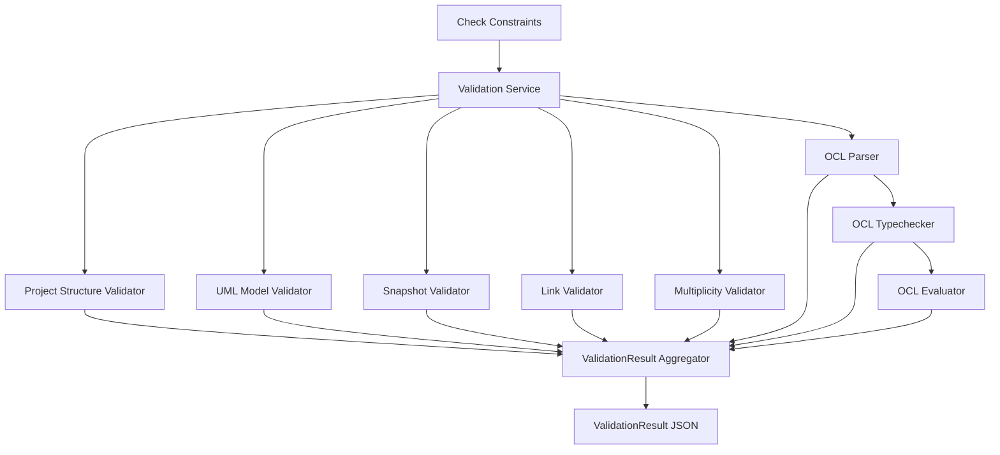
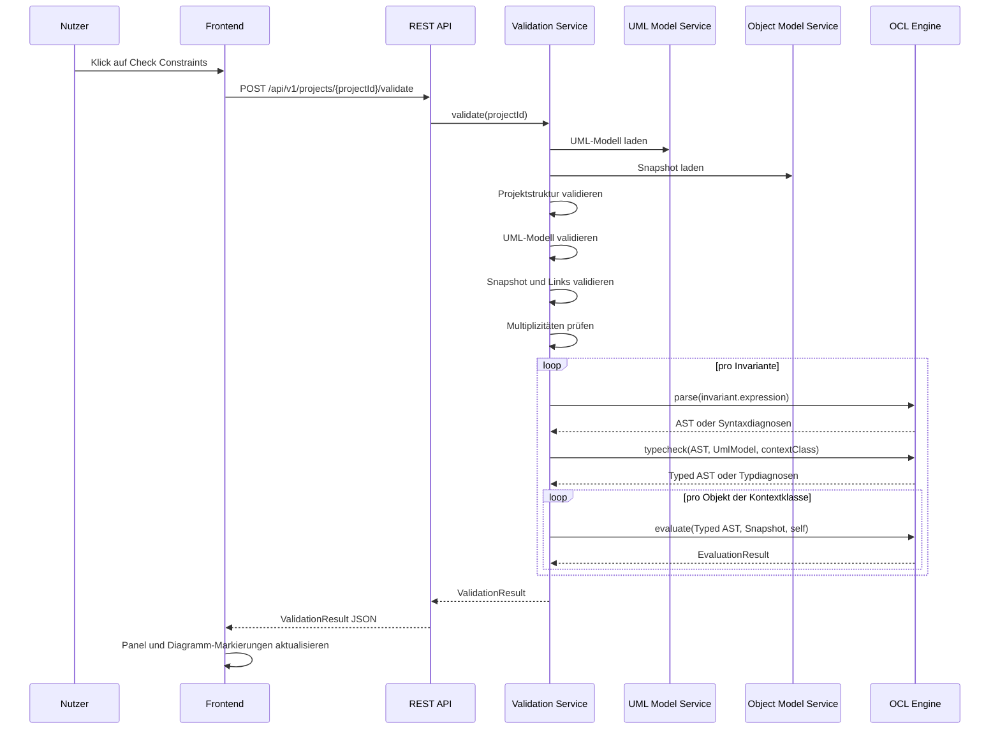
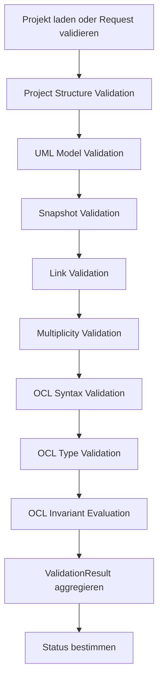
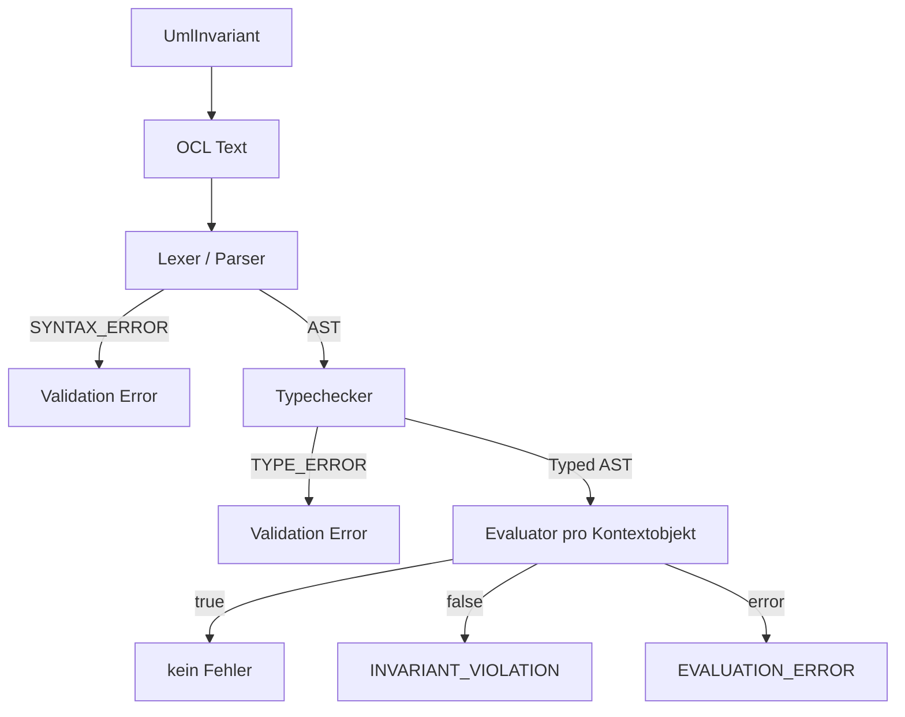
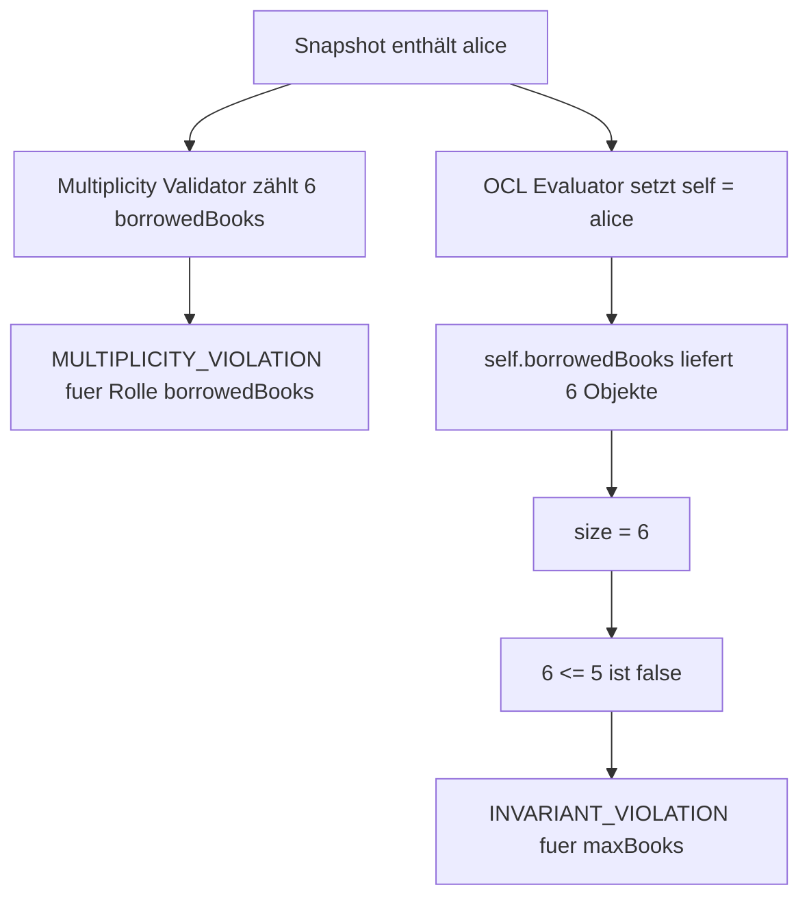

# Validation Service

## Zweck dieser Datei

Diese Datei beschreibt den Validation Service des neuen Backends. Der Service koordiniert beim Klick auf `Check Constraints` alle relevanten Prüfungen für Projektstruktur, UML-Modell, Snapshot, Links, Multiplizitäten und OCL-Invarianten.

Der Validation Service ist die zentrale fachliche Prüfinstanz des Zielsystems. Er erzeugt strukturierte Validation Results, die vom Frontend für das Validation Results Panel, Diagramm-Markierungen und Fehlerdetails genutzt werden können.

Das originale USE-Projekt dient als fachliche Referenz für Constraint- und Invariantenprüfung. Die technische Umsetzung des neuen Validation Service entsteht eigenständig und verwendet keine USE-Core-Dependency.

## Rolle des Validation Service

Der Validation Service orchestriert mehrere spezialisierte Validatoren und die OCL Engine. Er ist nicht nur für OCL zuständig, sondern für die gesamte fachliche Konsistenz eines Projekts.



Verantwortlichkeiten:

| Verantwortung | Beschreibung |
|---|---|
| Validierungslauf koordinieren | Führt alle relevanten Prüfungen in definierter Reihenfolge aus. |
| Strukturfehler sammeln | Erkennt fehlende Referenzen, ungültige Typen und inkonsistente Modelle. |
| Snapshot prüfen | Prüft Objekte, Slots und Objektlinks gegen das UML-Modell. |
| Multiplizitäten prüfen | Zählt Links pro Association End und Objekt. |
| OCL Engine aufrufen | Lässt OCL-Ausdrücke parsen, typprüfen und auswerten. |
| Ergebnisse aggregieren | Führt Fehler, Warnungen und Infos in einem Result zusammen. |
| Frontend-Mapping ermöglichen | Liefert IDs für Objekte, Links, Klassen, Invarianten und OCL-Source-Ranges. |

Nicht-Verantwortlichkeiten:

| Nicht-Aufgabe | Zuständig |
|---|---|
| Diagramm-Rendering | Frontend |
| Layout-Berechnung | Frontend oder Layout-Komponente |
| OCL-Grammatik implementieren | OCL Parser |
| OCL-Typregeln implementieren | OCL Typechecker |
| OCL-Ausdruck auswerten | OCL Evaluator |
| Projekt dauerhaft speichern | Project/Persistence Service |
| UI-Texte final formatieren | Frontend, auf Basis strukturierter Daten |

## Validierungsebenen

Der Validation Service verarbeitet mehrere Ebenen. Jede Ebene kann eigene Fehler erzeugen und bestimmte spätere Prüfungen beeinflussen.

| Ebene | Prüft | Typische Fehlercodes | MVP |
|---|---|---|---|
| Projektstrukturvalidierung | Projekt-ID, Modellblöcke, Snapshot-Existenz, IDs | `TYPE_ERROR` | Pflicht |
| UML-Modellvalidierung | Klassen, Attribute, Operationen, Associations, Rollen, Multiplizitäten | `UNKNOWN_CLASS`, `TYPE_ERROR`, `SYNTAX_ERROR` | Pflicht |
| Typvalidierung von Attributen | primitive Typen und erlaubte Attributtypen | `TYPE_ERROR` | Pflicht |
| Snapshot-/Objektvalidierung | Objekte, Klassenzuordnung, Slots, Objektidentität | `UNKNOWN_CLASS`, `UNKNOWN_ATTRIBUTE`, `INVALID_SLOT_VALUE` | Pflicht |
| Linkvalidierung | ObjectLinks gegen Associations und Association Ends | `INVALID_LINK` | Pflicht |
| Multiplizitätsvalidierung | Linkanzahl pro Objekt und Association End | `MULTIPLICITY_VIOLATION` | Pflicht |
| OCL-Syntaxprüfung | Lexer und Parser für Invariantenausdrücke | `SYNTAX_ERROR` | Pflicht |
| OCL-Typprüfung | Attribute, Rollen, Operatoren, Collection-Regeln | `TYPE_ERROR`, `UNKNOWN_ATTRIBUTE`, `UNKNOWN_CLASS` | Pflicht |
| OCL-Invariantenauswertung | Boolean-Auswertung pro Kontextobjekt | `INVARIANT_VIOLATION`, `EVALUATION_ERROR` | Pflicht |
| Ergebnisaggregation | Status, Summary, Fehlerliste, Mappingdaten | keine fachlichen Codes | Pflicht |

## Validierungsablauf

Beim Klick auf `Check Constraints` ruft das Frontend einen Backend-Endpunkt auf. Je nach Persistenzstrategie sendet es entweder eine Projekt-ID oder den aktuellen Projektzustand.



Empfohlener Ablauf im Backend:



Wichtige Ablaufregeln:

| Regel | Begründung |
|---|---|
| Strukturfehler werden zuerst gesammelt. | Nachfolgende Prüfungen benötigen konsistente Referenzen. |
| OCL-Syntaxfehler verhindern Typechecking der betroffenen Invariante. | Ohne AST ist kein Typecheck möglich. |
| OCL-Typfehler verhindern Evaluation der betroffenen Invariante. | Evaluation wäre fachlich unsicher. |
| Snapshot-Fehler verhindern nicht automatisch alle OCL-Prüfungen. | Andere unabhängige Fehler sollen weiterhin sichtbar sein. |
| Evaluation Errors werden objektbezogen gemeldet. | Das Frontend muss betroffene Objekte markieren können. |
| Ergebnisaggregation ist deterministisch. | Tests und UI sollten stabile Reihenfolge erwarten können. |

## Subvalidatoren

Der Validation Service sollte intern aus klar getrennten Subvalidatoren bestehen. Das macht den MVP testbar und spätere Erweiterungen kontrollierbar.

| Subvalidator | Aufgabe | Eingaben | Ausgabe |
|---|---|---|---|
| `ProjectStructureValidator` | Prüft Projektcontainer, IDs und Pflichtbereiche. | `Project` | `ValidationIssue[]` |
| `UmlModelValidator` | Prüft Klassen, Attribute, Operationen, Associations. | `UmlModel` | `ValidationIssue[]` |
| `AttributeTypeValidator` | Prüft bekannte primitive Typen und Typreferenzen. | `UmlModel` | `ValidationIssue[]` |
| `SnapshotValidator` | Prüft Objekte, Klassenreferenzen, Slots. | `UmlModel`, `ObjectModel` | `ValidationIssue[]` |
| `LinkValidator` | Prüft Objektlinks gegen Associations. | `UmlModel`, `ObjectModel` | `ValidationIssue[]` |
| `MultiplicityValidator` | Prüft Linkanzahlen gegen Multiplizitäten. | `UmlModel`, `ObjectModel` | `ValidationIssue[]` |
| `OclSyntaxValidator` | Ruft Lexer und Parser auf. | `UmlInvariant` | AST oder Diagnosen |
| `OclTypeValidator` | Ruft Typechecker auf. | AST, `UmlModel`, Kontextklasse | Typed AST oder Diagnosen |
| `InvariantEvaluationValidator` | Ruft Evaluator pro Objekt auf. | Typed AST, Snapshot, Objekte | Evaluation errors |
| `ValidationResultMapper` | Normalisiert errors in API-Result. | errors, Kontextdaten | `ValidationResult` |

Subvalidatoren sollten keine UI-Entscheidungen treffen. Sie liefern stabile fachliche Referenzen wie `objectIds`, `linkIds`, `modelElementIds`, `invariantId` und `sourceRange`.

## OCL-Validierung

OCL-Validierung ist ein Teil des Validation Service, bleibt aber in der OCL Engine gekapselt.



OCL-MVP-Prüfungen:

| Prüfung | Beispiel | Fehlercode |
|---|---|---|
| Ausdruck ist syntaktisch gültig | `self.books <=` | `SYNTAX_ERROR` |
| Kontextklasse existiert | Invariante auf gelöschter Klasse | `UNKNOWN_CLASS` |
| Attribute existieren | `self.unknown` | `UNKNOWN_ATTRIBUTE` |
| Association Navigation ist gültig | `self.borrowedBooks` | `UNKNOWN_ATTRIBUTE` oder `TYPE_ERROR` |
| Operatoren passen zu Typen | `self.name <= 5` | `TYPE_ERROR` |
| Collection-Operationen sind gültig | `self.name->size()` | `TYPE_ERROR` |
| Invariante ergibt Boolean | `self.name` | `TYPE_ERROR` |
| Evaluation ergibt `false` | `self.books <= 5` bei `books = 6` | `INVARIANT_VIOLATION` |
| Evaluation kann nicht ausgeführt werden | Slot fehlt | `EVALUATION_ERROR` oder `INVALID_SLOT_VALUE` |

## Multiplizitätsvalidierung

Die Multiplizitätsvalidierung prüft UML-Associations gegen konkrete Objektlinks. Sie ist unabhängig von OCL, kann aber ähnliche fachliche Fälle erkennen wie eine OCL-Invariante mit `size()`.

Regel:

```text
Für jede Association:
  Für jedes Association End:
    Für jedes Objekt der End-Klasse:
      Zähle passende Links am gegenüberliegenden End.
      Prüfe lower <= count <= upper oder upper = *.
```

Beispiel:

| Association | Rolle | Multiplizität | Objekt | Linkanzahl | Ergebnis |
|---|---|---|---|---:|---|
| `Borrows` | `borrowedBooks` | `0..5` | `alice` | 6 | `MULTIPLICITY_VIOLATION` |
| `Borrows` | `borrower` | `0..1` | `mobyDick` | 1 | OK |

MVP-Entscheidungen:

| Thema | Empfehlung |
|---|---|
| Binäre Associations | Pflicht im MVP. |
| N-äre Associations | Post-MVP. |
| Association Classes | Post-MVP. |
| Doppelte Links | Im MVP entweder verhindern oder eindeutig als Linkanzahl zählen. |
| Richtung/Navigierbarkeit | Für Validierung zählt die Association-Struktur, nicht nur navigierbare Rollen. |

## ValidationResult-Struktur

Das API-Result muss maschinenlesbar und frontendfreundlich sein. Das Frontend soll keine Fehlermeldungstexte parsen müssen.

Empfohlenes Top-Level-Format:

```json
{
  "id": "validation-2026-07-11-001",
  "projectId": "project-library",
  "umlModelId": "uml-library",
  "objectModelId": "snapshot-current",
  "status": "INVALID",
  "checkedAt": "2026-07-11T20:30:00Z",
  "summary": {
    "errorCount": 2,
    "warningCount": 0,
    "infoCount": 0
  },
  "errors": []
}
```

Empfohlenes Fehlerformat:

```json
{
  "id": "error-001",
  "code": "INVARIANT_VIOLATION",
  "severity": "ERROR",
  "phase": "OCL_EVALUATION",
  "message": "Object 'alice' violates invariant 'maxBooks'.",
  "modelElementIds": ["class-user"],
  "objectIds": ["obj-alice"],
  "linkIds": [],
  "slotIds": [],
  "invariantId": "inv-user-max-books",
  "sourceRange": {
    "expressionId": "expr-user-max-books",
    "startLine": 1,
    "startColumn": 1,
    "endLine": 1,
    "endColumn": 34
  },
  "details": {
    "contextClass": "User",
    "invariantName": "maxBooks",
    "expression": "self.borrowedBooks->size() <= 5"
  }
}
```

Statuswerte:

| Status | Bedeutung |
|---|---|
| `VALID` | Keine Errors; Warnungen können je nach Regel erlaubt sein. |
| `INVALID` | Mindestens ein fachlicher Error liegt vor. |
| `NOT_EVALUABLE` | Zentrale Prüfungen konnten wegen Syntax-, Typ- oder Strukturfehlern nicht vollständig laufen. |

Phasen:

| Phase | Bedeutung |
|---|---|
| `PROJECT_STRUCTURE` | Projektcontainer oder IDs fehlerhaft. |
| `UML_MODEL` | Klassenmodell fehlerhaft. |
| `SNAPSHOT` | Objektmodell oder Slots fehlerhaft. |
| `LINK_VALIDATION` | Objektlinks fehlerhaft. |
| `MULTIPLICITY` | Multiplizitäten verletzt. |
| `OCL_SYNTAX` | Lexer/Parser-Diagnose. |
| `OCL_TYPE_CHECK` | Typechecker-Diagnose. |
| `OCL_EVALUATION` | Evaluator oder Invariantenauswertung. |

## Error Codes und Severity

### Error Codes

| Code | Bedeutung | Typischer Ursprung |
|---|---|---|
| `SYNTAX_ERROR` | Syntax ist ungültig. | UML-Multiplicity-String oder OCL Parser |
| `TYPE_ERROR` | Typen passen nicht zusammen. | UML Type Validation oder OCL Typechecker |
| `UNKNOWN_CLASS` | Klasse existiert nicht. | UML, Snapshot, Invariante |
| `UNKNOWN_ATTRIBUTE` | Attribut oder Property existiert nicht. | Snapshot oder OCL Typechecker |
| `INVALID_SLOT_VALUE` | Slot-Wert passt nicht zum Attributtyp. | Snapshot Validator |
| `INVALID_LINK` | Objektlink passt nicht zur Association. | Link Validator |
| `MULTIPLICITY_VIOLATION` | Linkanzahl verletzt Multiplizität. | Multiplicity Validator |
| `INVARIANT_VIOLATION` | OCL-Invariante ergibt `false`. | OCL Evaluator Mapping |
| `EVALUATION_ERROR` | Ausdruck kann gegen Snapshot nicht ausgewertet werden. | OCL Evaluator |

### Severity

| Severity | MVP-Nutzung | Bedeutung |
|---|---|---|
| `ERROR` | Pflicht | Zustand ist ungültig oder Prüfung ist nicht zuverlässig möglich. |
| `WARNING` | Optional | Auffälliger Zustand, aber nicht zwingend ungültig. |
| `INFO` | Optional | Zusatzinformation, z. B. erfolgreiche Teilprüfung. |

MVP-Empfehlung: Der MVP kann zunächst nur `ERROR` verwenden. `WARNING` und `INFO` sollten im Modell bereits möglich sein, müssen aber nicht aktiv genutzt werden.

## Frontend-Mapping

Validation Results müssen direkt auf UI-Elemente abbildbar sein.

| Referenzfeld | Ziel im Frontend |
|---|---|
| `modelElementIds` | Klassen, Attribute, Associations, Rollen, Invarianten im Klassendiagramm. |
| `objectIds` | Objektkarten im Objektdiagramm. |
| `linkIds` | Objektlinks im Objektdiagramm. |
| `slotIds` | Attributzeilen im Object Properties Panel. |
| `invariantId` | Invariant Badge, Invariant Properties Panel, OCL Editor. |
| `sourceRange` | Markierung im OCL-Ausdruck. |
| `code` | Icon, Farbe, Filter und Gruppierung. |
| `severity` | visuelle Gewichtung. |
| `message` | Primärer Fehlertext im Validation Results Panel. |
| `details` | Aufklappbare Detailansicht. |

Mapping je Fehlercode:

| Code | Primäre Markierung | Sekundäre Markierung |
|---|---|---|
| `SYNTAX_ERROR` | OCL Editor / Invariant Properties | Invariant im Explorer |
| `TYPE_ERROR` | OCL-Ausdruck oder Modellfeld | Klasse/Attribut/Rolle |
| `UNKNOWN_CLASS` | Klasse, Objekt oder Association End | Explorer-Eintrag |
| `UNKNOWN_ATTRIBUTE` | Attribut, Slot oder OCL-Ausdruck | Objekt oder Klasse |
| `INVALID_SLOT_VALUE` | Objekt und Slot-Zeile | Properties Panel |
| `INVALID_LINK` | Objektlink | beteiligte Objekte |
| `MULTIPLICITY_VIOLATION` | Objekt und betroffene Links | Association End |
| `INVARIANT_VIOLATION` | Objekt | Invariante |
| `EVALUATION_ERROR` | Objekt und Invariante | OCL-Ausdruck |

Erwartetes UI-Verhalten:

- `Check Constraints` ersetzt alte Ergebnisse durch neue.
- Das Validation Results Panel zeigt Summary und Einzelfehler.
- Fehlerhafte Objekte erhalten z. B. roten Rahmen oder Badge.
- Fehlerhafte Links werden visuell hervorgehoben.
- Klick auf einen Fehler fokussiert das betroffene Element.
- Fehlerdetails zeigen technische IDs nicht primär, bleiben aber für Debugging verfügbar.

## Beispiel: Library-Constraint-Verletzung

### Modell

```text
class User
  name : String

class Book
  title : String

association Borrows
  User[0..1] role borrower
  Book[0..5] role borrowedBooks

context User inv maxBooks:
  self.borrowedBooks->size() <= 5
```

### Snapshot

```text
alice : User
book1 : Book
book2 : Book
book3 : Book
book4 : Book
book5 : Book
book6 : Book

alice ist mit 6 Book-Objekten über Borrows verbunden.
```

### Validierungsablauf



### Beispiel-ValidationResult

```json
{
  "id": "validation-library-001",
  "projectId": "project-library",
  "umlModelId": "uml-library",
  "objectModelId": "snapshot-current",
  "status": "INVALID",
  "checkedAt": "2026-07-11T20:30:00Z",
  "summary": {
    "errorCount": 2,
    "warningCount": 0,
    "infoCount": 0
  },
  "errors": [
    {
      "id": "error-multiplicity-alice-borrowed-books",
      "code": "MULTIPLICITY_VIOLATION",
      "severity": "ERROR",
      "phase": "MULTIPLICITY",
      "message": "Object 'alice' has 6 linked Book objects for role 'borrowedBooks', but multiplicity is 0..5.",
      "modelElementIds": ["assocend-borrows-books"],
      "objectIds": ["obj-alice"],
      "linkIds": [
        "link-alice-book-1",
        "link-alice-book-2",
        "link-alice-book-3",
        "link-alice-book-4",
        "link-alice-book-5",
        "link-alice-book-6"
      ],
      "slotIds": [],
      "invariantId": null,
      "details": {
        "associationId": "assoc-borrows",
        "roleName": "borrowedBooks",
        "expectedMultiplicity": "0..5",
        "actualCount": 6
      }
    },
    {
      "id": "error-invariant-max-books-alice",
      "code": "INVARIANT_VIOLATION",
      "severity": "ERROR",
      "phase": "OCL_EVALUATION",
      "message": "Object 'alice' violates invariant 'maxBooks'.",
      "modelElementIds": ["class-user"],
      "objectIds": ["obj-alice"],
      "linkIds": [
        "link-alice-book-1",
        "link-alice-book-2",
        "link-alice-book-3",
        "link-alice-book-4",
        "link-alice-book-5",
        "link-alice-book-6"
      ],
      "slotIds": [],
      "invariantId": "inv-user-max-books",
      "sourceRange": {
        "expressionId": "expr-user-max-books",
        "startLine": 1,
        "startColumn": 1,
        "endLine": 1,
        "endColumn": 34
      },
      "details": {
        "contextClass": "User",
        "invariantName": "maxBooks",
        "expression": "self.borrowedBooks->size() <= 5",
        "actualValue": false
      }
    }
  ]
}
```

Hinweis: In einem realen MVP sollte entschieden werden, ob fachlich redundante Fehler wie eine Multiplizitätsverletzung und eine äquivalente OCL-Invariantverletzung beide angezeigt oder gruppiert werden.

## API-Bezug

Möglicher MVP-Endpunkt:

| Methode | Pfad | Zweck |
|---|---|---|
| `POST` | `/projects/{projectId}/validate` | Validiert gespeicherten Projektzustand. |

Optionaler Endpunkt für ungespeicherte UI-Zustände:

| Methode | Pfad | Zweck |
|---|---|---|
| `POST` | `/validation/check` | Validiert übergebenen Projektzustand ohne vorheriges Speichern. |

Request per Projekt-ID:

```json
{
  "scope": "FULL",
  "includeDebugInfo": false
}
```

Request mit Projektzustand:

```json
{
  "scope": "FULL",
  "project": {
    "id": "project-library",
    "umlModel": {},
    "objectModel": {}
  }
}
```

Response:

```json
{
  "status": "INVALID",
  "summary": {
    "errorCount": 1,
    "warningCount": 0,
    "infoCount": 0
  },
  "errors": [
    {
      "code": "INVARIANT_VIOLATION",
      "severity": "ERROR",
      "message": "Object 'alice' violates invariant 'maxBooks'.",
      "objectIds": ["obj-alice"],
      "invariantId": "inv-user-max-books"
    }
  ]
}
```

API-Anforderungen:

| Anforderung | Beschreibung |
|---|---|
| deterministische Antwort | Gleicher Projektzustand erzeugt gleiche fachliche Fehler. |
| stabile IDs | Fehler referenzieren bestehende Modell-, Objekt- und Link-IDs. |
| keine Textparser im Frontend | Codes und Details sind strukturiert. |
| vollständige Fehlerliste | Möglichst viele unabhängige Fehler in einem Lauf melden. |
| keine technischen Stacktraces | Technische Fehler werden gesondert behandelt, nicht als fachliche Validation Results. |

## Bezug zum originalen USE-Projekt

Das originale USE-Projekt bietet wichtige fachliche Referenzen für Validierungsverhalten.

| Originalbereich | Relevanz für neuen Validation Service | Nutzung |
|---|---|---|
| `use-core/src/main/java/org/tzi/use/uml/sys/MSystemState.java` | Systemzustand und zentrale Zustandsprüfung | Verhaltenreferenz für Snapshot Checks |
| `MSystemState.check(...)` | Prüfung von Zustand und Invarianten | Referenz für `Check Constraints` |
| `MSystemState.checkStructure(...)` | Struktur- und Multiplizitätsprüfung | Referenz für Subvalidatoren |
| `reportMultiplicityViolation(...)` | Meldung von Multiplizitätsfehlern | fachliche Referenz für Fehlerdetails |
| `use-core/src/main/java/org/tzi/use/uml/mm/MClassInvariant.java` | Kontextklasse und Invariantendefinition | Referenz für `UmlInvariant` |
| `use-core/src/main/java/org/tzi/use/uml/ocl/expr/Evaluator.java` | OCL-Auswertung | Verhaltenreferenz für Evaluation |
| `use-core/src/main/java/org/tzi/use/parser/ParseErrorHandler.java` | Syntaxfehler mit Position | Referenz für `SYNTAX_ERROR` |
| `use-core/src/main/java/org/tzi/use/parser/SemanticException.java` | semantische Fehler | Referenz für `TYPE_ERROR` |
| Beispielmodelle und `.cmd`-Dateien | Testfälle und Verhaltenserwartungen | Testfallquelle |

Abgrenzung:

- keine Übernahme von `MSystemState`,
- kein Wrapper um USE-Validierung,
- keine Konsolenausgabe als primäres Ergebnisformat,
- keine vollständige USE-Feature-Parität im MVP,
- keine technische Abhängigkeit vom USE-Core.

## Teststrategie

Der Validation Service benötigt Tests auf Subvalidator-, Service- und API-Ebene.

| Testtyp | Ziel | Beispiele |
|---|---|---|
| Unit-Test `UmlModelValidator` | Strukturregeln des Klassenmodells prüfen. | unbekannte Klasse in Association End |
| Unit-Test `SnapshotValidator` | Objekte und Slots prüfen. | falscher Slot-Werttyp |
| Unit-Test `LinkValidator` | Links gegen Associations prüfen. | Link mit falscher Objektklasse |
| Unit-Test `MultiplicityValidator` | Linkanzahl prüfen. | `0..5` verletzt durch 6 Links |
| OCL-Syntax-Integration | Parser-Diagnosen ins Result mappen. | `self.books <=` |
| OCL-Typecheck-Integration | Typechecker-Diagnosen ins Result mappen. | `self.name <= 5` |
| OCL-Evaluation-Integration | `false` zu Invariantverletzung mappen. | `self.books <= 5` bei `books = 6` |
| API-Test | Endpunkt liefert stabiles JSON. | `POST /api/v1/projects/{id}/validate` |
| Frontend-Mapping-Test | Result enthält nötige IDs. | `objectIds`, `linkIds`, `invariantId` |
| Regression aus USE-Referenz | Verhalten aus einfachen USE-Beispielen absichern. | Demo-/Library-nahe Modelle |

Empfohlene Test-Fixtures:

```text
src/test/resources/validation/
├─ library-valid.json
├─ library-invalid-slot-value.json
├─ library-invalid-link.json
├─ library-multiplicity-violation.json
├─ library-ocl-syntax-error.json
├─ library-ocl-type-error.json
└─ library-invariant-violation.json
```

MVP-Akzeptanztests:

| Szenario | Erwartung |
|---|---|
| gültiges Library-Modell mit gültigem Snapshot | `status = VALID` |
| `alice.books = 6` und Invariante `self.books <= 5` | `INVARIANT_VIOLATION` |
| Slot `books` enthält String | `INVALID_SLOT_VALUE` |
| Link zeigt auf falsche Klasse | `INVALID_LINK` |
| sechs Links bei Multiplicity `0..5` | `MULTIPLICITY_VIOLATION` |
| OCL `self.name <= 5` | `TYPE_ERROR` |
| OCL `self.books <=` | `SYNTAX_ERROR` |

## Offene Fragen

| Frage | Bedeutung |
|---|---|
| Soll `NOT_EVALUABLE` als Gesamtstatus genutzt werden, wenn neben Syntaxfehlern keine Invariantenauswertung möglich ist? | Beeinflusst UI-Summary. |
| Werden Warnungen im MVP aktiv erzeugt oder nur im Modell vorgesehen? | Beeinflusst Severity-Handling. |
| Sollen Multiplizitätsverletzungen und äquivalente OCL-Invarianten gruppiert werden? | Verhindert doppelte UI-Meldungen. |
| Wird ein ungespeicherter Projektzustand validiert oder immer der gespeicherte Backend-Zustand? | Beeinflusst API-Design. |
| Wie streng validiert der Backend-Service schon bei Create/Update im Vergleich zu `Check Constraints`? | Beeinflusst Nutzerfluss. |
| Welche Source-Range-Struktur wird final vom Parser geliefert? | Wichtig für OCL Editor Mapping. |
| Sollen Validation Results persistiert werden? | Relevant für Historie und spätere Projektversionierung. |
| Wie wird Fehlerpriorisierung im Panel sortiert? | Beeinflusst Frontend und Tests. |

## Zusammenfassung

Der Validation Service ist der fachliche Orchestrator des Backends für `Check Constraints`. Er koordiniert Projekt-, UML-, Snapshot-, Link-, Multiplizitäts- und OCL-Prüfungen und aggregiert alle Ergebnisse in einem strukturierten `ValidationResult`.

Im MVP muss der Service insbesondere Klassenmodell, Objektdiagramm, Objektlinks, Multiplizitäten und OCL-Invarianten zuverlässig prüfen. Fehler werden mit stabilen IDs, Codes, Severity und Mappinginformationen zurückgegeben, damit das Frontend betroffene Objekte, Links, Invarianten und OCL-Ausdrucksbereiche markieren kann.

Das originale USE-Projekt liefert eine wichtige fachliche Referenz für Zustandsprüfung, Multiplizitätsprüfung und Invariantenauswertung. Das neue Backend übernimmt diese Konzepte als Orientierung, setzt Validierung und Ergebnisformat aber vollständig neu um.
