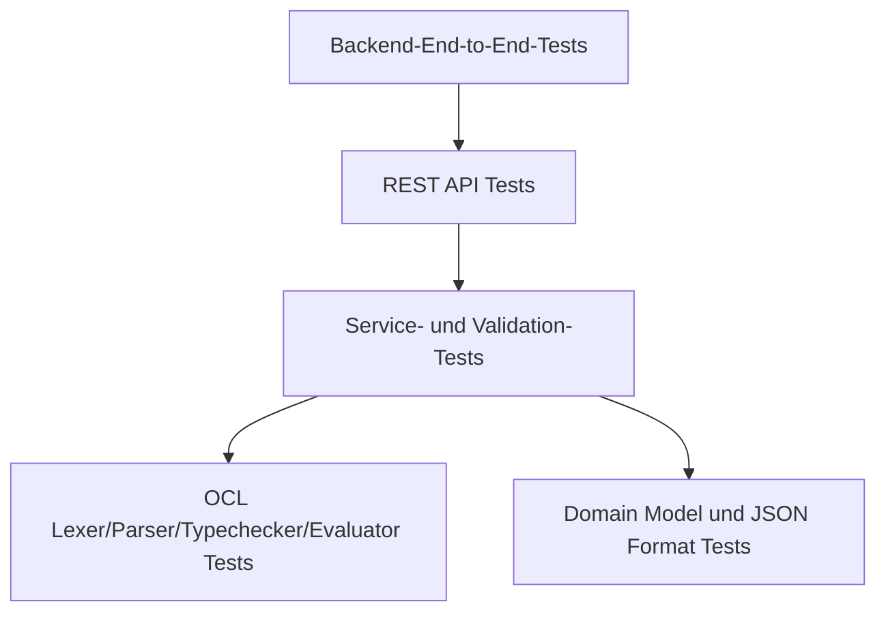
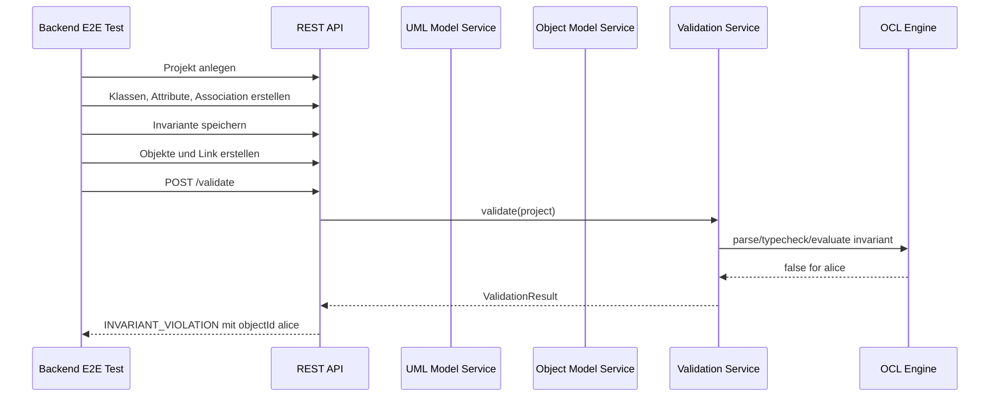

# Backend Test Strategy

## Zweck dieser Datei

Diese Datei beschreibt die Teststrategie für das neue Backend des webbasierten UML/OCL-Systems.

Sie legt fest:

- welche Backend-Bereiche getestet werden müssen,
- welche Tests im MVP zwingend erforderlich sind,
- welche Tests später ergänzt werden sollen,
- wie Testdaten aufgebaut werden,
- welche Referenzen aus dem originalen USE-Projekt für Regressionstests und fachliche Vergleichstests genutzt werden können.

Das originale USE-Projekt dient dabei ausschließlich als Referenz- und Testfallquelle. Der neue Backend-Testaufbau darf keine direkte Runtime-Abhängigkeit zum alten USE-Core erzeugen.

## Testziele

Die Backend-Tests sollen sicherstellen, dass das neue Backend fachlich korrekt, stabil erweiterbar und API-seitig zuverlässig arbeitet.

| Ziel | Beschreibung | MVP-Relevanz |
|---|---|---|
| Fachliche Korrektheit | UML-Modell, Objektmodell, OCL und Validierung liefern erwartete Ergebnisse. | Hoch |
| Erweiterbarkeit | OCL-Pipeline und Validierungslogik können später erweitert werden. | Hoch |
| Fehlertransparenz | Fehler werden strukturiert mit Code, Severity und Elementbezug ausgegeben. | Hoch |
| API-Stabilität | REST-Endpunkte liefern konsistente DTOs und Fehlerformate. | Hoch |
| Regressionsschutz | Beispielmodelle und USE-Referenzen verhindern fachliche Rückschritte. | Hoch |
| Modelltext- und Import-/Export-Vorbereitung | JSON-Format bleibt versionierbar; vollständiger Editor-Modelltext kann im MVP-Subset angewendet und später auf `.use` Import/Export erweitert werden. | Mittel |

## Testpyramide

Die Teststrategie folgt einer klassischen Testpyramide mit starkem Fokus auf schnelle Unit- und Service-Tests.

| Ebene | Zweck | Typische Werkzeuge | MVP-Relevanz |
|---|---|---|---|
| Domain Unit Tests | Domänenobjekte, IDs, Multiplicities, Referenzen. | JUnit, AssertJ | Hoch |
| OCL Unit Tests | Lexer, Parser, AST, Typechecker, Evaluator isoliert testen. | JUnit, Parameterized Tests | Hoch |
| Service Tests | Project, UML, Object Model und Validation Services testen. | JUnit, Spring Test optional | Hoch |
| API Tests | REST-Vertrag und DTOs testen. | Spring Boot Test, MockMvc/WebTestClient | Hoch |
| Backend E2E Tests | Vollständiger Library-Workflow. | Spring Boot Test | Hoch |
| Regression Tests | USE-Beispiele als fachliche Testfallquelle. | JUnit, Test Fixtures | Mittel bis hoch |

## Domain Model Tests

Domain Model Tests prüfen das fachliche Kernmodell unabhängig von REST, Persistenz und UI.

| Testbereich | Ziel | Typische Testfälle | MVP | USE-Referenz |
|---|---|---|---|---|
| Project | Projekt enthält UML-Modell, Snapshot und Metadaten. | Projekt mit stabiler ID anlegen; leeres Projekt validieren. | Ja | Keine direkte Entsprechung; fachlich aus USE-Systemkontext ableitbar. |
| UmlModel | Klassen, Associations und Invarianten korrekt referenzieren. | Klasse hinzufügen; doppelte Namen erkennen; Invariante Kontextklasse zuordnen. | Ja | `MModel`, `MClass`, `MClassInvariant` |
| UmlClass | Attribute und Operationen verwalten. | `User` mit `books : Integer`; Operation als Signatur. | Ja | `MClass`, `MAttribute`, `MOperation` |
| Multiplicity | Untere/obere Grenzen und `*` korrekt modellieren. | `0..1`, `1`, `0..*`, `1..*`; ungültige Grenzen. | Ja | `MMultiplicity`, `MMultiplicityTest.java` |
| Association | Ends, Rollen und Klassenzuordnung prüfen. | `Borrows` zwischen `User` und `Book`; Rollen `borrower`, `book`. | Ja | `MAssociation`, `MAssociationEnd` |
| ObjectModel | Objekte, Slots und Links trennen. | `alice : User`; Slot `books = 6`; Link zu `mobyDick`. | Ja | `MSystemState`, `MObject`, `MObjectState`, `MLink` |
| ValidationResult | Fehler mit Elementbezug modellieren. | `INVARIANT_VIOLATION` referenziert `objectId`. | Ja | USE-Ausgaben aus `MSystemState.check(...)` als Verhaltenreferenz |

Beispielhafte Testfall-IDs:

| ID | Titel | Erwartung |
|---|---|---|
| DM-001 | Klasse mit Attribut anlegen | `UmlClass(User)` enthält `books : Integer`. |
| DM-002 | Ungültige Multiplicity erkennen | `upper < lower` wird als Modellfehler markiert. |
| DM-003 | Association Ends referenzieren existierende Klassen | Beide Ends zeigen auf gültige `classId`s. |
| DM-004 | ObjectInstance referenziert Klasse | `alice` referenziert `User.classId`. |
| DM-005 | ValidationError enthält UI-mappbare Referenz | Fehler enthält `elementType`, `elementId` und optional `path`. |

## JSON Format Tests

JSON Format Tests prüfen das MVP-Projektformat aus `14-json-project-format.md`.

| Testbereich | Ziel | Typische Testfälle | MVP | Spätere Erweiterungen |
|---|---|---|---|---|
| Schema-Grundstruktur | Hauptbereiche sind vorhanden. | `metadata`, `umlModel`, `objectModel`, `layout`. | Ja | JSON Schema veröffentlichen. |
| Stabile IDs | Referenzen bleiben nach Save/Load erhalten. | Klasse, Objekt und Link behalten IDs. | Ja | ID-Migration bei Formatversionen. |
| Roundtrip | Projekt serialisieren und deserialisieren. | Library-Beispiel bleibt semantisch gleich. | Ja | Kompatibilität über Versionen. |
| Modelltext speichern | Vollständiger Editor-Text bleibt im Projekt erhalten. | `model Library ... constraints ...` bleibt nach Roundtrip verfügbar. | Ja | Vollständiger `.use` Import/Export. |
| Unbekannte Felder | Erweiterbarkeit prüfen. | Unbekannte Felder werden ignoriert oder kontrolliert gemeldet. | Should | Feature Flags/Migrationen. |
| Ungültige Referenzen | Ladevalidierung schlägt strukturiert fehl. | `object.classId` existiert nicht. | Ja | Reparaturvorschläge. |

Beispielhafte Testfall-IDs:

| ID | Titel | Erwartung |
|---|---|---|
| JSON-001 | Leeres Projekt laden | Projekt wird mit leerem Modell akzeptiert. |
| JSON-002 | Library-Projekt Roundtrip | JSON nach Roundtrip enthält gleiche IDs und fachlichen Daten. |
| JSON-003 | Fehlende Klasse bei Objekt | Ladevalidierung liefert `UNKNOWN_CLASS`. |
| JSON-004 | Ungültiger Slot-Typ | Ladevalidierung liefert `INVALID_SLOT_VALUE`. |
| JSON-005 | Formatversion prüfen | Nicht unterstützte Version wird kontrolliert abgelehnt. |
| JSON-006 | Modelltext Roundtrip | `modelText.text` bleibt unverändert erhalten. |

## Service Tests

Service Tests prüfen die fachlichen Application Services ohne vollständigen HTTP-Stack.

### Project Service

| ID | Testfall | Erwartung | MVP |
|---|---|---|---|
| PS-001 | Neues Projekt anlegen | Projekt enthält Metadaten, leeres UML-Modell und leeren Snapshot. | Ja |
| PS-002 | Projekt speichern und laden | Projektzustand bleibt erhalten. | Ja |
| PS-003 | Projekt aktualisieren | Änderungen an Modell und Snapshot werden übernommen. | Ja |
| PS-004 | Ungültiges Projekt laden | Strukturierter API-/Validation-Fehler. | Ja |
| PS-005 | Projekt exportieren | Export entspricht JSON-MVP-Format. | Ja |
| PS-006 | Modelltext anwenden | `Apply Changes` überführt unterstützte Klassen, Associations und Invarianten in Domain-Objekte. | Ja |
| PS-007 | Unsupported Modelltext melden | `import` oder `associationclass` erzeugt `UNSUPPORTED_SYNTAX` statt stiller Fehlübernahme. | Ja |

### Model Text Apply Service

| ID | Testfall | Erwartung | MVP |
|---|---|---|---|
| MT-001 | Vollständiger Library-Text | Klassen `User`, `Book`, Association `Borrows` und Invariante `maxBooks` entstehen. | Ja |
| MT-002 | OCL-Invariante extrahieren | `context User inv maxBooks: self.books <= 5` wird an die OCL-Pipeline übergeben. | Ja |
| MT-003 | Nicht unterstützter Import | `import Date from "Dates.use"` liefert `UNSUPPORTED_SYNTAX` mit Source Range. | Ja |
| MT-004 | Vererbung im MVP | `class Student < Person` wird je nach MVP-Entscheidung als Warning oder Fehler diagnostiziert. | Should |
| MT-005 | Association Class | `associationclass Borrow` wird als Post-MVP-Konstrukt erkannt und nicht fälschlich übernommen. | Should |

### UML Model Service

| ID | Testfall | Erwartung | MVP |
|---|---|---|---|
| UML-001 | Klasse `User` erstellen | Klasse ist im `UmlModel` vorhanden. | Ja |
| UML-002 | Attribut `books : Integer` hinzufügen | Attribut ist typisiert und der Klasse zugeordnet. | Ja |
| UML-003 | Operation als Signatur hinzufügen | Operation enthält Name, Parameter und Return Type. | Ja |
| UML-004 | Association `Borrows` erstellen | Association hat zwei Ends mit Rollen und Multiplizitäten. | Ja |
| UML-005 | Invariante Kontextklasse zuordnen | `self.books <= 5` gehört zu `User`. | Ja |
| UML-006 | Klasse mit Objektinstanzen löschen | Service verhindert Löschung oder meldet abhängige Referenzen. | Should |

### Object Model Service

| ID | Testfall | Erwartung | MVP |
|---|---|---|---|
| OBJ-001 | Objekt `alice : User` erstellen | Objekt referenziert Klasse `User`. | Ja |
| OBJ-002 | Slot `books = 6` setzen | Wert wird als Integer gespeichert. | Ja |
| OBJ-003 | Objekt `mobyDick : Book` erstellen | Objekt referenziert Klasse `Book`. | Ja |
| OBJ-004 | Link `Borrows(alice, mobyDick)` erstellen | Link referenziert Association und Objekt-IDs. | Ja |
| OBJ-005 | Link mit falschen Klassentypen | Service liefert `INVALID_LINK`. | Ja |
| OBJ-006 | Slot mit falschem Typ setzen | Service liefert `INVALID_SLOT_VALUE`. | Ja |

## OCL Lexer/Parser Tests

Lexer- und Parser-Tests müssen isoliert und deterministisch sein. Sie sind besonders wichtig, weil OCL später erweitert werden soll.

| Testbereich | Ziel | Typische Testfälle | MVP | USE-Referenz |
|---|---|---|---|---|
| Lexer | Tokens korrekt erkennen. | `self.books <= 5`, `self.name <> ''`, `->size()`. | Ja | `OCLLexerRules.gpart`, `OCLBase.gpart` |
| Parser | AST korrekt aufbauen. | Attribute Access, Navigation, Binary Expressions. | Ja | `OCLCompiler`, `ASTBinaryExpression`, `ASTOperationExpression` |
| AST | Knotenstruktur stabil halten. | `BinaryExpression(AttributeAccess(self, books), <=, 5)`. | Ja | `org.tzi.use.parser.ocl.*` als Syntaxreferenz |
| Parserfehler | Fehler mit Position liefern. | Unvollständiger Ausdruck `self.books <=`. | Ja | `ParseErrorHandler`, `SemanticException` |

Beispielhafte Testfall-IDs:

| ID | Ausdruck | Erwartung |
|---|---|---|
| OCL-PARSE-001 | `self.books <= 5` | AST mit `BinaryExpression` und Attributzugriff. |
| OCL-PARSE-002 | `self.name <> ''` | String-Literal und Ungleichoperator. |
| OCL-PARSE-003 | `self.available = false` | Boolean-Literal. |
| OCL-PARSE-004 | `self.borrowedBooks->size() <= 5` | Collection Operation `size`. |
| OCL-PARSE-005 | `self.borrowedBooks->notEmpty()` | Collection Operation `notEmpty`. |
| OCL-PARSE-006 | `(self.books <= 5) and self.active = true` | Klammern und Boolean Operator. |
| OCL-PARSE-007 | `self.books <=` | `SYNTAX_ERROR` mit Position. |

## OCL Typechecker Tests

Typechecker-Tests prüfen OCL gegen das UML-Modell, aber noch nicht gegen konkrete Objektwerte.

| ID | Ausdruck | Kontext | Erwartung | MVP |
|---|---|---|---|---|
| OCL-TYPE-001 | `self.books <= 5` | `User.books : Integer` | Ergebnistyp `Boolean`. | Ja |
| OCL-TYPE-002 | `self.name <> ''` | `User.name : String` | Ergebnistyp `Boolean`. | Ja |
| OCL-TYPE-003 | `self.available = false` | `Book.available : Boolean` | Ergebnistyp `Boolean`. | Ja |
| OCL-TYPE-004 | `self.name <= 5` | `User.name : String` | `TYPE_ERROR`. | Ja |
| OCL-TYPE-005 | `self.unknown` | `User` | `UNKNOWN_ATTRIBUTE`. | Ja |
| OCL-TYPE-006 | `self.borrowedBooks->size() <= 5` | Navigation liefert Collection | Ergebnistyp `Boolean`. | Ja |
| OCL-TYPE-007 | `self.books->size()` | `books : Integer` | `TYPE_ERROR`, da keine Collection. | Ja |
| OCL-TYPE-008 | Invariante ergibt Integer | `self.books` | `TYPE_ERROR`, Invariante muss Boolean ergeben. | Ja |

Post-MVP-Typprüfungen:

| ID | Ausdruck | Erwartung |
|---|---|---|
| OCL-TYPE-LATER-001 | `self.borrowedBooks->forAll(b \| b.available = false)` | Iteratorbindung korrekt typisiert. |
| OCL-TYPE-LATER-002 | `Book.allInstances()->exists(b \| b.title = 'Moby Dick')` | `allInstances` liefert Collection von `Book`. |
| OCL-TYPE-LATER-003 | `let max : Integer = 5 in self.books <= max` | Let-Variable im Scope verfügbar. |

## OCL Evaluator Tests

Evaluator-Tests prüfen getypte OCL-Ausdrücke gegen konkrete Snapshots.

| ID | Ausdruck | Snapshot | Erwartung | MVP |
|---|---|---|---|---|
| OCL-EVAL-001 | `self.books <= 5` | `alice.books = 4` | `true`. | Ja |
| OCL-EVAL-002 | `self.books <= 5` | `alice.books = 6` | `false`. | Ja |
| OCL-EVAL-003 | `self.name <> ''` | `alice.name = 'Alice'` | `true`. | Ja |
| OCL-EVAL-004 | `self.name <> ''` | `alice.name = ''` | `false`. | Ja |
| OCL-EVAL-005 | `self.available = false` | `mobyDick.available = false` | `true`. | Ja |
| OCL-EVAL-006 | `self.borrowedBooks->size() <= 5` | 1 verlinktes Buch | `true`. | Ja |
| OCL-EVAL-007 | `self.borrowedBooks->notEmpty()` | 0 verlinkte Bücher | `false`. | Ja |
| OCL-EVAL-008 | Fehlender Slot | `books` nicht gesetzt | `EVALUATION_ERROR` oder definierte Undefined-Semantik. | Ja, Entscheidung nötig |

Die Behandlung von `null`, fehlenden Slots und `undefined` muss im MVP bewusst begrenzt und dokumentiert werden. USE kennt differenzierte OCL-Werte wie `UndefinedValue`; das neue Backend sollte diese Semantik nicht vollständig übernehmen, aber die Referenz für spätere Erweiterungen berücksichtigen.

## Validation Service Tests

Validation Service Tests prüfen die koordinierte Validierung beim fachlichen Ereignis `Check Constraints`.

| Testbereich | Ziel | Typische Testfälle | MVP | USE-Referenz |
|---|---|---|---|---|
| Strukturvalidierung | Modell- und Snapshot-Referenzen prüfen. | Objekt referenziert unbekannte Klasse. | Ja | `MSystemState.checkStructure(...)` |
| Slotvalidierung | Attributwerte gegen UML-Typ prüfen. | `books = 'six'` bei Integer. | Ja | `MObjectState`, Value-Klassen |
| Linkvalidierung | Links gegen Association Ends prüfen. | Link mit falschem Objekt an Association-Ende. | Ja | `MLink`, `MLinkSet`, `LinkTest.java` |
| Multiplicity | Linkanzahlen prüfen. | Pflichtlink fehlt, obere Grenze überschritten. | Ja | `MMultiplicity`, `reportMultiplicityViolation(...)` |
| OCL Syntax | Invariantenausdruck parsen. | Syntaxfehler in Invariante. | Ja | `OCLCompiler`, Parser-Tests |
| OCL Typecheck | Invariante muss Boolean ergeben. | `self.name <= 5`. | Ja | OCL-Type-System |
| Invariant Evaluation | Invarianten gegen Objekte prüfen. | `alice.books = 6` verletzt `self.books <= 5`. | Ja | `MClassInvariant`, `Evaluator` |
| Ergebnisaggregation | Fehler zusammenführen. | Mehrere Fehler mit Severity und Elementbezug. | Ja | USE textuell, neues Backend strukturiert |

Beispielhafte Testfall-IDs:

| ID | Titel | Erwartung |
|---|---|---|
| VAL-001 | Gültiger Library-Snapshot | `valid = true`, keine Errors. |
| VAL-002 | Invariantverletzung `self.books <= 5` | `INVARIANT_VIOLATION`, Element `alice`. |
| VAL-003 | Multiplicity-Verletzung | `MULTIPLICITY_VIOLATION`, betroffene Association und Objekt. |
| VAL-004 | OCL-Syntaxfehler | `SYNTAX_ERROR`, Referenz auf Invariante und Zeichenposition. |
| VAL-005 | OCL-Typfehler | `TYPE_ERROR`, Referenz auf OCL-Ausdruck. |
| VAL-006 | Unbekannte Klasse im Snapshot | `UNKNOWN_CLASS`, Referenz auf Objekt. |
| VAL-007 | Ungültiger Link | `INVALID_LINK`, Referenz auf Link-ID. |

## API Tests

API Tests prüfen den REST-Vertrag zwischen Backend und React/TypeScript-Frontend.

| ID | Endpunkt | Testfall | Erwartung | MVP |
|---|---|---|---|---|
| API-001 | `POST /api/v1/projects` | Projekt anlegen | `201 Created` oder definierter Erfolg mit Project DTO. | Ja |
| API-002 | `GET /api/v1/projects/{projectId}` | Projekt laden | Vollständiges Project DTO. | Ja |
| API-003 | `PUT /api/v1/projects/{projectId}` | Projekt speichern | Aktualisiertes Project DTO oder `204`. | Ja |
| API-004 | `POST /api/v1/projects/{projectId}/classes` | Klasse erstellen | Neue Klasse mit stabiler ID. | Ja |
| API-005 | `POST /api/v1/projects/{projectId}/associations` | Association erstellen | Neue Association mit Ends. | Ja |
| API-006 | `POST /api/v1/projects/{projectId}/invariants` | Invariante erstellen | Invariante gespeichert, optional Parse-Feedback. | Ja |
| API-007 | `POST /api/v1/projects/{projectId}/objects` | Objekt erstellen | Objekt mit Slots. | Ja |
| API-008 | `POST /api/v1/projects/{projectId}/links` | Objektlink erstellen | Link gespeichert oder `INVALID_LINK`. | Ja |
| API-009 | `POST /api/v1/projects/{projectId}/validate` | Constraints prüfen | `ValidationResult` mit Fehlerliste. | Ja |
| API-010 | `POST /api/v1/projects/{projectId}/ocl/parse` | OCL parsen | AST oder strukturierter Syntaxfehler. | Should |
| API-011 | `POST /api/v1/projects/{projectId}/ocl/typecheck` | OCL typprüfen | Typecheck-Ergebnis. | Should |
| API-012 | `POST /api/v1/projects/{projectId}/model-text/apply` | Vollständigen Editor-Text anwenden | Aktualisiertes Project DTO und Diagnostics. | Ja |
| API-013 | `POST /api/v1/projects/{projectId}/model-text/apply` | Lokale `.use` Datei aus Open Existing anwenden | Request mit `sourceName`, `sourceFormat = "use"` und `sourceOrigin = "open-existing"` wird verarbeitet; vollständige USE-Kompatibilität wird nicht behauptet. | Ja/Should |

API Tests müssen prüfen:

- HTTP-Statuscodes,
- DTO-Struktur,
- Fehlerformat,
- `ValidationResult`-Format,
- stabile IDs,
- keine technischen Stacktraces in User-facing Responses,
- CORS- und Versionierungsregeln, falls im MVP relevant.

## Error Model Tests

Error Model Tests sichern die UI-Mapping-Fähigkeit ab.

| ID | Fehlerfall | Erwartung |
|---|---|---|
| ERR-001 | Invariantverletzung | Fehler enthält `code = INVARIANT_VIOLATION`, `severity = ERROR`, `elementType = OBJECT`, `elementId = alice.objectId`. |
| ERR-002 | OCL-Syntaxfehler | Fehler enthält OCL-Position und Invariant-ID. |
| ERR-003 | Type Error | Fehler enthält User-facing Message und technischen Detailtyp. |
| ERR-004 | Multiplicity Violation | Fehler referenziert Association, Association End und betroffene Objekte. |
| ERR-005 | API-Fehler | Einheitliches API Error Format ohne interne Exception-Leaks. |
| ERR-006 | Mehrere Fehler | Ergebnis bleibt deterministisch sortierbar. |

Das Frontend muss mit diesen Tests sicher erwarten können, dass Objekte rot markiert, Fehler-Badges angezeigt und Validation Results auf Diagrammelemente fokussiert werden können.

## End-to-End Backend Tests

Backend-E2E-Tests prüfen vollständige fachliche Abläufe ohne Browser.

| ID | Szenario | Erwartung | MVP |
|---|---|---|---|
| E2E-001 | Library-Szenario mit Invariantverletzung | `alice.books = 6` verletzt `self.books <= 5`. | Ja |
| E2E-002 | Library-Szenario nach Korrektur | `alice.books = 5` liefert gültiges Ergebnis. | Ja |
| E2E-003 | JSON Save/Load + Validate | Nach Laden bleibt Validierungsergebnis identisch. | Ja |
| E2E-004 | Mehrere Fehler | Snapshot liefert Multiplicity- und Invariantfehler. | Should |
| E2E-005 | OCL-Syntaxfehler im Projekt | Validation bricht nicht vollständig ab, sondern liefert strukturierten Fehler. | Ja |
| E2E-006 | Modelltext Apply + Validate | Vollständiger Editor-Text erzeugt Library-Modell; anschließendes Validate liefert erwartete Invariantverletzung. | Ja |

## Testdaten

Testdaten sollen klein, lesbar und stabil sein.

### MVP Library Fixture

Das zentrale MVP-Testmodell ist ein bewusst kleines Library-Modell.

| Element | Inhalt |
|---|---|
| Klassen | `User`, `Book` |
| Attribute | `User.books : Integer`, `User.name : String`, `Book.title : String`, `Book.available : Boolean` |
| Association | `Borrows` zwischen `User` und `Book` |
| Rollen | `borrower`, `borrowedBooks` |
| Multiplicity | Beispielhaft `User 0..* Book`, für gezielte Tests variierbar |
| Invariante | `context User inv maxBooks: self.books <= 5` |
| Objekte | `alice : User`, `mobyDick : Book` |
| Slots | `alice.books = 6`, `mobyDick.title = 'Moby Dick'` |
| Link | `Borrows(alice, mobyDick)` |

### Weitere Fixtures

| Fixture | Zweck | MVP/Post-MVP |
|---|---|---|
| EmptyProject | Grundzustand und Projektanlage. | MVP |
| MinimalClassModel | Klasse mit einem Attribut. | MVP |
| AssociationModel | Zwei Klassen mit Association und Multiplizitäten. | MVP |
| InvalidSlotModel | Falsche Attributwerte. | MVP |
| InvalidLinkModel | Link passt nicht zur Association. | MVP |
| CollectionNavigationModel | Navigation mit `size`, `isEmpty`, `notEmpty`. | MVP |
| InheritanceModel | Vererbung. | Post-MVP |
| EnumModel | Enumerationen. | Post-MVP |
| IteratorOclModel | `forAll`, `exists`, `select`, `collect`. | Post-MVP |

## Referenztests aus originalem USE-Projekt

Die folgenden Originalbereiche sind besonders relevant als fachliche Referenz. Sie sollen nicht direkt eingebunden, sondern gelesen, in eigene Testfälle übersetzt und bei Bedarf als manuelle Vergleichsbasis genutzt werden.

| Originalpfad | Inhalt | Nutzung für neues Backend | Kategorie |
|---|---|---|---|
| `use/use-core/src/test/java/org/tzi/use/parser/USECompilerTest.java` | Tests zum `.use`-Compiler. | Syntax- und Import/Export-Referenz. | Syntaxreferenz / Testfallquelle |
| `use/use-core/src/test/java/org/tzi/use/uml/mm/ModelAPITest.java` | Modell-API-Verhalten. | Strukturtests für Klassen, Attribute, Associations. | Testfallquelle |
| `use/use-core/src/test/java/org/tzi/use/uml/mm/MMultiplicityTest.java` | Multiplicity-Verhalten. | Multiplicity Unit Tests ableiten. | Verhaltenreferenz |
| `use/use-core/src/test/java/org/tzi/use/uml/sys/MSystemStateTest.java` | Systemzustandsverhalten. | Snapshot- und Validierungsfälle ableiten. | Verhaltenreferenz |
| `use/use-core/src/test/java/org/tzi/use/uml/sys/ObjectCreation.java` | Objekterzeugung. | Object Model Service Tests ableiten. | Testfallquelle |
| `use/use-core/src/test/java/org/tzi/use/uml/sys/LinkTest.java` | Linkverhalten. | Linkvalidierung und Association-End-Zuordnung ableiten. | Testfallquelle |
| `use/use-core/src/test/java/org/tzi/use/uml/ocl/expr/EvaluatorTest.java` | OCL-Auswertung. | Evaluator-Testfälle ableiten. | Verhaltenreferenz |
| `use/use-core/src/test/java/org/tzi/use/uml/ocl/expr/NavigationTest.java` | Navigation. | Association Navigation Tests ableiten. | Verhaltenreferenz |
| `use/use-core/src/test/java/org/tzi/use/uml/ocl/expr/ExprNavigationTest.java` | Navigationsausdrücke. | MVP-Navigation und spätere OCL-Erweiterungen prüfen. | Verhaltenreferenz |
| `use/use-core/src/test/java/org/tzi/use/uml/ocl/expr/ExpStdOpTest.java` | Standardoperationen. | Operator- und Collection-Operation-Tests ableiten. | Verhaltenreferenz |
| `use/use-core/src/test/java/org/tzi/use/uml/ocl/expr/ExpQueryTest.java` | Query-/Iterator-Ausdrücke. | Post-MVP für `forAll`, `exists`, `select`. | später prüfen |
| `use/use-core/src/main/resources/examples/Documentation/Demo/Demo.use` | Dokumentationsmodell mit Commands. | E2E-Referenz und Beispielmodell. | Testfallquelle |
| `use/use-core/src/main/resources/examples/Documentation/Cars/Cars.use` | Einfaches Beispielmodell. | Modell- und Association-Tests. | Testfallquelle |
| `use/use-core/src/main/resources/examples/Documentation/Employee/Employee.use` | Beispiel mit Invarianten/Commands. | Validierungs- und Snapshot-Tests. | Testfallquelle |
| `use/use-core/src/main/resources/examples/Documentation/Imports/LibraryManagement.use` | Library-nahe Importstruktur. | Langfristige `.use`-Import-Referenz. | später prüfen |
| `use/use-core/src/main/resources/examples/Others/DerivedProperties/derived.use` | Derived Properties. | Post-MVP für derived attributes. | später prüfen |
| `use/use-core/src/main/resources/examples/Documentation/AssociationClass/AssociationClass.use` | Assoziationsklassen. | Post-MVP für Association Classes. | später prüfen |

## MVP-Testfälle

Die folgenden Testfälle bilden den minimalen Regressionstest für den vollständigen Backend-MVP.

| ID | Schritt | Erwartung |
|---|---|---|
| MVP-BE-001 | Projekt `Library` anlegen | Projekt-ID und leeres Modell werden erzeugt. |
| MVP-BE-002 | Klasse `User` erstellen | `User` ist im UML-Modell vorhanden. |
| MVP-BE-003 | Attribut `books : Integer` erstellen | Attribut ist `User` zugeordnet. |
| MVP-BE-004 | Klasse `Book` erstellen | `Book` ist im UML-Modell vorhanden. |
| MVP-BE-005 | Association `Borrows` erstellen | Association verbindet `User` und `Book`. |
| MVP-BE-006 | Rollen und Multiplizitäten setzen | Association Ends enthalten Rollen und Multiplicities. |
| MVP-BE-007 | Invariante `self.books <= 5` speichern | Invariante ist Kontextklasse `User` zugeordnet. |
| MVP-BE-008 | Objekt `alice : User` erstellen | Objekt referenziert `User`. |
| MVP-BE-009 | Slot `alice.books = 6` setzen | Slot wird typisiert gespeichert. |
| MVP-BE-010 | Objekt `mobyDick : Book` erstellen | Objekt referenziert `Book`. |
| MVP-BE-011 | Link `Borrows(alice, mobyDick)` erstellen | Link ist gültig gespeichert. |
| MVP-BE-012 | `Check Constraints` ausführen | Validation Service wird ausgeführt. |
| MVP-BE-013 | Invariantverletzung erhalten | `ValidationResult.valid = false`. |
| MVP-BE-014 | Fehlercode prüfen | Fehler enthält `INVARIANT_VIOLATION`. |
| MVP-BE-015 | Elementbezug prüfen | Fehler referenziert `objectId` von `alice`. |
| MVP-BE-016 | Wert korrigieren: `alice.books = 5` | Slot wird aktualisiert. |
| MVP-BE-017 | Erneut validieren | `ValidationResult.valid = true`. |
| MVP-BE-018 | Projekt als JSON exportieren | Export enthält UML-Modell, Snapshot und Layoutbereich. |
| MVP-BE-019 | JSON importieren und validieren | Ergebnis bleibt identisch. |
| MVP-BE-020 | Vollständigen Modelltext anwenden | `model Library ... context User inv maxBooks: self.books <= 5` erzeugt strukturierte Projektbestandteile. |
| MVP-BE-021 | Unsupported Syntax melden | Vollständiger `.use`-Text mit `import` bleibt sichtbar, aber Apply liefert `UNSUPPORTED_SYNTAX`. |

Diese Testfälle sollen mindestens als Service-Level-Test und als API-Level-Test existieren. Dadurch wird sowohl die fachliche Logik als auch der HTTP-Vertrag abgesichert.

## Post-MVP-Testfälle

| ID | Bereich | Testfall |
|---|---|---|
| PMVP-001 | OCL Iteratoren | `forAll` und `exists` über navigierte Collections. |
| PMVP-002 | OCL Query | `select` und `collect` mit typisierten Iteratorvariablen. |
| PMVP-003 | OCL Let | `let max : Integer = 5 in self.books <= max`. |
| PMVP-004 | OCL If | `if self.books > 5 then false else true endif`. |
| PMVP-005 | allInstances | `Book.allInstances()->exists(...)`. |
| PMVP-006 | Vererbung | Attribute und Invarianten über Superklassen. |
| PMVP-007 | Enumerationen | Enum-Werte in Slots und OCL-Ausdrücken. |
| PMVP-008 | Aggregation/Komposition | Struktur- und Lebenszyklusregeln. |
| PMVP-009 | Assoziationsklassen | Links mit eigenen Attributen. |
| PMVP-010 | `.use` Import | Import ausgewählter USE-Beispielmodelle. |
| PMVP-011 | `.use` Export | Export eines MVP-Projekts in lesbare USE-Syntax. |
| PMVP-012 | Datenbankpersistenz | Repository-Tests mit echter Datenbank/Testcontainers. |

## Risiken

| Risiko | Beschreibung | Gegenmaßnahme |
|---|---|---|
| Zu frühe USE-Kompatibilitätsannahmen | Tests könnten implizit vollständige USE-Parität erwarten. | MVP-Testfälle klar auf Modelltext-Subset begrenzen; vollständige USE-Beispiele nur als Referenz nutzen. |
| OCL-Semantik zu stark vereinfacht | Regex-ähnliche Tests würden spätere Erweiterung erschweren. | Parser-, AST-, Typechecker- und Evaluator-Tests getrennt halten. |
| Fehlende Elementreferenzen | Validation Results wären für Frontend nicht nutzbar. | Error Model Tests verpflichtend machen. |
| Instabile IDs | Save/Load und UI-Mapping brechen. | JSON-Roundtrip-Tests mit ID-Prüfung. |
| Snapshot und UML-Modell vermischt | OCL-Auswertung und Validierung werden schwer wartbar. | Domain- und Service-Tests prüfen klare Trennung. |
| USE-Testfälle zu groß für MVP | Originalbeispiele enthalten Features außerhalb des MVP. | Beispiele klassifizieren: MVP, Post-MVP, nicht relevant. |
| Unklare Undefined-/Null-Semantik | Evaluator verhält sich inkonsistent bei fehlenden Werten. | MVP-Semantik explizit entscheiden und Tests festschreiben. |

## Zusammenfassung

Die Backend-Teststrategie muss den vollständigen vertikalen MVP-Ablauf absichern: Projekt anlegen, UML-Modell erstellen, Snapshot aufbauen, OCL-Invariante speichern, Constraints prüfen und strukturierte Fehler zurückgeben.

Besonders kritisch sind:

- isolierte Tests für Domänenmodell und JSON-Projektformat,
- getrennte Tests für OCL Lexer, Parser, AST, Typechecker und Evaluator,
- Service-Tests für UML Model, Object Model und Validation Service,
- API-Tests für den Vertrag zum React/TypeScript-Frontend,
- End-to-End-Tests für das Library-Szenario,
- Error Model Tests mit stabilem Mapping auf Frontend-Elemente.

Das originale USE-Projekt liefert wertvolle Referenzen für Syntax, Verhalten, Beispiele und Regressionstestideen. Für das neue Backend werden daraus jedoch eigene Tests abgeleitet. Es entsteht keine direkte Abhängigkeit zum alten USE-Core und keine Verpflichtung zur vollständigen USE-Feature-Parität im MVP.
