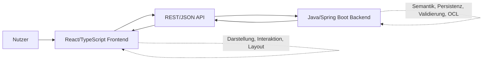
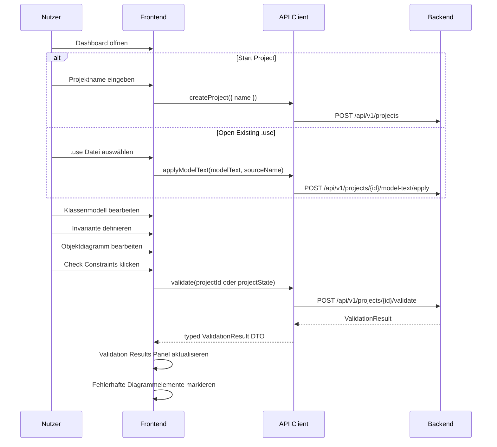

# Frontend Scope

## Zweck dieser Datei

Diese Datei definiert den fachlichen und technischen Scope des neuen React/TypeScript-Frontends für das webbasierte UML/OCL-System.

Sie beschreibt:

- welche Aufgaben das Frontend übernimmt,
- welche Aufgaben bewusst nicht im Frontend liegen,
- welche UI-Funktionen im MVP enthalten sein müssen,
- welche Funktionen später erweitert werden können,
- wie das Frontend vom Backend abgegrenzt ist,
- wie die Ziel-Screenshots den Frontend-Scope prägen,
- welche Rolle das originale USE-Projekt als fachliche Referenz spielt.

Das Frontend ist keine Migration der alten USE-Desktop-GUI. Es ist eine neue Weboberfläche, die zentrale fachliche Konzepte von USE modern und browserbasiert nutzbar macht.

## Rolle des Frontends im Zielsystem

Das Frontend ist die interaktive Arbeitsoberfläche für Modellierung, Navigation, Bearbeitung und Ergebnisdarstellung.

Es ermöglicht Nutzern:

1. Projekte zu öffnen, zu bearbeiten und zu speichern.
2. UML-Klassendiagramme visuell zu modellieren.
3. UML-Objektdiagramme und Snapshots visuell zu modellieren.
4. OCL-Invarianten zu erfassen und zu bearbeiten.
5. Constraints über das Backend prüfen zu lassen.
6. Validation Results textuell und visuell zu verstehen.
7. Diagramm-Layout und Selektion intuitiv zu steuern.

Das Frontend ist dabei für Darstellung, Interaktion und Layout zuständig. Die fachliche Modellsemantik, vollständige OCL-Verarbeitung und Constraint-Validierung liegen im Backend.

## Frontend-Verantwortlichkeiten

| Bereich | Frontend-Verantwortung | MVP-Relevanz | Screenshot-Bezug |
|---|---|---:|---|
| Dashboard / Start Page | Einstieg mit `Start Project`, Projektnamenerfassung, `Open Existing`, Recent Projects und Support-Links anzeigen. | Hoch | `00-dashboard-start-page.png`, `18-create-new-projects.png` |
| Open Existing Project Modal | Lokale `.use` Datei auswählen oder per Drag & Drop annehmen, Dateiformat prüfen und Dateiinhalt an den Backend-Modelltext-Apply-Flow senden. | Hoch/Should | `14-open-existing-project.png` |
| All Projects / Projektliste | `View all` aus dem Dashboard öffnet eine Projektliste mit Suche, Filtereinstieg, Projektkarten, `Open` und `+ New Project`. | Should | `19-projects.png` |
| Projektansicht | Aktuelles Projekt anzeigen, Projektstatus sichtbar machen, Save/Refresh-Aktionen anbieten. | Hoch | `01`, `06`, `07` |
| Top Bar | Globale Navigation, Projektname, Save/Refresh Icons, `Check Constraints` Button. | Hoch | `01-class-diagram-class-properties.png`, `07-object-diagram-validation-error.png` |
| Navigation Tabs | Wechsel zwischen `Class Diagram`, `Object Diagram` und `OCL Editor`. | Hoch | `01`, `06`, `07` |
| Explorer Sidebar | Klassen, Assoziationen, Invarianten, Objekte und Objektlinks strukturiert anzeigen. | Hoch | `01`, `02`, `03`, `06`, `12` |
| Diagram Canvas | Klassenkarten, Objektkarten, Associations und Links visuell darstellen und selektierbar machen. | Hoch | `01`, `02`, `04`, `06`, `07`, `12` |
| Properties Panel | Eigenschaften des selektierten Elements anzeigen und bearbeiten. | Hoch | `01`, `02`, `03`, `06`, `12` |
| Modale Dialoge | Fokussierte Create-Flows für Projektstart, Klassen, Invarianten, Klassen-Assoziationen und Objekt-Assoziationen. | Hoch | `18`, `08`, `09`, `10`, `11` |
| OCL Editor View | Textuellen USE-/OCL-Modelltext in einer eigenen Hauptansicht anzeigen, bearbeiten, über `Apply Changes` übernehmen und Backend-Diagnostics darstellen. | Hoch | `03`, `09`, `13` |
| Console | Aktionen, Save-/Load-Status und Validierungsläufe protokollieren. | Mittel | `01`, `06`, `07` |
| Validation Results Panel | Strukturierte Fehler, Warnungen und Details aus Backend-Ergebnissen anzeigen. | Hoch | `07` |
| Fehlerdarstellung | Fehlerhafte Objekte, Links oder Invarianten visuell markieren. | Hoch | `07-object-diagram-validation-error.png` |
| API Client | REST-Endpunkte kapseln, DTOs laden/senden, Fehlerformate verarbeiten. | Hoch | Abgeleitet |
| DTO Mapping | Backend-DTOs in frontendnahen View State überführen. | Hoch | Abgeleitet |
| State Management | Projektzustand, Selektion, offene Panels, Modals, Layout und Validation Results verwalten. | Hoch | Alle Screenshots |
| Diagramm-Layout | Node-Positionen, Canvas-Zustand und Layoutdaten pflegen und speichern. | Hoch | `01`, `04`, `06`, `07` |

## Nicht-Verantwortlichkeiten des Frontends

| Nicht-Verantwortung | Begründung | Zuständig |
|---|---|---|
| Vollständige UML-Validierung | Strukturregeln müssen zentral und reproduzierbar geprüft werden. | Backend Validation Service |
| Vollständige OCL-Validierung | OCL benötigt Lexer, Parser, AST, Typechecker und Evaluator. | Backend OCL Engine |
| OCL-Invariantenauswertung | Evaluation hängt vom Snapshot und fachlicher Semantik ab. | Backend OCL Evaluator |
| Multiplicity Checks als fachliche Wahrheit | Frontend kann Hinweise anzeigen, aber nicht verbindlich validieren. | Backend Validation Service |
| Backend-Persistenz | Speicherung und Projektformat werden serverseitig verantwortet. | Backend Project/Persistence Service |
| Direkte Verwendung des USE-Cores | Das neue System darf keine Runtime-Abhängigkeit zum Originalprojekt haben. | Nicht vorgesehen |
| Migration der alten USE-GUI | Die Weboberfläche ist neu konzipiert. | Nicht vorgesehen |
| Sequenzdiagramme | Nicht Teil des Zielumfangs. | Nicht vorgesehen |
| State Machines | Nicht Teil des Zielumfangs. | Nicht vorgesehen |
| Aktivitätsdiagramme | Nicht Teil des Zielumfangs. | Nicht vorgesehen |
| Deployment-/Komponentendiagramme | Nicht Teil des Zielumfangs. | Nicht vorgesehen |
| Vollständige Modellanimation | Nicht im MVP. | Post-MVP oder Nicht-Ziel |

Das Frontend darf einfache UI-Vorvalidierungen durchführen, zum Beispiel Pflichtfelder, leere Namen, ungültige primitive Typauswahl oder offensichtlich fehlende Formulareingaben. Diese Prüfungen ersetzen keine Backend-Validierung.

## MVP-Scope des Frontends

Der MVP muss einen vollständigen vertikalen Arbeitsablauf abbilden: Klassendiagramm erstellen, Invarianten definieren, Objektdiagramm aufbauen, Constraints prüfen und Fehler verstehen.

| MVP-Bereich | Muss im MVP enthalten sein | Hinweise |
|---|---|---|
| Dashboard | Startseite mit `Start Project`, Projektnamenerfassung und sichtbarer `Open Existing` Option. | `Start Project` öffnet `CreateNewProjectModal` aus `18-create-new-projects.png`; `Open Existing` öffnet den Dialog aus `14-open-existing-project.png`. |
| All Projects | Vollständige Projektliste über `View all` anzeigen und Projekte daraus öffnen. | Should; `19-projects.png` zeigt Suche, Filter, `Open`, `+ New Project` und Projektkarten. |
| Lokaler `.use` Einstieg | `.use` Datei lokal auswählen/drop und als Modelltext an Backend senden. | Vollständige USE-Kompatibilität ist nicht MVP; Diagnostics müssen sichtbar sein. |
| Projekt laden/speichern | Projektzustand über API laden und speichern oder JSON importieren/exportieren. | Frontend zeigt Save-/Loading-Zustände. |
| Class Diagram View | Klassen, Attribute, Operationen, Associations und Invarianten sichtbar machen. | Zentrale Sicht aus `01`, `02`, `03`, `04`. |
| Klasse erstellen | Modal oder UI-Aktion für neue UML-Klasse. | `08-modal-add-class.png` |
| Klasseneigenschaften bearbeiten | Name, Attribute und Operationen als Signaturen bearbeiten. | `01-class-diagram-class-properties.png` |
| Association erstellen | Zwei Klassen verbinden, Rollen und Multiplizitäten erfassen oder nachbearbeiten. | `10-modal-add-class-association.png`, `02` |
| Invariante erstellen | Kontextklasse, Name und OCL Expression erfassen. | `09-modal-add-invariant.png` |
| OCL Editor View | Textuellen Modell-/OCL-Editor mit Zeilennummern, `Apply Changes`, Console und Validation-Anbindung darstellen. | Screenshot `13-ocl-editor.png`. |
| Object Diagram View | Objekte, Slots und Objektlinks darstellen. | `06`, `12` |
| Objekt erstellen/bearbeiten | Objektname, Klasse und Attributwerte bearbeiten. | `06-object-diagram-object-properties.png` |
| Objektlink erstellen | Link zwischen Objektinstanzen über Association erzeugen. | `11-modal-add-object-association.png` |
| Properties Panel | Kontextsensitiv für Klasse, Association, Invariante, Objekt und Objektlink. | `01`, `02`, `03`, `06`, `12` |
| Explorer Sidebar | Modell- und Snapshot-Elemente navigierbar anzeigen. | Alle Hauptscreenshots |
| Check Constraints | Button sendet Projektzustand oder Projekt-ID an Backend. | `07` |
| Validation Results | Backend-Ergebnisse mit Severity, Code, Message und Elementbezug anzeigen. | `07-object-diagram-validation-error.png` |
| Visuelle Fehlerdarstellung | Fehlerhafte Objekte/Links/Invarianten im Diagramm markieren. | Roter Rahmen und Badge in `07` |
| API Client | REST/JSON-Kommunikation mit Backend kapseln. | Muss typed DTOs nutzen. |
| Layoutspeicherung | Node-Positionen und relevante Diagramm-Layoutdaten speichern. | Wichtig für wiederholbares Arbeiten. |

### MVP-Workflow

## Post-MVP-Erweiterungen

| Erweiterung | Beschreibung | Abhängigkeit |
|---|---|---|
| OCL Syntax Highlighting | Hervorhebung von Keywords, Literalen, Navigation und Fehlerstellen. | OCL Editor, optional Backend Diagnostics |
| OCL Autocomplete | Vorschläge für `self`, Attribute, Rollen und Operationen. | Backend Type Info oder Frontend Model Index |
| Live Syntax Check | OCL-Ausdrücke während der Eingabe gegen Backend prüfen. | OCL Parse Endpoint |
| Live Typecheck | Kontextabhängige OCL-Typprüfung während Bearbeitung. | OCL Typecheck Endpoint |
| Undo/Redo | Bearbeitungsschritte rückgängig machen. | State Management Architektur |
| Mehrere Snapshots | Mehrere Objektzustände pro Projekt verwalten. | Backend Project Model |
| Projektversionierung | Historie und Versionsvergleich. | Backend Persistence |
| Erweiterte Projektliste | Serverseitige Suche, Filter, Sortierung, Pagination und Projekt-Thumbnails. | Project Service / API |
| Erweiterte Diagrammtools | Auto Layout, Gruppierung, Mini Map, Zoom Presets. | Diagrammbibliothek |
| `.use` Import/Export UI | Import- und Exportdialoge für USE-Syntax. | Backend Import/Export |
| Erweiterte OCL-Features | `forAll`, `exists`, `select`, `collect`, `let`, `if`. | Backend OCL Engine |
| Vererbung und Enumerationen | UI für Generalisierung, Enum-Typen und erweiterte Typauswahl. | Backend Domain Model |
| Kollaboration | Gleichzeitiges Bearbeiten durch mehrere Nutzer. | Backend/WebSocket/Auth |

## Abgrenzung zum Backend

| Thema | Frontend | Backend |
|---|---|---|
| Projektzustand | Darstellen, bearbeiten, temporär halten, an API senden. | Persistieren, laden, validieren, versionieren. |
| UML-Modell | UI für Klassen, Attribute, Operationen und Associations. | Fachliche Strukturregeln und Modellsemantik. |
| Object Model | UI für Objekte, Slots und Links. | Snapshot-Semantik, Linkvalidierung, Slot-Typprüfung. |
| OCL | Eingabe, Anzeige, einfache UI-Diagnostics. | Lexer, Parser, AST, Typechecker, Evaluator. |
| Constraint Check | Button, Loading State, Ergebnisanzeige. | Vollständige Validierung. |
| Validation Results | Darstellung, Filterung, Fokus auf Diagrammelemente. | Erzeugung strukturierter Fehler und Warnungen. |
| Diagramm-Layout | Node-Positionen, Canvas-Zustand, Selektion. | Speichern/Laden von Layoutdaten als Projektbestandteil. |
| DTOs | TypeScript-Typen und Mapping in View Models. | JSON Contracts und Domain-to-DTO Mapping. |
| Fehlerbehandlung | User-facing Darstellung und UI-Mapping. | Error Codes, Severity, technische Details, Elementreferenzen. |

### Grundregel

Das Frontend darf den Backend-Zustand nicht stillschweigend fachlich anders interpretieren. Wenn Frontend und Backend unterschiedliche Einschätzungen haben, gilt das Backend als fachliche Quelle.

## Abgrenzung zum originalen USE-Projekt

Das originale USE-Projekt bleibt fachliche Referenz, aber keine technische Frontend-Grundlage.

| USE-Aspekt | Relevanz für Frontend | Nutzung |
|---|---|---|
| Klassendiagramm-Konzepte | Hoch | Fachliche Orientierung für Klassen, Attribute, Operationen, Associations. |
| Objektdiagramm-/Snapshot-Konzepte | Hoch | Orientierung für Objekte, Links und Objektzustände. |
| OCL-Invarianten | Hoch | UI muss Kontextklasse, Namen und Ausdruck abbilden können. |
| Validierungsergebnisse | Hoch | Referenz für Fehlertypen, aber neues UI-Format. |
| Alte Desktop-GUI | Niedrig bis mittel | Nur als historische Orientierung; keine direkte Migration. |
| USE-Core | Keine technische Nutzung | Nicht als Dependency verwenden. |
| Sequenzdiagramme/State Machines | Nicht relevant | Nicht in den Frontend-Scope aufnehmen. |
| Beispielmodelle | Mittel bis hoch | Nützlich für Demo-, Test- und Akzeptanzszenarien. |

## Screenshot-basierte Scope-Ableitung

Die Screenshots unter `use-web-analysis/assets/screenshots/` bilden das Zielbild für den MVP. Sie werden in den Analyse-Dateien über die normalisierten Pfade `assets/screenshots/*.png` referenziert.

| Screenshot | Sichtbarer Scope | Abgeleitete Frontend-Anforderungen |
|---|---|---|
| `01-class-diagram-class-properties.png` | Class Diagram, Explorer, Properties Panel für Klasse, Bottom Panel. | Klassen selektieren, Attribute/Operationen anzeigen, Properties synchronisieren. |
| `02-class-diagram-association-properties.png` | Association im Klassendiagramm mit Properties Panel. | Edges selektieren, Rollen/Multiplizitäten/Association-Daten bearbeiten. |
| `03-class-diagram-invariant-properties.png` | Invariante im Klassendiagramm und Properties Panel. | Invarianten anzeigen, selektieren und OCL-Ausdruck bearbeiten. |
| `04-class-diagram-new-class-selected.png` | Neue Klasse im Diagramm selektiert. | Create-Flow erzeugt direkt sichtbare und selektierte Klasse. |
| `06-object-diagram-object-properties.png` | Object Diagram mit Objekt-Properties. | Objekte, Typen und Slots anzeigen und bearbeiten. |
| `07-object-diagram-validation-error.png` | Object Diagram mit rotem Fehlerrahmen und Validation Results. | Backend-Fehler visuell und textuell mappen. |
| `08-modal-add-class.png` | Add Class Modal. | Fokussierter Dialog für Klassenname, Attribute und Operationen. |
| `09-modal-add-invariant.png` | Add Invariant Modal. | Kontextklasse, Name und OCL Expression erfassen. |
| `10-modal-add-class-association.png` | Add Class Association Modal. | Association zwischen Klassen erstellen; Rollen/Multiplizitäten klären. |
| `11-modal-add-object-association.png` | Add Object Association Modal. | Objektlink zwischen Objektinstanzen erstellen. |
| `12-object-diagram-association-properties.png` | Objektlink mit Properties Panel. | Links selektieren, Association-Bezug anzeigen und bearbeiten. |
| `19-projects.png` | All-Projects-Seite. | `View all` führt zu Projektliste mit Suche, Filter, Projektkarten, `Open` und `+ New Project`. |

### Screenshot-Annahmen

| Annahme | Begründung |
|---|---|
| Screenshots sind funktionale Referenzen, keine pixelgenaue Spezifikation. | Die Dokumentation soll Anforderungen und Komponenten ableiten, nicht ein starres Layout kopieren. |
| Explorer, Canvas und Properties Panel bleiben synchron. | Alle relevanten Screenshots zeigen Selektion mit Detailanzeige. |
| `Check Constraints` ist eine globale Aktion. | Fehler-Screenshot zeigt Validierung als zentralen Workflow. |
| Modals dienen Create-Flows, Properties Panels dienen Detailbearbeitung. | Screenshots trennen Erstellen und Bearbeiten sichtbar. |
| Layoutdaten müssen speicherbar sein. | Diagramme zeigen platzierte Nodes/Edges, deren Positionen für Projektarbeit relevant sind. |

## Scope-Entscheidungen

| Entscheidung | Begründung | Konsequenz |
|---|---|---|
| React/TypeScript als Frontend-Basis | Passt zu moderner Weboberfläche, typed DTOs und Komponentenstruktur. | Frontend-Repository nutzt TypeScript konsequent. |
| Backend-validierte Semantik | OCL und Constraint Validation sind fachlich komplex. | Frontend zeigt Ergebnisse, berechnet sie aber nicht verbindlich. |
| Eigener Frontend-State getrennt von DTOs | UI braucht Selektion, Modals, Layout und Loading States zusätzlich zu Backend-Daten. | DTO Mapping wird eigener Architekturbaustein. |
| Diagrammbibliothek offen, aber zentral | Canvas ist Kern des Produkts. | Separate Entscheidung in `06-diagram-library-decision.md`. |
| MVP mit Class/Object/OCL/Validation als vertikalem Durchstich | Der Wert entsteht erst durch den gesamten Ablauf. | Keine isolierte reine Diagramm-Demo als MVP. |
| Screenshots als Scope-Quelle | Zielbilder zeigen Nutzerflows und Komponenten. | Anforderungen müssen auf Screenshots rückführbar sein. |
| Keine USE-GUI-Migration | Alte Desktop-GUI passt nicht zur Webarchitektur. | UI wird neu entworfen und nur fachlich inspiriert. |
| Keine verhaltensorientierten Diagramme | Projektfokus liegt auf Klassen, Objekten, Snapshots und Invarianten. | Sequenzdiagramme, State Machines und Aktivitätsdiagramme bleiben außerhalb. |

## Offene Fragen

| Frage | Bedeutung |
|---|---|
| Welche Diagrammbibliothek wird verwendet? | Beeinflusst Custom Nodes, Edges, Layoutspeicherung, Performance und Testbarkeit. |
| Werden Multiplizitäten bereits im Add-Association-Modal oder erst im Properties Panel gepflegt? | Betrifft MVP-Flow und Validierungsnähe. |
| Gibt es ein eigenes Add-Object-Modal? | Screenshots zeigen Objektbearbeitung, aber keinen klaren Objekt-Erstellungsdialog. |
| Wird OCL beim Speichern einer Invariante sofort geparst oder erst bei `Check Constraints`? | Betrifft API-Nutzung, UX und Fehlerfeedback. |
| Sendet `Check Constraints` den vollständigen Projektzustand oder nur eine Projekt-ID? | Betrifft Offline-/Draft-Verhalten und Backend-Vertrag. |
| Sind Suche und Filter der All-Projects-Seite im MVP clientseitig oder serverseitig? | Beeinflusst API-Client, Project-List-Query und Scope von `GET /api/v1/projects`. |
| Werden Console-Einträge persistiert oder nur lokal angezeigt? | Betrifft Projektformat und UX-Erwartung. |
| Wie stark soll das Frontend bei Fehlern automatisch navigieren und fokussieren? | Betrifft Interaktion zwischen Validation Results und Diagram Canvas. |
| Müssen weitere Screenshots in den Scope aufgenommen werden? | Betrifft Dokumentationskonsistenz und spätere Traceability. |

## Zusammenfassung

Das React/TypeScript-Frontend verantwortet die moderne Weboberfläche für UML/OCL-Modellierung: Dashboard, Projektliste, Projektansicht, Klassendiagramm, Objektdiagramm, OCL Editor, Explorer, Canvas, Properties Panel, Modals, Console, Validation Results, API Client, DTO Mapping, State Management, Diagramm-Layout und visuelle Fehlerdarstellung.

Der MVP muss den vollständigen Workflow von Klassenmodell über Invarianten und Snapshot bis zum Backend-basierten Constraint Check abbilden. Besonders wichtig ist das Mapping strukturierter Backend-Fehler auf Diagrammelemente und das Validation Results Panel.

Nicht im Frontend-Scope liegen vollständige UML-/OCL-Validierung, Backend-Persistenz, direkte USE-Core-Nutzung, Migration der alten USE-GUI sowie Sequenzdiagramme, State Machines und Aktivitätsdiagramme. Das originale USE-Projekt bleibt fachliche Referenz; die neuen Screenshots sind die wichtigste visuelle Grundlage für Komponenten, User Journey und MVP-Abgrenzung.
