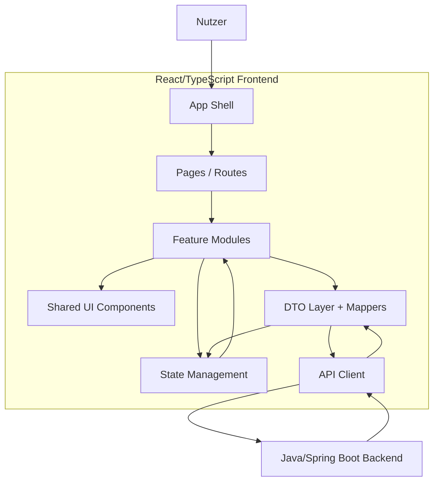
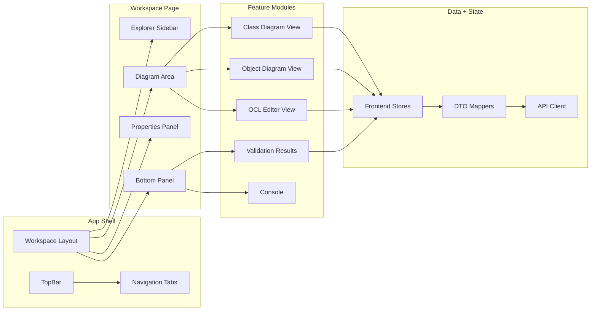
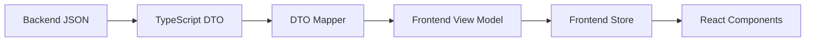
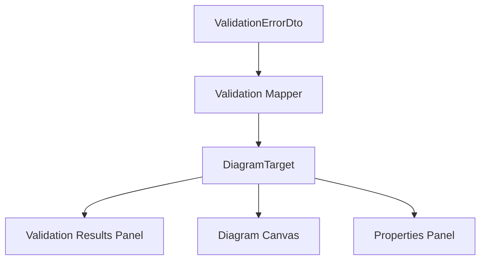
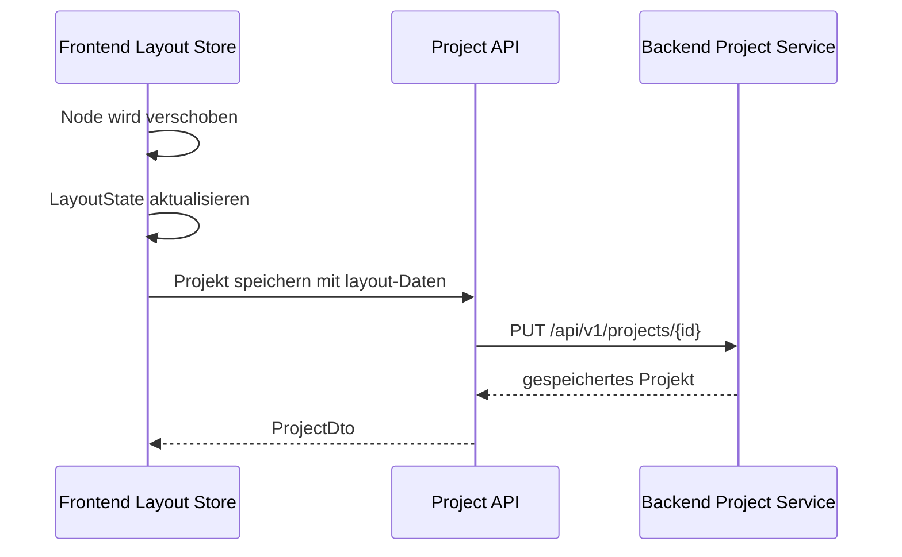
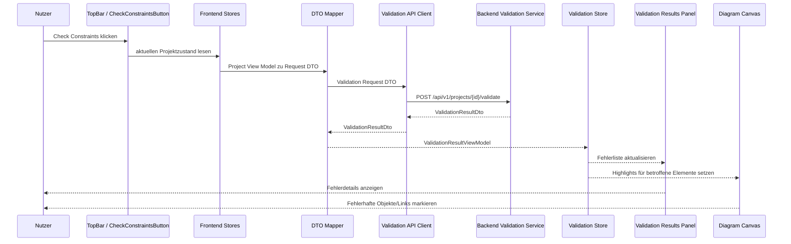

# Frontend Architecture

## Zweck dieser Datei

Diese Datei beschreibt die Zielarchitektur des neuen React/TypeScript-Frontends für das webbasierte UML/OCL-System.

Sie erklärt:

- welche Architekturschichten das Frontend besitzt,
- wie App Shell, Routing, Layout, Pages, Feature-Module, Komponenten, API Client, DTO Layer und State Management zusammenspielen,
- wie das Frontend mit dem Java/Spring-Boot-Backend über REST/JSON kommuniziert,
- wie Projektzustand, Diagrammzustand, UI-Zustand, Selektion und Validierungsergebnisse verwaltet werden,
- wie Backend-Fehler auf UI-Elemente gemappt werden,
- wie die Architektur für spätere UML- und OCL-Erweiterungen offen bleibt.

Das Frontend übernimmt Darstellung, Interaktion und Layout. Die fachliche Semantik, vollständige OCL-Verarbeitung und verbindliche Constraint-Validierung liegen im Backend.

## Architekturziele

| Ziel | Bedeutung |
|---|---|
| Klare Trennung von UI und Fachsemantik | Das Frontend zeigt und bearbeitet Modelle, validiert sie aber nicht vollständig selbst. |
| Stabile REST/JSON-Anbindung | API Client und DTO Layer kapseln den Backend-Vertrag. |
| Diagrammzentrierte Arbeitsoberfläche | Class Diagram View und Object Diagram View sind Kernbereiche der Anwendung. |
| Synchronisierte Selektion | Explorer, Canvas und Properties Panel zeigen konsistent dasselbe ausgewählte Element. |
| Strukturierte Validierungsverarbeitung | Backend-Fehler werden in Validation Results und Diagramm-Markierungen übersetzt. |
| Speicherbares Layout | Node-Positionen, Canvas-Zustand und relevante Layoutdaten bleiben projektbezogen verfügbar. |
| Erweiterbarkeit | OCL Editor, Diagrammtypen, UML-Features und Validation UI können schrittweise wachsen. |
| Testbarkeit | Komponenten, Mapper, Stores und API Client bleiben isoliert testbar. |

## Architekturprinzipien

| Prinzip | Konsequenz |
|---|---|
| Backend ist fachliche Wahrheit | Frontend übernimmt keine vollständige UML-/OCL-Validierung. |
| DTOs sind nicht View Models | API-Daten werden in frontendnahe Modelle gemappt. |
| Feature-Module kapseln Fach-UI | Class Diagram, Object Diagram, OCL Editor und Validation bleiben eigene Bereiche. |
| UI State ist explizit | Selektion, Modals, Panelzustand, Zoom, Pan und Loading werden nicht in DTOs versteckt. |
| Validierungsfehler sind referenzierbar | Fehler müssen `elementType`, `elementId`, Invariant-ID oder OCL-Position auf UI-Ziele abbilden. |
| Layout ist keine Fachsemantik | Diagrammpositionen sind wichtig für die Weboberfläche, aber getrennt vom UML-/Snapshot-Modell. |
| Screenshots sind funktionale Referenzen | Sie prägen Struktur und User Journey, sind aber keine pixelgenaue Spezifikation. |

## Schichtenmodell



| Schicht | Zweck | Typische Dateien/Module |
|---|---|---|
| App Shell | Globale Provider, App Layout, Routing-Anbindung. | `src/app/App.tsx`, `AppProviders.tsx`, `AppLayout.tsx` |
| Pages | Route-nahe Container. | `WorkspacePage`, `ProjectOpenPage` |
| Feature Modules | Fachliche UI-Bereiche. | `class-diagram`, `object-diagram`, `ocl-editor`, `validation` |
| Shared Components | Generische UI-Bausteine. | Buttons, Dialogs, Tabs, Panels, Inputs |
| State Management | Project, Layout, Selection, Validation und UI State. | `projectStore`, `layoutStore`, `selectionStore` |
| DTO Layer | Backend-DTOs und Mapper. | `project.dto.ts`, `validationMapper.ts` |
| API Client | REST/JSON-Kommunikation. | `projectApi.ts`, `validationApi.ts`, `httpClient.ts` |

## Komponentenübersicht



| Komponente | Verantwortung | MVP |
|---|---|---|
| `AppShell` | Provider, Routing, globale Fehlergrenzen, App-Grundlayout. | Ja |
| `TopBar` | Projektname, Save/Refresh, `Check Constraints`, globale Aktionen. | Ja |
| `NavigationTabs` | Wechsel zwischen Class Diagram, Object Diagram und OCL Editor. | Ja |
| `WorkspaceLayout` | Explorer, Canvas, Properties Panel und Bottom Panel anordnen. | Ja |
| `ExplorerSidebar` | Modell- und Snapshot-Elemente navigierbar anzeigen. | Ja |
| `ClassDiagramView` | Klassen, Associations und Invarianten visualisieren und bearbeiten. | Ja |
| `ObjectDiagramView` | Objekte, Slots und Objektlinks visualisieren und bearbeiten. | Ja |
| `OclEditorView` | Invarianten und OCL-Ausdrücke bearbeiten. | Ja |
| `PropertiesPanel` | Selektionstypabhängige Detailbearbeitung. | Ja |
| `ValidationResultsPanel` | Backend-ValidationResult anzeigen und Fehler auswählbar machen. | Ja |
| `ConsolePanel` | Aktionen und Statusmeldungen anzeigen. | Sollte |
| `ApiClient` | REST/JSON-Endpunkte kapseln. | Ja |
| `DtoMappers` | Backend-DTOs in View Models übersetzen. | Ja |
| `Stores` | Projekt-, Layout-, Selection-, Validation- und UI-State verwalten. | Ja |

## App Shell

Die App Shell ist der Rahmen der Anwendung.

Sie enthält:

- globale Provider für API, Query Cache und State,
- Routing,
- App-weite Error Boundaries,
- globale Tastatur- und Fokuslogik, falls nötig,
- das Hauptlayout mit Top Bar und Workspace.

Empfohlene Struktur:

```text
src/app/
├─ App.tsx
├─ AppProviders.tsx
├─ AppRoutes.tsx
├─ AppLayout.tsx
└─ navigation.ts
```

Die App Shell darf keine fachliche UML-/OCL-Logik enthalten. Sie orchestriert nur die Anwendung.

## Routing

Der MVP kann mit wenigen Routen starten.

| Route | Zweck | MVP |
|---|---|---|
| `/` | Weiterleitung zum aktuellen oder neuen Projekt. | Ja |
| `/projects/:projectId` | Hauptarbeitsbereich für ein Projekt. | Ja |
| `/projects/:projectId/class-diagram` | Optional explizite Route für Klassendiagramm. | Should |
| `/projects/:projectId/object-diagram` | Optional explizite Route für Objektdiagramm. | Should |
| `/projects/:projectId/ocl` | Explizite Route für OCL Editor. | Ja |
| `/import` | Später Import-Workflow. | Post-MVP |

Für den MVP reicht eine `WorkspacePage`, deren aktiver Tab im UI State oder Query Parameter liegt.

Beispiel:

```text
/projects/library-demo?view=object-diagram
```

## Feature-Module

Die Feature-Module kapseln fachliche UI.

| Feature | Verantwortung | Wichtige States |
|---|---|---|
| `project` | Projekt laden, speichern, Dirty State anzeigen. | Project Data, Async State |
| `class-diagram` | Klassen, Attribute, Operationen, Associations, Invarianten darstellen. | Diagram State, Selection State, Layout State |
| `object-diagram` | Objekte, Slots und Objektlinks darstellen. | Diagram State, Selection State, Layout State, Validation State |
| `ocl-editor` | Invarianten und OCL-Ausdrücke bearbeiten. | Editor State, Project Data, Diagnostics |
| `explorer` | Modell-/Snapshot-Baum anzeigen. | Project Data, Selection State |
| `properties-panel` | Selektiertes Element bearbeiten. | Selection State, Project Data |
| `validation` | Validation Results anzeigen und auf UI-Ziele mappen. | Validation State, Selection State |
| `console` | Status- und Aktionsmeldungen anzeigen. | Console/UI State |

### Feature-Kommunikation

Feature-Module kommunizieren nicht direkt über gegenseitige Imports von internen Komponenten. Gemeinsame Kommunikation läuft über:

- zentrale Stores,
- typed Actions/Commands,
- gemeinsame View-Model-Typen,
- API Services,
- explizite Callback Props bei lokaler Komposition.

## API Client

Der API Client kapselt alle REST/JSON-Aufrufe.

```text
src/api/
├─ client/
│  ├─ httpClient.ts
│  └─ apiError.ts
├─ services/
│  ├─ projectApi.ts
│  ├─ umlModelApi.ts
│  ├─ objectModelApi.ts
│  ├─ oclApi.ts
│  └─ validationApi.ts
└─ dtos/
```

| API Service | Aufgabe |
|---|---|
| `projectApi` | Projekte anlegen, laden, speichern, importieren/exportieren. |
| `umlModelApi` | Klassen, Attribute, Operationen, Associations und Invarianten senden oder aktualisieren. |
| `objectModelApi` | Objekte, Slots und Objektlinks senden oder aktualisieren. |
| `oclApi` | OCL parse/typecheck/evaluate Endpunkte, sofern im Frontend genutzt. |
| `validationApi` | `Check Constraints` auslösen und `ValidationResultDto` empfangen. |

Der API Client gibt keine rohen `fetch`-Responses an Komponenten weiter. Komponenten arbeiten mit typed DTOs, View Models oder Store Actions.

## DTO Mapping

Backend-DTOs werden nicht direkt als UI-State verwendet.



| Mapping | Zweck |
|---|---|
| `ProjectDto -> ProjectViewModel` | Projekt und Modell in UI-freundliche Strukturen überführen. |
| `UmlModelDto -> ClassDiagramModel` | Klassen und Associations für Canvas und Explorer aufbereiten. |
| `ObjectModelDto -> ObjectDiagramModel` | Objekte, Slots und Links für Snapshot-UI aufbereiten. |
| `ValidationResultDto -> ValidationViewModel` | Fehler für Panel, Badges und Diagramm-Highlights mappen. |
| `LayoutDto -> DiagramLayoutState` | Positionen, Zoom und Panelzustände verfügbar machen. |

Diese Trennung schützt das Frontend vor Backend-internen Änderungen und verhindert, dass UI-Zustände unkontrolliert ins API-Modell rutschen.

## State Management

Der Frontend-State wird in mehrere Bereiche getrennt.

| State | Inhalt | Quelle | Persistenz |
|---|---|---|---|
| Project State | Projekt, UML-Modell, Object Model, Invarianten. | API/DTO Mapper | Backend/JSON |
| Diagram State | Nodes, Edges, Canvas-Modus, Drag-Zustand. | View Models + UI | Teilweise lokal |
| Layout State | Node-Positionen, Zoom, Pan, Panelgrößen. | UI | Projektformat oder lokal |
| Selection State | Aktuell selektiertes Element. | Explorer/Canvas/Panel | Lokal |
| Validation State | Letztes ValidationResult, Fehlerauswahl, Filter. | Backend Validation API | Lokal, optional Projekt |
| UI State | Aktive Tabs, offene Modals, Loading, Dirty Flags. | UI | Lokal |
| Editor State | ausgewählte Invariante, OCL-Draft, Cursor, Diagnostics, Parse-/Typecheck-Status. | UI + API | Lokal/Projekt |

Empfohlene technische Aufteilung:

- TanStack Query oder vergleichbare Lösung für Server State und API Cache.
- Zustand oder Redux Toolkit für UI-, Diagramm-, Selection- und Layout-State.
- Lokale Component State für einfache Formularzustände in Modals.

## Diagram State

Diagram State ist getrennt vom fachlichen Projektmodell.

| Diagram State | Beschreibung |
|---|---|
| `nodes` | Sichtbare Klassen- oder Objektkarten. |
| `edges` | Sichtbare Associations oder Objektlinks. |
| `selectedElement` | Aktuell selektierte Node, Edge oder Invariante. |
| `dragState` | Temporäre Drag-/Move-Interaktion. |
| `viewport` | Zoom, Pan und sichtbarer Bereich. |
| `layout` | Persistierbare Positionen und Dimensionen. |
| `highlightState` | Fehler-, Hover- und Fokuszustände. |

Beispiel:

```ts
export interface DiagramLayoutState {
  diagramId: string;
  viewport: {
    x: number;
    y: number;
    zoom: number;
  };
  nodes: Array<{
    elementId: string;
    x: number;
    y: number;
    width?: number;
    height?: number;
  }>;
}
```

### Class Diagram State

Der Class Diagram State enthält:

- Klassen-Nodes,
- Association-Edges,
- Invariant Badges oder Invariant-Elemente,
- Layoutpositionen,
- Auswahl von Klasse, Association oder Invariante.

Screenshots:

- `01-class-diagram-class-properties.png`
- `02-class-diagram-association-properties.png`
- `03-class-diagram-invariant-properties.png`
- `04-class-diagram-new-class-selected.png`

### Object Diagram State

Der Object Diagram State enthält:

- Objekt-Nodes,
- Objektlink-Edges,
- Slot-Anzeige,
- Fehler-Highlights,
- Layoutpositionen,
- Auswahl von Objekt oder Objektlink.

Screenshots:

- `06-object-diagram-object-properties.png`
- `07-object-diagram-validation-error.png`
- `11-modal-add-object-association.png`
- `12-object-diagram-association-properties.png`

## Validation State

Validation State speichert das letzte Ergebnis eines Constraint Checks und UI-Zustände zur Fehlernavigation.

```ts
export interface ValidationState {
  result: ValidationResultViewModel | null;
  selectedErrorId: string | null;
  filter: {
    severity?: "error" | "warning" | "info";
    elementType?: string;
  };
  isValidating: boolean;
}
```

| Bestandteil | Zweck |
|---|---|
| `result` | Aktuelles ValidationResult aus dem Backend. |
| `selectedErrorId` | Aktiver Fehler im Validation Results Panel. |
| `filter` | UI-Filter für Fehlerliste. |
| `isValidating` | Loading State für `Check Constraints`. |

Validation State darf nicht als fachliche Wahrheit interpretiert werden. Er ist die UI-Repräsentation des letzten Backend-Ergebnisses.

## Error Mapping

Error Mapping übersetzt Backend-Fehler in konkrete UI-Ziele.



| Backend-Feld | Frontend-Nutzung |
|---|---|
| `code` | Icon, Kategorie, Filter, technische Einordnung. |
| `severity` | Farbe, Priorität, Panel-Gruppierung. |
| `message` | User-facing Fehlertext. |
| `elementType` | Zieltyp: Klasse, Objekt, Link, Invariante, OCL-Ausdruck. |
| `elementId` | Konkretes UI-Element fokussieren oder markieren. |
| `invariantId` | Invariante im Explorer, OCL Editor oder Properties Panel markieren. |
| `contextClassId` | Kontextklasse im Klassendiagramm referenzieren. |
| `contextObjectId` | Objekt im Objektdiagramm markieren. |
| `sourceRange` | OCL-Fehler im Editor hervorheben. |

### Mapping-Beispiele

| Error Code | UI-Reaktion |
|---|---|
| `INVARIANT_VIOLATION` | Objekt rot markieren, Badge anzeigen, Fehler im Panel anzeigen. |
| `MULTIPLICITY_VIOLATION` | Betroffenen Link, Objekt oder Association-End hervorheben. |
| `SYNTAX_ERROR` | OCL-Ausdruck im Editor markieren und Fehlertext anzeigen. |
| `TYPE_ERROR` | Invariante und betroffenen Ausdrucksteil markieren. |
| `INVALID_SLOT_VALUE` | Objekt und Slot-Feld im Properties Panel markieren. |
| `INVALID_LINK` | Objektlink-Edge markieren. |

Der Screenshot `07-object-diagram-validation-error.png` zeigt den wichtigsten MVP-Fall: Ein Backend-Fehler wird als roter Rahmen im Objektdiagramm und als Eintrag im Validation Results Panel dargestellt.

## Layout Persistence

Layoutdaten gehören zur Benutzeroberfläche, müssen aber projektbezogen speicherbar sein.

| Layoutdaten | Zweck |
|---|---|
| Klassenpositionen | Klassendiagramm reproduzierbar öffnen. |
| Objektpositionen | Snapshot-Diagramm reproduzierbar öffnen. |
| Edge-Routing optional | Später besser lesbare Linienführung. |
| Viewport | Zoom/Pan wiederherstellen. |
| Panelgrößen optional | Arbeitsumgebung komfortabel wiederherstellen. |

Die Persistenz kann über das Backend-Projektformat erfolgen. Das Frontend erzeugt und bearbeitet Layoutdaten, das Backend speichert sie als Teil des Projekts, ohne sie fachlich zu interpretieren.



## Ablauf: Check Constraints



### Ablaufregeln

| Schritt | Frontend-Verhalten |
|---|---|
| Start | Button zeigt Loading State; doppelte Requests werden verhindert oder kontrolliert behandelt. |
| Request | Frontend sendet Projekt-ID oder vollständigen aktuellen Projektzustand. |
| Response | `ValidationResultDto` wird in View Model gemappt. |
| Speicherung | ValidationResult wird im Validation State abgelegt. |
| Panel | Validation Results Panel zeigt Errors/Warnings/Infos. |
| Diagramm | Betroffene Nodes/Edges/Invarianten werden markiert. |
| Fehlerklick | UI fokussiert Ziel im Explorer, Canvas oder OCL Editor. |
| API-Fehler | Netzwerk-/Serverfehler erscheinen getrennt von fachlichen Validation Errors. |

## Screenshot-Bezug

Die Screenshots liegen unter `use-web-analysis/assets/screenshots/*.png` und werden als funktionale Zielreferenz für Dashboard, Diagramm-Views, Properties Panel, Modals und Validation UI genutzt.

| Screenshot | Architekturbezug |
|---|---|
| `00-dashboard-start-page.png` | Dashboard Page, Start-/Import-/Recent-Project-Flows vor dem Projektworkspace. |
| `18-create-new-projects.png` | Create-New-Project-Dialog, `createProjectFormState`, `CreateProjectRequestDto.name`, Navigation nach erfolgreicher Projektanlage. |
| `01-class-diagram-class-properties.png` | App Shell, Class Diagram View, Explorer Sidebar, Properties Panel, Bottom Panel. |
| `02-class-diagram-association-properties.png` | Association Edge, Selection State, Association Properties Panel. |
| `03-class-diagram-invariant-properties.png` | Invariant Selection, OCL/Invariant Properties, OCL Editor-Anbindung. |
| `04-class-diagram-new-class-selected.png` | Create Flow, Layout State, Selection State nach Erstellung. |
| `06-object-diagram-object-properties.png` | Object Diagram View, Object Node, Slot-Anzeige, Object Properties Panel. |
| `07-object-diagram-validation-error.png` | Validation State, Error Mapping, Invalid Object Highlight, Validation Results Panel. |
| `08-modal-add-class.png` | Modal State, Class Create Flow, UI-Vorvalidierung. |
| `09-modal-add-invariant.png` | OCL Expression Input, Invariant DTO Mapping, optional OCL Diagnostics. |
| `10-modal-add-class-association.png` | Association Create Flow, Rollen/Multiplizitäten, Edge-Erstellung. |
| `11-modal-add-object-association.png` | Object Link Create Flow, Object Model API/State. |
| `12-object-diagram-association-properties.png` | Object Link Selection, Object Link Properties Panel. |
| `13-ocl-editor.png` | OCL Editor View als textbasierte Modell-/OCL-Hauptview mit Zeilennummern, `Apply Changes`, `Check Constraints`, Console, Save/Refresh und API-Anbindung. |
| `14-open-existing-project.png` | Dashboard-Import-Modal, lokale `.use` Datei, File Dropzone, Import State, Modelltext-Apply-API und Diagnostics Mapping. |

## Erweiterbarkeit

| Erweiterung | Architektur-Vorbereitung |
|---|---|
| OCL Syntax Highlighting | OCL Editor View kapselt Eingabe und Diagnostics. |
| OCL Autocomplete | DTO Mapper und Project State können Kontextinformationen liefern. |
| Live Parse/Typecheck | `oclApi` kann eigene Endpunkte kapseln. |
| `forAll`, `exists`, `select`, `collect` | Frontend muss nur Editor, Diagnostics und Ergebnisanzeige erweitern; Semantik bleibt Backend. |
| Vererbung | Class Diagram View kann neue Edge-/Node-Typen aufnehmen. |
| Enumerationen | Type Select und Explorer können neue Typkategorie ergänzen. |
| Mehrere Snapshots | Object Diagram Feature kann Snapshot Selector und Snapshot State ergänzen. |
| Undo/Redo | State Actions können historisiert werden. |
| `.use` Import/Export | Project Feature kann im MVP lokale `.use` Dateien als Modelltext an `model-text/apply` senden; vollständiger Import/Export bleibt Backend-Parser/Generator Post-MVP. |
| Diagrammbibliothek-Wechsel | Feature-Grenzen und Diagram State reduzieren Kopplung an konkrete Library. |

## Offene Fragen

| Frage | Bedeutung |
|---|---|
| Welche Diagrammbibliothek wird gewählt? | Beeinflusst Diagram State, Event Handling, Custom Nodes/Edges und Layout Persistence. |
| Wird `Check Constraints` mit Projekt-ID oder vollständigem Draft-State ausgeführt? | Beeinflusst API Request DTOs und Dirty-State-Verhalten. |
| Wird TanStack Query für Server State verwendet? | Beeinflusst API Cache, Loading/Error Handling und Store-Grenzen. |
| Wird Zustand oder Redux Toolkit für UI State verwendet? | Beeinflusst Undo/Redo, DevTools und Store-Struktur. |
| Wie detailliert sind Backend-Elementreferenzen in Validation Errors? | Bestimmt Qualität des Error Mapping. |
| Werden Layoutdaten sofort gespeichert oder nur beim expliziten Save? | Beeinflusst UX und API-Frequenz. |
| Soll ein Klick auf einen Validation Result automatisch den passenden Tab öffnen? | Wichtig für Fehlernavigation zwischen OCL Editor, Class Diagram und Object Diagram. |
| Werden OCL Diagnostics live oder nur nach Save/Check angezeigt? | Beeinflusst OCL Editor View und API-Nutzung. |

## Zusammenfassung

Die Frontend-Architektur trennt App Shell, Routing, Feature-Module, Shared Components, API Client, DTO Mapping und State Management klar voneinander.

Der MVP konzentriert sich auf den vollständigen Arbeitsfluss:

- Class Diagram modellieren,
- Object Diagram und Snapshot bearbeiten,
- OCL-Invarianten erfassen,
- `Check Constraints` ausführen,
- strukturierte Backend-Ergebnisse als Validation Results und Diagramm-Highlights darstellen.

Projektzustand, Diagrammzustand, UI State, Selection State, Validation State und Layoutdaten werden getrennt verwaltet. Dadurch bleibt das Frontend testbar, wartbar und offen für spätere UML-/OCL-Erweiterungen, ohne Backend-Semantik oder alte USE-GUI-Technik ins Frontend zu übernehmen.
