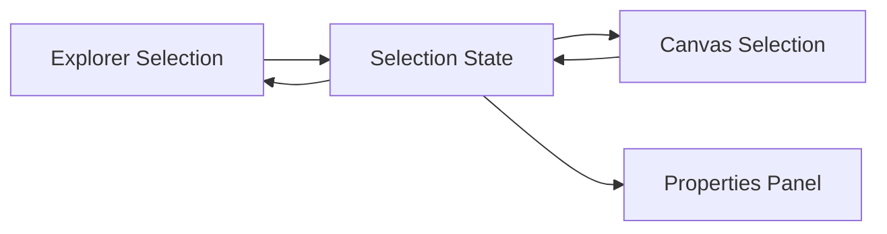

# Routing and Layout

## Zweck dieser Datei

Diese Datei beschreibt Routing und Layout der neuen React/TypeScript-Webanwendung für UML/OCL-Modellierung.

Sie legt fest:

- welche Layoutbereiche die App grundsätzlich besitzt,
- wie das Dashboard als Einstieg vor der Projektansicht funktioniert,
- welche Bereiche immer sichtbar sind,
- welche Bereiche je nach aktivem Tab wechseln,
- wie Class Diagram, Object Diagram und OCL Editor angeordnet werden,
- wie Explorer Sidebar, Diagram Canvas, Properties Panel, Bottom Panel und Quick Help zusammenspielen,
- wie Selektion das Properties Panel beeinflusst,
- wie Validation Results viewübergreifend sichtbar bleiben,
- welche technischen Routing-Optionen für den MVP geeignet sind.

Die Screenshots sind funktionale Layout-Referenzen und liegen unter `use-web-analysis/assets/screenshots/*.png`.

## Layout-Grundstruktur

Die Anwendung besitzt drei Layout-Ebenen:

| Ebene | Route | Zweck |
|---|---|---|
| Dashboard | `/` oder `/dashboard` | Projektstart, Open Existing, Recent Projects, Documentation und Examples. |
| Projektliste | `/projects` | Alle Projekte anzeigen, suchen, filtern, öffnen oder neues Projekt starten. |
| Projektworkspace | `/projects/:projectId/...` | Modellierung, Diagramme, OCL und Validierung. |

Das Dashboard steht vor der projektbezogenen App Shell.


Dashboard-Aktionen:

| Aktion | Ziel |
|---|---|
| `Start Project` | öffnet Create-New-Project-Dialog/Formular; nach gültigem Projektnamen `POST /api/v1/projects`, danach Navigation zu `/projects/{projectId}/class-diagram` |
| `Open Existing` | öffnet `OpenExistingProjectModal`; lokale `.use`-Datei wird ausgewählt und als Modelltext/Import verarbeitet |
| Recent Project | `GET /api/v1/projects/{projectId}`, danach Navigation zu `/projects/{projectId}/class-diagram` |
| `View all` | `/projects` mit All-Projects-Seite aus `19-projects.png` |
| `Documentation` | Dokumentationsseite oder externer/statischer Hilfeeintrag |
| `Examples` | Beispielprojektübersicht oder Demo-Projekt öffnen |

### All Projects Page

Die All-Projects-Seite ist eine projektverwaltende Ansicht vor dem Workspace. Sie nutzt keine Explorer-/Properties-/Bottom-Panels, sondern ein eigenes Listenlayout.

| Element | Verhalten |
|---|---|
| Zurück-Icon | führt zurück zu `/dashboard` oder `/`. |
| Suchfeld | filtert `ProjectSummaryDto[]` mindestens clientseitig. |
| `Filter` | öffnet später Filteroptionen; im MVP darf der Button sichtbar, aber einfach gehalten sein. |
| `Open` | öffnet ein ausgewähltes Projekt oder den Open-Existing-Flow. |
| `+ New Project` | öffnet denselben Create-New-Project-Dialog wie das Dashboard. |
| Projektkarte | lädt Projekt per `GET /api/v1/projects/{projectId}` und navigiert in den Workspace. |

### Projektworkspace

Das Hauptlayout ist ein dreigeteilter Arbeitsbereich unterhalb einer globalen Top Bar.

```text
┌──────────────────────────────────────────────────────────────────────────────┐
│ Top Bar: Projekt, Navigation Tabs, Save, Refresh, Check Constraints          │
├───────────────┬───────────────────────────────────────────────┬──────────────┤
│ Explorer      │ Main View                                      │ Properties  │
│ Sidebar       │ Class Diagram / Object Diagram / OCL Editor    │ Panel        │
│               │                                               │              │
├───────────────┴───────────────────────────────────────────────┴──────────────┤
│ Bottom Panel: Console | Validation Results                                   │
└──────────────────────────────────────────────────────────────────────────────┘
```


| Bereich | Sichtbarkeit | Zweck |
|---|---|---|
| Top Bar | Immer sichtbar | Projektkontext, Hauptnavigation, globale Aktionen. |
| Explorer Sidebar | In Diagramm- und OCL-Views sichtbar | Navigation durch Modell-/Snapshot-Elemente. |
| Main View | Immer sichtbar | Aktiver Arbeitsbereich: Class Diagram, Object Diagram oder OCL Editor. |
| Properties Panel | Sichtbar, aber Inhalt abhängig von Selektion | Detailbearbeitung des selektierten Elements. |
| Bottom Panel | Sichtbar oder minimierbar | Console und Validation Results. |
| Quick Help | Optional sichtbar | Kontextbezogene Hinweise, nicht fachlich kritisch. |

## App Shell

Die App Shell bildet den stabilen Rahmen der Anwendung.

Sie enthält:

- globale Provider,
- Routing,
- Top Bar,
- Workspace Layout,
- globale Error Boundaries,
- API-/Loading-Feedback,
- Tastatur- und Fokuslogik, falls später benötigt.

Für den MVP gibt es zwei sinnvolle Varianten:

| Variante | Beschreibung | Empfehlung |
|---|---|---|
| Dashboard innerhalb App Shell | Dashboard nutzt Top-Level-Provider, aber ohne Projektworkspace-Panels. | Gut für einheitliches Routing. |
| Dashboard vor Projektworkspace | Dashboard ist eigene Page; erst Projektviews nutzen WorkspaceLayout. | Empfehlung für MVP, da Dashboard andere Informationsarchitektur hat. |

Projektworkspace:

```text
AppShell
├─ TopBar
├─ WorkspaceLayout
│  ├─ ExplorerSidebar
│  ├─ MainViewOutlet
│  ├─ PropertiesPanel
│  └─ BottomPanel
└─ ModalLayer
```

Die App Shell sollte nicht für fachliche UML-/OCL-Semantik zuständig sein. Sie koordiniert Layout, Navigation und globale UI-Zustände.

## Top Bar

Die Top Bar ist der globale Kopfbereich.

Sie enthält im MVP:

- Projektname oder Projektstatus,
- Navigation Tabs,
- Save Icon,
- Refresh Icon,
- `Check Constraints` Button,
- optional Statusindikatoren für Dirty/Loading/Error.

| Element | Zweck | MVP |
|---|---|---|
| Projektname | Aktuellen Projektkontext sichtbar machen. | Ja |
| `Class Diagram` Tab | Zum Klassendiagramm wechseln. | Ja |
| `Object Diagram` Tab | Zum Objektdiagramm wechseln. | Ja |
| `OCL Editor` Tab | Zur OCL/Invariantenansicht wechseln. | Ja |
| Save Icon | Projekt speichern. | Ja |
| Refresh Icon | Projekt neu laden oder Zustand aktualisieren. | Should |
| `Check Constraints` | Backend-Validierung auslösen. | Ja |

Der Button `Check Constraints` bleibt viewübergreifend sichtbar, weil Validierung den gesamten Projektzustand betrifft und nicht nur die aktuelle Ansicht.

## Hauptnavigation

Die Hauptnavigation besteht aus drei fachlichen Views:

| Tab | Zweck | Hauptdaten |
|---|---|---|
| `Class Diagram` | UML-Klassenmodell bearbeiten. | Klassen, Attribute, Operationen, Associations, Rollen, Multiplizitäten, Invarianten. |
| `Object Diagram` | Snapshot bearbeiten. | Objekte, Attributwerte/Slots, Objektlinks. |
| `OCL Editor` | OCL-Invarianten zentral bearbeiten. | Kontextklasse, Invariant Name, OCL Expression, Diagnostics. |

### Immer sichtbare Elemente

| Element | Begründung |
|---|---|
| Top Bar | Globale Navigation und Constraint Check müssen jederzeit erreichbar sein. |
| Explorer Sidebar | Modell-/Snapshot-Navigation bleibt zentral für Orientierung. |
| Properties Panel | Selektion wird viewübergreifend bearbeitet. |
| Bottom Panel | Validation Results müssen nach Check sichtbar bleiben. |

### View-abhängige Elemente

| Element | Class Diagram | Object Diagram | OCL Editor |
|---|---|---|---|
| Main View | Klassen-Canvas | Objekt-Canvas | OCL Editor |
| Explorer-Inhalt | Classes, Associations, Invariants | Objects, Associations/Links | Invariants, Context Classes |
| Properties Panel | Klasse, Association, Invariante | Objekt, Objektlink | Invariante, OCL-Ausdruck |
| Canvas | Diagram Canvas | Diagram Canvas | Kein Canvas oder optional Split View |
| Quick Help | Modellierungshilfe | Snapshot-/Validierungshilfe | OCL-Hilfe |

## Class Diagram View

Die Class Diagram View ist die primäre Ansicht zur Bearbeitung des UML-Klassenmodells.


Sichtbare Bereiche:

- Explorer Sidebar mit `Classes`, `Associations`, `Invariants`,
- Diagram Canvas mit Klassenkarten und Association Edges,
- Properties Panel für selektierte Klasse, Association oder Invariante,
- Bottom Panel mit Console und Validation Results.

| UI-Teil | Verhalten |
|---|---|
| Klassenkarte | Zeigt Klassenname, Attribute und Operationen. |
| Association Edge | Verbindet Klassen, zeigt Label, Rollen oder Multiplizitäten. |
| Invariant Badge/Element | Macht zugehörige Invarianten sichtbar und selektierbar. |
| Properties Panel | Wechselt zwischen `ClassPropertiesPanel`, `AssociationPropertiesPanel`, `InvariantPropertiesPanel`. |
| Modal Layer | Add Class, Add Association, Add Invariant. |

### Selektionsverhalten

| Selektion | Properties Panel |
|---|---|
| Klasse | Name, Attribute, Operationen, ggf. Layout-/Metadaten. |
| Association | Name, beteiligte Klassen, Rollen, Multiplizitäten. |
| Invariante | Kontextklasse, Name, OCL Expression. |
| Keine Selektion | Projekt- oder View-Hinweis. |

## Object Diagram View

Die Object Diagram View ist die Ansicht zur Bearbeitung eines konkreten Snapshots.


Sie zeigt:

- Objektinstanzen als Karten,
- Objekttypen wie `alice : User`,
- Attributwerte/Slots,
- Objektlinks als Edges,
- Fehlerzustände aus der letzten Validierung.


| UI-Teil | Verhalten |
|---|---|
| Objektkarte | Zeigt Objektname, Klasse und Slots. |
| Objektlink | Verbindet zwei Objektinstanzen über eine Association. |
| Fehlerrahmen | Markiert fehlerhafte Objekte oder Links. |
| Fehler-Badge | Zeigt Anzahl oder Vorhandensein relevanter Fehler. |
| Properties Panel | Wechselt zwischen `ObjectPropertiesPanel` und `ObjectAssociationPropertiesPanel`. |

### Selektionsverhalten

| Selektion | Properties Panel |
|---|---|
| Objekt | Objektname, Klasse, Slot-Werte. |
| Objektlink | Association, beteiligte Objekte, Rollen. |
| Validation Error | Betroffenes Objekt/Link/Invariante fokussieren. |
| Keine Selektion | Snapshot-Hinweis oder Projektübersicht. |

## OCL Editor View

Die OCL Editor View ist eine eigene Ansicht für textuelle Modell- und OCL-Bearbeitung.

Screenshot `13-ocl-editor.png` macht diese View zu einem konkreten Bestandteil des MVP. Sie zeigt eine dunkle Editorfläche mit Zeilennummern, USE-ähnlichem Modelltext, `Apply Changes`, `Check Constraints`, Refresh/Save und Bottom Panel.


Referenz-Screenshot: `../assets/screenshots/13-ocl-editor.png`.

Mögliche Struktur:

```text
┌───────────────┬───────────────────────────────────────────────┬──────────────┐
│ Explorer      │ OCL Editor                                    │ Properties   │
│ Invariants    │ Liste/Editor für OCL-Ausdrücke                │ Invariant    │
├───────────────┴───────────────────────────────────────────────┴──────────────┤
│ Bottom Panel: Validation Results / Console                                   │
└──────────────────────────────────────────────────────────────────────────────┘
```

| Bereich | MVP-Verhalten |
|---|---|
| Explorer | Zeigt Invarianten und Kontextklassen. |
| Main View | Zeigt textuellen Modell-/OCL-Editor mit Zeilennummern, Draft-Zustand, `Apply Changes` und Diagnosen. |
| Properties Panel | Kontextklasse, Name, Expression und Diagnostics der gleichen `invariantId`. |
| Bottom Panel | Syntax-/Type-/Validation-Fehler anzeigen. |

MVP-Elemente:

| Element | Aufgabe |
|---|---|
| `ModelTextEditor` | USE-ähnlichen Modell-/OCL-Text anzeigen und bearbeiten. |
| `LineNumberGutter` | Orientierung und Error Mapping über Zeile/Spalte unterstützen. |
| `ApplyChangesButton` | Editor-Draft in Projektzustand/API übernehmen. |
| `OclDiagnosticsPanel` | Backend-Diagnosen zu Parse, Typecheck und Validation anzeigen. |
| `OclEditorActions` | Save, Parse, Typecheck und Check Constraints anbieten. |

Post-MVP kann die OCL Editor View Syntax Highlighting, Autocomplete, Inline Diagnostics, Source Ranges und Evaluation Trace erhalten.

## Explorer Sidebar

Die Explorer Sidebar ist links positioniert und bleibt über die Hauptviews hinweg sichtbar.

| View | Explorer-Inhalt |
|---|---|
| Class Diagram | `Classes`, `Associations`, `Invariants` |
| Object Diagram | `Objects`, `Associations` oder `Object Links` |
| OCL Editor | `Invariants`, optional `Context Classes` |

Aufgaben:

- Modell- und Snapshot-Elemente auffindbar machen,
- Create-Aktionen anbieten,
- Auswahl mit Canvas und Properties Panel synchronisieren,
- Validierungsfehler optional durch Badges anzeigen.

Beispiel: Wird im Explorer eine Klasse gewählt, selektiert der Canvas die zugehörige Klassenkarte und das Properties Panel zeigt Klassendetails.

## Properties Panel

Das Properties Panel befindet sich rechts und ist selektionstypabhängig.


| Selektionstyp | Panel |
|---|---|
| Klasse | `ClassPropertiesPanel` |
| Association | `AssociationPropertiesPanel` |
| Invariante | `InvariantPropertiesPanel` |
| Objekt | `ObjectPropertiesPanel` |
| Objektlink | `ObjectAssociationPropertiesPanel` |
| OCL-Ausdruck | `InvariantPropertiesPanel` oder `OclPropertiesPanel` |
| Keine Selektion | Empty/Help State |

Das Panel sollte nicht als eigene Route modelliert werden. Es reagiert auf `SelectionState`.

### Synchronisationsregel

Explorer, Canvas und Properties Panel müssen dieselbe Selektion darstellen. Eine Änderung in einem Bereich aktualisiert die anderen Bereiche.



## Bottom Panel

Das Bottom Panel zeigt viewübergreifende Informationen.

Es enthält mindestens:

- `Console`,
- `Validation Results`.


| Zustand | Verhalten |
|---|---|
| Eingeklappt | Nur kompakte Leiste mit Status, Fehleranzahl oder Tab-Titeln. |
| Normal | Console oder Validation Results sichtbar. |
| Erweitert | Mehr Platz für Fehlerdetails und längere Meldungen. |

### Console

Die Console kann im MVP einfach bleiben.

Mögliche Einträge:

- Projekt geladen,
- Klasse erstellt,
- Objektlink erstellt,
- Constraint Check gestartet,
- Constraint Check abgeschlossen,
- Save erfolgreich oder fehlgeschlagen.

### Validation Results

Validation Results sind fachlich wichtiger als die Console.

Anforderungen:

- viewübergreifend verfügbar,
- nach `Check Constraints` automatisch aktualisiert,
- Fehler nach Severity gruppierbar,
- Klick auf Fehler fokussiert betroffenes UI-Element,
- Objekt-/Link-/Invariant-Referenzen müssen genutzt werden.

## Quick Help

Quick Help erscheint in den Screenshots als kontextbezogener Hilfebereich unten rechts.

MVP-Einschätzung:

| Aspekt | Bewertung |
|---|---|
| Fachliche Kritikalität | Niedrig |
| UX-Wert | Mittel |
| MVP-Pflicht | Nein |
| MVP-Option | Ja, wenn schnell umsetzbar |

Mögliche Inhalte:

- kurze Hinweise zur aktuellen View,
- Hinweis auf `Check Constraints`,
- Formathinweise für Multiplizitäten,
- OCL-MVP-Subset-Hinweise.

Wichtig: Quick Help darf keine langen erklärenden Texte enthalten, die die Arbeitsfläche überladen. Sie sollte kompakt und kontextbezogen bleiben.

## Routing-Konzept

Empfohlene Routen:

| Route | Zweck | MVP |
|---|---|---|
| `/` | Dashboard als Standardroute. | Ja |
| `/dashboard` | explizite Dashboard-Route. | Ja |
| `/projects` | vollständige Projektliste für `View all`. | Should |
| `/projects/:projectId/class-diagram` | Klassendiagramm eines Projekts. | Ja |
| `/projects/:projectId/object-diagram` | Objektdiagramm/Snapshot eines Projekts. | Ja |
| `/projects/:projectId/ocl` | OCL Editor / Invariantenansicht. | Ja |
| `/examples` | Beispielmodelle. | Should |
| `/docs` | Documentation/Learn-Bereich. | Should/Later |

Dashboard-Weiterleitungen:

```text
/ oder /dashboard
-> Start Project
-> Create New Project Dialog/Formular
-> Projektname eingeben
-> POST /api/v1/projects
-> /projects/{projectId}/class-diagram

/ oder /dashboard
-> View all
-> /projects
-> Projekt suchen/filtern
-> GET /api/v1/projects/{projectId}
-> /projects/{projectId}/class-diagram

/ oder /dashboard
-> Recent Project
-> GET /api/v1/projects/{projectId}
-> /projects/{projectId}/class-diagram

/ oder /dashboard
-> Open Existing
-> OpenExistingProjectModal
-> lokale .use-Datei auswählen oder droppen
-> Model-Text-Apply oder Import-Endpunkt
-> bei Erfolg /projects/{projectId}/class-diagram
-> bei Diagnosen optional /projects/{projectId}/ocl
```

Es gibt zwei realistische Routing-Varianten.

### Variante A: URL-Routing pro View

```text
/projects/:projectId/class-diagram
/projects/:projectId/object-diagram
/projects/:projectId/ocl
```

Vorteile:

- direkte Links auf bestimmte Views,
- Browser-History funktioniert erwartbar,
- Reload erhält aktive View,
- gut für Fehlernavigation aus Validation Results.

Nachteile:

- etwas mehr Routing-Aufwand,
- Selektion und Panelzustand müssen separat gespeichert werden.

### Variante B: Interne Tabs ohne URL-Wechsel

```text
/projects/:projectId
```

Aktive View liegt im UI State:

```ts
type ActiveWorkspaceView = "class-diagram" | "object-diagram" | "ocl";
```

Vorteile:

- einfacher MVP-Start,
- weniger Routen,
- schneller umzusetzen.

Nachteile:

- Reload verliert aktive View, wenn nicht zusätzlich gespeichert,
- Deep Links auf Fehler oder OCL-Invarianten schwieriger,
- Browser-History weniger aussagekräftig.

## Tab-State vs URL-Routing

Empfehlung:

Für den MVP ist URL-Routing pro Hauptview vorzuziehen, wenn der Implementierungsaufwand moderat bleibt. Alternativ kann der MVP mit internem Tab-State starten, sollte aber Query Parameter unterstützen.

Pragmatische Zwischenlösung:

```text
/projects/:projectId?view=class-diagram
/projects/:projectId?view=object-diagram
/projects/:projectId?view=ocl
```

| Kriterium | URL-Routing | Interner Tab-State | Query Parameter |
|---|---:|---:|---:|
| MVP-Aufwand | Mittel | Niedrig | Niedrig bis mittel |
| Deep Links | Hoch | Niedrig | Mittel |
| Browser-History | Hoch | Niedrig | Mittel |
| Fehlernavigation | Hoch | Mittel | Mittel |
| Testbarkeit | Hoch | Hoch | Hoch |
| Erweiterbarkeit | Hoch | Mittel | Hoch |

## Screenshot-Bezug

| Screenshot | Layout-Ableitung |
|---|---|
| `01-class-diagram-class-properties.png` | Top Bar, Tabs, Explorer, Canvas, Properties Panel, Bottom Panel, Quick Help. |
| `02-class-diagram-association-properties.png` | Association-Selektion beeinflusst Properties Panel. |
| `03-class-diagram-invariant-properties.png` | Invarianten können im Klassendiagramm selektiert und rechts bearbeitet werden. |
| `04-class-diagram-new-class-selected.png` | Neue Elemente erscheinen direkt im Canvas und sind selektiert. |
| `06-object-diagram-object-properties.png` | Object Diagram nutzt gleiche Layoutstruktur mit anderem Explorer- und Panel-Inhalt. |
| `07-object-diagram-validation-error.png` | Validation Results bleiben im Bottom Panel sichtbar und markieren Canvas-Elemente. |
| `08-modal-add-class.png` | Modals liegen über dem Hauptlayout. |
| `14-open-existing-project.png` | Open Existing ist ein Dashboard-Modal für lokale `.use`-Dateien und kein Workspace-Dialog. |
| `19-projects.png` | `View all` führt in eine eigene All-Projects-Seite mit Suche, Filter, Projektkarten, `Open` und `+ New Project`. |
| `09-modal-add-invariant.png` | OCL-Erfassung erfolgt modal und/oder im OCL Editor. |
| `10-modal-add-class-association.png` | Association-Erstellung ist ein fokussierter Dialog aus Class Diagram View. |
| `11-modal-add-object-association.png` | Objektlink-Erstellung ist ein fokussierter Dialog aus Object Diagram View. |
| `12-object-diagram-association-properties.png` | Objektlink-Selektion beeinflusst Properties Panel. |
| `13-ocl-editor.png` | OCL Editor ist eigene Hauptview mit textuellem Modell-/OCL-Editor, Zeilennummern, `Apply Changes`, Console und Validierungsaktionen. |

## MVP-Anforderungen

| ID | Anforderung | Priorität |
|---|---|---|
| LAY-001 | Top Bar ist in allen Hauptviews sichtbar. | MVP |
| LAY-002 | Navigation zwischen Class Diagram, Object Diagram und OCL Editor ist möglich. | MVP |
| LAY-003 | Explorer Sidebar ist links sichtbar und viewabhängig befüllt. | MVP |
| LAY-004 | Main View wechselt abhängig vom aktiven Tab. | MVP |
| LAY-005 | Properties Panel reagiert auf aktuelle Selektion. | MVP |
| LAY-006 | Bottom Panel zeigt mindestens Validation Results. | MVP |
| LAY-007 | Console ist vorhanden oder vorbereitet. | Should |
| LAY-008 | Validation Results bleiben viewübergreifend verfügbar. | MVP |
| LAY-009 | Klick auf Validation Result fokussiert betroffenes Element. | MVP |
| LAY-010 | Modals überlagern das Layout ohne Routing-Wechsel. | MVP |
| LAY-011 | Class Diagram und Object Diagram speichern Layoutpositionen. | MVP |
| LAY-012 | OCL Editor ist als Hauptview erreichbar und zeigt textuellen Modell-/OCL-Editor, Zeilennummern, `Apply Changes`, Console und Diagnosen. | MVP |
| LAY-013 | `Open Existing` öffnet ein Modal über dem Dashboard; erfolgreicher Import navigiert ins Class Diagram, Diagnosen können in den OCL Editor führen. | MVP/Should |
| LAY-014 | `/projects` rendert eine All-Projects-Seite ohne Workspace-Sidebars; Projektkarten öffnen den Workspace. | Should |

## Post-MVP-Erweiterungen

| Erweiterung | Beschreibung |
|---|---|
| Panel Resizing | Explorer, Properties und Bottom Panel frei skalieren. |
| Panel Collapse | Explorer und Properties Panel einklappen. |
| Persistierte Workspace Layouts | Nutzerbezogene Panelgrößen und aktive Views speichern. |
| Split View | OCL Editor neben Diagramm anzeigen. |
| Mini Map | Übersicht für große Diagramme. |
| Breadcrumbs | Navigation innerhalb größerer Projekte. |
| Responsive Tablet Layout | Panels gestapelt oder als Drawer. |
| Deep Links auf Elemente | URLs mit `selected=object:alice` oder `error=...`. |
| Erweiterte Projektliste | Serverseitige Suche, Filter, Sortierung und Pagination für `/projects`. |
| Vollständige Keyboard Navigation | Fokussteuerung über Explorer, Canvas und Panels. |

## Offene Fragen

| Frage | Bedeutung |
|---|---|
| Soll der MVP URL-Routing pro View oder internen Tab-State verwenden? | Beeinflusst Routing, Deep Links und Tests. |
| Welche Filteroptionen besitzt `Filter` auf der All-Projects-Seite? | Screenshot zeigt den Button, aber keine geöffneten Filter. |
| Soll das Bottom Panel nach `Check Constraints` automatisch geöffnet werden? | Wichtig für Fehlerauffindbarkeit. |
| Können Explorer und Properties Panel im MVP eingeklappt werden? | Betrifft Layout-Komplexität. |
| Ist Quick Help im MVP sichtbar oder Post-MVP? | Betrifft UI-Dichte. |
| Wie vollständig wird `.use` im MVP unterstützt? | `Apply Changes` sendet den gesamten Modelltext. Der MVP-Parser verarbeitet den definierten UML/OCL-Subset und meldet nicht unterstützte Konstrukte aus Beispielmodellen strukturiert. |
| Wie werden Validierungsfehler bei Tab-Wechseln behandelt? | Fehler müssen viewübergreifend erhalten bleiben. |
| Wie stark soll das Layout auf kleinen Bildschirmen unterstützt werden? | Fachanwendung ist wahrscheinlich desktoporientiert. |

## Zusammenfassung

Das Frontend nutzt ein stabiles Workspace-Layout mit Top Bar, Navigation Tabs, Explorer Sidebar, zentraler Main View, Properties Panel und Bottom Panel.

Class Diagram, Object Diagram und OCL Editor sind fachliche Hauptviews. Explorer und Properties Panel bleiben strukturell gleich, wechseln aber ihren Inhalt abhängig von View und Selektion. Validation Results sind viewübergreifend und müssen nach `Check Constraints` sowohl im Bottom Panel als auch durch Markierungen im Diagramm sichtbar werden.

Für das Routing ist URL-Routing pro Hauptview langfristig am robustesten. Für einen pragmatischen MVP ist auch ein einzelner Projektpfad mit Query Parameter `view=...` akzeptabel. Entscheidend ist, dass aktive View, Selektion, Validation Results und Layoutzustand konsistent zusammenspielen.
