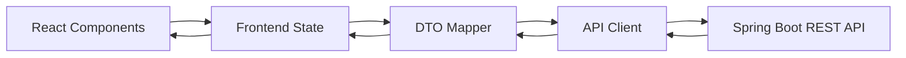

# API Client and DTOs

## Zweck dieser Datei

Diese Datei beschreibt API Client, DTOs und Datenmapping im React/TypeScript-Frontend.

Sie legt fest:

- wie das Frontend mit der REST/JSON-API des Java/Spring-Boot-Backends kommuniziert,
- welche DTO-Typen das Frontend benötigt,
- wie Backend-DTOs von frontendnahem State und View Models getrennt werden,
- wie Ladezustände, API-Fehler und Validation Results verarbeitet werden,
- wie Optimistic Updates im MVP bewertet werden,
- wie API-Versionierung und Mock APIs für die Frontend-Entwicklung aussehen können.

Der API Client ist eine technische Integrationsschicht. Er ersetzt keine fachliche Validierung und enthält keine eigene OCL- oder UML-Semantik.

## Rolle des API Clients

Der API Client kapselt alle REST-Aufrufe des Frontends an das Backend.



| Aufgabe | Beschreibung |
|---|---|
| REST-Aufrufe kapseln | Komponenten rufen keine rohen `fetch`-Requests auf. |
| DTOs typisieren | Request- und Response-Objekte erhalten explizite TypeScript-Interfaces. |
| Fehler normalisieren | HTTP-/Netzwerkfehler werden in ein einheitliches Frontend-Fehlermodell übersetzt. |
| Versionierung berücksichtigen | API-Version wird zentral konfiguriert. |
| Mockbarkeit sicherstellen | Frontend kann ohne laufendes Backend entwickelt und getestet werden. |
| Mapping vorbereiten | DTOs werden nicht direkt als UI-State verwendet. |

## API-Kommunikationsprinzipien

| Prinzip | Konsequenz |
|---|---|
| REST/JSON als Integrationsformat | Alle Requests und Responses sind JSON, außer späterer Dateiimport/-export. |
| Backend ist fachliche Quelle | UML-/OCL-Validierung und Constraint Checks werden nicht im Frontend nachgebaut. |
| DTOs sind Verträge | TypeScript-DTOs bilden den Backend-Vertrag ab, nicht die interne UI-Struktur. |
| Stabile IDs | UI-Mapping, Layout und Validation Results hängen an stabilen IDs. |
| Fachliche Fehler sind keine HTTP-Fehler | Constraint-Verletzungen kommen als `ValidationResultDto`, nicht als `500`. |
| Technische Fehler sind getrennt | Netzwerkfehler, `404`, ungültiges JSON oder Serverfehler werden als API Error behandelt. |
| Mapping ist explizit | Backend-DTOs werden in View Models und Store-Strukturen übersetzt. |

## API-Client-Struktur

Empfohlene Ordnerstruktur:

```text
src/api/
├─ client/
│  ├─ httpClient.ts
│  ├─ apiConfig.ts
│  ├─ apiError.ts
│  └─ requestState.ts
├─ dtos/
│  ├─ common.dto.ts
│  ├─ project.dto.ts
│  ├─ uml.dto.ts
│  ├─ objectModel.dto.ts
│  ├─ ocl.dto.ts
│  ├─ validation.dto.ts
│  ├─ error.dto.ts
│  └─ layout.dto.ts
├─ services/
│  ├─ projectApi.ts
│  ├─ umlModelApi.ts
│  ├─ objectModelApi.ts
│  ├─ oclApi.ts
│  └─ validationApi.ts
├─ mappers/
│  ├─ projectMapper.ts
│  ├─ umlMapper.ts
│  ├─ objectModelMapper.ts
│  ├─ layoutMapper.ts
│  └─ validationMapper.ts
└─ index.ts
```

| Datei/Bereich | Zweck |
|---|---|
| `httpClient.ts` | Zentrale HTTP-Funktion mit JSON-Handling, Headern und Fehlernormalisierung. |
| `apiConfig.ts` | Base URL, API-Version, Timeouts, Feature Flags. |
| `apiError.ts` | Typen und Hilfen für technische API-Fehler. |
| `dtos/` | Exakte TypeScript-Interfaces für Backend-Vertragsobjekte. |
| `services/` | Fachlich benannte API-Funktionen pro Backend-Ressource. |
| `mappers/` | Umwandlung von DTOs in Frontend View Models und zurück. |

Delete-Operationen gehören in dieselben Service-Dateien wie Create/Update, damit Komponenten keine Endpoint-Details kennen:

| Service | Delete-Funktionen |
|---|---|
| `umlModelApi.ts` | `deleteClass(projectId, classId)`, `deleteAttribute(projectId, classId, attributeId)`, `deleteOperation(projectId, classId, operationId)`, `deleteAssociation(projectId, associationId)`, `deleteInvariant(projectId, invariantId)` |
| `objectModelApi.ts` | `deleteObject(projectId, objectId)`, `deleteObjectLink(projectId, linkId)` |
| `projectApi.ts` | optional `deleteProject(projectId)` für Post-MVP-Projektverwaltung |

Für den MVP sollte eine Delete-Funktion bevorzugt ein aktualisiertes `ProjectDto` verarbeiten können. Falls das Backend `204 No Content` liefert, muss der API Client anschließend `getProject(projectId)` auslösen.

## DTO-Übersicht

| DTO | Zweck | Wichtigste Felder |
|---|---|---|
| `CreateProjectRequestDto` | Neues Projekt aus Dashboard/Create-New-Project-Dialog erstellen. | `name` als Pflichtfeld |
| `ProjectDto` | Vollständiger Projektzustand. | `id`, `name`, `formatVersion`, `umlModel`, `objectModel`, `layout` |
| `ProjectSummaryDto` | Recent Projects und All-Projects-Liste. | `id`, `name`, `description`, `updatedAt` |
| `UmlModelDto` | Klassenmodell. | `classes`, `associations`, `invariants` |
| `UmlClassDto` | UML-Klasse. | `id`, `name`, `attributes`, `operations` |
| `UmlAttributeDto` | Attribut. | `id`, `name`, `type` |
| `UmlOperationDto` | Operationensignatur. | `id`, `name`, `parameters`, `returnType` |
| `UmlParameterDto` | Operationsparameter. | `id`, `name`, `type` |
| `UmlAssociationDto` | Association zwischen Klassen. | `id`, `name`, `ends` |
| `UmlAssociationEndDto` | Association-Ende. | `id`, `classId`, `roleName`, `multiplicity`, `navigable` |
| `MultiplicityDto` | Multiplizität. | `lower`, `upper`, `unbounded` |
| `UmlInvariantDto` | OCL-Invariante. | `id`, `name`, `contextClassId`, `expression`, `enabled` |
| `ObjectModelDto` | Snapshot/Objektmodell. | `id`, `name`, `objects`, `links` |
| `ObjectInstanceDto` | Objektinstanz. | `id`, `name`, `classId`, `slots` |
| `SlotDto` | Attributwert. | `id`, `attributeId`, `value`, `isUnset` |
| `ObjectLinkDto` | Objektlink. | `id`, `associationId`, `sourceObjectId`, `targetObjectId` |
| `DeleteResultDto` | Optionaler Post-MVP-Auswirkungsbericht einer Löschung. | `deletedElementIds`, `affectedElementIds`, `warnings` |
| `OclParseResponseDto` | Parserfeedback. | `status`, `diagnostics`, `astPreview` |
| `OclTypecheckResponseDto` | Typecheckerfeedback. | `status`, `resultType`, `diagnostics` |
| `OclEvaluateResponseDto` | Auswertungsergebnis. | `status`, `value`, `diagnostics`, `trace` |
| `ValidationResultDto` | Ergebnis von `Check Constraints`. | `status`, `summary`, `errors`, `warnings`, `infos` |
| `ValidationErrorDto` | Fachlicher Validierungsfehler. | `id`, `code`, `severity`, `message`, Elementreferenzen |
| `ApiErrorResponseDto` | Technischer API-Fehler. | `error.code`, `error.message`, `error.userMessage`, `requestId` |
| `LayoutDto` | Diagramm-Layoutdaten. | `classDiagram`, `objectDiagram`, `nodes`, `viewport` |

## TypeScript-Interfaces

### Gemeinsame Basistypen

```ts
export type ProjectId = string;
export type UmlClassId = string;
export type UmlAttributeId = string;
export type UmlOperationId = string;
export type UmlAssociationId = string;
export type UmlAssociationEndId = string;
export type UmlInvariantId = string;
export type ObjectInstanceId = string;
export type ObjectLinkId = string;
export type SlotId = string;

export type PrimitiveTypeName = "String" | "Integer" | "Real" | "Boolean";

export type SeverityDto = "INFO" | "WARNING" | "ERROR";
```

### Project DTO

```ts
export interface ProjectDto {
  id: ProjectId;
  name: string;
  formatVersion: string;
  umlModel: UmlModelDto;
  objectModel: ObjectModelDto;
  layout?: LayoutDto;
  updatedAt?: string;
}

export interface ProjectSummaryDto {
  id: ProjectId;
  name: string;
  description?: string;
  updatedAt?: string;
}
```

## Mapping in Frontend-State

Backend-DTOs werden nicht direkt in Komponenten verwendet. Das Frontend nutzt View Models und UI State.

```text
Backend JSON
  -> DTO
  -> Mapper
  -> View Model
  -> Store
  -> React Components
```

| Mapping | Zweck |
|---|---|
| `ProjectDto -> ProjectState` | Projekt fachlich im Store ablegen. |
| `UmlModelDto -> ClassDiagramModel` | Diagramm-Nodes und Edges ableiten. |
| `ObjectModelDto -> ObjectDiagramModel` | Objekt-Nodes und Link-Edges ableiten. |
| `LayoutDto -> LayoutState` | Node-Positionen, Zoom und Pan bereitstellen. |
| `ValidationResultDto -> ValidationState` | Fehlerliste, Badges und Diagramm-Highlights erzeugen. |
| `ApiErrorResponseDto -> ApiErrorViewModel` | Technische Fehler für UI normalisieren. |

Beispiel:

```ts
export interface ValidationErrorViewModel {
  id: string;
  code: string;
  severity: "info" | "warning" | "error";
  title: string;
  message: string;
  target?: DiagramTarget;
}

export interface DiagramTarget {
  view: "class-diagram" | "object-diagram" | "ocl";
  elementType: "class" | "association" | "invariant" | "object" | "objectLink" | "slot" | "oclExpression";
  elementId: string;
}
```

## Projekt-DTOs

Wichtige API-Aktionen:

| Aktion | Endpoint | Frontend-Funktion |
|---|---|---|
| Projektliste laden | `GET /api/v1/projects` | `projectApi.listProjects(params?)` |
| Projekt laden | `GET /api/v1/projects/{projectId}` | `projectApi.getProject(projectId)` |
| Projekt speichern | `PUT /api/v1/projects/{projectId}` | `projectApi.saveProject(projectId, projectDto)` |
| Projekt erstellen | `POST /api/v1/projects` | `projectApi.createProject(request)` |
| JSON exportieren | `GET /api/v1/projects/{projectId}/export` | `projectApi.exportProject(projectId)` |
| JSON importieren | `POST /api/v1/projects/import` | `projectApi.importProject(projectDto)` |

Beispiel:

```ts
export interface CreateProjectRequestDto {
  // Pflichtfeld aus Screenshot 18-create-new-projects.png.
  name: string;
}

export interface SaveProjectRequestDto {
  project: ProjectDto;
}

export async function getProject(projectId: ProjectId): Promise<ProjectDto> {
  return httpClient.get<ProjectDto>(`/projects/${projectId}`);
}
```

Beispiel für die All-Projects-Seite aus `19-projects.png`:

```ts
export interface ListProjectsParams {
  search?: string;
}

export async function listProjects(params?: ListProjectsParams): Promise<ProjectSummaryDto[]> {
  // Im MVP kann search auch clientseitig angewendet werden.
  return httpClient.get<ProjectSummaryDto[]>("/projects", { query: params });
}
```

## UML-DTOs

```ts
export interface UmlModelDto {
  classes: UmlClassDto[];
  associations: UmlAssociationDto[];
  invariants: UmlInvariantDto[];
}

export interface UmlClassDto {
  id: UmlClassId;
  name: string;
  attributes: UmlAttributeDto[];
  operations: UmlOperationDto[];
}

export interface UmlAttributeDto {
  id: UmlAttributeId;
  name: string;
  type: PrimitiveTypeName | string;
}

export interface UmlOperationDto {
  id: UmlOperationId;
  name: string;
  parameters: UmlParameterDto[];
  returnType?: PrimitiveTypeName | string;
}

export interface UmlParameterDto {
  id: string;
  name: string;
  type: PrimitiveTypeName | string;
}

export interface UmlAssociationDto {
  id: UmlAssociationId;
  name: string;
  ends: [UmlAssociationEndDto, UmlAssociationEndDto];
}

export interface UmlAssociationEndDto {
  id: UmlAssociationEndId;
  classId: UmlClassId;
  roleName: string;
  multiplicity: MultiplicityDto;
  navigable?: boolean;
}

export interface MultiplicityDto {
  lower: number;
  upper?: number;
  unbounded?: boolean;
}

export interface UmlInvariantDto {
  id: UmlInvariantId;
  name: string;
  contextClassId: UmlClassId;
  expression: string;
  enabled: boolean;
}
```

Wichtige Aktionen:

| Aktion | Endpoint |
|---|---|
| Klasse erstellen | `POST /api/v1/projects/{projectId}/classes` |
| Association erstellen | `POST /api/v1/projects/{projectId}/associations` |
| Invariante erstellen | `POST /api/v1/projects/{projectId}/invariants` |
| Attribut erstellen | `POST /api/v1/projects/{projectId}/classes/{classId}/attributes` |
| Operation erstellen | `POST /api/v1/projects/{projectId}/classes/{classId}/operations` |

## Objektmodell-DTOs

```ts
export interface ObjectModelDto {
  id: string;
  name: string;
  objects: ObjectInstanceDto[];
  links: ObjectLinkDto[];
}

export interface ObjectInstanceDto {
  id: ObjectInstanceId;
  name: string;
  classId: UmlClassId;
  slots: SlotDto[];
}

export interface SlotDto {
  id: SlotId;
  attributeId: UmlAttributeId;
  value: SlotValueDto;
  isUnset?: boolean;
}

export type SlotValueDto =
  | { type: "String"; value: string }
  | { type: "Integer"; value: number }
  | { type: "Real"; value: number }
  | { type: "Boolean"; value: boolean }
  | { type: "Unset"; value?: null };

export interface ObjectLinkDto {
  id: ObjectLinkId;
  associationId: UmlAssociationId;
  sourceObjectId: ObjectInstanceId;
  targetObjectId: ObjectInstanceId;
}
```

Wichtige Aktionen:

| Aktion | Endpoint |
|---|---|
| Objekt erstellen | `POST /api/v1/projects/{projectId}/objects` |
| Objekt ändern | `PUT /api/v1/projects/{projectId}/objects/{objectId}` |
| Slot-Wert setzen | `PUT /api/v1/projects/{projectId}/objects/{objectId}/slots/{slotId}` |
| Objektlink erstellen | `POST /api/v1/projects/{projectId}/links` |
| Objektlink ändern | `PUT /api/v1/projects/{projectId}/links/{linkId}` |

## OCL-DTOs

Das Frontend führt keine vollständige OCL-Verarbeitung durch. Es sendet OCL-Ausdrücke an Backend-Endpunkte und zeigt Diagnostics.

```ts
export interface OclExpressionRequestDto {
  contextClassId: UmlClassId;
  expression: string;
  selfObjectId?: ObjectInstanceId;
}

export interface OclDiagnosticDto {
  code: string;
  severity: SeverityDto;
  message: string;
  sourceRange?: SourceRangeDto;
}

export interface SourceRangeDto {
  startLine: number;
  startColumn: number;
  endLine: number;
  endColumn: number;
}

export interface OclParseResponseDto {
  status: "OK" | "ERROR";
  diagnostics: OclDiagnosticDto[];
  astPreview?: unknown;
}

export interface OclTypecheckResponseDto {
  status: "OK" | "ERROR";
  resultType?: string;
  diagnostics: OclDiagnosticDto[];
}

export interface OclEvaluateResponseDto {
  status: "OK" | "ERROR";
  value?: unknown;
  diagnostics: OclDiagnosticDto[];
  trace?: unknown;
}
```

Wichtige Aktionen:

| Aktion | Endpoint | MVP |
|---|---|---|
| OCL parse | `POST /api/v1/projects/{projectId}/ocl/parse` | Should |
| OCL typecheck | `POST /api/v1/projects/{projectId}/ocl/typecheck` | Should |
| OCL evaluate | `POST /api/v1/projects/{projectId}/ocl/evaluate` | Later/Debug |

## ValidationResult-DTOs

```ts
export interface ValidationResultDto {
  projectId: ProjectId;
  status: "VALID" | "INVALID" | "ERROR";
  summary: ValidationSummaryDto;
  errors: ValidationErrorDto[];
  warnings?: ValidationErrorDto[];
  infos?: ValidationErrorDto[];
}

export interface ValidationSummaryDto {
  errorCount: number;
  warningCount: number;
  infoCount: number;
  checkedInvariantCount?: number;
  checkedMultiplicityCount?: number;
}

export interface ValidationErrorDto {
  id: string;
  code:
    | "SYNTAX_ERROR"
    | "TYPE_ERROR"
    | "UNKNOWN_CLASS"
    | "UNKNOWN_ATTRIBUTE"
    | "INVALID_SLOT_VALUE"
    | "INVALID_LINK"
    | "MULTIPLICITY_VIOLATION"
    | "INVARIANT_VIOLATION"
    | "EVALUATION_ERROR"
    | string;
  severity: SeverityDto;
  message: string;
  userMessage?: string;
  classIds?: UmlClassId[];
  associationIds?: UmlAssociationId[];
  invariantId?: UmlInvariantId;
  objectIds?: ObjectInstanceId[];
  linkIds?: ObjectLinkId[];
  slotIds?: SlotId[];
  contextClassId?: UmlClassId;
  contextObjectId?: ObjectInstanceId;
  expression?: string;
  sourceRange?: SourceRangeDto;
  details?: Record<string, unknown>;
}
```

Wichtige Aktion:

```ts
export async function validateProject(projectId: ProjectId): Promise<ValidationResultDto> {
  return httpClient.post<ValidationResultDto>(`/projects/${projectId}/validate`, {});
}
```

Falls das Frontend ungespeicherte Drafts validieren soll, braucht der Endpoint alternativ einen Request Body:

```ts
export interface ValidateProjectRequestDto {
  project?: ProjectDto;
  includeDisabledInvariants?: boolean;
}
```

## Error-DTOs

Technische API-Fehler sind getrennt von fachlichen Validation Errors.

```ts
export interface ApiErrorResponseDto {
  error: {
    code: string;
    severity: SeverityDto;
    message: string;
    userMessage?: string;
    requestId?: string;
    timestamp?: string;
    details?: Record<string, unknown>;
  };
}

export interface ApiErrorViewModel {
  code: string;
  message: string;
  userMessage: string;
  requestId?: string;
  recoverable: boolean;
}
```

Beispiele:

| Fall | Frontend-Reaktion |
|---|---|
| `404 PROJECT_NOT_FOUND` | Projekt-Fehlerzustand anzeigen, ggf. zurück zur Projektauswahl. |
| `400 INVALID_REQUEST` | Formular- oder Requestfehler anzeigen. |
| Netzwerkfehler | Retry-Option und Offline-/Backend-nicht-erreichbar-Hinweis. |
| `500 INTERNAL_ERROR` | Allgemeine Fehlermeldung mit Request-ID anzeigen. |
| `INVARIANT_VIOLATION` im `ValidationResult` | Kein API-Fehler; im Validation Results Panel anzeigen. |

## Lade- und Fehlerzustände

Das Frontend braucht getrennte Zustände für Serverkommunikation und fachliche Validierung.

```ts
export interface AsyncState<T> {
  data: T | null;
  isLoading: boolean;
  isSaving: boolean;
  error: ApiErrorViewModel | null;
}

export interface ValidationAsyncState {
  isValidating: boolean;
  result: ValidationResultViewModel | null;
  apiError: ApiErrorViewModel | null;
}
```

| Zustand | UI-Verhalten |
|---|---|
| Projekt lädt | Workspace Skeleton oder Loading State. |
| Projekt speichert | Save Button zeigt Loading; weitere kritische Aktionen ggf. blockieren. |
| Validate läuft | `Check Constraints` Button deaktivieren oder Loading anzeigen. |
| API-Fehler | Globaler oder kontextueller Error State. |
| Validation Errors | Validation Results Panel und Diagramm-Highlights aktualisieren. |

## Optimistic Updates vs serverseitige Bestätigung

Für den MVP ist ein konservatives Modell sinnvoll.

| Aktion | Empfehlung | Begründung |
|---|---|---|
| Lokale Diagramm-Selektion | Sofort lokal aktualisieren. | Reiner UI State. |
| Node verschieben | Sofort lokal aktualisieren, später speichern. | Layout ist UI-nah. |
| Klasse erstellen | Lokal im Draft möglich, spätestens beim Speichern/Backend bestätigen. | Nutzer erwartet direkte Sichtbarkeit. |
| Association erstellen | Besser serverseitig bestätigen oder nach lokaler Plausibilitätsprüfung speichern. | Fachliche Referenzen können fehlschlagen. |
| Objektlink erstellen | Serverbestätigung bevorzugt. | Linkvalidität hängt von Association und Objektklassen ab. |
| Slot-Wert ändern | Lokal möglich, Backend validiert später. | Fehler erscheint bei Save/Validate. |
| `Check Constraints` | Immer Backend-Ergebnis abwarten. | Fachliche Wahrheit liegt im Backend. |

Empfehlung:

- UI-nahe Änderungen wie Selektion, Modals und Layout werden optimistisch lokal behandelt.
- Fachliche Änderungen können im Frontend als Draft sofort sichtbar werden, müssen aber beim Speichern oder Validieren durch Backend-Ergebnisse abgesichert werden.
- Validation Results werden nie optimistisch erzeugt.

## Mock API

Für Frontend-Entwicklung ohne laufendes Backend sollte eine Mock API verfügbar sein.

Empfohlene Technik:

- Mock Service Worker (MSW) für browsernahe Mock-Requests,
- statische Fixture-Daten für Library-Beispiel,
- Testdaten für gültige und ungültige Validation Results.

```text
src/mocks/
├─ projects/
│  ├─ libraryProject.ts
│  ├─ emptyProject.ts
│  └─ invalidLibraryProject.ts
├─ validation/
│  ├─ validResult.ts
│  └─ invariantViolationResult.ts
├─ handlers/
│  ├─ projectHandlers.ts
│  ├─ umlHandlers.ts
│  ├─ objectModelHandlers.ts
│  ├─ oclHandlers.ts
│  └─ validationHandlers.ts
└─ browser.ts
```

Mock-Endpoints:

| Endpoint | Mock-Verhalten |
|---|---|
| `GET /api/v1/projects/project-library` | Liefert Library-Beispielprojekt. |
| `PUT /api/v1/projects/project-library` | Echo oder aktualisierte Fixture. |
| `POST /api/v1/projects/project-library/classes` | Liefert neue Klasse mit stabiler Mock-ID. |
| `POST /api/v1/projects/project-library/associations` | Liefert neue Association. |
| `POST /api/v1/projects/project-library/invariants` | Liefert neue Invariante. |
| `POST /api/v1/projects/project-library/objects` | Liefert neues Objekt. |
| `POST /api/v1/projects/project-library/links` | Liefert neuen Objektlink oder `INVALID_LINK`. |
| `POST /api/v1/projects/project-library/validate` | Liefert `VALID` oder `INVARIANT_VIOLATION` für `alice.books = 6`. |

## Beispiel: Check Constraints

### Request

```http
POST /api/v1/projects/project-library/validate
Content-Type: application/json
Accept: application/json
```

Minimaler Request Body:

```json
{}
```

Alternative bei Draft-Validierung:

```json
{
  "project": {
    "id": "project-library",
    "name": "Library",
    "formatVersion": "1.0",
    "umlModel": {},
    "objectModel": {},
    "layout": {}
  }
}
```

### Response

```json
{
  "projectId": "project-library",
  "status": "INVALID",
  "summary": {
    "errorCount": 1,
    "warningCount": 0,
    "infoCount": 0,
    "checkedInvariantCount": 1
  },
  "errors": [
    {
      "id": "error-invariant-max-books-alice",
      "code": "INVARIANT_VIOLATION",
      "severity": "ERROR",
      "message": "Invariant maxBooks is violated for object alice.",
      "userMessage": "alice verletzt die Invariante maxBooks.",
      "invariantId": "inv-user-max-books",
      "contextClassId": "class-user",
      "contextObjectId": "obj-alice",
      "objectIds": ["obj-alice"],
      "expression": "self.books <= 5"
    }
  ],
  "warnings": [],
  "infos": []
}
```

### Frontend-Mapping

```ts
export function mapValidationError(error: ValidationErrorDto): ValidationErrorViewModel {
  const objectTarget = error.contextObjectId ?? error.objectIds?.[0];

  return {
    id: error.id,
    code: error.code,
    severity: error.severity.toLowerCase() as "info" | "warning" | "error",
    title: error.code,
    message: error.userMessage ?? error.message,
    target: objectTarget
      ? {
          view: "object-diagram",
          elementType: "object",
          elementId: objectTarget,
        }
      : undefined,
  };
}
```

Erwartete UI-Reaktion:

1. `ValidationResultsPanel` zeigt einen Error.
2. `ObjectDiagramView` markiert `obj-alice`.
3. Klick auf den Fehler wechselt bei Bedarf in das Objektdiagramm.
4. Canvas fokussiert `alice : User`.
5. Properties Panel zeigt das betroffene Objekt oder den betroffenen Slot.

## Abhängigkeit zum Backend

| Frontend-Bedarf | Backend-Abhängigkeit |
|---|---|
| Typed DTOs | Stabiler API-Vertrag oder OpenAPI-Spezifikation. |
| Validation Mapping | Fehler müssen Element-IDs enthalten. |
| OCL Diagnostics | Backend muss Source Ranges und Kontext liefern. |
| Layout Persistence | Backend muss Layoutdaten im Projektformat speichern können. |
| Draft Validation | Backend muss optional vollständigen Projektzustand im Validate Request akzeptieren. |
| Mock API | Backend-Beispiele und JSON Fixtures müssen synchron gehalten werden. |
| API-Versionierung | Backend muss Versionierungskonzept festlegen. |

## API-Versionierung

Empfehlung für den MVP:

```text
/api/v1/projects/{projectId}
```

Alternativ kann die Version zunächst über Konfiguration vorbereitet werden:

```ts
export const apiConfig = {
  baseUrl: "/api/v1",
};
```

Versionierungsregeln:

- Breaking Changes erhöhen API-Version.
- Neue optionale Felder dürfen innerhalb derselben Version ergänzt werden.
- Frontend muss unbekannte optionale Felder ignorieren können.
- Entfernte oder umbenannte Felder benötigen Migration.
- DTOs sollten durch Contract Tests oder OpenAPI-Abgleich geprüft werden.

## Offene Fragen

| Frage | Bedeutung |
|---|---|
| Werden TypeScript-DTOs manuell gepflegt oder aus OpenAPI generiert? | Beeinflusst Build-Prozess und Contract-Sicherheit. |
| Validiert `POST /validate` gespeicherten Zustand oder Draft-Zustand aus Request Body? | Wichtig für UX bei ungespeicherten Änderungen. |
| Sind CRUD-Endpunkte im MVP vollständig nötig oder reicht `GET/PUT Project` plus `validate`? | Beeinflusst API Client Umfang. |
| Nutzt das Backend `sourceObjectId/targetObjectId` oder generische Link-Endwerte? | Betrifft `ObjectLinkDto` und Mapper. |
| Wie wird `SlotValueDto` exakt typisiert? | Wichtig für Formulare und Type Selects. |
| Welche Felder enthält `LayoutDto` verbindlich? | Betrifft Diagramm-Layout und Save/Load. |
| Werden OCL Parse/Typecheck-Endpunkte schon im MVP benötigt? | Betrifft OCL Editor Feedback. |
| Wie werden Request IDs und technische Details im UI angezeigt? | Betrifft Support und Fehlerdiagnose. |

## Zusammenfassung

Der Frontend API Client kapselt die REST/JSON-Kommunikation mit dem Backend und stellt typed DTOs für Projekte, UML-Modelle, Objektmodelle, OCL, Validation Results, Fehler und Layoutdaten bereit.

Wichtig ist die klare Trennung:

- DTOs bilden den Backend-Vertrag ab.
- Mapper übersetzen DTOs in Frontend View Models.
- Stores halten Project State, Diagram State, Selection State, Validation State und UI State.
- Komponenten arbeiten nicht direkt mit rohen HTTP-Responses.

Für den MVP sind Projekt laden/speichern, Klassen/Associations/Invarianten/Objekte/Objektlinks erstellen und `Check Constraints` zentral. Validation Results müssen strukturiert verarbeitet werden, damit das Frontend Fehler im Diagramm markieren und im Validation Results Panel erklären kann. Mock APIs ermöglichen parallele Frontend-Entwicklung, solange das Backend noch im Aufbau ist.
