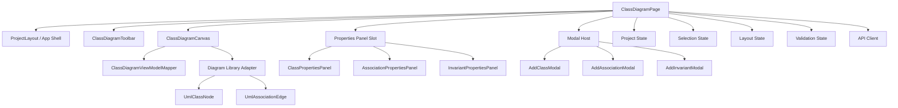

# Class Diagram Component

## Zweck dieser Datei

Diese Datei beschreibt Konzept, Anforderungen und Komponentenstruktur der `Class Diagram View` des neuen React/TypeScript-Frontends. Sie dient als fachliche und technische Orientierung für die spätere Umsetzung der Klassendiagramm-Oberfläche.

Die Datei ist keine Implementierungsspezifikation auf Codeebene. Sie legt fest, welche UI-Komponenten benötigt werden, welche Daten sie verwenden, wie Selektion und Properties Panel zusammenspielen, wie Diagrammlayout gespeichert wird und wie die View mit Backend, State Management und Validierung verbunden ist.

## Relevante Screenshots

Die folgenden Screenshots zeigen die Zielstruktur der Class Diagram View und der zugehörigen Modale.

| Screenshot | Vorschau | Relevante Beobachtung |
|---|---|---|
| `01-class-diagram-class-properties.png` |  | Klasse ist im Diagramm selektiert; rechts erscheinen Klasseneigenschaften, Attribute und Operationen. |
| `02-class-diagram-association-properties.png` |  | Association ist selektiert; Properties Panel zeigt Enden, Rollen und Multiplizitäten. |
| `03-class-diagram-invariant-properties.png` |  | Invariante ist sichtbar und selektierbar; Properties Panel zeigt Kontextklasse und OCL-Ausdruck. |
| `04-class-diagram-new-class-selected.png` |  | Neu angelegte Klasse erscheint im Canvas und wird direkt selektiert. |
| `08-modal-add-class.png` |  | Modal zum Erstellen einer neuen Klasse mit Namen und optionalen Details. |
| `09-modal-add-invariant.png` |  | Modal zum Erstellen einer Invariante mit Name, Kontextklasse und OCL-Ausdruck. |
| `10-modal-add-class-association.png` |  | Modal zum Erstellen einer Association zwischen zwei Klassen mit Rollen und Multiplizitäten. |
| `15-properties-association.png` |  | Bei selektierter Klasse zeigt das Properties Panel über das Segment `Association` die zugehörigen Associations. |
| `16-properties-invariants.png` |  | Bei selektierter Klasse zeigt das Segment `Invariant` die Invarianten der Klasse und deren OCL-Ausdrücke. |
| `17-new-class.png` |  | Neue Klasse ist selektiert; das Segment `Class` zeigt Name, Attribute, Operationen und Add-Aktionen. |

## Rolle der Class Diagram View

Die Class Diagram View ist die zentrale Oberfläche für das UML-Klassenmodell. Hier definiert der Nutzer die fachliche Struktur, auf der Objektdiagramme, Snapshots, OCL-Invarianten und Constraint Validation aufbauen.

Im MVP muss die View folgende Aufgaben erfüllen:

- Klassen visuell anzeigen, erstellen, auswählen, bearbeiten und verschieben.
- Attribute und Operationen als Bestandteile einer Klasse anzeigen.
- Assoziationen als Linien zwischen Klassen anzeigen und auswählbar machen.
- Association-Namen mittig auf der Linie darstellen.
- Rollen und Multiplizitäten an beiden Association-Enden darstellen.
- OCL-Invarianten sichtbar machen und einer Kontextklasse zuordnen.
- Modale Aktionen zum Erstellen von Klassen, Associations und Invarianten bereitstellen.
- Das Properties Panel abhängig von der aktuellen Selektion aktualisieren.
- Diagrammpositionen und Viewport als Layoutdaten speichern.
- Validierungsergebnisse auf betroffene Klassen, Associations oder Invarianten abbilden.

Die Class Diagram View führt keine vollständige fachliche UML-/OCL-Validierung aus. Sie kann einfache UI-Prüfungen durchführen, etwa Pflichtfelder oder offensichtlich leere Namen. Die fachliche Wahrheit liegt im Backend.

## Komponentenübersicht

Die View sollte als Feature-Modul umgesetzt werden. Die Diagrammbibliothek wird über eine Adapter-/Mapping-Schicht gekapselt. Für den MVP ist React Flow die empfohlene Bibliothek, die fachlichen Komponenten sollten aber nicht direkt vom Backend-DTO-Format abhängen.



| Komponente | Verantwortung | Wichtige Eingaben | Wichtige Ausgaben |
|---|---|---|---|
| `ClassDiagramPage` | Orchestriert Class Diagram View, State-Zugriff, API-Aktionen, Modale und Properties Panel. | Projektzustand, Route, Selection State, Validation State | Aktualisierte View, API-Kommandos, Auswahländerungen |
| `ClassDiagramCanvas` | Rendert Klassen, Associations, Invariant-Hinweise und Diagramm-Interaktion. | Diagram View Model, Layoutdaten, Validierungsmarker | Node-/Edge-Selektion, Positionsänderungen |
| `UmlClassNode` | Zeigt eine UML-Klasse mit Name, Attributen, Operationen und Invariant-Hinweisen. | Klasse, Attribute, Operationen, Invarianten, Fehlerstatus | Klassenselektion, Drag-Position |
| `UmlAssociationEdge` | Zeigt Association-Linie mit mittigem Association-Namen sowie Rollen und Multiplizitaeten an beiden Enden. | Association, Association Ends, Layout-/Edge-Daten | Association-Selektion |
| `InvariantBadge` | Macht Invarianten an Kontextklassen sichtbar. | Invariantendaten, Fehlerstatus | Invariantenselektion |
| `ClassDiagramToolbar` | Bietet Aktionen wie Add Class, Add Association, Add Invariant, Save, Refresh. | Berechtigungen, Projektstatus | Öffnet Modale, startet Save/Refresh |
| `ClassPropertiesPanel` | Bearbeitet Klassennamen, Attribute und Operationen; bietet bei Klassenselektion Zugriff auf zugehörige Associations und Invarianten. | Selektierte Klasse, UML-Modell | Update-Kommandos, Related-Element-Selektion, Add-Modal-Kontext |
| `AssociationPropertiesPanel` | Bearbeitet Association-Name, Enden, Rollen und Multiplizitäten. | Selektierte Association | Update-Kommandos |
| `InvariantPropertiesPanel` | Bearbeitet Name, Kontextklasse und OCL-Ausdruck einer Invariante. | Selektierte Invariante | Update-Kommandos, optional OCL-Check |
| `AddClassModal` | Erstellt neue Klasse. | Formularwerte, bestehende Klassen | `createClass` |
| `AddAssociationModal` | Erstellt neue Association zwischen Klassen. | Klassenliste, Rollen, Multiplizitäten | `createAssociation` |
| `AddInvariantModal` | Erstellt neue OCL-Invariante. | Klassenliste, OCL-Ausdruck | `createInvariant` |
| `ClassDiagramViewModelMapper` | Übersetzt Project State in Diagramm-Nodes/-Edges. | UML-Modell, Layout, Validation Results | Diagram Nodes, Diagram Edges |

## Invariantendarstellung

Invarianten sind fachlich Teil des UML-Modells, werden aber gegen Snapshots im Objektdiagramm ausgewertet. In der Class Diagram View sollen sie sichtbar und auswählbar sein, damit Nutzer den Zusammenhang zwischen Kontextklasse und OCL-Ausdruck verstehen.

MVP-Darstellung:

- Invarianten erscheinen als kompakte Badges oder Einträge an der Kontextklasse.
- Die Explorer Sidebar listet Invarianten zusätzlich im Bereich `Invariants`.
- Ein Klick auf eine Invariante selektiert sie und öffnet das `InvariantPropertiesPanel`.
- Das Panel zeigt mindestens Name, Kontextklasse und OCL-Ausdruck.
- OCL-Ausdrücke werden im Frontend angezeigt und gespeichert, aber fachlich vom Backend geprüft.

Beispiel:

```ocl
context User inv maxBooks:
  self.books <= 5
```

Post-MVP kann die Darstellung erweitert werden um Statusindikatoren für Syntaxprüfung, Typecheck, Invariantverletzungen, OCL-Autocomplete oder Sprung vom OCL Editor zur Kontextklasse.

## Selektion und Properties Panel

Die Class Diagram View benötigt einen eindeutigen Selection State. Die Selektion kann aus dem Canvas, der Explorer Sidebar, dem Properties Panel oder aus Validation Results entstehen.

| Selektiertes Element | Quelle der Selektion | Properties Panel | Erwartetes Verhalten |
|---|---|---|---|
| Klasse | Klick auf `UmlClassNode` oder Explorer-Eintrag | `ClassPropertiesPanel` | Klasse wird visuell hervorgehoben; Name, Attribute und Operationen sind bearbeitbar; Segmente bieten Zugriff auf zugehörige Associations und Invarianten. |
| Association | Klick auf `UmlAssociationEdge` oder Explorer-Eintrag | `AssociationPropertiesPanel` | Linie wird hervorgehoben; Enden, Rollen und Multiplizitäten sind sichtbar. |
| Invariante | Klick auf `InvariantBadge` oder Explorer-Eintrag | `InvariantPropertiesPanel` | Kontextklasse und OCL-Ausdruck werden angezeigt. |
| Kein Element | Klick auf leere Canvas-Fläche | Projekt- oder Hilfezustand | Properties Panel zeigt leeren Zustand oder Projektinformationen. |

Empfohlenes Selection-Modell:

```ts
type Selection =
  | { type: "class"; id: string }
  | { type: "association"; id: string }
  | { type: "invariant"; id: string }
  | null;
```

Die Selektion sollte nicht in einzelnen Komponenten dupliziert werden. Sie gehört in einen zentralen UI-State, damit Canvas, Explorer Sidebar, Properties Panel und Validation Results synchron bleiben.

### ClassPropertiesPanel-Segmente

Die Screenshots `15-properties-association.png`, `16-properties-invariants.png` und `17-new-class.png` konkretisieren die Struktur des `ClassPropertiesPanel`. Eine selektierte Klasse hat ein Segment Control mit drei fachlichen Zugängen.

| Segment | Datenquelle | Anzeige | Interaktion | MVP |
|---|---|---|---|---|
| `Class` | `UmlClassDto` | Klassenname, Attribute, Operationen, Add Attribute, Add Operation. | Inline bearbeiten; Add/Delete-Aktionen auslösen. | Ja |
| `Association` | `UmlModelDto.associations` gefiltert über `association.ends[].classId === selectedClass.id` | Association-Name, beteiligte Klassen, Rollen und Multiplizitäten. | Association auswählen oder Add Association mit selektierter Klasse als Vorauswahl öffnen. | Ja |
| `Invariant` | `UmlModelDto.invariants` gefiltert über `contextClassId === selectedClass.id` | Invariant Name und OCL Expression. | Invariante auswählen oder Add Invariant mit selektierter Klasse als Kontext öffnen. | Ja |

Wichtig: Das Segment `Association` und das Segment `Invariant` sind Related-Listen zur selektierten Klasse. Sie ersetzen nicht `AssociationPropertiesPanel` oder `InvariantPropertiesPanel`. Detailbearbeitung einer konkreten Association oder Invariante erfolgt nach Auswahl des jeweiligen Listeneintrags über das dedizierte Panel.

## Association Edge Layout

Associations duerfen im MVP nicht als einfache Default-Edges gerendert werden. Die Screenshots zeigen den Association-Namen als Label in der Mitte der Verbindungslinie. Zusaetzlich verlangt das UML/OCL-Zielsystem, dass Rollen und Multiplizitaeten an den jeweiligen Association-Enden sichtbar sind.

Fuer React Flow bedeutet das:

- `UmlAssociationEdge` ist eine eigene Custom Edge.
- Der Association-Name wird am Mittelpunkt des Edge-Pfads gerendert.
- Source Role und Source Multiplicity werden nahe am Source-Ende gerendert.
- Target Role und Target Multiplicity werden nahe am Target-Ende gerendert.
- Die Labelpositionen werden aus den aktuellen Edge-Koordinaten abgeleitet, damit sie nach Drag & Drop der Klassen korrekt mitwandern.
- Default Edges duerfen hoechstens fuer technische Prototypen verwendet werden, nicht fuer den MVP-Stand.

Empfohlenes Edge-ViewModel:

```ts
export interface UmlAssociationEdgeViewModel {
  id: string;
  associationId: string;
  sourceClassId: string;
  targetClassId: string;
  associationName: string;
  sourceEnd: {
    roleName: string;
    multiplicity: string;
  };
  targetEnd: {
    roleName: string;
    multiplicity: string;
  };
  selected: boolean;
  validationState?: "none" | "warning" | "error";
}
```

MVP-Darstellung:

| Edge-Bereich | Inhalt | Pflicht im MVP |
|---|---|---|
| Mitte | Association-Name, z. B. `Borrows` | Ja |
| Source-Ende | Source Role und Source Multiplicity | Ja |
| Target-Ende | Target Role und Target Multiplicity | Ja |
| Linie | Selektions- und Fehlerzustand | Ja |
| Bendpoints | Manuelle Kantenpunkte | Nein, Post-MVP |

## Modale Aktionen

Die Screenshots zeigen drei zentrale Modale für die Class Diagram View.

| Modal | Screenshot | MVP-Felder | Ergebnis |
|---|---|---|---|
| `AddClassModal` | `08-modal-add-class.png` | Klassenname, optional erste Attribute/Operationen | Neue Klasse wird erzeugt, im Canvas positioniert und selektiert. |
| `AddAssociationModal` | `10-modal-add-class-association.png` | Name, Source Class, Target Class, Rollen, Multiplizitäten | Neue Association wird als Edge erzeugt und selektiert. |
| `AddInvariantModal` | `09-modal-add-invariant.png` | Name, Kontextklasse, OCL Expression | Neue Invariante wird der Kontextklasse zugeordnet und selektiert. |

Die Modale sollten UI-nahe Pflichtfeldprüfung durchführen. Beispiele:

- Klassenname darf nicht leer sein.
- Association benötigt zwei gültige Endklassen.
- Multiplicity-Felder müssen syntaktisch plausibel sein, etwa `1`, `0..1`, `0..*`, `1..*`.
- Invariante benötigt Kontextklasse und OCL-Ausdruck.

Fachliche Eindeutigkeit, OCL-Syntax, OCL-Typisierung und semantische Modellregeln werden durch das Backend geprüft.

## Nutzeraktionen

| Aktion | UI-Auslöser | Frontend-Reaktion | Backend-Bezug | MVP |
|---|---|---|---|---|
| Klasse hinzufügen | Toolbar oder Explorer-Aktion | `AddClassModal` öffnen, Klasse nach Bestätigung anzeigen und selektieren | `POST /api/v1/projects/{projectId}/classes` oder Projektspeicherung | Ja |
| Klasse auswählen | Klick auf Node | Selection State setzen, Properties Panel wechseln | keiner, solange keine Änderung gespeichert wird | Ja |
| Klasse verschieben | Drag & Drop im Canvas | Layout State aktualisieren | Layout bei Save/Autosave persistieren | Ja |
| Attribute bearbeiten | Properties Panel | lokalen Projektzustand aktualisieren, Save ermöglichen | `PUT /api/v1/projects/{projectId}` oder spezifischer Klassen-Endpunkt | Ja |
| Operation erfassen | Properties Panel | Signatur speichern | Klassen-/Projektupdate | Ja |
| Klassenzugehörige Associations anzeigen | `Association`-Segment im Class Properties Panel | Related Associations aus Projekt ableiten und anzeigen | keiner, solange nur angezeigt wird | Ja |
| Klassenzugehörige Invarianten anzeigen | `Invariant`-Segment im Class Properties Panel | Related Invariants aus Projekt ableiten und anzeigen | keiner, solange nur angezeigt wird | Ja |
| Association hinzufügen | Toolbar oder Explorer-Aktion | `AddAssociationModal` öffnen, Edge erzeugen | `POST /api/v1/projects/{projectId}/associations` | Ja |
| Association auswählen | Klick auf Edge | Selection State setzen, Association Panel öffnen | keiner | Ja |
| Invariante hinzufügen | Toolbar oder Explorer-Aktion | `AddInvariantModal` öffnen, Badge/Eintrag anzeigen | `POST /api/v1/projects/{projectId}/invariants` | Ja |
| Check Constraints | Top Bar oder Toolbar | API-Aufruf starten, Validation State aktualisieren | `POST /api/v1/projects/{projectId}/validate` | Ja |
| Fehler auswählen | Validation Results Panel | betroffene Klasse/Association/Invariante fokussieren | Ergebnisdaten aus Backend | Ja |

## Datenbedarf

Die Class Diagram View benötigt fachliche Daten, Layoutdaten und UI-Zustände.

| Datenbereich | Benötigte Daten | Quelle | Verwendung |
|---|---|---|---|
| Projekt | `projectId`, Name, Version, Dirty State | Backend DTO / Frontend State | Laden, Speichern, Toolbar-Anzeige |
| Klassen | `id`, `name`, Attribute, Operationen | `UmlModelDto` | Nodes erzeugen |
| Attribute | `id`, `name`, `type`, optionale Flags | Klasse | Anzeige und Properties Panel |
| Operationen | `id`, `name`, Parameter, Return Type | Klasse | Anzeige als Signaturen |
| Associations | `id`, `name`, Enden | `UmlModelDto` | Edges erzeugen |
| Association Ends | `classId`, `roleName`, `multiplicity` | Association | Edge Labels, Properties Panel |
| Invarianten | `id`, `name`, `contextClassId`, `expression` | `UmlModelDto` | Badges, Explorer, Properties Panel |
| Layout | Node-Positionen, Edge-Hinweise, Viewport | Layout State / Projektformat | Canvas-Rendering und Speicherung |
| Validation Results | Fehlercodes, Severity, betroffene Elemente | Backend Validation API | Markierungen, Badges, Result-Navigation |
| UI State | Selektion, Modalzustand, Ladezustand | Frontend State | Interaktion und Feedback |

## API-Interaktionen

Die konkrete API kann entweder feingranulare CRUD-Endpunkte oder projektbasierte Save/Load-Operationen verwenden. Für den MVP sollte die Frontend-Komponente beide Konzepte sauber über einen API Client kapseln.

| Zweck | Möglicher Endpoint | Request-Inhalt | Response |
|---|---|---|---|
| Projekt laden | `GET /api/v1/projects/{projectId}` | Projekt-ID | Vollständiges `ProjectDto` |
| Projekt speichern | `PUT /api/v1/projects/{projectId}` | Vollständiges Projekt oder Patch | Aktualisiertes `ProjectDto` |
| Klasse erstellen | `POST /api/v1/projects/{projectId}/classes` | Name, optionale Position | Neue Klasse oder aktualisiertes Projekt |
| Association erstellen | `POST /api/v1/projects/{projectId}/associations` | Endklassen, Rollen, Multiplizitäten | Neue Association oder aktualisiertes Projekt |
| Invariante erstellen | `POST /api/v1/projects/{projectId}/invariants` | Name, Kontextklasse, OCL-Ausdruck | Neue Invariante oder aktualisiertes Projekt |
| Constraints prüfen | `POST /api/v1/projects/{projectId}/validate` | Projekt-ID oder aktueller Projektzustand | `ValidationResultDto` |

Frontend-Komponenten sollten nicht direkt HTTP-Endpunkte aufrufen. Stattdessen sollte ein Feature-Service genutzt werden, etwa:

```ts
interface ClassDiagramActions {
  createClass(input: CreateClassInput): Promise<void>;
  updateClass(input: UpdateClassInput): Promise<void>;
  createAssociation(input: CreateAssociationInput): Promise<void>;
  updateAssociation(input: UpdateAssociationInput): Promise<void>;
  createInvariant(input: CreateInvariantInput): Promise<void>;
  saveLayout(input: SaveLayoutInput): Promise<void>;
  checkConstraints(): Promise<void>;
}
```

## State Management

Für die Class Diagram View sind mehrere State-Arten zu trennen.

| State | Inhalt | Persistenz | Bemerkung |
|---|---|---|---|
| Project State | UML-Modell, Invarianten, Object Model, Layout | Backend/Projektformat | Fachlicher Hauptzustand. |
| Diagram View Model | Nodes und Edges für die Diagrammbibliothek | abgeleitet | Sollte aus Project State und Layout berechnet werden. |
| Selection State | aktuell selektiertes Element | lokal/UI | Muss Canvas, Explorer und Panel synchronisieren. |
| Layout State | Positionen, Viewport, eventuell Edge-Routing | Backend/Projektformat | Fachlich nicht semantisch, aber nutzerrelevant. |
| Modal State | geöffnetes Modal und Formularwerte | lokal/UI | Keine fachliche Quelle. |
| Validation State | letzte Validation Results, Fehler-Mapping | temporär oder optional persistiert | Grundlage für Markierungen. |
| Async State | Lade-, Speicher- und Validierungsstatus | lokal/UI | Für Buttons, Spinner, Fehlermeldungen. |

Der Diagram View Model Mapper sollte aus fachlichen Daten stabile Diagramm-Elemente erzeugen:

```ts
type ClassDiagramNode = {
  id: string;
  type: "umlClass";
  position: { x: number; y: number };
  data: {
    classId: string;
    name: string;
    attributes: UmlAttributeDto[];
    operations: UmlOperationDto[];
    invariants: UmlInvariantDto[];
    validationMarkers: ValidationMarker[];
  };
};
```

## Layout-Speicherung

Das Layout ist für die Weboberfläche wichtig, aber keine fachliche UML-Semantik. Deshalb sollte es getrennt vom eigentlichen UML-Modell gespeichert werden, jedoch mit stabilen IDs auf Klassen, Associations und Invarianten verweisen.

MVP-Regeln:

- Jede Klasse erhält eine persistierbare Position.
- Drag & Drop aktualisiert zunächst lokalen Layout State.
- Beim Speichern wird das Layout gemeinsam mit dem Projekt oder als Layout-Patch persistiert.
- Neu erstellte Klassen erhalten eine sinnvolle Startposition im sichtbaren Canvas.
- Gelöschte Elemente entfernen auch verwaiste Layoutdaten.
- Der Canvas-Viewport kann optional gespeichert werden.

Beispiel:

```json
{
  "layout": {
    "classDiagram": {
      "nodes": {
        "class-user": { "x": 120, "y": 80 },
        "class-book": { "x": 420, "y": 120 }
      },
      "viewport": {
        "x": 0,
        "y": 0,
        "zoom": 1
      }
    }
  }
}
```

## Validierungsbezug

Die Class Diagram View zeigt vor allem strukturelle und OCL-bezogene Validierungsergebnisse. Die eigentliche Constraint-Prüfung wird durch das Backend ausgeführt.

| Fehlerart | Betroffenes UI-Element | Darstellung in Class Diagram View |
|---|---|---|
| `UNKNOWN_CLASS` | Klasse, Association End, Invariante | Markierung im Properties Panel oder Explorer |
| `UNKNOWN_ATTRIBUTE` | Attributreferenz in OCL | Invariant-Badge mit Fehlerstatus, Detail im Panel |
| `TYPE_ERROR` | OCL-Ausdruck | Fehlerstatus an Invariante und OCL-Feld |
| `SYNTAX_ERROR` | OCL-Ausdruck | Fehlermeldung im Invariant Properties Panel oder OCL Editor |
| `MULTIPLICITY_VIOLATION` | Association | Association kann markiert werden; Details meist im Object Diagram relevanter |
| `INVARIANT_VIOLATION` | Invariante und betroffene Objekte | Invariante kann Status zeigen; Objektmarkierung liegt im Object Diagram |

Für das Mapping benötigt jedes Validation Result stabile Referenzen:

```json
{
  "code": "TYPE_ERROR",
  "severity": "ERROR",
  "message": "Operator <= cannot be applied to String and Integer.",
  "targets": [
    {
      "elementType": "INVARIANT",
      "elementId": "inv-max-books",
      "path": "umlModel.invariants[inv-max-books].expression"
    }
  ]
}
```

## MVP-Anforderungen

| ID | Anforderung | Priorität | Screenshot-Bezug |
|---|---|---|---|
| `CD-MVP-001` | Klassen werden als Karten mit Name, Attributen und Operationen angezeigt. | MVP | `01-class-diagram-class-properties.png`, `04-class-diagram-new-class-selected.png` |
| `CD-MVP-002` | Nutzer kann eine Klasse über ein Modal erstellen. | MVP | `08-modal-add-class.png` |
| `CD-MVP-003` | Selektion einer Klasse aktualisiert das Properties Panel. | MVP | `01-class-diagram-class-properties.png` |
| `CD-MVP-004` | Associations werden als Linien zwischen Klassen angezeigt; der Association-Name steht mittig auf der Linie. | MVP | `02-class-diagram-association-properties.png` |
| `CD-MVP-005` | Nutzer kann eine Association mit Rollen und Multiplizitäten erstellen. | MVP | `10-modal-add-class-association.png` |
| `CD-MVP-006` | Selektion einer Association aktualisiert das Properties Panel. | MVP | `02-class-diagram-association-properties.png` |
| `CD-MVP-007` | Nutzer kann Invarianten mit Kontextklasse und OCL-Ausdruck erstellen. | MVP | `09-modal-add-invariant.png` |
| `CD-MVP-008` | Invarianten sind im Klassendiagramm und im Properties Panel sichtbar. | MVP | `03-class-diagram-invariant-properties.png` |
| `CD-MVP-009` | Klassen können per Drag & Drop verschoben werden. | MVP | aus Diagramm-Canvas abgeleitet |
| `CD-MVP-010` | Diagrammlayout kann gespeichert und wieder geladen werden. | MVP | aus Diagramm-Canvas und Projektformat abgeleitet |
| `CD-MVP-011` | Validation Results können auf Klassen, Associations und Invarianten gemappt werden. | MVP | `03-class-diagram-invariant-properties.png` |
| `CD-MVP-012` | Association-Rollen und Multiplizitaeten werden als Endlabels an beiden Kantenenden angezeigt. | MVP | `02-class-diagram-association-properties.png`, fachliche UML-Anforderung |
| `CD-MVP-013` | Bei selektierter Klasse bietet das Properties Panel Segmente `Class`, `Association` und `Invariant`. | MVP | `15-properties-association.png`, `16-properties-invariants.png`, `17-new-class.png` |
| `CD-MVP-014` | Zugehörige Associations und Invarianten einer Klasse sind über das Class Properties Panel erreichbar. | MVP | `15-properties-association.png`, `16-properties-invariants.png` |

## Post-MVP-Erweiterungen

| Erweiterung | Beschreibung | Abhängigkeit |
|---|---|---|
| Vererbung | Darstellung von Generalization-Kanten und geerbten Attributen/Operationen. | UML Model Service, Typechecker |
| Enumerationen | Enum-Knoten oder kompakte Enum-Darstellung. | Typmodell, Properties Panel |
| Aggregation/Komposition | Spezielle Association-End-Darstellung. | Domain Model, Edge Rendering |
| Assoziationsklassen | Kombination aus Association und Class Node. | erweitertes UML-Modell |
| Live OCL Syntax Feedback | Backendgestützte Parse-/Typecheck-Vorprüfung beim Bearbeiten. | OCL API |
| Auto Layout | Automatische Anordnung von Klassen und Associations. | Diagrammbibliothek oder Layout-Engine |
| Undo/Redo | Wiederherstellbare Modell- und Layoutänderungen. | State Management |
| Mehrere Diagrammansichten | Unterschiedliche Layouts auf demselben UML-Modell. | Layoutmodell |
| Erweiterte Edge-Bearbeitung | Edge-Routing, manuelle Bendpoints, Label-Positionen. | Diagrammbibliothek, Layoutdaten |

## Offene Fragen

| Frage | Bedeutung |
|---|---|
| Werden Attribute und Operationen inline in der Klassenkarte oder ausschließlich im Properties Panel bearbeitet? | Beeinflusst Komplexität der `UmlClassNode`-Komponente. |
| Werden Modale direkt gegen Backend-Endpunkte gespeichert oder zunächst nur lokal in den Project State übernommen? | Beeinflusst Optimistic Updates und Fehlerbehandlung. |
| Soll Layout automatisch gespeichert werden oder nur über expliziten Save? | Beeinflusst Nutzererwartung und API-Aufrufe. |
| Wie detailliert sollen OCL-Fehler bereits in der Class Diagram View erscheinen? | Beeinflusst InvariantBadge, Properties Panel und OCL Editor Integration. |
| Wie werden gelöschte Klassen behandelt, wenn Associations, Objekte oder Invarianten darauf verweisen? | Erfordert klare Backend-Regeln und UI-Bestätigungen. |
| Soll eine Association zwischen derselben Klasse mehrfach erlaubt sein? | Beeinflusst Modellregeln, Edge-Darstellung und Properties Panel. |

## Zusammenfassung

Die Class Diagram View ist der zentrale Einstieg in das fachliche Modell des neuen UML/OCL-Websystems. Sie verbindet Diagramm-Canvas, Explorer Sidebar, Properties Panel, Modale, API Client und Frontend State zu einem konsistenten Modellierungsworkflow.

Für den MVP muss die View Klassen, Attribute, Operationen, Associations, Rollen, Multiplizitäten und Invarianten anzeigen und bearbeiten können. React Flow eignet sich als Diagrammgrundlage, sollte aber über eine View-Model- und Adapter-Schicht gekapselt werden. Fachliche Validierung, OCL-Typechecking und Constraint-Auswertung bleiben Aufgabe des Backends; das Frontend stellt die Ergebnisse strukturiert und auf Diagrammelemente gemappt dar.
