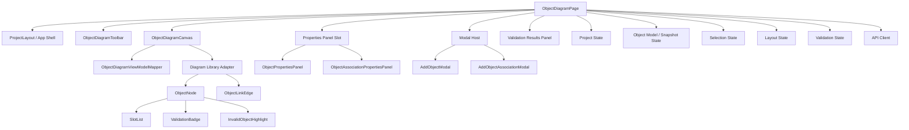
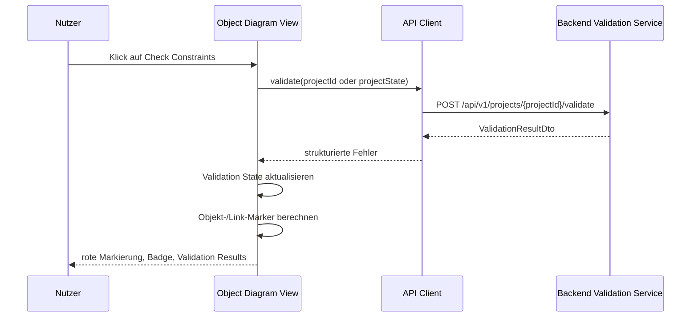

# Object Diagram Component

## Zweck dieser Datei

Diese Datei beschreibt Konzept, Anforderungen und Komponentenstruktur der `Object Diagram View` des neuen React/TypeScript-Frontends. Sie konkretisiert, wie Snapshot-Daten in der Weboberfläche angezeigt, bearbeitet und mit Validierungsergebnissen verbunden werden.

Die Object Diagram View ist keine eigenständige fachliche Validierungsinstanz. Sie zeigt und bearbeitet Objektinstanzen, Slot-Werte und Objektlinks, während das Backend die fachliche Prüfung von Typen, Links, Multiplizitäten und OCL-Invarianten übernimmt.

## Relevante Screenshots

Die folgenden Screenshots zeigen die Zielstruktur der Object Diagram View, die Objekt- und Link-Properties sowie die Fehlerdarstellung nach einem Constraint Check.

| Screenshot | Vorschau | Relevante Beobachtung |
|---|---|---|
| `06-object-diagram-object-properties.png` |  | Objekt ist im Diagramm selektiert; rechts erscheinen Objektname, Typ und Slot-Werte. |
| `07-object-diagram-validation-error.png` |  | Fehlerhaftes Objekt wird mit rotem Rahmen und Badge markiert; Validation Results zeigen Details. |
| `11-modal-add-object-association.png` |  | Modal zum Erstellen eines Objektlinks zwischen zwei Objektinstanzen. |
| `12-object-diagram-association-properties.png` |  | Objektlink ist selektiert; Properties Panel zeigt Association, Source Object und Target Object. |

## Rolle der Object Diagram View

Die Object Diagram View visualisiert einen konkreten Snapshot eines UML-Modells. Während das Klassendiagramm die Typstruktur definiert, zeigt das Objektdiagramm konkrete Objektinstanzen, deren Attributwerte und Links.

Im MVP muss die View folgende Aufgaben erfüllen:

- Objektinstanzen als Karten anzeigen.
- Objektnamen und Typen anzeigen, zum Beispiel `alice : User`.
- Slot-Werte anzeigen und über das Properties Panel bearbeitbar machen.
- Objektlinks als Linien zwischen Objekten anzeigen.
- Link Labels und zugehörige Association sichtbar machen.
- Association-Name mittig auf dem Objektlink anzeigen.
- Rollen bzw. Endinformationen an beiden Link-Enden anzeigen, soweit sie aus der zugrundeliegenden UML-Association ableitbar sind.
- Objekte und Links auswählen.
- Das Properties Panel abhängig von der aktuellen Selektion aktualisieren.
- Objektlinks über ein Modal hinzufügen.
- Fehlerhafte Objekte visuell markieren.
- Fehler-Badges an Objekten anzeigen.
- Klicks aus dem Validation Results Panel auf betroffene Objekte oder Links abbilden.
- Objektpositionen und Viewport als Layoutdaten speichern.

Die View hängt fachlich vom Klassendiagramm ab: Objekttypen stammen aus `UmlClass`, Slot-Strukturen aus `UmlAttribute` und ObjectLinks aus `UmlAssociation`.

## Komponentenübersicht

Die Object Diagram View sollte wie die Class Diagram View als Feature-Modul umgesetzt werden. Die Diagrammbibliothek wird über View Models und Adapter gekapselt, damit fachliche Snapshot-Daten nicht direkt an React-Flow-spezifische Datenstrukturen gebunden werden.



| Komponente | Verantwortung | Wichtige Eingaben | Wichtige Ausgaben |
|---|---|---|---|
| `ObjectDiagramPage` | Orchestriert Snapshot-View, State-Zugriff, API-Aktionen, Modale und Properties Panel. | Projektzustand, Object Model, Selection State, Validation State | Aktualisierte View, API-Kommandos, Auswahländerungen |
| `ObjectDiagramToolbar` | Bietet Aktionen wie Add Object, Add Object Link, Save, Refresh, Check Constraints. | Projektstatus, ausgewählter Snapshot | Modal-Öffnung, Save-/Validate-Aktion |
| `ObjectDiagramCanvas` | Rendert Objektkarten, Objektlinks, Fehlerzustände und Drag & Drop. | Object Diagram View Model, Layoutdaten, Validation Markers | Objekt-/Link-Selektion, Positionsänderungen |
| `ObjectNode` | Zeigt Objektname, Typ und Slot-Werte. | ObjectInstance, UmlClass, Slots, Fehlerstatus | Objektselektion, Drag-Position |
| `SlotList` | Rendert Slot-Werte innerhalb einer Objektkarte. | Slots, Attribute, formatierte Werte | Sichtbare Attributwerte |
| `ObjectLinkEdge` | Zeigt Objektlink zwischen Objektinstanzen mit mittigem Association-Namen und Endlabels aus der zugrundeliegenden Association. | ObjectLink, Association, Link-Enden, Rollen/Multiplizitaeten, Fehlerstatus | Link-Selektion |
| `ValidationBadge` | Zeigt Anzahl oder Status von Fehlern am Objekt. | Validation Markers | Fokus auf Fehlerdetails |
| `InvalidObjectHighlight` | Hebt fehlerhafte Objekte visuell hervor. | Severity, Target IDs | Roter Rahmen oder Fehlerzustand |
| `ObjectPropertiesPanel` | Bearbeitet Objektname, Klasse und Slot-Werte. | Selektiertes Objekt, Klassendefinition | Update-Kommandos |
| `ObjectAssociationPropertiesPanel` | Bearbeitet oder zeigt Objektlinkdetails. | Selektierter ObjectLink, Association, Source/Target Object | Update-Kommandos |
| `AddObjectModal` | Erstellt eine neue Objektinstanz. | Klassenliste, Objektname, optionale Initialwerte | `createObject` |
| `AddObjectAssociationModal` | Erstellt einen neuen Objektlink. | Objektliste, Association-Liste, Source/Target | `createObjectLink` |
| `ObjectDiagramViewModelMapper` | Übersetzt Snapshot, UML-Modell, Layout und Fehler in Nodes/Edges. | Project State, Layout, Validation Results | Diagram Nodes, Diagram Edges |

## Slot-Darstellung

Slots sind konkrete Attributwerte einer Objektinstanz. Sie werden aus der Kombination von `ObjectInstance.slots` und der Klassendefinition der zugehörigen `UmlClass` dargestellt.

MVP-Darstellung:

- Jeder `ObjectNode` zeigt eine Kopfzeile im Format `objectName : ClassName`.
- Darunter werden Slot-Werte zeilenweise dargestellt.
- Die Reihenfolge der Slots folgt im MVP der Attributreihenfolge der Klasse.
- Fehlende Werte werden sichtbar markiert oder als leerer Wert dargestellt.
- Bearbeitung erfolgt primär im `ObjectPropertiesPanel`, nicht direkt im Node.

Beispiel:

```text
alice : User
books = 6
name = "Alice"
```

Slot-Werte müssen typbewusst angezeigt werden:

| Attributtyp | UI-Darstellung | Eingabekontrolle im Properties Panel |
|---|---|---|
| `String` | Text, optional mit Quotes in technischer Ansicht | Textfeld |
| `Integer` | Ganzzahl | Number Input ohne Dezimalstellen |
| `Real` | Dezimalzahl | Number Input mit Dezimalstellen |
| `Boolean` | `true` / `false` | Toggle oder Select |

Die endgültige Typvalidierung erfolgt im Backend. Das Frontend kann nur offensichtliche Eingabefehler vorab verhindern.

## Selektion und Properties Panel

Die Selektion im Objektdiagramm muss zwischen Objekten und Objektlinks unterscheiden. Sie wirkt auf Canvas, Explorer Sidebar, Properties Panel und Validation Results.

| Selektiertes Element | Quelle der Selektion | Properties Panel | Erwartetes Verhalten |
|---|---|---|---|
| Objekt | Klick auf `ObjectNode`, Explorer-Eintrag oder Validation Result | `ObjectPropertiesPanel` | Objekt wird hervorgehoben; Name, Typ und Slot-Werte sind sichtbar. |
| Objektlink | Klick auf `ObjectLinkEdge` oder Explorer-Eintrag | `ObjectAssociationPropertiesPanel` | Link wird hervorgehoben; Association, Source und Target werden sichtbar. |
| Fehlerziel | Klick im Validation Results Panel | Panel abhängig vom Ziel | Betroffenes Objekt oder Link wird fokussiert und selektiert. |
| Kein Element | Klick auf leere Canvas-Fläche | leerer oder projektbezogener Zustand | Properties Panel zeigt Hilfe oder Snapshot-Information. |

Empfohlenes Selection-Modell:

```ts
type ObjectDiagramSelection =
  | { type: "object"; id: string; source?: "canvas" | "explorer" | "validation" }
  | { type: "objectLink"; id: string; source?: "canvas" | "explorer" | "validation" }
  | null;
```

Bei einer Selektion aus Validation Results sollte die View zusätzlich den Canvas auf das Ziel zentrieren und den Fehler im Objekt oder Link temporär hervorheben.

## Objektlink-Erstellung

Der Screenshot `11-modal-add-object-association.png` zeigt ein Modal zum Erstellen eines Objektlinks. Ein Objektlink ist fachlich eine Instanz einer UML-Association zwischen konkreten Objektinstanzen.

MVP-Felder:

| Feld | Beschreibung | Validierung |
|---|---|---|
| Association | UML-Association, auf der der Link basiert | Muss existieren |
| Source Object | Objekt am ersten Association-Ende | Muss zur erwarteten Klasse passen |
| Target Object | Objekt am zweiten Association-Ende | Muss zur erwarteten Klasse passen |
| Label | Optional angezeigter Linkname oder Association-Name | kann abgeleitet werden |

MVP-Ablauf:

1. Nutzer öffnet `AddObjectAssociationModal`.
2. Frontend zeigt auswählbare Associations aus dem UML-Modell.
3. Nach Auswahl einer Association filtert das Frontend passende Source-/Target-Objekte nach Klassentyp.
4. Nutzer bestätigt die Erstellung.
5. Frontend sendet den neuen Link an das Backend oder aktualisiert den Projektzustand.
6. Neuer Link erscheint als `ObjectLinkEdge` im Canvas.
7. Neuer Link wird direkt selektiert und im `ObjectAssociationPropertiesPanel` angezeigt.

Annahme: Im MVP werden nur binäre Associations unterstützt. N-äre Associations oder Assoziationsklassen sind Post-MVP.

## Object Link Edge Layout

Objektlinks muessen visuell dieselbe fachliche Lesbarkeit wie Klassen-Associations bieten. Der Screenshot `12-object-diagram-association-properties.png` zeigt den Association-Namen `Borrows` mittig auf der Linie zwischen `mobyDick : Book` und `alice : User`.

Fuer den MVP gilt:

- `ObjectLinkEdge` ist eine eigene Custom Edge.
- Der zugrundeliegende Association-Name wird mittig auf der Kante gerendert.
- Source-/Target-Endinformationen koennen aus der UML-Association uebernommen werden.
- Rollen und Multiplizitaeten duerfen im Objektdiagramm kompakter dargestellt werden als im Klassendiagramm, muessen aber technisch im Edge-ViewModel verfuegbar sein.
- Link-Selektion und Link-Fehler werden auf derselben Custom Edge dargestellt.
- Bei Drag & Drop von Objekten muessen Mittel- und Endlabels aus den aktuellen Edge-Koordinaten neu positioniert werden.

Empfohlenes Edge-ViewModel:

```ts
export interface ObjectLinkEdgeViewModel {
  id: string;
  objectLinkId: string;
  associationId: string;
  sourceObjectId: string;
  targetObjectId: string;
  associationName: string;
  sourceEnd?: {
    roleName: string;
    multiplicity: string;
  };
  targetEnd?: {
    roleName: string;
    multiplicity: string;
  };
  selected: boolean;
  validationState?: "none" | "warning" | "error";
}
```

## Fehlerhafte Objekte

Der Screenshot `07-object-diagram-validation-error.png` zeigt die zentrale Fehlerdarstellung im Objektdiagramm: ein Objekt wird direkt im Canvas markiert, während das Validation Results Panel die fachliche Erklärung liefert.


MVP-Fehlerdarstellung:

- Fehlerhafte Objekte erhalten einen roten Rahmen.
- Ein Badge zeigt an, dass ein oder mehrere Fehler am Objekt hängen.
- Der Fehlerzustand muss aus strukturierten `ValidationResult`-Daten abgeleitet werden.
- Das Objekt bleibt weiterhin selektierbar und verschiebbar.
- Bei Klick auf einen Fehler im Validation Results Panel wird das Objekt fokussiert.

Mögliche Fehlerquellen:

| Fehlercode | Ursache | UI-Ziel |
|---|---|---|
| `INVALID_SLOT_VALUE` | Slot-Wert passt nicht zum Attributtyp. | Objektkarte und konkretes Slot-Feld |
| `INVALID_LINK` | Objektlink passt nicht zur Association. | Linkkante und beteiligte Objekte |
| `MULTIPLICITY_VIOLATION` | Zu viele oder zu wenige Links. | Betroffene Objekte und Association-Link |
| `INVARIANT_VIOLATION` | OCL-Invariante ist für Kontextobjekt false. | Kontextobjekt und Validation Results |
| `EVALUATION_ERROR` | OCL-Auswertung scheitert für Objekt. | Kontextobjekt und Invariante |

## Validation-Badge

Der `ValidationBadge` ist ein UI-Indikator auf Objektkarten und optional auf Objektlinks.

| Zustand | Darstellung | Bedeutung |
|---|---|---|
| keine Fehler | kein Badge | Objekt ist im letzten Validation Result nicht betroffen. |
| ein Fehler | kleines rotes Badge oder Fehlericon | Objekt hat genau einen relevanten Fehler. |
| mehrere Fehler | Badge mit Anzahl | Objekt hat mehrere Fehler aus dem letzten Check. |
| Warnung | gelbes Badge | Nicht-blockierender Hinweis, falls Backend Severity `WARNING` liefert. |
| fokussierter Fehler | stärkerer Rahmen oder Hervorhebung | Nutzer hat Fehler im Validation Panel ausgewählt. |

Das Badge darf keine eigene fachliche Bewertung durchführen. Es visualisiert ausschließlich Backend-Ergebnisse, die auf `objectId`, `objectLinkId`, `slotId` oder `modelElementId` verweisen.

## Nutzeraktionen

| Aktion | UI-Auslöser | Frontend-Reaktion | Backend-Bezug | MVP |
|---|---|---|---|---|
| Object Diagram öffnen | Tab `Object Diagram` | Snapshot-Daten anzeigen, Object Explorer aktivieren | `GET /api/v1/projects/{projectId}` | Ja |
| Objekt erstellen | Toolbar, Explorer-`+` oder Canvas-Aktion | `AddObjectModal` öffnen, Objekt nach Bestätigung anzeigen | `POST /api/v1/projects/{projectId}/objects` oder Projektspeicherung | Ja |
| Objekt auswählen | Klick auf Node oder Explorer-Eintrag | Selection State setzen, ObjectPropertiesPanel öffnen | keiner, solange nicht gespeichert wird | Ja |
| Objekt verschieben | Drag & Drop im Canvas | Layout State aktualisieren | Layout bei Save/Autosave persistieren | Ja |
| Slot-Wert bearbeiten | ObjectPropertiesPanel | Wert lokal ändern und Save ermöglichen | Objekt-/Projektupdate | Ja |
| Objektlink erstellen | Toolbar oder Explorer-`+` bei Associations | `AddObjectAssociationModal` öffnen, Edge erzeugen | `POST /api/v1/projects/{projectId}/links` | Ja |
| Objektlink auswählen | Klick auf Edge oder Explorer-Eintrag | Selection State setzen, Link-Properties öffnen | keiner | Ja |
| Constraints prüfen | `Check Constraints` Button | API-Aufruf starten, Validation State aktualisieren | `POST /api/v1/projects/{projectId}/validate` | Ja |
| Fehler auswählen | Validation Results Panel | Betroffenes Objekt oder Link fokussieren | Ergebnisdaten aus Backend | Ja |
| Fehler korrigieren | Slot oder Link ändern | Fehler bleibt bis zur erneuten Validierung sichtbar oder wird als stale markiert | erneuter Constraint Check | Ja |

## Datenbedarf

Die Object Diagram View benötigt Snapshot-Daten, zugehörige UML-Typdaten, Layoutdaten und Validierungsergebnisse.

| Datenbereich | Benötigte Daten | Quelle | Verwendung |
|---|---|---|---|
| Projekt | `projectId`, Name, Version, Dirty State | Backend DTO / Frontend State | Laden, Speichern, Toolbar |
| UML-Klassen | `id`, `name`, Attribute | `UmlModelDto` | Objekttypen und Slot-Struktur |
| UML-Associations | `id`, Name, Endklassen, Rollen | `UmlModelDto` | Zulässige Objektlinks und Labels |
| Object Model | Snapshot-ID, Name, Objekte, Links | `ObjectModelDto` | Hauptdaten der View |
| ObjectInstance | `id`, `name`, `classId`, Slots | Object Model | Objektkarten |
| Slot | `id`, `attributeId`, `value`, `valueType`, optional `isUnset` | ObjectInstance | Slot-Liste und Properties Panel |
| ObjectLink | `id`, `associationId`, Endobjekte | Object Model | Link-Edges |
| Layout | Objektpositionen, Linkhinweise, Viewport | Layout State / Projektformat | Canvas-Rendering und Speicherung |
| Validation Results | Fehlercodes, Severity, Targets | Backend Validation API | Markierungen, Badges, Fokusnavigation |
| UI State | Selektion, Modalzustand, Ladezustand | Frontend State | Interaktion und Feedback |

## API-Interaktionen

Die View sollte API-Aufrufe über einen Feature-Service kapseln. Komponenten rufen keine HTTP-Endpunkte direkt auf.

| Zweck | Möglicher Endpoint | Request-Inhalt | Response |
|---|---|---|---|
| Projekt/Snapshot laden | `GET /api/v1/projects/{projectId}` | Projekt-ID | Vollständiges `ProjectDto` |
| Objekt erstellen | `POST /api/v1/projects/{projectId}/objects` | Name, `classId`, optionale Slots, Position | Neues Objekt oder aktualisiertes Projekt |
| Objekt aktualisieren | `PUT /api/v1/projects/{projectId}/objects/{objectId}` | Name, Slots, optional `classId` | Aktualisiertes Objekt |
| Objektlink erstellen | `POST /api/v1/projects/{projectId}/links` | `associationId`, Source/Target Object IDs | Neuer ObjectLink |
| Objektlink aktualisieren | `PUT /api/v1/projects/{projectId}/links/{linkId}` | Association oder Endobjekte | Aktualisierter Link |
| Objektlink löschen | `DELETE /api/v1/projects/{projectId}/links/{linkId}` | Link-ID | Erfolgsstatus oder Projekt |
| Projekt speichern | `PUT /api/v1/projects/{projectId}` | Projektzustand inklusive Layout | Aktualisiertes Projekt |
| Constraints prüfen | `POST /api/v1/projects/{projectId}/validate` | Projekt-ID oder aktueller Projektzustand | `ValidationResultDto` |

Feature-Service-Beispiel:

```ts
interface ObjectDiagramActions {
  createObject(input: CreateObjectInput): Promise<void>;
  updateObject(input: UpdateObjectInput): Promise<void>;
  updateSlot(input: UpdateSlotInput): Promise<void>;
  createObjectLink(input: CreateObjectLinkInput): Promise<void>;
  updateObjectLink(input: UpdateObjectLinkInput): Promise<void>;
  deleteObjectLink(linkId: string): Promise<void>;
  saveLayout(input: SaveObjectDiagramLayoutInput): Promise<void>;
  checkConstraints(): Promise<void>;
  focusValidationTarget(target: ValidationTarget): void;
}
```

## State Management

Die Object Diagram View verwendet mehrere getrennte State-Bereiche. Fachlicher Projektzustand, abgeleitetes Diagramm-View-Model und UI-Zustände dürfen nicht vermischt werden.

| State | Inhalt | Persistenz | Bemerkung |
|---|---|---|---|
| Project State | UML-Modell, Object Model, Invarianten, Layout | Backend/Projektformat | Fachliche Hauptquelle. |
| Snapshot State | aktueller Object Model Zustand | Teil des Project State | Kann später mehrere Snapshots unterstützen. |
| Object Diagram View Model | Nodes und Edges für Diagrammbibliothek | abgeleitet | Wird aus Object Model, UML Model, Layout und Validation Results berechnet. |
| Selection State | aktuell selektiertes Objekt oder Link | lokal/UI | Synchronisiert Canvas, Explorer, Panel und Fehlernavigation. |
| Layout State | Objektpositionen, Viewport, optional Link-Routing | Backend/Projektformat | Fachlich nicht semantisch. |
| Validation State | letzte Ergebnisse und Target-Mapping | temporär oder optional persistiert | Grundlage für Badges und Markierungen. |
| Modal State | geöffnetes Modal und Formulardaten | lokal/UI | Keine fachliche Quelle. |
| Async State | Lade-, Speicher- und Validierungsstatus | lokal/UI | Button-Zustände und Fehlermeldungen. |

Beispiel für ein abgeleitetes View Model:

```ts
type ObjectDiagramNode = {
  id: string;
  type: "object";
  position: { x: number; y: number };
  data: {
    objectId: string;
    objectName: string;
    classId: string;
    className: string;
    slots: SlotViewModel[];
    validationMarkers: ValidationMarker[];
  };
};
```

## Layout-Speicherung

Layoutdaten des Objektdiagramms gehören nicht zur fachlichen Snapshot-Semantik, sind aber für die Weboberfläche wichtig. Sie sollten getrennt vom Object Model gespeichert werden und über stabile IDs auf Objekte und Links verweisen.

MVP-Regeln:

- Jede Objektinstanz erhält eine persistierbare Position.
- Drag & Drop aktualisiert zunächst lokalen Layout State.
- Beim Speichern wird das Layout mit dem Projektformat oder als Layout-Patch persistiert.
- Neu erstellte Objekte erhalten eine Position im sichtbaren Canvas.
- Gelöschte Objekte entfernen zugehörige Layoutdaten und abhängige Link-Layoutdaten.
- Der Viewport kann optional gespeichert werden.

Beispiel:

```json
{
  "layout": {
    "objectDiagram": {
      "nodes": {
        "object-alice": { "x": 160, "y": 100 },
        "object-moby-dick": { "x": 460, "y": 140 }
      },
      "viewport": {
        "x": 0,
        "y": 0,
        "zoom": 1
      }
    }
  }
}
```

## Validierungsbezug

Die Object Diagram View ist der wichtigste Ort für die visuelle Darstellung von Validierungsfehlern. Fehler aus UML-Struktur, Objektzustand, Objektlinks, Multiplizitäten und OCL-Invarianten müssen auf konkrete UI-Elemente abbildbar sein.



| Fehlerart | Target aus Backend | Darstellung in Object Diagram View |
|---|---|---|
| `INVALID_SLOT_VALUE` | `objectId`, `slotId`, `attributeId` | Objektkarte markieren, Slot im Panel hervorheben |
| `INVALID_LINK` | `objectLinkId`, beteiligte `objectIds` | Linkkante markieren, beteiligte Objekte optional markieren |
| `MULTIPLICITY_VIOLATION` | `associationId`, `objectIds`, optional `objectLinkIds` | Objekt-Badge und Link-/Association-Hinweis |
| `INVARIANT_VIOLATION` | `invariantId`, `contextObjectId` | Kontextobjekt rot markieren, Badge anzeigen |
| `EVALUATION_ERROR` | `invariantId`, `contextObjectId`, optional OCL-Pfad | Kontextobjekt und Validation Results markieren |

Beispiel für ein Validation Result:

```json
{
  "valid": false,
  "errors": [
    {
      "code": "INVARIANT_VIOLATION",
      "severity": "ERROR",
      "message": "Invariant maxBooks is violated for alice : User.",
      "targets": [
        {
          "elementType": "OBJECT",
          "elementId": "object-alice"
        },
        {
          "elementType": "INVARIANT",
          "elementId": "inv-max-books"
        }
      ],
      "context": {
        "objectId": "object-alice",
        "classId": "class-user",
        "invariantId": "inv-max-books"
      }
    }
  ]
}
```

## MVP-Anforderungen

| ID | Anforderung | Priorität | Screenshot-Bezug |
|---|---|---|---|
| `OD-MVP-001` | Objektinstanzen werden als Karten mit Name und Typ angezeigt. | MVP | `06-object-diagram-object-properties.png` |
| `OD-MVP-002` | Slot-Werte werden in der Objektkarte angezeigt. | MVP | `06-object-diagram-object-properties.png` |
| `OD-MVP-003` | Selektion eines Objekts aktualisiert das Properties Panel. | MVP | `06-object-diagram-object-properties.png` |
| `OD-MVP-004` | Slot-Werte können im Properties Panel bearbeitet werden. | MVP | `06-object-diagram-object-properties.png` |
| `OD-MVP-005` | Objektlinks werden als Linien zwischen Objekten angezeigt; der Association-Name steht mittig auf der Linie. | MVP | `12-object-diagram-association-properties.png` |
| `OD-MVP-006` | Nutzer kann Objektlinks über ein Modal erstellen. | MVP | `11-modal-add-object-association.png` |
| `OD-MVP-007` | Selektion eines Objektlinks aktualisiert das Properties Panel. | MVP | `12-object-diagram-association-properties.png` |
| `OD-MVP-008` | Fehlerhafte Objekte werden rot markiert. | MVP | `07-object-diagram-validation-error.png` |
| `OD-MVP-009` | Fehlerhafte Objekte zeigen einen Badge. | MVP | `07-object-diagram-validation-error.png` |
| `OD-MVP-010` | Klick auf Validation Result fokussiert betroffenes Objekt oder Link. | MVP | `07-object-diagram-validation-error.png` |
| `OD-MVP-011` | Objekte können per Drag & Drop verschoben werden. | MVP | aus Diagramm-Canvas abgeleitet |
| `OD-MVP-012` | Objektdiagramm-Layout kann gespeichert und wieder geladen werden. | MVP | aus Diagramm-Canvas und Projektformat abgeleitet |
| `OD-MVP-013` | Objektanlage wird unterstützt, auch wenn kein Screenshot für das Modal vorliegt. | MVP | fachliche Ableitung aus MVP-Workflow |
| `OD-MVP-014` | Object Links nutzen eine Custom Edge, die mittige Labels, Endinformationen, Selektion und Fehlerzustand tragen kann. | MVP | `12-object-diagram-association-properties.png`, fachliche UML-Anforderung |

## Post-MVP-Erweiterungen

| Erweiterung | Beschreibung | Abhängigkeit |
|---|---|---|
| Mehrere Snapshots | Nutzer kann zwischen mehreren Objektzuständen wechseln. | erweitertes Project/Object Model |
| Inline-Slot-Editing | Slot-Werte direkt im ObjectNode bearbeiten. | robustes Form- und Validation-State-Handling |
| Quick Fixes | Fehler aus Validation Results direkt korrigieren. | Error Model, UI-Aktionen |
| Automatische Linkvorschläge | Nur fachlich passende ObjectLinks anbieten. | UML-/Snapshot-Service |
| Auto Layout | Snapshot automatisch anordnen. | Diagrammbibliothek oder Layout-Engine |
| Link-Routing | Bendpoints und Labelpositionen speichern. | erweitertes Layoutmodell |
| Objekt-Templates | Neue Objekte mit Default-Slots erzeugen. | Typmodell, init values Post-MVP |
| Snapshot-Diff | Zwei Snapshots vergleichen. | mehrere Snapshots, Versionierung |
| Undo/Redo | Objekt- und Layoutänderungen rückgängig machen. | State Management |

## Offene Fragen

| Frage | Bedeutung |
|---|---|
| Wie genau wird ein neues Objekt erstellt, da kein AddObject-Screenshot vorliegt? | `AddObjectModal` ist für den MVP fachlich notwendig. |
| Dürfen Objekttypen nachträglich geändert werden? | Kann Slots und bestehende Links ungültig machen. |
| Müssen alle Attribute einer Klasse immer als Slots vorhanden sein? | Beeinflusst Snapshot-Validierung und UI-Darstellung. |
| Wie werden fehlende oder `null`-artige Werte angezeigt? | Wichtig für OCL-Auswertung und Fehlermeldungen. |
| Werden Fehler nach einer lokalen Änderung sofort ausgeblendet oder als veraltet markiert? | Beeinflusst Validation State und Nutzerverständnis. |
| Wie werden mehrere Fehler an einem Objekt priorisiert? | Beeinflusst Badge-Anzahl, Farbe und Tooltip. |
| Soll ein Objektlink im MVP bearbeitbar oder nur löschbar und neu erstellbar sein? | Beeinflusst `ObjectAssociationPropertiesPanel`. |
| Wie stark filtert das Frontend im AddObjectAssociationModal zulässige Source-/Target-Objekte? | Frontend kann helfen, Backend bleibt fachliche Wahrheit. |

## Zusammenfassung

Die Object Diagram View bildet den konkreten Snapshot eines UML-Modells ab. Sie zeigt Objektinstanzen, Slot-Werte und Objektlinks und macht dadurch die spätere OCL- und Constraint-Validierung für Nutzer nachvollziehbar.

Für den MVP muss die View Objektkarten, Slot-Anzeige, Objektlink-Erstellung, Properties Panels, Drag & Drop, Layout-Speicherung und die visuelle Fehlerdarstellung unterstützen. Die wichtigste Aufgabe der View ist das Mapping strukturierter Backend-Validation-Results auf konkrete Objekte, Links und Slots im Diagramm.
