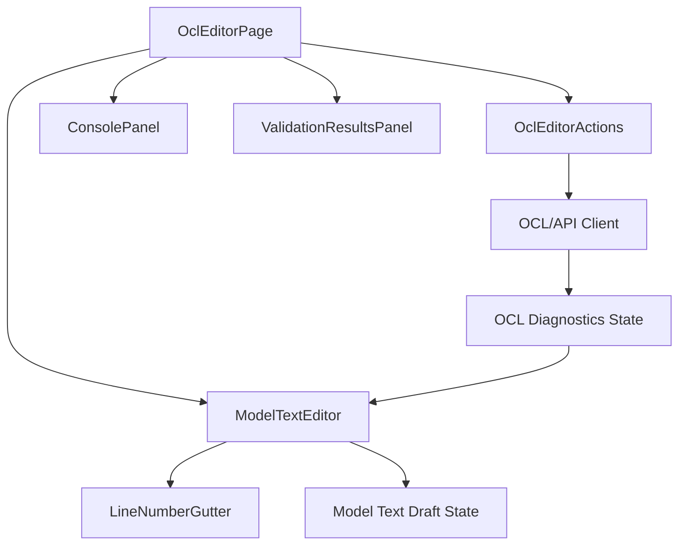

# OCL Editor UI

## Zweck dieser Datei

Diese Datei beschreibt die Benutzeroberfläche für OCL-Invarianten und den `OCL Editor` des neuen React/TypeScript-Frontends. Sie legt fest, wie Nutzer Invarianten formularbasiert erstellen und zusätzlich den textbasierten Modell-/OCL-Editor verwenden können.

Das Frontend stellt OCL-Ausdrücke dar, verwaltet Eingaben und zeigt Diagnosen an. Es ersetzt keine fachliche OCL-Engine. Syntaxprüfung, Typechecking, Evaluation und Constraint Validation liegen im Backend.

## Rolle von OCL im Frontend

OCL ist im Zielsystem die fachliche Sprache für Constraints auf UML-Modellen und Snapshots. Im MVP konzentriert sich die UI auf OCL-Invarianten, die einer Kontextklasse zugeordnet sind und gegen Objektinstanzen dieser Klasse geprüft werden.

Die Frontend-Verantwortung umfasst:

- OCL-Invarianten erfassen und bearbeiten.
- Kontextklasse und Invariantennamen verwalten.
- OCL-Ausdruck als lesbare, editierbare Eingabe anzeigen.
- OCL-Ausdruck speichern.
- optionale Backend-Prüfungen für Parse und Typecheck auslösen.
- Backend-Diagnosen verständlich anzeigen.
- `Check Constraints` auslösen.
- Validation Results auf Invarianten, OCL-Ausdrücke und betroffene Diagrammelemente mappen.

Nicht zur Frontend-Verantwortung gehört:

- vollständige OCL-Syntaxanalyse,
- vollständiges OCL-Typechecking,
- OCL-Evaluation gegen Snapshots,
- eigenständige fachliche Entscheidung, ob eine Invariante erfüllt ist.

## Relevante Screenshots

| Screenshot | Vorschau | Relevante Beobachtung |
|---|---|---|
| `03-class-diagram-invariant-properties.png` |  | Eine Invariante ist im Klassendiagramm selektiert; das Properties Panel zeigt Name und OCL-Ausdruck. |
| `09-modal-add-invariant.png` |  | Modal zum Erstellen einer Invariante mit Kontextklasse, Name und OCL Expression. |
| `07-object-diagram-validation-error.png` |  | Ergebnis einer OCL-/Constraint-Prüfung wird textuell im Validation Results Panel und visuell im Diagramm angezeigt. |
| `13-ocl-editor.png` |  | Zentrale OCL Editor View mit textuellem USE-/OCL-Modell, Zeilennummern, `Apply Changes`, `Check Constraints`, Save/Refresh und Console. |

Hinweis: `13-ocl-editor.png` ist vorhanden und konkretisiert den OCL Editor als textbasierte Modell-/OCL-Arbeitsansicht.

## Add Invariant Modal

Das `AddInvariantModal` ist der Einstieg zum Erstellen einer neuen OCL-Invariante. Es wird typischerweise aus der Class Diagram View, der Explorer Sidebar oder dem OCL Editor geöffnet.

MVP-Felder:

| Feld | Zweck | UI-Verhalten | Backend-Relevanz |
|---|---|---|---|
| Context Class | Klasse, gegen deren Instanzen die Invariante geprüft wird. | Select mit vorhandenen UML-Klassen. | Definiert `contextClassId` und den Typ von `self`. |
| Invariant Name | Fachlicher Name der Invariante. | Textfeld, Pflichtfeld. | Wird als stabile Referenz und Fehlermeldung verwendet. |
| OCL Expression | Ausdruck der Invariante. | Mehrzeiliges Monospace-Feld. | Wird durch Parser, Typechecker und Evaluator verarbeitet. |
| Add Invariant | Bestätigt die Anlage. | Aktiv, wenn Pflichtfelder gefüllt sind. | Erstellt `UmlInvariant`. |

Beispiel:

```ocl
self.books <= 5
```

MVP-Verhalten:

1. Nutzer öffnet `AddInvariantModal`.
2. Nutzer wählt eine Kontextklasse, etwa `User`.
3. Nutzer vergibt einen Namen, etwa `maxBooks`.
4. Nutzer erfasst einen OCL-Ausdruck.
5. Frontend prüft lokale Pflichtfelder.
6. Nach Bestätigung wird die Invariante gespeichert.
7. Die neue Invariante erscheint im Explorer, an der Kontextklasse und im OCL Editor.
8. Optional wird nach dem Speichern ein Backend-Parse- oder Typecheck ausgelöst.

## Invariant Properties Panel

Das `InvariantPropertiesPanel` zeigt und bearbeitet eine selektierte Invariante. Es wird genutzt, wenn eine Invariante im Klassendiagramm, im Explorer oder im OCL Editor ausgewählt wird.

Pflichtinhalte:

| Bereich | Inhalt | MVP |
|---|---|---|
| Name | `invariant.name`, zum Beispiel `maxBooks` | Ja |
| Context Class | Klasse, gegen deren Instanzen ausgewertet wird | Ja |
| OCL Expression | editierbarer Ausdruck | Ja |
| Status | letzte Diagnose oder Validierungsstatus | Ja |
| Actions | Save, optional Parse/Typecheck | Ja/Should |

Das Panel sollte Änderungen zunächst als Draft behandeln. Dadurch kann die UI anzeigen, dass gespeicherte Validation Results möglicherweise nicht mehr zum aktuellen Ausdruck passen.

Beispiel für Draft-State:

```ts
type OclDraftState = {
  invariantId: string;
  name: string;
  contextClassId: string;
  expression: string;
  dirty: boolean;
  diagnostics: OclDiagnosticViewModel[];
};
```

## OCL Editor View

Der Top-Bereich der Anwendung enthält einen eigenen Tab `OCL Editor`. Screenshot `13-ocl-editor.png` macht diese View zu einer vollwertigen MVP-Hauptansicht und nicht nur zu einer Ergänzung des Properties Panels.

Entscheidung: Der OCL Editor zeigt und bearbeitet den gesamten Modelltext einer `.use`-Datei. Diese Entscheidung folgt aus den Originalbeispielen unter `examples/`, z. B. `examples/Documentation/Imports/LibraryManagement.use` und `examples/Others/Student/Student.use`, die vollständige Modelltexte mit `model`, `class`, `attributes`, `association`, `constraints`, `import` oder Vererbung enthalten. Im MVP darf die fachliche Verarbeitung dennoch auf den definierten UML/OCL-Subset begrenzt sein.

Empfohlene MVP-Struktur:



| Komponente | Verantwortung | MVP |
|---|---|---|
| `OclEditorPage` | Container für textuellen Modell-/OCL-Editor, Aktionen, Console und Validation Results. | Ja |
| `ModelTextEditor` | Eingabe und Anzeige von USE-ähnlichem Modell-/OCL-Text. | Ja |
| `LineNumberGutter` | Zeilennummern für Orientierung und Fehlerpositionen. | Ja |
| `ApplyChangesButton` | Übernimmt Editoränderungen in Projektzustand oder Backend. | Ja |
| `OclDiagnosticsPanel` | Zeigt Syntax-, Typ- und Validierungsdiagnosen. | Ja |
| `OclEditorActions` | Apply Changes, Save, Parse/Typecheck, Check Constraints. | Ja |
| `OclReferenceContextPanel` | Zeigt verfügbare Klassen, Attribute, Rollen und primitive Typen. | Should |

Der OCL Editor sollte mit der Class Diagram View synchronisiert sein: Auswahl einer Invariante im Klassendiagramm kann den OCL Editor auf dieselbe Invariante fokussieren.

MVP-Layoutentscheidung:

| Layoutbereich | Inhalt | Verhalten |
|---|---|---|
| Haupteditor | USE-ähnlicher Modell-/OCL-Text mit Zeilennummern | Änderung erzeugt Draft State |
| Obere Aktionen | `Apply Changes`, `Check Constraints`, Save/Refresh | Aktionen synchronisieren Projektzustand/API |
| Bottom Panel | Console und Validation Results | Console protokolliert Modellereignisse; Fehler referenzieren Textposition und IDs |
| Diagnosebereich | Parse-, Typecheck- und Validation-Diagnosen | Fehler referenzieren `invariantId`, Modell-ID und optional Zeile/Spalte |

## Kontextklasse und Invariant Name

Jede Invariante benötigt eine Kontextklasse. Diese Kontextklasse definiert, worauf sich `self` im OCL-Ausdruck bezieht.

Beispiel:

```ocl
context User inv maxBooks:
  self.books <= 5
```

Im Frontend kann der Ausdruck intern getrennt gespeichert werden:

```json
{
  "id": "inv-user-max-books",
  "name": "maxBooks",
  "contextClassId": "class-user",
  "expression": "self.books <= 5",
  "enabled": true
}
```

UI-Regeln:

- Kontextklasse wird aus vorhandenen UML-Klassen gewählt.
- `self` wird im UI nicht als frei konfigurierbarer Name behandelt.
- Invariant Name ist Pflicht.
- Name sollte innerhalb einer Kontextklasse eindeutig sein.
- Änderung der Kontextklasse kann den OCL-Ausdruck typungültig machen und sollte einen neuen Typecheck erforderlich machen.

## OCL Expression Input

Das `OclExpressionInput` ist die zentrale Eingabekomponente für OCL-Ausdrücke. Im MVP reicht ein robustes, mehrzeiliges Monospace-Textfeld oder ein einfacher Code-Editor. Ein vollständiger IDE-Editor ist Post-MVP.

MVP-Anforderungen:

| Anforderung | Beschreibung |
|---|---|
| Monospace-Schrift | OCL-Ausdrücke müssen gut lesbar sein. |
| Mehrzeilige Eingabe | Längere Invarianten müssen erfasst werden können. |
| Pflichtfeldprüfung | Leerer Ausdruck wird lokal markiert. |
| Diagnoseanzeige | Backend-Fehler werden unterhalb oder neben dem Feld angezeigt. |
| Draft-Erkennung | ungespeicherte Änderungen werden sichtbar. |
| Kontextanzeige | Kontextklasse und Bedeutung von `self` müssen erkennbar sein. |

MVP-OCL-Subset, das die UI unterstützen und dokumentieren sollte:

| Sprachbestandteil | Beispiel |
|---|---|
| `self` | `self.books` |
| Attributzugriff | `self.name <> ''` |
| einfache Association Navigation | `self.borrowedBooks` |
| Literale | `'Moby Dick'`, `5`, `5.5`, `false` |
| Vergleichsoperatoren | `=`, `<>`, `<`, `<=`, `>`, `>=` |
| Boolean-Operatoren | `and`, `or`, `not` |
| Klammern | `(self.books <= 5) and self.active` |
| Collection `size` | `self.borrowedBooks->size() <= 5` |
| Collection `isEmpty` | `self.borrowedBooks->isEmpty()` |
| Collection `notEmpty` | `self.borrowedBooks->notEmpty()` |

## Syntax- und Typecheck-Feedback

Das Frontend zeigt OCL-Diagnosen an, erzeugt sie aber nicht fachlich selbst. Die Diagnosequelle ist das Backend.

Lokale UI-Vorvalidierung im MVP:

- Kontextklasse fehlt.
- Invariant Name fehlt.
- OCL Expression ist leer.
- Ausdruck enthält nur Whitespace.
- Speichern läuft bereits.

Backend-Diagnosen:

| Diagnose | Quelle | UI-Darstellung |
|---|---|---|
| `SYNTAX_ERROR` | Lexer/Parser | Fehlermeldung am OCL-Feld, optional Source Range. |
| `TYPE_ERROR` | Typechecker | Meldung mit erwartetem und gefundenem Typ. |
| `UNKNOWN_ATTRIBUTE` | Typechecker | Hinweis auf unbekanntes Attribut oder Rolle. |
| `UNKNOWN_CLASS` | Modellprüfung | Kontextklasse oder referenzierter Typ fehlt. |
| `EVALUATION_ERROR` | Evaluator | Fehler beim Auswerten gegen Snapshot. |
| `INVARIANT_VIOLATION` | Validation Service | Invariante ist syntaktisch gültig, aber für Objekt false. |

Post-MVP kann Source-Range-Markierung ergänzt werden:

```json
{
  "code": "TYPE_ERROR",
  "message": "Operator <= cannot be applied to String and Integer.",
  "range": {
    "startLine": 1,
    "startColumn": 6,
    "endLine": 1,
    "endColumn": 16
  }
}
```

## Backend-Integration

Die OCL UI kommuniziert über den API Client mit dem Backend. Komponenten rufen keine HTTP-Endpunkte direkt auf.

| Aktion | Endpoint | MVP-Relevanz | Zweck |
|---|---|---|---|
| Invariante erstellen | `POST /api/v1/projects/{projectId}/invariants` | MVP | Kontextklasse, Name und Ausdruck speichern. |
| Invariante aktualisieren | `PUT /api/v1/projects/{projectId}/invariants/{invariantId}` | MVP | Name, Kontextklasse oder Ausdruck ändern. |
| Invariante löschen | `DELETE /api/v1/projects/{projectId}/invariants/{invariantId}` | MVP | Invariante entfernen. |
| OCL parse prüfen | `POST /api/v1/projects/{projectId}/ocl/parse` | Should | Syntaxdiagnosen ohne vollständige Validierung. |
| OCL typecheck prüfen | `POST /api/v1/projects/{projectId}/ocl/typecheck` | Should | Ausdruck gegen UML-Modell prüfen. |
| OCL evaluate prüfen | `POST /api/v1/projects/{projectId}/ocl/evaluate` | Later | Debug-Auswertung gegen konkretes Objekt. |
| Constraints prüfen | `POST /api/v1/projects/{projectId}/validate` | MVP | UML-, Snapshot-, Multiplicity- und OCL-Validierung. |

Beispiel-Request für Parse/Typecheck:

```json
{
  "contextClassId": "class-user",
  "expression": "self.books <= 5",
  "invariantId": "inv-user-max-books"
}
```

Beispiel-Response:

```json
{
  "status": "OK",
  "resultType": "Boolean",
  "diagnostics": []
}
```

## Validation Results Mapping

OCL-Fehler und Invariantverletzungen müssen auf UI-Elemente zurückgeführt werden können.

| Backend-Ziel | Frontend-Ziel | UI-Reaktion |
|---|---|---|
| `invariantId` | Explorer Invariants, InvariantBadge, OCL Editor Textposition | Invariante markieren und Diagnose anzeigen. |
| `contextClassId` | Class Diagram Node | Kontextklasse hervorheben. |
| `objectId` | Object Diagram Node | Objekt rot markieren und Badge anzeigen. |
| `objectLinkId` | ObjectLinkEdge | Link markieren. |
| `expressionRange` | OCL Expression Input oder ModelTextEditor | Textstelle markieren, Post-MVP. |

Beispiel für eine Invariantverletzung:

```json
{
  "code": "INVARIANT_VIOLATION",
  "severity": "ERROR",
  "message": "Invariant maxBooks is violated for object alice.",
  "invariantId": "inv-user-max-books",
  "context": {
    "classId": "class-user",
    "objectId": "object-alice",
    "expression": "self.books <= 5"
  }
}
```

Erwartete UI-Reaktion:

1. `ValidationResultsPanel` zeigt den Fehler.
2. Explorer oder Invariant Badge markiert `maxBooks`.
3. `OclEditorView` zeigt den betroffenen Modell-/OCL-Text und optional die Textposition.
4. `Object Diagram View` markiert `alice : User`.
5. Klick auf den Fehler fokussiert das Objekt oder die Invariante abhängig vom gewählten Kontext.

## MVP-Anforderungen

| ID | Anforderung | Priorität | Screenshot-Bezug |
|---|---|---|---|
| `OCL-MVP-001` | Nutzer kann eine Invariante mit Kontextklasse, Name und OCL-Ausdruck erstellen. | MVP | `09-modal-add-invariant.png` |
| `OCL-MVP-002` | Invariante kann im Properties Panel angezeigt und bearbeitet werden. | MVP | `03-class-diagram-invariant-properties.png` |
| `OCL-MVP-003` | OCL Editor Tab stellt einen textuellen Modell-/OCL-Editor mit `Apply Changes`, Console und Diagnosen bereit. | MVP | Screenshot `13-ocl-editor.png` |
| `OCL-MVP-004` | OCL-Ausdruck kann gespeichert werden. | MVP | `03-class-diagram-invariant-properties.png` |
| `OCL-MVP-005` | UI zeigt lokale Pflichtfeldfehler für Kontextklasse, Name und Ausdruck. | MVP | `09-modal-add-invariant.png` |
| `OCL-MVP-006` | Backend-Diagnosen für Syntax- und Typfehler können angezeigt werden. | MVP | fachliche Ableitung |
| `OCL-MVP-007` | Check Constraints startet Backend-Validierung. | MVP | `07-object-diagram-validation-error.png` |
| `OCL-MVP-008` | Invariantverletzungen erscheinen im Validation Results Panel. | MVP | `07-object-diagram-validation-error.png` |
| `OCL-MVP-009` | Invariantverletzungen können auf betroffene Objekte im Diagramm gemappt werden. | MVP | `07-object-diagram-validation-error.png` |
| `OCL-MVP-010` | Frontend ersetzt keine OCL Engine und behandelt Backend-Ergebnisse als fachliche Wahrheit. | MVP | Architekturentscheidung |

## Post-MVP-Erweiterungen

| Erweiterung | Beschreibung | Abhängigkeit |
|---|---|---|
| Syntax Highlighting | OCL-Schlüsselwörter, Literale, Navigation und Operatoren hervorheben. | Editor-Bibliothek, Tokenisierung |
| Autocomplete | Vorschläge für Attribute, Rollen, Operationen und OCL-Keywords. | UML-Modell, Typechecker API |
| Live Parse | Automatische Syntaxprüfung nach kurzer Eingabepause. | `ocl/parse`, Debouncing |
| Live Typecheck | Typfeedback ohne vollständigen Constraint Check. | `ocl/typecheck`, stabiles Error Model |
| Source-Range-Markierung | Fehler an konkreter Textstelle markieren. | Backend liefert Positionen |
| Evaluation Trace | Erklärung, warum eine Invariante false ergibt. | Evaluator Trace API |
| Quick Fixes | Vorschläge für häufige Fehler, etwa unbekanntes Attribut. | Diagnosemodell |
| Erweiterter Sprachumfang | `forAll`, `exists`, `select`, `collect`, `let`, `if-then-else`, `allInstances`. | OCL Engine Erweiterungen |
| Weitere OCL-Arten | pre/post conditions, derived attributes, init values. | Domain Model und Backend |

## UX für OCL-Fehler

OCL-Fehler müssen verständlich sein, ohne Nutzer mit Backend-Details zu überladen.

UX-Regeln:

- Fehler sollen immer eine nutzerlesbare Meldung besitzen.
- Technische Details können aufklappbar oder in der Console erscheinen.
- Syntax- und Typecheck-Fehler werden direkt am OCL-Ausdruck angezeigt.
- Invariantverletzungen werden im Validation Results Panel und im Objektdiagramm angezeigt.
- Nach Änderung eines OCL-Ausdrucks sollten alte Validation Results als veraltet markiert werden.
- `Check Constraints` sollte während der Ausführung einen Ladezustand anzeigen und doppelte parallele Checks verhindern.

Beispiel für nutzernahe Meldungen:

| Fehler | Nutzernahe Meldung |
|---|---|
| `SYNTAX_ERROR` | Der OCL-Ausdruck ist syntaktisch unvollständig. |
| `TYPE_ERROR` | Der Ausdruck vergleicht Werte mit nicht passenden Typen. |
| `UNKNOWN_ATTRIBUTE` | Die Kontextklasse besitzt kein Attribut oder keine Rolle mit diesem Namen. |
| `INVARIANT_VIOLATION` | Mindestens ein Objekt verletzt diese Invariante. |

## Offene Fragen

| Frage | Bedeutung |
|---|---|
| Wie vollständig wird `.use` im MVP unterstützt? | Entscheidung: `Apply Changes` bezieht sich auf den gesamten Modelltext. Der MVP-Parser verarbeitet den definierten UML/OCL-Subset und meldet nicht unterstützte Syntax aus Beispielmodellen strukturiert. |
| Werden Parse und Typecheck bereits im MVP separat angeboten oder nur über `Check Constraints` ausgeführt? | Beeinflusst API-Last und UX. |
| Soll beim Speichern einer Invariante automatisch ein Typecheck ausgeführt werden? | Beeinflusst Feedbackgeschwindigkeit. |
| Wie detailliert liefert das Backend Source Ranges für OCL-Fehler? | Beeinflusst Inline-Markierung. |
| Dürfen Invarianten deaktiviert werden? | Beeinflusst UI-Felder, Validation Service und Ergebniszählung. |
| Wie werden OCL-Fehler priorisiert, wenn dieselbe Invariante Syntaxfehler und alte Validation Results besitzt? | Beeinflusst Diagnoseanzeige. |
| Wird `self.books <= 5` als Attributvergleich oder Collection-Navigation interpretiert? | Muss mit OCL-Typechecker abgestimmt werden. |

## Zusammenfassung

Die OCL Editor UI verbindet Invariantenerstellung, OCL-Ausdrucksbearbeitung und Validierungsergebnisse. Im MVP muss sie Kontextklasse, Invariantennamen und OCL-Ausdruck zuverlässig erfassen und Backend-Diagnosen verständlich anzeigen.

Das Frontend bleibt Anzeige- und Interaktionsschicht. Es kann einfache Pflichtfeldprüfungen und komfortable Editorzustände bereitstellen, aber Syntaxprüfung, Typechecking, OCL-Evaluation und Constraint Validation bleiben Aufgabe des Backends. Diese klare Trennung hält die UI wartbar und erlaubt spätere Erweiterungen wie Syntax Highlighting, Autocomplete und einen größeren OCL-Sprachumfang.
