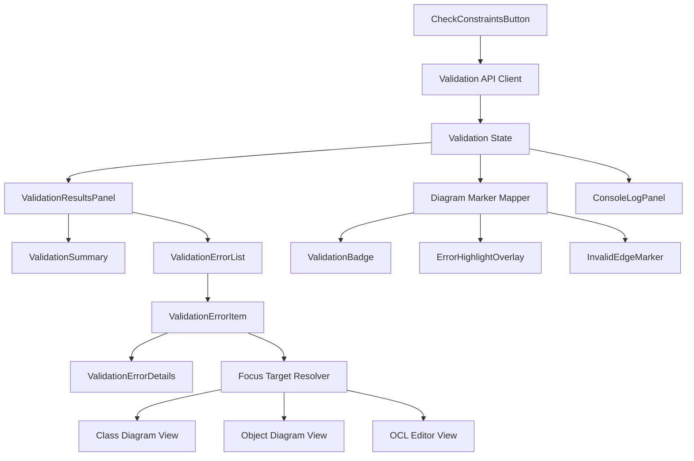

# Validation Error UI

## Zweck dieser Datei

Diese Datei beschreibt die UI für Validierungsfehler und Constraint-Ergebnisse im React/TypeScript-Frontend. Sie legt fest, wie strukturierte `ValidationResult`-Daten aus dem Backend angezeigt, gruppiert und mit Diagrammelementen verbunden werden.

Das Frontend bewertet Constraints nicht fachlich selbst. Es visualisiert Backend-Ergebnisse, führt Nutzer zu betroffenen Elementen und macht Fehlerzustände im Diagramm sowie im Validation Results Panel verständlich.

## Relevanter Screenshot

Der zentrale Screenshot für diese Datei ist `07-object-diagram-validation-error.png`.


Sichtbare UI-Aspekte:

- Bottom Panel mit `Validation Results`.
- Error Count, im Screenshot `1 Error`.
- Fehlerliste mit fachlicher Beschreibung.
- fehlerhafte Objektkarte im Object Diagram.
- roter Rahmen um das betroffene Objekt.
- Fehler-Badge am Objekt.
- Zusammenhang zwischen Fehlertext, Invariante und Objekt.

## Rolle der Validation UI

Die Validation UI ist die Brücke zwischen Backend-Validierung und visueller Modellierungsoberfläche. Sie beantwortet für den Nutzer vier Fragen:

1. Ist der aktuelle Projektzustand gültig?
2. Welche Fehler, Warnungen oder Hinweise wurden gefunden?
3. Welche Modell- oder Diagrammelemente sind betroffen?
4. Was muss der Nutzer öffnen oder korrigieren?

Validierungsergebnisse können aus mehreren Quellen stammen:

| Quelle | Beispiel | UI-Ort |
|---|---|---|
| UML-Strukturvalidierung | unbekannte Klasse, ungültige Association | Validation Results, Class Diagram |
| Snapshot-Validierung | Objekt referenziert fehlende Klasse | Validation Results, Object Diagram |
| Slot-Validierung | Wert passt nicht zum Attributtyp | Object Properties Panel, Objektkarte |
| Link-Validierung | Link passt nicht zur Association | ObjectLinkEdge, Link Properties |
| Multiplizitätsprüfung | zu viele Links an einem Association-Ende | Object Diagram, Validation Results |
| OCL-Syntaxprüfung | ungültiger OCL-Ausdruck | OCL Editor, Invariant Properties |
| OCL-Typechecking | Vergleich nicht kompatibler Typen | OCL Editor, Validation Results |
| OCL-Invariantenauswertung | Invariante ergibt `false` für Objekt | Objektkarte, Validation Results |

## Komponentenübersicht



| Komponente | Verantwortung | Wichtige Eingaben | Wichtige Ausgaben |
|---|---|---|---|
| `ValidationResultsPanel` | Zeigt Zusammenfassung, Fehlerliste und Details im Bottom Panel. | `ValidationResultViewModel` | sichtbare Fehler, Fokusaktionen |
| `ValidationSummary` | Zeigt Status und Counts für Errors, Warnings, Infos. | Summary-Daten | Statuslabel, Count Badges |
| `ValidationErrorList` | Rendert sortierte oder gruppierte Fehlerliste. | Fehler-ViewModels | auswählbare Fehleritems |
| `ValidationErrorItem` | Zeigt einzelnen Fehler mit Code, Titel, Message und Ziel. | `ValidationErrorViewModel` | Auswahl/Fokus |
| `ValidationErrorDetails` | Zeigt aufklappbare Detailinformationen. | Fehlerkontext, Targets, OCL-Ausdruck | technische und fachliche Details |
| `ValidationBadge` | Markiert betroffene Diagrammelemente mit Fehleranzahl. | Fehler-Mapping nach Element-ID | Badge an Objekt, Link, Klasse, Invariante |
| `ErrorHighlightOverlay` | Hebt betroffene Elemente im Diagramm hervor. | Target IDs, Severity | roter Rahmen, Fokuszustand |
| `ConsoleLogPanel` | Protokolliert Validierungsläufe und technische Hinweise. | API-Status, Zeit, Ergebnis | Logzeilen |
| `FocusTargetResolver` | Übersetzt Fehlerziele in UI-Navigation. | `objectId`, `classId`, `invariantId`, `associationId`, `linkId` | Tabwechsel, Selektion, Canvas-Fokus |

## Diagramm-Markierungen

Diagramm-Markierungen machen Validierungsfehler unmittelbar sichtbar. Der Screenshot zeigt eine Objektkarte mit rotem Rahmen und Badge.

MVP-Markierungen:

| Betroffenes Element | UI-Markierung | Beispiel |
|---|---|---|
| Objekt | roter Rahmen, Badge | `alice : User` verletzt `maxBooks` |
| Objektlink | rote Kante oder Fehlericon am Edge Label | ungültiger Link oder Multiplicity Violation |
| Klasse | Markierung an Class Node oder Explorer-Eintrag | unbekannter Typ oder OCL-Kontextproblem |
| Association | markierte Edge im Class Diagram | ungültige Rollen/Multiplizitäten |
| Invariante | Badge am Invariant-Eintrag oder OCL Editor | Syntax-/Typecheck-Fehler |
| Slot | Markierung im Properties Panel | `books = "six"` bei `Integer` |

Die Markierung muss aus dem letzten Backend-Ergebnis abgeleitet werden. Nach lokalen Änderungen sollte der Zustand als veraltet markiert oder beim nächsten Check ersetzt werden.

## Fehler-Badges

Fehler-Badges zeigen kompakt an, dass ein Diagrammelement von Validation Results betroffen ist.

| Badge-Zustand | Darstellung | Bedeutung |
|---|---|---|
| kein Badge | Element hat keinen Fehler im letzten Ergebnis. | Keine Aktion notwendig. |
| rotes Badge ohne Zahl | Ein Fehler betrifft das Element. | MVP ausreichend. |
| rotes Badge mit Zahl | Mehrere Fehler betreffen das Element. | hilfreich bei mehreren Violations. |
| gelbes Badge | Warnung ohne Error. | Post-MVP oder wenn Backend `WARNING` liefert. |
| fokussiertes Badge | stärkerer Ring oder Hervorhebung. | Fehler wurde im Panel ausgewählt. |

Badges sollten Tooltips oder zugängliche Labels besitzen, etwa `2 Fehler für alice : User`.

## Klickverhalten und Fokussierung

Ein Klick auf einen Fehler muss das betroffene UI-Element auffindbar machen. Das ist zentral für die Bedienbarkeit, weil Validierungsergebnisse sonst vom Diagramm entkoppelt wirken.

MVP-Verhalten:

1. Nutzer klickt auf `ValidationErrorItem`.
2. Frontend setzt `selectedValidationErrorId`.
3. `FocusTargetResolver` wählt das wichtigste Ziel.
4. Falls nötig wechselt die App zum passenden Tab.
5. Canvas zentriert das betroffene Element.
6. Element wird selektiert und visuell hervorgehoben.
7. Properties Panel zeigt passende Details.

Priorisierung bei mehreren Targets:

| Fehlercode | Primäres Fokusziel | Sekundäres Ziel |
|---|---|---|
| `INVARIANT_VIOLATION` | `contextObjectId` oder erstes `objectId` | `invariantId` |
| `MULTIPLICITY_VIOLATION` | betroffene `objectIds` | `associationId` oder `linkIds` |
| `INVALID_LINK` | erstes `linkId` | beteiligte `objectIds` |
| `INVALID_SLOT_VALUE` | `objectId` | `slotId` oder Properties Panel |
| `SYNTAX_ERROR` | `invariantId` im OCL Editor | OCL Source Range |
| `TYPE_ERROR` | `invariantId` im OCL Editor | `classId` der Kontextklasse |
| `UNKNOWN_CLASS` | `classId` oder Invariante | Explorer-Eintrag |
| `UNKNOWN_ATTRIBUTE` | `invariantId` | OCL-Ausdruck |

## Error Mapping

Das Error Mapping übersetzt Backend-IDs in UI-Ziele. Es darf nicht über Labels oder Namen erfolgen, sondern muss stabile IDs verwenden.

| Backend-Feld | UI-Ziel | Typische View |
|---|---|---|
| `objectIds` | `ObjectNode`, `ObjectPropertiesPanel` | Object Diagram |
| `contextObjectId` | Kontextobjekt einer OCL-Auswertung | Object Diagram |
| `classIds` | `UmlClassNode`, `ClassPropertiesPanel` | Class Diagram |
| `contextClassId` | Kontextklasse einer Invariante | Class Diagram oder OCL Editor |
| `invariantId` | `InvariantBadge`, `InvariantPropertiesPanel`, OCL Editor | Class Diagram / OCL Editor |
| `associationIds` | `UmlAssociationEdge`, Association Panel | Class Diagram |
| `linkIds` | `ObjectLinkEdge`, Object Association Panel | Object Diagram |
| `slotId` oder `path` | Slot-Feld im Properties Panel | Object Diagram |

Frontend-Mapping-Beispiel:

```ts
type ValidationTarget =
  | { view: "object-diagram"; elementType: "object"; id: string }
  | { view: "object-diagram"; elementType: "objectLink"; id: string }
  | { view: "class-diagram"; elementType: "class"; id: string }
  | { view: "class-diagram"; elementType: "association"; id: string }
  | { view: "class-diagram"; elementType: "invariant"; id: string }
  | { view: "ocl"; elementType: "oclExpression"; id: string };
```

## UI-Zustände

Die Validation UI muss mehrere Zustände abbilden.

| Zustand | Beschreibung | UI-Verhalten |
|---|---|---|
| `idle` | Noch kein Constraint Check ausgeführt. | Panel zeigt neutralen Zustand oder Hinweis. |
| `running` | Backend-Validierung läuft. | Button deaktivieren, Ladezustand anzeigen. |
| `valid` | Backend meldet gültigen Zustand. | grüner oder neutraler Success-State, keine Fehlerliste. |
| `invalid` | Backend meldet Errors oder Warnings. | Error Count, Liste, Diagramm-Markierungen. |
| `error` | Technischer API-Fehler. | API-Fehler getrennt von fachlichen Validation Results anzeigen. |
| `stale` | Modell wurde nach letztem Check geändert. | Hinweis: Ergebnisse können veraltet sein. |
| `empty` | Projekt enthält keine prüfbaren Elemente. | neutraler Empty State. |

Leere/gültige Zustände sind wichtig, damit das Panel nicht nur im Fehlerfall verständlich ist.

## Backend-Datenbedarf

Das Backend muss strukturierte und maschinenlesbare Validation Results liefern. Freitext allein reicht nicht, weil das Frontend Diagrammelemente fokussieren und markieren muss.

Minimal benötigte Felder:

| Feld | Zweck |
|---|---|
| `status` | `VALID`, `INVALID` oder `ERROR`. |
| `summary.errorCount` | Error Count für Panel und Badges. |
| `errors[]` | Liste fachlicher Fehler. |
| `warnings[]` | optionale Warnungen. |
| `infos[]` | optionale Hinweise. |
| `code` | maschinenlesbarer Fehlertyp. |
| `severity` | `ERROR`, `WARNING`, `INFO`. |
| `message` | technische oder detaillierte Meldung. |
| `userMessage` | nutzernahe Meldung, falls vorhanden. |
| `objectIds` | betroffene Objekte. |
| `classIds` | betroffene Klassen. |
| `associationIds` | betroffene Associations. |
| `linkIds` | betroffene Objektlinks. |
| `invariantId` | betroffene Invariante. |
| `contextClassId` | Kontextklasse. |
| `contextObjectId` | Kontextobjekt. |
| `path` oder `sourceRange` | präzisere Stelle im Modell oder OCL-Ausdruck. |

Fehlercodes im MVP:

| Code | Darstellung |
|---|---|
| `SYNTAX_ERROR` | OCL Editor und Validation Results. |
| `TYPE_ERROR` | OCL Editor und Validation Results. |
| `UNKNOWN_CLASS` | Class Diagram, Explorer, Validation Results. |
| `UNKNOWN_ATTRIBUTE` | OCL Editor oder Properties Panel. |
| `INVALID_SLOT_VALUE` | Object Properties Panel und Object Node. |
| `INVALID_LINK` | ObjectLinkEdge und Validation Results. |
| `MULTIPLICITY_VIOLATION` | Object Diagram und Association-Kontext. |
| `INVARIANT_VIOLATION` | Object Node, Invariante, Validation Results. |
| `EVALUATION_ERROR` | OCL Editor, Kontextobjekt, Validation Results. |

## Beispiel: maxBooks-Verletzung

Beispiel: Die Invariante `maxBooks` verlangt `self.books <= 5`. Das Objekt `alice : User` hat aber `books = 6`.

```json
{
  "projectId": "project-library",
  "status": "INVALID",
  "summary": {
    "errorCount": 1,
    "warningCount": 0,
    "infoCount": 0,
    "checkedInvariantCount": 1
  },
  "errors": [
    {
      "id": "error-invariant-max-books-alice",
      "code": "INVARIANT_VIOLATION",
      "severity": "ERROR",
      "message": "Invariant maxBooks is violated for object alice.",
      "userMessage": "alice verletzt die Invariante maxBooks.",
      "invariantId": "inv-user-max-books",
      "contextClassId": "class-user",
      "contextObjectId": "obj-alice",
      "objectIds": ["obj-alice"],
      "expression": "self.books <= 5",
      "actualValue": false
    }
  ],
  "warnings": [],
  "infos": []
}
```

Abgeleitete UI-Reaktion:

| Backend-Datum | UI-Reaktion |
|---|---|
| `status = INVALID` | Validation Results Panel zeigt Fehlerzustand. |
| `summary.errorCount = 1` | Panel zeigt `1 Error`. |
| `code = INVARIANT_VIOLATION` | Fehler wird als Constraint-Verletzung kategorisiert. |
| `invariantId = inv-user-max-books` | Invariante `maxBooks` kann im OCL Editor fokussiert werden. |
| `contextObjectId = obj-alice` | `alice : User` wird im Object Diagram fokussiert. |
| `objectIds = ["obj-alice"]` | Objektkarte erhält roten Rahmen und Badge. |
| `expression = self.books <= 5` | Detailansicht zeigt relevanten OCL-Ausdruck. |

## MVP-Anforderungen

| ID | Anforderung | Priorität | Screenshot-Bezug |
|---|---|---|---|
| `VAL-UI-001` | Validation Results Panel zeigt Error Count, Warnings und Infos. | MVP | `07-object-diagram-validation-error.png` |
| `VAL-UI-002` | Fehlerliste zeigt Code, Meldung und betroffenen Kontext. | MVP | `07-object-diagram-validation-error.png` |
| `VAL-UI-003` | Fehlerdetails können aufgeklappt oder sichtbar angezeigt werden. | MVP | fachliche Ableitung |
| `VAL-UI-004` | Fehlerhafte Objekte erhalten roten Rahmen. | MVP | `07-object-diagram-validation-error.png` |
| `VAL-UI-005` | Fehlerhafte Objekte erhalten ein Badge. | MVP | `07-object-diagram-validation-error.png` |
| `VAL-UI-006` | Klick auf Fehler fokussiert betroffenes Objekt, Link, Klasse oder Invariante. | MVP | `07-object-diagram-validation-error.png` |
| `VAL-UI-007` | Mapping nutzt stabile IDs wie `objectId`, `classId`, `invariantId`, `associationId`, `linkId`. | MVP | Backend-Abhängigkeit |
| `VAL-UI-008` | Syntaxfehler und Typfehler werden im OCL-Kontext angezeigt. | MVP | OCL Editor |
| `VAL-UI-009` | Multiplicity Violations und Invariant Violations werden unterscheidbar dargestellt. | MVP | Validation Results |
| `VAL-UI-010` | Gültige und leere Zustände werden verständlich dargestellt. | MVP | UX-Anforderung |
| `VAL-UI-011` | Technische API-Fehler werden von fachlichen Validation Results getrennt. | MVP | API/Error Contract |

## Post-MVP-Erweiterungen

| Erweiterung | Beschreibung | Nutzen |
|---|---|---|
| Gruppierung nach Fehlerart | Errors nach OCL, Multiplicity, Snapshot, UML gruppieren. | bessere Übersicht bei vielen Fehlern |
| Filter und Suche | nach Severity, Code, Invariante, Objekt oder Klasse filtern. | effizientere Fehleranalyse |
| Source-Range-Markierung | OCL-Fehler direkt im Ausdruck markieren. | präzisere Korrektur |
| Quick Fixes | direkte Korrekturvorschläge anbieten. | schnellere Fehlerbehebung |
| Evaluation Trace | erklärt, warum eine Invariante false wurde. | bessere Nachvollziehbarkeit |
| Fehlerhistorie | letzte Validierungsläufe vergleichen. | Debugging und Lehre |
| Export der Ergebnisse | Validation Results als JSON oder Bericht exportieren. | Dokumentation |
| Batch-Navigation | nächster/vorheriger Fehler. | produktiver Workflow |
| Severity-Konfiguration | Warnungen ein-/ausblenden oder als Fehler behandeln. | flexible Validierungsstrategie |

## Accessibility-Aspekte

Validierungsfehler dürfen nicht ausschließlich über Farbe vermittelt werden.

MVP-Regeln:

- Fehler-Badges benötigen Textlabel oder `aria-label`.
- Validation Results Panel muss per Tastatur erreichbar sein.
- Fehleritems müssen fokussierbar sein.
- Der Fokuswechsel nach Klick auf einen Fehler darf Screenreader-Nutzer nicht orientierungslos machen.
- Roter Rahmen wird durch Icon, Badge oder Text ergänzt.
- Error Count muss textuell angezeigt werden.
- Meldungen sollen klar und ohne rein technische Begriffe formuliert sein.

Beispiel:

```tsx
<button aria-label="Fehler anzeigen: alice verletzt die Invariante maxBooks">
  1 Error
</button>
```

## Offene Fragen

| Frage | Bedeutung |
|---|---|
| Wechselt ein Klick auf einen Fehler automatisch zwischen Tabs? | Beeinflusst Navigation und Nutzererwartung. |
| Werden Validation Results nach lokalen Änderungen ausgeblendet oder als veraltet markiert? | Beeinflusst State-Modell und UX. |
| Wie werden mehrere Ziele pro Fehler priorisiert? | Wichtig bei Multiplicity- und Linkfehlern. |
| Werden Warnings im MVP schon unterstützt oder nur Errors? | Beeinflusst Panel und Badges. |
| Wie detailliert liefert das Backend `sourceRange` oder `path`? | Beeinflusst Inline-Markierung in OCL und Properties Panel. |
| Sollen Console und Validation Results dieselben Ereignisse unterschiedlich darstellen? | Beeinflusst Bottom-Panel-Konzept. |
| Wie wird mit Fehlern umgegangen, deren Ziel-IDs im Frontend nicht mehr existieren? | Wichtig bei stale Results und konkurrierenden Änderungen. |

## Zusammenfassung

Die Validation Error UI macht Backend-Validierung für Nutzer handhabbar. Sie zeigt strukturierte Ergebnisse im Bottom Panel, markiert betroffene Diagrammelemente und navigiert per Klick zu Objekten, Links, Klassen, Associations oder Invarianten.

Für den MVP sind Error Count, Fehlerliste, Fehlerdetails, roter Objektrahmen, Fehler-Badge, stabiles ID-Mapping und klare Zustände für `valid`, `invalid`, `running`, `error` und `stale` entscheidend. Das Frontend bleibt dabei Anzeige- und Interaktionsschicht; die fachliche Validierung bleibt im Backend.
