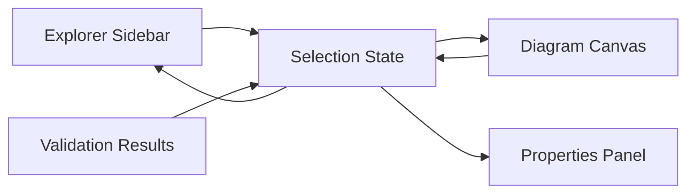

# Explorer Sidebar

## Zweck dieser Datei

Diese Datei beschreibt die `Explorer Sidebar` des React/TypeScript-Frontends. Die Sidebar ist der linke Navigationsbereich der Anwendung und macht Modell- und Snapshot-Elemente als strukturierte Listen zugänglich.

Sie ist eng mit Diagramm-Canvas, Properties Panel, Modal Dialogs und Validation Results verbunden. Auswahl und Fehlerzustände müssen über stabile IDs synchronisiert werden.

## Rolle der Explorer Sidebar

Die Explorer Sidebar erfüllt im MVP vier Aufgaben:

- Modell- und Snapshot-Elemente auffindbar machen.
- Elemente unabhängig vom Canvas auswählbar machen.
- Add-Aktionen für neue Elemente bereitstellen.
- Fehlerindikatoren aus Validation Results kontextnah anzeigen.

Die Sidebar ersetzt nicht das Diagramm. Sie bietet eine kompakte, listenartige Sicht auf dieselben fachlichen Elemente, die im Canvas visuell dargestellt werden.

## Relevante Screenshots

| Screenshot | Vorschau | Explorer-Bezug |
|---|---|---|
| `01-class-diagram-class-properties.png` |  | Class Diagram mit Explorer-Gruppen für Klassen, Associations und Invarianten. |
| `02-class-diagram-association-properties.png` |  | Association-Selektion kann aus Explorer oder Canvas kommen. |
| `03-class-diagram-invariant-properties.png` |  | Invarianten sind im Explorer auffindbar und selektierbar. |
| `06-object-diagram-object-properties.png` |  | Object Diagram mit Explorer-Gruppen für Objects und Associations/Object Links. |
| `07-object-diagram-validation-error.png` |  | Fehlerzustände aus Validation Results können an Objekt- oder Linkeinträgen angezeigt werden. |

## Explorer im Class Diagram

Im Class Diagram zeigt die Explorer Sidebar die fachliche UML-Modellstruktur.

| Gruppe | Angezeigte Elemente | Primäre Aktionen | Ziel bei Klick |
|---|---|---|---|
| `Classes` | `UmlClass` | Klasse hinzufügen, Klasse auswählen | `UmlClassNode`, `ClassPropertiesPanel` |
| `Associations` | `UmlAssociation` | Association hinzufügen, Association auswählen | `UmlAssociationEdge`, `AssociationPropertiesPanel` |
| `Invariants` | `UmlInvariant` | Invariante hinzufügen, Invariante auswählen | `InvariantBadge`, `InvariantPropertiesPanel` oder OCL Editor |

MVP-Verhalten:

- Gruppen sind sichtbar und einklappbar oder zumindest klar getrennt.
- Jeder Eintrag zeigt den aktuellen Namen des Elements.
- Ein Klick selektiert das Element global.
- Das passende Properties Panel öffnet.
- Das Canvas fokussiert das Element, soweit sinnvoll.
- Add Buttons öffnen die passenden Modals.
- Umbenennungen im Properties Panel aktualisieren Explorer-Einträge sofort.

Beispielhafte Einträge:

```text
Classes
  User
  Book

Associations
  Borrows

Invariants
  maxBooks
```

## Explorer im Object Diagram

Im Object Diagram zeigt die Explorer Sidebar den aktuellen Snapshot beziehungsweise das Object Model.

| Gruppe | Angezeigte Elemente | Primäre Aktionen | Ziel bei Klick |
|---|---|---|---|
| `Objects` | `ObjectInstance` | Objekt hinzufügen, Objekt auswählen | `ObjectNode`, `ObjectPropertiesPanel` |
| `Associations` oder `Object Links` | `ObjectLink` | Objektlink hinzufügen, Link auswählen | `ObjectLinkEdge`, `ObjectAssociationPropertiesPanel` |

Benennung: Die Screenshots verwenden sichtbar `Associations`. Fachlich klarer ist `Object Links`, weil es sich um Instanzen von UML-Associations handelt. Für den MVP kann die UI `Associations` anzeigen, sollte in internen Komponenten und Dokumentation aber `ObjectLink` verwenden.

MVP-Verhalten:

- Objekte werden mit Name und Typ angezeigt, etwa `alice : User`.
- Objektlinks werden mit Association-Name und beteiligten Objekten angezeigt.
- Klick auf Objekt oder Link setzt Selection State.
- Canvas fokussiert den zugehörigen Node oder Edge.
- Properties Panel zeigt Objekt- oder Linkdetails.
- Add Object ist fachlich nötig, auch wenn kein Screenshot für dieses Modal vorliegt.
- Add Object Association öffnet `AddObjectAssociationModal`.

Beispielhafte Einträge:

```text
Objects
  alice : User
  mobyDick : Book

Associations
  Borrows(alice, mobyDick)
```

## Gruppierung

Die Explorer-Gruppen hängen von der aktiven View ab.

| Aktive View | Gruppen | Quelle |
|---|---|---|
| Class Diagram | `Classes`, `Associations`, `Invariants` | `project.umlModel` |
| Object Diagram | `Objects`, `Associations`/`Object Links` | `project.objectModel` plus `project.umlModel` |
| OCL Editor | `Invariants`, optional Kontextklassen | `project.umlModel.invariants` |

Gruppen sollten eine kompakte Zusammenfassung zeigen:

| Gruppendaten | Beispiel |
|---|---|
| Anzahl | `Classes (2)` |
| Fehleranzahl | `Objects (1 error)` |
| Empty State | `No invariants yet` |
| Add-Aktion | `+` in Gruppenheader |

## Add-Aktionen

Add-Aktionen in der Explorer Sidebar öffnen Modals oder fokussieren vorhandene Erstellungsflows.

| Gruppe | Add-Aktion | Modal | MVP |
|---|---|---|---|
| `Classes` | Neue Klasse erstellen | `AddNewClassModal` | Ja |
| `Associations` im Class Diagram | Neue UML-Association erstellen | `AddClassAssociationModal` | Ja |
| `Invariants` | Neue OCL-Invariante erstellen | `AddInvariantModal` | Ja |
| `Objects` | Neues Objekt erstellen | `AddObjectModal` | Ja, fachlich nötig |
| `Associations` im Object Diagram | Neuen Objektlink erstellen | `AddObjectAssociationModal` | Ja |

Kontextvorbelegung:

- `AddInvariantModal` kann die aktuell selektierte Klasse als Kontextklasse übernehmen.
- `AddClassAssociationModal` kann eine selektierte Klasse als Source Class übernehmen.
- `AddObjectModal` kann eine zuletzt selektierte Klasse oder ein Objekt desselben Typs berücksichtigen.
- `AddObjectAssociationModal` kann ein selektiertes Objekt als Source Object vorauswählen.

## Selektion

Die Sidebar ist eine gleichwertige Quelle für Selektion. Sie darf keine separate Auswahl führen, sondern schreibt in den zentralen Selection State.

```ts
type ExplorerSelection =
  | { view: "class-diagram"; type: "class"; id: string }
  | { view: "class-diagram"; type: "association"; id: string }
  | { view: "class-diagram"; type: "invariant"; id: string }
  | { view: "object-diagram"; type: "object"; id: string }
  | { view: "object-diagram"; type: "objectLink"; id: string };
```

| Nutzeraktion | UI-Reaktion |
|---|---|
| Klick auf Explorer-Eintrag | Element wird selektiert, Canvas und Properties Panel aktualisieren sich. |
| Doppelklick auf Eintrag | Optional: Canvas fokussiert und zoomt auf Element. |
| Klick auf Add Button | passendes Modal öffnet. |
| Klick auf Fehlerbadge | Validation Results Panel kann gefiltert oder fokussiert werden. |
| Tastaturnavigation | Einträge sollten fokussierbar und auswählbar sein. |

## Synchronisation mit Canvas

Canvas, Explorer und Properties Panel müssen denselben Selection State verwenden.



Synchronisationsregeln:

- Auswahl im Explorer markiert das Element im Canvas.
- Auswahl im Canvas markiert den entsprechenden Explorer-Eintrag.
- Auswahl aus Validation Results markiert Explorer-Eintrag und Canvas-Element.
- Umbenennung im Properties Panel aktualisiert Explorer-Eintrag.
- Löschen eines Elements entfernt es aus Explorer, Canvas und Selektion.
- Bei gelöschter Selektion wird `selectionState` auf `null` gesetzt oder auf ein sinnvolles Nachbarelement verschoben.

## Fehlerindikatoren

Die Sidebar soll Fehler aus dem letzten `ValidationResult` sichtbar machen, ohne das Validation Results Panel zu ersetzen.

| Fehlerziel | Sidebar-Indikator | Beispiel |
|---|---|---|
| Klasse | Fehlericon am Class-Eintrag | `UNKNOWN_CLASS`, OCL-Kontextfehler |
| Association | Fehlericon am Association-Eintrag | ungültige Multiplizität |
| Invariante | Fehlericon oder Badge am Invariant-Eintrag | `SYNTAX_ERROR`, `TYPE_ERROR` |
| Objekt | rotes Badge am Object-Eintrag | `INVARIANT_VIOLATION`, `INVALID_SLOT_VALUE` |
| Objektlink | rotes Badge am Link-Eintrag | `INVALID_LINK`, `MULTIPLICITY_VIOLATION` |
| Gruppe | aggregierte Fehleranzahl | `Objects (1 error)` |

Badge-Regeln:

- Badges basieren nur auf Backend-Validation-Results.
- Badges nutzen stabile Element-IDs.
- Nach lokalen Änderungen werden Badges als veraltet markiert oder beim nächsten Check ersetzt.
- Farbe allein reicht nicht; Fehleranzahl oder Tooltip/Label muss verfügbar sein.

## State Management

Die Explorer Sidebar benötigt abgeleiteten State aus Projekt, Selektion, UI und Validierung.

| State | Inhalt | Persistenz |
|---|---|---|
| `projectState` | UML-Modell, Object Model, Invarianten | Backend/Projektformat |
| `activeView` | Class Diagram, Object Diagram oder OCL | URL oder UI State |
| `selectionState` | aktuell selektiertes Element | lokal/UI |
| `validationState` | letzte Validation Results und Target-Mapping | temporär |
| `expandedGroupsState` | geöffnete/eingeklappte Gruppen | lokal/UI, optional persistierbar |
| `filterState` | optionale Suche oder Filter | Post-MVP |

Beispiel für ein Explorer View Model:

```ts
type ExplorerGroupViewModel = {
  id: "classes" | "associations" | "invariants" | "objects" | "objectLinks";
  title: string;
  count: number;
  errorCount: number;
  items: ExplorerItemViewModel[];
};

type ExplorerItemViewModel = {
  id: string;
  type: "class" | "association" | "invariant" | "object" | "objectLink";
  label: string;
  secondaryLabel?: string;
  selected: boolean;
  errorCount: number;
};
```

## Backend-Datenbedarf

Die Sidebar braucht keine eigene Backend-API, sondern nutzt denselben Project State wie Canvas und Properties Panel.

| Datenbereich | Felder | Verwendung |
|---|---|---|
| `UmlClass` | `id`, `name` | Class Diagram Explorer |
| `UmlAssociation` | `id`, `name`, Endklassen, Rollen | Class Diagram Explorer und ObjectLink-Kontext |
| `UmlInvariant` | `id`, `name`, `contextClassId`, `expression`, `enabled` | Invariant-Gruppe |
| `ObjectInstance` | `id`, `name`, `classId` | Object Diagram Explorer |
| `ObjectLink` | `id`, `associationId`, Source/Target Object IDs | Object Diagram Link-Gruppe |
| `ValidationResult` | Error Targets, Severity, Codes | Fehlerbadges |
| Layoutdaten | Elementpositionen optional | Fokus auf Canvas-Elemente |

Backend-Anforderungen:

- stabile IDs für alle Explorer-Elemente,
- konsistente Namen nach Updates,
- strukturierte Validation Targets,
- vollständige Projektdaten beim Laden,
- klare Fehler bei gelöschten oder ungültigen Referenzen.

## MVP-Anforderungen

| ID | Anforderung | Priorität | Screenshot-Bezug |
|---|---|---|---|
| `EXP-MVP-001` | Sidebar zeigt im Class Diagram `Classes`, `Associations`, `Invariants`. | MVP | `01-class-diagram-class-properties.png`, `03-class-diagram-invariant-properties.png` |
| `EXP-MVP-002` | Sidebar zeigt im Object Diagram `Objects` und `Associations`/`Object Links`. | MVP | `06-object-diagram-object-properties.png` |
| `EXP-MVP-003` | Klick auf Sidebar-Eintrag selektiert Element im Canvas und Properties Panel. | MVP | alle Diagramm-Screenshots |
| `EXP-MVP-004` | Add Buttons öffnen passende Modals. | MVP | `08`, `09`, `10`, `11` |
| `EXP-MVP-005` | Umbenennungen aktualisieren Sidebar-Einträge. | MVP | Properties Panel |
| `EXP-MVP-006` | Sidebar nutzt stabile IDs, nicht Labels, für Selektion. | MVP | Architekturprinzip |
| `EXP-MVP-007` | Fehlerindikatoren können an betroffenen Einträgen angezeigt werden. | MVP | `07-object-diagram-validation-error.png` |
| `EXP-MVP-008` | Gruppen zeigen Empty States, wenn keine Elemente vorhanden sind. | MVP | UX-Anforderung |

## Post-MVP-Erweiterungen

| Erweiterung | Beschreibung |
|---|---|
| Kontextmenüs | Rename, Delete, Duplicate, Focus, Validate Element. |
| Suche und Filter | Elemente nach Name, Typ oder Fehlerstatus filtern. |
| Drag & Drop im Explorer | Sortierung oder Zuordnung, falls fachlich sinnvoll. |
| Gruppierung nach Kontextklasse | Invarianten unter ihrer Klasse gruppieren. |
| Fehlerfilter | Nur Elemente mit Errors/Warnings anzeigen. |
| Multi-Selection | mehrere Elemente für Bulk-Aktionen auswählen. |
| Collapse-State persistieren | geöffnete Gruppen je Projekt merken. |
| OCL Editor Explorer | optionaler Navigationskontext neben dem textuellen Modell-/OCL-Editor; im Screenshot `13` nicht sichtbar. |
| Snapshot-Auswahl | mehrere Snapshots im Explorer verwalten. |

## Offene Fragen

| Frage | Bedeutung |
|---|---|
| Soll die Object-Diagram-Gruppe `Associations` oder `Object Links` heißen? | Betrifft fachliche Klarheit vs. Screenshot-Konsistenz. |
| Sind Explorer-Gruppen im MVP einklappbar? | Beeinflusst UI-Aufwand. |
| Gibt es Kontextmenüs schon im MVP oder erst später? | Beeinflusst Delete/Rename-Workflows. |
| Soll Klick auf Fehlerbadge direkt das Validation Results Panel filtern? | Beeinflusst Fehlernavigation. |
| Wie werden gelöschte Elemente behandelt, wenn Validation Results noch darauf verweisen? | Betrifft stale Validation State. |
| Wird im OCL Editor ein Explorer eingeblendet oder bleibt die View wie Screenshot `13` auf Texteditor und Bottom Panel fokussiert? | Betrifft Navigationskonsistenz und verfügbare Arbeitsfläche. |

## Zusammenfassung

Die Explorer Sidebar ist die strukturierte Navigationssicht auf UML-Modell und Snapshot. Im Class Diagram zeigt sie Klassen, Associations und Invarianten; im Object Diagram zeigt sie Objekte und Objektlinks.

Für den MVP sind stabile ID-basierte Selektion, Add-Aktionen, Synchronisation mit Canvas und Properties Panel sowie Fehlerindikatoren aus Validation Results entscheidend. Die Sidebar bleibt eine UI-Projektion des Project State und führt keine eigene fachliche Modelllogik aus.
