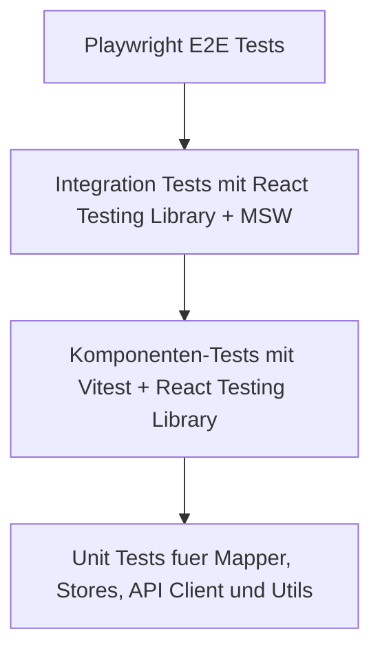

# Frontend Test Strategy

## Zweck dieser Datei

Diese Datei beschreibt die Teststrategie für das neue React/TypeScript-Frontend des webbasierten UML/OCL-Systems. Sie legt fest, welche UI-, Komponenten-, State-, API- und End-to-End-Tests für den MVP notwendig sind und wie die Screenshots als Grundlage für testbare Workflows genutzt werden.

Das Frontend testet Darstellung, Interaktion, State-Übergänge, API-Integration und Mapping von Backend-Ergebnissen auf UI-Elemente. Fachliche UML-/OCL-Validierung wird nicht im Frontend nachimplementiert. Sie wird über Mock-Responses und End-to-End-Flows gegen die Backend-Schnittstelle geprüft.

## Testziele

| Ziel | Beschreibung | MVP-Relevanz |
|---|---|---|
| UI-Verlässlichkeit | Zentrale Views, Panels, Modals und Diagramme rendern stabil. | Hoch |
| Interaktionssicherheit | Selektion, Formularbearbeitung, Drag & Drop und Modal-Workflows funktionieren erwartbar. | Hoch |
| API-Kontrakt | Frontend ruft korrekte Endpunkte mit erwarteten DTOs auf. | Hoch |
| State-Konsistenz | Server State, UI State, Selection State, Layout State und Validation State bleiben konsistent. | Hoch |
| Fehler-Mapping | Validation Results markieren die richtigen Diagrammelemente. | Hoch |
| Screenshot-Workflows | Aus den Zielbildern abgeleitete Kernpfade sind automatisiert prüfbar. | Hoch |
| Regression | Änderungen an Diagrammkomponenten, Properties Panel oder Validation UI brechen den MVP-Workflow nicht unbemerkt. | Hoch |

## Testpyramide



| Ebene | Tooling | Testgegenstand | Schwerpunkt |
|---|---|---|---|
| Unit Tests | Vitest | Mapper, DTO-Konvertierung, Stores, Selektoren, Error Mapping | schnell, isoliert, deterministisch |
| Komponenten-Tests | Vitest + React Testing Library | Nodes, Edges, Panels, Modals, Sidebar, Validation Items | Rendering und Nutzerinteraktion |
| Integration Tests | React Testing Library + Mock Service Worker | Pages mit API-Mocks und State | Zusammenspiel von UI, API und State |
| End-to-End Tests | Playwright | vollständige Nutzerabläufe im Browser | MVP-Workflow und visuelle Regression |
| Story/Visual Tests | Storybook optional | isolierte UI-Zustände | Design- und Komponentenvarianten |

## Komponenten-Tests

Komponenten-Tests prüfen einzelne UI-Bausteine ohne vollständigen Backend-Stack. API-Aufrufe werden gemockt oder als Props abstrahiert.

| Testfall-ID | Komponente | Ziel | Typische Prüfung | MVP |
|---|---|---|---|---|
| `FE-COMP-001` | `TopBar` | Globale Aktionen sichtbar und bedienbar. | `Check Constraints`, Save und Refresh werden gerendert und lösen Callbacks aus. | Ja |
| `FE-COMP-002` | `MainNavigationTabs` | Wechsel zwischen Class Diagram, Object Diagram und OCL Editor. | Aktiver Tab wird markiert; Tabwechsel aktualisiert View State oder Route. | Ja |
| `FE-COMP-003` | `ExplorerSidebar` | Gruppen und Elemente werden korrekt gerendert. | Classes, Associations, Invariants, Objects und Links erscheinen abhängig von View. | Ja |
| `FE-COMP-004` | `PropertiesPanel` | Panel rendert passende Inhalte zur Selektion. | Klasse, Association, Invariante, Objekt und Link führen zu unterschiedlichen Formularen. | Ja |
| `FE-COMP-005` | `BottomPanel` | Console und Validation Results sind zugänglich. | Tabwechsel, leere Zustände und Error Count werden angezeigt. | Ja |
| `FE-COMP-006` | `OclExpressionInput` | OCL-Ausdruck kann eingegeben und angezeigt werden. | Textänderung, Fehlermeldung und readonly/editable State. | Ja |
| `FE-COMP-007` | `ValidationErrorItem` | Fehleritem zeigt Code, Message und Ziel. | Klick ruft Fokus-Callback mit Target-ID auf. | Ja |
| `FE-COMP-008` | `OclEditorPage` | OCL Editor View rendert textuelle Modell-/OCL-Bearbeitung. | Texteditor, Zeilennummern, `Apply Changes`, Console und Diagnostics sind sichtbar. | Ja |
| `FE-COMP-009` | `OclDiagnosticsPanel` | Backend-Diagnosen werden korrekt angezeigt. | `SYNTAX_ERROR` oder `TYPE_ERROR` erscheint mit Message und Bezug zur Invariante. | Ja |

## Diagramm-Tests

Diagramm-Tests prüfen Knoten, Kanten, Selektion, Drag & Drop und Markierungen. Bei Nutzung von React Flow sollten Tests zwischen reinem ViewModel-Mapping und Browserinteraktion getrennt werden.

| Testfall-ID | Bereich | Ziel | Typische Prüfung | Tool | MVP |
|---|---|---|---|---|---|
| `FE-DIA-001` | Class Diagram | Klassenkarten werden aus `UmlClassDto` gerendert. | Name, Attribute und Operationen sind sichtbar. | RTL | Ja |
| `FE-DIA-002` | Class Node | Selektion einer Klasse aktualisiert `selectionState`. | Klick auf `UmlClassNode` setzt `{ kind: "class" }`. | RTL | Ja |
| `FE-DIA-003` | Association Edge | Association wird als Edge mit Label dargestellt. | Name/Rollen sind sichtbar oder als Edge-Daten vorhanden. | RTL/Playwright | Ja |
| `FE-DIA-004` | Object Diagram | Objekte werden als `name : Class` angezeigt. | `alice : User`, `mobyDick : Book` erscheinen. | RTL | Ja |
| `FE-DIA-005` | Object Node | Slot-Werte werden in Objektkarte angezeigt. | `books = 6` oder vergleichbarer Slot-Wert ist sichtbar. | RTL | Ja |
| `FE-DIA-006` | Object Link Edge | Object Link verbindet zwei Objekte. | Link-Edge referenziert Source/Target IDs. | RTL/Playwright | Ja |
| `FE-DIA-007` | Fehler-Markierung | Fehlerhafte Objekte erhalten Rahmen und Badge. | `objectId` mit Fehler erzeugt sichtbaren Error-Zustand. | RTL/Playwright | Ja |
| `FE-DIA-008` | Layout | Node-Positionen werden übernommen und geändert. | Drag aktualisiert Layout State. | Playwright | Ja |
| `FE-DIA-009` | Edge-Selektion | Klick auf Edge öffnet passendes Properties Panel. | `associationId` oder `linkId` wird selektiert. | Playwright | Ja |

## Properties-Panel-Tests

| Testfall-ID | Panel | Ziel | Erwartung | MVP |
|---|---|---|---|---|
| `FE-PROP-001` | Class Properties | Selektierte Klasse anzeigen. | Name, Attribute und Operationen der Klasse sind sichtbar. | Ja |
| `FE-PROP-002` | Class Properties | Klassenname ändern. | Änderung aktualisiert Form State und löst Save/Mutation aus. | Ja |
| `FE-PROP-003` | Association Properties | Association-Enden anzeigen. | Source Class, Target Class, Rollen und Multiplizitäten sind sichtbar. | Ja |
| `FE-PROP-004` | Invariant Properties | OCL-Ausdruck anzeigen und bearbeiten. | `self.books <= 5` ist editierbar. | Ja |
| `FE-PROP-005` | Object Properties | Slot-Werte anzeigen und bearbeiten. | Slot-Editor akzeptiert gültige primitive Werte. | Ja |
| `FE-PROP-006` | Object Association Properties | Linkdaten anzeigen. | Source Object, Target Object und Association sind sichtbar. | Ja |
| `FE-PROP-007` | Fehlerdarstellung | Formularfehler anzeigen. | Ungültiger Wert zeigt lokale Meldung oder Backend-Fehler. | Ja |
| `FE-PROP-008` | Class Properties Segment Control | Klasse bietet Segmente `Class`, `Association` und `Invariant`. | Segmentwechsel zeigt allgemeine Klassendaten, zugehörige Associations und zugehörige Invarianten. | Ja |
| `FE-PROP-009` | Related Association Access | Association aus Class Properties auswählen. | Klick auf `Borrows` setzt Selection auf `association` und öffnet Association Properties. | Ja |
| `FE-PROP-010` | Related Invariant Access | Invariante aus Class Properties auswählen. | Klick auf `maxBooks` setzt Selection auf `invariant` und öffnet Invariant Properties. | Ja |

## Modal-Tests

| Testfall-ID | Modal | Screenshot-Bezug | Ziel | Erwartung | MVP |
|---|---|---|---|---|---|
| `FE-MOD-001` | `AddClassModal` | `08-modal-add-class.png` | Modal öffnen und schließen. | Titel, Pflichtfelder, Submit und Cancel sind vorhanden. | Ja |
| `FE-MOD-002` | `AddClassModal` | `08-modal-add-class.png` | Klasse erstellen. | `POST /api/v1/projects/{projectId}/classes` wird mit Name/Attributen/Operationen aufgerufen. | Ja |
| `FE-MOD-003` | `AddInvariantModal` | `09-modal-add-invariant.png` | Invariante speichern. | Kontextklasse, Name und OCL Expression werden gesendet. | Ja |
| `FE-MOD-004` | `AddAssociationModal` | `10-modal-add-class-association.png` | Association erstellen. | Source/Target Class, Rollen und Multiplizitäten werden gesendet. | Ja |
| `FE-MOD-005` | `AddObjectAssociationModal` | `11-modal-add-object-association.png` | Object Link erstellen. | Source Object, Target Object und Association werden gesendet. | Ja |
| `FE-MOD-006` | alle Modals | alle Modal-Screenshots | Pflichtfelder validieren. | Submit bleibt deaktiviert oder zeigt Fehler, wenn Pflichtdaten fehlen. | Ja |
| `FE-MOD-007` | alle Modals | alle Modal-Screenshots | Backend-Fehler anzeigen. | API-Fehler wird im Modal verständlich dargestellt. | Ja |
| `FE-MOD-008` | `OpenExistingProjectModal` | `14-open-existing-project.png` | Lokale `.use` Datei auswählen oder droppen. | Dateiname wird angezeigt; `Open Project` wird erst bei gültiger `.use` Datei aktiv. | Ja/Should |
| `FE-MOD-009` | `OpenExistingProjectModal` | `14-open-existing-project.png` | Falsches Dateiformat blockieren. | Nicht-`.use` Dateien erzeugen eine feldnahe Fehlermeldung ohne Backend-Request. | Ja |
| `FE-MOD-010` | `OpenExistingProjectModal` | `14-open-existing-project.png` | Importdiagnosen anzeigen. | `UNSUPPORTED_SYNTAX` oder Parse-Diagnostics aus `model-text/apply` erscheinen im Dialog oder Console/OCL Editor. | Ja/Should |

## Explorer-Tests

| Testfall-ID | Bereich | Ziel | Erwartung | MVP |
|---|---|---|---|---|
| `FE-EXP-001` | Class Diagram Explorer | Klassen, Associations und Invarianten anzeigen. | Gruppen sind sichtbar und enthalten Modell-Elemente. | Ja |
| `FE-EXP-002` | Object Diagram Explorer | Objekte und Object Links anzeigen. | Objektgruppen enthalten Snapshot-Elemente. | Ja |
| `FE-EXP-003` | Selektion | Klick auf Explorer-Element selektiert Diagrammelement. | Properties Panel aktualisiert sich. | Ja |
| `FE-EXP-004` | Add-Aktionen | Add Buttons öffnen passende Modals. | `AddClassModal`, `AddInvariantModal` oder Link-Modal erscheint. | Ja |
| `FE-EXP-005` | Fehlerindikatoren | Fehlerhafte Elemente werden in Sidebar markiert. | Element mit Validation Error zeigt Badge/Icon. | Sollte |

## API-Client-Tests

API-Client-Tests prüfen Request-Pfade, HTTP-Methoden, Payloads, Response-Mapping und Fehlerbehandlung. Für die Frontend-Entwicklung sollte Mock Service Worker verwendet werden, damit Tests unabhängig vom echten Backend laufen.

| Testfall-ID | API-Aktion | Erwartung | Tool | MVP |
|---|---|---|---|---|
| `FE-API-001` | Projekt laden | `GET /api/v1/projects/{projectId}` mappt `ProjectDto` in Frontend-Modelle. | Vitest + MSW | Ja |
| `FE-API-002` | Klasse erstellen | `POST /api/v1/projects/{projectId}/classes` sendet `CreateClassRequestDto`. | Vitest + MSW | Ja |
| `FE-API-003` | Association erstellen | `POST /api/v1/projects/{projectId}/associations` sendet Enden, Rollen und Multiplizitäten. | Vitest + MSW | Ja |
| `FE-API-004` | Invariante erstellen | `POST /api/v1/projects/{projectId}/invariants` sendet Kontextklasse und OCL Expression. | Vitest + MSW | Ja |
| `FE-API-005` | Objekt ändern | `PUT /api/v1/projects/{projectId}/objects/{objectId}` sendet Slot-Werte. | Vitest + MSW | Ja |
| `FE-API-006` | Object Link erstellen | `POST /api/v1/projects/{projectId}/links` sendet Source/Target/Association. | Vitest + MSW | Ja |
| `FE-API-007` | Constraints prüfen | `POST /api/v1/projects/{projectId}/validate` gibt `ValidationResultDto` zurück. | Vitest + MSW | Ja |
| `FE-API-008` | API-Fehler | HTTP-/Backend-Fehler werden in UI-Fehlerzustand gemappt. | Vitest + MSW | Ja |
| `FE-API-009` | `.use` Modelltext anwenden | `POST /api/v1/projects/{projectId}/model-text/apply` sendet lokalen Dateiinhalt mit `sourceName`, `sourceFormat` und `sourceOrigin`. | Vitest + MSW | Ja/Should |

## State-Management-Tests

State-Tests prüfen insbesondere die Kombination aus TanStack Query für Server State und Zustand für UI-/Selection-/Validation-State.

| Testfall-ID | State-Bereich | Ziel | Erwartung | MVP |
|---|---|---|---|---|
| `FE-STATE-001` | Server State | Projekt wird geladen und gecacht. | `ProjectDto` ist in Query verfügbar. | Ja |
| `FE-STATE-002` | Selection State | Klasse, Association, Invariante, Objekt und Link können selektiert werden. | Selection Union enthält korrekten `kind` und ID. | Ja |
| `FE-STATE-003` | Modal State | Modal öffnet mit initialem Kontext. | Add-Modal erhält vorausgewählte Klasse oder Objekte. | Ja |
| `FE-STATE-004` | Layout State | Node-Positionen werden aktualisiert. | Drag-Event schreibt Position zu stabiler Element-ID. | Ja |
| `FE-STATE-005` | Validation State | ValidationResult wird gespeichert und indexiert. | Fehler sind nach `objectId`, `linkId`, `classId`, `invariantId` abrufbar. | Ja |
| `FE-STATE-006` | Stale State | Modelländerung markiert Validation Results als veraltet. | UI zeigt stale Status oder entfernt alte Markierungen. | Ja |
| `FE-STATE-007` | Console State | Validierungsaktion erzeugt Console-Eintrag. | Log enthält Zeitpunkt, Aktion und Ergebnisstatus. | Sollte |
| `FE-STATE-008` | OCL Editor State | Modell-/OCL-Text-Draft und Diagnosen werden verwaltet. | Änderung im Texteditor setzt Dirty State; `Apply Changes` aktualisiert Projektzustand oder zeigt Diagnosen und markiert Validation Results als stale. | Ja |
| `FE-STATE-009` | Import File State | Lokale `.use` Datei aus Open Existing verwalten. | Dateiname, Inhalt, Ladezustand und Diagnostics werden temporär gehalten und nach Erfolg zurückgesetzt. | Ja/Should |

## Validation-UI-Tests

| Testfall-ID | Bereich | Ziel | Erwartung | MVP |
|---|---|---|---|---|
| `FE-VAL-001` | Empty State | Keine Fehler anzeigen. | Panel zeigt gültigen oder leeren Zustand ohne falsche Badges. | Ja |
| `FE-VAL-002` | Error Count | Fehleranzahl anzeigen. | `1 Error` oder Summary Counts erscheinen korrekt. | Ja |
| `FE-VAL-003` | Invariant Violation | Fehlertext und Kontext anzeigen. | `maxBooks`, `alice` und `self.books <= 5` sind sichtbar. | Ja |
| `FE-VAL-004` | Diagramm-Markierung | Objekt mit Fehler markieren. | `alice : User` erhält roten Rahmen oder Badge. | Ja |
| `FE-VAL-005` | Fehlerfokus | Klick auf Fehler fokussiert Objekt. | Object Diagram wird aktiv, Objekt ist selektiert und sichtbar. | Ja |
| `FE-VAL-006` | OCL Syntax Error | OCL-Fehler im Editor/Panel anzeigen. | Fehler referenziert Invariante und Position. | Ja |
| `FE-VAL-007` | Multiplicity Violation | Multiplizitätsfehler auf Link/Objekt mappen. | Link oder Objekt erhält Marker; Panel zeigt Details. | Ja |
| `FE-VAL-008` | API-Fehler | Validierungs-Request schlägt fehl. | UI zeigt technischen Fehler getrennt von fachlichen Validation Results. | Ja |

## End-to-End-Tests

End-to-End-Tests prüfen vollständige Nutzerabläufe im Browser. Sie sollen nicht jede Komponente einzeln absichern, sondern den MVP-Workflow aus Nutzersicht.

| Testfall-ID | Workflow | Schritte | Erwartung | Screenshot-Bezug | MVP |
|---|---|---|---|---|---|
| `FE-E2E-001` | Projekt öffnen | App starten, Projekt laden | Class Diagram View erscheint mit Explorer, Canvas und Properties Panel. | `01` | Ja |
| `FE-E2E-002` | Klasse erstellen | Add Class öffnen, Name eingeben, speichern | Neue Klasse erscheint im Canvas und ist selektiert. | `08`, `04` | Ja |
| `FE-E2E-003` | Association erstellen | Add Association öffnen, Klassen und Rollen wählen, speichern | Edge erscheint und Properties Panel zeigt Association. | `10`, `02` | Ja |
| `FE-E2E-004` | Invariante erstellen | Add Invariant öffnen, Kontextklasse wählen, `self.books <= 5` speichern | Invariante erscheint im Explorer/Panel. | `09`, `03` | Ja |
| `FE-E2E-004A` | OCL Editor nutzen | OCL Editor öffnen, Modell-/OCL-Text ändern, `Apply Changes` auslösen oder Diagnose anzeigen | OCL Editor zeigt textuellen Editor, Zeilennummern, `Apply Changes`, Console und Diagnostics. | `13` | Ja |
| `FE-E2E-004B` | Open Existing `.use` | Dashboard öffnen, `Open Existing` klicken, `.use` Datei auswählen, `Open Project` auslösen | Modal aus Screenshot `14` erscheint; Dateiinhalt wird an `model-text/apply` gesendet; bei Erfolg öffnet Class Diagram oder bei Teilunterstützung erscheinen Diagnostics. | `00`, `14`, `13` | Ja/Should |
| `FE-E2E-004C` | Class Properties Related Access | Klasse `User` auswählen, Segment `Association` öffnen, `Borrows` auswählen, zurück zur Klasse, Segment `Invariant` öffnen, `maxBooks` auswählen | Related Associations und Invarianten sind direkt aus der Klassenselektion erreichbar. | `15`, `16`, `17` | Ja |
| `FE-E2E-005` | Objekt bearbeiten | Object Diagram öffnen, Objekt auswählen, Slot-Wert ändern | Object Properties Panel zeigt geänderten Wert. | `06` | Ja |
| `FE-E2E-006` | Object Link erstellen | Add Object Association öffnen, Source/Target/Association wählen | Object Link erscheint im Diagramm. | `11`, `12` | Ja |
| `FE-E2E-007` | Constraint Check | `Check Constraints` klicken | Backend-Mock wird aufgerufen; Validation Results erscheinen. | `07` | Ja |
| `FE-E2E-008` | Fehlerfokus | Fehler in Validation Results anklicken | Fehlerhaftes Objekt wird fokussiert und markiert. | `07` | Ja |
| `FE-E2E-009` | Layout speichern | Node verschieben, speichern, neu laden | Node-Position bleibt erhalten. | `01`, `06` | Ja |

## Screenshot-basierte Testfälle

Die Screenshots dienen als strukturierte Referenz für UI-Zustände und Workflows. Sie müssen nicht pixelgenau reproduziert werden, können aber für visuelle Regressionen und Akzeptanztests genutzt werden.

| Testfall-ID | Screenshot | UI-Zustand | Prüfpunkte | Testart |
|---|---|---|---|---|
| `FE-SHOT-001` | `01-class-diagram-class-properties.png` | Klasse selektiert | Class Diagram, Explorer, Class Properties und Bottom Panel sichtbar. | Playwright Screenshot/DOM |
| `FE-SHOT-002` | `02-class-diagram-association-properties.png` | Association selektiert | Edge ist selektiert; Association Properties zeigen Source/Target und Rollen. | Playwright Screenshot/DOM |
| `FE-SHOT-003` | `03-class-diagram-invariant-properties.png` | Invariante selektiert | Invariant Name und OCL Expression sind sichtbar. | Playwright Screenshot/DOM |
| `FE-SHOT-004` | `04-class-diagram-new-class-selected.png` | Neue Klasse selektiert | Neue Klasse ist im Canvas und Explorer sichtbar. | Playwright |
| `FE-SHOT-005` | `06-object-diagram-object-properties.png` | Objekt selektiert | Objektkarte, Slot-Werte und Object Properties sind sichtbar. | Playwright Screenshot/DOM |
| `FE-SHOT-006` | `07-object-diagram-validation-error.png` | Validierungsfehler | Roter Objektzustand, Badge und Validation Results Panel sichtbar. | Playwright Screenshot/DOM |
| `FE-SHOT-007` | `08-modal-add-class.png` | Add Class Modal offen | Modal-Felder, Submit und Cancel sichtbar. | RTL/Playwright |
| `FE-SHOT-008` | `09-modal-add-invariant.png` | Add Invariant Modal offen | Context Class, Name und OCL Expression sichtbar. | RTL/Playwright |
| `FE-SHOT-009` | `10-modal-add-class-association.png` | Add Association Modal offen | Klassen-Dropdowns und Rollenfelder sichtbar. | RTL/Playwright |
| `FE-SHOT-010` | `11-modal-add-object-association.png` | Add Object Association Modal offen | Objekt-Dropdowns und Association-Auswahl sichtbar. | RTL/Playwright |
| `FE-SHOT-011` | `12-object-diagram-association-properties.png` | Object Link selektiert | Link Properties zeigen Source Object, Target Object und Association. | Playwright |
| `FE-SHOT-012` | `13-ocl-editor.png` | OCL Editor geöffnet | Texteditor, Zeilennummern, USE-ähnlicher Modelltext, `Apply Changes`, `Check Constraints`, Save/Refresh und Console sichtbar. | Playwright Screenshot/DOM |
| `FE-SHOT-013` | `15-properties-association.png` | Klasse selektiert, Segment `Association` aktiv | Segment Control sichtbar; Related Association `Borrows` ist erreichbar. | RTL/Playwright |
| `FE-SHOT-014` | `16-properties-invariants.png` | Klasse selektiert, Segment `Invariant` aktiv | Invariante `maxBooks` und OCL-Ausdruck sind sichtbar. | RTL/Playwright |
| `FE-SHOT-015` | `17-new-class.png` | Neue Klasse selektiert, Segment `Class` aktiv | Class Name, Attribute, Operations, `Add Attribute` und `Add Operation` sind sichtbar. | RTL/Playwright |

Hinweis: `13-ocl-editor.png`, `15-properties-association.png`, `16-properties-invariants.png` und `17-new-class.png` sind vorhanden und dienen als visuelle Referenz fuer die OCL Editor View und die Class-Properties-Segmente.

## Testdaten und Mock API

Für Frontend-Tests sollte ein stabiles Library-Beispiel verwendet werden. Es entspricht dem MVP-Durchstich und eignet sich für Komponenten-, Integration- und E2E-Tests.

### Library-Testdaten

| Element | Beispiel |
|---|---|
| Klasse | `User` |
| Attribut | `books : Integer` |
| Klasse | `Book` |
| Attribute | `title : String`, `available : Boolean` |
| Association | `Borrows` zwischen `User` und `Book` |
| Rollen | `borrower`, `borrowedBooks` |
| Invariante | `maxBooks` |
| OCL | `self.books <= 5` |
| Objekt | `alice : User` mit `books = 6` |
| Objekt | `mobyDick : Book` |
| Link | `Borrows(alice, mobyDick)` |
| erwarteter Fehler | `INVARIANT_VIOLATION` für `alice` |

### Mock Service Worker

Mock Service Worker sollte folgende Backend-Antworten bereitstellen:

| Mock | Endpunkt | Zweck |
|---|---|---|
| `mockProjectLibraryValid` | `GET /api/v1/projects/library-demo` | Projekt laden. |
| `mockCreateClass` | `POST /api/v1/projects/{projectId}/classes` | Klasse erstellen. |
| `mockCreateAssociation` | `POST /api/v1/projects/{projectId}/associations` | Association erstellen. |
| `mockCreateInvariant` | `POST /api/v1/projects/{projectId}/invariants` | Invariante erstellen. |
| `mockUpdateObject` | `PUT /api/v1/projects/{projectId}/objects/{objectId}` | Slot-Wert ändern. |
| `mockCreateObjectLink` | `POST /api/v1/projects/{projectId}/links` | Object Link erstellen. |
| `mockValidationInvalid` | `POST /api/v1/projects/{projectId}/validate` | Invariantverletzung zurückgeben. |
| `mockApiError` | beliebiger Endpunkt | technische Fehlerzustände testen. |

Beispiel für einen Validation-Mock:

```json
{
  "status": "INVALID",
  "summary": {
    "errorCount": 1,
    "warningCount": 0,
    "infoCount": 0
  },
  "errors": [
    {
      "code": "INVARIANT_VIOLATION",
      "severity": "ERROR",
      "message": "Invariant maxBooks is violated for object alice.",
      "targets": [
        { "elementType": "OBJECT", "elementId": "obj-alice" },
        { "elementType": "INVARIANT", "elementId": "inv-max-books" }
      ],
      "context": {
        "contextClass": "User",
        "contextObject": "alice",
        "expression": "self.books <= 5"
      }
    }
  ]
}
```

## MVP-Testfälle

| Testfall-ID | Beschreibung | Primäre Ebene | Erwartetes Ergebnis |
|---|---|---|---|
| `FE-MVP-001` | Class Diagram View lädt. | E2E/Integration | Explorer, Canvas, Properties Panel und Bottom Panel sind sichtbar. |
| `FE-MVP-002` | Add Class Modal öffnet und erstellt eine Klasse. | E2E/Integration | Neue Klasse erscheint im Canvas und Explorer. |
| `FE-MVP-003` | Class Properties Panel zeigt selektierte Klasse. | Komponenten/Integration | Panel zeigt Name, Attribute, Operationen sowie Segmente fuer zugehörige Associations und Invarianten. |
| `FE-MVP-004` | Association wird angezeigt. | Diagramm/Integration | Association Edge ist sichtbar und selektierbar. |
| `FE-MVP-005` | Add Invariant Modal speichert Invariante. | Integration | Invariante wird im Explorer und Properties Panel angezeigt. |
| `FE-MVP-006` | Object Diagram View zeigt Objekte. | E2E/Integration | `alice : User` und `mobyDick : Book` sind sichtbar. |
| `FE-MVP-007` | Object Properties Panel bearbeitet Slot-Werte. | Integration | Slot-Wert wird geändert und Mutation ausgelöst. |
| `FE-MVP-008` | Add Object Association Modal erstellt Link. | E2E/Integration | Object Link erscheint im Diagramm. |
| `FE-MVP-009` | Check Constraints ruft Backend auf. | E2E/API | `POST /api/v1/projects/{projectId}/validate` wird ausgeführt. |
| `FE-MVP-010` | Validation Results Panel zeigt Fehler. | Validation UI | Fehlerliste zeigt `INVARIANT_VIOLATION`. |
| `FE-MVP-011` | Fehlerhaftes Objekt wird markiert. | Diagramm/Validation UI | `alice : User` hat Fehlerrahmen und Badge. |
| `FE-MVP-012` | Klick auf Fehler fokussiert Objekt. | E2E | Objekt wird selektiert und im Diagramm sichtbar. |

## Post-MVP-Testfälle

| Testfall-ID | Erweiterung | Beschreibung |
|---|---|---|
| `FE-POST-001` | OCL Syntax Highlighting | Editor färbt Tokens für erweiterten OCL-Sprachumfang. |
| `FE-POST-002` | OCL Autocomplete | Vorschläge für Attribute, Rollen und Operationen erscheinen kontextabhängig. |
| `FE-POST-003` | Undo/Redo | Diagramm- und Formularänderungen können rückgängig gemacht werden. |
| `FE-POST-004` | Mehrere Snapshots | Nutzer wechselt zwischen mehreren Objektzuständen. |
| `FE-POST-005` | Import/Export `.use` | Frontend zeigt Import-/Exportstatus und Fehlerdetails. |
| `FE-POST-006` | Vererbung | Class Diagram zeigt Generalization Edges und Properties. |
| `FE-POST-007` | Enumerationen | Enum-Typen werden in Attributauswahl und OCL UI berücksichtigt. |
| `FE-POST-008` | Kollaboration | gleichzeitige Bearbeitung, Konflikte und Sync-Zustände werden getestet. |
| `FE-POST-009` | Visuelle Regression | Storybook/Playwright prüft wichtige UI-Zustände gegen Snapshots. |

## Risiken

| Risiko | Auswirkung | Gegenmaßnahme |
|---|---|---|
| Diagrammbibliothek ist schwer in DOM-Tests prüfbar | Tests werden fragil oder zu visuell. | ViewModel-Mapping separat testen; kritische Interaktionen mit Playwright prüfen. |
| Canvas-Layout ist nondeterministisch | Screenshot-Tests schlagen ohne fachlichen Fehler fehl. | Stabile Mock-Positionen, feste Viewports und deterministische Layoutdaten verwenden. |
| API-Kontrakt ändert sich häufig | Frontend-Tests brechen bei DTO-Änderungen. | DTO-Typen zentral halten, MSW-Mocks nah am API-Vertrag pflegen. |
| Validation Results sind komplex | Fehler werden falsch gemappt. | Error-Mapping-Selektoren isoliert testen. |
| Frontend validiert zu viel selbst | Tests spiegeln nicht Backend-Wahrheit. | Frontend nur UI-Vorvalidierung testen; fachliche Validierung über Backend-Mocks/E2E. |
| Modals und Properties Panel duplizieren Logik | Inkonsistente Formularvalidierung. | Gemeinsame Form-Komponenten und Testdaten verwenden. |
| Visuelle Regression wird zu aufwendig | Tests werden langsam und schwer wartbar. | Nur MVP-kritische Screenshots automatisiert vergleichen. |

## Zusammenfassung

Die Frontend-Teststrategie kombiniert schnelle Unit- und Komponenten-Tests mit Integrationstests über Mock Service Worker und wenigen, aber wichtigen Playwright-End-to-End-Tests. Der wichtigste Testpfad ist die Library-Demo:

```text
Projekt laden
-> Klassendiagramm anzeigen
-> Klasse/Association/Invariante erstellen
-> Objektdiagramm öffnen
-> Objektwerte und Links bearbeiten
-> Check Constraints ausführen
-> Validation Results anzeigen
-> fehlerhaftes Objekt fokussieren
```

Damit werden die zentralen Screenshots, der MVP-Workflow und die Trennung zwischen Frontend-Interaktion und Backend-Validierung testbar abgesichert.
