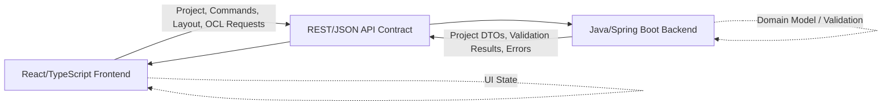

# Frontend-Backend Contract

## Zweck dieser Datei

Diese Datei definiert den grundlegenden Vertrag zwischen dem neuen React/TypeScript-Frontend und dem neuen Java/Spring-Boot-Backend des webbasierten UML/OCL-Systems.

Sie klärt Verantwortlichkeiten, Datenmodelle, DTOs, stabile IDs, Layoutdaten, Fehlerformate, Validation Results, Versionierung und Erweiterbarkeit. Der Vertrag soll verhindern, dass fachliche Semantik unklar zwischen Frontend und Backend verteilt wird.

Leitentscheidung: Das Backend ist die fachliche Quelle für UML-/OCL-Semantik und Validierung. Das Frontend ist für Darstellung, Interaktion, Formularzustände, Diagramm-Layout und Nutzerführung verantwortlich.

## Rolle des API-Vertrags

Der API-Vertrag ist die technische und fachliche Grenze zwischen beiden Zielrepositories:

| Bereich | Rolle des Vertrags |
|---|---|
| Backend | definiert Ressourcen, DTOs, Validierungsantworten und Fehlerformate |
| Frontend | nutzt DTOs, zeigt Daten an, mappt Ergebnisse auf UI-Elemente |
| Tests | ermöglicht Mock APIs, Contract Tests und End-to-End-Szenarien |
| Planung | grenzt MVP und spätere Erweiterungen ab |
| Dokumentation | macht nachvollziehbar, welche Daten fachlich und welche UI-spezifisch sind |

Der Vertrag ist nicht identisch mit dem internen Backend-Domänenmodell und nicht identisch mit dem Frontend-State. DTOs sind Integrationsobjekte.



## Grundprinzipien

| Prinzip | Entscheidung |
|---|---|
| REST/JSON | Frontend und Backend kommunizieren über HTTP und JSON. |
| Backend als fachliche Wahrheit | UML-Strukturvalidierung, OCL-Parsing, OCL-Typechecking, OCL-Evaluation und Constraint Validation liegen im Backend. |
| Frontend als Interaktionsschicht | Das Frontend verwaltet Darstellung, Selektion, Modals, Canvas-Interaktion und Layout. |
| DTOs als Vertrag | API-DTOs sind explizite Vertragsobjekte und nicht direkt interne Domain-Klassen. |
| Stabile IDs | Alle modellierbaren und markierbaren Elemente besitzen stabile IDs. |
| Layout getrennt von Semantik | Diagrammpositionen sind UI-Daten und ändern keine UML-/OCL-Bedeutung. |
| Fachliche Fehler sind strukturiert | Constraint-Verletzungen werden als `ValidationResultDto` übertragen, nicht als unstrukturierter Text. |
| Technische API-Fehler sind getrennt | Netzwerk-, HTTP- und Serverfehler werden über ein separates `ApiErrorDto` beschrieben. |
| Erweiterbarkeit | DTOs und API-Versionierung müssen Post-MVP-Funktionen zulassen. |

## Frontend-Verantwortung

| Verantwortung | Beschreibung | Beispiele |
|---|---|---|
| Darstellung | Rendern von Class Diagram, Object Diagram, OCL Editor, Panels und Modals. | `ClassDiagramView`, `ObjectDiagramView`, `PropertiesPanel` |
| Interaktion | Auswahl, Drag & Drop, Formularbearbeitung, Modal-Workflows. | Klasse auswählen, Objekt verschieben, Invariante eingeben |
| UI State | Verwaltung von aktiver View, Selektion, Modal State, Panel State und lokalen Formularzuständen. | `selectionState`, `modalState`, `formState` |
| Layoutdaten | Erfassen und Aktualisieren von Node-Positionen, optional Viewport und UI-Präferenzen. | Position von `class-user`, Position von `object-alice` |
| API-Aufrufe | Nutzung des API Clients für Laden, Speichern, Mutationen und Validierung. | `GET /api/v1/projects/{id}`, `POST /validate` |
| Einfache Formularvalidierung | Pflichtfelder, leere Namen, offensichtlich ungültige Eingaben. | leerer Klassenname, fehlende Source Class |
| Ergebnisdarstellung | Anzeige von Validation Results und Mapping auf Diagrammelemente. | roter Rahmen, Badge, Validation Results Panel |

Das Frontend entscheidet nicht endgültig, ob ein UML-Modell, Snapshot oder OCL-Ausdruck fachlich gültig ist.

## Backend-Verantwortung

| Verantwortung | Beschreibung | Beispiele |
|---|---|---|
| Projektverwaltung | Projekte anlegen, laden, speichern, importieren und exportieren. | JSON-Projektformat im MVP |
| Fachliches Modell | Verwaltung von UML-Modell, OCL-Invarianten und Objektmodell/Snapshot. | Klassen, Associations, Objekte, Links |
| UML-Semantik | Prüfung struktureller Regeln. | unbekannte Klasse, ungültiger Attributtyp |
| OCL-Verarbeitung | Lexer, Parser, AST, Typechecker, Evaluator. | `self.books <= 5` |
| Constraint Validation | Koordination von Struktur-, Snapshot-, Multiplicity- und Invariant Checks. | `INVARIANT_VIOLATION` |
| Fehlerstruktur | Erzeugung maschinenlesbarer Fehler mit Codes, Severity und Targets. | `TYPE_ERROR`, `MULTIPLICITY_VIOLATION` |
| Persistenz | Speicherung fachlicher Projektdaten und Layoutdaten. | JSON-Datei, später Datenbank |

Das Backend rendert keine Diagramme und verwaltet keine UI-Selektion, Hover-Zustände oder geöffneten Modals.

## Geteilte Datenmodelle

Die API tauscht vier Hauptgruppen von Daten aus:

| Gruppe | Zweck | Typische DTOs |
|---|---|---|
| Projekt | Speichereinheit für Modell, Snapshot und Layout. | `ProjectDto`, `ProjectMetadataDto` |
| UML/OCL-Modell | Klassendiagramm und Invarianten. | `UmlModelDto`, `UmlClassDto`, `UmlAssociationDto`, `UmlInvariantDto` |
| Objektmodell/Snapshot | Objektinstanzen, Slots und Links. | `ObjectModelDto`, `ObjectInstanceDto`, `SlotDto`, `ObjectLinkDto` |
| Integrationsergebnisse | OCL-Diagnosen, Validation Results und Fehler. | `OclDiagnosticDto`, `ValidationResultDto`, `ApiErrorDto` |

Nicht alle internen UI-Zustände werden über die API übertragen. Beispiele für rein lokale Frontend-Zustände:

- aktive View,
- aktuelle Selektion,
- Hover,
- geöffnetes Modal,
- ungespeicherter Form Draft,
- Scrollpositionen,
- temporäre Edge-Erstellung.

## Stabile IDs und Referenzen

Stabile IDs sind zentral für:

- Properties Panel,
- Explorer Sidebar,
- Diagramm-Layout,
- API-Mutationen,
- Validation Results,
- Fehler-Badges,
- Fokus nach Klick auf Fehler.

| Element | Beispiel-ID | Wird referenziert von |
|---|---|---|
| Projekt | `project-library` | API-Pfade, Project DTO |
| Klasse | `class-user` | Attribute, Associations, Invariants, Objects, Layout |
| Attribut | `attr-user-books` | Slots, OCL Typechecker, Fehler |
| Operation | `op-user-canBorrow` | Operationenliste, Post-MVP OCL |
| Association | `assoc-borrows` | Object Links, OCL Navigation, Multiplicity Checks |
| Association-Ende | `assoc-end-borrower` | Rollen, Multiplizitäten, Fehlerdetails |
| Invariante | `inv-max-books` | Validation Results, OCL Editor |
| Objekt | `object-alice` | Slots, Object Links, Validation Results, Layout |
| Slot | `slot-alice-books` | Object Properties, Slot-Fehler |
| Object Link | `link-alice-mobydick` | Object Diagram Edge, Linkvalidierung |
| Layout Node | `class-user` oder `object-alice` | Diagrammposition |

Empfehlung:

- IDs werden beim Erstellen vom Backend vergeben oder durch eine klar abgestimmte Client-ID-Strategie erzeugt.
- Im MVP ist Backend-Vergabe einfacher und konsistenter.
- Für optimistische UI-Updates kann später eine temporäre `clientId` ergänzt werden.

## DTO-Übersicht

| DTO | Zweck | Wichtigste Felder | MVP |
|---|---|---|---|
| `CreateProjectRequestDto` | Neues Projekt aus dem Dashboard/Create-New-Project-Dialog anlegen. | `name` als Pflichtfeld, optional `description`, `templateId` | Ja |
| `ProjectDto` | Vollständiger Projektzustand. | `formatVersion`, `project`, `umlModel`, `objectModel`, `layout`, `validationState`, `extensions` | Ja |
| `ProjectMetadataDto` | Projektmetadaten ohne vollständigen Inhalt. | `id`, `name`, `description`, `updatedAt` | Ja |
| `ProjectSummaryDto` | Schlanke Projektdaten für Dashboard Recent Projects und All-Projects-Seite. | `id`, `name`, `description`, `updatedAt` | Should |
| `UmlModelDto` | UML-Klassenmodell inklusive Invarianten. | `id`, `classes`, `associations`, `invariants` | Ja |
| `UmlClassDto` | UML-Klasse. | `id`, `name`, `attributes`, `operations` | Ja |
| `UmlAttributeDto` | Attribut einer Klasse. | `id`, `name`, `type`, `required` | Ja |
| `UmlOperationDto` | Operation als Signatur. | `id`, `name`, `parameters`, `returnType` | Ja |
| `UmlParameterDto` | Parameter einer Operation. | `id`, `name`, `type` | Ja |
| `UmlAssociationDto` | Association zwischen Klassen. | `id`, `name`, `ends` | Ja |
| `UmlAssociationEndDto` | Ende einer Association. | `id`, `classId`, `roleName`, `multiplicity`, `navigable` | Ja |
| `MultiplicityDto` | Multiplizität. | `lower`, `upper` | Ja |
| `UmlInvariantDto` | OCL-Invariante. | `id`, `name`, `contextClassId`, `expression`, `enabled` | Ja |
| `ObjectModelDto` | Aktueller Snapshot. | `id`, `name`, `objects`, `links` | Ja |
| `ObjectInstanceDto` | Objektinstanz. | `id`, `name`, `classId`, `slots` | Ja |
| `SlotDto` | Attributwert eines Objekts. | `id`, `attributeId`, `value`, `valueType` | Ja |
| `ObjectLinkDto` | Link zwischen Objekten. | `id`, `associationId`, `sourceObjectId`, `targetObjectId` | Ja |
| `LayoutDto` | Diagramm-Layoutdaten. | `classDiagram`, `objectDiagram` | Ja |
| `OclParseRequestDto` | Syntaxprüfung eines OCL-Ausdrucks. | `contextClassId`, `expression` | Should |
| `OclTypecheckRequestDto` | Typprüfung eines OCL-Ausdrucks. | `contextClassId`, `expression` | Should |
| `ModelTextDto` | Textuelle USE-/OCL-Modellrepräsentation für die OCL Editor View. | `projectId`, `modelText`, `format`, optional `version` | MVP/Should |
| `ApplyModelTextRequestDto` | Übernimmt den vollständigen Editor-Draft aus `Apply Changes`. | `modelText`, `format`, optional `baseVersion` | MVP/Should |
| `ApplyModelTextResponseDto` | Antwort auf `Apply Changes` mit Diagnosen und optional aktualisiertem Projekt. | `success`, `diagnostics`, optional `project` | MVP/Should |
| `OclDiagnosticDto` | OCL-Parser-/Typecheck-Meldung. | `code`, `severity`, `message`, `range` | Should |
| `ValidationRequestDto` | Anfrage für Constraint Check. | `projectId` oder vollständiger `project` | Ja |
| `ValidationResultDto` | Strukturierte Validierungsantwort. | `status`, `summary`, `errors`, `warnings`, `infos` | Ja |
| `ValidationErrorDto` | Einzelner Validierungsbefund. | `id`, `code`, `severity`, `message`, `targets`, `context` | Ja |
| `ApiErrorDto` | Technischer API-Fehler. | `code`, `message`, `details`, `traceId` | Ja |

## Beispielhafte TypeScript-Interfaces

```ts
type Id = string;

type PrimitiveType = "String" | "Integer" | "Real" | "Boolean";

interface CreateProjectRequestDto {
  name: string;
  description?: string;
  templateId?: string;
}

interface ProjectDto {
  formatVersion: string;
  project: ProjectMetadataDto;
  umlModel: UmlModelDto;
  objectModel: ObjectModelDto;
  layout: LayoutDto;
  validationState?: ValidationStateDto;
  extensions?: Record<string, unknown>;
}

interface ProjectMetadataDto {
  id: Id;
  name: string;
  description?: string;
  createdAt?: string;
  updatedAt?: string;
}

interface UmlModelDto {
  id: Id;
  classes: UmlClassDto[];
  associations: UmlAssociationDto[];
  invariants: UmlInvariantDto[];
}

interface UmlClassDto {
  id: Id;
  name: string;
  attributes: UmlAttributeDto[];
  operations: UmlOperationDto[];
}

interface UmlAttributeDto {
  id: Id;
  name: string;
  type: PrimitiveType | string;
  required?: boolean;
}

interface UmlOperationDto {
  id: Id;
  name: string;
  parameters: UmlParameterDto[];
  returnType?: PrimitiveType | string;
}

interface UmlParameterDto {
  id: Id;
  name: string;
  type: PrimitiveType | string;
}

interface UmlAssociationDto {
  id: Id;
  name: string;
  ends: [UmlAssociationEndDto, UmlAssociationEndDto];
}

interface UmlAssociationEndDto {
  id: Id;
  classId: Id;
  roleName: string;
  multiplicity: MultiplicityDto;
  navigable?: boolean;
}

interface MultiplicityDto {
  lower: number;
  upper: number | "*";
}

interface UmlInvariantDto {
  id: Id;
  name: string;
  contextClassId: Id;
  expression: string;
  enabled: boolean;
}
```

```ts
interface ObjectModelDto {
  id: Id;
  name: string;
  objects: ObjectInstanceDto[];
  links: ObjectLinkDto[];
}

interface ObjectInstanceDto {
  id: Id;
  name: string;
  classId: Id;
  slots: SlotDto[];
}

interface SlotDto {
  id: Id;
  attributeId: Id;
  value: string | number | boolean | null;
  valueType: PrimitiveType;
}

interface ObjectLinkDto {
  id: Id;
  associationId: Id;
  sourceObjectId: Id;
  targetObjectId: Id;
}
```

## Layoutdaten

Layoutdaten stammen fachlich aus dem Frontend. Sie sind für die Weboberfläche wichtig, aber keine UML-Semantik.

| Layoutdaten | Quelle | Persistenz | Bedeutung |
|---|---|---|---|
| Klassenpositionen | Class Diagram Canvas | Ja | Platzierung von `UmlClassNode` |
| Objektpositionen | Object Diagram Canvas | Ja | Platzierung von `ObjectNode` |
| Viewport | Canvas | Optional | Zoom/Pan-Zustand |
| Edge-Routing | Diagrammbibliothek oder UI | Optional | spätere Verbesserung |
| Panelzustände | Frontend | Eher nein | UI-Präferenz, nicht Projektsemantik |

Beispiel:

```json
{
  "layout": {
    "classDiagram": {
      "nodes": [
        {
          "elementId": "class-user",
          "x": 420,
          "y": 180
        },
        {
          "elementId": "class-book",
          "x": 120,
          "y": 180
        }
      ],
      "viewport": {
        "x": 0,
        "y": 0,
        "zoom": 1
      }
    },
    "objectDiagram": {
      "nodes": [
        {
          "elementId": "object-alice",
          "x": 420,
          "y": 160
        },
        {
          "elementId": "object-mobydick",
          "x": 120,
          "y": 160
        }
      ]
    }
  }
}
```

Regel: Layout referenziert fachliche Elemente über `elementId`. Wird ein Element gelöscht, muss das Backend oder Frontend verwaiste Layout-Einträge entfernen oder ignorieren.

## Validation Results

Validation Results müssen so strukturiert sein, dass das Frontend:

- Fehler im Validation Results Panel anzeigen kann,
- fehlerhafte Objekte rot markieren kann,
- Fehler-Badges an Nodes oder Edges anzeigen kann,
- Klick auf Fehler auf das richtige Element fokussieren kann,
- OCL-Fehler an der passenden Invariante anzeigen kann.

```ts
type ValidationStatus = "VALID" | "INVALID" | "ERROR";
type Severity = "ERROR" | "WARNING" | "INFO";

interface ValidationResultDto {
  status: ValidationStatus;
  summary: {
    errorCount: number;
    warningCount: number;
    infoCount: number;
  };
  errors: ValidationErrorDto[];
}

interface ValidationErrorDto {
  id: Id;
  code:
    | "SYNTAX_ERROR"
    | "TYPE_ERROR"
    | "UNKNOWN_CLASS"
    | "UNKNOWN_ATTRIBUTE"
    | "INVALID_SLOT_VALUE"
    | "INVALID_LINK"
    | "MULTIPLICITY_VIOLATION"
    | "INVARIANT_VIOLATION"
    | "EVALUATION_ERROR";
  severity: Severity;
  message: string;
  userMessage?: string;
  targets: ElementTargetDto[];
  context?: Record<string, unknown>;
}

interface ElementTargetDto {
  elementType:
    | "PROJECT"
    | "CLASS"
    | "ATTRIBUTE"
    | "OPERATION"
    | "ASSOCIATION"
    | "ASSOCIATION_END"
    | "INVARIANT"
    | "OBJECT"
    | "SLOT"
    | "OBJECT_LINK"
    | "OCL_EXPRESSION";
  elementId: Id;
  path?: string;
}
```

Beispiel für eine Invariantverletzung:

```json
{
  "status": "INVALID",
  "summary": {
    "errorCount": 1,
    "warningCount": 0,
    "infoCount": 0
  },
  "errors": [
    {
      "id": "err-max-books-alice",
      "code": "INVARIANT_VIOLATION",
      "severity": "ERROR",
      "message": "Invariant maxBooks is violated for object alice.",
      "userMessage": "alice verletzt die Invariante maxBooks.",
      "targets": [
        {
          "elementType": "OBJECT",
          "elementId": "obj-alice"
        },
        {
          "elementType": "INVARIANT",
          "elementId": "inv-max-books"
        },
        {
          "elementType": "CLASS",
          "elementId": "class-user"
        }
      ],
      "context": {
        "contextClass": "User",
        "contextObject": "alice",
        "expression": "self.books <= 5",
        "actualResult": false
      }
    }
  ]
}
```

## Fehlerformat

Es wird zwischen fachlichen Validierungsergebnissen und technischen API-Fehlern unterschieden.

### Additiver API-v1-Commandvertrag (B36)

Fachliche Mockup-Mutationen verwenden
`/api/v1/projects/{projectId}/commands`. Jeder Request enthaelt
`expectedRevision` und einen vollstaendigen `draft`; jeder Erfolg liefert
`revisionScope`, die neue `revision`, das fachliche Ergebnis und betroffene
Elementreferenzen. Die bisherigen API-v1-Endpunkte bleiben kompatibel.

Delete ist zweistufig: `GET .../commands/delete-impact/{elementType}/{elementId}`
liefert stabile Referenzen und deren `cascadeAllowed`; der anschliessende
`DELETE .../commands/{elementType}/{elementId}` darf nur explizit ausgewaehlte,
erlaubte Referenzen mitloeschen. Nicht ausgewaehlte oder nicht erlaubte
Referenzen erzeugen `DELETE_BLOCKED` (HTTP 409).

Commandfehler geben den unveraenderten Entwurf unter `details.draft` zurueck.
`STALE_MODEL_REVISION` und `STALE_SNAPSHOT_REVISION` sind HTTP-409-Konflikte;
OCL-Compilefehler liefern `OCL_COMPILE_FAILED` mit strukturierten Diagnostics
und Source Ranges. Der vollstaendige Vertrag steht in
`09-ocl-extension-analysis/51-b36-write-delete-and-blocker-contracts.md`.

| Fehlerart | Transport | Beispiel | UI-Behandlung |
|---|---|---|---|
| Constraint-Verletzung | `ValidationResultDto` mit `status = INVALID` | Invariante ergibt `false` | Validation Results Panel, Diagramm-Markierung |
| OCL-Syntaxfehler | `ValidationResultDto` oder `OclDiagnosticDto` | unerwartetes Token | OCL Editor und Validation Results |
| Ungültiger Request | `ApiErrorDto` mit HTTP `400` | JSON passt nicht zum DTO | Formular-/Dialogfehler |
| Nicht gefunden | `ApiErrorDto` mit HTTP `404` | Projekt existiert nicht | Fehlerseite oder Toast |
| Serverfehler | `ApiErrorDto` mit HTTP `500` | unerwarteter Backendfehler | technische Fehlermeldung, Retry |

Beispiel:

```json
{
  "code": "API_PROJECT_NOT_FOUND",
  "message": "Project not found.",
  "userMessage": "Das Projekt konnte nicht gefunden werden.",
  "details": {
    "projectId": "project-library"
  },
  "traceId": "trace-2026-07-14-001"
}
```

## API-Versionierung

| Ebene | Vorschlag | Zweck |
|---|---|---|
| API-Pfad | `/api/v1/...` | explizite REST-Version |
| Project Format | `formatVersion: "0.1"` | Version des gespeicherten Projektformats |
| DTO-Version | implizit über API-Version | Frontend/Backend-Kompabilität |
| Feature Flags | optional | schrittweise Post-MVP-Erweiterungen |

MVP-Empfehlung:

- API startet mit `/api/v1`.
- `ProjectDto` enthält `formatVersion`.
- Breaking Changes werden nicht stillschweigend eingeführt.
- Das Frontend behandelt unbekannte optionale Felder tolerant.
- Das Backend ignoriert unbekannte optionale Layoutfelder, wenn sie nicht sicher interpretiert werden müssen.

## Erweiterbarkeit

Der Vertrag soll spätere Erweiterungen ermöglichen, ohne den MVP unnötig zu überladen.

| Erweiterung | Vertragsauswirkung |
|---|---|
| Vererbung | `UmlClassDto` erhält `superClassIds` oder eigene `GeneralizationDto`. |
| Enumerationen | `UmlModelDto` erhält `enumerations`; Typfelder referenzieren Enum-Typen. |
| Aggregation/Komposition | `UmlAssociationEndDto` erhält `aggregationKind`. |
| Assoziationsklassen | neue DTOs oder Erweiterung von `UmlAssociationDto`. |
| mehrere Snapshots | `ProjectDto` erhält `objectModels` statt nur `objectModel`. |
| erweiterte OCL-Features | OCL-Diagnosen und AST-/Typecheck-Ergebnisse werden erweitert. |
| `.use` Import/Export | eigene Endpunkte und Import-Diagnosen. |
| Projektversionierung | `ProjectRevisionDto`, Historie und Konfliktmodell. |
| Kollaboration | Client-IDs, Revisionen, Konfliktauflösung, Realtime-Protokoll. |

## MVP-Vertrag

Für den MVP muss der Vertrag mindestens folgende Fähigkeiten abdecken:

| Fähigkeit | API-/DTO-Bezug | Muss |
|---|---|---|
| Projekt laden | `GET /api/v1/projects/{projectId}` -> `ProjectDto` | Ja |
| Projekt speichern | `PUT /api/v1/projects/{projectId}` mit `ProjectDto` | Ja |
| Projektliste laden | `GET /api/v1/projects` -> `ProjectSummaryDto[]` | Should |
| Klasse erstellen/bearbeiten | `UmlClassDto`, `UmlAttributeDto`, `UmlOperationDto` | Ja |
| Association erstellen/bearbeiten | `UmlAssociationDto`, `UmlAssociationEndDto`, `MultiplicityDto` | Ja |
| Invariante erstellen/bearbeiten | `UmlInvariantDto` | Ja |
| Objekt erstellen/bearbeiten | `ObjectInstanceDto`, `SlotDto` | Ja |
| Object Link erstellen/bearbeiten | `ObjectLinkDto` | Ja |
| Layout speichern | `LayoutDto` | Ja |
| Constraint Check ausführen | `POST /api/v1/projects/{projectId}/validate` | Ja |
| Fehler anzeigen und markieren | `ValidationResultDto`, `ValidationErrorDto`, `ElementTargetDto` | Ja |
| OCL parse/typecheck Feedback | `OclParseRequestDto`, `OclTypecheckRequestDto`, `OclDiagnosticDto` | Should |

## Post-MVP-Erweiterungen

| Bereich | Erweiterung | Vertragsänderung |
|---|---|---|
| OCL Editor | Syntax Highlighting und Autocomplete | API für OCL-Symbole und Typinformationen |
| OCL Engine | `forAll`, `exists`, `select`, `collect`, `let`, `if-then-else` | erweiterte Diagnosen und AST-/Type-Result DTOs |
| UML | Vererbung, Enumerationen, Aggregation/Komposition | neue UML-DTO-Felder |
| Snapshots | mehrere Objektzustände | `ObjectModelDto[]`, aktive Snapshot-ID |
| Import/Export | `.use` Import/Export | Import-Endpunkte und Importfehler |
| Persistenz | Datenbank und Projektversionen | Revision IDs, Optimistic Locking |
| Tests | Referenzmodelle aus originalem USE | Testdaten- und Fixture-Konventionen |

## Screenshot-Bezug

| Screenshot | Vertragsrelevanz |
|---|---|
| `01-class-diagram-class-properties.png` | Klassen, Attribute, Operationen, Layout, Selection Mapping |
| `02-class-diagram-association-properties.png` | Association DTO, AssociationEnd DTO, Rollen, Multiplicity |
| `03-class-diagram-invariant-properties.png` | Invariant DTO, OCL Expression, OCL Diagnostics |
| `04-class-diagram-new-class-selected.png` | Create Class Flow, stabile ID, Layout Node |
| `06-object-diagram-object-properties.png` | ObjectInstance DTO, Slot DTO, Object Layout |
| `07-object-diagram-validation-error.png` | ValidationResult DTO, Error Targets, Objektmarkierung |
| `08-modal-add-class.png` | CreateClass Request, Attribute/Operation DTOs |
| `09-modal-add-invariant.png` | CreateInvariant Request, Kontextklasse, OCL Request |
| `10-modal-add-class-association.png` | CreateAssociation Request, Rollen, Multiplicity |
| `11-modal-add-object-association.png` | CreateObjectLink Request, Association-Kompatibilität |
| `12-object-diagram-association-properties.png` | ObjectLink DTO, Link-Selektion, Fehler-Mapping auf Link |

## Bezug zum originalen USE-Projekt

Das originale USE-Projekt dient nur als fachliche Referenz. Für den API-Vertrag bedeutet das:

| USE-Bezug | Nutzung im neuen Vertrag |
|---|---|
| Klassen, Attribute, Operationen | fachliche Orientierung für UML-DTOs |
| Associations, Rollen, Multiplizitäten | Orientierung für Association-Struktur und Validierungsziele |
| Snapshots/Systemzustände | Orientierung für `ObjectModelDto`, Objekte, Slots und Links |
| OCL-Invarianten | Orientierung für Kontextklasse und OCL-Ausdruck |
| Constraint Checks | Orientierung für Validation Result Codes und Verhalten |
| `.use` Syntax | Post-MVP-Referenz für Import/Export |
| alte USE-GUI | keine technische oder gestalterische Vorgabe |
| alter USE-Core | keine Dependency, keine direkte Codeübernahme |

## Offene Fragen

| Frage | Relevanz | Entscheidungstendenz |
|---|---|---|
| Vergibt das Backend alle IDs oder darf das Frontend temporäre IDs erzeugen? | Hoch | MVP: Backend vergibt IDs; später temporäre Client IDs prüfen. |
| Wird bei `Check Constraints` die Projekt-ID oder der vollständige Projektzustand gesendet? | Hoch | MVP: bei gespeicherten Projekten Projekt-ID; für unsaved Drafts optional vollständiger Zustand. |
| Sind feingranulare Endpunkte oder `PUT ProjectDto` primär? | Hoch | MVP: beides möglich, `PUT ProjectDto` als sichere Save/Load-Basis. |
| Werden Layoutdaten bei jeder Bewegung gespeichert oder nur beim Save? | Mittel | MVP: lokaler Layout State, Persistenz beim Save. |
| Wie streng behandelt das Backend unbekannte DTO-Felder? | Mittel | Fachliche Felder streng, optionale Layoutfelder tolerant. |
| Wie detailliert sollen OCL-Diagnosen im MVP sein? | Mittel | Mindestens Code, Message, Severity und optional Textposition. |
| Werden Validation Results persistiert? | Niedrig | MVP: nein, als temporäres Ergebnis behandeln. |

## Zusammenfassung

Der Frontend-Backend-Vertrag trennt Darstellung und Fachlogik klar:

- Frontend: UI, Interaktion, Layout, Selektion, Formularzustände und Ergebnisanzeige.
- Backend: Projektpersistenz, UML-/OCL-Semantik, OCL-Verarbeitung und Validierung.
- API: REST/JSON-Vertrag mit stabilen IDs, expliziten DTOs, strukturierten Validation Results und getrenntem Fehlerformat.

Der MVP-Vertrag muss Projekt, UML-Modell, Objektmodell, OCL-Invarianten, Layoutdaten und Constraint-Ergebnisse vollständig abbilden. Entscheidend ist, dass jedes validierungsrelevante Element über stabile IDs adressierbar ist, damit das Frontend Fehler zuverlässig im Diagramm und im Validation Results Panel anzeigen kann.

## B41 revisionsgeschuetzte Snapshot-Commands

Die bisherigen API-v1-Object-Model-Endpunkte bleiben kompatibel. Neue
schreibende Frontend-Workflows verwenden additiv:

- `POST /api/v1/projects/{projectId}/commands/object-model/objects`
- `PUT /api/v1/projects/{projectId}/commands/object-model/objects/{objectId}/slots/{slotId}`
- `POST /api/v1/projects/{projectId}/commands/object-model/links`

Jeder Request besitzt `expectedRevision` und einen vollstaendigen typisierten
`draft`. Erfolg liefert `MutationResultDto` mit `revisionScope = SNAPSHOT`,
neuer Revision, fachlichem Ergebnis und stabilen `affectedElements`.
Fehler behalten den Draft und liefern strukturierte `targets`. Das Frontend
darf Stale-, Typ-, Link-, End- oder Qualifiersemantik nicht selbst berechnen.
Der nachfolgende B42-Vertrag vervollstaendigt diesen B41-Stand.

## B42 Object-Link-Update und Delete-Lifecycle

Additive API-v1-Vertraege:

- `PUT /api/v1/projects/{projectId}/commands/object-model/links/{linkId}`
- `GET /api/v1/projects/{projectId}/commands/object-model/links/{linkId}/delete-impact`
- `DELETE /api/v1/projects/{projectId}/commands/object-model/links/{linkId}`

Update erhaelt die stabile `linkId` aus dem Pfad und behandelt Association,
alle Endzuordnungen, Qualifierwerte und `associationClassObjectId` als
vollstaendigen Draft. Delete Impact trennt Linkkontext, feste Blocker,
erlaubte Cascades und Revalidierungsziele. Die Association-Class-Instanz ist
eine ausdrueckliche Cascade; weitere Links auf dieses Objekt blockieren.
Delete revalidiert Impact und Snapshotrevision unmittelbar vor der atomaren
Mutation. Direkter Legacy-Object-Delete entfernt referenzierte Links nicht
mehr stillschweigend.

## B43 Enumeration-Lifecycle

API v1 ergaenzt revisionsgeschuetzt:

- `POST /api/v1/projects/{projectId}/commands/enumerations`
- `PUT /api/v1/projects/{projectId}/commands/enumerations/{enumerationId}`
- `GET /api/v1/projects/{projectId}/commands/delete-impact/ENUMERATION/{enumerationId}`
- `DELETE /api/v1/projects/{projectId}/commands/ENUMERATION/{enumerationId}`
- `GET /api/v1/projects/{projectId}/commands/delete-impact/ENUMERATION_LITERAL/{literalId}`
- `DELETE /api/v1/projects/{projectId}/commands/ENUMERATION_LITERAL/{literalId}`

Create und Update verwenden `MutationCommandRequestDto` mit vollstaendigem
`UmlEnumerationDto`-Draft. Literal-Delete ergaenzt im
`DeleteCommandRequestDto` die nicht nullable `enumerationId`. Erfolg liefert
`revisionScope = MODEL` und die neue Revision. Verwendete Typen oder Literale
werden nicht migriert oder kaskadiert, sondern mit stabilen fachlichen
Referenzen blockiert.

## B44 Model-Feature- und Association-Commands

Die API-v1-Command-Schicht wird additiv um folgende revisionsgeschuetzte
Vertraege erweitert:

- `POST /api/v1/projects/{projectId}/commands/classes/{classId}/attributes`
- `PUT /api/v1/projects/{projectId}/commands/classes/{classId}/attributes/{attributeId}`
- `POST /api/v1/projects/{projectId}/commands/classes/{classId}/operations`
- `PUT /api/v1/projects/{projectId}/commands/classes/{classId}/operations/{operationId}`
- `POST /api/v1/projects/{projectId}/commands/associations`
- `PUT /api/v1/projects/{projectId}/commands/associations/{associationId}`

Alle Requests verwenden `MutationCommandRequestDto` mit `expectedRevision`
und dem vollstaendigen Fach-Draft. Erfolg liefert `MutationResultDto` mit
`revisionScope = MODEL`, neuer Modellrevision und stabilen Referenzen fuer das
Feature beziehungsweise Association, Ends und Qualifier. Attribute werden mit
Typ, Static/Derived, Init/Derive, Classifier-Wert und Redefinitionszielen
atomar validiert. Operationen werden mit Parametern, Contracts, Body,
Query/Abstract/Static und Redefinitionszielen atomar validiert.

Die bisherigen direkten API-v1-UML-Endpunkte bleiben kompatibel und verwenden
dieselben Domainservices. Neue schreibende Frontend-Workflows verwenden die
Command-Routen, weil nur diese Revision, Draft-Erhalt und strukturierte
Elementreferenzen garantieren.

## B45 Package- und Import-Lifecycle

API v1 ergaenzt revisionsgeschuetzt:

- `POST /api/v1/projects/{projectId}/commands/packages`
- `PUT /api/v1/projects/{projectId}/commands/packages/{packageId}`
- `POST /api/v1/projects/{projectId}/commands/imports`
- `PUT /api/v1/projects/{projectId}/commands/imports/{importId}`
- `GET /api/v1/projects/{projectId}/commands/delete-impact/PACKAGE/{packageId}`
- `DELETE /api/v1/projects/{projectId}/commands/PACKAGE/{packageId}`
- `GET /api/v1/projects/{projectId}/commands/delete-impact/IMPORT/{importId}`
- `DELETE /api/v1/projects/{projectId}/commands/IMPORT/{importId}`

Create/Update verwenden `MutationCommandRequestDto`; Delete verwendet
`DeleteCommandRequestDto`. Rename und Parent-Wechsel behalten stabile IDs und
liefern die neue Modellrevision. Delete Impact muss vor Delete geladen werden;
nur dort als `cascadeAllowed` markierte Reference-IDs duerfen ausdruecklich
ausgewaehlt werden. Verbleibende Typ-, Generalization-, Definition- und
OCL-/Importreferenzen blockieren. Das Frontend liest den aktualisierten
Package-/Importbaum danach aus `GET .../read-model` und berechnet weder
Parent-Knoten noch Read-only-Herkunft selbst.

## B35 read projection

Frontend views that require inherited features, defining classifiers, typed
slot status, package/import provenance or object-centered association results
use `GET /api/v1/projects/{projectId}/read-model`. The response is authoritative
for UML/OCL-derived display data; the frontend must not recompute inheritance,
collection kind, effective order or diagnostic ownership. Existing CRUD calls
remain unchanged. `LOADING` remains local UI state.

## B46 V2-Contract-Freigabe

`BACKEND_CONTRACT_READY_V2` ist gesetzt. Die B41-B45-Command-Vertraege fuer
Objects, Slots, Object Links, Enumerations, Features, Associations, Packages
und Imports sind mit Revision, Atomaritaet, Draft-Erhalt, strukturierten
Diagnostics, stabilen Referenzen und Persistenz-Roundtrip abgenommen.

Direkte Legacy-Endpunkte bleiben API-v1-kompatibel und delegieren an dieselben
Domain Services. Sie gelten ohne `expectedRevision` und
`MutationResultDto` jedoch nicht als V2-Schreibvertrag. Neue Mutationen aus F5-F11 und F12
verwenden die Command-Endpunkte; Reads verwenden weiterhin die bestehenden
Model-, Snapshot- und Read-Model-Projektionen.

## Legacy-Mutationspfade nach der Frontendmigration

F3N, F4N und F5N migrieren die bereits implementierten Package-/Import-,
Association- und Object-Link-Workflows auf die V2-Command-Vertraege. F6-F11 und F12
duerfen fuer neue Mutationen ebenfalls nur Command-Endpunkte verwenden.

B47 entfernt anschliessend direkte Legacy-Mutationsrouten und ausschliesslich
von ihnen verwendete DTOs, Mapper oder Adapter, sobald eine repositoryweite
Usage-Inventur null produktive Verbraucher nachweist. Gemeinsam verwendete
Domain Services und Fachvalidierung bleiben bestehen. Ein weiterhin extern
zugesagter API-v1-Pfad erfordert vor Entfernung eine dokumentierte
Breaking-Version-Entscheidung; er wird nicht stillschweigend geloescht.

## B50 Persistierte strukturierte Werttypen

API v1 behaelt das Stringfeld `type`. Der Server interpretiert darin
kanonisch Primitive, Class, Enumeration, DataType, `Tuple(...)`, `Set(T)`,
`Bag(T)`, `Sequence(T)` und `OrderedSet(T)`, auch rekursiv verschachtelt.
Benannte Typen werden namespace- und importsensitiv auf stabile IDs
aufgeloest. Dieselbe Aufloesung und Wertvalidierung gilt fuer Class-/Attribute-
Commands, statische Classifierwerte, Object Create und Slot Update.

JSON-Objekte repraesentieren DataType- und Tuple-Werte; JSON-Arrays
repraesentieren Collections. Tuple-/DataType-Feldnamen und Collection-Art sind
autoritativ. Set und OrderedSet weisen Duplikate ab, Bag und Sequence erhalten
sie. Fehler enthalten den vollstaendigen Command-Draft, stabile Elementziele
und einen rekursiven `fieldPath`. Erfolgreiche Modell- beziehungsweise
Snapshotmutationen liefern die neue Revision. DataType Delete Impact verfolgt
direkte und verschachtelte Typverwendungen; Cascades bleiben explizit.

Die B50-Backendvertraege sind getestet. Matrix 14, 15, 21, 33, 34 und 45
werden gemaess Implementierungsplan erst nach der realen F10-Desktop-
Nachabnahme wieder `SUPPORTED`.

## B51 DataType-Value-Property-Delete

API v1 stellt fuer eine owner-lokal stabile Property-ID bereit:

- `GET /api/v1/projects/{projectId}/commands/datatypes/{dataTypeId}/properties/{propertyId}/delete-impact`
- `DELETE /api/v1/projects/{projectId}/commands/datatypes/{dataTypeId}/properties/{propertyId}`

Impact liefert `DeleteImpactDto` mit Modellrevision, Property-Ziel und allen
nicht cascadefaehigen Referenzen. Persistierte Classifier- und Slotwerte werden
rekursiv entlang ihrer DataType-, Tuple- und Collection-Typen geprueft.
Geparste OCL-Propertyzugriffe liefern Source Range und navigierbaren Owner.
Delete verwendet `DeleteCommandRequestDto.expectedRevision`; Cascades sind
fuer diesen Vertrag nicht erlaubt. Erfolg liefert `MutationResultDto`, den
aktualisierten DataType, stabile betroffene Elemente und die neue
Modellrevision.

`PUT .../commands/datatypes/{dataTypeId}` erkennt entfernte Property-IDs und
verwendet dasselbe Impact-Gate. Blocked, Not Found, ungueltige Cascade-Auswahl
und Revision Conflict bleiben seiteneffektfrei und liefern Draft sowie
aktuellen Impact. Eine automatische Wertmigration findet nicht statt.
