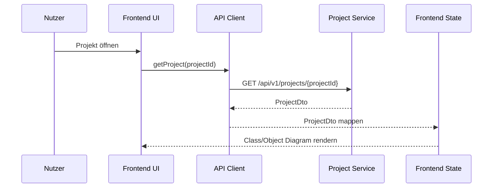
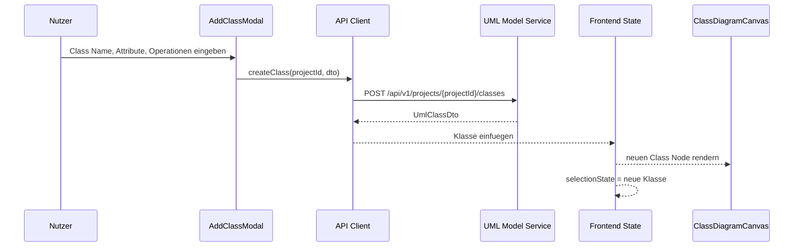
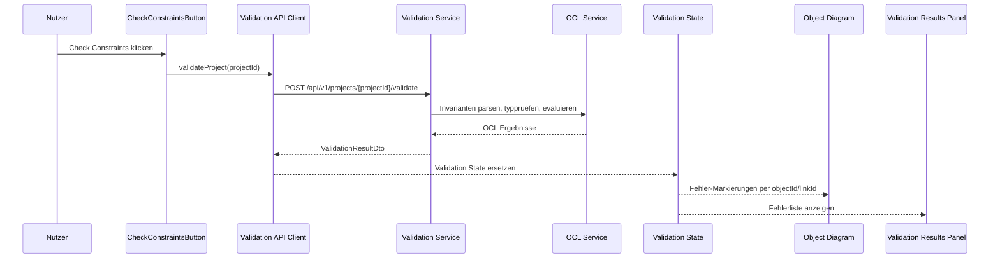
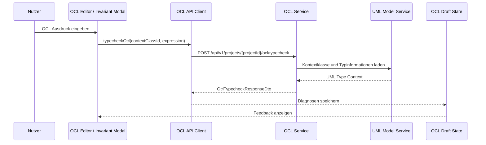

# API Flow

## Zweck dieser Datei

Diese Datei beschreibt die wichtigsten API-Flows zwischen React/TypeScript-Frontend und Java/Spring-Boot-Backend. Sie ergänzt den API-Vertrag um konkrete Abläufe: Welche UI-Aktion löst einen Request aus, welcher Backend-Service verarbeitet ihn, welche Response kommt zurück und wie das Frontend seinen State aktualisiert.

Die Datei ist bewusst flow-orientiert. Sie listet nicht nur Endpunkte, sondern beschreibt die fachliche Interaktion zwischen UI, API Client, Backend-Services, DTOs und Frontend-State.

## API-Flow-Prinzipien

| Prinzip | Bedeutung für Flows |
|---|---|
| UI-Aktion startet Flow | Jeder Flow beginnt mit einer konkreten Nutzeraktion oder einem App-Lifecycle-Ereignis. |
| API Client kapselt HTTP | React-Komponenten rufen keine rohen `fetch`-Requests auf. |
| Backend validiert fachlich | Fachliche Gültigkeit wird im Backend geprüft, nicht im Frontend entschieden. |
| Frontend aktualisiert State explizit | Responses werden in Server State, UI State, Selection State, Layout State oder Validation State gemappt. |
| Validation Results sind keine technischen Fehler | Constraint-Verletzungen kommen als strukturierte `ValidationResultDto`. |
| Technische Fehler sind getrennt | HTTP-/Netzwerkfehler werden als `ApiErrorDto` behandelt. |
| Stabile IDs verbinden UI und Backend | Responses enthalten IDs, die Canvas, Explorer, Properties Panel und Validation UI referenzieren. |

## Flow-Übersicht

| Nr. | Flow | Trigger im Frontend | Endpoint | Backend-Service | Response DTO | MVP |
|---|---|---|---|---|---|---|
| 1 | Projekt erstellen | Create-New-Project-Formular Submit | `POST /api/v1/projects` | Project Service | `ProjectDto` | Ja |
| 2 | Projekt laden | App-Start oder Projekt öffnen | `GET /api/v1/projects/{projectId}` | Project Service | `ProjectDto` | Ja |
| 3 | Projekt speichern | Save Button | `PUT /api/v1/projects/{projectId}` | Project/Persistence Service | `ProjectDto` oder `SaveResultDto` | Ja |
| 3a | Bestehendes Projekt importieren | `Open Existing` auf Dashboard | `POST /api/v1/projects/import` | Project Import Service | `ImportResultDto` / `ProjectDto` | MVP für JSON, Should für `.use` |
| 3a-USE | Lokale `.use`-Datei öffnen | `Open Existing Project` Modal, `.use` Datei, `Open Project` | MVP-nah: `POST /api/v1/projects` + `POST /api/v1/projects/{projectId}/model-text/apply`; später `POST /api/v1/projects/import/use` | Project Service, Model Text Parser/Importer, später Use Import Service | `ApplyModelTextResponseDto` / `ImportResultDto` / `ProjectDto` | Should |
| 3b | Recent Projects laden | Dashboard öffnen | `GET /api/v1/projects/recent` | Project Service | `ProjectSummaryDto[]` | Should |
| 3c | Recent Project öffnen | Recent Project Card klicken | `GET /api/v1/projects/{projectId}` | Project Service | `ProjectDto` | Should |
| 3d | All Projects laden | `View all` auf Dashboard oder Route `/projects` | `GET /api/v1/projects` | Project Service | `ProjectSummaryDto[]` | Should |
| 3e | Projekt aus All Projects öffnen | Projektkarte oder `Open` auf Projektliste | `GET /api/v1/projects/{projectId}` | Project Service | `ProjectDto` | Should |
| 4 | Klasse erstellen | Add Class Modal Submit | `POST /api/v1/projects/{projectId}/classes` | UML Model Service | `UmlClassDto` | Ja |
| 5 | Klasse bearbeiten | Class Properties ändern | `PUT /api/v1/projects/{projectId}/classes/{classId}` | UML Model Service | `UmlClassDto` | Ja |
| 6 | Association erstellen | Add Association Modal Submit | `POST /api/v1/projects/{projectId}/associations` | UML Model Service | `UmlAssociationDto` | Ja |
| 6a | Binäre Association und End-Metadaten atomar aktualisieren | Association Properties Save | `PUT /api/projects/{projectId}/uml/associations/{associationId}` | UML Model Service | `UmlAssociationDto` mit stabilen End-IDs und berechnetem `navigationType` | B6 |
| 7 | Invariante erstellen | Add Invariant Modal Submit | `POST /api/v1/projects/{projectId}/invariants` | UML/OCL Service | `UmlInvariantDto` | Ja |
| 8 | Objekt erstellen | Add Object Aktion | `POST /api/v1/projects/{projectId}/objects` | Object Model Service | `ObjectInstanceDto` | Ja |
| 9 | Objektwert bearbeiten | Object Properties Slot ändern | `PUT /api/v1/projects/{projectId}/objects/{objectId}` | Object Model Service | `ObjectInstanceDto` | Ja |
| 10 | Objektlink erstellen | Add Object Association Modal Submit | `POST /api/v1/projects/{projectId}/links` | Object Model Service | `ObjectLinkDto` | Ja |
| 10a | Klasse löschen | Delete in Class Properties oder Explorer | `DELETE /api/v1/projects/{projectId}/classes/{classId}` | UML Model Service, Project Service | `ProjectDto` oder `204 No Content` | Ja |
| 10b | Attribut löschen | Delete bei Attribute Row | `DELETE /api/v1/projects/{projectId}/classes/{classId}/attributes/{attributeId}` | UML Model Service, Object Model Service | `ProjectDto` oder `204 No Content` | Ja |
| 10c | Operation löschen | Delete bei Operation Row | `DELETE /api/v1/projects/{projectId}/classes/{classId}/operations/{operationId}` | UML Model Service | `ProjectDto` oder `204 No Content` | Ja |
| 10d | Association löschen | Delete in Association Properties oder Explorer | `DELETE /api/v1/projects/{projectId}/associations/{associationId}` | UML Model Service, Object Model Service | `ProjectDto` oder `204 No Content` | Ja |
| 10e | Objekt löschen | Delete in Object Properties oder Explorer | `DELETE /api/v1/projects/{projectId}/objects/{objectId}` | Object Model Service | `ProjectDto` oder `204 No Content` | Ja |
| 10f | Objektlink löschen | Delete in Object Association Properties | `DELETE /api/v1/projects/{projectId}/links/{linkId}` | Object Model Service | `ProjectDto` oder `204 No Content` | Ja |
| 10g | Invariante löschen | Delete in Invariant Properties oder Explorer | `DELETE /api/v1/projects/{projectId}/invariants/{invariantId}` | UML Model Service, OCL Service | `ProjectDto` oder `204 No Content` | Ja |
| 11 | Constraints prüfen | Check Constraints Button | `POST /api/v1/projects/{projectId}/validate` | Validation Service | `ValidationResultDto` | Ja |
| 12 | OCL-Ausdruck parsen | OCL Editor Feedback oder Modal Submit | `POST /api/v1/projects/{projectId}/ocl/parse` | OCL Service | `OclParseResponseDto` | Should |
| 13 | OCL-Ausdruck typprüfen | OCL Editor Feedback oder Save | `POST /api/v1/projects/{projectId}/ocl/typecheck` | OCL Service | `OclTypecheckResponseDto` | Should |
| 13a | Vollständigen Modelltext anwenden | `Apply Changes` im OCL Editor | `POST /api/v1/projects/{projectId}/model-text/apply` oder `PUT /api/v1/projects/{projectId}` | Project/OCL Import Service | `ApplyModelTextResponseDto` oder `ProjectDto` | MVP/Should |
| 14 | OCL-Ausdruck auswerten | Debug/Testaktion, späterer OCL Editor | `POST /api/v1/projects/{projectId}/ocl/evaluate` | OCL Service | `OclEvaluateResponseDto` | Post-MVP/Should |

## Projekt-Flows

### Flow 1: Projekt erstellen

| Aspekt | Beschreibung |
|---|---|
| Trigger im Frontend | Nutzer klickt auf dem Dashboard `+ Start Project`, gibt im Create-New-Project-Dialog aus `18-create-new-projects.png` einen Projektnamen ein und bestätigt. |
| Endpoint | `POST /api/v1/projects` |
| Request DTO | `CreateProjectRequestDto`; `name` ist Pflichtfeld. |
| Backend-Service | `ProjectService`, `PersistenceService` |
| Response DTO | `ProjectDto` |
| Frontend-State-Update | `createProjectFormState` wird geschlossen, `projectQuery` wird gesetzt, `activeView` auf Class Diagram, `selectionState` auf `none`, leere Layoutdaten initialisieren. |
| Fehlerfälle | leerer Projektname, ungültiger Projektname, Speicherfehler, Serverfehler. |
| Screenshot-Bezug | `00-dashboard-start-page.png`, `18-create-new-projects.png`; danach Class Diagram aus `01-class-diagram-class-properties.png`. |
| MVP-Relevanz | Hoch |

```http
POST /api/v1/projects
Content-Type: application/json
```

```json
{
  "name": "Library Example",
  "description": "MVP model for UML/OCL validation"
}
```

Response:

```json
{
  "formatVersion": "1.0",
  "project": {
    "id": "project-library",
    "name": "Library Example",
    "description": "MVP model for UML/OCL validation",
    "createdAt": "2026-07-22T16:51:33Z",
    "updatedAt": "2026-07-22T16:51:33Z"
  },
  "umlModel": {
    "classes": [],
    "associations": [],
    "invariants": []
  },
  "objectModel": {
    "id": "snapshot-current",
    "name": "Current Snapshot",
    "objects": [],
    "links": []
  },
  "layout": {
    "classDiagram": {
      "nodes": [],
      "edges": []
    },
    "objectDiagram": {
      "nodes": [],
      "edges": []
    }
  },
  "validationState": {
    "lastCheckedAt": null,
    "status": null,
    "summary": null
  },
  "extensions": {}
}
```

Frontend-Navigation nach erfolgreicher Response:

```text
Dashboard
-> + Start Project
-> Projektname eingeben
-> POST /api/v1/projects
-> ProjectDto.project.id = project-library
-> /projects/project-library/class-diagram
```

### Flow 2: Projekt laden

| Aspekt | Beschreibung |
|---|---|
| Trigger im Frontend | App öffnet Route `/projects/{projectId}/class-diagram` oder Nutzer wählt Projekt. |
| Endpoint | `GET /api/v1/projects/{projectId}` |
| Request DTO | keines, nur `projectId` |
| Backend-Service | `ProjectService`, `PersistenceService` |
| Response DTO | `ProjectDto` |
| Frontend-State-Update | TanStack Query speichert Server State; Diagramm-Layout wird in Diagram View Models gemappt; Explorer und Properties Panel erhalten Daten. |
| Fehlerfälle | `404 PROJECT_NOT_FOUND`, ungültige Projektversion, beschädigtes JSON, Netzwerkfehler. |
| Screenshot-Bezug | `01-class-diagram-class-properties.png`, `06-object-diagram-object-properties.png` |
| MVP-Relevanz | Hoch |

### Flow 3: Projekt speichern

| Aspekt | Beschreibung |
|---|---|
| Trigger im Frontend | Nutzer klickt Save Icon oder automatischer Save wird ausgelöst. |
| Endpoint | `PUT /api/v1/projects/{projectId}` |
| Request DTO | direktes `ProjectDto` |
| Backend-Service | `ProjectService`, `PersistenceService`, optional `ProjectLoadValidator` |
| Response DTO | `ProjectDto` |
| Frontend-State-Update | Server State wird aktualisiert; `dirtyState` wird zurückgesetzt; Console erhält Save-Eintrag. |
| Fehlerfälle | Versionskonflikt, ungültige Referenzen, Speicherfehler, zu alte `formatVersion`. |
| Screenshot-Bezug | Save Icon in Top Bar in Class/Object Diagram Screens. |
| MVP-Relevanz | Hoch |

```http
PUT /api/v1/projects/project-library
Content-Type: application/json
```

### Flow 3a: Bestehendes Projekt importieren

| Aspekt | Beschreibung |
|---|---|
| Trigger im Frontend | Nutzer klickt auf dem Dashboard `Open Existing`; Screenshot `14-open-existing-project.png` zeigt danach das Importmodal. |
| Endpoint | `POST /api/v1/projects/import` für MVP-JSON; MVP-nah für `.use`: Projekt anlegen und `POST /api/v1/projects/{projectId}/model-text/apply`; später direkter `POST /api/v1/projects/import/use`. |
| Request DTO | `ImportProjectRequestDto`, `ApplyModelTextRequestDto` oder später Multipart Upload |
| Backend-Service | `ProjectImportService`, `ProjectService`, optional später `UseImportService` |
| Response DTO | `ImportResultDto` mit `ProjectDto` oder Importdiagnosen |
| Frontend-State-Update | Importstatus aktualisieren; bei Erfolg Projekt in Server State übernehmen und zur Class Diagram View navigieren. |
| Fehlerfälle | ungültiges JSON, nicht unterstützte Formatversion, falsche Dateiendung, leere `.use` Datei, nicht unterstützte USE-Syntax, Syntaxfehler in Importdatei. |
| Screenshot-Bezug | `00-dashboard-start-page.png`, `14-open-existing-project.png`, bei Diagnosen auch `13-ocl-editor.png` |
| MVP-Relevanz | JSON Import MVP/Should; lokaler `.use` Model-Text-Import Should; vollständige USE-Kompatibilität Post-MVP |

MVP-Entscheidung:

- Das Dashboard darf `.use` Import sichtbar machen und `14-open-existing-project.png` macht dafür ein konkretes Modal erforderlich.
- Der verpflichtende MVP-Import bleibt zunächst das JSON-Projektformat.
- Lokale `.use`-Dateien können im MVP-nahen Scope als Modelltext angewendet werden.
- Vollständiger `.use` Import wird erst MVP, wenn der Scope ausdrücklich erweitert wird.

```http
POST /api/v1/projects/import
Content-Type: application/json
```

MVP-naher `.use`-Datei-Flow aus dem Open-Existing-Modal:

```http
POST /api/v1/projects/{projectId}/model-text/apply
Content-Type: application/json
```

```json
{
  "sourceName": "Library.use",
  "modelText": "model Library\n\nclass Book\nattributes\n  title : String\nend\n",
  "sourceFormat": "USE_TEXT"
}
```

```json
{
  "status": "APPLIED_WITH_WARNINGS",
  "project": {
    "id": "project-imported-library",
    "name": "Library"
  },
  "diagnostics": [
    {
      "severity": "WARNING",
      "code": "UNSUPPORTED_USE_FEATURE",
      "message": "Nicht unterstützte USE-Syntax wurde übersprungen.",
      "source": {
        "line": 18,
        "column": 1
      }
    }
  ]
}
```

```json
{
  "format": "json",
  "content": {
    "formatVersion": "0.1",
    "name": "Imported Library",
    "umlModel": {
      "classes": [],
      "associations": [],
      "invariants": []
    },
    "objectModel": {
      "objects": [],
      "links": []
    },
    "layout": {}
  }
}
```

### Flow 3b: Recent Projects laden

| Aspekt | Beschreibung |
|---|---|
| Trigger im Frontend | Dashboard wird geöffnet. |
| Endpoint | `GET /api/v1/projects/recent` |
| Request DTO | keines |
| Backend-Service | `ProjectService`, optional `RecentProjectService` |
| Response DTO | `ProjectSummaryDto[]` |
| Frontend-State-Update | `recentProjectsQuery` wird gesetzt; `RecentProjectsSection` rendert Projektkarten. |
| Fehlerfälle | Backend nicht erreichbar, keine Recent Projects vorhanden. |
| Screenshot-Bezug | `00-dashboard-start-page.png` mit `University System`, `Hotel Management`, `Bank ATM`. |
| MVP-Relevanz | Should |

Entscheidung für den MVP:

- Wenn echte Projektpersistenz noch nicht vollständig ist, dürfen Recent Projects zunächst Mock- oder Demo-Daten sein.
- Die UI sollte trotzdem so gebaut werden, dass sie später `ProjectSummaryDto[]` aus dem Backend verwenden kann.

```json
[
  {
    "id": "project-university",
    "name": "University System",
    "updatedAt": "2026-07-15T10:00:00Z"
  },
  {
    "id": "project-hotel",
    "name": "Hotel Management",
    "updatedAt": "2026-07-14T15:30:00Z"
  },
  {
    "id": "project-bank-atm",
    "name": "Bank ATM",
    "updatedAt": "2026-07-13T09:20:00Z"
  }
]
```

### Flow 3c: Recent Project öffnen

| Aspekt | Beschreibung |
|---|---|
| Trigger im Frontend | Nutzer klickt eine Recent Project Card auf dem Dashboard. |
| Endpoint | `GET /api/v1/projects/{projectId}` |
| Request DTO | keines |
| Backend-Service | `ProjectService`, `PersistenceService` |
| Response DTO | `ProjectDto` |
| Frontend-State-Update | Projekt wird in Server State geladen; Navigation zu `/projects/{projectId}/class-diagram`. |
| Fehlerfälle | Projekt nicht gefunden, keine Berechtigung, beschädigtes Projektformat. |
| Screenshot-Bezug | `00-dashboard-start-page.png` |
| MVP-Relevanz | Should |

```json
{
  "id": "project-library",
  "formatVersion": "0.1",
  "apiVersion": "v1",
  "name": "Library Example",
  "umlModel": {
    "id": "uml-library",
    "classes": [],
    "associations": [],
    "invariants": []
  },
  "objectModel": {
    "id": "snapshot-current",
    "name": "Current Snapshot",
    "objects": [],
    "links": []
  },
  "layout": {
    "classDiagram": {
      "nodes": []
    },
    "objectDiagram": {
      "nodes": []
    }
  }
}
```

### Flow 3d: All Projects laden

| Aspekt | Beschreibung |
|---|---|
| Trigger im Frontend | Nutzer klickt auf dem Dashboard `View all` oder öffnet direkt `/projects`. |
| Endpoint | `GET /api/v1/projects` |
| Request DTO | keines; optional später Query-Parameter wie `search`, `sort`, `filter`, `page`. |
| Backend-Service | `ProjectService`, `PersistenceService` |
| Response DTO | `ProjectSummaryDto[]` oder später paginierte `ProjectListResponseDto` |
| Frontend-State-Update | `projectListQuery` wird gesetzt; `ProjectsPage` rendert Suchfeld, Filter, Aktionen und Projektkarten. |
| Fehlerfälle | Backend nicht erreichbar, keine Projekte vorhanden, Such-/Filterparameter ungültig. |
| Screenshot-Bezug | `19-projects.png` |
| MVP-Relevanz | Should |

```http
GET /api/v1/projects
Accept: application/json
```

```json
[
  {
    "id": "project-university",
    "name": "University System",
    "description": "Class diagram for university enrollment",
    "updatedAt": "2026-07-22T14:00:00Z"
  },
  {
    "id": "project-library",
    "name": "Library Catalog",
    "description": "Book borrowing and returning process",
    "updatedAt": "2026-07-08T10:30:00Z"
  }
]
```

### Flow 3e: Projekt aus All Projects öffnen

| Aspekt | Beschreibung |
|---|---|
| Trigger im Frontend | Nutzer klickt eine Projektkarte oder wählt ein Projekt und klickt `Open`. |
| Endpoint | `GET /api/v1/projects/{projectId}` |
| Request DTO | keines |
| Backend-Service | `ProjectService`, `PersistenceService` |
| Response DTO | `ProjectDto` |
| Frontend-State-Update | Projekt wird in Server State geladen; Navigation zu `/projects/{projectId}/class-diagram` oder später zur zuletzt genutzten View. |
| Fehlerfälle | Projekt nicht gefunden, Projektformat ungültig, keine Berechtigung, Netzwerkfehler. |
| Screenshot-Bezug | `19-projects.png`; Zielansicht typischerweise `01-class-diagram-class-properties.png`. |
| MVP-Relevanz | Should |

Hinweis: `+ New Project` auf der All-Projects-Seite nutzt denselben Flow wie `Start Project` auf dem Dashboard.

## Klassendiagramm-Flows

### Flow 4: Klasse erstellen

| Aspekt | Beschreibung |
|---|---|
| Trigger im Frontend | Nutzer öffnet `AddClassModal` und klickt Submit. |
| Endpoint | `POST /api/v1/projects/{projectId}/classes` |
| Request DTO | `CreateClassRequestDto` |
| Backend-Service | `UmlModelService` |
| Response DTO | `UmlClassDto` |
| Frontend-State-Update | Klasse wird in `umlModel.classes` übernommen; `selectionState` wird auf neue Klasse gesetzt; Layout erhält initiale Position. |
| Fehlerfälle | leerer Name, doppelter Klassenname, ungültige Attribute, ungültige Operationensignatur. |
| Screenshot-Bezug | `08-modal-add-class.png`, `04-class-diagram-new-class-selected.png` |
| MVP-Relevanz | Hoch |

```json
{
  "name": "User",
  "attributes": [
    {
      "name": "books",
      "type": "Integer"
    }
  ],
  "operations": [
    {
      "name": "canBorrow",
      "parameters": [],
      "returnType": "Boolean"
    }
  ]
}
```

### Flow 5: Klasse bearbeiten

| Aspekt | Beschreibung |
|---|---|
| Trigger im Frontend | Nutzer ändert Name, Abstraktheit oder direkte Oberklassen im `ClassPropertiesPanel`. Attribute und Operationen verwenden weiterhin ihre eigenen Endpunkte. |
| Endpoint | `PUT /api/v1/projects/{projectId}/classes/{classId}` |
| Request DTO | `UmlClassDto`; B4 wertet `name`, `abstractClass` und `superClassIds` aus. `id`, `attributes` und `operations` im Request ersetzen weder die stabile Klassen-ID noch die vorhandenen Featurelisten. |
| Backend-Service | `UmlModelService` |
| Response DTO | `UmlClassDto` |
| Frontend-State-Update | Klasse im Server State wird ersetzt; abhängige View Models werden neu berechnet; alte Validation Results werden als stale markiert. |
| Fehlerfälle | `CLASS_NOT_FOUND`, `DUPLICATE_CLASS_NAME`, `SELF_GENERALIZATION`, `DUPLICATE_SUPERCLASS`, `UNKNOWN_SUPERCLASS`, `GENERALIZATION_CYCLE`, `AMBIGUOUS_INHERITED_FEATURE`, `ABSTRACT_CLASS_HAS_INSTANCES`. |
| Screenshot-Bezug | `01-class-diagram-class-properties.png`, `04-class-diagram-new-class-selected.png` |
| MVP-Relevanz | Hoch |

```json
{
  "id": "class-student",
  "name": "Student",
  "attributes": [],
  "operations": [],
  "abstractClass": false,
  "superClassIds": ["class-person"]
}
```

Die Änderung wird vollständig validiert und erst danach gespeichert. Schlägt
eine Generalisierungsregel fehl, bleibt das bisherige Modell unverändert. Die
Fehlerantwort verwendet den allgemeinen `ApiErrorDto` und enthält den stabilen
Fehlercode sowie fachliche Details wie `classId`, `superClassId` oder
`conflictingSuperClassIds`.

### Flow 5b: Sichtbarkeit, Packages und Imports bearbeiten

| Aktion | Endpoint | Request/Response |
|---|---|---|
| Attribut einschließlich Sichtbarkeit aktualisieren | `PUT /api/v1/projects/{projectId}/classes/{classId}/attributes/{attributeId}` | `UmlAttributeDto` |
| Operation einschließlich Sichtbarkeit aktualisieren | `PUT /api/v1/projects/{projectId}/classes/{classId}/operations/{operationId}` | `UmlOperationDto` |
| Package anlegen | `POST /api/v1/projects/{projectId}/packages` | `UmlPackageDto` |
| Import anlegen | `POST /api/v1/projects/{projectId}/imports` | `UmlModelImportDto` |
| Import entfernen | `DELETE /api/v1/projects/{projectId}/imports/{importId}` | `ProjectDto` |

Der Klassen-Endpunkt aus Flow 5 verarbeitet zusätzlich `visibility` und
`packageId`; `qualifiedName` wird vom Backend berechnet und ist read-only. Alte
Requests ohne B5-Felder verwenden `PUBLIC`, Root-Package und eine leere
Importliste.

Mögliche Fehlercodes sind `UNKNOWN_NAMESPACE`, `UNKNOWN_IMPORT_NAMESPACE`,
`DUPLICATE_NAMESPACE`, `DUPLICATE_IMPORT`, `DUPLICATE_IMPORT_ALIAS`,
`DUPLICATE_QUALIFIED_NAME` und `IMPORT_CYCLE`. OCL-Typechecker-Diagnostics
verwenden zusätzlich `INACCESSIBLE_CLASSIFIER`, `INACCESSIBLE_FEATURE` und
`AMBIGUOUS_QUALIFIED_NAME`.

### Flow 6: Association erstellen

| Aspekt | Beschreibung |
|---|---|
| Trigger im Frontend | Nutzer füllt `AddAssociationModal` und klickt Submit. |
| Endpoint | `POST /api/v1/projects/{projectId}/associations` |
| Request DTO | `CreateAssociationRequestDto` |
| Backend-Service | `UmlModelService` |
| Response DTO | `UmlAssociationDto` |
| Frontend-State-Update | Association wird in `umlModel.associations` eingefügt; neue Edge erscheint im Class Diagram; optional Selektion auf Association. |
| Fehlerfälle | Source/Target Class unbekannt, Rollenname ungültig, Multiplizität ungültig, doppelter Association-Name. |
| Screenshot-Bezug | `10-modal-add-class-association.png`, `02-class-diagram-association-properties.png` |
| MVP-Relevanz | Hoch |

```json
{
  "name": "Borrows",
  "ends": [
    {
      "classId": "class-user",
      "roleName": "borrower",
      "multiplicity": {
        "lower": 0,
        "upper": "*"
      },
      "navigable": true
    },
    {
      "classId": "class-book",
      "roleName": "borrowedBooks",
      "multiplicity": {
        "lower": 0,
        "upper": 5
      },
      "navigable": true
    }
  ]
}
```

### Flow 7: Invariante erstellen

| Aspekt | Beschreibung |
|---|---|
| Trigger im Frontend | Nutzer füllt `AddInvariantModal` und speichert. |
| Endpoint | `POST /api/v1/projects/{projectId}/invariants` |
| Request DTO | `CreateInvariantRequestDto` |
| Backend-Service | `UmlModelService`, `OclService` optional für Syntax/Typecheck |
| Response DTO | `UmlInvariantDto`, optional `OclDiagnosticDto[]` |
| Frontend-State-Update | Invariante wird in `umlModel.invariants` übernommen; Explorer-Gruppe `Invariants` aktualisiert; Validation Results werden stale. |
| Fehlerfälle | Kontextklasse unbekannt, leerer Name, syntaktisch ungültiger OCL-Ausdruck, OCL ergibt nicht Boolean. |
| Screenshot-Bezug | `09-modal-add-invariant.png`, `03-class-diagram-invariant-properties.png` |
| MVP-Relevanz | Hoch |

```json
{
  "name": "maxBooks",
  "contextClassId": "class-user",
  "expression": "self.books <= 5",
  "enabled": true
}
```

## Objektdiagramm-Flows

### Flow 8: Objekt erstellen

| Aspekt | Beschreibung |
|---|---|
| Trigger im Frontend | Nutzer klickt Add Object oder vergleichbare Aktion im Object Diagram. |
| Endpoint | `POST /api/v1/projects/{projectId}/objects` |
| Request DTO | `CreateObjectRequestDto` |
| Backend-Service | `ObjectModelService` |
| Response DTO | `ObjectInstanceDto` |
| Frontend-State-Update | Objekt wird in `objectModel.objects` eingefügt; Layout erhält initiale Position; Selektion wechselt auf neues Objekt. |
| Fehlerfälle | Klasse unbekannt, Objektname doppelt, Default-Slots können nicht erzeugt werden. |
| Screenshot-Bezug | indirekt: `06-object-diagram-object-properties.png` zeigt Ergebniszustand. |
| MVP-Relevanz | Hoch |

```json
{
  "name": "alice",
  "classId": "class-user",
  "slots": [
    {
      "attributeId": "attr-user-books",
      "value": 6,
      "valueType": "Integer"
    }
  ]
}
```

### Flow 9: Objektwert bearbeiten

| Aspekt | Beschreibung |
|---|---|
| Trigger im Frontend | Nutzer ändert Slot-Wert im `ObjectPropertiesPanel`. |
| Endpoint | `PUT /api/v1/projects/{projectId}/objects/{objectId}` |
| Request DTO | `UpdateObjectRequestDto` |
| Backend-Service | `ObjectModelService` |
| Response DTO | `ObjectInstanceDto` |
| Frontend-State-Update | Objekt im Server State wird ersetzt; Object Node zeigt neuen Slot-Wert; Validation Results werden stale. |
| Fehlerfälle | Objekt unbekannt, Attribut unbekannt, Wert passt nicht zum Attributtyp, leere Pflichtwerte. |
| Screenshot-Bezug | `06-object-diagram-object-properties.png` |
| MVP-Relevanz | Hoch |

### Flow 10: Objektlink erstellen

| Aspekt | Beschreibung |
|---|---|
| Trigger im Frontend | Nutzer füllt `AddObjectAssociationModal` und klickt Submit. |
| Endpoint | `POST /api/v1/projects/{projectId}/links` |
| Request DTO | `CreateObjectLinkRequestDto` |
| Backend-Service | `ObjectModelService`, optional `ValidationService` für Link-Kompatibilität |
| Response DTO | `ObjectLinkDto` |
| Frontend-State-Update | Link wird in `objectModel.links` eingefügt; Object Diagram rendert neue Edge; Validation Results werden stale. |
| Fehlerfälle | Source/Target Object unbekannt, Association unbekannt, Objektklassen passen nicht zur Association, doppelter Link. |
| Screenshot-Bezug | `11-modal-add-object-association.png`, `12-object-diagram-association-properties.png` |
| MVP-Relevanz | Hoch |

```json
{
  "associationId": "assoc-borrows",
  "sourceObjectId": "object-alice",
  "targetObjectId": "object-mobydick"
}
```

## Delete-Flows

Delete-Flows sind MVP-relevant, weil Nutzer Modellierungsfehler korrigieren können müssen. Das Frontend zeigt Delete-Aktionen und Confirm Dialogs; das Backend entscheidet die fachlichen Cascade-Regeln und liefert einen konsistenten Projektzustand zurück.

### Flow 10a-10g: Elemente löschen

| Element | Trigger im Frontend | Endpoint | Backend-Service | Frontend-State-Update | Fehlerfälle |
|---|---|---|---|---|---|
| Klasse | Delete in Class Properties, Explorer oder selektierter Class Node | `DELETE /api/v1/projects/{projectId}/classes/{classId}` | UML Model Service, Project Service | Class Node, Explorer-Eintrag, abhängige Associations, Objekte, Layout und Validation Targets entfernen oder aktualisiertes `ProjectDto` übernehmen. | Klasse nicht gefunden, Cascade-Konflikt, Speicherfehler. |
| Attribut | Delete bei Attributzeile in Class Properties | `DELETE /api/v1/projects/{projectId}/classes/{classId}/attributes/{attributeId}` | UML Model Service, Object Model Service | Attribut aus Class Node entfernen, betroffene Slots aus Objekt-State entfernen, Validation Results bereinigen. | Attribut nicht gefunden, Klasse nicht gefunden. |
| Operation | Delete bei Operationzeile in Class Properties | `DELETE /api/v1/projects/{projectId}/classes/{classId}/operations/{operationId}` | UML Model Service | Operation aus Class Node und Properties Panel entfernen. | Operation nicht gefunden. |
| Association | Delete in Association Properties, Explorer oder selektierter Edge | `DELETE /api/v1/projects/{projectId}/associations/{associationId}` | UML Model Service, Object Model Service | Edge entfernen, zugehörige Object Links entfernen, Layout und Validation Targets bereinigen. | Association nicht gefunden. |
| Invariante | Delete in Invariant Properties oder Explorer | `DELETE /api/v1/projects/{projectId}/invariants/{invariantId}` | UML Model Service, OCL Service | Invariant Badge und OCL-Eintrag entfernen, Validation Results bereinigen. | Invariante nicht gefunden. |
| Objekt | Delete in Object Properties, Explorer oder selektierter Object Node | `DELETE /api/v1/projects/{projectId}/objects/{objectId}` | Object Model Service | Object Node, Slots, zugehörige Links, Layout und Validation Targets entfernen. | Objekt nicht gefunden. |
| Objektlink | Delete in Object Association Properties oder selektierter Edge | `DELETE /api/v1/projects/{projectId}/links/{linkId}` | Object Model Service | Object Link Edge entfernen, Selection leeren, Validation Results bereinigen. | Link nicht gefunden. |

Empfohlenes MVP-Response-Verhalten:

```http
DELETE /api/v1/projects/project-library/classes/class-user
Accept: application/json
```

```json
{
  "formatVersion": "1.0",
  "project": {
    "id": "project-library",
    "name": "Library Example"
  },
  "umlModel": {
    "classes": [],
    "associations": [],
    "invariants": []
  },
  "objectModel": {
    "objects": [],
    "links": []
  },
  "layout": {
    "classDiagram": {
      "nodes": [],
      "edges": []
    },
    "objectDiagram": {
      "nodes": [],
      "edges": []
    }
  },
  "validationState": {
    "lastCheckedAt": null,
    "status": null,
    "summary": null
  }
}
```

Alternativ ist `204 No Content` möglich, wenn das Frontend nach dem Delete das Projekt neu lädt. Für den MVP ist ein aktualisiertes `ProjectDto` ergonomischer, weil Canvas, Explorer, Properties Panel und Validation State direkt synchronisiert werden können.

### Cascade-Regeln im MVP

| Löschaktion | Backend-Regel im MVP |
|---|---|
| Klasse löschen | Klasse, Attribute, Operationen, Invarianten der Klasse, Associations mit der Klasse, Objekte dieser Klasse, Slots und betroffene Objektlinks löschen. |
| Attribut löschen | Attribut und Slots dieses Attributs löschen. |
| Association löschen | Association und alle Object Links dieser Association löschen. |
| Objekt löschen | Objekt, Slots und Object Links mit diesem Objekt löschen. |
| Objektlink löschen | Nur den konkreten Link löschen. |
| Operation löschen | Nur die Operation-Signatur löschen. |
| Invariante löschen | Nur die Invariante und stale Validation Targets löschen. |

## OCL-Flows

### Flow 12: OCL-Ausdruck parsen

| Aspekt | Beschreibung |
|---|---|
| Trigger im Frontend | Nutzer tippt im OCL Editor, klickt Parse/Check im OCL Editor oder speichert eine Invariante; optional debounce. |
| Endpoint | `POST /api/v1/projects/{projectId}/ocl/parse` |
| Request DTO | `OclParseRequestDto` |
| Backend-Service | `OclService`, `OclParser` |
| Response DTO | `OclParseResponseDto` |
| Frontend-State-Update | `oclDraftState` und `oclDiagnosticsState` erhalten Diagnosen; OCL Editor oder Invariant Properties zeigen Syntaxfehler; Invariante wird nicht fachlich bewertet. |
| Fehlerfälle | Syntaxfehler, unerwartetes Token, unvollständiger Ausdruck, OCL-Parser interner Fehler. |
| Screenshot-Bezug | `09-modal-add-invariant.png`, `03-class-diagram-invariant-properties.png`, `13-ocl-editor.png` |
| MVP-Relevanz | Should |

```json
{
  "contextClassId": "class-user",
  "expression": "self.books <= 5"
}
```

### Flow 13: OCL-Ausdruck typprüfen

| Aspekt | Beschreibung |
|---|---|
| Trigger im Frontend | Nutzer klickt `Typecheck` im OCL Editor, speichert Invariante oder öffnet OCL Editor Feedback. |
| Endpoint | `POST /api/v1/projects/{projectId}/ocl/typecheck` |
| Request DTO | `OclTypecheckRequestDto` |
| Backend-Service | `OclService`, `OclTypechecker`, `UmlModelService` |
| Response DTO | `OclTypecheckResponseDto` |
| Frontend-State-Update | `oclDraftState` und `oclDiagnosticsState` erhalten Typecheck-Ergebnis; Fehler werden im OCL Editor, am OCL Input oder im Invariant Properties Panel angezeigt. |
| Fehlerfälle | unbekanntes Attribut, ungültige Association Navigation, inkompatible Operatoren, Ausdruck ergibt nicht Boolean. |
| Screenshot-Bezug | `03-class-diagram-invariant-properties.png`, `09-modal-add-invariant.png`, `13-ocl-editor.png` |
| MVP-Relevanz | Should |

### Flow 14: OCL-Ausdruck auswerten

| Aspekt | Beschreibung |
|---|---|
| Trigger im Frontend | Post-MVP Debugaktion oder späterer OCL Editor Test gegen ein Kontextobjekt. |
| Endpoint | `POST /api/v1/projects/{projectId}/ocl/evaluate` |
| Request DTO | `OclEvaluateRequestDto` |
| Backend-Service | `OclService`, `OclEvaluator`, `ObjectModelService` |
| Response DTO | `OclEvaluateResponseDto` |
| Frontend-State-Update | Ergebnis wird im OCL Editor, Console oder Debug Panel angezeigt. |
| Fehlerfälle | Kontextobjekt unbekannt, Evaluation Error, fehlender Slot-Wert, ungültige Navigation. |
| Screenshot-Bezug | `13-ocl-editor.png` für textuellen Editor/Diagnostics; indirekt über `07-object-diagram-validation-error.png`; im MVP läuft Evaluation primär über `validate`. |
| MVP-Relevanz | Post-MVP oder Should |

```json
{
  "contextClassId": "class-user",
  "contextObjectId": "object-alice",
  "expression": "self.books <= 5"
}
```

Response:

```json
{
  "status": "OK",
  "resultType": "Boolean",
  "value": false,
  "diagnostics": []
}
```

## Validierungs-Flows

### Flow 11: Constraints prüfen

| Aspekt | Beschreibung |
|---|---|
| Trigger im Frontend | Nutzer klickt `Check Constraints` in der Top Bar. |
| Endpoint | `POST /api/v1/projects/{projectId}/validate` |
| Request DTO | `ValidationRequestDto`; im MVP entweder nur `projectId` oder optional vollständiger Project Draft |
| Backend-Service | `ValidationService`, `UmlModelService`, `ObjectModelService`, `OclService` |
| Response DTO | `ValidationResultDto` |
| Frontend-State-Update | `validationState` wird ersetzt; `errorMappingState` indexiert errors nach Element-ID; Bottom Panel wechselt zu Validation Results; Diagramm markiert Fehler. |
| Fehlerfälle | Projekt nicht gefunden, ungültiger Projektzustand, OCL Syntax/Type Error, Evaluation Error, technische Backendfehler. |
| Screenshot-Bezug | `07-object-diagram-validation-error.png` |
| MVP-Relevanz | Hoch |

```http
POST /api/v1/projects/project-library/validate
Content-Type: application/json
```

```json
{
  "mode": "FULL",
  "includeWarnings": true
}
```

Response:

```json
{
  "status": "INVALID",
  "summary": {
    "errorCount": 1,
    "warningCount": 0,
    "infoCount": 0
  },
  "errors": [
    {
      "id": "err-max-books-alice",
      "code": "INVARIANT_VIOLATION",
      "severity": "ERROR",
      "message": "Invariant maxBooks is violated for object alice.",
      "userMessage": "alice verletzt die Invariante maxBooks.",
      "targets": [
        {
          "elementType": "OBJECT",
          "elementId": "obj-alice"
        },
        {
          "elementType": "INVARIANT",
          "elementId": "inv-max-books"
        }
      ],
      "context": {
        "contextClass": "User",
        "contextObject": "alice",
        "expression": "self.books <= 5",
        "actualResult": false
      }
    }
  ]
}
```

## Fehler-Flows

| Fehlerfall | Typischer Flow | Transport | Frontend-Reaktion |
|---|---|---|---|
| Pflichtfeld fehlt | Klasse/Association/Invariante erstellen | lokale UI-Validierung oder `ApiErrorDto` | Formularfehler anzeigen, Request ggf. verhindern |
| Ressource nicht gefunden | Projekt laden, Klasse bearbeiten | HTTP `404` mit `ApiErrorDto` | Fehlerseite, Toast oder Reload anbieten |
| Ungültige Referenz | Object Link erstellen, Association erstellen | HTTP `400` mit `ApiErrorDto` oder `ValidationErrorDto` | Formularfehler und Console-Eintrag |
| OCL Syntax Error | OCL parse/typecheck/validate | `OclDiagnosticDto` oder `ValidationErrorDto` | OCL Input markieren, Validation Results ergänzen |
| Invariant Violation | Constraints prüfen | `ValidationResultDto` mit `status = INVALID` | Objekt markieren, Fehlerliste zeigen |
| Netzwerkfehler | jeder Request | Client-seitiger API Error | Retry, Toast, nicht als fachlicher Fehler darstellen |
| Serverfehler | jeder Request | HTTP `500` mit `ApiErrorDto` | technische Meldung, Trace-ID optional anzeigen |

Beispiel für technischen Fehler:

```json
{
  "code": "API_PROJECT_NOT_FOUND",
  "message": "Project not found.",
  "userMessage": "Das Projekt konnte nicht gefunden werden.",
  "details": {
    "projectId": "project-library"
  },
  "traceId": "trace-001"
}
```

## Mermaid-Sequenzdiagramme

### Projekt laden



### Klasse erstellen



### Check Constraints



### OCL Typecheck



## MVP-Flows

| Flow | MVP-Status | Begründung |
|---|---|---|
| Projekt erstellen | Muss | Einstieg in die Anwendung. |
| Projekt laden | Muss | Grundlage für alle Views. |
| Projekt speichern | Muss | MVP braucht JSON Save/Load. |
| Klasse erstellen | Muss | Kern des Klassendiagramms. |
| Klasse bearbeiten | Muss | Properties Panel und Modellierung. |
| Association erstellen | Muss | Rollen, Multiplizitäten und Navigation. |
| Invariante erstellen | Muss | OCL-Validierungskern. |
| Objekt erstellen | Muss | Objektdiagramm/Snapshot. |
| Objektwert bearbeiten | Muss | OCL-Auswertung benötigt Slot-Werte. |
| Objektlink erstellen | Muss | Snapshot-Links und Multiplicity Checks. |
| Constraints prüfen | Muss | zentraler MVP-Durchstich. |
| OCL parsen | Sollte | hilfreich für UX; spätestens im Validate enthalten. |
| OCL typprüfen | Sollte | hilfreich für UX; spätestens im Validate enthalten. |
| OCL einzeln auswerten | Optional/Post-MVP | Debug/Editor-Komfort, nicht zwingend für MVP. |

## Post-MVP-Flows

| Flow | Beschreibung | Mögliche Endpunkte |
|---|---|---|
| `.use` Import | Nutzer importiert USE-Modell; Backend liefert Importdiagnosen. | `POST /api/v1/projects/import/use` |
| `.use` Export | Projekt wird als `.use`-ähnliches Format exportiert. | `GET /api/v1/projects/{id}/export/use` |
| mehrere Snapshots | Nutzer erstellt, dupliziert oder wechselt Snapshots. | `/projects/{id}/snapshots` |
| OCL Autocomplete | Frontend fragt Symbole, Rollen, Attribute und Typen ab. | `/projects/{id}/ocl/completions` |
| Undo/Redo mit Backend | Projektänderungen werden versioniert. | `/projects/{id}/revisions` |
| Projektliste | Nutzer wählt aus mehreren Projekten. | `GET /api/v1/projects` |
| Kollaboration | mehrere Nutzer bearbeiten denselben Stand. | WebSocket oder Realtime API |

## Offene Fragen

| Frage | Relevanz | Vorläufige Empfehlung |
|---|---|---|
| Sendet `validate` nur `projectId` oder den vollständigen Draft? | Hoch | MVP: gespeicherter Projektzustand per `projectId`; später Draft-Validation ergänzen. |
| Werden Änderungen sofort gespeichert oder gesammelt? | Hoch | MVP: klare Save-Aktion; Mutationen können Server State aktualisieren. |
| Gibt es feingranulare Endpunkte für Attribute/Operationen? | Mittel | MVP kann Klasse als Ganzes aktualisieren; später granularisieren. |
| Soll `createObjectLink` ungültige Links zulassen? | Mittel | Backend entscheidet; Frontend kann nur offensichtliche Auswahlfehler verhindern. |
| Sind OCL parse/typecheck eigene Endpunkte oder nur Teil von validate? | Mittel | Eigene Endpunkte als Should für bessere UX. |
| Wie werden Layoutänderungen gespeichert? | Mittel | MVP: im `ProjectDto` über Save; Post-MVP: eigener Layout-Endpunkt möglich. |

## Zusammenfassung

Die API-Flows bilden den vollständigen vertikalen MVP-Durchstich ab:

```text
Projekt laden
-> Klassendiagramm bearbeiten
-> Invariante erfassen
-> Objektdiagramm bearbeiten
-> Objektlinks erzeugen
-> Constraints pruefen
-> Validation Results anzeigen und Diagrammelemente markieren
```

Entscheidend ist, dass jeder Flow stabile IDs und strukturierte DTOs verwendet. Das Frontend aktualisiert UI- und Server State anhand der Responses, während das Backend fachliche Semantik, OCL-Verarbeitung und Constraint Validation zentral verantwortet.
