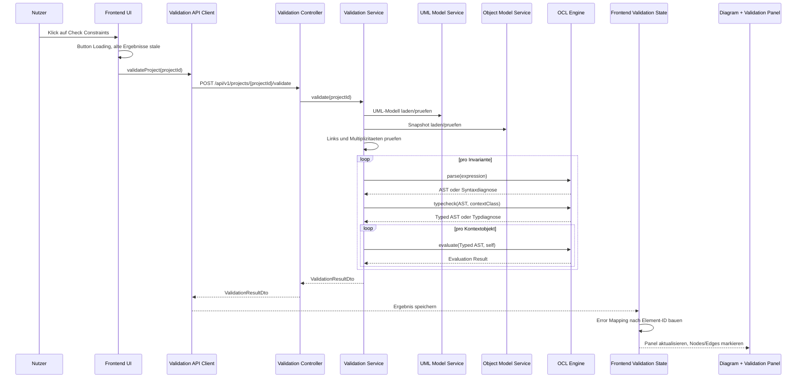
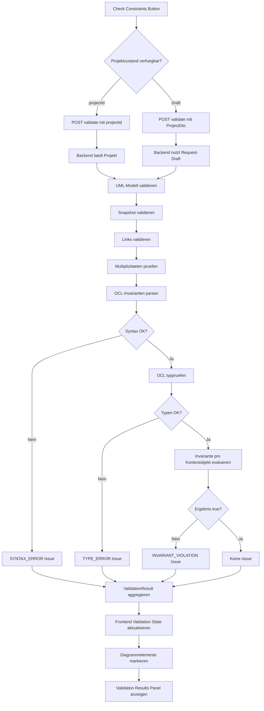

# Validation Flow

## Zweck dieser Datei

Diese Datei beschreibt den vollständigen Validierungsfluss vom Klick auf `Check Constraints` im Frontend bis zur Anzeige von Fehlern im Diagramm und im Validation Results Panel.

Der Flow verbindet Frontend-Interaktion, REST/JSON-API, Backend-Validierung, OCL-Verarbeitung, strukturierte `ValidationResult`-Antworten und UI-Mapping. Der zentrale Referenz-Screenshot ist `07-object-diagram-validation-error.png`.

## Überblick

Der Validierungsfluss ist der wichtigste vertikale MVP-Durchstich:

```text
Check Constraints
-> Validation Request
-> Backend Validation Service
-> UML-/Snapshot-/Multiplicity-/OCL-Prüfung
-> ValidationResult
-> Frontend Validation State
-> Diagramm-Markierung
-> Validation Results Panel
-> Fokus auf betroffenes Element
```

Leitentscheidung:

- Das Backend entscheidet fachlich, ob ein Zustand gültig ist.
- Das Frontend entscheidet, wie das Ergebnis visualisiert und navigierbar gemacht wird.
- Das Frontend wertet OCL nicht selbst aus.
- Jede fachliche Meldung muss maschinenlesbare Zielreferenzen enthalten.

## Auslöser im Frontend

| Aspekt | Beschreibung |
|---|---|
| UI-Aktion | Nutzer klickt `Check Constraints` in der Top Bar. |
| Sichtbarer Kontext | Class Diagram, Object Diagram oder OCL Editor kann aktiv sein. |
| Primärer Screenshot | `07-object-diagram-validation-error.png` |
| Frontend-Komponenten | `CheckConstraintsButton`, `ValidationApiClient`, `ValidationResultsPanel`, `ObjectDiagramCanvas`, `ValidationBadge` |
| Frontend-State vor Request | Projekt geladen, optional lokale Änderungen, alte Validation Results eventuell stale. |


MVP-Verhalten:

1. Button wechselt in Loading-Zustand.
2. Frontend ruft Validation API auf.
3. Vorherige Validation Results bleiben sichtbar oder werden als stale markiert.
4. Nach Response ersetzt das neue Ergebnis den alten Validation State.
5. Bottom Panel zeigt `Validation Results`.
6. Diagrammelemente mit Fehlern werden markiert.

## Request-Struktur

Für den MVP gibt es zwei mögliche Request-Varianten.

| Variante | Beschreibung | Empfehlung |
|---|---|---|
| Projekt-ID | Backend validiert den gespeicherten Projektzustand. | Einfacher MVP, wenn Save vor Validate klar ist. |
| Projekt-Draft | Frontend sendet aktuellen ungespeicherten Projektzustand mit. | Nützlich, wenn Nutzer ohne explizites Save validieren soll. |

Empfehlung für den MVP: `projectId` als Standard verwenden und später optional Draft-Validation ergänzen. Wenn die UI Änderungen sofort über Mutations speichert, reicht `projectId`.

### Request mit Projekt-ID

```http
POST /api/v1/projects/project-library/validate
Content-Type: application/json
```

```json
{
  "mode": "FULL",
  "includeWarnings": true
}
```

### Request mit Projekt-Draft

```json
{
  "mode": "FULL",
  "includeWarnings": true,
  "project": {
    "id": "project-library",
    "formatVersion": "0.1",
    "umlModel": {
      "id": "uml-library",
      "classes": [],
      "associations": [],
      "invariants": []
    },
    "objectModel": {
      "id": "snapshot-current",
      "objects": [],
      "links": []
    },
    "layout": {}
  }
}
```

## Backend-Verarbeitung

Der Backend-Flow wird vom `ValidationService` koordiniert.

| Schritt | Backend-Aktion | Ergebnis |
|---|---|---|
| 1 | Projekt laden oder Draft übernehmen. | `Project` als Domänenobjekt |
| 2 | Projektstruktur prüfen. | fehlende Modellblöcke, ungültige IDs |
| 3 | UML-Modell validieren. | Klassen, Attribute, Operationen, Associations, Rollen, Multiplizitäten |
| 4 | Snapshot validieren. | Objekte, Klassenzuordnung, Slots |
| 5 | Links validieren. | Object Links gegen Associations |
| 6 | Multiplizitäten prüfen. | Linkanzahl pro Objekt und Association-Ende |
| 7 | OCL-Invarianten parsen. | AST oder `SYNTAX_ERROR` |
| 8 | OCL-Invarianten typprüfen. | Typed AST oder `TYPE_ERROR` |
| 9 | Invarianten für Kontextobjekte evaluieren. | Boolean-Ergebnis oder `EVALUATION_ERROR` |
| 10 | errors aggregieren. | `ValidationResultDto` |

Wichtige Regel: Ein Fehler in einer Ebene soll möglichst nicht alle unabhängigen Prüfungen verhindern. Wenn eine Invariante syntaktisch ungültig ist, wird nur diese Invariante nicht evaluiert; andere Invarianten können weiterhin geprüft werden.

## Validierungsebenen

| Ebene | Prüft | Typische Targets | Typische Codes |
|---|---|---|---|
| Projektstruktur | Existenz von `umlModel`, `objectModel`, IDs, Formatversion | `projectId` | `TYPE_ERROR` |
| UML-Modell | Klassen, Attribute, Operationen, Associations, Rollen, Multiplizitäten | `classId`, `attributeId`, `associationId`, `associationEndId` | `UNKNOWN_CLASS`, `TYPE_ERROR` |
| Snapshot | Objekte, Slots, Objektidentität, Klassenzuordnung | `objectId`, `slotId`, `classId` | `UNKNOWN_CLASS`, `UNKNOWN_ATTRIBUTE`, `INVALID_SLOT_VALUE` |
| Linkvalidierung | Object Links gegen Association-Enden | `linkId`, `associationId`, `objectId` | `INVALID_LINK` |
| Multiplizitäten | Anzahl der Links an Association-Enden | `associationId`, `associationEndId`, `objectId`, `linkId` | `MULTIPLICITY_VIOLATION` |
| OCL-Syntax | Lexer/Parser für Invariantenausdruck | `invariantId`, `classId`, OCL Range | `SYNTAX_ERROR` |
| OCL-Typechecking | Attribute, Rollen, Operatoren, Collection-Operationen | `invariantId`, `classId`, `attributeId`, `associationId` | `TYPE_ERROR`, `UNKNOWN_ATTRIBUTE` |
| OCL-Evaluation | Auswertung je Kontextobjekt | `invariantId`, `objectId`, `classId` | `INVARIANT_VIOLATION`, `EVALUATION_ERROR` |

## Validation Response

`ValidationResultDto` ist die zentrale Antwort für `Check Constraints`.

```ts
type ValidationStatus = "VALID" | "INVALID" | "ERROR";
type Severity = "ERROR" | "WARNING" | "INFO";

interface ValidationResultDto {
  status: ValidationStatus;
  summary: {
    errorCount: number;
    warningCount: number;
    infoCount: number;
  };
  errors: ValidationErrorDto[];
}

interface ValidationErrorDto {
  id: string;
  code: ValidationErrorCode;
  severity: Severity;
  message: string;
  userMessage?: string;
  targets: ElementTargetDto[];
  context?: Record<string, unknown>;
}

interface ElementTargetDto {
  elementType:
    | "PROJECT"
    | "CLASS"
    | "ATTRIBUTE"
    | "OPERATION"
    | "ASSOCIATION"
    | "ASSOCIATION_END"
    | "INVARIANT"
    | "OBJECT"
    | "SLOT"
    | "OBJECT_LINK"
    | "OCL_EXPRESSION";
  elementId: string;
  path?: string;
}
```

### Gültiger Zustand

```json
{
  "status": "VALID",
  "summary": {
    "errorCount": 0,
    "warningCount": 0,
    "infoCount": 0
  },
  "errors": []
}
```

Frontend-Verhalten:

- Validation Results Panel zeigt gültigen Zustand.
- Fehlerrahmen und Badges werden entfernt.
- Console kann `Validation completed: valid` protokollieren.

### Ungültiger Zustand

```json
{
  "status": "INVALID",
  "summary": {
    "errorCount": 1,
    "warningCount": 0,
    "infoCount": 0
  },
  "errors": [
    {
      "id": "err-max-books-alice",
      "code": "INVARIANT_VIOLATION",
      "severity": "ERROR",
      "message": "Invariant maxBooks is violated for object alice.",
      "userMessage": "alice verletzt die Invariante maxBooks.",
      "targets": [
        {
          "elementType": "OBJECT",
          "elementId": "obj-alice"
        },
        {
          "elementType": "INVARIANT",
          "elementId": "inv-max-books"
        },
        {
          "elementType": "CLASS",
          "elementId": "class-user"
        }
      ],
      "context": {
        "contextClass": "User",
        "contextObject": "alice",
        "expression": "self.books <= 5",
        "actualResult": false
      }
    }
  ]
}
```

Frontend-Verhalten:

- Validation Results Panel zeigt `1 Error`.
- `object-alice` wird im Object Diagram rot markiert.
- Invariante `inv-max-books` kann im Explorer oder OCL Editor markiert werden.
- Klick auf den Fehler fokussiert `alice : User`.

## Error Codes

| Code | Bedeutung | Severity im MVP | Primäre UI-Darstellung |
|---|---|---|---|
| `SYNTAX_ERROR` | OCL-Ausdruck oder strukturelles Feld ist syntaktisch ungültig. | `ERROR` | OCL Editor, Invariant Properties, Validation Results |
| `TYPE_ERROR` | Typregel verletzt, z. B. ungültiger Operator. | `ERROR` | OCL Editor, Class Diagram, Validation Results |
| `UNKNOWN_CLASS` | Referenzierte Klasse existiert nicht. | `ERROR` | Explorer, Properties Panel, Validation Results |
| `UNKNOWN_ATTRIBUTE` | Attribut existiert im Kontext nicht. | `ERROR` | OCL Editor, Class/Object Properties |
| `INVALID_SLOT_VALUE` | Slot-Wert passt nicht zum Attributtyp. | `ERROR` | Object Properties, Object Node Badge |
| `INVALID_LINK` | Object Link passt nicht zur Association. | `ERROR` | Object Link Edge, Object Association Properties |
| `MULTIPLICITY_VIOLATION` | Linkanzahl verletzt Multiplicity. | `ERROR` | Object Diagram, Link/Object Badge, Validation Results |
| `INVARIANT_VIOLATION` | OCL-Invariante ergibt `false`. | `ERROR` | Object Node, Validation Results |
| `EVALUATION_ERROR` | OCL-Auswertung konnte nicht abgeschlossen werden. | `ERROR` | Validation Results, optional Console |

## Mapping auf Frontend-Elemente

Das Frontend baut aus `errors[].targets` einen Fehlerindex.

```ts
type ValidationErrorIndex = {
  byClassId: Record<string, ValidationErrorDto[]>;
  byAttributeId: Record<string, ValidationErrorDto[]>;
  byAssociationId: Record<string, ValidationErrorDto[]>;
  byInvariantId: Record<string, ValidationErrorDto[]>;
  byObjectId: Record<string, ValidationErrorDto[]>;
  bySlotId: Record<string, ValidationErrorDto[]>;
  byLinkId: Record<string, ValidationErrorDto[]>;
};
```

| Target Type | Ziel im Frontend | Typische Komponente |
|---|---|---|
| `CLASS` | Class Node, Explorer Classes, Class Properties | `UmlClassNode`, `ClassPropertiesPanel` |
| `ATTRIBUTE` | Attribute-Zeile, Slot Mapping, OCL Diagnose | `AttributeEditor`, `SlotEditor` |
| `ASSOCIATION` | Association Edge im Class Diagram | `UmlAssociationEdge` |
| `ASSOCIATION_END` | Rollen-/Multiplicity-Feld | `AssociationPropertiesPanel` |
| `INVARIANT` | Invariant List Item, OCL Editor, Invariant Properties | `InvariantPropertiesPanel`, `OclEditorView` |
| `OBJECT` | Object Node, Explorer Objects, Object Properties | `ObjectNode`, `ObjectPropertiesPanel` |
| `SLOT` | Slot-Zeile im Properties Panel | `SlotValueEditor` |
| `OBJECT_LINK` | Object Link Edge | `ObjectLinkEdge`, `ObjectAssociationPropertiesPanel` |
| `OCL_EXPRESSION` | Textbereich oder Source Range | `OclExpressionInput` |

Fokus-Priorität im MVP:

| Fehlercode | Primäres Fokusziel | Sekundäres Fokusziel |
|---|---|---|
| `INVARIANT_VIOLATION` | `OBJECT` | `INVARIANT` |
| `MULTIPLICITY_VIOLATION` | `OBJECT` oder `OBJECT_LINK` | `ASSOCIATION` |
| `INVALID_LINK` | `OBJECT_LINK` | beteiligte `OBJECT`-Targets |
| `INVALID_SLOT_VALUE` | `OBJECT` | `SLOT` |
| `SYNTAX_ERROR` | `INVARIANT` oder `OCL_EXPRESSION` | `CLASS` |
| `TYPE_ERROR` | `INVARIANT` | `CLASS`, `ATTRIBUTE`, `ASSOCIATION` |

## UI-Aktualisierung

Nach erfolgreicher Response aktualisiert das Frontend mehrere Zustände:

| State | Aktualisierung |
|---|---|
| `validationState` | vollständiges `ValidationResultDto` speichern |
| `errorMappingState` | errors nach Target-ID indexieren |
| `activeBottomPanelTab` | auf `validation-results` wechseln |
| `consoleState` | Validierungslauf protokollieren |
| `diagramMarkerState` | aus `errorMappingState` ableiten |
| `selectionState` | unverändert, bis Nutzer Fehler anklickt |
| `validationStaleState` | auf `false` setzen |

Bei Modelländerungen nach dem Check:

- alte Ergebnisse bleiben optional sichtbar,
- UI setzt `validationStaleState = true`,
- Badges können blasser dargestellt oder entfernt werden,
- nächster Check ersetzt das Ergebnis.

## Beispiel: maxBooks-Verletzung

Ausgangsmodell:

```text
class User
  books : Integer

context User inv maxBooks:
  self.books <= 5

object alice : User
  books = 6
```

Backend-Auswertung:

| Schritt | Ergebnis |
|---|---|
| Kontextklasse finden | `User` |
| Kontextobjekte finden | `alice : User` |
| Ausdruck parsen | AST für `self.books <= 5` |
| Ausdruck typprüfen | `self.books` ist `Integer`, `5` ist `Integer`, Ergebnis ist `Boolean` |
| Ausdruck evaluieren | `6 <= 5` ergibt `false` |
| Issue erzeugen | `INVARIANT_VIOLATION` für `object-alice` und `inv-max-books` |

Frontend-Anzeige:

| UI-Bereich | Darstellung |
|---|---|
| Object Diagram | `alice : User` erhält roten Rahmen und Fehler-Badge |
| Validation Results Panel | Fehler `maxBooks` für `alice` wird angezeigt |
| Explorer | optional Fehlerindikator bei `alice` oder `maxBooks` |
| Properties Panel | bei Auswahl von `alice` können relevante Slots sichtbar sein |
| Klick auf Fehler | Object Diagram wird aktiv, `alice` wird fokussiert und selektiert |

## Screenshot-Bezug

`07-object-diagram-validation-error.png` zeigt den Zielzustand nach einem fehlgeschlagenen Constraint Check.

| Sichtbarer Aspekt | Ableitung für Flow |
|---|---|
| Check Constraints Button | Trigger für `POST /api/v1/projects/{projectId}/validate` |
| Object Diagram aktiv | Fehler können direkt im Snapshot sichtbar werden |
| `alice : User` rot markiert | `ValidationErrorDto.targets` enthält `OBJECT obj-alice` |
| Fehler-Badge am Objekt | Frontend indexiert errors nach `objectId` |
| Validation Results Panel | `ValidationResultDto.summary` und `errors` werden angezeigt |
| `1 Error` | Summary aus Backend bestimmt Count |
| Fehlertext mit Invariante | Issue-Kontext enthält `invariantId`, Name und Expression |

## Mermaid-Sequenzdiagramm



## Mermaid-Flussdiagramm



## MVP-Anforderungen

| ID | Anforderung | Akzeptanzhinweis |
|---|---|---|
| `VAL-FLOW-MVP-001` | `Check Constraints` löst eine Backend-Validierung aus. | Button ruft `POST /api/v1/projects/{projectId}/validate` auf. |
| `VAL-FLOW-MVP-002` | Backend prüft UML-Modell, Snapshot, Links, Multiplizitäten und OCL-Invarianten. | Response enthält strukturierte errors je Ebene. |
| `VAL-FLOW-MVP-003` | Response enthält Summary und Error-Liste. | Frontend kann `errorCount`, `warningCount`, `infoCount` und `errors` anzeigen. |
| `VAL-FLOW-MVP-004` | errors enthalten stabile Targets. | Mindestens `objectId`, `invariantId`, `classId`, `associationId` oder `linkId`. |
| `VAL-FLOW-MVP-005` | Frontend markiert fehlerhafte Objekte. | `alice : User` kann roten Rahmen und Badge erhalten. |
| `VAL-FLOW-MVP-006` | Validation Results Panel zeigt Details. | Fehlercode, Message, Kontext und betroffene Elemente sind sichtbar. |
| `VAL-FLOW-MVP-007` | Klick auf Fehler fokussiert betroffenes Element. | Object Diagram wird aktiv und Node wird selektiert/zentriert. |
| `VAL-FLOW-MVP-008` | Gültiger Zustand entfernt alte Fehler. | Keine Badges/Highlights bei `status = VALID`. |

## Post-MVP-Erweiterungen

| Erweiterung | Auswirkung auf Validation Flow |
|---|---|
| mehrere Snapshots | Request enthält aktive `snapshotId`; errors referenzieren Snapshot. |
| OCL Autocomplete | zusätzliche OCL-Kontextendpunkte, aber gleicher Validate-Flow. |
| erweiterte OCL-Operationen | Typechecker/Evaluator liefern detailliertere Diagnosen. |
| `forAll`, `exists`, `select`, `collect` | errors können Collection-Kontext und Iterator-Variablen enthalten. |
| pre/post conditions | Validation Flow erhält Operation-/Transition-Kontext. |
| derived attributes | Evaluator muss abgeleitete Werte berechnen. |
| `.use` Import | Importdiagnosen können in dasselbe Issue-Modell überführt werden. |
| Projektversionierung | Validation Request enthält Revision oder Draft-Version. |

## Offene Fragen

| Frage | Relevanz | Vorläufige Empfehlung |
|---|---|---|
| Validiert das Backend gespeicherten Stand oder ungespeicherten Draft? | Hoch | MVP mit gespeichertem Stand, Draft-Validation als Erweiterung. |
| Werden Validation Results persistiert? | Niedrig | Nein, im MVP temporär im Frontend halten. |
| Wie detailliert sollen OCL Source Ranges sein? | Mittel | MVP optional, aber DTO sollte `range` ermöglichen. |
| Werden Warnungen bereits im MVP unterstützt? | Mittel | DTO unterstützt `WARNING`, UI kann zunächst Errors priorisieren. |
| Was passiert bei vielen Fehlern? | Mittel | Sortierung nach Severity und Gruppierung nach Elementtyp vorsehen. |
| Soll ein schwerer Strukturfehler OCL-Evaluation stoppen? | Hoch | Nur betroffene Invarianten/Objekte überspringen, andere Checks fortsetzen. |

## Zusammenfassung

Der Validation Flow macht aus einem Nutzerklick einen vollständig nachvollziehbaren fachlichen Prüfprozess:

```text
Frontend löst Check aus
-> Backend validiert Modell und Snapshot
-> OCL wird geparst, typgeprüft und evaluiert
-> Backend liefert strukturierte Validation Results
-> Frontend indexiert errors nach Element-ID
-> Diagramm und Validation Results Panel werden aktualisiert
```

Für den MVP ist entscheidend, dass `ValidationResultDto` nicht nur Texte liefert, sondern stabile Targets wie `objectId`, `classId`, `invariantId`, `associationId` und `linkId`. Nur so kann das Frontend den im Screenshot gezeigten Zustand zuverlässig herstellen: ein sichtbarer Fehler im Validation Results Panel und eine direkte visuelle Markierung des betroffenen Objekts im Objektdiagramm.
