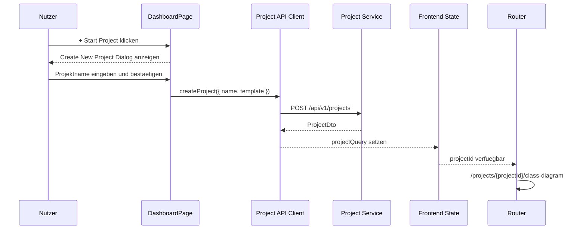
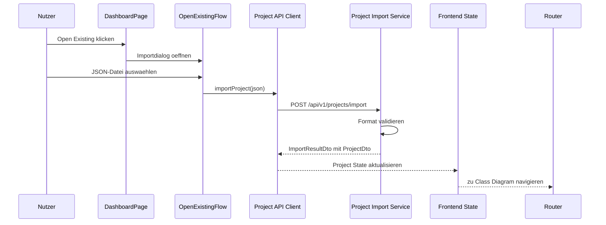
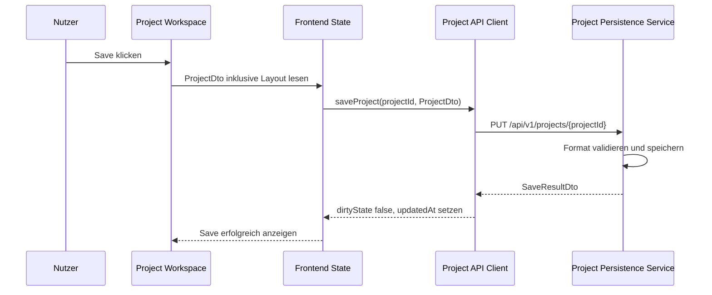
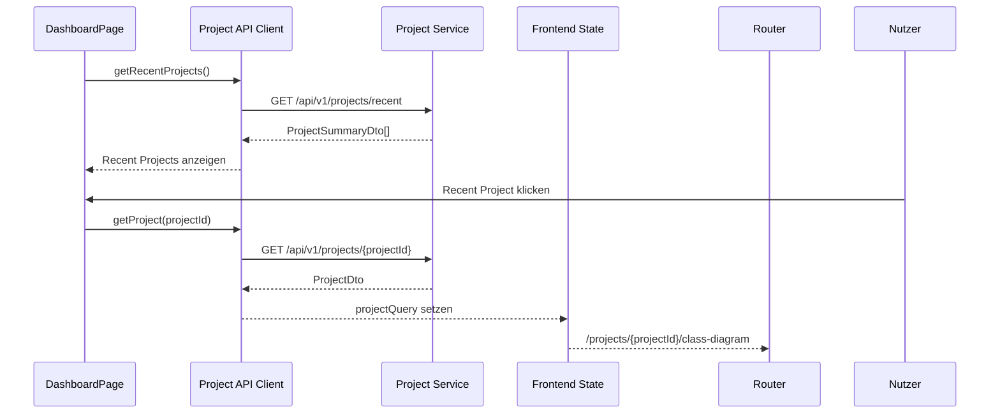
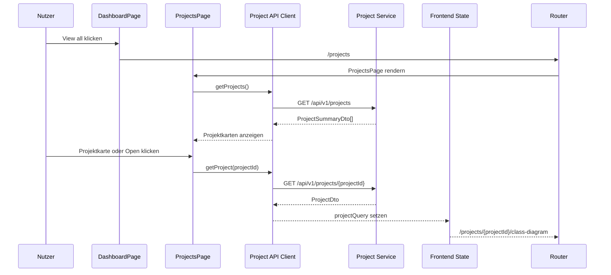

# Project Save/Load Flow

## Zweck dieser Datei

Diese Datei beschreibt den Speichern-/Laden-Flow für Projekte zwischen Frontend und Backend. Sie erklärt, wie Nutzer vom Dashboard aus neue Projekte starten, bestehende Projekte öffnen oder importieren, Recent Projects laden und Projektstände speichern oder als JSON exportieren.

Wichtig: Der Projektfluss startet nicht direkt im Klassendiagramm. Der Einstieg erfolgt über das Dashboard aus `assets/screenshots/00-dashboard-start-page.png`.

## Rolle des Dashboards im Projektfluss

Das Dashboard ist der erste projektbezogene Einstiegspunkt der Anwendung.


`View all` führt in die vollständige Projektliste aus Screenshot `19-projects.png`.


| Dashboard-Bereich | Nutzeraktion | Projektflow |
|---|---|---|
| `Create New Model` | `+ Start Project` klicken, Projektname eingeben und bestätigen | Neues Projekt im Backend erstellen und ins Klassendiagramm wechseln. |
| `Open Existing` | Open-Existing-Modal öffnen und Datei importieren | JSON-Projekt laden/importieren; lokale `.use`-Datei als Modelltext anwenden; vollständige `.use` Kompatibilität Post-MVP. |
| `Recent Projects` | Projektkarte öffnen | Projekt per ID laden und ins Klassendiagramm oder zuletzt genutzte View wechseln. |
| `View all` | vollständige Projektliste öffnen | All-Projects-Seite mit Suche, Filter, Projektkarten, `Open` und `+ New Project`. |
| `Documentation` | Hilfe öffnen | kein Projektflow, aber Dashboard-Einstieg. |
| `Examples` | Beispielmodelle öffnen | Demo-/Beispielprojekt laden oder erzeugen. |

Hauptworkflow:

```text
Dashboard
-> Start Project / Open Existing / Recent Project
-> bei Start Project: Projektname eingeben
-> bei Open Existing: lokale .use-Datei auswählen oder droppen
-> Class Diagram
-> Object Diagram
-> OCL / Invariants
-> Check Constraints
-> Validation Results
```

## Projektinhalt

Ein Projekt ist die speicherbare Arbeitseinheit des Systems.

| Bereich | Enthaltene Daten | MVP |
|---|---|---|
| Projektmetadaten | `id`, Name, Beschreibung, `createdAt`, `updatedAt`, `formatVersion` | Ja |
| UML-Klassenmodell | Klassen, Attribute, Operationen, Assoziationen, Rollen, Multiplizitäten | Ja |
| OCL/Invarianten | Kontextklasse, Invariant Name, OCL Expression, aktiv/deaktiviert | Ja |
| Objektmodell / Snapshot | aktueller Snapshot mit Objekten, Slots und Objektlinks | Ja |
| Layoutinformationen | Positionen von Klassen und Objekten, optional Viewport | Ja |
| Letzte Validation Results | letzter Check, Summary, errors | Optional, im MVP eher nicht persistent |
| Erweiterungen | spätere Felder für Vererbung, Enums, mehrere Snapshots, Importdaten | Post-MVP |

## Speichern im MVP

Im MVP reicht ein JSON-basiertes Speicherformat.

| Option | Beschreibung | Empfehlung |
|---|---|---|
| In-Memory + JSON Export | Projekt existiert nur zur Laufzeit, Export speichert Datei. | Gut für frühe Prototypen. |
| File-basiertes JSON Repository | Backend speichert Projekte als JSON-Dateien. | Gute MVP-Empfehlung. |
| Datenbankpersistenz | Backend speichert Projekte relational oder dokumentbasiert. | Post-MVP, wenn Projektliste, Nutzer und Versionierung benötigt werden. |

MVP-Entscheidung:

- JSON-Projektformat ist verbindlich.
- `.use` Import/Export ist nicht Pflicht.
- Layoutdaten werden im JSON mitgespeichert, aber getrennt von UML-/OCL-Semantik.
- Letzte Validation Results können temporär im Frontend bleiben und müssen nicht im Projektformat persistiert werden.

## Laden im MVP

Laden bedeutet:

1. Projektquelle bestimmen: neues Projekt, vorhandenes Backend-Projekt, JSON-Import oder Recent Project.
2. Backend erzeugt oder lädt ein `ProjectDto`.
3. Frontend hydratisiert Server State.
4. Frontend erzeugt View Models für Explorer, Diagramme, Properties Panel und Layout.
5. Navigation führt zur Class Diagram View oder perspektivisch zur zuletzt genutzten View.

Im MVP sollte nach dem Laden standardmäßig die Class Diagram View geöffnet werden. Eine zuletzt genutzte View ist eine sinnvolle Post-MVP-Erweiterung.

## Dashboard Flow: Start Project

Flow:

```text
Dashboard
-> + Start Project
-> Create New Project Dialog/Formular
-> Projektname eingeben
-> POST /api/v1/projects
-> Backend erstellt leeres Projekt
-> ProjectDto an Frontend
-> Frontend setzt Project Server State
-> Navigation zu /projects/{projectId}/class-diagram
```

HTTP-Beispiel:

```http
POST /api/v1/projects
Content-Type: application/json
```

```json
{
  "name": "Library Model",
  "template": "empty"
}
```

Response:

```json
{
  "id": "project-library-001",
  "name": "Library Model",
  "formatVersion": "0.1",
  "umlModel": {
    "id": "uml-untitled-001",
    "classes": [],
    "associations": [],
    "invariants": []
  },
  "objectModel": {
    "id": "snapshot-current",
    "name": "Current Snapshot",
    "objects": [],
    "links": []
  },
  "layout": {
    "classDiagram": {
      "nodes": []
    },
    "objectDiagram": {
      "nodes": []
    }
  }
}
```

### Leeres Projekt initialisieren

Ein leeres Projekt enthält:

- leeres `umlModel`,
- leeres `objectModel`,
- leere Layoutdaten,
- Projektmetadaten,
- Formatversion.

Das Frontend zeigt anschließend:

- Class Diagram View,
- Explorer mit leeren Gruppen,
- Properties Panel mit leerem oder projektbezogenem Startzustand,
- optional Console-Eintrag `Project created`.

### Beispielprojekt optional initialisieren

Das Dashboard kann später Templates oder Beispiele anbieten. Der Screenshot zeigt `Examples` im Bereich `Learn & Support`.

Möglicher Request:

```json
{
  "name": "Library Example",
  "template": "library-demo"
}
```

MVP-Einschätzung:

- Ein Library-Beispiel ist für Demo und Tests sinnvoll.
- Es muss nicht zwingend über das Dashboard auswählbar sein; eine vorbereitete Example-Funktion ist Should.

## Dashboard Flow: Open Existing

`Open Existing` ist der Einstieg für vorhandene Projekte.

Screenshot `14-open-existing-project.png` konkretisiert diesen Einstieg als Modal für lokale `.use`-Dateien. Das Modal liegt über dem Dashboard und enthält `Local File`, Upload-/Drag-and-drop-Fläche, Hinweis `Supported format: .use`, `Cancel` und `Open Project`.

Flow für JSON:

```text
Dashboard
-> Open Existing
-> Datei auswählen
-> Frontend sendet JSON an Backend
-> Backend validiert Format
-> Backend erzeugt/importiert Projekt
-> ProjectDto an Frontend
-> Navigation zu /projects/{projectId}/class-diagram
```

HTTP-Beispiel:

```http
POST /api/v1/projects/import
Content-Type: application/json
```

```json
{
  "format": "json",
  "content": {
    "formatVersion": "0.1",
    "project": {
      "id": "project-library",
      "name": "Library Example"
    },
    "umlModel": {
      "id": "uml-library",
      "classes": [],
      "associations": [],
      "invariants": []
    },
    "objectModel": {
      "id": "snapshot-current",
      "name": "Current Snapshot",
      "objects": [],
      "links": []
    },
    "layout": {}
  }
}
```

Response:

```json
{
  "status": "IMPORTED",
  "project": {
    "id": "project-library",
    "name": "Library Example",
    "formatVersion": "0.1"
  },
  "diagnostics": []
}
```

Flow für lokale `.use`-Datei im MVP-nahen Scope:

```text
Dashboard
-> Open Existing
-> Open Existing Project Modal
-> .use-Datei auswählen oder droppen
-> Frontend liest Datei als Text
-> POST /api/v1/projects
-> POST /api/v1/projects/{projectId}/model-text/apply
-> Backend verarbeitet unterstützten Modelltext-Subset
-> Apply-/Importdiagnosen zurückgeben
-> bei Erfolg Class Diagram öffnen
-> bei Diagnosen optional OCL Editor öffnen
```

HTTP-Beispiel:

```http
POST /api/v1/projects/{projectId}/model-text/apply
Content-Type: application/json
```

```json
{
  "sourceName": "Library.use",
  "sourceFormat": "USE_TEXT",
  "modelText": "model Library\n\nclass User\nattributes\n  books : Integer\nend\n"
}
```

Response:

```json
{
  "status": "APPLIED_WITH_WARNINGS",
  "projectId": "project-imported-library",
  "diagnostics": [
    {
      "severity": "WARNING",
      "code": "UNSUPPORTED_USE_FEATURE",
      "message": "Nicht unterstützte USE-Syntax wurde nicht übernommen.",
      "line": 12,
      "column": 1
    }
  ]
}
```

## Dashboard Flow: Recent Projects

Recent Projects sind im Dashboard sichtbar, etwa:

- `University System`,
- `Hotel Management`,
- `Bank ATM`.

Flow:

```text
Dashboard öffnen
-> GET /api/v1/projects/recent
-> RecentProjectsSection rendern
-> Nutzer klickt RecentProjectCard
-> GET /api/v1/projects/{projectId}
-> ProjectDto laden
-> Class Diagram View öffnen
```

MVP-Entscheidung:

| Thema | Entscheidung |
|---|---|
| Recent Projects UI | Should, weil Screenshot sichtbar. |
| Echte Backend-Daten | Should/Post-MVP, wenn Persistenz noch einfach ist. |
| Mock-/Demo-Daten | Im MVP akzeptabel, solange die spätere API-Struktur vorbereitet ist. |

HTTP-Beispiel:

```http
GET /api/v1/projects/recent
```

```json
[
  {
    "id": "project-university",
    "name": "University System",
    "updatedAt": "2026-07-15T09:00:00Z"
  },
  {
    "id": "project-hotel",
    "name": "Hotel Management",
    "updatedAt": "2026-07-14T16:15:00Z"
  },
  {
    "id": "project-bank-atm",
    "name": "Bank ATM",
    "updatedAt": "2026-07-13T11:45:00Z"
  }
]
```

## Dashboard Flow: All Projects

Die All-Projects-Seite ist der Zielzustand für `View all` im Dashboard. Sie zeigt alle verfügbaren Projekte als Karten und erlaubt Suche, Filtereinstieg, Öffnen und Projektneuanlage.

Flow:

```text
Dashboard öffnen
-> View all klicken
-> /projects öffnen
-> GET /api/v1/projects
-> Projektkarten rendern
-> Nutzer sucht/filtert optional
-> Nutzer klickt Projektkarte oder Open
-> GET /api/v1/projects/{projectId}
-> Class Diagram View öffnen
```

MVP-/Should-Entscheidung:

| Bestandteil | Entscheidung |
|---|---|
| All-Projects-Seite | Should, weil `19-projects.png` eine konkrete Zielansicht zeigt. |
| Projektkarten | Should; mindestens Name, Beschreibung und Änderungszeitpunkt. |
| Suche | Should; clientseitig über geladene `ProjectSummaryDto[]` ausreichend. |
| Filter | Later; Button kann sichtbar sein, aber komplexe Filterlogik ist Post-MVP. |
| `+ New Project` | Should; nutzt denselben Create-New-Project-Dialog wie Dashboard. |
| Serverseitige Pagination | Post-MVP. |

HTTP-Beispiel:

```http
GET /api/v1/projects
Accept: application/json
```

```json
[
  {
    "id": "project-university",
    "name": "University System",
    "description": "Class diagram for university enrollment",
    "updatedAt": "2026-07-22T14:00:00Z"
  },
  {
    "id": "project-library",
    "name": "Library Catalog",
    "description": "Book borrowing and returning process",
    "updatedAt": "2026-07-08T10:30:00Z"
  }
]
```

## JSON-Projektformat

Das JSON-Format ist neu und webtauglich. Es muss nicht identisch zur `.use`-Syntax sein.

Minimalstruktur:

```json
{
  "formatVersion": "0.1",
  "project": {
    "id": "project-library",
    "name": "Library Example",
    "description": "MVP example for UML/OCL validation",
    "createdAt": "2026-07-15T10:00:00Z",
    "updatedAt": "2026-07-15T10:30:00Z"
  },
  "umlModel": {
    "id": "uml-library",
    "classes": [],
    "associations": [],
    "invariants": []
  },
  "objectModel": {
    "id": "snapshot-current",
    "name": "Current Snapshot",
    "objects": [],
    "links": []
  },
  "layout": {
    "classDiagram": {
      "nodes": []
    },
    "objectDiagram": {
      "nodes": []
    }
  },
  "validationState": null,
  "extensions": {}
}
```

Pflichtfelder im MVP:

| Feld | Pflicht | Zweck |
|---|---|---|
| `formatVersion` | Ja | Version des Projektformats. |
| `project` | Ja | Metadaten. |
| `umlModel` | Ja | Klassenmodell und Invarianten. |
| `objectModel` | Ja | aktueller Snapshot. |
| `layout` | Should | UI-Layoutdaten, nicht fachliche Semantik. |
| `validationState` | Nein | optional letzter Validierungsstatus. |
| `extensions` | Nein | Erweiterungspunkt. |

## Layoutdaten

Layoutdaten werden vom Frontend erzeugt und vom Backend gespeichert.

| Layoutdatum | Quelle | Persistenz | Semantik |
|---|---|---|---|
| Klassenpositionen | Class Diagram Canvas | Ja | keine UML-Semantik |
| Objektpositionen | Object Diagram Canvas | Ja | keine Snapshot-Semantik |
| Viewport | Canvas | Optional | UI-Komfort |
| Edge-Routing | Diagrammbibliothek | Optional/Post-MVP | UI-Komfort |

Beispiel:

```json
{
  "layout": {
    "classDiagram": {
      "nodes": [
        {
          "elementId": "class-user",
          "x": 420,
          "y": 160
        }
      ],
      "viewport": {
        "x": 0,
        "y": 0,
        "zoom": 1
      }
    },
    "objectDiagram": {
      "nodes": [
        {
          "elementId": "object-alice",
          "x": 420,
          "y": 180
        }
      ]
    }
  }
}
```

Regeln:

- Layout referenziert fachliche Elemente über stabile IDs.
- Verwaiste Layoutdaten nach Löschung eines Elements dürfen ignoriert oder beim Speichern bereinigt werden.
- Layoutdaten dürfen keine fachliche Validierung beeinflussen.

## Save Flow

Manueller Save:

```text
Projektansicht
-> Nutzer klickt Save
-> Frontend sammelt aktuellen Project State inklusive Layout
-> PUT /api/v1/projects/{projectId}
-> Backend validiert Projektformat
-> Backend speichert Projekt
-> Response aktualisiert Server State
-> Frontend setzt dirtyState = false
```

HTTP-Beispiel:

```http
PUT /api/v1/projects/project-library
Content-Type: application/json
```

```json
{
  "formatVersion": "0.1",
  "project": {
    "id": "project-library",
    "name": "Library Example"
  },
  "umlModel": {
    "id": "uml-library",
    "classes": [],
    "associations": [],
    "invariants": []
  },
  "objectModel": {
    "id": "snapshot-current",
    "objects": [],
    "links": []
  },
  "layout": {}
}
```

Response:

```json
{
  "status": "SAVED",
  "projectId": "project-library",
  "savedAt": "2026-07-15T10:45:00Z",
  "formatVersion": "0.1"
}
```

### Autosave optional

Autosave ist nicht zwingend für den MVP.

| Option | Bewertung |
|---|---|
| Kein Autosave, nur Save Button | Einfach, transparent, MVP-tauglich. |
| Debounced Autosave | Bessere UX, aber Konflikt- und Fehlerbehandlung komplexer. |
| Autosave nur Layout | Möglich, aber sollte nicht vor Kernpersistenz priorisiert werden. |

MVP-Empfehlung: manueller Save Button als Pflicht, Autosave als Post-MVP oder Should.

## Load Flow

Projekt laden:

```text
Dashboard / Recent Project / Route
-> GET /api/v1/projects/{projectId}
-> Backend lädt Projekt aus Repository
-> Backend validiert Formatversion
-> ProjectDto an Frontend
-> TanStack Query speichert Server State
-> Frontend mappt Layout auf Diagrammzustand
-> Class Diagram View öffnet
```

HTTP-Beispiel:

```http
GET /api/v1/projects/project-library
```

Fehler bei ungültigem Projektformat:

```json
{
  "code": "PROJECT_FORMAT_INVALID",
  "message": "Project JSON does not match the expected format.",
  "userMessage": "Das Projektformat ist ungültig oder wird nicht unterstützt.",
  "details": {
    "formatVersion": "0.0",
    "expectedVersion": "0.1"
  }
}
```

## Import/Export

### JSON Import

JSON Import ist MVP-relevant, wenn Projekte dateibasiert ausgetauscht werden sollen.

| Schritt | Verantwortlich |
|---|---|
| Datei auswählen | Frontend |
| JSON lesen | Frontend oder Backend, abhängig vom Upload-Modell |
| Format validieren | Backend |
| Domain-Objekte erzeugen | Backend |
| ProjectDto zurückgeben | Backend/API |
| Projekt anzeigen | Frontend |

### JSON Export

Flow:

```text
Projektansicht
-> Export JSON
-> GET /api/v1/projects/{projectId}/export
-> Backend serialisiert Projekt
-> Frontend lädt Datei herunter
```

HTTP-Beispiel:

```http
GET /api/v1/projects/project-library/export
Accept: application/json
```

Alternativ kann das Frontend den aktuellen `ProjectDto` exportieren. Empfehlung: Backend-Export bevorzugen, weil das Backend damit das kanonische Projektformat liefert.

## `.use` Import als Entscheidungspunkt

Der Dashboard-Screenshot erwähnt `Open Existing` mit `.use`-Bezug. Daraus folgt nicht automatisch, dass `.use` Import MVP-Pflicht ist.

| Entscheidung | Begründung |
|---|---|
| JSON ist MVP-Pflichtformat. | Es ist direkt frontend-/backend-tauglich und unterstützt den vertikalen Durchstich. |
| Lokaler `.use` Datei-Flow ist Should. | Der Screenshot `14-open-existing-project.png` zeigt diesen Flow konkret als Open-Existing-Modal. |
| Vollständiger `.use` Import ist Post-MVP. | Erfordert Syntaxanalyse, Mapping und Kompatibilitätsentscheidungen über den MVP-Subset hinaus. |
| UI darf `.use` Import sichtbar machen und teilweise verarbeiten. | Der Screenshot zeigt den geplanten Produktbezug zu USE; der MVP muss aber nicht jede USE-Datei vollständig übernehmen. |
| Nicht implementierte `.use` Funktion muss klar markiert sein. | Nutzer dürfen keine vollständige Importfähigkeit erwarten, wenn sie nicht existiert. |

Post-MVP-Endpunkt:

```http
POST /api/v1/projects/import/use
Content-Type: multipart/form-data
```

Mögliche Response:

```json
{
  "status": "IMPORTED_WITH_WARNINGS",
  "projectId": "project-imported-use",
  "diagnostics": [
    {
      "severity": "WARNING",
      "code": "UNSUPPORTED_USE_FEATURE",
      "message": "Preconditions are not supported in the MVP import."
    }
  ]
}
```

## Fehlerfälle

| Fehlerfall | Ursache | Response/Handling | UI-Reaktion |
|---|---|---|---|
| Projekt nicht gefunden | `projectId` existiert nicht | `PROJECT_NOT_FOUND` | Fehlerseite oder Rückkehr zum Dashboard |
| Ungültiges Projektformat | JSON erfüllt Schema nicht | `PROJECT_FORMAT_INVALID` | Importfehler anzeigen |
| Nicht unterstützte Version | `formatVersion` zu alt/neu | `PROJECT_FORMAT_UNSUPPORTED` | Migrationshinweis oder Ablehnung |
| Persistenzfehler | Backend kann nicht speichern | `PROJECT_SAVE_FAILED` | Save-Fehler, dirtyState bleibt aktiv |
| Konflikt | Projekt wurde zwischenzeitlich geändert | `PROJECT_REVISION_CONFLICT` | Reload/Merge-Entscheidung anbieten |
| Layout verweist auf gelöschtes Element | verwaiste `elementId` | Warning oder Bereinigung | Layout-Eintrag ignorieren |
| `.use` Import nicht verfügbar | Feature nicht implementiert | `FEATURE_NOT_AVAILABLE` | Hinweis im Open Existing Flow |
| `.use` Syntax teilweise nicht unterstützt | Datei enthält Konstrukte außerhalb des MVP-Subsets | `UNSUPPORTED_USE_FEATURE` oder Diagnostic Warning | Modal/OCL Editor zeigt Diagnose mit Zeile/Spalte |

## Versionierung

Das JSON-Projektformat enthält ein Versionsfeld.

```json
{
  "formatVersion": "0.1"
}
```

Regeln:

- Backend prüft `formatVersion` beim Laden und Import.
- MVP unterstützt mindestens `0.1`.
- Neue optionale Felder dürfen über `extensions` ergänzt werden.
- Breaking Changes benötigen Migrationsstrategie.

Perspektivische Migration:

```text
Project JSON 0.1
-> detect formatVersion
-> migrate to current internal model
-> validate migrated structure
-> return ProjectDto with current formatVersion
```

## Frontend-State-Synchronisation

Das Frontend trennt Server State und UI State.

| State | Quelle | Save/Load-Verhalten |
|---|---|---|
| `projectQuery` | Backend `ProjectDto` | wird beim Laden/Save aktualisiert |
| `diagramLayoutState` | Frontend Canvas | wird beim Save in `layout` geschrieben |
| `selectionState` | Frontend | wird nicht gespeichert |
| `modalState` | Frontend | wird nicht gespeichert |
| `validationState` | Backend-Response nach Check | im MVP eher nicht gespeichert |
| `dirtyState` | Frontend abgeleitet | nach Save zurücksetzen |
| `recentProjectsQuery` | Backend oder Mock | nur Dashboard |

Empfehlung:

- TanStack Query verwaltet `ProjectDto` und Recent Projects.
- Zustand verwaltet UI State, Selection State, Modal State, Layout Draft und Validation State.
- Nach Save wird Query Cache aktualisiert.
- Nach Load wird UI State zurückgesetzt oder passend initialisiert.

## Backend-Persistence-Bezug

Backend-Komponenten:

| Komponente | Verantwortung |
|---|---|
| `ProjectController` | REST-Endpunkte für Create, Load, Save, Import, Export. |
| `ProjectApplicationService` | Koordination von Commands und DTO Mapping. |
| `ProjectService` | fachliche Projektanlage und Projektoperationen. |
| `PersistenceService` | Speichern/Laden des serialisierten Projektzustands. |
| `ProjectRepository` | Abstraktion für In-Memory, File oder Datenbank. |
| `JsonProjectSerializer` | JSON serialisieren/deserialisieren. |
| `ProjectFormatValidator` | Formatversion und Pflichtfelder prüfen. |
| `ProjectMigrationService` | Post-MVP Migration älterer Formate. |
| `UseImportService` | Post-MVP Import von `.use` Dateien. |

MVP-Empfehlung:

1. Repository-Interface definieren.
2. In-Memory Repository für Tests.
3. File-basiertes JSON Repository für Demo.
4. Datenbankpersistenz später ergänzen.

## Mermaid-Sequenzdiagramme

### Dashboard -> Start Project -> Class Diagram



### Dashboard -> Open Existing -> JSON Import



### Projektansicht -> Save



### Dashboard -> Recent Project



### Dashboard -> All Projects



## MVP-Anforderungen

| ID | Anforderung | Akzeptanz |
|---|---|---|
| `PSL-MVP-001` | Dashboard ist Einstieg in Projektflows. | `/` oder `/dashboard` zeigt Start Project, Open Existing und Recent Projects. |
| `PSL-MVP-002` | Neues Projekt kann gestartet werden. | `Start Project` öffnet die Projektnamenerfassung; nach gültigem Namen erzeugt `POST /api/v1/projects` das Projekt und navigiert ins Klassendiagramm. |
| `PSL-MVP-002A` | `View all` kann eine Projektliste öffnen. | `/projects` zeigt die All-Projects-Seite mit Projektkarten; Suche ist mindestens clientseitig möglich. |
| `PSL-MVP-003` | Projekt kann als JSON gespeichert werden. | Save persistiert Projektmetadaten, UML-Modell, Snapshot und Layout. |
| `PSL-MVP-004` | Projekt kann als JSON geladen/importiert werden. | Gültiges JSON stellt denselben Zustand wieder her. |
| `PSL-MVP-005` | JSON enthält `formatVersion`. | Backend lehnt unbekannte Versionen strukturiert ab oder migriert sie später. |
| `PSL-MVP-006` | Layoutdaten werden gespeichert. | Node-Positionen bleiben nach Save/Load erhalten. |
| `PSL-MVP-007` | `.use` Import ist klar abgegrenzt. | UI zeigt `.use`-Option nur als vorbereitet/Should, falls nicht implementiert. |

## Post-MVP-Erweiterungen

| Erweiterung | Beschreibung |
|---|---|
| Datenbankpersistenz | Projekte dauerhaft serverseitig speichern und listen. |
| Recent Projects aus Backend | echte Recent-Liste statt Mock-/Demo-Daten. |
| Erweiterte All-Projects-Seite | serverseitige Suche, Filter, Sortierung, Pagination und Projektstatus. |
| Autosave | Debounced Save mit Konfliktbehandlung. |
| Projektversionierung | Revisionen, Historie, Optimistic Locking. |
| JSON-Migration | ältere `formatVersion` automatisch migrieren. |
| `.use` Import | ausgewählte USE-Syntax parsen und in JSON-Projektmodell überführen. |
| `.use` Export | JSON-Projekt in USE-nahe Syntax exportieren. |
| mehrere Snapshots | Projekt enthält mehrere benannte Objektmodelle. |
| Benutzer-/Workspace-Kontext | Dashboard zeigt nutzerspezifische Projekte. |

## Screenshot-Bezug

| Screenshot | Bedeutung für Save/Load Flow |
|---|---|
| `00-dashboard-start-page.png` | definiert Projektstart: `Start Project`, `Open Existing`, Recent Projects, Learn & Support. |
| `18-create-new-projects.png` | konkretisiert `Start Project`: vor der Projektanlage muss ein Projektname erfasst werden. |
| `14-open-existing-project.png` | konkretisiert Open Existing als Modal für lokale `.use`-Dateien mit Upload/Drag-and-drop und `Open Project`. |
| `19-projects.png` | konkretisiert `View all`: vollständige Projektliste mit Suche, Filter, Projektkarten, `Open` und `+ New Project`. |
| `01-class-diagram-class-properties.png` | zeigt geladenes Projekt in Class Diagram View. |
| `06-object-diagram-object-properties.png` | zeigt, dass Snapshot-Daten Teil des gespeicherten Projekts sind. |
| `07-object-diagram-validation-error.png` | zeigt optionale Validation Results; im MVP eher temporär, nicht zwingend persistent. |

## Offene Fragen

| Frage | Relevanz | Vorläufige Entscheidung |
|---|---|---|
| Wird beim Validate automatisch gespeichert? | Hoch | Nein, Save und Validate bleiben getrennte Aktionen. |
| Öffnet Recent Project die zuletzt genutzte View? | Mittel | MVP: immer Class Diagram; Post-MVP: letzte View speichern. |
| Werden Validation Results mit exportiert? | Niedrig | MVP: nein oder optional; fachliche Wahrheit ist erneuter Check. |
| Gibt es echte serverseitige Recent Projects im MVP? | Mittel | Should; Mock-/Demo-Daten sind MVP-tauglich. |
| Sind Suche und Filter in `/projects` serverseitig? | Mittel | Suche kann im MVP clientseitig erfolgen; Filter/Pagination Post-MVP. |
| Wie wird `.use` Import im UI markiert, falls nicht implementiert? | Hoch | Sichtbar mit Hinweis oder deaktiviertem Status. |
| Sollen Layoutdaten bei jedem Drag gespeichert werden? | Mittel | MVP: Save Button; Autosave später. |

## Zusammenfassung

Der Project Save/Load Flow beginnt am Dashboard. Nutzer starten dort ein neues Modell, öffnen bestehende JSON-Projekte, importieren Dateien, wählen Recent Projects oder wechseln über `View all` in die vollständige Projektliste. Danach gelangen sie in die Class Diagram View und arbeiten im Projektworkspace weiter.

Für den MVP ist ein JSON-basiertes Projektformat ausreichend und sinnvoll. Es speichert Projektmetadaten, UML-Modell, OCL-Invarianten, Snapshot und Layoutdaten. `.use` Import bleibt ein sichtbarer, fachlich wichtiger Bezug zum originalen USE-Projekt, ist aber keine MVP-Pflicht, solange der vertikale Durchstich über JSON stabil funktioniert.
