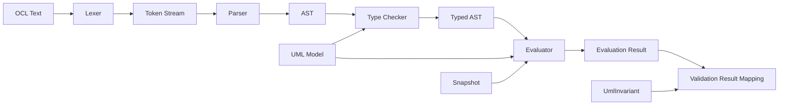
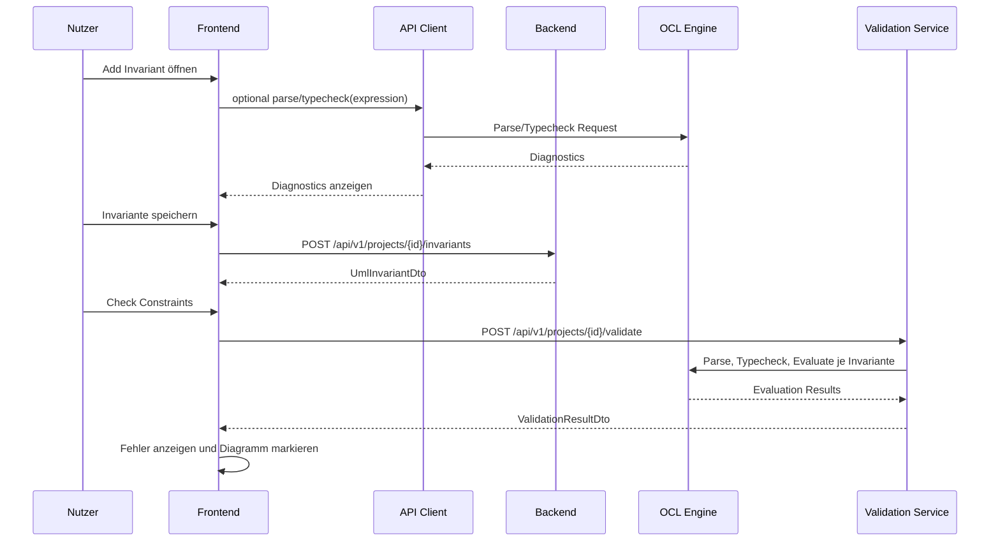
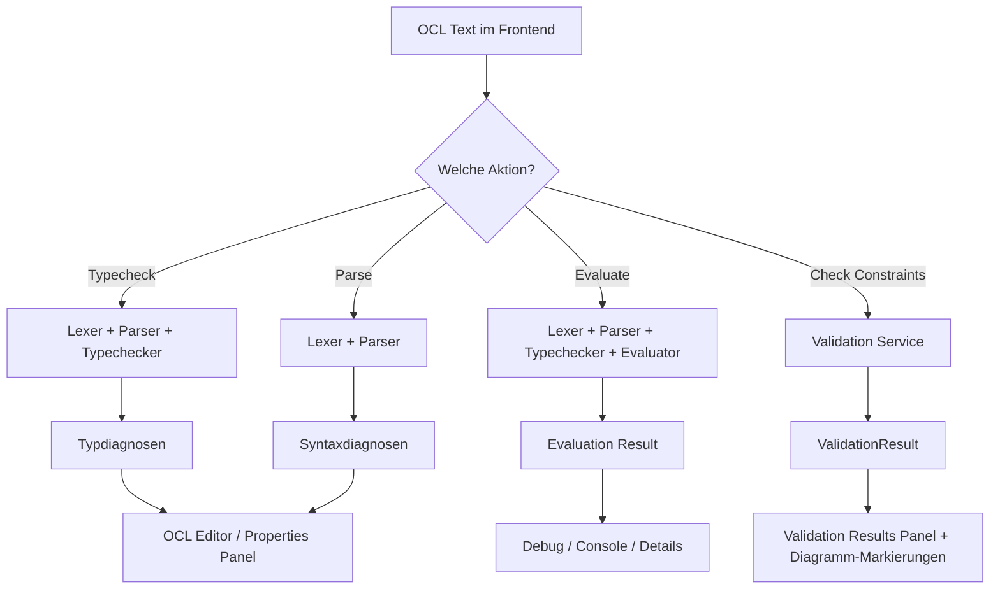

# OCL Evaluation Flow

## Zweck dieser Datei

Diese Datei beschreibt den Integrationsfluss für OCL-Parsing, Typechecking und Evaluation zwischen React/TypeScript-Frontend und Java/Spring-Boot-Backend.

Sie erklärt, wie OCL-Invarianten im Projekt entstehen, wie OCL-Ausdrücke gespeichert und geprüft werden, wann nur Parse/Typecheck ausgeführt wird, wann eine vollständige Evaluation gegen einen Snapshot stattfindet und wie OCL-Fehler im Frontend angezeigt werden.

Das originale USE-Projekt dient als fachliche Referenz für OCL-Konzepte, Syntax, Typechecking, Evaluation und Invariantenprüfung. Es wird keine Implementierung aus USE übernommen.

## Rolle von OCL in der Integration

OCL verbindet das UML-Klassenmodell mit konkreten Objektzuständen.

| Bereich | Rolle |
|---|---|
| Frontend | erfasst OCL-Text, Kontextklasse und Invariantennamen; zeigt Diagnosen und Validation Results. |
| Backend API | transportiert OCL Requests, Invariant DTOs, Diagnostics und Validation Results. |
| UML Model Service | liefert Klassen, Attribute, Rollen und Multiplizitäten für Typechecking. |
| Object Model Service | liefert Objekte, Slots und Links für Evaluation. |
| OCL Engine | verarbeitet OCL über Lexer, Parser, AST, Typechecker und Evaluator. |
| Validation Service | wertet alle aktiven Invarianten im Rahmen von `Check Constraints` aus. |

Grundregel: Das Frontend darf Pflichtfelder und offensichtliche Eingaben prüfen, aber keine vollständige OCL-Semantik entscheiden.

## Einordnung in den Gesamtworkflow

Der OCL-Flow ist Teil des gesamten Modellierungs- und Validierungsworkflows:

```text
Dashboard
-> Start Project oder Open Existing
-> Class Diagram
-> Invariante erstellen
-> OCL speichern
-> Object Diagram
-> Check Constraints
-> OCL Evaluation durch Backend
-> Validation Results im Frontend
```

Im MVP entstehen OCL-Invarianten typischerweise über:

- `AddInvariantModal`,
- `InvariantPropertiesPanel`,
- `OCL Editor View`.

Screenshot `13-ocl-editor.png` konkretisiert die `OCL Editor View` als eigene textbasierte Hauptansicht mit Modell-/OCL-Text, Zeilennummern, `Apply Changes`, `Check Constraints`, Save/Refresh und Console.

Integrationsentscheidung: `Apply Changes` bezieht sich auf den vollständigen `.use`-/Modelltext. Die Beispiele unter `examples/` zeigen vollständige Spezifikationen, nicht isolierte OCL-Fragmente. Backend und API müssen deshalb einen vollständigen Text-Draft annehmen können, auch wenn im MVP nur der definierte UML/OCL-Subset fachlich verarbeitet wird.

## OCL-Flows im Überblick

| Flow | Trigger | Endpoint | Backend-Komponente | Ergebnis | MVP |
|---|---|---|---|---|---|
| OCL parsen | Nutzer tippt oder speichert OCL | `POST /api/v1/projects/{projectId}/ocl/parse` | OCL Parser | Syntaxdiagnosen, optional AST-Metadaten | Should |
| OCL typprüfen | Nutzer fordert Prüfung an oder speichert Invariante | `POST /api/v1/projects/{projectId}/ocl/typecheck` | OCL Typechecker | Typdiagnosen, Ergebnistyp | Should |
| OCL einzeln evaluieren | Debug/Test gegen Kontextobjekt | `POST /api/v1/projects/{projectId}/ocl/evaluate` | OCL Evaluator | einzelnes Evaluation Result | Post-MVP/Should |
| Invariante speichern | `Add Invariant` oder Save im Properties Panel | `POST/PUT /api/v1/projects/{projectId}/invariants` | UML/OCL Service | `UmlInvariantDto` | MVP |
| Alle Invarianten validieren | `Check Constraints` | `POST /api/v1/projects/{projectId}/validate` | Validation Service + OCL Engine | `ValidationResultDto` | MVP |

## Parse Flow

Der Parse Flow prüft nur die syntaktische Struktur des OCL-Texts. Er benötigt keine Snapshot-Daten.

| Aspekt | Beschreibung |
|---|---|
| Trigger | Nutzer bearbeitet OCL-Ausdruck im Modal, Properties Panel oder OCL Editor. |
| Zweck | Frühes Feedback zu Syntaxfehlern. |
| Eingabe | `contextClassId`, `expression`, optional `invariantId`. |
| Backend | Lexer und Parser. |
| Ausgabe | `OclParseResponseDto` mit `diagnostics`. |
| UI | Fehler am OCL-Feld, Diagnostics Panel oder Invariant Properties anzeigen. |

Request:

```http
POST /api/v1/projects/project-library/ocl/parse
Content-Type: application/json
```

```json
{
  "contextClassId": "class-user",
  "expression": "self.books <= 5"
}
```

Response bei Erfolg:

```json
{
  "status": "OK",
  "diagnostics": [],
  "astAvailable": true
}
```

Response bei Syntaxfehler:

```json
{
  "status": "ERROR",
  "diagnostics": [
    {
      "code": "SYNTAX_ERROR",
      "severity": "ERROR",
      "message": "Expected expression after '<='.",
      "range": {
        "startLine": 1,
        "startColumn": 14,
        "endLine": 1,
        "endColumn": 14
      }
    }
  ]
}
```

## Typecheck Flow

Der Typecheck Flow prüft einen syntaktisch gültigen Ausdruck gegen das UML-Modell.

| Aspekt | Beschreibung |
|---|---|
| Trigger | Nutzer speichert Invariante, klickt `Check OCL` oder OCL Editor führt Debounced Check aus. |
| Zweck | Attribute, Rollen, Operatoren, Collection-Operationen und Invariantentyp prüfen. |
| Eingabe | `contextClassId`, `expression`. |
| Backend | Parser falls nötig, Typechecker, UML Model Service. |
| Ausgabe | `OclTypecheckResponseDto` mit Result Type und Diagnostics. |
| UI | Type Errors im OCL Editor oder Invariant Properties Panel anzeigen. |

Request:

```json
{
  "contextClassId": "class-user",
  "expression": "self.borrowedBooks->size() <= 5"
}
```

Response:

```json
{
  "status": "OK",
  "resultType": "Boolean",
  "diagnostics": [],
  "resolvedReferences": [
    {
      "kind": "ASSOCIATION_ROLE",
      "name": "borrowedBooks",
      "associationId": "assoc-borrows"
    }
  ]
}
```

Beispiel für Type Error:

```json
{
  "status": "ERROR",
  "resultType": "Invalid",
  "diagnostics": [
    {
      "code": "UNKNOWN_ATTRIBUTE",
      "severity": "ERROR",
      "message": "Attribute or role 'unknown' does not exist on class User.",
      "targets": [
        {
          "elementType": "CLASS",
          "elementId": "class-user"
        }
      ],
      "range": {
        "startLine": 1,
        "startColumn": 6,
        "endLine": 1,
        "endColumn": 13
      }
    }
  ]
}
```

## Evaluation Flow

Der Evaluation Flow wertet einen typgeprüften Ausdruck gegen einen konkreten Snapshot und ein Kontextobjekt aus.

| Aspekt | Beschreibung |
|---|---|
| Trigger | Post-MVP Debug/Testaktion oder intern durch Validation Service. |
| Zweck | Ergebnis für einen OCL-Ausdruck und ein konkretes `self` bestimmen. |
| Eingabe | `contextClassId`, `contextObjectId`, `expression` oder `invariantId`. |
| Backend | Parser, Typechecker, Evaluator, Object Model Service. |
| Ausgabe | `OclEvaluateResponseDto`. |
| UI | OCL Debug Panel, Console oder Validation Details. |

Request:

```json
{
  "contextClassId": "class-user",
  "contextObjectId": "obj-alice",
  "expression": "self.books <= 5"
}
```

Response:

```json
{
  "status": "OK",
  "resultType": "Boolean",
  "value": false,
  "context": {
    "contextClass": "User",
    "contextObject": "alice"
  },
  "diagnostics": []
}
```

Evaluation Errors:

```json
{
  "status": "ERROR",
  "resultType": "Invalid",
  "diagnostics": [
    {
      "code": "EVALUATION_ERROR",
      "severity": "ERROR",
      "message": "Slot value for attribute books is missing.",
      "targets": [
        {
          "elementType": "OBJECT",
          "elementId": "obj-alice"
        },
        {
          "elementType": "ATTRIBUTE",
          "elementId": "attr-user-books"
        }
      ]
    }
  ]
}
```

## Invariant Save Flow

OCL-Invarianten werden als Teil des UML-Modells gespeichert. Gespeichert wird im MVP der OCL-Text, nicht der AST oder Typed AST.

| Schritt | Beschreibung |
|---|---|
| 1 | Nutzer öffnet `AddInvariantModal`. |
| 2 | Nutzer wählt Kontextklasse. |
| 3 | Nutzer gibt Namen und OCL Expression ein. |
| 4 | Frontend validiert Pflichtfelder. |
| 5 | Optional: Frontend ruft Parse/Typecheck auf. |
| 6 | Frontend sendet `CreateInvariantRequestDto`. |
| 7 | Backend speichert `UmlInvariantDto` im Projektmodell. |
| 8 | Frontend aktualisiert Explorer, Class Diagram und OCL Editor. |

Request:

```http
POST /api/v1/projects/project-library/invariants
Content-Type: application/json
```

```json
{
  "name": "maxBooks",
  "contextClassId": "class-user",
  "expression": "self.books <= 5",
  "enabled": true
}
```

Response:

```json
{
  "id": "inv-max-books",
  "name": "maxBooks",
  "contextClassId": "class-user",
  "expression": "self.books <= 5",
  "enabled": true
}
```

Projektformat-Ausschnitt:

```json
{
  "umlModel": {
    "invariants": [
      {
        "id": "inv-max-books",
        "name": "maxBooks",
        "contextClassId": "class-user",
        "expression": "self.books <= 5",
        "enabled": true
      }
    ]
  }
}
```

## Invariant Validation Flow

Der wichtigste MVP-Flow ist die Auswertung aller aktiven Invarianten im Rahmen von `Check Constraints`.

```text
Check Constraints
-> Validation Service
-> alle aktiven Invarianten laden
-> pro Invariante Parse
-> pro Invariante Typecheck
-> Kontextobjekte im Snapshot finden
-> Ausdruck pro Kontextobjekt evaluieren
-> ValidationResult aggregieren
-> Frontend zeigt Ergebnisse
```

Beispiel:

```ocl
self.books <= 5
```

Für:

```text
alice : User
books = 6
```

ergibt:

```json
{
  "code": "INVARIANT_VIOLATION",
  "severity": "ERROR",
  "message": "Invariant maxBooks is violated for object alice.",
  "targets": [
    {
      "elementType": "OBJECT",
      "elementId": "obj-alice"
    },
    {
      "elementType": "INVARIANT",
      "elementId": "inv-max-books"
    },
    {
      "elementType": "CLASS",
      "elementId": "class-user"
    }
  ],
  "context": {
    "contextClass": "User",
    "contextObject": "alice",
    "expression": "self.books <= 5",
    "actualResult": false
  }
}
```

## Request- und Response-DTOs

| DTO | Zweck | Wichtige Felder |
|---|---|---|
| `CreateInvariantRequestDto` | neue Invariante speichern | `name`, `contextClassId`, `expression`, `enabled` |
| `UpdateInvariantRequestDto` | bestehende Invariante ändern | `name`, `contextClassId`, `expression`, `enabled` |
| `UmlInvariantDto` | gespeicherte Invariante | `id`, `name`, `contextClassId`, `expression`, `enabled` |
| `OclParseRequestDto` | OCL-Syntax prüfen | `contextClassId`, `expression` |
| `OclParseResponseDto` | Syntaxdiagnosen zurückgeben | `status`, `diagnostics`, `astAvailable` |
| `OclTypecheckRequestDto` | OCL typprüfen | `contextClassId`, `expression` |
| `OclTypecheckResponseDto` | Typprüfung zurückgeben | `status`, `resultType`, `diagnostics`, `resolvedReferences` |
| `OclEvaluateRequestDto` | Ausdruck gegen Objekt auswerten | `contextClassId`, `contextObjectId`, `expression` oder `invariantId` |
| `OclEvaluateResponseDto` | Einzelergebnis zurückgeben | `status`, `resultType`, `value`, `diagnostics` |
| `OclDiagnosticDto` | OCL-Fehler beschreiben | `code`, `severity`, `message`, `range`, `targets` |
| `ValidationResultDto` | vollständigen Check beschreiben | `status`, `summary`, `errors` |

## OCL Error Mapping

| Fehler | Backend-Ursache | Primäre Targets | Frontend-Anzeige |
|---|---|---|---|
| `SYNTAX_ERROR` | Lexer/Parser kann Text nicht verarbeiten. | `INVARIANT`, `OCL_EXPRESSION` | OCL Input, Diagnostics Panel, Validation Results |
| `TYPE_ERROR` | Operator oder Ausdruck passt nicht zu Typen. | `INVARIANT`, `CLASS`, optional `ATTRIBUTE`/`ASSOCIATION` | OCL Editor, Invariant Properties |
| `UNKNOWN_CLASS` | Kontextklasse existiert nicht. | `INVARIANT`, `CLASS` | Invariant Properties, Explorer |
| `UNKNOWN_ATTRIBUTE` | Attribut oder Rolle existiert nicht. | `INVARIANT`, `CLASS`, optional Source Range | OCL Input markiert Ausdrucksteil |
| `EVALUATION_ERROR` | Auswertung gegen Objekt schlägt fehl. | `OBJECT`, `INVARIANT`, optional `SLOT` | Validation Results, Object Node Badge |
| `INVARIANT_VIOLATION` | Ausdruck ergibt `false`. | `OBJECT`, `INVARIANT`, `CLASS` | Objektmarkierung und Fehlerliste |

Mapping-Regel:

- Parse- und Typecheck-Fehler fokussieren primär OCL Editor oder Invariant Properties.
- Evaluation Errors und Invariant Violations fokussieren primär Object Diagram.
- Jede Diagnose soll möglichst Source Range und stabile IDs enthalten.

## Frontend-Anzeige

| UI-Bereich | Anzeige |
|---|---|
| `AddInvariantModal` | Pflichtfeldfehler, optionale Parse-/Typecheck-Diagnosen. |
| `InvariantPropertiesPanel` | Name, Kontextklasse, OCL Expression, Diagnosezustand. |
| `OCL Editor View` | textbasierte Bearbeitung von Modell-/OCL-Text, `Apply Changes`, Console, Validation Results und Diagnostics. |
| `Class Diagram` | Invariant-Referenz an Kontextklasse. |
| `Object Diagram` | markierte Objekte oder Links bei Evaluation/Validation. |
| `Validation Results Panel` | strukturierte Fehlerliste mit Targets und Kontext. |
| `Console` | optional technische Meldungen zu Parse, Typecheck, Validate. |

Beispiel-UI-Zustände:

| Zustand | UI-Verhalten |
|---|---|
| Ausdruck syntaktisch gültig | keine rote Markierung, optional `Parsed successfully`. |
| Ausdruck typfehlerhaft | OCL-Feld zeigt Fehler, Speichern kann erlaubt oder blockiert werden. |
| Invariante gespeichert, aber nicht validiert | neutraler Zustand, Validation Results stale. |
| Invariante verletzt | betroffene Objekte werden markiert; Fehler erscheint im Panel. |

OCL-Editor-spezifische Anzeige:

| Editorbereich | Datenquelle | Verhalten |
|---|---|---|
| Modell-/OCL-Texteditor | Modelltext, `UmlInvariantDto[]`, `ValidationErrorDto[]` | Änderungen erzeugen Draft State; `Apply Changes` synchronisiert Projektzustand und Diagnosen. |
| Ausdruckseditor | `expression`, Draft State | Änderungen erzeugen Dirty State und markieren Validation Results als stale. |
| Metadaten | `name`, `contextClassId`, `enabled` optional | Änderungen werden über Invariant-Update gespeichert. |
| Diagnostics Panel | Parse-/Typecheck-Response und Validation Errors | Zeigt `SYNTAX_ERROR`, `TYPE_ERROR`, `UNKNOWN_ATTRIBUTE`, `INVARIANT_VIOLATION` mit `invariantId`. |

## Backend-Verarbeitung

Die Backend-Pipeline:

```text
OCL Text
-> Lexer
-> Parser
-> AST
-> Type Checker
-> Evaluator
-> Result
```

Pipeline mit Modell- und Snapshot-Kontext:

| Phase | Eingabe | Abhängigkeiten | Ausgabe |
|---|---|---|---|
| Lexer | OCL-Text | keine | Token Stream |
| Parser | Token Stream | Grammatik | AST oder Syntaxdiagnosen |
| Type Checker | AST | UML-Modell, Kontextklasse | Typed AST oder Typdiagnosen |
| Evaluator | Typed AST | Snapshot, Kontextobjekt, Objektlinks | OCL-Wert oder Evaluation Error |
| Result Mapping | Evaluation Result | Invariante, Objekt, IDs | Validation Error |

Wichtig:

- Parse/Typecheck darf ohne Snapshot laufen.
- Evaluation benötigt Snapshot und Kontextobjekt.
- Im `Check Constraints`-Flow wird Evaluation für alle Objekte der Kontextklasse ausgeführt.
- AST und Typed AST müssen im MVP nicht dauerhaft gespeichert werden.

## Bezug zum originalen USE-Projekt

| USE-Aspekt | Relevanz für neues System | Nutzung |
|---|---|---|
| OCL-Invarianten mit Kontextklasse | fachlich relevant | Invariant DTO und Validation Flow |
| `self` | MVP-relevant | Kontextobjekt im Evaluator |
| Attributzugriff und Navigation | MVP-relevant | Typechecker und Evaluator |
| Collection-Operationen | MVP-relevant für `size`, `isEmpty`, `notEmpty` | OCL-Subset |
| Typechecking | fachliche Referenz | Fehlerarten und Typregeln ableiten |
| Evaluation gegen Systemzustand | fachliche Referenz | Snapshot-Auswertung |
| `.use` Dateien mit OCL | Post-MVP | Import von OCL-Ausdrücken |
| USE-Core-Code | nicht übernehmen | keine Dependency, kein Fork |

## Erweiterbarkeit

| Erweiterung | Benötigte Anpassung |
|---|---|
| `forAll` | Iterator-AST, Scope für Iteratorvariable, Collection-Evaluation. |
| `exists` | Iterator-AST, Boolean-Aggregation. |
| `select` | Collection-Filterung und Elementtypen. |
| `collect` | Collection-Mapping und Ergebnis-Collection-Typen. |
| `let` | lokale Bindings im Type Environment und Evaluation Context. |
| `if-then-else` | AST-Knoten, Branch-Type-Regeln, lazy Evaluation. |
| `allInstances` | Zugriff auf alle Objekte einer Klasse im Snapshot. |
| pre/post conditions | Operation-Kontext statt reinem Invariantenkontext. |
| derived attributes | Evaluation als Teil von Attributauflösung. |
| importierte `.use` OCL-Ausdrücke | Importdiagnosen, Mapping auf `UmlInvariantDto`. |

Architekturregel: Neue Konstrukte erweitern Lexer, Parser, AST, Typechecker und Evaluator. Sie dürfen nicht als isolierte Regex-Sonderfälle ergänzt werden.

## Mermaid-Diagramme

### OCL Pipeline



### Invariante erstellen und prüfen



### Parse vs Typecheck vs Evaluation



## MVP-Anforderungen

| ID | Anforderung | Akzeptanz |
|---|---|---|
| `OCL-FLOW-MVP-001` | Invarianten speichern OCL-Text mit Kontextklasse. | `UmlInvariantDto` enthält `contextClassId` und `expression`. |
| `OCL-FLOW-MVP-002` | OCL wird im Backend verarbeitet. | Parse, Typecheck und Evaluation liegen nicht im Frontend. |
| `OCL-FLOW-MVP-003` | `Check Constraints` wertet aktive Invarianten aus. | Validation Result enthält Invariant Violations mit `objectId` und `invariantId`. |
| `OCL-FLOW-MVP-004` | Syntaxfehler werden strukturiert zurückgegeben. | `SYNTAX_ERROR` enthält Message und möglichst Source Range. |
| `OCL-FLOW-MVP-005` | Type Errors werden strukturiert zurückgegeben. | `TYPE_ERROR` oder `UNKNOWN_ATTRIBUTE` referenzieren Invariante und Kontextklasse. |
| `OCL-FLOW-MVP-006` | Evaluation Errors werden objektbezogen gemeldet. | `EVALUATION_ERROR` enthält `objectId` und `invariantId`. |
| `OCL-FLOW-MVP-007` | Frontend zeigt OCL-Diagnosen an. | OCL Editor oder Properties Panel zeigt Backend-Diagnosen verständlich. |
| `OCL-FLOW-MVP-008` | OCL Editor ist eigener Integrationspunkt. | OCL Editor zeigt textuellen Modell-/OCL-Editor, `Apply Changes`, Console und Diagnostics auf Basis von API-DTOs. |

## Post-MVP-Erweiterungen

| Erweiterung | Beschreibung |
|---|---|
| Live Parse/Typecheck | Debounced Backend-Checks während der Eingabe. |
| OCL Syntax Highlighting | Tokenbasierte oder editorbasierte Hervorhebung. |
| OCL Autocomplete | Attribute, Rollen und Operationen aus UML-Modell vorschlagen. |
| Einzel-Evaluation im Editor | Ausdruck gegen ausgewähltes Kontextobjekt testen. |
| erweiterte Collection-Operationen | `forAll`, `exists`, `select`, `collect`, `includes`, `excludes`. |
| lokale Bindings | `let` und Iteratorvariablen. |
| bedingte Ausdrücke | `if-then-else`. |
| `.use` Import | OCL aus `.use` Dateien in `UmlInvariantDto` überführen. |
| OCL Debug Trace | Evaluation-Schritte für Fehlersuche sichtbar machen. |

## Offene Fragen

| Frage | Relevanz | Vorläufige Empfehlung |
|---|---|---|
| Wird Parse/Typecheck beim Speichern verpflichtend ausgeführt? | Hoch | Should: Speichern erlauben, aber Diagnosen anzeigen; Validate bleibt verbindlich. |
| Blockiert ein Syntaxfehler das Speichern einer Invariante? | Mittel | Für MVP offen; sicherer ist Speichern mit Fehlerstatus, aber keine Evaluation. |
| Werden AST oder Typed AST gespeichert? | Niedrig | Nein, im MVP vollständigen Modelltext und daraus abgeleitete Modell-/Invariantendaten speichern; AST/Typed AST bleiben temporär. |
| Gibt es einen eigenen Evaluate-Endpunkt im MVP? | Mittel | Nicht zwingend; Evaluation läuft über `Check Constraints`. |
| Wie präzise müssen Source Ranges sein? | Mittel | DTO vorbereiten; MVP mindestens Message und Code. |
| Wie werden importierte `.use` OCL-Ausdrücke markiert? | Mittel | Importdiagnosen und originale Source optional speichern. |

## Zusammenfassung

Der OCL Evaluation Flow trennt Eingabe, Speicherung, Prüfung und Auswertung klar:

```text
Frontend erfasst OCL
-> Backend parst und typprüft
-> Invariante wird als OCL-Text im Projekt gespeichert
-> Check Constraints wertet aktive Invarianten gegen den Snapshot aus
-> Frontend zeigt Diagnostics, Validation Results und Diagramm-Markierungen
```

Für den MVP ist entscheidend, dass OCL nicht als Regex-Logik behandelt wird. Auch das kleine MVP-Subset läuft über eine echte Pipeline aus Lexer, Parser, AST, Typechecker und Evaluator. Dadurch bleibt das System für spätere OCL-Konstrukte wie `forAll`, `exists`, `let` und `if-then-else` erweiterbar.
