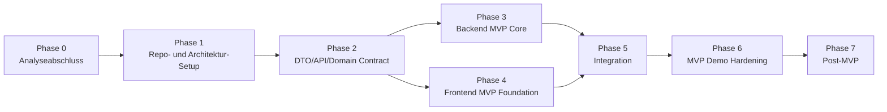

# Overall Implementation Roadmap

## Zweck dieser Datei

Diese Datei beschreibt die übergreifende Implementierungs-Roadmap für das neue webbasierte UML/OCL-System.

Sie dient als Brücke zwischen Analyse-Repository und späteren Implementierungsrepositories für:

- neues Java/Spring-Boot-Backend,
- neues React/TypeScript-Frontend,
- REST/JSON-Integration,
- MVP-Durchstich von Dashboard bis Constraint Validation,
- Post-MVP-Erweiterungen.

Die Roadmap ist bewusst phasenorientiert. Sie legt keine detaillierte Sprintplanung fest, sondern beschreibt eine sinnvolle Reihenfolge, Abhängigkeiten, Parallelisierungsmöglichkeiten und Akzeptanzpunkte.

## Leitentscheidungen

| Entscheidung | Bedeutung für die Roadmap |
|---|---|
| Neues System statt USE-Migration | Es wird kein Fork, keine technische Migration und keine Runtime-Abhängigkeit zum originalen USE-Core aufgebaut. |
| Backend und Frontend getrennt | Backend und Frontend entstehen in eigenen Repositories und werden über REST/JSON integriert. |
| Dashboard als Einstieg | Der Hauptworkflow beginnt nicht im Klassendiagramm, sondern auf der Dashboard / Start Page. |
| JSON-Projektformat im MVP | MVP-Speichern/Laden basiert auf einem eigenen JSON-Format; `.use` Import ist Should/Post-MVP. |
| Backend-validierte Semantik | UML-/OCL-/Snapshot-Validierung liegt fachlich im Backend. |
| Erweiterbare OCL Engine | OCL wird über Lexer, Parser, AST, Typechecker und Evaluator konzipiert, nicht über Regex-Regeln. |
| Screenshots als UI-Referenz | Screenshots definieren Struktur, Journey, Komponenten und Akzeptanzkriterien, aber keine pixelgenaue Spezifikation. |

## Gesamtphasen

| Phase | Name | Ziel | Parallelisierbar | MVP-Relevanz |
|---:|---|---|---|---|
| 0 | Analyseabschluss und Scope-Freeze | Analyse konsolidieren und MVP-Grenzen festlegen | Nein | Hoch |
| 1 | Architektur- und Repository-Setup | Backend-/Frontend-Repositories technisch startfähig machen | Teilweise | Hoch |
| 2 | Domänenmodell und API-Vertrag | Gemeinsames Projekt-, UML-, Snapshot-, OCL- und Fehlermodell festlegen | Ja | Hoch |
| 3 | Backend-MVP-Kern | Projektverwaltung, UML/Snapshot Services, OCL-MVP und Validation Service implementieren | Ja | Hoch |
| 4 | Frontend-MVP-Grundlage | Dashboard, App Shell, Diagrammviews, State und API Client implementieren | Ja | Hoch |
| 5 | Vertikale Integration | Dashboard bis Validation Results end-to-end verbinden | Nein | Hoch |
| 6 | MVP-Härtung und Demo | Testen, Fehlerfälle glätten, Demo-Szenario stabilisieren | Teilweise | Hoch |
| 7 | Post-MVP-Ausbau | OCL, UML, Persistenz, Import/Export und UX erweitern | Ja | Mittel |

## Roadmap-Überblick



## Phase 0: Analyseabschluss und Scope-Freeze

### Ziel

Die fachliche, technische und planerische Grundlage wird abgeschlossen. Das Team legt fest, was im MVP enthalten ist, was später kommt und was ausdrücklich nicht umgesetzt wird.

### Ergebnisartefakte

| Artefakt | Beschreibung |
|---|---|
| Konsolidierter MVP-Scope | Dashboard, Klassendiagramm, Objektdiagramm, OCL-Invarianten, Check Constraints, Validation Results. |
| Nicht-Ziele | Keine Sequenzdiagramme, keine State Machines, keine USE-Core-Abhängigkeit, keine vollständige OCL-Parität im MVP. |
| Screenshot-Traceability | Alle Screenshots, inklusive Dashboard, sind Anforderungen und Komponenten zugeordnet. |
| USE-Referenzbewertung | Originales USE-Projekt ist als fachliche Referenz bewertet, nicht als technische Basis. |

### Backend-Anteile

- Backend-Scope bestätigen.
- JSON-Projektformat als MVP-Format bestätigen.
- OCL-MVP-Subset bestätigen.
- Validation Error Codes bestätigen.

### Frontend-Anteile

- Dashboard als Einstieg bestätigen.
- Diagrammviews, Properties Panel, Explorer Sidebar, Modals und Validation Results als MVP-UI bestätigen.
- Diagrammbibliotheksentscheidung vorbereiten oder treffen.

### Integrationsanteile

- Frontend-Backend-Vertrag priorisieren.
- DTO-, API- und Error-Contract als Grundlage für beide Implementierungen markieren.

### Abhängigkeiten

- `00-overview/*`
- `02-product-and-user-journey/*`
- `03-uml-ocl-domain/*`
- `04-ui-ux-analysis/*`
- `07-integration-and-api/01-frontend-backend-contract.md`
- `07-integration-and-api/07-dto-reference.md`
- `07-integration-and-api/08-error-contract.md`

### Risiken

| Risiko | Gegenmaßnahme |
|---|---|
| Scope wächst zu stark | MVP-/Post-MVP-/Nicht-Ziel-Tabellen verbindlich halten. |
| `.use` Import wird zu früh als Pflicht verstanden | JSON im MVP, `.use` Import als Should/Post-MVP dokumentieren. |
| UI-Screenshots werden pixelgenau interpretiert | Screenshots als strukturelle und funktionale Referenz behandeln. |

### Akzeptanzkriterien

- MVP-Scope ist eindeutig dokumentiert.
- Dashboard ist als erster Journey-Schritt berücksichtigt.
- USE-Codeübernahme ist ausdrücklich ausgeschlossen.
- Backend-/Frontend-/Integration-Verantwortlichkeiten sind dokumentiert.

### Relevante Analyse-Dateien

- `00-overview/01-project-summary.md`
- `00-overview/02-goals-scope-and-non-goals.md`
- `02-product-and-user-journey/04-mvp-scope.md`
- `02-product-and-user-journey/05-acceptance-criteria.md`
- `04-ui-ux-analysis/05-screenshot-traceability.md`
- `01-original-use-reference/05-reference-relevance-for-new-system.md`

### MVP-Relevanz

Sehr hoch. Ohne Scope-Freeze ist der MVP nicht planbar.

## Phase 1: Architektur- und Repository-Setup

### Ziel

Backend und Frontend werden als neue, getrennte Implementierungsrepositories vorbereitet. Build, Tests, Grundstruktur, CI-fähige Kommandos und Architekturgrenzen werden eingerichtet.

### Ergebnisartefakte

| Artefakt | Beschreibung |
|---|---|
| Backend-Repository | Spring-Boot-Projekt mit Package-Struktur für API, Application, Domain, OCL, Validation, Persistence. |
| Frontend-Repository | React/TypeScript-Projekt, vorzugsweise Vite-basiert, mit Struktur für Pages, Features, API, State und Components. |
| Basis-CI | Build, Lint und Test ausführbar. |
| ADRs | Entscheidungen zu Java/Spring Boot, React/TypeScript, getrennten Repositories, JSON-Format und OCL Engine. |

### Backend-Anteile

- Spring-Boot-Projekt initialisieren.
- Package-Struktur anlegen:
  - `api`
  - `application`
  - `domain.uml`
  - `domain.snapshot`
  - `domain.ocl`
  - `ocl.lexer`
  - `ocl.parser`
  - `ocl.ast`
  - `ocl.typecheck`
  - `ocl.evaluation`
  - `validation`
  - `persistence`
  - `error`
- Teststruktur vorbereiten.

### Frontend-Anteile

- React/TypeScript-Projekt initialisieren.
- Routing, App Shell und Basislayout vorbereiten.
- Komponentenstruktur für Dashboard, Diagramme, Properties Panel, Modals und Validation UI anlegen.
- API Client und DTO-Verzeichnis vorbereiten.

### Integrationsanteile

- Gemeinsame DTO-Namen und API-Versionierung festlegen.
- Mock API für Frontend-Entwicklung vorbereiten.
- Backend OpenAPI- oder API-Dokumentationsstrategie festlegen.

### Abhängigkeiten

- Phase 0 abgeschlossen.
- Repository- und Architekturdateien liegen vor.

### Risiken

| Risiko | Gegenmaßnahme |
|---|---|
| Backend und Frontend driften früh auseinander | DTO-Referenz und API-Flows als gemeinsame Quelle verwenden. |
| Tooling blockiert Fachentwicklung | Minimalen Setup-Scope wählen und CI schrittweise erweitern. |
| Diagrammbibliothek wird zu spät entschieden | Entscheidung früh anhand `06-frontend-analysis/06-diagram-library-decision.md` treffen. |

### Akzeptanzkriterien

- Backend startet lokal.
- Frontend startet lokal.
- Tests können leer oder minimal ausgeführt werden.
- API-Basispfad und Projektstruktur sind dokumentiert.
- Keine Abhängigkeit zum originalen USE-Core existiert.

### Relevante Analyse-Dateien

- `05-backend-analysis/02-backend-repository-structure.md`
- `05-backend-analysis/03-backend-architecture.md`
- `06-frontend-analysis/02-frontend-repository-structure.md`
- `06-frontend-analysis/03-frontend-architecture.md`
- `06-frontend-analysis/06-diagram-library-decision.md`
- `07-integration-and-api/01-frontend-backend-contract.md`

### MVP-Relevanz

Hoch. Diese Phase schafft die technische Basis für alle MVP-Funktionen.

## Phase 2: Domänenmodell und API-Vertrag

### Ziel

Das gemeinsame Datenmodell wird stabil genug festgelegt, damit Backend und Frontend parallel arbeiten können.

### Ergebnisartefakte

| Artefakt | Beschreibung |
|---|---|
| Domain Model | Projekt, UML-Modell, Objektmodell, OCL-Modell, Validation Model, Layout Model. |
| JSON Project Format | Serialisierbares MVP-Projektformat. |
| DTO Reference | Vollständige REST/JSON-DTOs. |
| Error Contract | Einheitliche Fehlercodes, Severity, Element-Mapping und OCL Locations. |
| API Flow Definition | Projekt-, UML-, Objekt-, OCL- und Validierungsflows. |

### Backend-Anteile

- Domain-Klassen oder Records entwerfen.
- DTOs definieren.
- Mapper zwischen DTOs und Domain vorbereiten.
- Error Codes und ValidationResult-Struktur implementierbar machen.

### Frontend-Anteile

- TypeScript-DTOs übernehmen.
- Frontend-State-Struktur von Backend-DTOs trennen.
- Mapping von DTOs auf Diagramm-Nodes/-Edges entwerfen.
- Mockdaten für Library-Beispiel erzeugen.

### Integrationsanteile

- API-Endpunkte für MVP einfrieren:
  - `POST /api/v1/projects`
  - `GET /api/v1/projects/{projectId}`
  - `PUT /api/v1/projects/{projectId}`
  - `POST /api/v1/projects/{projectId}/classes`
  - `POST /api/v1/projects/{projectId}/associations`
  - `POST /api/v1/projects/{projectId}/invariants`
  - `POST /api/v1/projects/{projectId}/objects`
  - `POST /api/v1/projects/{projectId}/links`
  - `POST /api/v1/projects/{projectId}/validate`
  - OCL Parse/Typecheck optional als MVP-Unterstützung.

### Abhängigkeiten

- Phase 1 Repository-Setup.
- Fachliches Domain Model aus `03-uml-ocl-domain`.

### Risiken

| Risiko | Gegenmaßnahme |
|---|---|
| DTOs werden zu stark an UI gekoppelt | Layoutdaten strikt von fachlicher Semantik trennen. |
| Domain Model ist zu komplex für MVP | Perspektivische Felder optional halten. |
| OCL-Fehler sind nicht UI-mappbar | `ElementTargetDto` und OCL Location verpflichtend vorsehen. |

### Akzeptanzkriterien

- Backend und Frontend nutzen dieselben DTO-Namen.
- JSON-Projektbeispiel kann von beiden Seiten gelesen werden.
- Validation Errors referenzieren betroffene IDs.
- Layoutdaten enthalten keine fachliche Semantik.

### Relevante Analyse-Dateien

- `03-uml-ocl-domain/02-domain-model.md`
- `05-backend-analysis/04-domain-model-implementation.md`
- `05-backend-analysis/14-json-project-format.md`
- `07-integration-and-api/01-frontend-backend-contract.md`
- `07-integration-and-api/07-dto-reference.md`
- `07-integration-and-api/08-error-contract.md`

### MVP-Relevanz

Sehr hoch. Diese Phase ermöglicht parallele Backend- und Frontend-Entwicklung.

## Phase 3: Backend-MVP-Kern

### Ziel

Das Backend liefert den fachlichen Kern des MVP: Projektverwaltung, UML-/Snapshot-Verwaltung, OCL-MVP-Pipeline und zentrale Validierung.

### Ergebnisartefakte

| Artefakt | Beschreibung |
|---|---|
| Project Service | Projekte anlegen, laden, speichern, exportieren. |
| UML Model Service | Klassen, Attribute, Operationen, Associations, Rollen, Multiplizitäten, Invarianten. |
| Object Model Service | Objekte, Slots, Objektlinks, Snapshot. |
| Delete-/Cascade-Regeln | Klassen, Attribute, Operationen, Associations, Invarianten, Objekte und Objektlinks konsistent löschen. |
| OCL Engine MVP | Lexer, Parser, AST, Typechecker, Evaluator für MVP-Subset. |
| Validation Service | UML-, Snapshot-, Multiplicity- und OCL-Invariantprüfung. |
| REST API | MVP-Endpunkte für Frontend. |
| Backend Tests | Unit-, Service-, API- und E2E-Tests für Library-Szenario. |

### Backend-Anteile

- JSON-Projektformat serialisieren/deserialisieren.
- In-memory oder dateibasierte MVP-Persistenz implementieren.
- UML-Strukturvalidierung implementieren.
- Snapshot- und Linkvalidierung implementieren.
- Delete-Endpunkte und MVP-Cascade-Regeln für Modell- und Snapshot-Elemente implementieren.
- Multiplicity Checks implementieren.
- OCL-MVP implementieren:
  - `self`
  - Attributzugriff
  - einfache Association Navigation
  - String/Integer/Real/Boolean-Literale
  - Vergleichsoperatoren
  - Boolean-Operatoren
  - Klammern
  - `size`, `isEmpty`, `notEmpty`
- `ValidationResultDto` mit UI-Mapping liefern.

### Frontend-Anteile

- Parallel mit Mock API weiterarbeiten.
- Frühe Integrationstests gegen Backend-Stubs vorbereiten.
- DTO-Änderungen rückkoppeln.

### Integrationsanteile

- API Responses mit Frontend-Mockdaten vergleichen.
- Library-Beispiel als gemeinsamer Testdatensatz verwenden.
- Fehlercodes und Targets gegen UI-Anforderungen prüfen.

### Abhängigkeiten

- Phase 2 DTO/API-Vertrag.
- OCL-Architekturentscheidung.

### Risiken

| Risiko | Gegenmaßnahme |
|---|---|
| OCL Engine wird zu groß | MVP-Subset strikt begrenzen. |
| Evaluation ohne sauberen Typecheck wird fehleranfällig | Parser, Typechecker und Evaluator getrennt testen. |
| Validation Results sind zu unstrukturiert | Error Contract als Akzeptanzgrundlage verwenden. |
| Persistenz wird überdimensioniert | JSON/in-memory MVP, Datenbank später. |

### Akzeptanzkriterien

- Backend kann ein neues Projekt erzeugen.
- Backend kann Library-Modell als JSON laden/speichern.
- Backend kann Klassen, Associations, Objekte und Links über API verwalten.
- Backend kann Modellierungsfehler durch Delete-Endpunkte korrigieren, ohne verwaiste Referenzen zu erzeugen.
- `self.books <= 5` wird geparst, typgeprüft und evaluiert.
- `alice : User` mit `books = 6` erzeugt `INVARIANT_VIOLATION`.
- Validation Result enthält `contextObjectId`, `invariantId`, `targets` und `userMessage`.

### Relevante Analyse-Dateien

- `05-backend-analysis/01-backend-scope.md`
- `05-backend-analysis/05-project-and-persistence-service.md`
- `05-backend-analysis/06-uml-model-service.md`
- `05-backend-analysis/07-object-model-service.md`
- `05-backend-analysis/08-ocl-engine-design.md`
- `05-backend-analysis/09-ocl-parser-and-ast.md`
- `05-backend-analysis/10-ocl-typechecker.md`
- `05-backend-analysis/11-ocl-evaluator.md`
- `05-backend-analysis/12-validation-service.md`
- `05-backend-analysis/13-api-design.md`
- `05-backend-analysis/17-backend-test-strategy.md`

### MVP-Relevanz

Sehr hoch. Ohne diese Phase existiert kein fachlich demonstrierbarer MVP.

## Phase 4: Frontend-MVP-Grundlage

### Ziel

Das Frontend bildet die geplante Weboberfläche auf Basis der Screenshots ab und kann mit Mockdaten oder Backend-API den MVP-Workflow bedienen.

### Ergebnisartefakte

| Artefakt | Beschreibung |
|---|---|
| Dashboard Page | Start Project, Open Existing, Recent Projects, Learn & Support. |
| Open Existing `.use` Flow | Dialog aus `14-open-existing-project.png`, lokale `.use` Datei, File Dropzone und Modelltext-Apply-Anbindung. |
| App Shell | Top Bar, Tabs, Explorer Sidebar, Canvas, Properties Panel, Bottom Panel. |
| Class Diagram View | Klassen, Attribute, Operationen, Associations, Invarianten. |
| Object Diagram View | Objekte, Slots, Links, Fehler-Markierungen. |
| Delete UI | Delete-Aktionen in Properties Panel, Explorer und optional Canvas-Shortcut mit Confirm Dialog. |
| OCL Editor / Invariant UI | Invarianten erstellen und textuellen Modell-/OCL-Editor mit `Apply Changes` bereitstellen. |
| Validation UI | Check Constraints Button, Validation Results Panel, Diagramm-Highlights. |
| State Management | Server State, UI State, Selection State, Validation State, Import Diagnostics State, Layout State. |
| Frontend Tests | Komponenten-, State-, API-Mock- und E2E-Tests. |

### Backend-Anteile

- Mock- oder echte API-Endpunkte für Frontend-Entwicklung bereitstellen.
- Bei Bedarf API-Vertrag präzisieren.

### Frontend-Anteile

- Dashboard als erste Route implementieren:
  - `/`
  - optional `/dashboard`
- Projektansicht implementieren:
  - `/projects/{projectId}/class-diagram`
  - `/projects/{projectId}/object-diagram`
  - `/projects/{projectId}/ocl`
- Diagrammbibliothek integrieren.
- Custom Nodes und Edges für UML- und Objektkarten erstellen.
- Modals implementieren:
  - Add Class
  - Add Association
  - Add Invariant
  - Add Object / Add Object Association
- Properties Panel abhängig von Selektion umsetzen.
- Delete-Aktionen für Klasse, Attribut, Operation, Association, Invariante, Objekt und Objektlink anbinden.
- Validation Results auf Diagrammelemente mappen.
- Layoutpositionen speichern.

### Integrationsanteile

- API Client an DTO-Referenz ausrichten.
- Frontend-Schritt `5b` für Open Existing `.use` Import Flow zwischen Smoke Test und State Management umsetzen.
- Mock Service Worker oder vergleichbare Mock API für parallele Entwicklung nutzen.
- Check Constraints gegen Mock und später echtes Backend testen.

### Abhängigkeiten

- Phase 2 DTO/API-Vertrag.
- Diagrammbibliotheksentscheidung.
- Screenshot-Traceability.

### Risiken

| Risiko | Gegenmaßnahme |
|---|---|
| Diagrammkomponenten werden zu komplex | Custom Nodes/Edges eng am MVP halten. |
| Frontend validiert zu viel selbst | Nur UI-Vorvalidierung; fachliche Wahrheit beim Backend. |
| Fehler-Mapping wird inkonsistent | `elementId`/`targets` als zentrale Zuordnung verwenden. |
| Dashboard wird vergessen | Dashboard als erste Route und erster E2E-Schritt definieren. |

### Akzeptanzkriterien

- Nutzer sieht Dashboard als Einstieg.
- `Start Project` führt ins Klassendiagramm.
- Klassendiagramm zeigt Klassen, Attribute, Operationen, Associations und Invarianten.
- Objektdiagramm zeigt Objekte, Slots und Links.
- Properties Panel reagiert auf Selektion.
- Validation Results Panel kann Fehler anzeigen.
- Fehlerhafte Objekte können visuell markiert werden.

### Relevante Analyse-Dateien

- `06-frontend-analysis/01-frontend-scope.md`
- `06-frontend-analysis/03-frontend-architecture.md`
- `06-frontend-analysis/04-routing-and-layout.md`
- `06-frontend-analysis/05-api-client-and-dtos.md`
- `06-frontend-analysis/06-diagram-library-decision.md`
- `06-frontend-analysis/07-class-diagram-component.md`
- `06-frontend-analysis/08-object-diagram-component.md`
- `06-frontend-analysis/09-ocl-editor-ui.md`
- `06-frontend-analysis/10-validation-error-ui.md`
- `06-frontend-analysis/14-state-management.md`
- `06-frontend-analysis/15-screenshot-implementation-mapping.md`
- `06-frontend-analysis/16-frontend-test-strategy.md`

### MVP-Relevanz

Sehr hoch. Diese Phase macht den fachlichen Kern bedienbar.

## Phase 5: Vertikale Integration

### Ziel

Backend und Frontend werden zu einem vollständigen MVP-Durchstich verbunden.

Der Zielworkflow lautet:

```text
Dashboard
-> Start Project oder Open Existing
-> Class Diagram
-> Object Diagram
-> OCL / Invariants
-> Check Constraints
-> Validation Results
```

### Ergebnisartefakte

| Artefakt | Beschreibung |
|---|---|
| E2E Library Demo | Durchgängiges Beispiel von Projektstart bis Invariantverletzung. |
| Integrierter API Client | Frontend nutzt echte Backend-Endpunkte. |
| Projekt Save/Load | JSON-basiertes Speichern/Laden funktioniert. |
| Check Constraints Integration | Backend ValidationResult wird im Frontend dargestellt. |
| Error Mapping | Klick auf Fehler fokussiert betroffenes Element. |

### Backend-Anteile

- CORS und API-Konfiguration.
- Stabilisierung von REST-Endpunkten.
- Validierungsantworten an Frontend-Bedarf anpassen.
- Import-/Export-Endpunkte für JSON bereitstellen.

### Frontend-Anteile

- Mock API durch echte API ersetzen.
- Loading-, Error- und Empty States ergänzen.
- Dashboard-Flows anbinden:
  - `Start Project`
  - `Open Existing` für JSON
  - `Open Existing Project` für lokale `.use` Dateien über begrenzten Modelltext-Apply-Flow
  - Recent Projects optional/mock oder Backend-basiert.
- Check Constraints Button an Backend anbinden.
- Validation Results in Diagramm-Markierungen umsetzen.

### Integrationsanteile

- Gemeinsames Library-Testprojekt verwenden.
- End-to-End-Test automatisieren.
- API-Fehler und Validation Errors getrennt testen.
- Save/Load mit Layoutdaten prüfen.
- Lokalen `.use` Dateiinhalt aus `14-open-existing-project.png` gegen `model-text/apply` prüfen und Diagnostics anzeigen.

### Abhängigkeiten

- Backend-MVP-Kern lauffähig.
- Frontend-MVP-Grundlage lauffähig.
- DTO- und Error-Contract stabil.

### Risiken

| Risiko | Gegenmaßnahme |
|---|---|
| API-Vertrag passt nicht zur UI | Kleine Contract-Tests und gemeinsame Beispielpayloads nutzen. |
| Fehler werden nicht korrekt fokussiert | `targets` im ValidationResult konsequent testen. |
| Lokale Änderungen werden vor Validation nicht gespeichert | Entweder Autosave oder Draft-Validation klar entscheiden. |
| Recent Projects hängt an Persistenz | Für MVP als Should oder Mockdaten behandeln, falls Persistenz begrenzt ist. |

### Akzeptanzkriterien

- Dashboard öffnet erfolgreich.
- `Start Project` öffnet die Projektnamenerfassung, erzeugt nach gültigem Namen ein Backend-Projekt und navigiert ins Class Diagram.
- Nutzer kann ein Library-artiges Modell erstellen oder laden.
- Nutzer kann Objekte und Objektlinks erstellen.
- `Check Constraints` ruft Backend auf.
- Backend liefert `INVARIANT_VIOLATION`.
- Frontend markiert `alice : User` im Object Diagram.
- Validation Results Panel zeigt Fehlerdetails.
- Klick auf Fehler fokussiert das betroffene Objekt.

### Relevante Analyse-Dateien

- `07-integration-and-api/02-api-flow.md`
- `07-integration-and-api/03-validation-flow.md`
- `07-integration-and-api/04-project-save-load-flow.md`
- `07-integration-and-api/05-ocl-evaluation-flow.md`
- `07-integration-and-api/07-dto-reference.md`
- `07-integration-and-api/08-error-contract.md`
- `02-product-and-user-journey/02-screenshot-based-user-journey.md`
- `02-product-and-user-journey/05-acceptance-criteria.md`

### MVP-Relevanz

Sehr hoch. Diese Phase entscheidet, ob der MVP demonstrierbar ist.

## Phase 6: MVP-Härtung und Demo

### Ziel

Der MVP wird stabilisiert, getestet und so vorbereitet, dass er den vollständigen vertikalen Workflow zuverlässig demonstriert.

### Ergebnisartefakte

| Artefakt | Beschreibung |
|---|---|
| MVP-Demo-Szenario | Dokumentierter Ablauf mit Dashboard, Modellierung, Snapshot und Fehleranzeige. |
| Testabdeckung | Backend-, Frontend- und E2E-Tests für Kernworkflow. |
| Fehlerfallkatalog | Syntax Error, Type Error, Multiplicity Violation, Invariant Violation, API Error. |
| Definition of Done | Klare Kriterien für MVP-Abnahme. |
| Stabiler Build | Reproduzierbarer Start von Backend und Frontend. |

### Backend-Anteile

- Testfälle erweitern.
- Fehlercodes konsolidieren.
- Edge Cases bei OCL und Multiplicity absichern.
- Performance für kleine MVP-Modelle prüfen.

### Frontend-Anteile

- UI-Zustände glätten:
  - Loading
  - Empty
  - Valid
  - Invalid
  - API Error
- Screenshot-nahe Akzeptanz prüfen.
- Accessibility-Basics für Fehleranzeigen prüfen.
- Playwright E2E für Library-Demo umsetzen.

### Integrationsanteile

- Kompletten Demo-Flow wiederholt testen.
- Contract-Regressionstests für DTOs und Error Contract.
- Save/Load inklusive Layoutdaten prüfen.

### Abhängigkeiten

- Phase 5 Integration abgeschlossen.
- Acceptance Criteria liegen vor.

### Risiken

| Risiko | Gegenmaßnahme |
|---|---|
| Demo ist nur mit idealen Daten stabil | Fehlerfälle und Reset-Daten vorbereiten. |
| UI zeigt Fehler, aber nicht nachvollziehbar | Validation Results mit Kontext und Fokus testen. |
| OCL-MVP wird missverstanden | Unterstütztes Subset sichtbar dokumentieren. |

### Akzeptanzkriterien

- MVP-Demo kann ohne manuelle Datenbankkorrekturen durchlaufen werden.
- Alle MVP-Akzeptanzkriterien aus Produktdokumentation sind erfüllt oder bewusst als offen markiert.
- Backend-Tests decken OCL, Validation und API-Kernfälle ab.
- Frontend-Tests decken Dashboard, Diagramme, Modals, Properties und Validation UI ab.
- E2E-Test deckt den Library-Fehlerfall ab.

### Relevante Analyse-Dateien

- `02-product-and-user-journey/05-acceptance-criteria.md`
- `05-backend-analysis/17-backend-test-strategy.md`
- `06-frontend-analysis/16-frontend-test-strategy.md`
- `07-integration-and-api/03-validation-flow.md`
- `07-integration-and-api/04-project-save-load-flow.md`
- `07-integration-and-api/08-error-contract.md`

### MVP-Relevanz

Sehr hoch. Diese Phase macht aus implementierten Teilen einen abnahmefähigen MVP.

## Phase 7: Post-MVP-Ausbau

### Ziel

Nach dem MVP wird das System fachlich, technisch und UX-seitig erweitert.

### Ergebnisartefakte

| Artefakt | Beschreibung |
|---|---|
| Erweiterte OCL Engine | Iteratoren, `forAll`, `exists`, `select`, `collect`, `let`, `if-then-else`, `allInstances`. |
| Erweiterte UML-Funktionen | Vererbung, Enumerationen, Aggregation/Komposition, Assoziationsklassen. |
| `.use` Import/Export | Import und Export als Brücke zum originalen USE-Ökosystem. |
| Persistenz-Ausbau | Datenbankpersistenz, Projektversionierung, echte Recent Projects. |
| UX-Ausbau | Syntax Highlighting, Autocomplete, Undo/Redo, bessere Fehlernavigation. |
| Testfallbibliothek | Testfälle aus originalen USE-Beispielen ableiten. |

### Backend-Anteile

- OCL-Sprachumfang erweitern.
- Datenbankpersistenz einführen.
- `.use` Import/Export implementieren.
- Mehrere Snapshots unterstützen.
- Erweiterte Testbibliothek aufbauen.

### Frontend-Anteile

- OCL Editor mit Syntax Highlighting und Autocomplete ausbauen.
- Undo/Redo einführen.
- Projektliste und Recent Projects aus echter Persistenz anzeigen.
- UI für Vererbung, Enums und erweiterte Associations ergänzen.

### Integrationsanteile

- API-Versionierung nutzen.
- DTOs optional erweitern.
- Migration alter JSON-Projektversionen unterstützen.
- Import-/Export-Fehler strukturiert über Error Contract darstellen.

### Abhängigkeiten

- Stabiler MVP.
- Priorisierte Post-MVP-Roadmap.
- Entscheidung, welche USE-Syntaxvarianten importiert werden sollen.

### Risiken

| Risiko | Gegenmaßnahme |
|---|---|
| OCL-Erweiterung destabilisiert MVP | Pipeline-Komponenten isoliert erweitern und regressionsgetestet halten. |
| `.use` Import erzeugt Kompatibilitätsdruck | Unterstützte Syntaxvarianten explizit begrenzen. |
| Persistenzmigration wird teuer | Früh `schemaVersion` und Migrationsstrategie nutzen. |
| UI wird überladen | Erweiterungen schrittweise und workflowspezifisch einführen. |

### Akzeptanzkriterien

- Erweiterungen sind rückwärtskompatibel zu MVP-Projekten.
- Neue OCL-Konstrukte haben Parser-, Typechecker-, Evaluator- und E2E-Tests.
- `.use` Import unterstützt dokumentierte Beispielmodelle.
- Neue UI-Funktionen bleiben mit Dashboard- und Diagrammworkflow konsistent.

### Relevante Analyse-Dateien

- `01-original-use-reference/03-use-syntax-and-examples.md`
- `01-original-use-reference/05-reference-relevance-for-new-system.md`
- `03-uml-ocl-domain/03-ocl-architecture-and-extension-strategy.md`
- `05-backend-analysis/08-ocl-engine-design.md`
- `06-frontend-analysis/09-ocl-editor-ui.md`
- `07-integration-and-api/05-ocl-evaluation-flow.md`

### MVP-Relevanz

Mittel bis niedrig. Diese Phase folgt nach einem stabilen MVP.

## Parallelisierung

| Zeitpunkt | Parallel möglich | Voraussetzung |
|---|---|---|
| Nach Phase 1 | Backend-Setup und Frontend-Setup | Gemeinsame Architekturentscheidungen stehen. |
| Nach Phase 2 | Backend Services und Frontend UI mit Mock API | DTO- und Error-Contract sind stabil. |
| Während Phase 3/4 | Backend OCL/Validation und Frontend Diagrammviews | Gemeinsames Library-Beispiel existiert. |
| Während Phase 6 | Backend-Tests, Frontend-Tests, E2E-Stabilisierung | Integration ist lauffähig. |
| Nach MVP | OCL-Erweiterungen, Persistenz, UX-Verbesserungen | MVP-Regressionstests vorhanden. |

Nicht sinnvoll parallelisierbar:

- Scope-Freeze vor Analysekonsolidierung.
- Vertikale Integration ohne stabilen API-Vertrag.
- E2E-Abnahme ohne lauffähiges Backend und Frontend.

## MVP gilt als demonstrierbar, wenn

| Bereich | Kriterium |
|---|---|
| Dashboard | Nutzer startet auf Dashboard und kann ein neues Projekt anlegen. |
| Projekt | Projekt kann gespeichert und geladen werden, mindestens im JSON-MVP-Format. |
| Klassendiagramm | Nutzer kann Klassen, Attribute, Operationen, Associations, Rollen, Multiplizitäten und Invarianten modellieren. |
| Objektdiagramm | Nutzer kann Objekte, Slotwerte und Objektlinks modellieren. |
| OCL | `self.books <= 5` und vergleichbare MVP-Ausdrücke werden verarbeitet. |
| Validierung | Backend prüft UML-Struktur, Snapshot, Links, Multiplizitäten und OCL-Invarianten. |
| Fehlerdarstellung | Frontend markiert fehlerhafte Objekte und zeigt Validation Results. |
| Integration | `Check Constraints` funktioniert end-to-end über REST/JSON. |
| Tests | Backend-, Frontend- und E2E-Kernfälle sind abgedeckt. |

## Nicht-Ziele der Roadmap

| Nicht-Ziel | Begründung |
|---|---|
| Direkte Migration des originalen USE-Codes | Das neue System soll unabhängig und webbasiert entstehen. |
| Vollständige USE-Feature-Parität im MVP | MVP fokussiert vertikalen Durchstich. |
| Vollständige OCL-Implementierung im MVP | Architektur ist erweiterbar, MVP-Subset ist begrenzt. |
| Sequenzdiagramme, State Machines, Aktivitätsdiagramme | Nicht Teil des fachlichen Zielumfangs. |
| Vollständige Kollaboration im MVP | Zu groß für ersten Durchstich. |
| Datenbankpersistenz als Pflicht im MVP | JSON/in-memory reicht zunächst, Datenbank folgt später. |

## Abhängigkeit zu Analysebereichen

| Analysebereich | Rolle in der Roadmap |
|---|---|
| `00-overview/` | Projektziel, Scope und Dokumentationsnavigation. |
| `01-original-use-reference/` | Fachliche USE-Referenz, Syntaxbeispiele, Verhaltenserwartungen, Testfallquelle. |
| `02-product-and-user-journey/` | Dashboard-basierte Journey, Anforderungen, MVP und Akzeptanzkriterien. |
| `03-uml-ocl-domain/` | Fachliches Domain Model, OCL-Strategie und Validierungskonzept. |
| `04-ui-ux-analysis/` | UI-Landkarte, Screenshot-Auswertung und Traceability. |
| `05-backend-analysis/` | Backend-Architektur, Services, OCL Engine, Validation, API und Tests. |
| `06-frontend-analysis/` | Frontend-Architektur, Komponenten, Routing, State, Diagramme und Tests. |
| `07-integration-and-api/` | API-Vertrag, Flows, DTOs, Error Contract und Integration. |
| `08-planning/` | Umsetzung, Meilensteine, Risiken, Backlog und Definition of Done. |

## Empfohlene nächste Planungsdateien

| Datei | Zweck |
|---|---|
| `08-planning/02-backend-implementation-plan.md` | Detaillierter Backend-Plan nach Services, OCL und Validation. |
| `08-planning/03-frontend-implementation-plan.md` | Detaillierter Frontend-Plan nach Dashboard, Views, Komponenten und State. |
| `08-planning/04-mvp-milestones.md` | Konkrete MVP-Meilensteine mit Abnahmebedingungen. |
| `08-planning/05-iteration-plan.md` | Iterations- oder Sprintstruktur. |
| `08-planning/06-risks-and-open-questions.md` | Zentraler Risikokatalog. |
| `08-planning/07-post-mvp-roadmap.md` | Erweiterungen nach MVP. |
| `08-planning/08-issue-backlog.md` | Umsetzbare Arbeitspakete. |
| `08-planning/09-definition-of-done.md` | Qualitäts- und Abnahmekriterien. |

## Zusammenfassung

Die sinnvolle Umsetzung beginnt mit einem Scope-Freeze und einem stabilen gemeinsamen Vertrag. Danach können Backend und Frontend parallel entstehen: Das Backend liefert Projektverwaltung, UML-/Snapshot-Services, OCL-MVP und Validierung; das Frontend liefert Dashboard, Diagrammviews, Properties, Modals und Validation UI.

Der MVP ist erreicht, wenn der vollständige Workflow vom Dashboard über Modellierung und Snapshot bis zu `Check Constraints` und sichtbaren Validation Results end-to-end funktioniert. Post-MVP folgen erweiterte OCL-Konstrukte, `.use` Import/Export, Datenbankpersistenz, Vererbung, Enumerationen, bessere OCL-Editorfunktionen und Projektversionierung.
