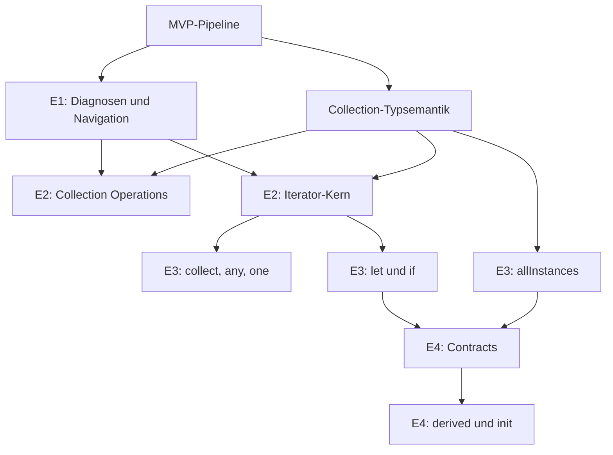

# OCL Extension Scope


## Abgrenzung zum MVP

Der Erweiterungsscope setzt auf dem in `01-ocl-current-state.md` dokumentierten Stand auf. Das aktuelle Backend besitzt bereits eine eigenständige Pipeline:

```text
OCL Text
  -> Lexer
  -> Parser
  -> AST
  -> Type Checker
  -> Evaluator
  -> Validation Result
```

Das implementierte MVP-Subset umfasst:

- `self`,
- Attributzugriff,
- einfache Association Navigation,
- String-, Integer-, Real- und Boolean-Literale,
- `=`, `<>`, `<`, `<=`, `>`, `>=`,
- `and`, `or`, `not`,
- Klammern,
- `size()`, `isEmpty()` und `notEmpty()`,
- Klasseninvarianten gegen einen Objekt-Snapshot.

Die OCL-Erweiterung ersetzt diese Architektur nicht. Jedes neue Feature muss alle betroffenen Stufen der eigenen Pipeline ergänzen. Normative Grundlage ist `OCL-specification.pdf` im Workspace-Root (OMG OCL 2.4, `formal/2014-02-03`). Das originale USE-Projekt bleibt eine nachgeordnete Beispiel- und Kompatibilitätsreferenz; der alte USE-Core wird nicht als Dependency eingebunden und alter USE-Code wird nicht kopiert.

## Scope-Prinzipien

| Prinzip | Konsequenz für den Scope |
|---|---|
| OCL 2.4 ist maßgeblich | Syntax, abstrakte Syntax, Well-formedness, Typregeln, Standardbibliothek und Semantik werden aus `OCL-specification.pdf` abgeleitet. |
| USE ist nachgeordnet | USE-Beispiele liefern Regressionstests und optionale Kompatibilitätsfälle, definieren aber keine OCL-Semantik. |
| Vertikale Vollständigkeit | Ein Sprachfeature gilt erst als unterstützt, wenn Syntax, AST, Typprüfung, Evaluation, Diagnosen und Tests zusammenpassen. |
| Semantik vor Funktionszahl | Wenige klar definierte Features sind wertvoller als eine breite, inkonsistente Teilunterstützung. |
| Bestehende Pipeline erweitern | Keine parallele OCL-Engine, keine Regex-Sonderpfade und keine Auswertung im Frontend. |
| Backend bleibt autoritativ | Das Frontend darf Komfortfunktionen anbieten, entscheidet aber keine verbindliche OCL-Semantik. |
| UML-Abhängigkeiten sichtbar machen | Contracts, derived/init und verbesserte Navigation werden nicht als reine Parserfeatures behandelt. |
| Diagnosefähigkeit mitentwickeln | Neue Syntax muss präzise Source Ranges und phasenspezifische Fehler liefern. |
| Regression des MVP verhindern | Alle bisherigen OCL-Ausdrücke und Library-Abläufe bleiben gültig. |
| USE nur als Referenz | Syntax, Verhalten und Beispiele dürfen analysiert und in eigene Tests übersetzt werden; keine Codeübernahme und keine Runtime-Kopplung. |
| Kontrollierter Scope | Vollständige OCL- oder USE-Kompatibilität ist kein implizites Ziel dieser Erweiterung. |

## Feature-Gruppen

### Scope-Klassen

Die folgenden Klassen geben eine erste strategische Reihenfolge vor. Sie ersetzen noch nicht die detaillierte Priorisierung in `03-ocl-feature-prioritization.md`.

| Scope-Klasse | Bedeutung |
|---|---|
| `E1 – Grundlage` | Querschnittsfunktionen, die vor oder zusammen mit neuen Sprachfeatures stabilisiert werden müssen. |
| `E2 – Früher Ausbau` | Hoher Nutzen für Invarianten und bestehende Klassendiagramm-/Objektdiagramm-Workflows bei beherrschbaren Domänenabhängigkeiten. |
| `E3 – Aufbauender Ausbau` | Benötigt E1/E2 oder erweitert Collection- und Scope-Semantik deutlich. |
| `E4 – Neue OCL-Kontexte` | Erfordert zusätzliche UML- und Laufzeitkonzepte jenseits heutiger Klasseninvarianten. |
| `Später prüfen` | Sinnvolle OCL-Kandidaten ohne Verpflichtung für die erste Erweiterungsroadmap. |
| `Nicht-Ziel` | Bewusst außerhalb des betrachteten Erweiterungsrahmens. |

### Gesamtübersicht

| Featuregruppe | Enthaltene Kernfeatures | Scope-Klasse | Hauptnutzen |
|---|---|---|---|
| Diagnose und Navigation | bessere Type Errors, Source Locations, UI-Mapping, bessere Association Navigation | `E1 – Grundlage` | Verlässlichkeit, Verständlichkeit und Basis für komplexere Ausdrücke. |
| Collection Operations | `includes`, `excludes`, `including`, `excluding`, `count`, `union`, `intersection` | `E2 – Früher Ausbau` | Häufige Mengen- und Mitgliedschaftsregeln ohne Iteratorvariable. |
| Iterator Expressions – Kern | `forAll`, `exists`, `select`, `reject` | `E2 – Früher Ausbau` | Ausdrucksstarke Invarianten über navigierten Collections. |
| Iterator Expressions – erweitert | `collect`, `any`, `one` | `E3 – Aufbauender Ausbau` | Transformation, Auswahl und Eindeutigkeitsregeln. |
| Control Expressions | `if-then-else`, `let` | `E3 – Aufbauender Ausbau` | Bedingte Regeln und lokale, wiederverwendbare Zwischenergebnisse. |
| Model-Level Expressions | `allInstances` | `E3 – Aufbauender Ausbau` | Globale Regeln über alle Instanzen einer Klasse. |
| Contract-/Property-Kontexte | Preconditions, Postconditions, `@pre`, `result`, derived Attributes, init Values | `E4 – Neue OCL-Kontexte` | OCL außerhalb von Klasseninvarianten. |
| Weitere OCL-Ausdrücke | Collection Literals, `sum`, `isUnique`, `sortedBy`, Typoperationen und weitere Kandidaten | `Später prüfen` | Größere OCL-Abdeckung nach Stabilisierung der Kernroadmap. |

### Abhängigkeitsbild



## Collection Operations

### Umfang und Zweck

Zum verbindlichen Erweiterungsscope gehören:

- `includes(element)` und `excludes(element)` für Mitgliedschaftsprüfungen,
- `including(element)` und `excluding(element)` für nicht-mutierende Collection-Ergebnisse,
- `count(element)` für Häufigkeitsregeln,
- `union(collection)` und `intersection(collection)` für Mengenverknüpfungen.

Diese Operationen bauen direkt auf der im MVP vorhandenen Navigation und den vorhandenen Collection-Grundoperationen auf. Sie erlauben viele fachliche Regeln, ohne bereits Iteratorvariablen einzuführen.

Beispiele für den angestrebten Ausdrucksraum:

```ocl
self.borrowedBooks->includes(self.favoriteBook)
self.borrowedBooks->excludes(self.referenceBook)
self.tags->count('reserved') <= 1
self.allowedBooks->intersection(self.blockedBooks)->isEmpty()
```

Die Beispiele sind Scope-Illustrationen, keine Festlegung konkreter Library-Domänenattribute.

### Scope-Matrix

| Aspekt | Scope |
|---|---|
| Nutzen | Mitgliedschaft, Ausschluss, Häufigkeit und Collection-Kombinationen; hohe Relevanz für Invarianten. |
| MVP-Status | Nicht im MVP implementiert. |
| Post-MVP-Relevanz | Hoch; überwiegend `E2 – Früher Ausbau`. |
| Abhängigkeiten | Verbindliche Collection-Arten/-Gleichheit, Elementtypen, Objektidentität, Argumentlisten und Ergebnis-Collection-Semantik. |
| Parser-Auswirkung | Operationsaufrufe mit einem Argument; für `union`/`intersection` Collection-Ausdrücke als Argument. |
| AST-Auswirkung | Bestehender `CollectionOperationExpression` braucht Argumente und erweiterte Operationsarten oder ein allgemeineres Operation-Call-Modell. |
| Typechecker-Auswirkung | Empfänger muss Collection sein; Elementargument muss zum Elementtyp passen; Collection-Argumente müssen kompatibel sein. |
| Evaluator-Auswirkung | Mitgliedschaft, Equality, Duplikate, Ordnung und resultierende Collection-Art müssen definiert werden. |
| Validation-Auswirkung | Neue Ausdrücke können wie bisher Boolean-Invarianten ergeben; Fehler müssen Operation, Empfänger und Argument lokalisieren. |
| Testbedarf | Leere Collection, Treffer/Nichttreffer, Duplikate, Objektidentität, inkompatible Typen, Set-/Bag-Verhalten, verschachtelte Navigation. |
| Risiken | Verfrühte Implementierung ohne Collection-Arten führt zu späteren Semantikbrüchen; Equality von Objekt- und primitiven Werten kann inkonsistent werden. |

### Relevanz für Diagramme und Validation

| Bereich | Relevanz |
|---|---|
| Klassendiagramm | Rollen, Multiplizitäten und Attributtypen liefern statische Typinformationen. |
| Objektdiagramm | Objektlinks und Slot-Werte liefern konkrete Collections und Vergleichswerte. |
| Validation | Direkte Nutzung in Klasseninvarianten; Verletzungen müssen betroffene Invariante und Kontextobjekte referenzieren. |
| Frontend/API | Bestehende Parse-/Typecheck-/Evaluate-/Validate-Verträge reichen strukturell, benötigen aber präzisere Result Types und Diagnosen. |

## Iterator Expressions

### Umfang und Zweck

Zum Scope gehören:

- `forAll` für universelle Bedingungen,
- `exists` für Existenzbedingungen,
- `select` und `reject` für Filterung,
- `collect` für Transformation,
- `any` für die Auswahl eines passenden Elements,
- `one` für genau einen Treffer.

Iteratoren sind der wichtigste Ausdruckssprung über das MVP hinaus. Sie führen lokale Variablen, verschachtelte Scopes und je nach Operation Boolean-, Element- oder Collection-Ergebnisse ein.

```ocl
self.borrowedBooks->forAll(book | book.available = false)
self.borrowedBooks->exists(book | book.title = 'Moby Dick')
self.borrowedBooks->select(book | book.available)->notEmpty()
Book.allInstances()->one(book | book.isbn = self.isbn)
```

### Interne Staffelung

| Stufe | Features | Begründung |
|---|---|---|
| `E2 – Früher Ausbau` | `forAll`, `exists`, `select`, `reject` | Hoher Nutzen für Constraints; gemeinsame Iterator- und Scope-Grundlage. |
| `E3 – Aufbauender Ausbau` | `collect`, `any`, `one` | Komplexere Ergebnis- und Undefined-Semantik; baut auf stabilen Iteratoren auf. |

### Scope-Matrix

| Aspekt | Scope |
|---|---|
| Nutzen | Formulierung realistischer Regeln über Assoziationsnavigation und modellweite Objektmengen. |
| MVP-Status | Nicht implementiert. |
| Post-MVP-Relevanz | Sehr hoch für `forAll`/`exists`; hoch für Filter; mittel bis hoch für `collect`/`any`/`one`. |
| Abhängigkeiten | Collection-Elementtypen, lexikalische Scopes, Symboltabellen, Shadowing-Regeln, robuste Navigation und `invalid`-Verhalten. |
| Parser-Auswirkung | Iterator-Syntax, Variable, Separator `|`, optional typisierte oder implizite Variable und verschachtelte Ausdrücke. |
| AST-Auswirkung | Eigener `IteratorExpression`-Knoten mit Operationsart, Source Collection, Variablendeklaration und Body. |
| Typechecker-Auswirkung | Iteratorvariable im lokalen Scope; Body-Regeln je Operation; Ergebnis-Elementtyp für `collect`; Scope-Konflikte diagnostizieren. |
| Evaluator-Auswirkung | Neue Bindung je Element; Kurzschluss für `forAll`/`exists`; Ergebnisaufbau für Filter/Collect; leere Collections und `invalid` definieren. |
| Validation-Auswirkung | Fehler müssen Iteratorvariable, Body und konkretes Kontextobjekt unterscheiden; optionale Trace-Daten werden relevanter. |
| Testbedarf | Leere/ein-elementige Collections, true/false, verschachtelte Iteratoren, Shadowing, falscher Body-Typ, Evaluation Error, Objekt-Navigation. |
| Risiken | Scope-Leaks, unklare Collection-Ergebnisart, schlechte Performance bei Verschachtelung und schwer verständliche Diagnosen. |

### Relevanz für Diagramme und Validation

- Im Klassendiagramm bestimmen Association Ends und Attributtypen die Typen der Iteratorvariablen.
- Im Objektdiagramm bestimmen Links und Slots die Iterationsmenge und konkrete Ergebnisse.
- Validation Results sollten mindestens Invariante und Kontextobjekt fokussieren; eine spätere Evaluation Trace kann zusätzlich das auslösende Collection-Element erklären.
- Der OCL Editor benötigt Source Ranges für Iteratorvariable und Body sowie perspektivisch modellbasiertes Autocomplete im lokalen Scope.

## Control Expressions

### `if-then-else`

`if-then-else` gehört zum Scope, weil Bedingungen ohne künstliche Boolean-Umformung ausgedrückt und Werte abhängig vom Modellzustand berechnet werden können.

```ocl
if self.borrowedBooks->isEmpty()
then 0
else self.borrowedBooks->size()
endif
```

| Aspekt | Scope |
|---|---|
| Nutzen | Bedingte Werte und lesbarere Regeln. |
| MVP-Status | Nicht implementiert. |
| Post-MVP-Relevanz | `E3 – Aufbauender Ausbau`. |
| Abhängigkeiten | Typvereinheitlichung der Zweige und definierte `invalid`-/Boolean-Semantik. |
| Parser-/AST-Auswirkung | Schlüsselwörter und eigener Conditional-Knoten mit Condition, Then- und Else-Zweig. |
| Typechecker-Auswirkung | Condition muss Boolean sein; Zweigtypen benötigen gemeinsamen Ergebnistyp. |
| Evaluator-Auswirkung | Nur gewählten Zweig auswerten; Verhalten bei `invalid`/`null` festlegen. |
| Testbedarf | Beide Zweige, inkompatible Typen, verschachtelte Bedingungen, nicht ausgewerteter fehlerhafter Gegenzweig. |
| Risiken | Unvollständiges Subtyping erschwert Typvereinheitlichung; falsche Evaluation beider Zweige erzeugt Scheineffekte. |

### `let`

`let` gehört zum Scope, weil lokale Zwischenergebnisse komplexe Ausdrücke lesbarer machen und Mehrfachnavigation vermeiden.

```ocl
let activeLoans = self.borrowedBooks->select(book | book.available = false) in
activeLoans->size() <= 5
```

| Aspekt | Scope |
|---|---|
| Nutzen | Lesbarkeit, Wiederverwendung und Grundlage für komplexe Invarianten. |
| MVP-Status | Nicht implementiert. |
| Post-MVP-Relevanz | `E3 – Aufbauender Ausbau`, nach stabiler Scope-Infrastruktur. |
| Abhängigkeiten | Symboltabelle aus Iteratoren, lokale Bindungen, Shadowing- und Sichtbarkeitsregeln. |
| Parser-/AST-Auswirkung | Variablendeklaration, optionaler Typ, Initialausdruck und `in`-Body. |
| Typechecker-Auswirkung | Bindungstyp ableiten/prüfen und nur im Body sichtbar machen. |
| Evaluator-Auswirkung | Lokale unveränderliche Bindung im Evaluation Context. |
| Testbedarf | Inferenz, expliziter Typ, Shadowing, verschachtelte Lets, unbekannte Variable und Source Ranges. |
| Risiken | Uneinheitliche Scopes zwischen Typechecker und Evaluator; unklare Namenskonflikte mit Modellproperties. |

## Model-Level Expressions

### `allInstances`

`allInstances` gehört zum Scope für Regeln, die nicht nur von Navigation ab einer einzelnen `self`-Instanz abhängen.

```ocl
Book.allInstances()->forAll(book | book.isbn <> '')
Book.allInstances()->one(book | book.isbn = self.isbn)
```

| Aspekt | Scope |
|---|---|
| Nutzen | Globale Eindeutigkeits-, Existenz- und Konsistenzregeln. |
| MVP-Status | Nicht implementiert. |
| Post-MVP-Relevanz | `E3 – Aufbauender Ausbau`, nach Collection- und Iterator-Grundlagen. |
| Abhängigkeiten | Klassenreferenzen als Ausdruck, Snapshot-Sichtbarkeit, Vererbung/Subtyping-Entscheidung und Collection-Art. |
| Parser-Auswirkung | Unterscheidung von Typ-/Klassennamen und Propertynamen; statischer Operationsaufruf. |
| AST-Auswirkung | Eigener Type-Literal-/Class-Reference- und All-Instances-Knoten oder allgemeiner statischer Call. |
| Typechecker-Auswirkung | Klasse auflösen und `Collection(ClassType)` bestimmen; unbekannte/mehrdeutige Klassen melden. |
| Evaluator-Auswirkung | Alle sichtbaren Snapshot-Objekte der Klasse liefern; Subklassen und mehrere Snapshots definieren. |
| Validation-Auswirkung | Ergebnis kann für jedes `self` erneut berechnet werden; Caching und Deduplizierung können relevant werden. |
| Testbedarf | Keine/eine/viele Instanzen, unbekannte Klasse, mehrere Kontextobjekte, spätere Subklassen und Performance. |
| Risiken | Quadratische Auswertung in Invarianten, unklare Snapshot-Grenzen und spätere Semantikänderung durch Vererbung. |

`allInstances` ist keine Aufforderung, mehrere historische Systemzustände oder eine globale Datenbankabfrage in den ersten Ausbau aufzunehmen. Der Scope bezieht sich zunächst auf den aktuell validierten Projekt-Snapshot.

## Contract- und Property-Kontexte

Diese Gruppe erweitert nicht nur die Ausdruckssprache, sondern die Orte und Zeitpunkte, an denen OCL gilt. Sie ist daher bewusst `E4 – Neue OCL-Kontexte`.

### Preconditions und Postconditions

| Aspekt | Scope |
|---|---|
| Zweck/Nutzen | Verträge für UML-Operationen; Anforderungen vor und Zusicherungen nach einer Operation. |
| MVP-Status | UML-Operationssignaturen existieren, Contract-Evaluation nicht. |
| Abhängigkeiten | Operation Context, Parameterbindungen, Operationsaufruf- oder Simulationsmodell, Vor-/Nachzustand, `result`, `@pre`. |
| Parser-/AST-Auswirkung | Contract-Deklarationen im Modelltext; Expression-Unterstützung für `@pre` und reservierte Variable `result`. |
| Typechecker-Auswirkung | `self`, Parameter und `result` kontextabhängig binden; `@pre` nur in zulässigen Kontexten. |
| Evaluator-Auswirkung | Zwei Zustände vergleichen; Ergebniswert und Parameter bereitstellen. |
| Validation-Auswirkung | Nicht mit normaler Snapshot-Invariantenprüfung gleichsetzen; eigener Trigger und Result-Kontext nötig. |
| Testbedarf | erfüllte/verletzte Pre-/Postcondition, Zustandsänderung, Parameter, Rückgabewert, `@pre`, ungültiger Kontext. |
| Risiken | Ohne ausführbares Operations-/Transition-Modell ist Evaluation nur teilweise möglich; API und UI könnten falsche Erwartungen erzeugen. |

Scope-Entscheidung: Das Parsen und statische Prüfen von Contracts kann früher möglich sein als ihre vollständige Laufzeitauswertung. Eine solche Teilunterstützung muss in API und UI ausdrücklich als statische Prüfung gekennzeichnet werden.

### Derived Attributes

| Aspekt | Scope |
|---|---|
| Zweck/Nutzen | Attributwert aus anderen Modellwerten ableiten statt redundant speichern. |
| MVP-Status | Nicht implementiert. |
| Abhängigkeiten | UML-Metadaten für `derived`, Ausdruck am Attribut, Abhängigkeits-/Zyklusregeln und Wertauflösung. |
| Parser-/AST-Auswirkung | Derived-Deklaration und Ausdruckskontext. |
| Typechecker-Auswirkung | Ausdruckstyp muss zum Attributtyp passen; `self` ist Instanz der besitzenden Klasse. |
| Evaluator-Auswirkung | Ableitung bei Property Access; Caching, Rekursion und Zyklen behandeln. |
| Validation-Auswirkung | Fehler müssen Attribut und Ausdruck referenzieren; abgeleitete Werte dürfen Snapshot-Slots nicht widersprüchlich duplizieren. |
| Testbedarf | primitive/Collection-Ergebnisse, Navigation, Zyklus, fehlende Daten, Typfehler und Verwendung in Invarianten. |
| Risiken | Rekursive Ableitungen, Performance und unklare Persistenz-/Anzeigeentscheidung. |

### Init Values

| Aspekt | Scope |
|---|---|
| Zweck/Nutzen | Initialwert eines Attributs beim Erzeugen einer Objektinstanz bestimmen. |
| MVP-Status | Nicht implementiert. |
| Abhängigkeiten | Objekterzeugungs-Workflow, Attributmetadaten, erlaubter Init-Kontext und Reihenfolge mehrerer Initialisierungen. |
| Parser-/AST-Auswirkung | Init-Deklaration und Ausdruck. |
| Typechecker-Auswirkung | Ergebnistyp muss Attributtyp entsprechen; zulässige Referenzen im Initialisierungskontext definieren. |
| Evaluator-Auswirkung | Auswertung während Objektanlage, nicht erst bei `Check Constraints`. |
| Validation-Auswirkung | Fehler gehören zum Create-Object-Flow und gegebenenfalls zusätzlich zur Projektvalidierung. |
| Testbedarf | Default, expliziter Nutzerwert, abhängige Attribute, Typfehler, Evaluation Error und API-Erstellung. |
| Risiken | Konflikte zwischen Init-Ausdruck und explizitem Slotwert; Reihenfolge und atomare Objekterzeugung. |

## Verbesserte Association Navigation

Verbesserte Navigation ist eine Querschnittsgrundlage und gehört zu `E1`. Sie umfasst im Scope:

- eindeutige Auflösung von Rollennamen,
- korrekte Unterscheidung von Single- und Collection-Navigation anhand der Multiplizität,
- Navigation in beide fachlich zugelassenen Richtungen,
- verständliche Fehler bei fehlender, mehrdeutiger oder nicht navigierbarer Rolle,
- definierte Behandlung inkonsistenter Links,
- stabile Elementreferenzen auf Association und Association End in Diagnosen.

| Aspekt | Scope |
|---|---|
| Nutzen | Grundlage fast aller realistischen Collection- und Iterator-Ausdrücke. |
| MVP-Status | Einfache rollenbasierte Navigation ist implementiert; erweiterte Semantik ist offen. |
| Abhängigkeiten | UML Association Ends, Rollennamen, Navigierbarkeit, Multiplizitäten; später Vererbung, Qualifier und Association Classes. |
| Parser-Auswirkung | Für einfache Rollen gering; qualifizierte oder komplexe Navigation bleibt späterer Scope. |
| Typechecker-Auswirkung | Zieltyp und Kardinalität präzise bestimmen; Mehrdeutigkeit und fehlende Rollen spezifisch melden. |
| Evaluator-Auswirkung | Links richtungs- und endkorrekt traversieren; inkonsistente Zustände beherrscht melden. |
| Testbedarf | 0/1/viele Ziele, beide Richtungen, reflexive Associations, gleiche Rollennamen, ungültige Links und Multiplizitätsverletzungen. |
| Risiken | Falsche Kardinalität kontaminiert alle nachfolgenden Collection-Typregeln; spätere Vererbung kann Auflösung verändern. |

Qualifier, n-äre Associations und Association Classes sind nicht Teil des frühen Navigationsausbaus. Sie werden erst aufgenommen, wenn die entsprechenden UML-Domänenfeatures selbst in Scope kommen.

## Error- und Source-Location-Erweiterungen

Source-Positionen und Source Ranges existieren bereits im Backend. Der Erweiterungsscope bezeichnet deshalb keine Neuerfindung, sondern die Vervollständigung des End-to-End-Verhaltens.

### Verbindlicher Scope

| Verbesserung | Ziel | Scope-Klasse |
|---|---|---|
| Präzisere Type Errors | Operation, erwarteten Typ, tatsächlichen Typ und betroffenen Ausdruck nennen. | `E1 – Grundlage` |
| Source Ranges für alle neuen AST-Knoten | Gesamtknoten sowie wichtige Teilbereiche wie Iteratorvariable, Body und Argument lokalisieren. | `E1 – Grundlage` |
| Phasenspezifische Codes | Lexical, Syntax, Type und Evaluation klar unterscheiden. | `E1 – Grundlage` |
| Mehrere Diagnosen | Wo sicher möglich, mehr als den ersten Fehler liefern und deterministisch sortieren. | `E1/E3`, abhängig von Parser-Recovery |
| Element Mapping | Klasse, Property, Association End, Invariante, Kontextobjekt und OCL-Ausdruck referenzieren. | `E1 – Grundlage` |
| Editor-Mapping | Range in Zeile/Spalte markieren und Finding zur Quelle fokussieren. | `E1 – Grundlage` |
| Evaluation Details | Bei komplexen Iteratorfehlern relevante Variable beziehungsweise Elementkontext erklären. | `E3`, kein vollständiger Debugger |

### Auswirkungen

| Ebene | Erforderliche Scope-Erweiterung |
|---|---|
| Lexer/Parser | Ranges bei Recovery und synthetischen Tokens korrekt halten. |
| AST | Jeder neue Knoten besitzt eine Source Range; Teilranges werden bei Bedarf explizit modelliert. |
| Typechecker | Spezifische Codes statt eines generischen `TYPE_ERROR`, Expected/Actual und aufgelöste Referenzen. |
| Evaluator | Evaluation Errors behalten die Range des verursachenden Ausdrucks und den fachlichen Kontext. |
| API | `OclDiagnosticDto`, `SourceRangeDto` und Validation Details abwärtskompatibel erweitern. |
| Frontend | Inline-Marker, Diagnostics-Liste, Navigation zwischen Finding und Editor sowie zugängliche Textdarstellung. |
| Tests | Range-Grenzen, Codes, Mapping, Sortierung und UI-Fokus durch Contract- und Komponententests absichern. |

Risiko: Diagnosen dürfen nicht von instabilen freien Meldungstexten abhängig sein. Tests und UI-Mapping sollen primär Codes, Ranges, Targets und strukturierte Details verwenden.

## Weitere mögliche OCL-Ausdrücke

Neben den verbindlichen Gruppen existieren sinnvolle Kandidaten, die aktuell nur `Später prüfen` sind. Ihre Aufnahme benötigt eine eigene Scope-Entscheidung.

| Kandidat | Nutzen | Voraussetzung | Aktueller Scope |
|---|---|---|---|
| Collection Literals | Collections direkt formulieren. | Collection-Arten, Literal-Syntax, Typinferenz. | `Später prüfen` |
| `sum`, `min`, `max` | Aggregation geeigneter Collections. | Elementoperationen, leere Collections, Invalid-Semantik. | `Später prüfen` |
| `product(c2)` | Kartesisches Produkt zweier Collections. | Collection-Typen sowie Tuple-Typ und Tuple-Literale. | `Später prüfen` |
| `isUnique` | Eindeutigkeitsregeln kompakt ausdrücken. | Iteratorinfrastruktur und Equality. | `Später prüfen` |
| `sortedBy` | Geordnete Ergebnisse. | `Sequence`/`OrderedSet`, Vergleichbarkeit. | `Später prüfen` |
| `flatten`, `asSet`, `asSequence`, `asBag`, `asOrderedSet` | Collection-Konvertierung und verschachtelte Collections. | Vollständiges Collection-Typmodell. | `Später prüfen` |
| `first`, `last`, `at`, `indexOf` | Positionsbasierter Zugriff. | Geordnete Collections und Indexfehler-Semantik. | `Später prüfen` |
| `oclIsKindOf`, `oclIsTypeOf`, `oclAsType` | Typprüfung und Casts. | Vererbung/Subtyping. | `Später prüfen` |
| `oclIsUndefined`, `oclIsInvalid` | Explizite Prüfung besonderer Werte. | Vollständiges Null-/Invalid-Wertmodell. | `Später prüfen`, fachlich wichtig |
| Tuple Types/Literals | Strukturierte Zwischenergebnisse. | Erweitertes Typmodell und JSON-/UI-Darstellung. | `Später prüfen` |
| Enum Literals | Domänenspezifische Werte. | UML-Enumerationen. | `Später prüfen` |
| Benutzerdefinierte Query Operations | Wiederverwendbare Modelloperationen. | Operation Bodies, Rekursion, Aufrufauflösung. | `Später prüfen` |
| `iterate` | Allgemeine Collection-Faltung. | Iteratoren, Akkumulator-Scope, komplexe Typinferenz. | Bewusst sehr spät prüfen |
| Message-/State-Ausdrücke | Verhaltensbezogene OCL-Konzepte. | Zustandsmaschinen/Operationstraces. | Außerhalb des aktuellen Erweiterungsscopes |

Diese Liste ist kein Versprechen vollständiger OCL-Abdeckung. Sie verhindert, dass spätere Kandidaten ungeprüft in frühe Ausbaustufen rutschen.

## Nicht-Ziele

Folgende Punkte sind für den hier definierten Erweiterungsrahmen keine unmittelbaren Ziele:

| Nicht-Ziel | Begründung |
|---|---|
| Vollständige OCL-Standardkonformität in einem Schritt | Zu groß; der Ausbau bleibt inkrementell und testbar. |
| Vollständige Verhaltensparität mit USE | USE ist Referenz, nicht Zielplattform oder Kompatibilitätsvertrag. |
| Verwendung des alten USE-Cores | Verletzt die festgelegte eigenständige Architektur. |
| Kopieren von USE-Parser-, AST-, Typ- oder Evaluatorcode | Nicht zulässig und nicht passend zum eigenen Domänenmodell. |
| Generischer `.use`-Compiler für alle USE-Konstrukte | OCL-Erweiterung und vollständiger Import sind getrennte Vorhaben. |
| OCL-Auswertung im React-Frontend | Das Backend bleibt autoritativ. |
| OCL-Debugger mit Step-by-Step-Ausführung im frühen Ausbau | Evaluation Details ja; vollständiger Debugger zunächst nein. |
| Codegenerierung aus OCL | Kein Ziel des Analysebereichs. |
| SOIL-/imperative Anweisungen | Gehören nicht zur deklarativen OCL-Erweiterung. |
| Zeit-, Monitoring- und Mehrzustandslogik ohne Contract-Modell | Benötigt eigene Domänen- und Produktentscheidungen. |
| Qualifier, n-äre Associations und Association Classes als Nebenprodukt | Erst nach expliziter Aufnahme der UML-Features. |

## Abhängigkeiten zu UML-Domänenfeatures

| OCL-Erweiterung | Benötigtes UML-/Snapshot-Konzept | Stand/Abhängigkeit |
|---|---|---|
| Collection Operations | Multiplizitäten und Collection-Elementtypen | MVP-Grundlage vorhanden; Collection-Arten fehlen. |
| Iteratoren | Rollenbasierte Navigation und Elementtypen | Einfache Navigation vorhanden; E1-Härtung erforderlich. |
| `allInstances` | Klassenidentität, Snapshot und später Subklassen | Grundmodell vorhanden; Vererbungssemantik offen. |
| Preconditions | Operationssignatur und Parameter | Signaturen vorhanden; Invocation Context fehlt. |
| Postconditions | Vor-/Nachzustand, Parameter und Return Value | Nicht vorhanden. |
| `@pre` | Zustandspaar | Nicht vorhanden. |
| `result` | Rückgabetyp und konkretes Operationsergebnis | Signatur teilweise vorhanden; Laufzeitkontext fehlt. |
| Derived Attributes | Attributmetadaten, Expression und Zyklusmodell | Nicht vorhanden. |
| Init Values | Objekterzeugung und Initialisierungsreihenfolge | Create-Object-Flow vorhanden; Init-Semantik fehlt. |
| Typoperationen | Vererbung/Subtyping | Post-MVP-UML-Feature. |
| Enum Literals | UML Enumerations | Post-MVP-UML-Feature. |

Scope-Regel: Ein OCL-Feature darf ein fehlendes UML-Konzept nicht stillschweigend simulieren. Das UML-/Snapshot-Modell muss zuerst oder im selben vertikalen Ausbau explizit erweitert werden.

## Frontend- und API-Auswirkungen

### Auswirkungsmatrix nach Featuregruppe

| Featuregruppe | OCL Editor | Klassendiagramm | Objektdiagramm | Validation Results | API/DTO |
|---|---|---|---|---|---|
| Collection Operations | Signaturen, Argumentfehler, Autocomplete später | Typen/Rollen als Referenz | Collection-Inhalte über Links | Invariante und Kontextobjekt | Erweiterte Result Types/Diagnostics, sonst bestehende Endpunkte |
| Iteratoren | Variable/Body markieren, lokaler Scope | Navigationstypen | betroffene Elemente optional erklären | Iteratorfehler verständlich anzeigen | Structured Diagnostics; optional Evaluation Details |
| `let`/`if` | Scope- und Zweigdiagnosen | indirekt | indirekt | Source-Fokus | Keine neuen Kernendpunkte nötig |
| `allInstances` | Klassenreferenz auflösen | Klassenfokus | globale Objektmenge | mehrere betroffene Objekte möglich | Snapshot-/Klassenkontext klar transportieren |
| Contracts | eigener Kontext/Editorbereich | Operation und Contract anzeigen | Vor-/Nachzustand gegebenenfalls separat | Contract Result statt nur Invariant Result | neue Contract-DTOs und Trigger wahrscheinlich |
| Derived Attributes | Ausdruck am Attribut bearbeiten | Derived-Kennzeichnung/Wertdefinition | berechneten Wert kennzeichnen | Attribut-/Ausdrucksfehler | UML-Attribute-DTO und Projektformat erweitern |
| Init Values | Init-Ausdruck bearbeiten | Init-Kennzeichnung | Wirkung bei Object Create | Create-Fehler und Validation | Create-Object-/Attribute-DTOs erweitern |
| Diagnosen/Source Ranges | Inline-Marker und Fokus | Element-Mapping | Objekt-/Link-Mapping | strukturierte Details | bestehende DTOs abwärtskompatibel erweitern |

### API-Grundsätze

- Die vorhandenen Endpunkte `/ocl/parse`, `/ocl/typecheck`, `/ocl/evaluate` und `/validate` bleiben die Basis für reine Ausdruckserweiterungen.
- Neue Syntax allein rechtfertigt keinen Feature-spezifischen REST-Endpunkt.
- Contracts benötigen voraussichtlich eigene Requests oder einen klaren Evaluation Context, weil ein einzelner Snapshot nicht genügt.
- DTOs sollen optionale strukturierte Felder für aufgelöste Referenzen, lokale Variablen und Evaluation Details erhalten, ohne bestehende Clients unnötig zu brechen.
- API-Versionierung wird erst erforderlich, wenn bestehende Pflichtfelder oder Semantik inkompatibel geändert werden.
- Validation Results müssen weiterhin stabile Element-IDs statt Frontend-spezifischer UI-Referenzen transportieren.

### Frontend-Grundsätze

- Der OCL Editor zeigt Backend-Diagnosen; er implementiert keinen eigenen vollständigen Typechecker.
- Source Ranges müssen Zeile, Spalte und Offset konsistent auf den bearbeiteten Text beziehen.
- Komplexere Features erhöhen den Bedarf an Syntax Highlighting, kontextabhängigem Autocomplete und Hover-Typinformationen; diese Komfortfunktionen dürfen nachgelagert werden.
- Validation Results müssen zwischen Invariant-, Contract-, Derived- und Init-Fehlern unterscheiden können.
- Diagrammmarkierungen dürfen nicht pauschal alle Elemente eines Ausdrucks markieren; Targets müssen fachlich relevant sein.

## Testscope

Jede Featuregruppe benötigt Tests auf allen betroffenen Ebenen. Der Mindestumfang lautet:

| Testebene | Verbindlicher Testscope |
|---|---|
| Lexer | Neue Schlüsselwörter, Separatoren, Operatoren und Source Ranges. |
| Parser/AST | Gültige Struktur, Präzedenz, Verschachtelung und gezielte Syntaxfehler. |
| Typechecker | Erfolgsfälle, Empfänger-/Argumenttypen, lokale Scopes, Ergebnistyp und spezifische Diagnosen. |
| Evaluator | Normalfall, leerer Fall, Grenzfall, `false`, Evaluation Error und relevante Collection-Semantik. |
| Validation | Auswertung über alle Kontextobjekte, Targets, Codes, Details und Deduplizierung. |
| API | Request-/Response-Vertrag, Source Ranges, Result Types und Rückwärtskompatibilität. |
| Frontend | Marker, Diagnostics, Finding-Fokus, Diagrammselektion und zugängliche Fehlerdarstellung. |
| Regression | Bestehendes MVP-Library-Modell sowie fachlich adaptierte USE-/Example-Fälle. |

Ein Feature ist nicht innerhalb des produktiven Scopes abgeschlossen, wenn nur Parser- oder Happy-Path-Tests vorhanden sind.

## Ergänzender Bezug zum originalen USE-Projekt

USE liefert nachgeordnete Vergleichspunkte für unterstützte Schreibweisen, Importkompatibilität und Regressionstests. Bei Abweichungen haben die normativen Regeln aus OMG OCL 2.4 Vorrang. Relevante konkrete Pfade sind:

| Pfad | Nutzung im Erweiterungsscope |
|---|---|
| `use/use-core/src/main/java/org/tzi/use/parser/ocl/OCLCompiler.java` | Vergleichspunkt für die Phasentrennung einer bestehenden Implementierung; keine normative Syntaxquelle. |
| `use/use-core/src/main/java/org/tzi/use/uml/ocl/expr/operations/StandardOperationsCollection.java` | Collection-Operationssignaturen und fachliches Verhalten prüfen. |
| `use/use-core/src/main/java/org/tzi/use/uml/ocl/expr/ExpForAll.java` | Vergleichspunkt für USE-Verhalten und Regressionstests; OCL-2.4-Semantik bleibt maßgeblich. |
| `use/use-core/src/main/java/org/tzi/use/uml/ocl/expr/ExpExists.java` | Vergleichspunkt für USE-Verhalten und Regressionstests; OCL-2.4-Semantik bleibt maßgeblich. |
| `use/use-core/src/main/java/org/tzi/use/uml/ocl/expr/ExpAllInstances.java` | Vergleichspunkt für USE-Verhalten und optionale Compliance; OCL 2.4 bleibt maßgeblich. |
| `use/use-core/src/main/java/org/tzi/use/uml/ocl/type/CollectionType.java` | Collection-Typen und Kompatibilität fachlich vergleichen. |
| `use/use-core/src/test/java/org/tzi/use/uml/ocl/expr/ExpStdOpTest.java` | Eigene Tests für Standard-/Collection-Operationen ableiten. |
| `use/use-core/src/test/java/org/tzi/use/uml/ocl/expr/ExpQueryTest.java` | Eigene Iterator- und Query-Testfälle ableiten. |
| `use/use-core/src/main/resources/examples/Documentation/Demo/Demo.use` | Navigation, Collections und Invarianten analysieren. |
| `use/use-core/src/main/resources/examples/Documentation/Graph/Graph.use` | Realistischere Navigations- und Iteratorfälle analysieren. |
| `use/use-core/src/main/resources/examples/Others/DerivedProperties/derived.use` | Derived-Property-Kontext analysieren. |
| `use/use-core/src/main/resources/examples/Documentation/AssociationClass/AssociationClass.use` | Spätere Grenze zwischen OCL-Navigation und UML Association Classes untersuchen. |
| `use/use-core/src/main/resources/examples/Papers/1998/WarmerAndKleppe/RoyalAndLoyal.use` | Komplexeres Modell für spätere Gap- und Regressionstests klassifizieren. |

Referenzregel: Aus USE-Beispielen übernommene Ausdrücke werden als fachliche Quelle gekennzeichnet, in eigene Test-Fixtures übersetzt und bei Bedarf an das neue Domänenmodell angepasst. USE-Implementierungsklassen werden weder eingebunden noch kopiert.

## Risiken

| Risiko | Auswirkung | Scope-Gegenmaßnahme |
|---|---|---|
| Featurebreite wächst schneller als Semantik | Viele syntaktisch akzeptierte, aber inkonsistente Ausdrücke. | Vertikale Vollständigkeit und Scope-Klassen erzwingen. |
| Collection-Arten bleiben implizit | `union`, `collect`, Duplikate und Ordnung verhalten sich später falsch. | Collection-Typsemantik vor resultaterzeugenden Operationen entscheiden. |
| Iterator-Scope ist uneinheitlich | Typechecker und Evaluator liefern unterschiedliche Ergebnisse. | Gemeinsames Scope-Modell für Iterator und `let`. |
| Navigation bleibt zu schwach | Fast alle Collection-/Iteratorfeatures scheitern an realen Modellen. | Navigation als E1-Grundlage härten. |
| Contracts werden als normale Invarianten modelliert | Vor-/Nachzustände und Trigger gehen verloren. | Eigene Contract-Kontexte und Result-Arten vorsehen. |
| Source Ranges gehen bei neuen Knoten verloren | Editor kann komplexe Fehler nicht lokalisieren. | Range als Pflicht jedes AST-Knotens und jedes Tests behandeln. |
| UI dupliziert OCL-Semantik | Backend und Frontend widersprechen sich. | Backend autoritativ lassen; UI nutzt strukturierte Ergebnisse. |
| USE-Parität wird implizites Ziel | Scope und Aufwand werden unkontrollierbar. | Referenznutzung und Nicht-Ziele explizit halten. |
| Verschachtelte/globalen Ausdrücke werden langsam | Validation skaliert schlecht. | Performancefälle testen; Caching erst nach korrekter Semantik entwerfen. |
| Partielle Features werden als vollständig angezeigt | Nutzer verlassen sich auf nicht unterstützte Semantik. | Capability-/Feature-Status in API und UI eindeutig kennzeichnen. |

## Offene Fragen

### Scope-entscheidend vor E1/E2

| Frage | Bedeutung |
|---|---|
| Welche Collection-Arten unterstützt der erste Ausbau: nur eine abstrakte Collection oder bereits `Set`, `Bag`, `Sequence`, `OrderedSet`? | Bestimmt Semantik von `including`, `count`, `union`, `intersection` und `collect`. |
| Wie werden `null`, `invalid` und fehlende Slot-Werte modelliert? | Betrifft praktisch alle neuen Typ- und Evaluatorregeln. |
| Welche Equality gilt für Objekte und Collection-Elemente? | Voraussetzung für Membership, Count und Mengenoperationen. |
| Welche Navigationsrichtungen und Mehrdeutigkeitsregeln gelten verbindlich? | Voraussetzung für realistische Iteratorausdrücke. |
| Welche Fehlercodes werden gegenüber dem generischen `TYPE_ERROR` stabilisiert? | API-, Test- und UI-Vertrag. |

### Scope-entscheidend vor E3

| Frage | Bedeutung |
|---|---|
| Welche Syntaxvarianten für Iteratoren und `let` werden akzeptiert? | Parservertrag und USE-Nähe. |
| Unterstützt `allInstances` spätere Subklassen automatisch? | Typ- und Snapshot-Semantik. |
| Welche Ergebnisart liefert `collect` und wird automatisch geflattet? | Collection-Typmodell und USE/OCL-Kompatibilität. |
| Was liefert `any` ohne Treffer? | `invalid`-/Undefined-Semantik. |
| Werden globale Teilausdrücke während eines Validation Runs gecacht? | Performance und Determinismus. |

### Scope-entscheidend vor E4

| Frage | Bedeutung |
|---|---|
| Existiert ein ausführbarer Operationskontext oder zunächst nur statisches Contract-Typechecking? | Bestimmt realistischen Pre-/Post-Scope. |
| Wie werden Vor- und Nachzustand transportiert und gespeichert? | Evaluator, API und Tests. |
| Haben derived Attributes persistierte Slots oder ausschließlich berechnete Werte? | Domänenmodell, JSON-Format und Objekt-UI. |
| Wann und mit welchen sichtbaren Werten werden init Expressions ausgewertet? | Objekterzeugung und Fehlerbehandlung. |
| Brauchen Contracts, derived und init eigene Validation-Result-Arten? | API- und Frontend-Mapping. |

## Vollständiger Spezifikationsscope

Der Erweiterungsscope betrachtet OCL nicht nur als Liste einzelner Collection Operations. Er führt ein vollständiges Coverage-Inventar entlang OMG OCL 2.4. Maßgeblich sind Clause 8 (Abstract Syntax), Clause 9 (Concrete Syntax), Clause 10 (Semantics), Clause 11 (Standard Library) und Clause 12 (OCL in UML Models). Die Umsetzung erfolgt weiterhin inkrementell. Vollständige Berücksichtigung bedeutet **vollständige Klassifikation**, nicht gleichzeitige Implementierung aller Features.

### OCL-2.4-Compliance Points

| Compliance Point | Bedeutung für das Websystem | Aktuelle Einordnung |
|---|---|---|
| Syntax Compliance | OCL-2.4-Ausdrücke gemäß Grammatik lesen/schreiben sowie Typkonformität und Well-formedness gegen ein Modell prüfen | Teilmenge implementiert; keine vollständige Compliance |
| XMI Compliance | OCL-Ausdrücke über das spezifizierte XMI austauschen | Nicht-Ziel des REST-/JSON-MVP |
| Evaluation Compliance | Ausdrücke gemäß der normativen Semantik auswerten | Teilmenge implementiert; keine vollständige Compliance |
| Optional: `allInstances()` | Alle Instanzen im relevanten Laufzeitumfang bestimmen | Post-MVP |
| Optional: `@pre` und `oclIsNew()` | Vorzustand und neue Objekte in Postconditions auswerten | Post-MVP |
| Optional: `OclMessage` | Operations- und Signalnachrichten ausdrücken/auswerten | Später prüfen oder Nicht-Ziel |
| Optional: nicht navigierbare Associations | Navigation entgegen UML-Navigierbarkeit | Offene Produktentscheidung |
| Optional: private/protected Features | Sichtbarkeitsgrenzen bei Property Calls | Offene Produktentscheidung |

### Verbindliche Scope-Ergänzungen

| Ergänzung | Einstufung | Begründung |
|---|---|---|
| USE-Kurzform parameterloser Aufrufe ohne Klammern | Separates Kompatibilitätsprofil | Zuerst gilt OCL-2.4-Syntax. `->size` aus USE-Beispielen darf nur bewusst als Import-/Parsererweiterung akzeptiert werden. |
| `implies` | `E1/E2` | Zentrale Boolean-Verknüpfung und Voraussetzung vieler realer Invarianten. |
| Vollständige Operatorpräzedenz | `E1` | `not`, Arithmetik, Vergleich, Gleichheit, `and`, `or`, `xor`, `implies` und `in` müssen gemäß OCL 2.4 gebunden werden. |
| Navigation Chains | `E1` | Ausdrücke wie `self.department.budget` und Navigation von Single- zu Collection-Werten sind Grundlage realistischer Regeln. |
| `includesAll` und `excludesAll` | `E2` | Häufige Mengenbeziehungen; bauen auf Elementtyp- und Collection-Semantik auf. |
| String-Grundoperationen | `E2/E3` | Mindestens `size`, `concat`, `substring` sowie Konvertierungen müssen klassifiziert werden. `matches` ist als mögliche USE-/Produkt-Erweiterung separat zu prüfen. |
| `oclIsNew()` | `E4` | Gehört zusammen mit Postconditions, `@pre` und `result` in den Operation-Contract-Kontext. |
| `closure` | Später prüfen | Wichtig für transitive Navigation, setzt stabile Iterator-, Collection- und Zyklussemantik voraus. |
| Imports und vollständiger Modelltext | Eigenes Integrationsvorhaben | OCL-Ausdrücke können von importierten UML-Elementen abhängen; Importauflösung darf nicht im Ausdrucksparser versteckt werden. |

### Normative Operatorhierarchie aus OCL 2.4

Die genaue Grammatik ist in den Parserdokumenten festzulegen. Als fachliche Zielreihenfolge von stark nach schwach gilt mindestens:

| Stufe | Konstrukte |
|---:|---|
| 1 | Literale, Variablen, Klammern und `if-then-else-endif` |
| 2 | `let-in` |
| 3 | `@pre` |
| 4 | Call Expressions: `^`, `^^`, `.`, `->` |
| 5 | unäres `not`, unäres `-` |
| 6 | `*`, `/` |
| 7 | `+`, binäres `-` |
| 8 | `<`, `>`, `<=`, `>=` |
| 9 | `=`, `<>` |
| 10 | `and` |
| 11 | `or` |
| 12 | `xor` |
| 13 | `implies` |
| 14 | `in` |

Nach OCL 2.4 Clause 7.4.8 sind alle Infixoperatoren linksassoziativ und gleichrangige Operatoren werden von links nach rechts ausgewertet. Klammern dürfen Präzedenz und Assoziativität verändern. Diese Regeln sind als Parser-Regressionstests zu fixieren.

### Gesamtes OCL-Coverage-Inventar

| Gruppe | Zu berücksichtigender Umfang | Roadmap-Einordnung |
|---|---|---|
| Lexik/Syntax | Kommentare, Identifier, reservierte Wörter, String Escapes, Zahlen, Source Ranges, Recovery | E1 |
| Primitive Werte | Boolean, Integer, Real, String, UnlimitedNatural | MVP bis E3 |
| Undefined/Invalid | `null`, `invalid`, `oclIsUndefined`, `oclIsInvalid` und Ausbreitungsregeln | E1/E2 |
| Literale | primitive, Enum-, Collection-, Tuple- und Undefined-Literale | MVP bis später |
| Navigation | Attribute, Association Ends, Chains, Single-/Multi-Navigation, reflexiv, qualifiziert, Association Classes | E1 bis nach UML-Ausbau |
| Standardoperationen | Boolean-, Zahlen-, String-, Objekt-, Typ- und Collection-Operationen | E1 bis später |
| Collection-Typen | Collection, Set, Bag, Sequence, OrderedSet einschließlich Ordnung und Duplikaten | E2/E3 |
| Collection Queries | size, includes/excludes, includesAll/excludesAll, count, sum/min/max sowie kartesisches product | E2/E3 bis später |
| Collection-Produzenten | including/excluding, union/intersection/symmetricDifference, append/prepend/insertAt, flatten | E2 bis später |
| Collection-Konvertierung | asSet/asBag/asSequence/asOrderedSet | E3/später |
| Iteratoren | forAll, exists, one, any, select, reject, collect, isUnique, sortedBy, iterate, closure | E2 bis später |
| Kontrollfluss | if-then-else-endif, let-in | E3 |
| Modellweite Ausdrücke | allInstances und Subklassenbehandlung | E3, nach Typgrundlagen |
| Typoperationen | oclIsTypeOf, oclIsKindOf, oclAsType, oclType | Nach Generalisierung |
| Tupel | Tuple Types, Literale, Feldzugriff und Gleichheit | Später |
| Constraints | inv, pre, post, derive, init, body, def | Invarianten vorhanden; übrige E4/später |
| Zustandsbezug | @pre, result, oclIsNew, Vor-/Nachzustände | E4 |
| Verhaltens-OCL | Message-/Operationsereignis-Ausdrücke | Später prüfen oder Nicht-Ziel |

### UML- und USE-Abhängigkeitsscope

| Bereich | Muss berücksichtigt werden | Verhältnis zur OCL-Erweiterung |
|---|---|---|
| Generalisierung | abstrakte Klassen, Subtyping, Mehrfachvererbung und Property-Auflösung | Voraussetzung für Typoperationen und vollständiges `allInstances` |
| Associations | n-är, reflexiv, Association Classes, Qualifier, ordered Ends | Bestimmt Navigationssyntax, Zieltyp und Collection-Art |
| Aggregation/Composition | Ownership, No-Cycle und No-Share | UML-Validierung; kann über OCL referenziert werden, ist aber nicht nur OCL |
| End-Metadaten | subsets, union, redefines, ordered | Beeinflusst Navigation und abgeleitete Collections |
| Datatypes | eigene und abstrakte Werttypen | Erweitert Typmodell, Literale und Standardoperationen |
| Enums | Deklarationen und Literale | Erfordert Lexer/Parser, Typprüfung, Evaluator und DTO-Unterstützung |
| Imports | `import X from`, Gruppenimporte, relative Auflösung, Zyklen | Modellkomposition vor OCL-Typechecking |
| Operation Bodies | Query Operations, Parameter, Rekursion | Erfordert Call Resolution, Stack/Scope und Zyklenschutz |
| Contracts | pre/post, @pre, result, oclIsNew | Erfordert Operation Context und zwei Snapshots |
| SOIL/Commands | Zustandsmutation und Operationstraces | Eigenes Subsystem; nicht Teil des deklarativen OCL-Parsers |
| State Machines | Zustände/Transitionen | Produkt-Nichtziel, aber Importdiagnosen müssen verständlich sein |
| ASSL/Generator | Suchräume und Snapshot-Erzeugung | Eigenes Post-MVP-Subsystem beziehungsweise Nichtziel |
| USE-Layoutdateien | `.olt`, `.clt`, `.pro` | Separater Import; keine OCL-Semantik |

### Ergänzende USE-Traceability

| Referenz | Nachgewiesene Themen |
|---|---|
| `use/use-core/src/main/resources/examples/Documentation/Demo/Demo.use` | `->size` ohne Klammern, `implies`, `includesAll`, Iteratoren und Navigation |
| `use/use-core/src/main/resources/examples/Documentation/Graph/Graph.use` | `@pre`, `forAll`, `oclIsNew()` und Navigation |
| `use/use-core/src/main/resources/examples/Others/Tree/Tree.use` | `if`, `includesAll` und rekursive/baumartige Regeln |
| `use/use-core/src/main/resources/examples/Others/RecursiveOperations/RecursiveOperations.use` | Operation Bodies und Rekursion |
| `use/use-core/src/main/resources/examples/Documentation/Imports/LibraryManagement.use` | Einzel-/Gruppenimports aus `.use`-Dateien |
| `use/use-core/src/main/resources/examples/Documentation/Datatypes/Currency.use` | Enum, DataType und Composition |
| `use/use-core/src/main/resources/examples/Metamodels/OCL2MM/OCL2MM.use` | abstrakte Klassen, Generalisierung und Tuple-bezogene Metamodellierung |
| `use/use-core/src/main/resources/examples/Others/Polygon/Polygon.use` | `ordered` Association End |
| `use/use-core/src/main/resources/examples/Others/Subsets/` | `subsets`, Composition und USE-Layoutdateien |
| `use/use-core/src/main/resources/examples/Others/Redefines/redefines.use` | `redefines` |
| `use/use-core/src/main/resources/examples/StateMachines/CoffeeDispenser/coffeedispenser.use` | State Machines als bewusstes Produkt-Nichtziel |
| `use/use-core/src/main/resources/examples/Papers/2006/GogollaBuettnerRichters/civstat.assl` | ASSL/Generator als getrenntes Subsystem |

### Spezifikations- und Kompatibilitätsregeln

- Die normative Basis ist OMG OCL 2.4 aus `OCL-specification.pdf`; jede Featureanalyse nennt die einschlägigen Clauses.
- OCL-2.4-Kern, OCL-2.4-optionale Compliance Points, USE-Kompatibilität und produktspezifische Erweiterungen erhalten getrennte Flags und Tests.
- Optional akzeptierte USE-Kurzformen werden in einer vorgeschalteten Syntax-/Kompatibilitätsschicht normalisiert und dürfen keinen abweichenden Typechecker oder Evaluator erzeugen.
- Für jedes Feature werden Syntax, AST, Typregeln, Undefined-/Invalid-Semantik, Auswertung, Diagnostics, API-Darstellung und UI-Mapping dokumentiert.
- Nicht unterstützte, aber erkannte Konstrukte liefern strukturierte Diagnosen statt generischer Importwarnungen oder Folgefehler.
- Die vollständige Coverage-Matrix wird bei jeder OCL-Erweiterung aktualisiert; ein Feature gilt erst als unterstützt, wenn Parser-, Typechecker-, Evaluator-, Validation- und Contracttests vorhanden sind.

## Zusammenfassung

Der OCL-Erweiterungsscope umfasst sieben zusammenhängende Bereiche: robuste Diagnosen und Navigation, zusätzliche Collection Operations, Iterator Expressions, Control Expressions, `allInstances`, Contract-/Property-Kontexte sowie ausgewählte spätere OCL-Kandidaten.

Zuerst wichtig sind die querschnittlichen Grundlagen – präzise Typfehler, vollständige Source Locations, UI-Mapping und belastbare Association Navigation – sowie Collection- und Iteratorfunktionen mit hohem Nutzen für bestehende Klasseninvarianten. `forAll`, `exists`, `select`, `reject` und die argumentbasierten Collection Operations bilden den frühen fachlichen Ausbau. `collect`, `any`, `one`, `let`, `if-then-else` und `allInstances` bauen darauf auf.

Pre-/Postconditions, `@pre`, `result`, derived Attributes und init Values bleiben im Gesamtscope, werden aber bewusst später behandelt, weil sie neue UML-, Zustands-, Trigger- und API-Konzepte benötigen. Weitere OCL-Ausdrücke wie Collection Literals, Aggregationen, Typoperationen, Tuple Types oder `iterate` sind Kandidaten zur späteren Prüfung und keine Verpflichtung für die erste Roadmap.

Für alle Erweiterungen bleibt die bestehende eigene Pipeline maßgeblich. Das Backend entscheidet die Semantik, Frontend und REST API transportieren und visualisieren strukturierte Ergebnisse, und das originale USE-Projekt dient ausschließlich als fachliche Referenz ohne Dependency oder Codeübernahme.
