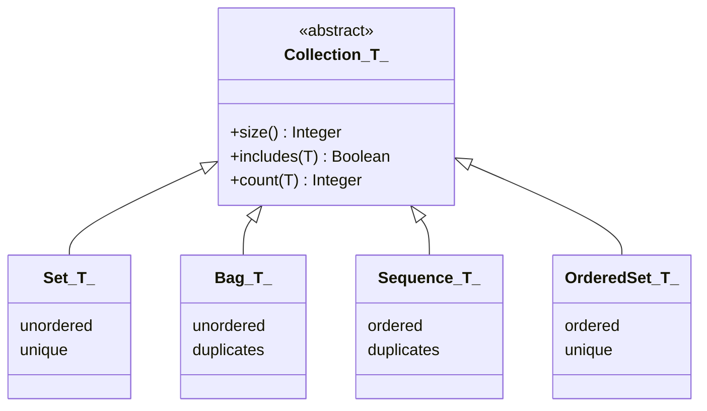

# Collection Operations

## Zweck dieser Datei

Diese Datei beschreibt die fachliche und technische Erweiterung der OCL-Collection-Unterstützung im neuen Backend. Sie behandelt sowohl die bereits im MVP vorhandenen Grundoperationen als auch die Collection Standard Library aus OMG OCL 2.4.

Normative Primärquelle ist `OCL-specification.pdf` im Workspace-Root, insbesondere:

- Clause 8 bis 10 für Typen, Ausdrücke, Well-formedness und Evaluation,
- Clause 11.6 für Collection Types,
- Clause 11.7 für Collection Operations,
- Clause 11.8 und 11.9 für Iterator Expressions.

Das originale USE-Projekt ist ausschließlich eine ergänzende Kompatibilitäts- und Regressionstestquelle. USE-Kurzformen dürfen die OCL-2.4-Semantik nicht verändern.

Die bestehende Pipeline bleibt verbindlich:

```text
OCL Text
-> Lexer
-> Parser
-> AST
-> Type Checker
-> Evaluator
-> Validation Result
```

## Rolle von Collections in OCL

Collections entstehen im Zielsystem hauptsächlich durch:

- Navigation über mehrwertige Association Ends,
- Collection Literals wie `Set{...}` oder `Sequence{...}`,
- Iteratoren wie `select` und `collect`,
- Collection-produzierende Operationen wie `including`, `union` oder `asSet`,
- `allInstances()`.

Im Library-Beispiel liefert die Navigation von einem `User` zu seinen ausgeliehenen Büchern eine Collection:

```ocl
self.borrowedBooks
```

Darauf können Queries ohne Seiteneffekt angewendet werden:

```ocl
self.borrowedBooks->size() <= 5
self.borrowedBooks->notEmpty()
self.borrowedBooks->includes(mobyDick)
```

Collection-Operationen verändern weder das UML-Modell noch den Snapshot. Produzierende Operationen liefern immer einen neuen OCL-Wert.

## Collection-Typen

### OCL-2.4-Typhierarchie



`OrderedSet(T)` ist in OCL 2.4 weder Untertyp von `Set(T)` noch von `Sequence(T)`. Ebenso ist `Sequence(T)` kein Untertyp von `Bag(T)`. Gemeinsamer Obertyp ist jeweils `Collection(T)`.

| Typ | Geordnet | Duplikate | Beispiel |
|---|---:|---:|---|
| `Collection(T)` | nicht festgelegt | nicht festgelegt | abstrakter gemeinsamer Typ |
| `Set(T)` | nein | nein | `Set{book1, book2}` |
| `Bag(T)` | nein | ja | `Bag{book1, book1}` |
| `Sequence(T)` | ja | ja | `Sequence{book1, book2, book1}` |
| `OrderedSet(T)` | ja | nein | `OrderedSet{book1, book2}` |

### Ableitung aus UML-Properties

Für mehrwertige UML-Properties bestimmt die Kombination aus `ordered` und `unique` die Collection-Art:

| `ordered` | `unique` | OCL-Typ |
|---:|---:|---|
| `false` | `true` | `Set(T)` |
| `false` | `false` | `Bag(T)` |
| `true` | `false` | `Sequence(T)` |
| `true` | `true` | `OrderedSet(T)` |

Das aktuelle UML-Domänenmodell bildet `ordered` und `unique` noch nicht vollständig ab. Bis diese Metadaten vorhanden sind, gilt folgende Annahme:

> **Annahme COL-A1:** Mehrwertige Association Navigation liefert vorläufig `Set(ClassType)`, weil Objektlinks derselben Association zwischen denselben Endobjekten im MVP nicht mehrfach vorkommen und keine stabile fachliche Reihenfolge definiert ist.

Diese Annahme ist ein dokumentiertes Produktprofil, keine vollständige OCL-2.4-Collection-Unterstützung.

### Aktueller Backend-Stand

| Bestandteil | Pfad | Befund |
|---|---|---|
| Operationsarten | `use-web-backend/src/main/java/de/useweb/backend/ocl/ast/CollectionOperation.java` | nur `SIZE`, `IS_EMPTY`, `NOT_EMPTY` |
| AST | `.../ocl/ast/CollectionOperationExpression.java` | Operation auf Source; keine allgemeinen Argumentlisten |
| Parser | `.../ocl/parser/OclParser.java` | feste parameterlose Collection Calls |
| Typmodell | `.../ocl/typecheck/OclType.java` | generischer Collection-Typ mit Elementtyp, keine vier konkreten Arten |
| Wertmodell | `.../ocl/value/CollectionValue.java` | Liste von Werten, Collection-Art nicht repräsentiert |
| Typechecker | `.../ocl/typecheck/OclTypeChecker.java` | `size` -> Integer, Leerheitsoperationen -> Boolean |
| Evaluator | `.../ocl/evaluation/OclEvaluator.java` | Größe und Leerheit einer CollectionValue |

Damit ist die Pipeline vorhanden, aber noch nicht geeignet, die normativen Rückgabetypen und Duplikat-/Ordnungsregeln von `union`, `intersection`, `including` oder `excluding` korrekt abzubilden.

## Operationsübersicht

### Operationen auf `Collection(T)`

| Operation | Signatur | Bedeutung | Priorität |
|---|---|---|---|
| `=` | `Collection(T) -> Boolean` | gleiche Art, Elemente, Häufigkeiten und bei geordneten Typen gleiche Reihenfolge | früh |
| `<>` | `Collection(T) -> Boolean` | Negation der Collection-Gleichheit | früh |
| `size()` | `Integer` | Anzahl aller Elemente einschließlich Duplikate | MVP |
| `includes(T)` | `Boolean` | Element mindestens einmal enthalten | früh |
| `excludes(T)` | `Boolean` | Element nicht enthalten | früh |
| `count(T)` | `Integer` | Anzahl der Vorkommen | früh |
| `includesAll(Collection(T))` | `Boolean` | alle Elemente der zweiten Collection enthalten | früh |
| `excludesAll(Collection(T))` | `Boolean` | kein Element der zweiten Collection enthalten | früh |
| `isEmpty()` | `Boolean` | Collection hat Größe 0 | MVP |
| `notEmpty()` | `Boolean` | Collection hat Größe ungleich 0 | MVP |
| `max()` | `T` | größtes Element nach gültiger `max`-Operation | mittel |
| `min()` | `T` | kleinstes Element nach gültiger `min`-Operation | mittel |
| `sum()` | `T` | Summe nach gültiger `+`-Operation | mittel |
| `product(c2)` | `Set(Tuple(first:T, second:T2))` | kartesisches Produkt | spät, benötigt Tuples |
| `selectByKind(type)` | Collection mit engerem Elementtyp | Elemente des Typs oder eines Subtyps | nach Generalisierung |
| `selectByType(type)` | Collection mit engerem Elementtyp | Elemente exakt des Typs | nach Generalisierung |
| `asSet()` | `Set(T)` | Duplikate entfernen | mittel |
| `asBag()` | `Bag(T)` | Bag mit denselben Elementen/Häufigkeiten | mittel |
| `asSequence()` | `Sequence(T)` | Sequenz; Ordnung kann bei ungeordneter Quelle undefiniert sein | mittel |
| `asOrderedSet()` | `OrderedSet(T)` | geordnet und eindeutig; Ordnung quellenabhängig | mittel |
| `flatten()` | Collection des verschachtelten Elementtyps | verschachtelte Collections rekursiv abflachen | spät |

Iterator Expressions wie `select`, `reject`, `collect`, `forAll`, `exists`, `any`, `one`, `isUnique`, `sortedBy`, `iterate` und `closure` werden in `05-iterator-expressions.md` vertieft. Sie sind keine normalen Standardoperationen im AST, auch wenn ihre konkrete Syntax wie ein Collection Call aussieht.

### Subtype-spezifische Operationen

| Typ | Wichtige zusätzliche/redefinierte Operationen |
|---|---|
| `Set(T)` | `union(Set)`, `union(Bag)`, `intersection(Set)`, `intersection(Bag)`, `-`, `including`, `excluding`, `symmetricDifference` |
| `Bag(T)` | `union(Bag)`, `union(Set)`, `intersection(Bag)`, `intersection(Set)`, `including`, `excluding` |
| `Sequence(T)` | `union(Sequence)`, `append`, `prepend`, `insertAt`, `subSequence`, `at`, `indexOf`, `first`, `last`, `including`, `excluding`, `reverse` |
| `OrderedSet(T)` | `append`, `prepend`, `insertAt`, `subOrderedSet`, `at`, `indexOf`, `first`, `last`, `reverse`; weitere subtype-spezifische Signaturen gemäß Standard Library |

## Bestehende MVP-Operationen

`size()`, `isEmpty()` und `notEmpty()` sind bereits implementiert. Sie bleiben trotzdem Teil der Erweiterung, weil sie auf das neue Collection- und `null`/`invalid`-Wertmodell migriert werden müssen.

| Operation | Heute | Erforderliche Härtung |
|---|---|---|
| `size()` | zählt Listenelemente | alle Collection-Arten, Duplikate, `null`/`invalid`, genaue Diagnosen |
| `isEmpty()` | prüft Liste auf leer | OCL-2.4-Semantik einschließlich impliziter Collection-Behandlung von `null` |
| `notEmpty()` | prüft Liste auf nicht leer | OCL-2.4-Semantik einschließlich `null` |

## `size`

| Aspekt | Festlegung |
|---|---|
| Syntax | `source->size()` |
| Bedeutung | Anzahl der Elemente; Duplikate werden mitgezählt |
| Eingabetyp | `Collection(T)` |
| Rückgabetyp | `Integer` |
| Parser | allgemeiner parameterloser Operation Call statt festem Sonderzweig |
| AST | `OperationCallExpression(source, "size", [])` oder äquivalenter allgemeiner Call |
| Typechecker | Source muss Collection-konform sein; Signaturauflösung liefert Integer |
| Evaluator | Größe der konkreten Collection-Repräsentation zurückgeben |
| Fehler | Nicht-Collection-Source, falsche Argumentzahl, `invalid`-Source |
| Post-MVP-Relevanz | Basis/MVP, muss früh migriert werden |

```ocl
self.borrowedBooks->size() <= 5
Sequence{book1, book1}->size() = 2
Set{book1, book1}->size() = 1
```

Tests: leere Collection, ein Element, Duplikate in Bag/Sequence, Duplikateliminierung in Set/OrderedSet, falsche Argumentzahl und `invalid`.

## `isEmpty`

| Aspekt | Festlegung |
|---|---|
| Syntax | `source->isEmpty()` |
| Bedeutung | wahr genau dann, wenn `size() = 0` |
| Eingabetyp | `Collection(T)` |
| Rückgabetyp | `Boolean` |
| Parser/AST | allgemeiner parameterloser Call |
| Typechecker | Source Collection-konform; keine Argumente |
| Evaluator | Größe 0 prüfen; keine Iteration notwendig |
| Fehler | Nicht-Collection, Argumente, `invalid` gemäß OCL-Propagation |
| Post-MVP-Relevanz | Basis/MVP |

OCL 2.4 beschreibt für `null->isEmpty()` das Ergebnis `true` durch implizite Umwandlung von `null` in eine leere Collection. Das aktuelle Backend hat diese Semantik nicht vollständig. Sie darf erst aktiviert werden, wenn `OclVoid`/`null` explizit modelliert und getestet ist.

```ocl
self.borrowedBooks->isEmpty()
```

## `notEmpty`

| Aspekt | Festlegung |
|---|---|
| Syntax | `source->notEmpty()` |
| Bedeutung | wahr genau dann, wenn `size() <> 0` |
| Eingabetyp | `Collection(T)` |
| Rückgabetyp | `Boolean` |
| Parser/AST | allgemeiner parameterloser Call |
| Typechecker | Source Collection-konform; keine Argumente |
| Evaluator | Größe ungleich 0 prüfen |
| Fehler | Nicht-Collection, Argumente, `invalid` gemäß OCL-Propagation |
| Post-MVP-Relevanz | Basis/MVP |

Nach OCL 2.4 ergibt `null->notEmpty()` `false`.

```ocl
self.borrowedBooks->notEmpty()
```

## `includes`

| Aspekt | Festlegung |
|---|---|
| Syntax | `source->includes(object)` |
| Bedeutung | wahr, wenn `object` mindestens einmal enthalten ist |
| Eingabetyp | Source `Collection(T)`, Argument kompatibel zu `T` |
| Rückgabetyp | `Boolean` |
| Parser | Call mit genau einem Ausdruck als Argument |
| AST | allgemeiner Call mit Argumentliste und Argument-Range |
| Typechecker | Argumenttyp muss zu `T` konform sein; gemeinsamen Typ berücksichtigen |
| Evaluator | Elemente nach OCL-Gleichheit vergleichen, nicht nach Java-Referenzgleichheit |
| Fehler | fehlendes/zusätzliches Argument, inkompatibler Typ, `invalid` in Source/Argument |
| Post-MVP-Relevanz | hoch, frühe Collection-Erweiterung |

```ocl
self.borrowedBooks->includes(mobyDick)
```

Für Objektwerte basiert Gleichheit auf stabiler Objektidentität. Für primitive und spätere Tuple-/Collection-Werte gelten die jeweiligen OCL-Gleichheitsregeln.

## `excludes`

| Aspekt | Festlegung |
|---|---|
| Syntax | `source->excludes(object)` |
| Bedeutung | wahr, wenn `object` nicht enthalten ist |
| Eingabetyp | Source `Collection(T)`, Argument kompatibel zu `T` |
| Rückgabetyp | `Boolean` |
| Parser/AST | wie `includes` |
| Typechecker | wie `includes` |
| Evaluator | semantisch `count(object) = 0` |
| Fehler | wie `includes` |
| Post-MVP-Relevanz | hoch |

```ocl
self.borrowedBooks->excludes(book)
```

## `includesAll`

| Aspekt | Festlegung |
|---|---|
| Syntax | `source->includesAll(other)` |
| Bedeutung | jedes Element aus `other` ist in `source` enthalten |
| Eingabetyp | `Collection(T)` und kompatible `Collection(T2)` |
| Rückgabetyp | `Boolean` |
| Typechecker | Elementtypen müssen einen zulässigen Konformitätsbezug haben |
| Evaluator | für jedes Element von `other` Mitgliedschaft prüfen |
| Besonderheit | Häufigkeiten sind für diese Mitgliedschaftsdefinition nicht ausschlaggebend |
| Post-MVP-Relevanz | hoch |

```ocl
self.borrowedBooks->includesAll(self.requiredBooks)
```

## `excludesAll`

| Aspekt | Festlegung |
|---|---|
| Syntax | `source->excludesAll(other)` |
| Bedeutung | kein Element aus `other` ist in `source` enthalten |
| Eingabetyp | zwei elementtypkompatible Collections |
| Rückgabetyp | `Boolean` |
| Evaluator | für jedes Element von `other` Ausschluss prüfen |
| Post-MVP-Relevanz | hoch |

```ocl
self.borrowedBooks->excludesAll(self.blockedBooks)
```

## `including`

| Aspekt | Festlegung |
|---|---|
| Syntax | `source->including(object)` |
| Bedeutung | neue Collection mit den bisherigen Elementen und `object` |
| Eingabetyp | konkrete Collection-Art mit Elementtyp `T`, Argument typkompatibel |
| Rückgabetyp | subtype-spezifisch, z. B. `Set(T)`, `Bag(T)` oder `Sequence(T)` |
| Parser/AST | normaler Call mit einem Argument |
| Typechecker | Overload anhand konkreter Source-Art; Ergebnis-Elementtyp ggf. gemeinsamer Typ |
| Evaluator | Source nicht verändern; neue Collection erzeugen; Ordnung/Duplikate beachten |
| Fehler | abstrakte/unklare Collection-Art, inkompatibler Typ, `invalid` |
| Post-MVP-Relevanz | hoch nach Collection-Typmodell |

```ocl
self.borrowedBooks->including(mobyDick)
```

Semantikbeispiele:

```ocl
Set{book1}->including(book1)          -- Set{book1}
Bag{book1}->including(book1)          -- Bag{book1, book1}
Sequence{book1}->including(book2)     -- Sequence{book1, book2}
```

## `excluding`

| Aspekt | Festlegung |
|---|---|
| Syntax | `source->excluding(object)` |
| Bedeutung | neue Collection ohne Vorkommen von `object` |
| Eingabetyp | konkrete Collection-Art und kompatibles Argument |
| Rückgabetyp | grundsätzlich dieselbe konkrete Collection-Art |
| Typechecker | wie `including` |
| Evaluator | alle gleichen Vorkommen entfernen; Reihenfolge der übrigen Elemente erhalten, sofern geordnet |
| Fehler | wie `including` |
| Post-MVP-Relevanz | hoch nach Collection-Typmodell |

```ocl
self.borrowedBooks->excluding(book)
Sequence{book1, book2, book1}->excluding(book1) -- Sequence{book2}
```

## `count`

| Aspekt | Festlegung |
|---|---|
| Syntax | `source->count(object)` |
| Bedeutung | Anzahl der Vorkommen eines gleichen Elements |
| Eingabetyp | `Collection(T)` und Argument kompatibel zu `T` |
| Rückgabetyp | `Integer` |
| Parser/AST | normaler Call mit einem Argument |
| Typechecker | Signatur `count(T): Integer` |
| Evaluator | alle Vorkommen nach OCL-Gleichheit zählen |
| Fehler | Argumentzahl, inkompatibler Typ, ungültiger Vergleich |
| Post-MVP-Relevanz | hoch; Grundlage für Mitgliedschaft und Bag-Semantik |

```ocl
self.borrowedBooks->count(book)
Set{book, book}->count(book) = 1
Bag{book, book}->count(book) = 2
```

## `union`

`union` ist subtype-spezifisch. Eine Signatur `Collection(T)::union(Collection(T))` darf nicht pauschal erfunden werden.

| Source | Argument | Ergebnis | Semantik |
|---|---|---|---|
| `Set(T)` | `Set(T)` | `Set(T)` | Mengenvereinigung ohne Duplikate |
| `Set(T)` | `Bag(T)` | `Bag(T)` | Häufigkeiten beider Collections addieren |
| `Bag(T)` | `Bag(T)` | `Bag(T)` | Häufigkeiten addieren |
| `Bag(T)` | `Set(T)` | `Bag(T)` | Set-Element zählt jeweils einmal zusätzlich |
| `Sequence(T)` | `Sequence(T)` | `Sequence(T)` | Konkatenation in Reihenfolge |

```ocl
self.borrowedBooks->union(self.reservedBooks)
Sequence{book1}->union(Sequence{book2}) -- Sequence{book1, book2}
```

Parserseitig ist `union` ein normaler Call mit einem Argument. Die Komplexität liegt in Overload-Auflösung, Typkonformität und Evaluation. Nicht definierte Kombinationen müssen einen spezifischen Type Error liefern.

## `intersection`

| Source | Argument | Ergebnis | Semantik |
|---|---|---|---|
| `Set(T)` | `Set(T)` | `Set(T)` | gemeinsame Elemente |
| `Set(T)` | `Bag(T)` | `Set(T)` | gemeinsame Elemente ohne Duplikate |
| `Bag(T)` | `Bag(T)` | `Bag(T)` | minimale Häufigkeit je Element |
| `Bag(T)` | `Set(T)` | `Set(T)` | gemeinsame Elemente ohne Duplikate |

```ocl
self.borrowedBooks->intersection(self.favoriteBooks)
```

`intersection` ist im Standard nicht als allgemeine Operation für beliebige `Sequence`-Kombinationen definiert. Für solche Quellen ist eine explizite Konvertierung, beispielsweise `asSet()`, erforderlich.

## Weitere standardisierte Collection-Operationen

### Früh bis mittel

| Operation | Grund für Aufnahme | Voraussetzung |
|---|---|---|
| Collection-Gleichheit `=`/`<>` | Grundlage für Constraints und Tests | Collection-Art, Häufigkeit, Reihenfolge |
| `includesAll`, `excludesAll` | häufige Mengenregeln | allgemeine Argument-Calls |
| `max`, `min`, `sum` | Standard Library und numerische Queries | Operation Resolution, leere Collection, `invalid` |
| `asSet`, `asBag`, `asSequence`, `asOrderedSet` | explizite Steuerung der Collection-Art | vollständiges Typ-/Wertmodell |
| `symmetricDifference` | standardisierte Set-Operation | Set und `xor` |
| Set-Differenz `-` | standardisierte Set-Operation | Set-Semantik |

### Spät

| Operation | Grund für spätere Umsetzung |
|---|---|
| `product(c2)` | Ergebnis ist ein `Set(Tuple(...))`; benötigt Tuple-Typ und Tuple-Wert |
| `flatten()` | verschachtelte Elementtypen, subtype-spezifische Ergebnisart und rekursive Semantik |
| `selectByKind`, `selectByType` | benötigt Generalisierung, Classifier-Werte und Typoperationen |
| `append`, `prepend`, `insertAt`, `reverse` | nur für geordnete Collection-Arten sinnvoll |
| `at`, `first`, `last`, `indexOf` | Index-/Leerheitsfehler und geordnete Collection-Werte |
| `subSequence`, `subOrderedSet` | Bereichsprüfung und stabile Ordnung |

`select`, `reject`, `collect`, `collectNested`, `forAll`, `exists`, `any`, `one`, `isUnique`, `sortedBy`, `iterate` und `closure` sind in der Standardbibliothek eng mit Collections verbunden, werden architektonisch aber als Iterator Expressions behandelt.

## Parser-Auswirkungen

### Zielgrammatik

Der Parser darf Collection-Operationen nicht länger anhand einer kleinen Namensliste mit Speziallogik erkennen. Er soll allgemeine Operation Calls parsen:

```ebnf
postfixExpression
  ::= primaryExpression postfixPart*

postfixPart
  ::= "." identifier arguments?
   |  "->" identifier arguments

arguments
  ::= "(" argumentList? ")"

argumentList
  ::= expression ("," expression)*
```

Iteratoraufrufe benötigen später eine getrennte Alternative für Variablendeklarationen und `|`.

Parserverantwortung:

- Name, Source und Argumente strukturell erfassen,
- Source Range für Call, Namen und jedes Argument liefern,
- leere und mehrteilige Argumentlisten unterstützen,
- keine fachliche Operationsexistenz entscheiden,
- keine Source-/Rückgabetypen raten.

Die kanonische OCL-2.4-Form verwendet Operation Calls mit Klammern. USE-Kurzformen ohne Klammern sind nur in einem optionalen Kompatibilitätsprofil zu normalisieren.

## AST-Auswirkungen

Empfehlung:

```java
public record OperationCallExpression(
    OclAstNode source,
    String operationName,
    List<OclAstNode> arguments,
    SourceRange sourceRange,
    SourceRange nameRange
) implements OclAstNode {}
```

Nach dem Typechecking kann eine aufgelöste Referenz separat geführt werden:

```java
public record ResolvedOperation(
    String libraryOwner,
    String name,
    List<OclType> parameterTypes,
    OclType returnType
) {}
```

Der bestehende `CollectionOperationExpression` kann migrationsweise erhalten bleiben, sollte aber nicht für jede neue Operation und jeden Overload erweitert werden. Ein allgemeiner Call-Knoten reduziert Parser-Sonderlogik und erlaubt denselben Mechanismus für String-, Number-, OclAny- und spätere Modelloperationen.

## Typechecker-Regeln

### Allgemeiner Ablauf

1. Source-Ausdruck typprüfen.
2. Argumentausdrücke typprüfen.
3. Operationen aus der OCL Standard Library für den Source-Typ sammeln.
4. Arity und Typkonformität prüfen.
5. spezifischsten gültigen Overload auswählen.
6. Typparameter `T`, `T2` und gemeinsamen Elementtyp bestimmen.
7. konkreten Rückgabetyp berechnen.
8. `ResolvedOperation` und präzise Diagnosen erzeugen.

### Kernregeln

| Regel | Erwartung |
|---|---|
| Source | muss zum Owner-Typ der Operation konform sein |
| Elementargument | muss zum Collection-Elementtyp konform sein oder einen definierten gemeinsamen Typ erlauben |
| Collectionargument | Collection-Art und Elementtyp müssen zu einem definierten Overload passen |
| Result Type | wird aus konkreter Operation und Source-/Argumentart abgeleitet |
| Abstraktes `Collection(T)` | darf nur Operationen verwenden, die auf `Collection` definiert sind |
| Empty Collection | benötigt erwarteten Typ oder Typinferenz für Elementtyp |
| `null`/`invalid` | folgt OCL-2.4-Typkonformität; keine Java-Null-Sonderregel |

Beispiel:

```ocl
Set{book1}->union(Bag{book2})
```

Der Typechecker löst `Set(T)::union(Bag(T)) : Bag(T)` auf. Das Ergebnis darf nicht pauschal als `Set(Book)` typisiert werden.

## Evaluator-Regeln

### Wertrepräsentation

Empfohlen wird eine explizite Collection-Art:

```java
public enum CollectionKind {
    SET,
    BAG,
    SEQUENCE,
    ORDERED_SET
}

public record CollectionValue(
    CollectionKind kind,
    OclType elementType,
    List<OclValue> elements
) implements OclValue {}
```

Invarianten der Repräsentation:

- `SET`: keine gleichen Duplikate; Reihenfolge semantisch irrelevant,
- `BAG`: Duplikate erlaubt; Reihenfolge semantisch irrelevant,
- `SEQUENCE`: Duplikate und Reihenfolge relevant,
- `ORDERED_SET`: keine gleichen Duplikate; Reihenfolge relevant.

### Evaluationsgrundsätze

| Bereich | Regel |
|---|---|
| Gleichheit | OCL-Gleichheit pro Werttyp verwenden |
| Unveränderlichkeit | Source und Argument-Collections nie mutieren |
| Ordnung | bei Sequence/OrderedSet stabil erhalten, sofern Operation dies verlangt |
| Duplikate | subtype-spezifisch erhalten, addieren oder entfernen |
| Ergebnisart | aus aufgelöstem Overload übernehmen, nicht im Evaluator neu raten |
| `invalid` | gemäß OCL-2.4-Propagation weitergeben |
| `null` | nur gemäß standardisierter impliziter Umwandlung behandeln |
| Determinismus | ungeordnete Ergebnisse nicht künstlich als fachlich geordnet ausgeben |

Für effiziente Implementierung können intern zusätzliche Indexstrukturen genutzt werden. Die sichtbare Semantik muss trotzdem durch `CollectionKind`, OCL-Gleichheit und deterministische Serialisierung kontrolliert werden.

## Fehlerfälle

| Code-Vorschlag | Beispiel | Phase |
|---|---|---|
| `UNKNOWN_OPERATION` | `books->contains(book)` | Typechecker |
| `INVALID_OPERATION_ARITY` | `books->size(book)` | Typechecker |
| `INVALID_COLLECTION_SOURCE` | `self.name->includes('x')` | Typechecker |
| `INCOMPATIBLE_ELEMENT_TYPE` | `Set(Book)->includes(5)` | Typechecker |
| `NO_MATCHING_OPERATION_OVERLOAD` | `Sequence(Book)->intersection(Set(Book))` | Typechecker |
| `AMBIGUOUS_OPERATION_OVERLOAD` | mehrere gleich spezifische Signaturen | Typechecker |
| `UNDEFINED_COLLECTION_KIND` | produzierender Call auf nur abstrakt bekannter Collection | Typechecker |
| `EMPTY_COLLECTION_NO_TYPE` | leeres Literal ohne ableitbaren Elementtyp | Typechecker |
| `INVALID_COLLECTION_ELEMENT` | Collection enthält `invalid`, obwohl Well-formedness verletzt ist | Typechecker/Evaluator |
| `INDEX_OUT_OF_RANGE` | später `sequence->at(0)` | Evaluator |
| `EMPTY_COLLECTION_ACCESS` | später `sequence->first()` auf leer | Evaluator |
| `EVALUATION_ERROR` | unerwartete interne Inkonsistenz | Evaluator/Validation |

Diagnosen enthalten mindestens Operation, erwartete Signaturen, tatsächliche Source-/Argumenttypen und Source Range. Java-Ausnahmen dürfen nicht als API-Antwort sichtbar werden.

## Testfälle

### Typ- und Semantiktests

| ID | Ausdruck/Szenario | Erwartung |
|---|---|---|
| `OCL-COL-001` | `Set{}->size()` | `0 : Integer` |
| `OCL-COL-002` | `Bag{book, book}->size()` | `2` |
| `OCL-COL-003` | `Set{book, book}->size()` | `1` |
| `OCL-COL-004` | `Set{}->isEmpty()` | `true` |
| `OCL-COL-005` | `Set{book}->notEmpty()` | `true` |
| `OCL-COL-006` | `Set{book}->includes(book)` | `true` |
| `OCL-COL-007` | `Set{book}->excludes(other)` | `true` |
| `OCL-COL-008` | `Bag{book, book}->count(book)` | `2` |
| `OCL-COL-009` | `Set{book}->including(book)` | unverändertes `Set{book}` |
| `OCL-COL-010` | `Bag{book}->including(book)` | zwei Vorkommen |
| `OCL-COL-011` | `Sequence{a,b,a}->excluding(a)` | `Sequence{b}` |
| `OCL-COL-012` | `Set{a}->union(Set{b})` | `Set{a,b}` |
| `OCL-COL-013` | `Bag{a,a}->union(Set{a})` | `Bag{a,a,a}` |
| `OCL-COL-014` | `Bag{a,a,b}->intersection(Bag{a,b,b})` | `Bag{a,b}` |
| `OCL-COL-015` | `Set{a,b}->intersection(Bag{b,b})` | `Set{b}` |
| `OCL-COL-016` | `Set{a,b}->includesAll(Bag{a,a})` | `true` nach Mitgliedschaftsdefinition |
| `OCL-COL-017` | `Set{a}->excludesAll(Set{b})` | `true` |
| `OCL-COL-018` | `null->isEmpty()` | `true` nach OCL 2.4 |
| `OCL-COL-019` | `null->notEmpty()` | `false` nach OCL 2.4 |
| `OCL-COL-020` | Collection-Gleichheit über verschiedene Arten | `false` |

### Fehler- und Integrationstests

| ID | Szenario | Erwartung |
|---|---|---|
| `OCL-COL-E01` | Operation auf String statt Collection | `INVALID_COLLECTION_SOURCE` mit Source Range |
| `OCL-COL-E02` | falsche Argumentzahl | `INVALID_OPERATION_ARITY` |
| `OCL-COL-E03` | inkompatibles Elementargument | erwarteter und tatsächlicher Typ enthalten |
| `OCL-COL-E04` | nicht definierte Overload-Kombination | `NO_MATCHING_OPERATION_OVERLOAD` |
| `OCL-COL-E05` | `invalid` als Source | standardkonformes `invalid`, kein Serverfehler |
| `OCL-COL-A01` | Parse API mit `includes` | AST/Call und Argumentrange korrekt |
| `OCL-COL-A02` | Typecheck API mit Set/Bag-`union` | konkreter Result Type korrekt |
| `OCL-COL-A03` | Evaluate API mit Collection-Ergebnis | strukturierter Wert mit `kind` und Elementen |
| `OCL-COL-V01` | verletzte Library-Invariante | Finding referenziert Invariante und Kontextobjekt |

Jede Operation benötigt Tests für alle zulässigen Source-Arten, leere Collections, Duplikate, Ordnung, `null`, `invalid`, falsche Arity und inkompatible Typen.

## Library-Beispiele

### Maximal fünf ausgeliehene Bücher

```ocl
context User inv maxBooks:
  self.borrowedBooks->size() <= 5
```

Für `alice : User` mit sechs verknüpften Büchern ergibt die Invariante `false`.

### Mindestens ein ausgeliehenes Buch

```ocl
context User inv hasBorrowedBooks:
  self.borrowedBooks->notEmpty()
```

### Bestimmtes Buch ausgeliehen

Ein freier Name wie `mobyDick` benötigt eine lokale Variable, einen Operationsparameter oder einen anderen gültigen OCL-Kontext. In einer Operation mit Parameter wäre möglich:

```ocl
context User::hasBorrowed(book : Book) : Boolean
body:
  self.borrowedBooks->includes(book)
```

Im Evaluate-Endpunkt kann dasselbe AST nur ausgewertet werden, wenn `book` explizit im Evaluation Context gebunden wird. Ein Objektname aus dem Diagramm ist nicht automatisch eine OCL-Variable.

### Blockierte Bücher ausschließen

```ocl
context User inv noBlockedBooks:
  self.borrowedBooks->excludesAll(self.blockedBooks)
```

Dieses Beispiel setzt eine zweite mehrwertige Navigation `blockedBooks` voraus.

### Duplikatkontrolle

```ocl
context User inv borrowedOnce:
  self.borrowedBooks->count(self.favoriteBook) <= 1
```

Bei einer Set-Navigation ist diese Regel trivial; bei Bag-/Sequence-Navigation kann sie fachlich relevant sein. Das zeigt, warum UML-`unique` und Collection-Art vor der Nutzung von `count` geklärt werden müssen.

## API- und Frontend-Auswirkungen

Die bestehenden Endpunkte bleiben ausreichend:

- `POST /api/v1/projects/{projectId}/ocl/parse`,
- `POST /api/v1/projects/{projectId}/ocl/typecheck`,
- `POST /api/v1/projects/{projectId}/ocl/evaluate`,
- `POST /api/v1/projects/{projectId}/validate`.

DTO-Erweiterungen werden für Collection-Ergebnisse benötigt:

```json
{
  "valid": true,
  "resultType": "Set(Book)",
  "value": {
    "kind": "SET",
    "elementType": "Book",
    "elements": [
      { "kind": "OBJECT", "objectId": "book-1", "displayName": "mobyDick : Book" }
    ]
  },
  "diagnostics": []
}
```

Das Frontend benötigt keine neue Hauptansicht. Der OCL Editor sollte Operationen und Signaturen anzeigen können; Evaluation Results müssen Collection-Art und Elemente lesbar darstellen. Die fachliche Semantik bleibt vollständig im Backend.

## Umsetzungsempfehlung

### Stufe C0: MVP migrieren

1. allgemeines Operation-Call-AST einführen,
2. `size`, `isEmpty`, `notEmpty` darauf migrieren,
3. bisherige Regressionstests erhalten,
4. Source-/Argumentranges vereinheitlichen.

### Stufe C1: Collection-Typ- und Wertmodell

1. `CollectionKind` und konkrete `CollectionType`-Varianten,
2. Ordnung und Duplikate,
3. OCL-Gleichheit,
4. UML-`ordered`/`unique` oder dokumentierte Set-Annahme,
5. strukturierte API-Werte.

### Stufe C2: Typunabhängige Queries

1. `includes`, `excludes`, `count`,
2. `includesAll`, `excludesAll`,
3. Collection-Gleichheit,
4. `max`, `min`, `sum` nach Operation Resolution.

### Stufe C3: Produzierende Operationen

1. `including`, `excluding`,
2. subtype-spezifisches `union`,
3. subtype-spezifisches `intersection`,
4. Set-Differenz und `symmetricDifference`,
5. Konvertierungsoperationen.

### Stufe C4: Späte Standardbibliothek

1. geordnete Collection-Operationen,
2. `flatten`,
3. `product` nach Tuple-Unterstützung,
4. `selectByKind`/`selectByType` nach Generalisierung und Typoperationen.

Ein vereinfachtes Collection-Modell ist nur bis C0 für bestehende Grundqueries akzeptabel. C2 und insbesondere C3 dürfen nicht produktiv freigegeben werden, solange Collection-Art, Gleichheit und `null`/`invalid` ungeklärt sind.

## Risiken

| Risiko | Folge | Gegenmaßnahme |
|---|---|---|
| alle Collections bleiben Listen | Set-/Bag-Ergebnisse sind fachlich falsch | expliziter `CollectionKind` |
| `union` wird generisch implementiert | falsche Rückgabetypen und Häufigkeiten | subtype-spezifische Signaturauflösung |
| Java-Equality statt OCL-Equality | falsche Mitgliedschaft bei Objekten/Werten | zentraler OCL-Equality-Service |
| ungeordnete Collections werden sortiert | künstliche fachliche Ordnung | Ordnung nur für Darstellung determinisieren, nicht semantisch machen |
| `null` wird als leere Java-Liste behandelt | falsche Propagation außerhalb definierter Fälle | OclVoid explizit modellieren |
| AST wächst als Enum-Sonderfall | jede Operation benötigt Parseränderung | allgemeiner Operation Call und Library Registry |
| Elementtyp wird zu früh festgelegt | heterogene Literale/Typkonformität fehlerhaft | gemeinsamer Typ und Typparameterauflösung |
| freie Objektnamen werden als Variablen akzeptiert | nicht standardkonforme Namensauflösung | nur explizite Scope-Bindungen |
| Iteratoren werden als normale Calls behandelt | Scope- und Body-Typregeln fehlen | eigener Iterator-AST |

## Offene Fragen

| Frage | Bedeutung |
|---|---|
| Wann werden UML-`ordered` und `unique` im Domänenmodell ergänzt? | bestimmt Navigationstypen |
| Soll das frühe Produktprofil alle mehrwertigen Navigationen als `Set` behandeln? | muss explizit dokumentiert und versioniert werden |
| Wie werden `null`, fehlende Slots und `invalid` gegeneinander abgegrenzt? | betrifft jede Operation |
| Wie wird der gemeinsame Elementtyp bei `including` und gemischten Collections berechnet? | Typechecker und Result Type |
| Wie werden ungeordnete Collections deterministisch über JSON übertragen, ohne Ordnung zu versprechen? | API- und Teststabilität |
| Werden Collection Literals zusammen mit C1 oder erst in der späteren Typmodellphase umgesetzt? | Testbarkeit der Operationen |
| Welche Standard-Library-Signaturen werden aus Daten statt Java-Sondercode beschrieben? | Erweiterbarkeit und Konsistenz |
| Wird ein separater USE-Kompatibilitätsmodus für Aufrufe ohne `()` angeboten? | Importverhalten, nicht OCL-Kern |

## Zusammenfassung

`size`, `isEmpty` und `notEmpty` bilden die vorhandene MVP-Basis, müssen aber auf ein OCL-2.4-taugliches Collection- und Wertmodell migriert werden. Danach folgen die allgemeinen Queries `includes`, `excludes`, `count`, `includesAll` und `excludesAll`.

Collection-produzierende Operationen wie `including`, `excluding`, `union` und `intersection` dürfen erst nach Einführung von `Set`, `Bag`, `Sequence` und `OrderedSet` umgesetzt werden. Ihre Rückgabetypen und ihre Behandlung von Ordnung und Duplikaten sind subtype-spezifisch. Eine pauschale Listenimplementierung wäre fachlich falsch.

Die technische Kernempfehlung ist ein allgemeiner Operation-Call-AST, eine zentrale Standard-Library-Signaturauflösung, ein expliziter `CollectionKind`, ein gemeinsamer OCL-Equality-Service und strukturierte Collection Results in der API. Iterator Expressions bleiben trotz ähnlicher Syntax eigene AST- und Scope-Konstrukte und werden in der folgenden Analyse vertieft.
