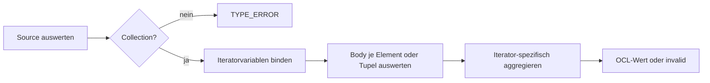
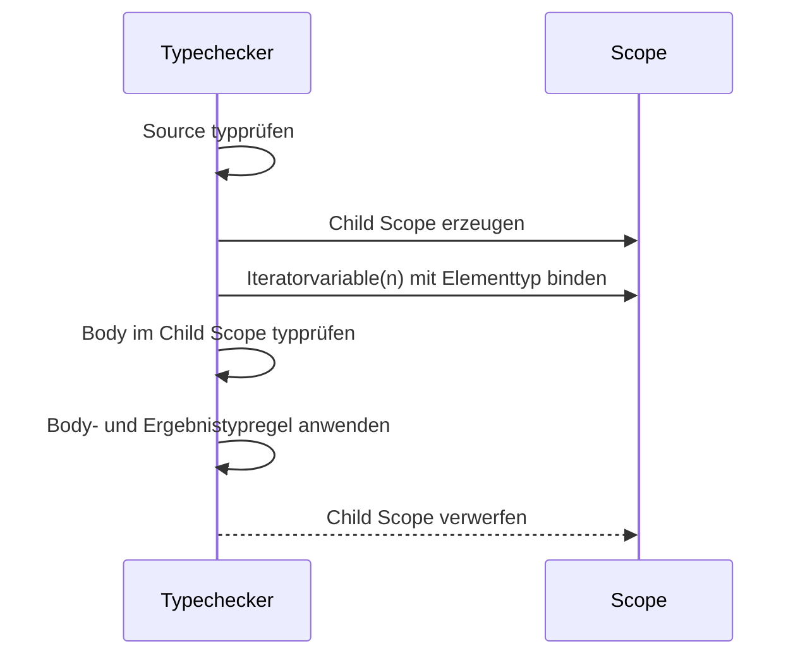

# Iterator Expressions

## Zweck dieser Datei

Diese Datei beschreibt die fachliche Semantik und die technische Erweiterung der neuen OCL-Komponente um Iterator Expressions. Sie konkretisiert die Auswirkungen auf Lexer, Parser, AST, Typechecker, Evaluator, Validation, REST-Vertrag und Frontend.

Normative Grundlage ist **OMG OCL 2.4**, insbesondere die abstrakte und konkrete Syntax sowie die Collection- und Iteratorsemantik in den Clauses 7 bis 11. Das originale USE-Projekt und dessen Beispiele dienen ausschließlich als ergänzende Syntax-, Verhaltens- und Testfallreferenz. Es wird weder als Dependency eingebunden noch wird Implementierungscode übernommen.

Der betrachtete Standardumfang umfasst:

- `forAll`
- `exists`
- `select`
- `reject`
- `collect`
- `collectNested`
- `any`
- `one`
- `isUnique`
- `sortedBy`
- `iterate`
- `closure`

Die zuerst umzusetzende Post-MVP-Stufe beschränkt sich auf `forAll`, `exists`, `select`, `reject` und `collect`. Die übrigen Ausdrücke bleiben Teil des Zielumfangs, werden aber nach ihrer technischen Abhängigkeit gestaffelt.

## Rolle von Iteratoren in OCL

Iteratoren wenden einen Body-Ausdruck auf Elemente einer Collection an. Im Unterschied zu gewöhnlichen Operationsaufrufen führen sie lokale Variablen und einen lexikalischen Scope ein.

```ocl
self.borrowedBooks->forAll(book | book.available = false)
```

Der Ausdruck besteht aus:

| Bestandteil | Beispiel | Bedeutung |
|---|---|---|
| Source | `self.borrowedBooks` | auszuwertende Collection |
| Iteratorname | `forAll` | gewünschte Iterationssemantik |
| Iteratorvariable | `book` | lokale Bindung für ein Element |
| optionaler deklarierter Typ | `book : Book` | explizite Typangabe, die zum Elementtyp passen muss |
| Body | `book.available = false` | Ausdruck, der für gebundene Elemente ausgewertet wird |
| Ergebnis | `Boolean` | Ergebnis gemäß Iteratorregel |

Iteratoren sind deshalb keine gewöhnlichen Collection Operations mit Callback-Argument. Sie benötigen eigene Grammatik-, AST-, Scope- und Evaluationsregeln.

## Grundkonzept

### Abgrenzung zu Collection Operations

```ocl
-- normaler Operationsaufruf
self.borrowedBooks->includes(mobyDick)

-- Iterator Expression mit lokaler Variable
self.borrowedBooks->exists(book | book.title = 'Moby Dick')
```

Bei `includes` werden normale Argumente im vorhandenen Kontext ausgewertet. Bei `exists` wird für jedes Element ein untergeordneter Kontext mit der Bindung `book` erzeugt.

### Grundlegender Ablauf



### Voraussetzungen

Vor der Iteratorimplementierung müssen folgende Grundlagen stabil sein:

1. explizite Collection-Arten `Set`, `Bag`, `Sequence` und `OrderedSet`,
2. verlässliche Elementtypen für mehrwertige Association Navigation,
3. OCL-konforme `null`- und `invalid`-Semantik,
4. allgemeine Variablenreferenzen und verschachtelte Scopes,
5. Source Ranges für Deklaration, Body und Gesamtausdruck,
6. eine gemeinsame OCL-Gleichheitssemantik,
7. definierte Ressourcenlimits für verschachtelte Iterationen.

## Iterator-Variable und Scope

### Lexikalischer Scope

Der Iterator-Body sieht:

- das `self` des äußeren Constraint-Kontexts,
- äußerlich deklarierte Variablen,
- die aktuelle Iteratorvariable beziehungsweise die Iteratorvariablen,
- bei `iterate` zusätzlich die Akkumulatorvariable.

Die Iteratorvariable ist nur im Body sichtbar. Sie ist weder in der Source Expression noch außerhalb des Iteratorausdrucks sichtbar.

```ocl
context User inv SameOwner:
  self.borrowedBooks->forAll(book |
    book.owner = self
  )
```

`self` bleibt hier der geprüfte `User`; `book` bezeichnet das jeweils gebundene `Book`.

### Verschachtelte Iteratoren

```ocl
self.borrowedBooks->forAll(book |
  book.authors->exists(author | author.active)
)
```

Der innere Scope erweitert den äußeren Scope. Im inneren Body sind `self`, `book` und `author` sichtbar. Typechecker und Evaluator müssen dieselbe Namensauflösung verwenden.

### Shadowing

Für verschachtelte Deklarationen ist eine verbindliche Policy erforderlich:

```ocl
self.borrowedBooks->forAll(item |
  item.authors->exists(item | item.active)
)
```

**Empfehlung:** Lexikalisches Shadowing wird entsprechend der OCL-Namensauflösung unterstützt, aber als optionale Warnung `SHADOWED_VARIABLE` gemeldet. Die innere Bindung verdeckt nur innerhalb ihres Bodys die äußere Bindung. Nach Verlassen des Scopes muss die äußere Bindung unverändert verfügbar sein.

Innerhalb derselben Deklarationsliste sind doppelte Namen unzulässig. Die endgültigen Well-formedness-Regeln sind vor der Implementierung nochmals direkt gegen OCL 2.4 abzugleichen.

### Implizite Iteratorvariable

OCL erlaubt neben der expliziten Form auch kontextabhängige Kurzformen. Für das neue Backend gilt:

- Die erste Implementierungsstufe verwendet die explizite Form `book | ...`.
- Typangaben wie `book : Book | ...` werden unterstützt.
- Implizite Iteratorformen werden erst nach eindeutiger OCL-2.4-Grammatik- und Namensauflösung ergänzt.
- Der Parser darf Kurzformen nicht durch ad-hoc Textumschreibung erzeugen.

## Iteratorübersicht

| Iterator | Body-Typ | Ergebnis | Leere Source | Mehrere Variablen | Priorität |
|---|---|---|---|---|---|
| `forAll` | `Boolean` | `Boolean` | `true` | ja | sehr hoch |
| `exists` | `Boolean` | `Boolean` | `false` | ja | sehr hoch |
| `select` | `Boolean` | Source-Art mit gefilterten Elementen | leer | nein | hoch |
| `reject` | `Boolean` | Source-Art mit gefilterten Elementen | leer | nein | hoch |
| `collect` | beliebig | Collection der Body-Ergebnisse, anschließend flach | leer | nein | hoch |
| `collectNested` | beliebig | Collection der Body-Ergebnisse ohne Flattening | leer | nein | mittel |
| `any` | `Boolean` | Elementtyp der Source oder `invalid` | `invalid` | nein | mittel |
| `one` | `Boolean` | `Boolean` | `false` | nein | mittel |
| `isUnique` | beliebig | `Boolean` | `true` | nein | mittel |
| `sortedBy` | vergleichbarer Typ | geordnete Collection | leer | nein | später |
| `iterate` | Akkumulatortyp | Akkumulatortyp | Initialwert | eigener Akkumulator | spät |
| `closure` | Element oder Collection kompatibler Elemente | `Set` oder `OrderedSet` | leer | nein | spät |

## `forAll`

### Syntax und Bedeutung

```ocl
self.borrowedBooks->forAll(book | book.available = false)
self.borrowedBooks->forAll(book : Book | book.title <> '')
```

`forAll` ergibt `true`, wenn der Boolean-Body für alle betrachteten Bindungen wahr ist.

| Regel | Festlegung |
|---|---|
| Source | `Collection(T)` |
| Iteratorvariable | Typ `T`, optional kompatibel explizit deklariert |
| Body | muss `Boolean` ergeben |
| Rückgabetyp | `Boolean` |
| Leere Collection | `true` |
| Kurzschluss | bei `false` zulässig |

OCL-2.4-Wahrheitswerte müssen beachtet werden: `false` dominiert ein anderes `invalid`- oder `null`-Ergebnis. Ohne `false` ist `invalid` vor `null` und `true` zu berücksichtigen. Ein Evaluator darf daher nicht unbesehen beim ersten `invalid` abbrechen.

Mehrere Iteratorvariablen bilden Bindungskombinationen über der Source:

```ocl
books->forAll(left, right | left <> right implies left.isbn <> right.isbn)
```

Die konkrete kartesische Semantik und Reihenfolge wird normativ getestet, bevor diese Syntax freigegeben wird.

### Technische Auswirkungen

- Parser: Iterator-Deklarationsliste und `|` erkennen.
- AST: `IteratorExpression(FOR_ALL, source, variables, body)`.
- Typechecker: Source und Boolean-Body prüfen.
- Evaluator: Bindungen erzeugen und OCL-konform aggregieren.
- Fehler: falscher Source-Typ, unbekannte Variable, falscher Body-Typ.

## `exists`

```ocl
self.borrowedBooks->exists(book | book.title = 'Moby Dick')
```

`exists` ergibt `true`, wenn mindestens eine Bindung den Body mit `true` erfüllt.

| Regel | Festlegung |
|---|---|
| Source | `Collection(T)` |
| Body | `Boolean` |
| Rückgabetyp | `Boolean` |
| Leere Collection | `false` |
| Kurzschluss | bei `true` zulässig |

Bei OCL-Wahrheitswerten dominiert `true` ein anderes `invalid`- oder `null`-Ergebnis. Existiert kein `true`, sind `invalid`, `null` und anschließend `false` gemäß OCL 2.4 zu behandeln.

## `select`

```ocl
self.borrowedBooks->select(book | book.available = true)
```

`select` liefert die Elemente, für die der Body wahr ist.

| Regel | Festlegung |
|---|---|
| Source | konkrete Collection-Art mit Elementtyp `T` |
| Body | `Boolean` |
| Rückgabetyp | grundsätzlich dieselbe Collection-Art und `T` |
| Duplikate | entsprechend Source-Art erhalten |
| Reihenfolge | bei geordneter Source erhalten |
| Leere Collection | leere Collection derselben Art |

`invalid` und `null` im Prädikat dürfen nicht als Java-`false` interpretiert werden. Das genaue Ergebnis folgt der normativen OCL-Definition und benötigt explizite Tests.

## `reject`

```ocl
self.borrowedBooks->reject(book | book.available = true)
```

`reject` liefert die Elemente, für die das Prädikat nicht wahr ist. Es ist fachlich eng mit `select` verwandt, muss aber dieselbe definierte `null`-/`invalid`-Semantik verwenden und darf nicht als ungeprüftes `select(not body)` implementiert werden.

| Regel | Festlegung |
|---|---|
| Source | konkrete Collection-Art mit Elementtyp `T` |
| Body | `Boolean` |
| Rückgabetyp | dieselbe Collection-Art und `T` |
| Leere Collection | leere Collection derselben Art |

## `collect`

```ocl
self.borrowedBooks->collect(book | book.title)
```

`collect` transformiert jedes Source-Element in den Wert des Bodys. Standardgemäß entspricht es konzeptionell `collectNested(...)->flatten()`.

| Regel | Festlegung |
|---|---|
| Source | `Collection(T)` |
| Body | beliebiger OCL-Typ `R` |
| Rückgabe | Collection der Body-Ergebnisse; verschachtelte Collections werden abgeflacht |
| Leere Collection | leere Ergebnis-Collection |
| `null` als Body-Wert | als OCL-Wert gemäß Collection-Semantik behandeln |
| `invalid` | gemäß OCL-Semantik propagieren |

Die konkrete Ergebnisart hängt von der Source-Art ab. Für `Set`/`Bag` entsteht typischerweise ein `Bag`, für geordnete Quellen eine `Sequence`. Die vollständige OCL-2.4-Tabelle ist im Type-System als Signaturregel abzubilden und nicht im Parser zu erraten.

## `collectNested`

```ocl
self.borrowedBooks->collectNested(book | book.authors)
```

`collectNested` sammelt Body-Ergebnisse ohne automatisches Flattening. Wenn der Body `Collection(Author)` ergibt, bleibt der Ergebnis-Elementtyp eine Collection von `Author`.

| Aspekt | `collect` | `collectNested` |
|---|---|---|
| Transformation | ja | ja |
| automatisches Flattening | ja | nein |
| verschachtelte Collection-Typen | werden reduziert | bleiben erhalten |

`collectNested` sollte gemeinsam mit `flatten` geplant werden, da beide Operationen denselben Typ- und Wertbereich berühren.

## `any`

```ocl
self.borrowedBooks->any(book | book.title = 'Moby Dick')
```

`any` liefert ein beliebiges Element, dessen Body `true` ergibt.

| Regel | Festlegung |
|---|---|
| Source | `Collection(T)` |
| Body | `Boolean` |
| Rückgabetyp | `T` |
| kein Treffer oder leere Source | `invalid` |
| mehrere Treffer | beliebiger passender Wert |

Für reproduzierbare Tests darf die Implementierung bei stabiler interner Iterationsreihenfolge den ersten Treffer wählen. Diese Deterministik ist eine Implementierungseigenschaft und keine fachliche Zusage über OCL-Reihenfolge.

## `one`

```ocl
self.borrowedBooks->one(book | book.title = 'Moby Dick')
```

`one` ergibt `true`, wenn genau eine Bindung den Body erfüllt.

| Regel | Festlegung |
|---|---|
| Source | `Collection(T)` |
| Body | `Boolean` |
| Rückgabetyp | `Boolean` |
| Leere Collection | `false` |
| Optimierung | nach dem zweiten `true` kann mit `false` beendet werden |

Ein zuvor aufgetretenes `invalid` darf nicht still verworfen werden. Die vollständige Aggregation muss OCL 2.4 entsprechen.

## `isUnique`

```ocl
self.borrowedBooks->isUnique(book | book.isbn)
```

`isUnique` prüft, ob der Body für jedes Element einen eindeutigen Wert ergibt.

| Regel | Festlegung |
|---|---|
| Body | beliebiger vergleichbarer OCL-Wert |
| Rückgabetyp | `Boolean` |
| Leere/einelementige Source | `true` |
| Vergleich | zentraler OCL-Equality-Service |

Die Implementierung darf nicht Java-Objektidentität für fachliche Werte verwenden. `invalid` im Body führt gemäß Standardsemantik zu `invalid`; der Umgang mit mehrfachen `null`-Werten wird normativ getestet.

## `sortedBy`

```ocl
self.borrowedBooks->sortedBy(book | book.title)
```

`sortedBy` ordnet Elemente nach einem vom Body berechneten Schlüssel.

| Source | Ergebnisart |
|---|---|
| `Set(T)` | `OrderedSet(T)` |
| `Bag(T)` | `Sequence(T)` |
| `Sequence(T)` | `Sequence(T)` |
| `OrderedSet(T)` | `OrderedSet(T)` |

Der Schlüsseltyp muss eine transitive `<`-Operation unterstützen. Für gleiche Schlüssel kann die Implementierung die Source-Reihenfolge stabil erhalten; die OCL-Semantik darf dadurch nicht um eine nicht spezifizierte Ordnung erweitert werden.

## `iterate`

`iterate` ist der allgemeine Faltungsmechanismus, auf den viele Iteratorsemantiken formal zurückgeführt werden können.

```ocl
self.borrowedBooks->iterate(
  book : Book;
  count : Integer = 0 |
  if book.available then count + 1 else count endif
)
```

| Bestandteil | Bedeutung |
|---|---|
| `book` | Iteratorvariable |
| `count : Integer` | Akkumulatorvariable und -typ |
| `= 0` | Initialwert |
| Body | berechnet den nächsten Akkumulator |
| Ergebnis | finaler Akkumulatorwert |

Typechecker-Regeln:

1. Der Initialwert muss zum Akkumulatortyp konform sein.
2. Der Body muss wieder einen zum Akkumulatortyp konformen Wert liefern.
3. Iterator- und Akkumulatorvariable sind im Body sichtbar.
4. Das Ergebnis hat den Akkumulatortyp.

Bei leerer Source ist das Ergebnis der Initialwert. Für ungeordnete Collections darf fachlich keine unbeabsichtigte Reihenfolgeabhängigkeit versprochen werden.

## `closure`

```ocl
self.directReports->closure(employee | employee.directReports)
```

`closure` berechnet die transitive Hülle einer Navigation beziehungsweise Beziehung.

| Regel | Festlegung |
|---|---|
| Source | `Collection(T)` |
| Body | `T` oder kompatible `Collection(T)` |
| Ergebnis | `OrderedSet(T)` für geordnete Source, sonst `Set(T)` |
| Leere Source | leeres Ergebnis |
| Zyklen | müssen durch eine Visited-Struktur terminieren |

`closure` benötigt zusätzlich Laufzeitlimits für sehr große oder zyklische Graphen. Die OCL-Gleichheit bestimmt, wann ein Element bereits besucht wurde.

## Parser-Auswirkungen

### Benötigte Tokens

Mindestens erforderlich sind:

- `PIPE` für `|`,
- `COLON` für Typdeklarationen,
- `COMMA` für mehrere Iteratorvariablen,
- `SEMICOLON` und `ASSIGN` für `iterate`,
- Identifier für Iteratornamen und Variablen.

Iteratornamen sollten nicht pauschal als reservierte Keywords behandelt werden, wenn dadurch Property- oder Operationsnamen unnötig blockiert würden. Die Auflösung kann im Parser beziehungsweise in der Standard-Library erfolgen.

### Zielgrammatik

```ebnf
iteratorExpression
  ::= expression "->" iteratorName "(" iteratorVariables? "|" expression ")"

iteratorVariables
  ::= variableDeclaration ("," variableDeclaration)*

variableDeclaration
  ::= IDENTIFIER (":" typeExpression)?

iterateExpression
  ::= expression "->" "iterate" "("
      variableDeclaration ";"
      variableDeclaration "=" expression
      "|" expression ")"
```

Die Grammatik muss normale Operationsargumente von Iterator-Deklarationen unterscheiden und bei fehlendem `|`, fehlender Variable oder unvollständigem Body lokal recovern können.

### Präzedenz

Der Body ist ein vollständiger OCL-Ausdruck:

```ocl
self.borrowedBooks->forAll(book |
  book.available = false and book.title <> ''
)
```

Der Parser darf den Body nicht am ersten Operator beenden. Source Range und Recovery müssen auch für verschachtelte Iteratoren korrekt bleiben.

## AST-Auswirkungen

### Empfohlenes Modell

```text
OclExpression
|- VariableExpression
|- IteratorExpression
|  |- source: OclExpression
|  |- kind: IteratorKind
|  |- variables: List<VariableDeclaration>
|  `- body: OclExpression
`- IterateExpression
   |- source: OclExpression
   |- iterator: VariableDeclaration
   |- accumulator: AccumulatorDeclaration
   `- body: OclExpression
```

```java
public record IteratorExpression(
    OclExpression source,
    IteratorKind kind,
    List<VariableDeclaration> variables,
    OclExpression body,
    SourceRange sourceRange
) implements OclExpression {}
```

Zusätzlich erforderlich:

| AST-Baustein | Zweck |
|---|---|
| `VariableExpression` | Referenz auf lokale Iterator-, Let- oder Operationsvariable |
| `VariableDeclaration` | Name, optionaler Typ und Source Range |
| `IteratorKind` | standardisierte Iteratorart, keine freien String-Switches |
| `AccumulatorDeclaration` | Typ und Initialausdruck von `iterate` |
| Teilranges | präzise Fehler an Source, Variable, Body und Akkumulator |

Der AST enthält Syntax und aufgelöste Metadaten, aber keine mutable Laufzeitbindung.

## Typechecker-Regeln

### Scope-Verarbeitung



Das Scope-Modell sollte unveränderlich oder strikt stack-basiert sein. Typechecker und Evaluator brauchen dieselben Sichtbarkeitsregeln, aber getrennte Typ- beziehungsweise Wertbindungen.

### Typregeltabelle

| Ausdruck | Source | Body | Ergebnis |
|---|---|---|---|
| `forAll`, `exists`, `one` | `Collection(T)` | `Boolean` | `Boolean` |
| `select`, `reject` | konkrete `C(T)` | `Boolean` | `C(T)` |
| `any` | `Collection(T)` | `Boolean` | `T` |
| `collectNested` | `C(T)` | `R` | sourceabhängige Collection von `R` |
| `collect` | `C(T)` | `R` | sourceabhängige Collection des abgeflachten `R` |
| `isUnique` | `Collection(T)` | `R` | `Boolean` |
| `sortedBy` | `C(T)` | Typ mit `<` | geordnete Collection von `T` |
| `closure` | `C(T)` | `T` oder `Collection(T)` kompatibel | `Set(T)`/`OrderedSet(T)` |
| `iterate` | `C(T)` | Akkumulatortyp `A` | `A` |

Explizit deklarierte Iteratorvariablentypen müssen mit dem Source-Elementtyp nach den OCL-Konformitätsregeln vereinbar sein. Stringvergleiche von Typnamen sind unzureichend.

## Evaluator-Regeln

### Laufzeitkontext

Der Evaluation Context benötigt lokale immutable Bindungen:

```text
EvaluationContext
|- selfObject
|- snapshot
|- outerVariables
`- localVariables
   |- book -> ObjectValue(book-17)
   `- author -> ObjectValue(author-4)
```

Für jedes Element wird ein Child Context erzeugt. Mutable globale Maps sind zu vermeiden, weil Fehler oder verschachtelte Iteratoren sonst Bindungen verlieren können.

### Collection-Treue

Der Evaluator muss Collection-Art, Ordnung und Duplikatsemantik erhalten:

| Iterator | zentrale Evaluatorpflicht |
|---|---|
| `select`, `reject` | Elemente und Source-Art korrekt filtern |
| `collectNested` | Body-Werte ohne Flattening sammeln |
| `collect` | standardkonform sammeln und flatten |
| `sortedBy` | Zielart und Schlüsselvergleich einhalten |
| `closure` | Set-Semantik, Ordnung und Zyklen behandeln |

### Ressourcenlimits

Für verschachtelte Iteratoren sind konfigurierbare Grenzen nötig:

- maximale AST-/Iteratorverschachtelung,
- maximales Evaluationsbudget pro Invariante,
- maximale Zahl erzeugter Bindungskombinationen,
- maximale Closure-Größe,
- Timeout oder kontrollierter Abbruch.

Ein Abbruch ergibt einen strukturierten `EVALUATION_ERROR`, keinen HTTP-500-Fehler.

## Fehlerfälle

| Code | Phase | Beispiel | UI-Zuordnung |
|---|---|---|---|
| `UNKNOWN_ITERATOR` | Typecheck | `->forall(...)` | Iteratorname |
| `INVALID_ITERATOR_SOURCE` | Typecheck | `self.name->forAll(...)` | Source |
| `MISSING_ITERATOR_VARIABLE` | Parse | `->forAll(| true)` | Deklarationsbereich |
| `DUPLICATE_ITERATOR_VARIABLE` | Typecheck | `forAll(x, x | ...)` | zweite Deklaration |
| `UNKNOWN_VARIABLE` | Typecheck | Body nutzt `b`, deklariert ist `book` | Variablenreferenz |
| `INVALID_ITERATOR_VARIABLE_TYPE` | Typecheck | `book : User` auf `Set(Book)` | Typannotation |
| `INVALID_ITERATOR_BODY_TYPE` | Typecheck | `forAll(book | book.title)` | Body |
| `INVALID_ITERATOR_ARITY` | Typecheck | zwei Variablen bei `select` | Deklarationsliste |
| `INVALID_ACCUMULATOR_TYPE` | Typecheck | Initialwert/Body nicht konform | Akkumulator/Body |
| `NON_COMPARABLE_SORT_KEY` | Typecheck | `sortedBy` über Objekt ohne `<` | Body |
| `ITERATOR_EVALUATION_ERROR` | Evaluation | Propertywert nicht auswertbar | Body und Kontextobjekt |
| `ITERATION_LIMIT_EXCEEDED` | Evaluation | zu große kartesische Iteration | Gesamtausdruck |

Diagnosen sollten zusätzlich `expression`, `location`, `contextClassId`, `contextObjectId`, `invariantId` und optional den fachlich lesbaren Variablennamen enthalten. Konkrete Objekt-IDs gehören in technische Mapping-Felder, nicht zwingend in die User Message.

## Testfälle

### Kern- und Semantiktests

| ID | Ebene | Ausdruck/Szenario | Erwartung |
|---|---|---|---|
| `OCL-ITER-001` | Parser | `books->forAll(b | b.available)` | Iterator-AST mit Variable und Body |
| `OCL-ITER-002` | Parser | verschachteltes `forAll`/`exists` | korrekte Scopes und Source Ranges |
| `OCL-ITER-003` | Typechecker | `Set(Book)->forAll(b | b.title)` | `INVALID_ITERATOR_BODY_TYPE` |
| `OCL-ITER-004` | Typechecker | Body referenziert unbekanntes `x` | `UNKNOWN_VARIABLE` am Identifier |
| `OCL-ITER-005` | Evaluator | `forAll` auf leerer Collection | `true` |
| `OCL-ITER-006` | Evaluator | `exists` auf leerer Collection | `false` |
| `OCL-ITER-007` | Evaluator | `one` mit genau einem Treffer | `true` |
| `OCL-ITER-008` | Evaluator | `one` mit zwei Treffern | `false` |
| `OCL-ITER-009` | Evaluator | `select` auf `Sequence` | Ordnung und Duplikate erhalten |
| `OCL-ITER-010` | Evaluator | `reject` auf `Bag` | Bag-Semantik erhalten |
| `OCL-ITER-011` | Evaluator | `collect` mit Collection-Body | Ergebnis korrekt abgeflacht |
| `OCL-ITER-012` | Evaluator | `collectNested` mit Collection-Body | Verschachtelung erhalten |
| `OCL-ITER-013` | Evaluator | `any` ohne Treffer | `invalid` |
| `OCL-ITER-014` | Evaluator | `isUnique(b | b.isbn)` mit Duplikat | `false` |
| `OCL-ITER-015` | Evaluator | zyklische `closure` | terminiert, keine Duplikate |
| `OCL-ITER-016` | Evaluator | `iterate` auf leerer Source | Initialwert |

### Scope-, Fehler- und Integrationstests

| ID | Szenario | Erwartung |
|---|---|---|
| `OCL-SCOPE-001` | `self` im Iterator-Body | äußeres Kontextobjekt bleibt sichtbar |
| `OCL-SCOPE-002` | inneres Shadowing | innere Bindung gilt nur im inneren Body |
| `OCL-SCOPE-003` | Variable nach Iterator verwendet | `UNKNOWN_VARIABLE` |
| `OCL-SCOPE-004` | zwei gleichnamige Variablen derselben Liste | strukturierter Typfehler |
| `OCL-SEM-001` | `forAll` enthält `false` und `invalid` | normatives OCL-Ergebnis, kein Java-Kurzschlussfehler |
| `OCL-SEM-002` | `exists` enthält `true` und `invalid` | normatives OCL-Ergebnis |
| `OCL-API-001` | Parse-/Typecheck-Fehler im Body | Source Range zeigt Body-Teilbereich |
| `OCL-VAL-001` | fehlschlagendes `forAll` in Invariante | `INVARIANT_VIOLATION` referenziert Invariante und Kontextobjekt |
| `OCL-LIMIT-001` | Iterationsbudget überschritten | kontrollierter `EVALUATION_ERROR` |

Für `null` und `invalid` ist pro Iterator eine normative Wahrheitstabelle aus OCL 2.4 abzuleiten. Diese Tests sind Freigabekriterien und keine optionalen Edge Cases.

## Library-Beispiele

### Alle ausgeliehenen Bücher sind nicht verfügbar

```ocl
context User inv BorrowedBooksUnavailable:
  self.borrowedBooks->forAll(book | book.available = false)
```

### Mindestens ein bestimmter Titel ist ausgeliehen

```ocl
context User inv HasMobyDick:
  self.borrowedBooks->exists(book | book.title = 'Moby Dick')
```

### Verfügbare Bücher filtern

```ocl
self.borrowedBooks->select(book | book.available = true)
```

### Titel projizieren

```ocl
self.borrowedBooks->collect(book | book.title)
```

### ISBN muss eindeutig sein

```ocl
self.borrowedBooks->isUnique(book | book.isbn)
```

Das Library-Modell eignet sich als primäres Regression Fixture, weil es Navigation, Collection-Elementtypen, Objektwerte und Validation Mapping kombiniert.

## API-, Validation- und Frontend-Auswirkungen

### API

Neue Hauptendpunkte sind nicht erforderlich. Die bestehenden Parse-, Typecheck-, Evaluate- und Validate-Flows werden erweitert. Response-DTOs müssen jedoch darstellen können:

- lokale Variablen in Diagnosen,
- konkrete und generische Collection-Typen,
- Collection-Ergebnisse einschließlich `collectionKind`,
- Source Ranges für Source, Deklaration und Body,
- optionale Evaluation Details für ein fehlschlagendes Element.

### Validation

Bei einer Invariantenverletzung sollte die User Message fachlich lesbar bleiben:

> Invariante `BorrowedBooksUnavailable` ist für Objekt `alice : User` verletzt.

Optional können Details nennen, welches Element den Iterator-Body nicht erfüllt hat. Die vollständige Iterationshistorie wird nicht standardmäßig übertragen, da sie groß und potenziell sensibel sein kann.

### Frontend

Eine neue Hauptansicht ist nicht notwendig. Der OCL Editor sollte perspektivisch bieten:

- Syntax Highlighting für Iterator und `|`,
- Autocomplete für die lokale Iteratorvariable,
- Hover-Information zum abgeleiteten Elementtyp,
- Unterstreichung exakt am fehlerhaften Body oder Identifier,
- optional einklappbare Evaluation Details.

## Bezug zum aktuellen Backend

Der aktuelle Stand unterstützt Iterator Expressions noch nicht. Vorhanden sind einfache Expressions, Property Access und die Collection-Grundoperationen `size`, `isEmpty` und `notEmpty`. Daraus folgen notwendige Erweiterungen:

| Bereich | Erforderliche Änderung |
|---|---|
| Lexer/Parser | `|`, Deklarationen und Iteratorgrammatik |
| AST | Variable-, Iterator- und Iterate-Knoten |
| Typechecker | lexikalische Typumgebungen und Iteratorregeln |
| Evaluator | lokale Wertbindungen und Collection-Aggregation |
| Collection-Modell | explizite Arten, Ordnung und Duplikate |
| Error Model | Teilranges und Iteratorfehlercodes |
| Tests | isolierte Semantik- und integrierte Validation Tests |

Diese Datei plant die Erweiterung; sie behauptet keine bereits vorhandene Implementierung.

## Bezug zum originalen USE-Projekt

Das originale USE-Projekt ist ergänzende Referenz für realistische Syntax und Regressionstests. Relevante, bereits in der Analyse identifizierte Stellen sind:

| Pfad | Nutzung |
|---|---|
| `use/use-core/src/test/java/org/tzi/use/uml/ocl/expr/ExpQueryTest.java` | fachliche Testfallquelle für Query- und Iteratorausdrücke |
| `use/use-core/src/main/java/org/tzi/use/uml/ocl/expr/ExpForAll.java` | nur Verhaltenreferenz, nicht übernehmen |
| `use/use-core/src/main/resources/examples/Documentation/Demo/Demo.use` | `forAll`, Navigation und globale Regeln |
| `use/use-core/src/main/resources/examples/Documentation/Graph/Graph.use` | verschachtelte Navigation und Iteratorfälle |

Vor Übernahme eines Beispielausdrucks in Regressionstests ist zu prüfen, ob er ausschließlich den unterstützten UML-/OCL-Umfang verwendet. USE-spezifische Erweiterungen dürfen nicht als OCL-Standard deklariert werden.

## Umsetzungsempfehlung

### Stufe I0: Grundlagen

1. Collection-Arten und OCL-`null`/`invalid` fertigstellen.
2. `VariableExpression` und gemeinsame lexikalische Scope-Abstraktion einführen.
3. Source Ranges und strukturierte Diagnosen vervollständigen.
4. Iteratorgrammatik mit expliziter Variable implementieren.

### Stufe I1: Quantoren

`forAll` und `exists` zuerst umsetzen. Sie validieren Scope, Boolean-Body und OCL-Kurzschlusssemantik, ohne Ergebnis-Collections zu konstruieren.

### Stufe I2: Filter

`select` und `reject` folgen. Hier wird die Erhaltung von Collection-Art, Ordnung und Duplikaten abgesichert.

### Stufe I3: Transformation

`collectNested`, `flatten` und `collect` gemeinsam umsetzen. So wird Flattening nicht als Sonderfall im Evaluator versteckt.

### Stufe I4: Erweiterte Queries

`any`, `one` und `isUnique` ergänzen. Danach folgt `sortedBy`, sobald geordnete Collections und Vergleichbarkeit stabil sind.

### Stufe I5: Allgemeine und transitive Iteratoren

`iterate` und `closure` zuletzt umsetzen. Beide haben höhere Risiken durch Akkumulator-Typisierung, Ordnungsabhängigkeit, Zyklen und Laufzeitkosten.

## Risiken

| Risiko | Auswirkung | Gegenmaßnahme |
|---|---|---|
| Iteratoren werden als normale Calls modelliert | Scope und Body-Typen bleiben fehleranfällig | eigener Iterator-AST |
| Typechecker und Evaluator lösen Namen unterschiedlich auf | korrekt typisierte Ausdrücke scheitern zur Laufzeit | gemeinsames Scope-Konzept und parallele Tests |
| Java-Boolean ersetzt OCL-Wahrheitswerte | falsche Ergebnisse bei `null`/`invalid` | zentrale OCL-Logik und Wahrheitstabellen |
| Collection-Art geht verloren | falsche Duplikat- und Ordnungseigenschaften | `CollectionKind` in Typ und Wert |
| naive verschachtelte Iteration | Laufzeit- und Speicherprobleme | Budgets, Limits und Traces |
| `collect` flattening ist implizit verteilt | inkonsistente Typ- und Laufzeitsemantik | `collectNested` plus zentraler `flatten`-Mechanismus |
| Shadowing wird mutabel umgesetzt | äußere Bindungen werden überschrieben | immutable Child Scopes |
| USE-Verhalten wird mit Standard verwechselt | unbeabsichtigter Dialekt | OCL 2.4 normativ, USE nur ergänzend |

## Offene Fragen

| Frage | Entscheidung vor |
|---|---|
| Welche impliziten Iterator-Kurzformen werden exakt akzeptiert? | Parserfreigabe I1 |
| Wird Shadowing nur erlaubt oder zusätzlich gewarnt? | Scope-API I0 |
| Welche OCL-2.4-Regeln gelten je Iterator exakt für `null` und `invalid`? | Evaluatorfreigabe pro Iterator |
| Werden mehrere Iteratorvariablen in I1 oder erst später unterstützt? | Grammatik- und Testumfang I1 |
| Wie werden generische und verschachtelte Collection-Typen in DTOs dargestellt? | `collectNested` I3 |
| Welche Iterations- und Closure-Limits gelten pro Request? | produktiver Evaluatorbetrieb |
| Wie viele Evaluation Details darf eine Validation Response enthalten? | Frontend-/API-Vertrag |
| Welche originalen USE-Beispiele bestehen ausschließlich aus standardisiertem OCL 2.4? | Regression Suite |

## Zusammenfassung

Iterator Expressions erweitern OCL nicht nur um weitere Operationsnamen, sondern um lokale Variablen, lexikalische Scopes, Collection-abhängige Ergebnistypen und eigene Evaluationssemantik. Deshalb müssen Parser, AST, Typechecker und Evaluator gemeinsam erweitert werden.

Die empfohlene Reihenfolge lautet: gemeinsame Scope- und Collection-Grundlagen, danach `forAll`/`exists`, anschließend `select`/`reject`, dann `collectNested`/`collect` und zuletzt `any`, `one`, `isUnique`, `sortedBy`, `iterate` und `closure`. Source Locations, strukturierte Fehler und normative `null`-/`invalid`-Tests laufen von Beginn an parallel.

OCL 2.4 bleibt die verbindliche fachliche Quelle. Das originale USE-Projekt und seine Beispiele liefern zusätzliche Regressionstests, bestimmen aber weder Architektur noch Semantik des neuen Backends.
