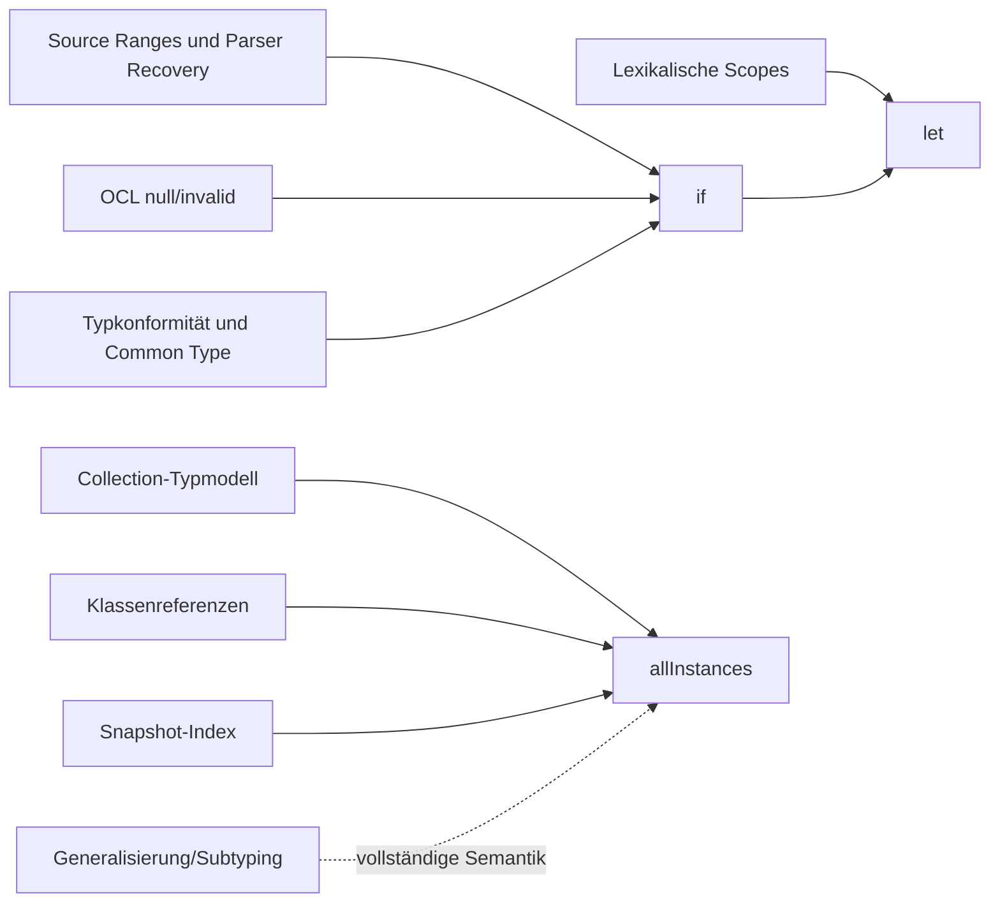
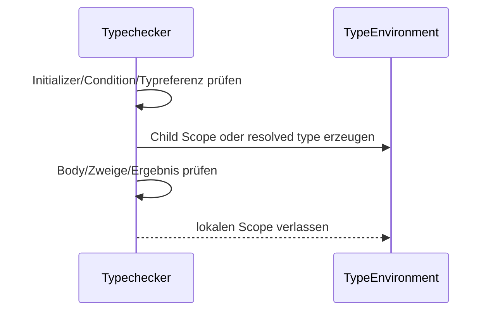
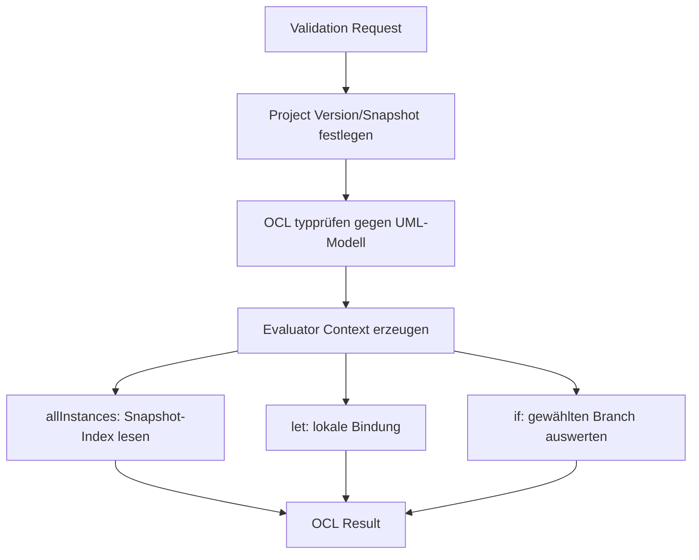

# Let, If and AllInstances

## Zweck dieser Datei

Diese Datei analysiert die Erweiterung der neuen OCL-Komponente um:

- lokale Bindungen mit `let-in`,
- bedingte Ausdrücke mit `if-then-else-endif`,
- modellweite Instanzabfragen mit `allInstances()`.

Beschrieben werden fachliche Semantik, Syntax, Parser, AST, Typechecker, Evaluator, Snapshot-Zugriff, Fehlerbehandlung, Validation, API und Frontend. Normative Grundlage ist **OMG OCL 2.4**. Das originale USE-Projekt und vorhandene USE-Beispiele dienen nur als ergänzende Syntax-, Verhaltens- und Testfallreferenz. Es werden weder alter USE-Code noch der USE-Core übernommen.

`allInstances()` ist in OCL 2.4 ein optionaler Evaluation-Compliance-Point. Die Anwendung muss daher ausdrücklich dokumentieren, ob und mit welchem Laufzeitumfang dieser Ausdruck unterstützt wird.

## Einordnung dieser Features

Die drei Features erweitern unterschiedliche Teile der OCL-Pipeline:

| Feature | Fachlicher Nutzen | Zentrale technische Neuerung | Priorität |
|---|---|---|---|
| `if-then-else-endif` | zustandsabhängige Werte und Regeln | Branch-Type-Join und lazy Branch Evaluation | hoch nach semantischen Grundlagen |
| `let-in` | lesbare Zwischenergebnisse und Wiederverwendung | lokale Variable und lexikalischer Scope | hoch nach Scope-Infrastruktur |
| `allInstances()` | Regeln über alle Objekte eines Typs | Klassenliteral und Snapshot-Index | hoch für globale Regeln, optionaler Compliance-Point |

Empfohlene Abhängigkeiten:



`let` und `if` sind OCL-Ausdrücke und können an jeder syntaktisch zulässigen Ausdrucksposition stehen. `allInstances()` ist eine Operation auf einem Typwert beziehungsweise einer Klassenreferenz, nicht auf `self` und nicht auf dem statischen UML-Klassenmodell als Objektmenge.

## `let`-Ausdrücke

### Fachlicher Zweck

`let` bindet das Ergebnis eines Ausdrucks an einen lokalen Namen. Dadurch lassen sich komplexe Navigationen oder Berechnungen einmal ausführen und im folgenden Ausdruck wiederverwenden.

```ocl
let max : Integer = 5 in self.books <= max
```

```ocl
let activeLoans = self.borrowedBooks->select(book | not book.available) in
  activeLoans->size() <= 5
```

### Syntax

Kanonische Form:

```ebnf
letExpression
  ::= "let" letVariableDeclaration ("," letVariableDeclaration)*
      "in" expression

letVariableDeclaration
  ::= IDENTIFIER (":" typeExpression)? "=" expression
```

Eine Deklaration besitzt:

| Bestandteil | Beispiel | Bedeutung |
|---|---|---|
| Name | `max` | lokale Variable |
| optionaler Typ | `Integer` | deklarierter Zieltyp |
| Initializer | `5` | einmal auszuwertender Bindungsausdruck |
| `in`-Body | `self.books <= max` | Ausdruck im erweiterten Scope |

Mehrere Deklarationen gehören zum OCL-Gesamtumfang und müssen normativ gegen OCL 2.4 umgesetzt werden. Abhängigkeiten zwischen Deklarationen dürfen nicht durch eine unklare parallele Auswertung entstehen; Sichtbarkeit und Reihenfolge sind durch Grammatik und Well-formedness-Regeln verbindlich festzulegen und zu testen.

### Variable Binding und Scope

Die lokale Variable ist nur im `in`-Body sichtbar. Sie ist nicht in ihrem eigenen Initializer und nicht außerhalb des `let`-Ausdrucks verfügbar.

```ocl
-- gültig
let max = 5 in self.books <= max

-- max ist außerhalb nicht sichtbar
(let max = 5 in self.books <= max) and max > 0
```

Der Body sieht weiterhin:

- das äußere `self`,
- äußere `let`-Variablen,
- Iteratorvariablen eines umgebenden Iterators,
- Operationsparameter in späteren Pre-/Postcondition-Kontexten.

```ocl
self.borrowedBooks->forAll(book |
  let normalizedTitle = book.title in normalizedTitle <> ''
)
```

Typechecker und Evaluator müssen dieselbe lexikalische Namensauflösung verwenden.

### Typableitung

| Fall | Typregel |
|---|---|
| keine Typannotation | Variablentyp ist der statische Typ des Initializers |
| Typannotation vorhanden | Initializertyp muss dem deklarierten Typ konform sein |
| Initializer ist `null` | Typableitung benötigt OCL-`OclVoid` und Kontextinformation |
| Initializer ist `invalid` | Typ- und Fehlerfortsetzung müssen OCL-konform bleiben |
| Ergebnis des `let` | Typ des `in`-Bodys |

Eine Typannotation darf den Initializer nicht durch Stringkonvertierung passend machen. Es gelten ausschließlich die OCL-Konformitätsregeln.

### Shadowing

```ocl
let limit = 5 in
  let limit = 3 in self.books <= limit
```

**Empfehlung:** Lexikalisches Shadowing wird entsprechend der OCL-Namensauflösung unterstützt. Die innere Variable verdeckt nur im inneren Body die äußere Variable. Optional kann eine Warnung `SHADOWED_VARIABLE` ausgegeben werden. Doppelte Namen innerhalb derselben Deklarationsgruppe sind als Fehler zu behandeln, sofern die normative Regel keine sequentielle Neubindung vorsieht.

Die endgültige Detailregel für Deklarationslisten ist vor Implementierung unmittelbar gegen OCL 2.4 zu verifizieren.

### Evaluierung

1. Initializer im äußeren Evaluation Context auswerten.
2. Child Context mit Name-Wert-Bindung erzeugen.
3. `in`-Body genau einmal in diesem Child Context auswerten.
4. Child Context verwerfen.
5. Body-Ergebnis als Ergebnis des gesamten `let` liefern.

Der Initializer wird nicht bei jeder Variablenreferenz erneut ausgewertet. `invalid` im Initializer führt grundsätzlich zu einem invaliden Binding beziehungsweise Ergebnis nach OCL-Semantik und darf keine Java-`null`-Exception auslösen.

### Fehlerfälle

| Code | Beispiel | Location |
|---|---|---|
| `MISSING_LET_VARIABLE` | `let = 5 in true` | Deklaration |
| `MISSING_LET_INITIALIZER` | `let max : Integer in ...` | hinter Typ/Name |
| `MISSING_IN_KEYWORD` | `let max = 5 self.books <= max` | Ende der Deklaration |
| `DUPLICATE_VARIABLE` | doppelte Namen derselben Gruppe | zweite Deklaration |
| `LET_TYPE_MISMATCH` | `let max : Integer = '5'` | Initializer und Typannotation |
| `UNKNOWN_VARIABLE` | Referenz außerhalb des Scopes | Identifier |

## `if-then-else`-Ausdrücke

### Fachlicher Zweck

`if` liefert abhängig von einer Boolean-Bedingung genau einen von zwei Werten. Es ist ein Ausdruck, kein Statement.

```ocl
if self.books > 0 then self.books <= 5 else true endif
```

Das Ergebnis kann daher direkt in größeren Ausdrücken, `let`-Initializern, Iterator-Bodys oder später abgeleiteten Properties verwendet werden.

### Syntax

```ebnf
ifExpression
  ::= "if" expression
      "then" expression
      "else" expression
      "endif"
```

Alle Schlüsselwörter sind verpflichtend. `else` darf nicht wie in manchen Programmiersprachen ausgelassen werden, weil jeder OCL-Ausdruck einen Ergebniswert benötigt.

### Typechecker-Regeln

| Teil | Regel |
|---|---|
| Bedingung | muss statisch `Boolean` sein |
| Then-Zweig | beliebiger OCL-Typ `T1` |
| Else-Zweig | beliebiger OCL-Typ `T2` |
| Ergebnis | kleinster gemeinsamer konformer Typ von `T1` und `T2` |

Beispiele:

| Ausdruck | Ergebnistyp |
|---|---|
| `if c then 1 else 2 endif` | `Integer` |
| `if c then 1 else 2.5 endif` | gemeinsamer numerischer Typ, typischerweise `Real` |
| `if c then book else specialBook endif` | gemeinsamer Klassentyp gemäß Generalisierung |
| `if c then Set{book} else Sequence{book} endif` | gemeinsamer Collection-Supertyp gemäß OCL-Typregeln |

Das aktuelle Backend benötigt dafür einen zentralen `commonType`-/Least-Upper-Bound-Mechanismus. Ein bloßer Gleichheitsvergleich der Zweigtypen wäre zu restriktiv; ein pauschales Ergebnis `OclAny` wäre zu unpräzise.

### Evaluierung

1. Bedingung auswerten.
2. Bei `true` ausschließlich den Then-Zweig auswerten.
3. Bei `false` ausschließlich den Else-Zweig auswerten.
4. Nicht gewählten Zweig nicht auswerten.

```ocl
if self.books = 0 then true else 10 / self.books > 1 endif
```

Bei `self.books = 0` darf die Division nicht ausgeführt werden. Diese Lazy-Semantik ist fachlich relevant und vermeidet fälschliche Evaluation Errors.

Für `null` oder `invalid` als Bedingungswert ist die OCL-2.4-Semantik verbindlich. Sie darf weder mit Java-`false` noch mit einem ungeprüften HTTP-500-Fehler gleichgesetzt werden.

### Fehlerfälle

| Code | Beispiel | Location |
|---|---|---|
| `MISSING_THEN` | `if c value else other endif` | nach Bedingung |
| `MISSING_ELSE` | `if c then value endif` | nach Then-Zweig |
| `MISSING_ENDIF` | unvollständiger Ausdruck | Ausdrucksende |
| `INVALID_IF_CONDITION_TYPE` | `if self.name then ...` | Bedingung |
| `INCOMPATIBLE_BRANCH_TYPES` | unvereinbare Zweigtypen | Then- und Else-Zweig |
| `IF_CONDITION_EVALUATION_ERROR` | Bedingung wird `invalid` | Bedingung |
| `BRANCH_EVALUATION_ERROR` | gewählter Zweig scheitert | gewählter Zweig |

## `allInstances()`

### Fachlicher Zweck

`allInstances()` liefert alle zum angegebenen Typ gehörenden Instanzen im relevanten Laufzeitumfang. Im neuen Backend ist dieser Umfang zunächst der **konkret validierte Projekt-Snapshot**.

```ocl
Book.allInstances()->exists(book | book.title = 'Moby Dick')
```

Weitere Beispiele:

```ocl
Book.allInstances()->forAll(book | book.isbn <> '')

Book.allInstances()->isUnique(book | book.isbn)
```

### Syntax

```ebnf
allInstancesExpression
  ::= typeExpression "." "allInstances" "(" ")"
```

Für USE-Kompatibilität können Schreibweisen mit `->` oder ohne Klammern separat untersucht werden. Die normative OCL-Syntax bleibt die primäre Sprachdefinition; zusätzliche Schreibweisen müssen als dokumentierter Dialekt behandelt werden.

### Abgrenzung zum statischen UML-Modell

| Begriff | Enthält | Verwendung |
|---|---|---|
| UML-Modell | Klassen, Attribute, Operationen, Associations | Typprüfung und Struktur |
| Snapshot/ObjectModel | konkrete Objekte, Slots und Links | Auswertung |
| `Book.allInstances()` | konkrete `Book`-Objekte im Snapshot | OCL-Laufzeitwert |

`allInstances()` liefert weder `UmlClass`-Definitionen noch alle jemals gespeicherten Objekte, Datenbanksätze anderer Projekte oder historische Snapshots.

### Rückgabetyp

Für einen Klassentyp `T` ist das statische Ergebnis eine Menge von Instanzen:

```text
T.allInstances() : Set(T)
```

Die Menge enthält keine Duplikate. Eine Reihenfolge darf fachlich nicht zugesichert werden.

Bei Generalisierung muss die vollständige OCL-Semantik klären, ob Instanzen kompatibler Untertypen enthalten sind. **Empfehlung:** Das Zielmodell folgt OCL 2.4 und umfasst Instanzen des Typs sowie seiner Untertypen. Solange das UML-Domänenmodell keine Generalisierung unterstützt, wird ein ausdrücklich versioniertes Profil verwendet, das nur exakt klassifizierte Instanzen enthält.

`allInstances()` auf primitiven oder unbegrenzten Typen ist fachlich problematisch beziehungsweise nicht sinnvoll vollständig enumerierbar. Die unterstützten Typkategorien müssen gemäß OCL 2.4 und gewähltem Compliance-Profil begrenzt werden.

### Typechecker-Regeln

1. Linke Seite als Typreferenz und nicht als Property-Variable auflösen.
2. Typ muss für `allInstances()` im gewählten Profil zulässig sein.
3. Ergebnis als `Set(T)` typisieren.
4. Nachfolgende Iteratoren erhalten `T` als Elementtyp.
5. Unbekannte oder mehrdeutige Klassennamen strukturiert melden.
6. Klassen-ID als resolved reference am AST hinterlegen.

Eine Klassenreferenz benötigt einen eigenen semantischen Knoten. Sie darf nicht als Objektvariable mit zufällig passendem Namen behandelt werden.

### Evaluator-Regeln

1. Klassen-ID aus dem typgeprüften AST lesen.
2. ObjectModel des aktuellen Evaluation Context verwenden.
3. Objekte nach Class ID und später nach Typkonformität filtern.
4. jedes Objekt als `ObjectValue(T)` abbilden.
5. Ergebnis als `SetValue(T)` liefern.

Der Evaluator sollte einen Snapshot-Index verwenden:

```text
objectsByClassId
|- class-book -> [book-1, book-2, book-3]
`- class-user -> [user-alice, user-bob]
```

Eine lineare Vollsuche pro `allInstances()`-Aufruf wäre bei mehreren Invarianten unnötig teuer.

### Snapshotkonsistenz

Alle Auswertungen eines Validation Runs müssen denselben unveränderlichen Snapshot sehen. Änderungen, die während der Validierung im Frontend vorgenommen werden, gehören erst in einen folgenden Request beziehungsweise eine neue Snapshot-Version.

### Performance und Sicherheit

| Risiko | Gegenmaßnahme |
|---|---|
| viele Objekte pro Klasse | Index nach Class ID |
| wiederholte identische Abfrage | request-lokaler Cache |
| `allInstances()->forAll(...)` über große Mengen | Evaluationsbudget und Timeout |
| verschachtelte globale Iteratoren | Kombinationslimit |
| parallele Projektänderung | immutable Snapshot-Version |
| Daten aus anderem Projekt | Evaluation Context strikt projektgebunden |

## Parser-Auswirkungen

### Zusätzliche Tokens und Regeln

| Feature | Tokens/Regeln |
|---|---|
| `let` | `LET`, `IN`, `COLON`, `ASSIGN`, optional `COMMA` |
| `if` | `IF`, `THEN`, `ELSE`, `ENDIF` |
| `allInstances()` | Type Reference, `DOT`, Operationsname, leere Argumentliste |

`let` und `if` benötigen eigene Parser-Produktionen. `allInstances()` kann syntaktisch wie ein Call aussehen, muss semantisch aber eine Typreferenz als Source zulassen.

### Präzedenz

Gemäß der bestehenden OCL-2.4-Analyse ist `if-then-else-endif` ein primärer Ausdruck; `let-in` besitzt eine eigene Bindungsstruktur. Der Body nach `in` sowie alle `if`-Teilausdrücke sind vollständige OCL-Ausdrücke.

```ocl
let max = 5 in
  if self.books > 0 then self.books <= max else true endif
```

Parser Recovery muss fehlende Strukturwörter lokal melden, ohne den gesamten folgenden Constraint zu verschlucken.

## AST-Auswirkungen

### Empfohlene Knoten

```text
OclExpression
|- LetExpression
|  |- declarations: List<LetVariableDeclaration>
|  `- inExpression: OclExpression
|- IfExpression
|  |- condition: OclExpression
|  |- thenExpression: OclExpression
|  `- elseExpression: OclExpression
|- TypeReferenceExpression
`- AllInstancesExpression
   `- typeReference: TypeReferenceExpression
```

```java
public record LetExpression(
    List<LetVariableDeclaration> declarations,
    OclExpression inExpression,
    SourceRange sourceRange
) implements OclExpression {}

public record IfExpression(
    OclExpression condition,
    OclExpression thenExpression,
    OclExpression elseExpression,
    SourceRange sourceRange
) implements OclExpression {}

public record AllInstancesExpression(
    TypeReferenceExpression type,
    SourceRange sourceRange
) implements OclExpression {}
```

Erforderliche Teilranges:

- Variablenname, optionale Typannotation und Initializer,
- `in`-Body,
- Condition, Then- und Else-Zweig,
- Typreferenz und `allInstances`-Name.

Resolved Class IDs gehören in Typecheck-Metadaten oder einen typgeprüften AST, nicht als vom Parser erfundene IDs in den syntaktischen AST.

## Typechecker-Regeln

### Gemeinsame Typumgebung



| Feature | zentrale Regel | Ergebnis |
|---|---|---|
| `let` | Initializer konform zur optionalen Deklaration; Body im Child Scope | Body-Typ |
| `if` | Condition `Boolean`; Common Type der Zweige | gemeinsamer Zweigtyp |
| `allInstances()` | gültige Typreferenz; unterstützter Typ | `Set(T)` |

Der Common-Type-Mechanismus wird später auch für Collection Literals, Navigation, Generalisierung und Operation Overloads benötigt und sollte deshalb zentral implementiert werden.

## Evaluator-Regeln

### Gemeinsamer Evaluation Context

```text
EvaluationContext
|- selfObject
|- snapshot
|- snapshotVersion
|- variables
`- evaluationBudget
```

| Feature | Evaluationsstrategie |
|---|---|
| `let` | Initializer einmal auswerten, immutable Child Binding erzeugen, Body auswerten |
| `if` | Condition auswerten, ausschließlich gewählten Zweig auswerten |
| `allInstances()` | Snapshot-Index anhand resolved Class ID abfragen |

Java-`null` darf nicht als OCL-`null` oder `invalid` missbraucht werden. Alle drei Features bauen auf expliziten OCL-Werten und kontrollierter Fehlerpropagation auf.

## Snapshot- und ObjectModel-Bezug

`let` und `if` benötigen den Snapshot nur indirekt, wenn ihre Teilausdrücke Attribute oder Associations navigieren. `allInstances()` greift direkt auf das ObjectModel zu.



Fachliche Trennung:

- Das UML-Modell beantwortet: Welche Klasse ist `Book` und welche Properties besitzt sie?
- Der Snapshot beantwortet: Welche konkreten `Book`-Objekte existieren in diesem Validierungslauf?
- Der Project/Persistence Service beantwortet nicht direkt die OCL-Abfrage und darf keine projektübergreifenden Objekte liefern.

## Fehlerfälle

| Code | Phase | Bedeutung | Element/Location |
|---|---|---|---|
| `LET_TYPE_MISMATCH` | Typecheck | Initializer nicht konform zur Deklaration | Initializer/Typ |
| `DUPLICATE_VARIABLE` | Typecheck | unzulässiger doppelter Name | Deklaration |
| `UNKNOWN_VARIABLE` | Typecheck | lokale Variable außerhalb Scope | Identifier |
| `INVALID_IF_CONDITION_TYPE` | Typecheck | Condition ist nicht Boolean | Condition |
| `INCOMPATIBLE_BRANCH_TYPES` | Typecheck | kein gültiger gemeinsamer Typ | beide Zweige |
| `UNKNOWN_CLASS` | Typecheck | `Book` nicht im UML-Modell | Typreferenz |
| `AMBIGUOUS_TYPE_REFERENCE` | Typecheck | Typname nicht eindeutig | Typreferenz |
| `ALL_INSTANCES_UNSUPPORTED_TYPE` | Typecheck | Typ im Profil nicht enumerierbar | Typreferenz |
| `SNAPSHOT_REQUIRED` | Evaluation | Evaluation ohne ObjectModel | Gesamtausdruck |
| `SNAPSHOT_CLASSIFICATION_ERROR` | Evaluation | Objekt referenziert ungültige Klasse | Objekt/Typreferenz |
| `EVALUATION_LIMIT_EXCEEDED` | Evaluation | globale Abfrage zu teuer | Gesamtausdruck |

Syntaxfehler verwenden weiterhin den gemeinsamen `SYNTAX_ERROR` mit spezifischen Parserdetails und Source Range. Runtime-Probleme werden strukturiert als `EVALUATION_ERROR` zurückgegeben und nicht als unkontrollierter HTTP-500-Fehler.

## Testfälle

### `let`

| ID | Ebene | Fall | Erwartung |
|---|---|---|---|
| `OCL-LET-001` | Parser | `let max : Integer = 5 in self.books <= max` | vollständiger Let-AST |
| `OCL-LET-002` | Typechecker | Typannotation fehlt | Typ aus Initializer abgeleitet |
| `OCL-LET-003` | Typechecker | `Integer = '5'` | `LET_TYPE_MISMATCH` |
| `OCL-LET-004` | Scope | Variable im `in`-Body | aufgelöst |
| `OCL-LET-005` | Scope | Variable außerhalb | `UNKNOWN_VARIABLE` |
| `OCL-LET-006` | Scope | verschachteltes Shadowing | innere und äußere Bindung korrekt |
| `OCL-LET-007` | Evaluator | komplexer Initializer | genau einmal ausgewertet |
| `OCL-LET-008` | Semantik | Initializer ergibt `invalid` | normatives Ergebnis |

### `if`

| ID | Ebene | Fall | Erwartung |
|---|---|---|---|
| `OCL-IF-001` | Parser | vollständiges `if` | Condition und beide Zweige im AST |
| `OCL-IF-002` | Parser | `else` fehlt | lokalisierter `SYNTAX_ERROR` |
| `OCL-IF-003` | Typechecker | Condition ist String | `INVALID_IF_CONDITION_TYPE` |
| `OCL-IF-004` | Typechecker | Integer-/Real-Zweige | gemeinsamer numerischer Typ |
| `OCL-IF-005` | Evaluator | Condition `true` | nur Then-Zweig ausgewertet |
| `OCL-IF-006` | Evaluator | Condition `false` | nur Else-Zweig ausgewertet |
| `OCL-IF-007` | Semantik | Condition `null` | OCL-2.4-Ergebnis |
| `OCL-IF-008` | Semantik | Condition `invalid` | OCL-2.4-Ergebnis |

### `allInstances()`

| ID | Ebene | Fall | Erwartung |
|---|---|---|---|
| `OCL-AI-001` | Parser | `Book.allInstances()` | Typreferenz plus AllInstances-AST |
| `OCL-AI-002` | Typechecker | bekannte Klasse `Book` | `Set(Book)` |
| `OCL-AI-003` | Typechecker | unbekannte Klasse | `UNKNOWN_CLASS` |
| `OCL-AI-004` | Evaluator | Snapshot ohne Bücher | leeres `Set(Book)` |
| `OCL-AI-005` | Evaluator | drei Bücher | Set mit drei Object Values |
| `OCL-AI-006` | Isolation | zweites Projekt enthält Bücher | nicht im Ergebnis |
| `OCL-AI-007` | Konsistenz | Snapshot ändert sich parallel | Evaluation bleibt auf einer Version |
| `OCL-AI-008` | Subtyping | Unterklasseninstanz | gemäß aktiviertem Compliance-Profil |
| `OCL-AI-009` | Integration | `allInstances()->exists(...)` | korrekt typisiert und ausgewertet |
| `OCL-AI-010` | Performance | Budget überschritten | strukturierter Evaluation Error |

## Library-Beispiele

### Lokales Limit

```ocl
context User inv MaxBooks:
  let max : Integer = 5 in
    self.books <= max
```

### Bedingte Prüfung

```ocl
context User inv PositiveBooksLimited:
  if self.books > 0 then
    self.books <= 5
  else
    true
  endif
```

### Moby Dick existiert im Snapshot

```ocl
context Book inv MobyDickExists:
  Book.allInstances()->exists(book |
    book.title = 'Moby Dick'
  )
```

### Eindeutige ISBN

```ocl
context Book inv UniqueIsbn:
  Book.allInstances()->isUnique(book | book.isbn)
```

Das letzte Beispiel setzt zusätzlich die Iteratorunterstützung aus `05-iterator-expressions.md` voraus.

## API-/Validation-Auswirkungen

### Bestehende Flows

Es sind keine neuen OCL-Hauptendpunkte erforderlich. Die bestehenden Parse-, Typecheck-, Evaluate- und Validate-Flows werden erweitert.

| Bereich | Erweiterung |
|---|---|
| Parse Response | neue AST-Arten und Teilranges intern beziehungsweise optional diagnostisch |
| Typecheck Response | lokale Variablen, Branch-Ergebnistyp, resolved Class ID |
| Evaluate Request | für `allInstances()` muss ein Projekt-Snapshot oder dessen ID/Version eindeutig sein |
| Evaluate Response | `Set`-Ergebnisse und Object Values strukturiert darstellen |
| Validation Result | Invariante und Kontextobjekt weiterhin referenzieren; globale Details begrenzen |

Bei einer globalen Regel kann eine einzelne Invariante viele Objekte betreffen. Das Fehlerformat sollte nicht tausende Objekt-IDs in die User Message schreiben. Stattdessen werden fachlich lesbare Zusammenfassungen und begrenzte `relatedElementIds` beziehungsweise paginierbare Details verwendet.

### Beispielmeldung

> Invariante `UniqueIsbn` ist verletzt: Der ISBN-Wert `978-...` wird von mehreren Büchern verwendet.

Technische Mapping-Felder können die betroffenen Objekt-IDs enthalten, während die UI die Objektnamen anzeigt.

## Frontend-Auswirkungen

Eine neue Hauptansicht ist nicht notwendig. Der vorhandene OCL Editor benötigt perspektivisch:

- Syntax Highlighting für `let`, `in`, `if`, `then`, `else`, `endif`,
- Autocomplete und Hover für lokale `let`-Variablen,
- Typinformation für Then-/Else-Zweige,
- Klassen-Autocomplete vor `.allInstances()`,
- präzise Markierung von Condition, Branch, Typreferenz oder Binding,
- Warnhinweis bei potenziell teuren globalen Ausdrücken,
- verständliche Validation Results ohne technische ID-Überladung.

Das Frontend entscheidet nicht selbst, welche Objekte zu `allInstances()` gehören. Diese fachliche Wahrheit liefert ausschließlich das Backend anhand des validierten Snapshots.

## Bezug zum aktuellen Backend

Der aktuelle OCL-MVP unterstützt diese drei Features noch nicht. Notwendig sind:

| Komponente | Erweiterung |
|---|---|
| Lexer | neue Schlüsselwörter und Trennzeichen |
| Parser | eigene `let`-/`if`-Produktionen und Typreferenz-Call |
| AST | `LetExpression`, `IfExpression`, `TypeReferenceExpression`, `AllInstancesExpression` |
| Typechecker | Child Scopes, Common Type, Klassenreferenzauflösung |
| Evaluator | lokale Bindungen, lazy Branches, Snapshot-Index |
| Value Model | explizite `null`-/`invalid`- und Set-Werte |
| Validation | globale Regeln mit begrenzten Details |
| Tests | Scope-, Branch-, Snapshot- und Isolationstests |

## Bezug zum originalen USE-Projekt

Das originale USE-Projekt wird ergänzend nach realistischen Ausdrücken mit `let`, `if` und `allInstances()` durchsucht. Geeignete Beispiele können als fachliche Regressionstests adaptiert werden, sofern sie dem OCL-2.4-Standard und dem unterstützten UML-Umfang entsprechen.

USE-spezifische Parserkonventionen sind kein Ersatz für die normative OCL-Grammatik. Insbesondere bestimmt USE nicht den projektspezifischen Snapshot- und API-Vertrag des neuen Backends.

## Umsetzungsempfehlung

### Stufe LIA0: Voraussetzungen

1. OCL-`null` und `invalid` als eigene Werte und Typen stabilisieren.
2. zentrale Typkonformität und Common-Type-Berechnung einführen.
3. lexikalische Scope-Infrastruktur aus den Iteratoren wiederverwenden.
4. konkrete Collection-Arten und `SetValue` bereitstellen.
5. Source Ranges und Parser Recovery vervollständigen.

### Stufe LIA1: `if`

`if` zuerst implementieren, weil es keinen lokalen Binding-Scope benötigt. Branch-Type-Join und Lazy Evaluation werden isoliert abgesichert.

### Stufe LIA2: `let`

Danach `let` auf der gemeinsamen Scope-Infrastruktur umsetzen. Zunächst eine explizite Deklaration, anschließend alle OCL-2.4-konformen Deklarationsvarianten.

### Stufe LIA3: `allInstances()`

`allInstances()` erst freigeben, wenn Snapshot-Grenze, Klassenreferenzen, Set-Semantik, Index und Evaluationsbudgets feststehen. Ohne Generalisierung kann zunächst ein dokumentiertes Exact-Class-Profil gelten; vollständige OCL-Semantik folgt mit Subtyping.

## Risiken

| Risiko | Auswirkung | Gegenmaßnahme |
|---|---|---|
| `let` erhält eigenen Scope-Mechanismus | Abweichung zu Iteratoren und späteren Parametern | gemeinsame Scope-Abstraktion |
| beide `if`-Zweige werden ausgewertet | falsche Evaluation Errors und unnötige Kosten | strikt lazy evaluieren |
| Zweigtypen werden nur auf Gleichheit geprüft | gültige OCL-Ausdrücke werden abgelehnt | zentraler Common-Type-Algorithmus |
| Klassenname wird als Variable geparst | `allInstances()` ist nicht auflösbar | eigener Typreferenzknoten |
| `allInstances()` liest Persistenz global | Projektisolation und Semantikbruch | ausschließlich Evaluation Snapshot verwenden |
| Generalisierung wird ignoriert | spätere Ergebnisänderung | Profil dokumentieren und Subtyping vorbereiten |
| globale Iteratoren ohne Limits | hohe Laufzeit und große Responses | Index, Cache, Budget und Detailgrenzen |
| Java-`null` ersetzt OCL-Werte | Exceptions oder falsche Regeln | explizites OCL-Wertmodell |

## Offene Fragen

| Frage | Relevanz |
|---|---|
| Welche Mehrfachdeklarationssyntax und Sichtbarkeit gilt exakt für `let`? | Parser und Scope |
| Wird Shadowing als reine Sprachfunktion oder zusätzlich als Warnung behandelt? | Diagnostik |
| Wie wird der kleinste gemeinsame Typ bei Klassen- und Collection-Typen berechnet? | `if` und allgemeines Type System |
| Welche exakte OCL-2.4-Semantik gilt für `null`/`invalid` in der Condition? | Evaluatorfreigabe |
| Wird `allInstances()` vor Generalisierung mit Exact-Class-Profil ausgeliefert? | fachlicher Vertrag |
| Welche Typarten dürfen `allInstances()` aufrufen? | Compliance-Profil |
| Wie wird die Snapshot-Version im Evaluate-/Validate-Flow festgelegt? | Konsistenz |
| Welche Objektzahl und Evaluationskosten sind zulässig? | Performance |
| Wie werden umfangreiche globale Verletzungen im Frontend paginiert oder gruppiert? | API und Validation UI |

## Zusammenfassung

`if`, `let` und `allInstances()` erweitern OCL in drei Richtungen: kontrollierte Verzweigung, lokale Wiederverwendung und globale Snapshot-Abfragen. `if` benötigt kompatible Zweigtypen und darf nur den gewählten Zweig evaluieren. `let` benötigt lexikalische, mit Iteratoren gemeinsame Scopes und eine klare Typableitung. `allInstances()` benötigt eine aufgelöste Klassenreferenz, `Set(T)`-Semantik und einen strikt projektgebundenen, unveränderlichen Snapshot.

Die empfohlene Reihenfolge ist: semantische und diagnostische Grundlagen, danach `if`, anschließend `let` und zuletzt `allInstances()`. Die vollständige `allInstances()`-Semantik hängt von Generalisierung/Subtyping ab; ein früheres Exact-Class-Profil muss ausdrücklich dokumentiert werden.

OCL 2.4 bleibt die normative Quelle. Das originale USE-Projekt liefert nur ergänzende Beispiele und Regressionserwartungen und bestimmt weder Implementierung noch API- oder Snapshot-Architektur.
