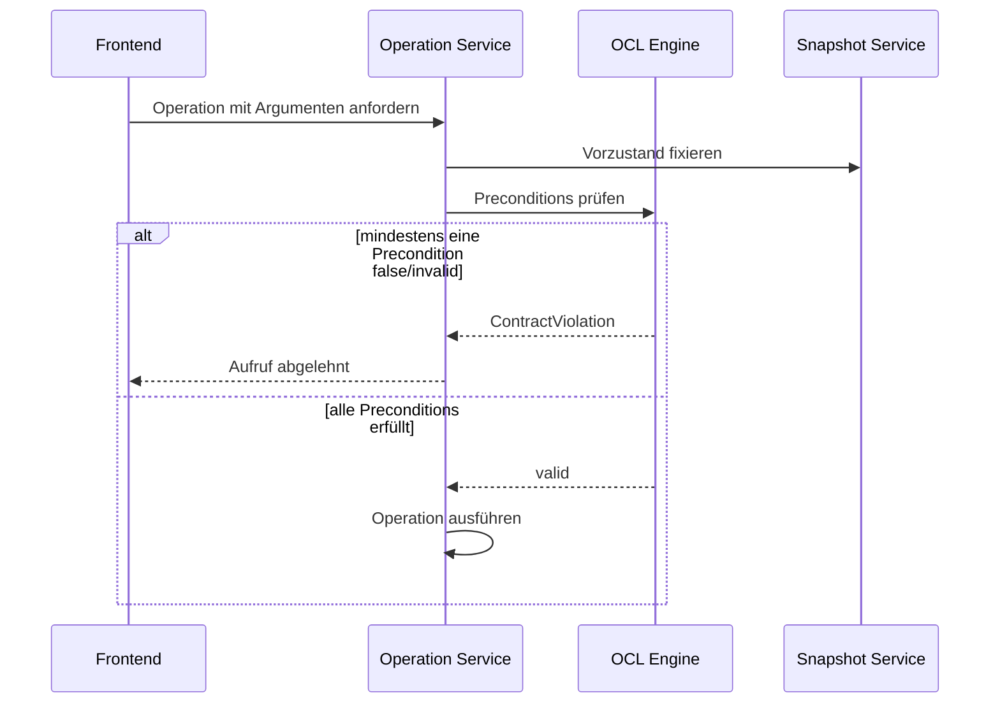
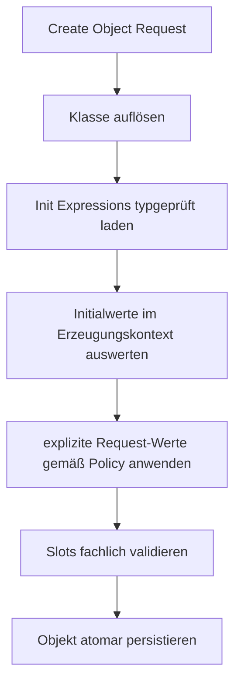

# Pre/Post, Derived Attributes and Init Values

## Zweck dieser Datei

Diese Datei analysiert OCL-Kontexte außerhalb von Klasseninvarianten:

- Preconditions (`pre`),
- Postconditions (`post`),
- Derived Attributes (`derive`),
- Init Values (`init`).

Ergänzend werden die standardrelevanten Kontexte Operation Body Expressions (`body`) und Definition Constraints (`def`) eingeordnet. Sie gehören zum OCL-Gesamtumfang, werden aber nicht automatisch mit den vier Schwerpunktfeatures umgesetzt.

Normative Grundlage ist **OMG OCL 2.4**. Das originale USE-Projekt und dessen Beispiele dienen ausschließlich als ergänzende Syntax-, Verhaltens- und Testfallreferenz. Der alte USE-Core wird weder eingebunden noch wird Implementierungscode übernommen.

## Warum diese Features Post-MVP sind

Der aktuelle MVP prüft Klasseninvarianten gegen einen einzelnen Snapshot. Die hier behandelten Kontexte benötigen zusätzliche fachliche Lebenszyklen:

| Kontext | Auslöser | benötigter Zustand | zusätzliche Bindungen |
|---|---|---|---|
| Invariante | `Check Constraints` | ein Snapshot | `self` |
| Precondition | vor einem Operationsaufruf | Vorzustand | `self`, Parameter |
| Postcondition | nach einem Operationsaufruf | Vor- und Nachzustand | `self`, Parameter, optional `result` |
| Derived Attribute | beim Lesen oder Validieren eines Properties | aktueller Snapshot | `self` |
| Init Value | beim Erzeugen eines Objekts | Erzeugungskontext | neues `self`, erlaubte Kontextwerte |

Pre-/Postconditions sind keine weiteren Invarianten. Ohne definierten Operationsaufruf, Parameterbindung und Zustandstransition können sie weder korrekt ausgelöst noch ausgewertet werden.

Derived und Init verändern außerdem die Semantik des UML-Attributmodells: Ein abgeleiteter Wert wird berechnet, ein Initialwert wird bei Objekterstellung angewendet. Beides darf nicht nur als uninterpretierter OCL-Text an ein bestehendes Attribut gehängt werden.

### Harte Voraussetzungen

Vor der Implementierung müssen mindestens vorhanden sein:

1. vollständige Operation Signatures mit stabilen Parameter-IDs, Reihenfolge und Rückgabetyp,
2. ein explizites Operation-Invocation-Modell,
3. unveränderliche Vor- und Nachzustände beziehungsweise Zustandspaare,
4. OCL-`null`/`invalid` und strukturierte Evaluation Errors,
5. lexikalische Scopes für Parameter, `result` und lokale Variablen,
6. Typkonformität einschließlich Generalisierung und Common Type,
7. definierte Objektidentität über zwei Snapshots,
8. zyklussichere Derived-Property-Auswertung,
9. ein Object-Creation-Workflow für Init Expressions,
10. versionierte DTOs und Projektformatfelder für neue Constraint-Arten.

## Preconditions

### Fachlicher Zweck

Eine Precondition beschreibt, welche Bedingung unmittelbar vor dem Aufruf einer Operation gelten muss.

```ocl
context User::borrow(book : Book) : Boolean
pre BookIsAvailable:
  book.available = true
```

### Operationskontext

Der Typechecker benötigt eine eindeutig aufgelöste Operation:

| Kontextbestandteil | Beispiel |
|---|---|
| Kontextklasse | `User` |
| Operation | `borrow` |
| Parameter | `book : Book` |
| Rückgabetyp | `Boolean` |
| Constraintname | `BookIsAvailable` |
| Expression | `book.available = true` |

Überladene Operationen müssen anhand der vollständigen Signatur identifiziert werden. Der Operationsname allein reicht nicht als stabile Referenz; im Projektformat und in DTOs wird eine `operationId` verwendet.

### Sichtbare Namen

Im Precondition-Body sind sichtbar:

- `self` als Empfängerobjekt im Vorzustand,
- alle Operationsparameter,
- später optional zusätzliche Kontextvariablen gemäß OCL 2.4.

`result` ist in einer Precondition nicht verfügbar. `@pre` ist dort nicht notwendig, weil die gesamte Auswertung bereits im Vorzustand erfolgt, und sollte außerhalb der normativ zulässigen Kontexte abgelehnt werden.

### Prüfung vor Ausführung



Eine Precondition darf nicht erst nach einer Zustandsänderung geprüft werden. Die Operation darf bei verletzter Precondition nicht ausgeführt werden, sofern der gewählte Invocation-Vertrag nichts anderes ausdrücklich definiert.

### Abhängigkeit von Operation Semantics

Operationen sind derzeit primär Signaturen. Für die Ausführung werden später mindestens eine der folgenden Semantiken benötigt:

- ein OCL Operation Body für side-effect-freie Query Operations,
- ein eigener Application Service beziehungsweise Command Handler,
- ein expliziter Simulations-/Transition-Request mit bereitgestelltem Nachzustand,
- perspektivisch ein separates Action-/Command-Modell.

OCL-Contracts führen nicht selbst Zustandsänderungen aus. Sie spezifizieren und prüfen Aufrufe.

## Postconditions

### Fachlicher Zweck und Syntax

Eine Postcondition beschreibt, was nach erfolgreicher Operation gelten muss.

```ocl
context User::borrow(book : Book) : Boolean
post BookIsLinked:
  self.borrowedBooks->includes(book)
```

### Sichtbare Namen

Im Postcondition-Kontext stehen zur Verfügung:

- `self` im Nachzustand,
- Parameterwerte des ursprünglichen Aufrufs,
- `result` bei Operationen mit Rückgabewert,
- Vorzustandswerte über `@pre`, soweit vom Compliance-Profil unterstützt.

```ocl
context User::borrow(book : Book) : Boolean
post CountIncreased:
  self.borrowedBooks->size() = self.borrowedBooks@pre->size() + 1

post SuccessfulResult:
  result = true
```

### `result`

`result` besitzt statisch den Rückgabetyp der Operation. Für eine Operation ohne Rückgabewert ist `result` unzulässig. Der Evaluator erhält den konkreten Rückgabewert als eigene Binding-Komponente und darf ihn nicht aus dem Nachzustand erraten.

### `@pre`

`@pre` liest den Wert einer Property beziehungsweise eines geeigneten Ausdrucks im Vorzustand. Es ist kein zweites `self`, sondern ein Zustandsselektor innerhalb eines Postcondition-Kontexts.

Erforderlich sind:

- stabile Objektidentität zwischen Vor- und Nachzustand,
- getrennte Snapshot-Referenzen im Evaluation Context,
- definierte Regeln für gelöschte oder neu erzeugte Objekte,
- Source Ranges für den `@pre`-Teil,
- OCL-konforme Begrenzung der syntaktisch zulässigen Anwendung.

### `oclIsNew()`

`oclIsNew()` gehört als angrenzendes Feature zum Postcondition-Umfang:

```ocl
post NewLoanCreated:
  result.oclIsNew()
```

Die Auswertung vergleicht Objektidentität zwischen Vor- und Nachzustand. OCL 2.4 weist Pre-Values und `oclIsNew()` als optionale Evaluation-Compliance-Points aus; ihre Unterstützung muss im Backendprofil ausdrücklich ausgewiesen werden.

### Auswertungszeitpunkt

Postconditions werden nur nach einer ausgeführten oder simulierten Operation ausgewertet. Scheitert die Operation technisch und existiert kein definierter Nachzustand, ist die Postcondition normalerweise nicht prüfbar; dies ist ein Invocation Error und keine gewöhnliche Contract Violation.

## Derived Attributes

### Fachlicher Zweck

Ein Derived Attribute wird aus anderen Modellwerten berechnet und nicht unabhängig gepflegt.

```ocl
context User::activeLoanCount : Integer
derive:
  self.borrowedBooks->select(book | not book.available)->size()
```

Alternativ kann die Ableitungsdefinition direkt als Metadatum des UML-Attributs gespeichert werden:

```json
{
  "id": "attribute-active-loan-count",
  "name": "activeLoanCount",
  "type": "Integer",
  "isDerived": true,
  "deriveExpression": "self.borrowedBooks->select(book | not book.available)->size()"
}
```

### Typechecker-Abgleich

| Regel | Erwartung |
|---|---|
| Kontext | Eigentümerklasse des Attributs |
| `self` | Instanz der Eigentümerklasse |
| Ausdruckstyp | muss dem deklarierten Attributtyp konform sein |
| Parameter | keine Operationsparameter |
| `result`/`@pre` | nicht verfügbar |

Eine Ableitung für `activeLoanCount : Integer`, die `String` liefert, ist ein strukturierter Typfehler am Attribut und am OCL-Ausdruck.

### Auswertungsmodell

**Empfehlung:** Derived Attributes besitzen keine autoritativen Snapshot-Slots. Der Wert wird beim Property Access gegen den aktuellen Snapshot berechnet. Dadurch gibt es keine widersprüchlichen gespeicherten und berechneten Werte.

Optionale Caches sind ausschließlich abgeleitete Laufzeitdaten und müssen an eine unveränderliche Snapshot-Version gebunden sein.

### Abhängigkeiten und Zyklen

Derived Properties können andere Derived Properties referenzieren:

```text
total -> subtotal -> tax
```

Der Typechecker beziehungsweise ein Modellvalidator benötigt einen Abhängigkeitsgraphen. Direkte und indirekte Zyklen müssen erkannt werden:

```text
a -> b -> c -> a
```

Je nach dynamischer Navigation kann zusätzlich ein Evaluations-Stack nötig sein, damit datenabhängige Rekursion kontrolliert als `DERIVATION_CYCLE` endet.

### UI-Darstellung

- Derived Attribute im Klassendiagramm eindeutig kennzeichnen, beispielsweise mit `/activeLoanCount : Integer`.
- `isDerived` und Expression im Properties Panel bearbeiten.
- berechneten Wert im Objektdiagramm readonly anzeigen.
- keinen normalen Slot-Editor für den Derived-Wert anbieten.
- Typ- oder Evaluationsfehler dem Attribut und der OCL-Position zuordnen.

## Init Values

### Fachlicher Zweck

Eine Init Expression definiert den anfänglichen Wert eines Attributs bei der Objekterzeugung.

```ocl
context Book::available : Boolean
init:
  true
```

```ocl
context User::books : Integer
init:
  0
```

### Typechecker-Regeln

| Regel | Erwartung |
|---|---|
| Kontext | Attribut und Eigentümerklasse |
| Ausdruckstyp | konform zum Attributtyp |
| Ergebnis | ein initialer Slot-Wert |
| `result`/`@pre` | nicht verfügbar |
| Seiteneffekte | nicht erlaubt |

Die zulässige Sichtbarkeit von `self`, anderen Attributen und Initialisierungsreihenfolgen muss vor Implementierung direkt gegen OCL 2.4 festgelegt werden. Ohne definierte Reihenfolge dürfen Init Expressions nicht still voneinander abhängig gemacht werden.

### Anwendung bei Objekterstellung



Der Object Model Service benötigt eine verbindliche Überschreibungsregel:

| Policy | Verhalten |
|---|---|
| Default-Wert | Init gilt nur, wenn kein expliziter Wert übergeben wurde |
| Zwingende Initialisierung | explizite Abweichung wird abgelehnt |
| UI-Vorbelegung | Frontend zeigt Init-Wert, Backend wertet ihn trotzdem autoritativ aus |

**Empfehlung:** Init ist ein serverseitig ausgewerteter Default. Ein expliziter, typgültiger Request-Wert darf ihn überschreiben, sofern das Attribut nicht readonly ist. Diese Produktentscheidung ist im API-Vertrag festzuhalten.

Die Erstellung muss atomar sein: Scheitert eine Init Expression, darf kein teilweise initialisiertes Objekt gespeichert werden.

### UI-/Backend-Auswirkung

- `initExpression` im Attribute Properties Panel bearbeiten.
- beim Add Object Modal mögliche Initialwerte als Vorschau anzeigen.
- Backend bleibt fachliche Quelle und wertet Init beim Erstellen erneut aus.
- Derived Attributes erhalten keinen Init Value.
- Fehler referenzieren Klasse, Attribut, Objektentwurf und Source Range.

## Weitere OCL-Kontexte des Standards

### Operation Body Expressions

```ocl
context User::canBorrow() : Boolean
body:
  self.books < 5
```

Ein `body` definiert das Ergebnis einer side-effect-freien Query Operation. Der Body-Typ muss zum Rückgabetyp passen. Nicht-Query-Operationen mit Zustandsänderungen benötigen ein anderes Ausführungsmodell; ein OCL-Ausdruck allein ist dafür nicht ausreichend.

### Definition Constraints (`def`)

`def` kann zusätzliche, im OCL-Kontext verwendbare Properties oder Operationen definieren. Dafür wären Symboltabellen, Signaturauflösung, Rekursionsregeln und Persistenz notwendig. `def` wird als eigener späterer Ausbau geplant und nicht implizit über Derived Attributes simuliert.

### Abgrenzung

| Kontext | Teil dieser Vertiefung | spätere eigene Analyse sinnvoll |
|---|---|---|
| `pre`, `post`, `derive`, `init` | ja | Implementierungsplan je vertikalem Flow |
| `body` | Einordnung | ja, Operation Execution |
| `def` | Einordnung | ja, benutzerdefinierte OCL-Features |
| State-/Transition Guards | nein | erst mit State Machines |
| SOIL/Action Language | nein | separates Verhaltensmodell |

## Auswirkungen auf UML-Operationen

Das Operationsmodell muss von einer Signatur zu einem referenzierbaren Contract-Träger erweitert werden:

```text
UmlOperation
|- id
|- name
|- parameters[]
|- returnType
|- isQuery
|- preconditions[]
|- postconditions[]
`- bodyExpression?
```

Ein Contract benötigt mindestens:

| Feld | Zweck |
|---|---|
| `id` | stabiles UI-/Fehlermapping |
| `name` | fachlich lesbarer Name |
| `kind` | `PRE` oder `POST` |
| `operationId` | eindeutiger Kontext |
| `expression` | OCL-Text |
| `enabled` | kontrollierte Aktivierung |
| `sourceLocation` | bei importiertem Modelltext |

Operationen brauchen außerdem eine definierte Invocation Semantics. Contract-Verwaltung ohne möglichen Aufruf ist syntaktisch speicherbar, aber nicht vollständig evaluierbar.

## Auswirkungen auf Snapshots

### Zustandspaar

```text
OperationEvaluationContext
|- preSnapshot
|- postSnapshot
|- receiverObjectId
|- operationId
|- arguments
`- resultValue?
```

Vor- und Nachzustand müssen:

- zum selben Projekt und UML-Modellstand gehören,
- unveränderlich sein,
- stabile Objektidentitäten verwenden,
- eine definierte Versions- oder Transition-ID besitzen,
- gemeinsam atomar an die Contract Evaluation übergeben werden.

### Erzeugte und gelöschte Objekte

| Fall | erforderliche Semantik |
|---|---|
| Objekt nur im Nachzustand | potenziell neu; relevant für `oclIsNew()` |
| Objekt nur im Vorzustand | gelöscht; Navigation im Nachzustand definieren |
| Objekt in beiden Zuständen | Propertywerte zustandsabhängig auflösen |
| Link geändert | `@pre` muss alte Linkmenge liefern |

Ein normaler Projekt-Snapshot ist nicht automatisch ein Operationsnachzustand. Die Beziehung zwischen zwei Snapshots muss explizit als Invocation/Transition dokumentiert sein.

## Auswirkungen auf ObjectModel

| Änderung | Begründung |
|---|---|
| `CreateObjectCommand` mit Init-Auswertung | atomare Initialisierung |
| Property Resolver für Derived Attributes | berechnete statt gespeicherte Werte |
| Snapshot-Version | Cache- und Zustandspaar-Konsistenz |
| Transition/Invocation Record | Vor-/Nachzustand und Argumente verbinden |
| readonly/derived Slot-Regeln | unzulässige Writes verhindern |
| Dependency Graph | Derived-Zyklen erkennen |

Normale Slotwerte, Derived-Werte und Init-Definitionen müssen getrennt bleiben:

- Slotwert: konkreter Zustand eines Objekts,
- Derive Expression: Definition im UML-Modell,
- Init Expression: Erzeugungsregel im UML-Modell.

## Parser-Auswirkungen

Die OCL-Komponente muss zwei Ebenen unterscheiden:

1. OCL Expressions innerhalb eines bekannten Kontext-DTOs,
2. vollständige OCL-/USE-artige Constraint-Deklarationen im Modelltext.

```ebnf
operationConstraint
  ::= operationContext (preConstraint | postConstraint)+

preConstraint
  ::= "pre" IDENTIFIER? ":" expression

postConstraint
  ::= "post" IDENTIFIER? ":" expression

propertyConstraint
  ::= propertyContext (deriveConstraint | initConstraint)
```

Zusätzlich erforderlich:

- `@pre` als eigener syntaktischer Bestandteil,
- reservierte Variable `result` mit kontextabhängiger Zulässigkeit,
- `body`, `derive`, `init` und `def` als Kontextarten,
- Parser Recovery über mehrere Constraints hinweg,
- Source Ranges für Kontext, Namen und Expression.

Der Expression Parser allein darf keine Operation oder Property anhand von Textfragmenten erraten. Kontextauflösung gehört in Modellparser/Import Service und Typechecker.

## AST-Auswirkungen

### Constraint-Modell

```text
OclConstraint
|- id
|- name?
|- kind: INV | PRE | POST | DERIVE | INIT | BODY | DEF
|- contextReference
`- expression
```

### Expression-Knoten

| Knoten | Zweck |
|---|---|
| `VariableExpression(result)` | Rückgabewert im Post-Kontext |
| `PreStateExpression` | markiert zustandsbezogenen Zugriff über `@pre` |
| vorhandene Expressions | Parameter, `self`, Navigation und Iteratoren weiterverwenden |

`derive` und `init` benötigen primär neue Constraint-Kontexte, nicht zwingend eigene Ausdrucksknoten. Ihr Body bleibt ein normaler OCL-Ausdruck.

## Typechecker-Regeln

### Kontextmatrix

| Name/Feature | `pre` | `post` | `derive` | `init` | `body` |
|---|---:|---:|---:|---:|---:|
| `self` | ja | ja | ja | gemäß Init-Profil | ja |
| Operationsparameter | ja | ja | nein | nein | ja |
| `result` | nein | bei Rückgabetyp | nein | nein | als Body-Ergebnis nicht als Binding nötig |
| `@pre` | nein | ja, wenn Compliance aktiviert | nein | nein | nein |
| erwarteter Ausdruckstyp | `Boolean` | `Boolean` | Attributtyp | Attributtyp | Rückgabetyp |

Zusätzliche Regeln:

1. Kontextreferenzen über stabile IDs auflösen.
2. Parameterbindungen anhand der Operationssignatur erzeugen.
3. `result` nur bei nicht-void Rückgabetyp binden.
4. `@pre` nur in Postconditions und normativ zulässiger Form akzeptieren.
5. Derived-/Init-Ausdruck zum Attributtyp prüfen.
6. Derived-Abhängigkeiten auf statische Zyklen prüfen.
7. `init` für Derived Attributes verbieten.

## Evaluator-Regeln

### Spezialisierte Kontexte

```text
InvariantContext(self, snapshot)
PreconditionContext(self, arguments, preSnapshot)
PostconditionContext(self, arguments, result, preSnapshot, postSnapshot)
DerivedContext(self, currentSnapshot, derivationStack)
InitContext(newObject, creationState)
```

Ein übergroßer Context mit nullable Feldern ist fehleranfällig. Empfohlen sind klar typisierte Varianten oder ein versiegeltes Context-Modell.

### Zustandsauswahl

| Ausdruck | Snapshot |
|---|---|
| normaler Zugriff in `pre` | Vorzustand |
| normaler Zugriff in `post` | Nachzustand |
| Zugriff mit `@pre` in `post` | Vorzustand |
| Derived Property | aktueller Snapshot |
| Init Expression | definierter Erzeugungskontext |

Der Property Resolver muss Derived Attributes transparent berechnen können, aber Zyklen und Evaluationsbudgets kontrollieren.

## API-Auswirkungen

### Contract-Verwaltung

Mögliche Ressourcen:

```http
POST /api/v1/projects/{projectId}/operations/{operationId}/contracts
PUT /api/v1/projects/{projectId}/operations/{operationId}/contracts/{contractId}
DELETE /api/v1/projects/{projectId}/operations/{operationId}/contracts/{contractId}
```

### Contract Evaluation

```http
POST /api/v1/projects/{projectId}/operations/{operationId}/evaluate-contracts
Content-Type: application/json
```

```json
{
  "receiverObjectId": "user-alice",
  "arguments": {
    "parameter-book": { "kind": "OBJECT", "objectId": "book-moby-dick" }
  },
  "preSnapshotId": "snapshot-before",
  "postSnapshotId": "snapshot-after",
  "result": { "kind": "BOOLEAN", "value": true }
}
```

Preconditions können vor Ausführung in einem Invocation Endpoint geprüft werden. Postconditions benötigen entweder einen serverseitig erzeugten Nachzustand oder ein explizit geliefertes, validiertes Zustandspaar.

### Attribute DTOs

```json
{
  "id": "attribute-available",
  "name": "available",
  "type": "Boolean",
  "isDerived": false,
  "deriveExpression": null,
  "initExpression": "true"
}
```

Die API muss verhindern, dass `isDerived = true`, `deriveExpression = null` und zugleich ein schreibbarer Snapshot-Slot als widersprüchlicher Zustand entstehen.

## Frontend-Auswirkungen

### Operations-UI

- Operation Properties um Contracts erweitern.
- getrennte Bereiche für Preconditions, Postconditions und optional Body.
- Parameter und Rückgabetyp im OCL Editor als sichtbaren Kontext anzeigen.
- Contract erstellen, bearbeiten, löschen, aktivieren und typprüfen.
- Operation Invocation/Simulation als eigener späterer Workflow.

### Attribute-UI

| Property | UI-Verhalten |
|---|---|
| normales Attribut | Slotwerte editierbar |
| Derived Attribute | `/name : Type`, Expression editierbar, Objektwert readonly |
| Attribut mit Init | Init Expression editierbar, bei Add Object als Default sichtbar |

### Validation Results

Neue Elementtypen und Meldungen werden benötigt:

- `OPERATION_CONTRACT`,
- `DERIVED_ATTRIBUTE`,
- `INIT_EXPRESSION`,
- Mapping auf `operationId`, `contractId`, `attributeId`, Invocation und Objekt,
- verständliche Vor-/Nachzustandsanzeige ohne rohe ID-Überladung.

Der normale `Check Constraints`-Button kann weiterhin Invarianten und gegebenenfalls Derived-Werte prüfen. Pre-/Postconditions brauchen einen separaten Aufrufkontext und dürfen nicht ohne Invocation pauschal als Fehler erscheinen.

## Testfälle

### Contracts

| ID | Ebene | Szenario | Erwartung |
|---|---|---|---|
| `OCL-PRE-001` | Typechecker | Parameter in Precondition | korrekt aufgelöst |
| `OCL-PRE-002` | Typechecker | `result` in Precondition | Kontextfehler |
| `OCL-PRE-003` | Evaluator | Precondition `false` | Aufruf wird abgelehnt |
| `OCL-POST-001` | Typechecker | `result` passend zum Rückgabetyp | gültig |
| `OCL-POST-002` | Typechecker | `result` bei void Operation | Kontextfehler |
| `OCL-POST-003` | Evaluator | Nachzustand erfüllt Postcondition | gültig |
| `OCL-POST-004` | Evaluator | `@pre` liest alten Slotwert | korrekter Vorzustandswert |
| `OCL-POST-005` | Evaluator | geänderter Link mit `@pre` | alte Linkmenge |
| `OCL-POST-006` | Evaluator | kein Nachzustand verfügbar | strukturierter Invocation Error |
| `OCL-POST-007` | Evaluator | `oclIsNew()` für neues Objekt | `true` |

### Derived und Init

| ID | Ebene | Szenario | Erwartung |
|---|---|---|---|
| `OCL-DER-001` | Typechecker | Derive-Ausdruck liefert Attributtyp | gültig |
| `OCL-DER-002` | Typechecker | falscher Ergebnistyp | `DERIVED_TYPE_MISMATCH` |
| `OCL-DER-003` | Evaluator | Derived-Wert über Links | korrekt berechnet |
| `OCL-DER-004` | Modellvalidator | direkter Zyklus | `DERIVATION_CYCLE` |
| `OCL-DER-005` | Evaluator | indirekter dynamischer Zyklus | kontrollierter Fehler |
| `OCL-DER-006` | Object Service | Write auf Derived Slot | abgelehnt |
| `OCL-INIT-001` | Typechecker | `true` für Boolean-Attribut | gültig |
| `OCL-INIT-002` | Typechecker | falscher Init-Typ | `INIT_TYPE_MISMATCH` |
| `OCL-INIT-003` | Object Service | Objekt ohne expliziten Wert | Init wird angewendet |
| `OCL-INIT-004` | Object Service | expliziter Wert | Verhalten gemäß Override-Policy |
| `OCL-INIT-005` | Object Service | Init Evaluation Error | keine Teilpersistenz |

### Integration

| ID | Szenario | Erwartung |
|---|---|---|
| `OCL-CONTRACT-API-001` | Contract speichern und typprüfen | stabile IDs und Diagnosen |
| `OCL-CONTRACT-E2E-001` | Operation mit gültigem Vor-/Nachzustand | alle Contracts erfüllt |
| `OCL-CONTRACT-E2E-002` | verletzte Postcondition | Mapping auf Operation, Contract und Receiver |
| `OCL-DER-E2E-001` | Derived-Wert im Objektdiagramm | readonly und snapshotkonsistent |
| `OCL-INIT-E2E-001` | Objekt über UI erstellen | Backend-Init erscheint als Slotwert |

## Abhängigkeiten

| Voraussetzung | Pre | Post | Derived | Init |
|---|---:|---:|---:|---:|
| stabile Operation-/Parameter-IDs | ja | ja | nein | nein |
| Operation Invocation | ja | ja | nein | nein |
| Vorzustand | ja | ja | nein | Erzeugungskontext |
| Nachzustand | nein | ja | nein | erzeugter Zustand |
| `result`-Binding | nein | ja | nein | nein |
| `@pre` | nein | ja | nein | nein |
| Property Dependency Graph | nein | nein | ja | optional |
| Object Creation Pipeline | nein | nein | nein | ja |
| OCL Scope und Type System | ja | ja | ja | ja |
| Source Locations/Error Mapping | ja | ja | ja | ja |

## Umsetzungsempfehlung

Die Features sollten nicht als ein großer Schritt umgesetzt werden:

1. **Property-Definitionen vorbereiten:** DTOs und Projektformat für `derive`/`init`, zunächst nur speichern und typprüfen.
2. **Derived Attributes vertikal umsetzen:** Property Resolver, Zykluserkennung, readonly UI und Validation.
3. **Init Values vertikal umsetzen:** atomare Objekterstellung und serverseitige Defaults.
4. **Operation Context einführen:** Parameter-/Rückgabetypbindung und Contract-Domänenmodell.
5. **Preconditions umsetzen:** Prüfung im unveränderten Vorzustand.
6. **Operation Invocation etablieren:** definierte Ausführung oder Simulation.
7. **Postconditions ohne `@pre` umsetzen:** Nachzustand und `result`.
8. **Zwei-Snapshot-Semantik ergänzen:** `@pre`, Objektidentität und optional `oclIsNew()`.
9. **Operation Bodies und `def` separat planen.**

Diese Reihenfolge reduziert das Risiko, Contracts zu speichern, die mangels Operationssemantik niemals korrekt ausgewertet werden können.

## Bezug zum originalen USE-Projekt

Ergänzende Referenzen aus der bestehenden Analyse:

| Pfad/Klasse | Nutzungskategorie |
|---|---|
| `use/use-core/src/main/java/org/tzi/use/uml/mm/MPrePostCondition.java` | fachliche und Verhaltenreferenz |
| `use/use-core/src/main/resources/examples/Others/DerivedProperties/derived.use` | Syntax- und Testfallquelle für Derived Properties |
| `use/use-core/src/main/resources/examples/Documentation/Employee/Employee.use` | Contract- und Operationsbeispiele prüfen |
| `.cmd`-Dateien in den Examples | mögliche Vor-/Nachzustands-Fixtures, nicht als neue Runtime übernehmen |

Vor jeder Übernahme eines Ausdrucks als Regressionstest ist zu prüfen, ob er standardisiertes OCL 2.4 oder eine USE-spezifische Erweiterung verwendet.

## Risiken

| Risiko | Auswirkung | Gegenmaßnahme |
|---|---|---|
| Contracts werden wie Invarianten behandelt | falscher Trigger und fehlende Parameter | eigener Invocation Flow |
| Vor-/Nachzustand ist mutabel | `@pre` liefert inkonsistente Werte | immutable Snapshot-Paare |
| Objektidentität wechselt zwischen Zuständen | `@pre`/`oclIsNew()` falsch | stabile IDs und Transition-Vertrag |
| Derived-Wert wird zusätzlich gespeichert | widersprüchliche Wahrheit | berechnen statt autoritativ persistieren |
| Derived-Zyklus | Stack Overflow oder Timeout | statischer Graph und Runtime Guard |
| Init nur im Frontend angewendet | API-erzeugte Objekte sind inkonsistent | Backend autoritativ auswerten |
| Init-Reihenfolge ist implizit | nichtdeterministische Werte | normative Sichtbarkeitsregel festlegen |
| Postcondition nach technischem Fehler geprüft | irreführende Contract Violation | Invocation und Contract Errors trennen |
| USE-Syntax wird als Standard behandelt | unbeabsichtigter Dialekt | OCL 2.4 normativ halten |

## Offene Fragen

| Frage | Auswirkung |
|---|---|
| Wie werden Operationen ausgeführt oder simuliert? | Grundlage aller Contracts |
| Werden Vor-/Nachzustände persistiert oder request-lokal erzeugt? | API, Speicher und Debugging |
| Welche `@pre`-Formen unterstützt das Compliance-Profil? | Parser und Evaluator |
| Werden `@pre` und `oclIsNew()` als optionale Compliance Points aktiviert? | Produktumfang |
| Wie werden gelöschte Objekte in Postconditions behandelt? | Objektidentität und Navigation |
| Sind Derived Attributes ausschließlich berechnet? | Slotmodell und UI |
| Welche Cache-Strategie gilt für Derived-Werte? | Performance und Invalidierung |
| Welche Namen sind während einer Init Expression sichtbar? | Scope und Initialisierungsreihenfolge |
| Darf ein expliziter Create-Request einen Init-Wert überschreiben? | Object API |
| Werden `body` und `def` in getrennten Erweiterungsphasen geplant? | Roadmap |

## Zusammenfassung

Preconditions, Postconditions, Derived Attributes und Init Values sind neue OCL-Kontexte mit eigenen Lebenszyklen. Preconditions benötigen einen Operationsaufruf und den Vorzustand. Postconditions benötigen zusätzlich Rückgabewert, Nachzustand und für `@pre` ein stabiles Zustandspaar. Derived Attributes verändern die Property-Auflösung und müssen zyklussicher, readonly und snapshotabhängig berechnet werden. Init Values gehören in die atomare, serverseitige Objekterstellung.

Diese Features sind deshalb klar Post-MVP. Ihre Umsetzung beginnt nicht beim Parser, sondern bei fehlenden Domänenkonzepten: Operation Invocation, Snapshot-Paare, Objektidentität, Property Definition und Object Creation. Erst darauf werden Parser, AST, Typechecker, Evaluator, API und UI vertikal erweitert.

Operation Body Expressions und Definition Constraints gehören ebenfalls zum OCL-2.4-Gesamtumfang, sollten aber als eigene spätere Erweiterungen geplant werden. OCL 2.4 bleibt normativ; das originale USE-Projekt liefert nur ergänzende Beispiele und Verhaltenserwartungen.
