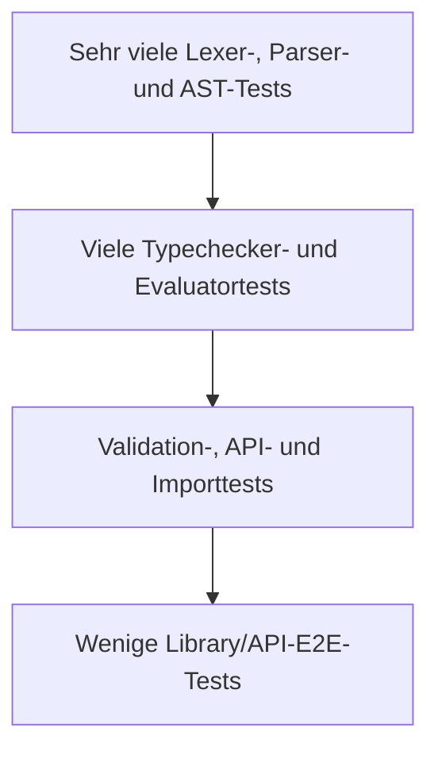

# OCL Test Strategy

## Zweck dieser Datei

Diese Datei definiert die Teststrategie für die schrittweise erweiterte OCL-Unterstützung des neuen Java-/Spring-Boot-Backends. Sie deckt Lexer, Parser, AST, Typechecker, Evaluator, Validation Service, REST API, Error Mapping und End-to-End-Szenarien ab.

Das originale USE-Projekt wird als umfangreicher **fachlicher Referenzkorpus und als Grundlage einer separat ausführbaren Original-USE-Referenztestsuite** genutzt. Seine Testdateien dürfen im gegebenen Universitätskontext kopiert und analysiert werden. Alle OCL-relevanten und technisch extrahierbaren Testfälle sollen langfristig ausführbar gemacht werden, auch wenn sie im neuen Backend zunächst fehlschlagen.

Die Dateien werden dennoch nicht blind in die normale Regression oder normale CI übernommen:

- Das neue Backend besitzt eine andere Architektur und API.
- USE-Shell-Kommandos sind kein REST-Vertrag.
- USE-Ausgabeformat und Reihenfolge sind nicht normativ für OCL.
- Ein Teil des Korpus testet USE-spezifische, noch nicht implementierte oder nicht geplante Features.
- Fachliche Erwartungen sind zuerst gegen OMG OCL 2.4 zu prüfen.

Fehlschläge in der Reference-Test-Suite sind ausdrücklich erwünscht. Sie machen fehlende Parserregeln, Typregeln, Evaluatorsemantik, Modellunterstützung und Testinfrastruktur messbar. Sie blockieren weder normale MVP-Tests noch die normale CI.

Normative Quelle für OCL-Syntax und -Semantik bleibt **OMG OCL 2.4**. USE liefert zusätzliche Regressionserwartungen und realistische Modellkontexte.

## Testprinzipien

| Prinzip | Konsequenz |
|---|---|
| Spezifikation vor Implementierung | OCL-2.4-Regeln bestimmen erwartete Semantik. |
| Kleine Tests vor E2E | Lexer, Parser, Typregeln und Werte isoliert absichern. |
| Positive und negative Fälle | Jedes Feature erhält gültige, ungültige und Grenzfälle. |
| Struktur statt Textsnapshot | Werte, Typen, Codes und Ranges assertieren, nicht komplette Shell-Zeilen. |
| Phasentrennung | Parsefehler dürfen nicht als Type- oder Evaluation Errors erscheinen. |
| Referenzkorpus vollständig übernehmen | Die beiden festgelegten Originalkorpora werden vollständig inventarisiert und mit Provenienz abgelegt. |
| OCL-Fälle ausführbar machen | Alle OCL-relevanten und technisch extrahierbaren Fälle erhalten einen eigenen Reference-Test, auch wenn er fehlschlägt. |
| Fehlschläge sichtbar halten | Fehlende Features werden als Gap klassifiziert und nicht durch `@Disabled` verborgen. |
| CI trennen | Reference Tests laufen in eigenem Task/Profile und blockieren die normale CI nicht. |
| Keine alte Runtime | Tests starten weder USE-Core noch USE-GUI als Dependency. |
| Stabile Fixtures | Kleine, fachlich benannte Modelle statt unnötig großer Beispiele. |
| Determinismus | Ungeordnete Collections semantisch statt nach zufälliger Reihenfolge vergleichen. |
| Source Locations prüfen | Fehlercode und kleinster ursächlicher Range gehören zusammen. |
| Differentialbefunde prüfen | Abweichung von USE ist nicht automatisch ein Fehler des neuen Backends. |
| Feature Gates | Tests für noch nicht implementierte Features sind katalogisiert, nicht dauerhaft rot. |

## Statusmodell für Referenztests

Jeder inventarisierte Fall besitzt genau einen aktuellen Ausführungsstatus. Der Status beschreibt den beobachteten Zustand der Referenzadaption und ist kein Ersatz für Feature-, Standard- oder Herkunftsmetadaten.

| Status | Bedeutung | ausführbar |
|---|---|---:|
| `PASSING` | Der Referenztest läuft im neuen Backend erfolgreich. | ja |
| `FAILING_GAP` | Der Test ist ausführbar, scheitert aber an einem fehlenden OCL-/UML-Feature oder abweichender Semantik. | ja |
| `FAILING_FORMAT` | Die fachliche Erwartung ist klar, aber die alte Shell-Ausgabe ist noch nicht vollständig in strukturierte Assertions übersetzt. | möglichst teilweise |
| `FAILING_INFRASTRUCTURE` | Der Fall ist relevant, aber Harness, Modellsetup, Importmechanik oder Evaluation Context fehlt noch. | Harness meldet klassifizierten Fehler |
| `NON_OCL_OR_SHELL_ONLY` | Der Fall ist ausschließlich Shell-, GUI-, Generator- oder Altsystemverhalten und für die neue OCL-Engine nicht relevant. | nein |
| `UNCLEAR` | Fachliche Bedeutung, Standardstatus oder Extraktion muss manuell geprüft werden. | optionaler Discovery-Test |

`PASSING` ist kein manuell gesetztes Wunschlabel, sondern das Ergebnis eines erfolgreichen Laufs. Ebenso muss ein Wechsel zu `FAILING_GAP`, `FAILING_FORMAT` oder `FAILING_INFRASTRUCTURE` im Report durch die beobachtete Ursache begründet sein.

## Relevante originale USE-Testbasis

### Übersicht

| Korpus | Pfad | Schwerpunkt | Hauptnutzung |
|---|---|---|---|
| Parser-Testbasis | `use/use-core/src/test/resources/org/tzi/use/parser` | `.use`, `.fail`, Imports und einzelne Expression Inputs | Modellparser, negative Modellfälle, Source Locations |
| Shell-Testbasis | `use/use-gui/src/it/resources/testfiles/shell` | `.in` plus `.use`, außerdem `.cmd`, `.assl`, Layout- und Importdateien | OCL-Auswertung, Typen, Snapshotnavigation, Shellabläufe |
| Java-Tests des USE-Cores | beispielsweise `use/use-core/src/test/java/org/tzi/use/uml/ocl/expr` | programmatische Expression-/Querytests | fachliche Testfallquelle |
| USE Examples | `use/use-core/src/main/resources/examples` | realistische Modelle und Szenarien | Regression Fixtures und E2E-Kandidaten |

Der Referenzkorpus wird mit Herkunftspfad, Lizenz-/Nutzungshinweis, Klassifikation, benötigten Features und Adaptionsstatus inventarisiert.

## Parser-Testbasis im originalen USE-Projekt

Pfad:

```text
use/use-core/src/test/resources/org/tzi/use/parser
```

Festgestellte Inhalte umfassen unter anderem:

- `t1.use` und `t1.fail` für doppelte Klassendeklarationen,
- `t20a.use` und `t20a.fail` für konfligierende Association Roles mit Generalisierung,
- `t29_imports.use` bis `t37_imports.use` sowie `imports/` für Importfälle,
- `test_spec.use` als größeres Syntaxmodell,
- `test_expr.in` für Ausdruckseingaben,
- zahlreiche paarige `.use`-/`.fail`-Fälle.

### Nutzbarkeit

| Testart | Übertragbarkeit | Vorgehen |
|---|---|---|
| Klassen, Attribute, binäre Associations | häufig direkt adaptierbar | auf neues Modellparserprofil reduzieren |
| ungültige Namen/Duplikate | fachlich direkt adaptierbar | neuen Fehlercode und Range assertieren |
| OCL-Invarianten | featureabhängig adaptierbar | Expression separat durch OCL-Pipeline testen |
| Imports | Post-MVP/Import-Service | relative Pfade und Sandboxregeln neu definieren |
| Generalisierung | OCL-relevant, aber UML-Feature fehlt | ausführbar machen und als `FAILING_GAP` berichten |
| Association Classes/n-äre Associations | OCL-relevant, aber Modellsetup fehlt | zunächst `FAILING_INFRASTRUCTURE` oder bei ausführbarem Setup `FAILING_GAP` |
| exakter `.fail`-Meldungstext | nicht direkt | Ursache, Code und Position extrahieren |

`.fail` ist kein alternativer Quelltext, sondern dokumentiert die erwartete Ablehnung beziehungsweise Fehlermeldung zum zugehörigen `.use`-Modell. Der Adapter muss Paarbildung und abweichende Dateinamen explizit behandeln.

## Shell-Testbasis im originalen USE-Projekt

Pfad:

```text
use/use-gui/src/it/resources/testfiles/shell
```

Der Korpus enthält weit über einfache OCL-Abfragen hinaus:

- `? expression` für OCL-Abfragen,
- `*...` für erwartete Shell-Ausgaben,
- `!create`, `!set`, `!insert` und weitere Zustandskommandos,
- zugehörige `.use`-Modelle,
- Imports und relative Pfade,
- `.cmd`-Szenarien,
- `.assl`-Generatorfälle,
- `.clt`/`.olt`-Layoutdaten,
- Shell- und GUI-nahe Kommandos.

Repräsentative Befunde:

| Datei | Beispiele | Relevanz |
|---|---|---|
| `t001.in` | Literale, Arithmetik, Boolean-Tabellen, Collections, Iteratoren, `let`, `iterate` | sehr hoher OCL-Referenzwert |
| `t002.in` + `t002.use` | `allInstances`, Generalisierung, Navigation, Typoperationen, Enums | featureabhängige Modell-/Snapshotfälle |
| `t003.in` + `t003.use` | Objekt-/Linkerzeugung und optionale Navigation | ObjectModel- und Navigationstests |

Beispiel aus dem Korpus:

```text
? Set{true,1,'foo',3.4}
*-> Set{'foo',1,3.4,true} : Set(OclAny)
```

Die fachliche Assertion lautet nicht „der Response-String muss exakt gleich sein“, sondern:

```text
result.kind == COLLECTION
result.collectionKind == SET
result.elementType == OclAny
result.elements semantisch gleich {'foo', 1, 3.4, true}
diagnostics leer
```

## Bedeutung der `.use`, `.fail` und `.in` Dateien

| Endung | Bedeutung im Original | Nutzung im neuen Backend |
|---|---|---|
| `.use` | USE-Modell mit UML/OCL-Deklarationen | Import-/Modellparserreferenz und Fixturequelle |
| `.fail` | erwartete Parser-/Compilerfehler | negative Referenz für Code, Phase und Source Range |
| `.in` | Shell-Eingaben plus mit `*` markierte Erwartungen | Szenarioreferenz und Quelle typisierter Assertions |
| `.cmd` | Objekt-/Link-/Operationskommandos | Snapshot-Fixture ableiten; nicht direkt ausführen |
| `.assl` | Generator-/ASSL-Szenarien | zunächst ausschließen |
| `.clt`, `.olt` | Diagrammlayouts | kein OCL-Test; allenfalls Frontend/Layoutreferenz |

Eine `.use`-Datei kann syntaktisch parsebar sein, aber Features enthalten, die das neue Domänenmodell nicht unterstützt. „Datei geladen“ und „alle Constraints ausführbar“ sind getrennte Testaussagen.

## Umgang mit `*`-Erwartungszeilen

### Extraktionsmodell

Ein **Referenzkorpus-Konverter** überführt `.in`-Dateien in ausführbare oder zumindest vom Harness klassifizierbare Referenzfälle:

```text
Shell-Datei lesen
-> Kommandoblöcke erkennen
-> ?-Expression erfassen
-> nachfolgende *-Zeilen sammeln
-> Erwartungsart klassifizieren
-> USE-spezifische Ausgabe parsen
-> neutrales Reference-Case-JSON erzeugen
-> Harness-Test generieren oder dynamisch laden
-> Ergebnis als PASSING/FAILING_* berichten
-> fachliche Interpretation parallel reviewen
```

Mehrzeilige Eingaben und Ausgaben müssen als Block behandelt werden. Nicht jede `*`-Zeile ist ein Wert: Sie kann Warning, Error, Statusmeldung oder Check-Ausgabe enthalten.

### Kandidatenformat

```json
{
  "id": "USE-SHELL-t001-collection-001",
  "source": "use/use-gui/src/it/resources/testfiles/shell/t001.in",
  "input": "Set{true,1,'foo',3.4}",
  "expected": {
    "outcome": "VALUE",
    "type": "Set(OclAny)",
    "value": {
      "collectionKind": "SET",
      "elements": [true, 1, "foo", 3.4]
    }
  },
  "requiredFeatures": ["COLLECTION_LITERAL", "OCL_ANY"],
  "status": "FAILING_GAP"
}
```

Der Konverter darf dynamische JUnit-Referenztests beziehungsweise neutrale Testfalldaten erzeugen. Diese Tests gehören ausschließlich zur getrennten Reference-Test-Suite. Ein fachlicher Review bestätigt Standardkonformität, Featurezuordnung und normalisierte Erwartung, ist aber keine Voraussetzung dafür, einen technisch extrahierbaren Fall erstmals auszuführen und als `UNCLEAR` oder `FAILING_*` sichtbar zu machen.

### Normalisierung

| USE-Ausgabeaspekt | Neue Assertion |
|---|---|
| Prefix `->` | ignorieren |
| `: Type` | strukturierten Result Type vergleichen |
| Set-Reihenfolge | elementweise, reihenfolgeunabhängig vergleichen |
| Bag | Multiset-Häufigkeiten vergleichen |
| Sequence | Reihenfolge und Duplikate vergleichen |
| OrderedSet | Reihenfolge vergleichen, Duplikate verbieten |
| Objektname | über Fixture-ID/Objektidentität auflösen |
| Realformat (`2.0`, Exponent) | numerischen Wert und Typ vergleichen |
| `null : OclVoid` | gegen gewähltes OCL-2.4-`null`-/`invalid`-Modell prüfen |
| Warning-/Error-Wortlaut | Code, Severity, Phase und Range vergleichen |
| Leerzeichen/Quotes | nicht als kompletter Snapshot vergleichen |

Wichtig: Ältere USE-Erwartungen zu `oclUndefined`, `OclVoid`, `invalid` oder Collectiontypen sind gegen OCL 2.4 zu verifizieren. Bei Konflikt gilt die Spezifikation; die Abweichung wird als Compatibility Finding dokumentiert.

## Referenzkorpus im neuen Backend

Empfohlene Struktur:

```text
use-web-backend/
`- src/test/resources/ocl-reference/
   |- manifest.yaml
   |- executable/
   |  |- expressions/
   |  |- models/
   |  `- snapshots/
   |- extracted/
   |- reports/
   `- licenses-and-provenance/
```

Die neue Grundstrategie übernimmt die beiden festgelegten Originalkorpora vollständig in einen versionierten Reference-Test-Bereich oder stellt sie dort reproduzierbar bereit. Sie liegen nicht im normalen Unit-Test-Classpath. Produktiver USE-Code, USE-Core und alte Test-Runner werden nicht übernommen; nur Testdaten und Provenienz werden kopiert beziehungsweise gespiegelt.

### Manifestfelder

| Feld | Zweck |
|---|---|
| `id` | stabile neue Testfall-ID |
| `sourcePath` | Herkunft im USE-Projekt |
| `sourceLines` | optionaler Ursprungsbereich |
| `category` | Parser, Typechecker, Evaluator usw. |
| `requiredFeatures` | Feature Gate |
| `standardStatus` | OCL 2.4, USE-Dialekt oder ungeklärt |
| `referenceStatus` | `PASSING`, `FAILING_GAP`, `FAILING_FORMAT`, `FAILING_INFRASTRUCTURE`, `NON_OCL_OR_SHELL_ONLY` oder `UNCLEAR` |
| `normalization` | Vergleichsregeln |
| `notes` | fachliche Abweichungen |

## Ausführbare Original-USE-Referenztestsuite

Die Reference-Test-Suite ist eine eigene ausführbare Testanwendung innerhalb des neuen Backends. Sie verwendet ausschließlich die neuen Lexer-, Parser-, Typechecker-, Evaluator-, Validation- und Service-APIs.

```text
Originaldateien
-> Inventory/Manifest
-> Extractor für .use/.fail/.in
-> neues Modell-/Snapshotsetup
-> neuer OCL-Test-Harness
-> strukturierte Assertion oder klassifizierter Fehlschlag
-> Reference-Test-Report
```

### Ausführbarkeitsregeln

1. Jede Datei der beiden Korpora erscheint im Inventar.
2. Jeder darin erkannte Testblock erhält eine stabile Reference-Test-ID.
3. OCL-relevante, technisch extrahierbare Blöcke werden als Testfälle ausgeführt.
4. Fehlende Spracheigenschaften ergeben `FAILING_GAP`.
5. Noch nicht übersetzbare Shell-Erwartungen ergeben `FAILING_FORMAT`.
6. Fehlendes Setup ergibt `FAILING_INFRASTRUCTURE`.
7. Nur eindeutig nicht OCL-relevante Fälle erhalten `NON_OCL_OR_SHELL_ONLY`.
8. Unklare Fälle bleiben als `UNCLEAR` im Report sichtbar und werden manuell triagiert.

Ein Reference-Test darf intern nicht bloß `assertTrue(true)` verwenden. Auch erwartete Gaps müssen Ausdruck, Setup, beobachtetes Ergebnis und erwartete fachliche Fähigkeit dokumentieren.

### Technische Organisation

```text
src/referenceTest/java/
|- UseParserReferenceTest
|- UseShellExpressionReferenceTest
|- UseShellScenarioReferenceTest
`- ReferenceCorpusInventoryTest

src/referenceTest/resources/
|- original-use/
|- manifest.yaml
`- normalized-cases/
```

Falls Maven statt eines eigenen Source Sets verwendet wird, können eigene Testklassen und JUnit Tags wie `@Tag("original-use-reference")` mit einem Maven-Profil kombiniert werden.

## Testpyramide für OCL



| Ebene | Anteil | Zweck |
|---|---:|---|
| Lexer/Parser/AST | hoch | Syntax, Präzedenz, Ranges, Recovery |
| Typechecker/Evaluator | sehr hoch | OCL-Semantik und Grenzfälle |
| Validation/Service | mittel | Kontext, Aggregation und Mapping |
| REST API | gezielt | DTO-/Statusvertrag |
| E2E | klein | vollständige vertikale Workflows |

## Lexer Tests

| ID | Fall | Erwartung |
|---|---|---|
| `OCL-LEX-001` | primitive Literale | korrekte Tokenarten und Werte |
| `OCL-LEX-002` | `->`, `.`, `|`, `@pre` | längste passende Tokens |
| `OCL-LEX-003` | String Escapes | OCL-konforme Dekodierung |
| `OCL-LEX-004` | nicht geschlossener String | `UNTERMINATED_STRING` mit Range |
| `OCL-LEX-005` | ungültiges Zeichen | Diagnose und Recovery |
| `OCL-LEX-006` | CRLF und Unicode | UTF-16-Positionen korrekt |
| `OCL-LEX-007` | Keywords als Identifierkontext | spezifikationskonforme Unterscheidung |

USE-Referenz: Literale und Escape-Fälle aus `t001.in` sind gute Kandidaten, müssen aber in isolierte Lexerfixtures zerlegt werden.

## Parser Tests

| ID | Fall | Erwartung |
|---|---|---|
| `OCL-PAR-001` | Operatorpräzedenz | korrekte AST-Struktur |
| `OCL-PAR-002` | Calls mit/ohne Klammern gemäß Profil | akzeptiert oder klarer Dialektfehler |
| `OCL-PAR-003` | Iteratorvariable und Body | `IteratorExpression` |
| `OCL-PAR-004` | verschachtelte Iteratoren | vollständiger rekursiver AST |
| `OCL-PAR-005` | `let` und `if` | korrekte Bindungsgrenzen |
| `OCL-PAR-006` | fehlendes `endif` | lokalisierter Syntaxfehler |
| `OCL-PAR-007` | mehrere unabhängige Fehler | begrenzte Recoverydiagnosen |
| `OCL-PAR-008` | vollständige Constraint-Deklaration | Kontext und Expression getrennt |

Die `.use`-/`.fail`-Basis testet teilweise den vollständigen USE-Modellparser, nicht nur OCL. Solche Fälle gehören in Import-/ModelText-Tests und nicht in den Expression Parser.

## AST Tests

AST-Tests prüfen Struktur statt konkrete Java-`toString()`-Ausgabe.

| ID | Ausdruck | Assertion |
|---|---|---|
| `OCL-AST-001` | `self.books <= 5` | Binary, Property Access, Literal |
| `OCL-AST-002` | `a or b and c` | `and` bindet stärker |
| `OCL-AST-003` | `books->forAll(b | b.available)` | Source, Deklaration, Body |
| `OCL-AST-004` | verschachteltes `let` | getrennte Scopes |
| `OCL-AST-005` | `if ... endif` | Condition und beide Branches |
| `OCL-AST-006` | mehrzeiliger Ausdruck | Gesamt- und Teilranges |

## Typechecker Tests

Jede Regel erhält positive und negative Parameterized Tests.

| ID | Fall | Erwartung |
|---|---|---|
| `OCL-TYP-001` | `self.books <= 5` | `Boolean` |
| `OCL-TYP-002` | `self.name <= 5` | Operatorfehler mit Operandtypen |
| `OCL-TYP-003` | unbekanntes Property | `UNKNOWN_ATTRIBUTE`/Role-Code |
| `OCL-TYP-004` | Collection Operation | Source-, Argument- und Ergebnistyp |
| `OCL-TYP-005` | `forAll` mit String-Body | `INVALID_ITERATOR_BODY_TYPE` |
| `OCL-TYP-006` | Iterator Shadowing | lexikalische Auflösung |
| `OCL-TYP-007` | `if` mit Integer/Real | Common Type `Real` |
| `OCL-TYP-008` | `let` mit Annotation | Konformität und Bodytyp |
| `OCL-TYP-009` | `Book.allInstances()` | `Set(Book)` |
| `OCL-TYP-010` | Constraint nicht Boolean | `CONSTRAINT_NOT_BOOLEAN` |

USE-Shell-Erwartungen mit `: Type` liefern viele Typkandidaten. Der USE-String wird in das neue `OclType`-Modell übersetzt und nicht textuell verglichen.

## Evaluator Tests

| ID | Fall | Erwartung |
|---|---|---|
| `OCL-EVA-001` | primitive Operatoren | strukturierter Wert und Typ |
| `OCL-EVA-002` | Boolean plus `null`/`invalid` | OCL-2.4-Wahrheitstabellen |
| `OCL-EVA-003` | Set/Bag/Sequence/OrderedSet | Ordnung und Duplikate korrekt |
| `OCL-EVA-004` | Navigation ohne Ziel | profilkonformer Wert/Finding |
| `OCL-EVA-005` | `forAll`/`exists` leer | `true`/`false` |
| `OCL-EVA-006` | `select`/`reject` | Collectionart erhalten |
| `OCL-EVA-007` | `collect` | Collectionart und Flattening |
| `OCL-EVA-008` | `let` | Initializer einmal auswerten |
| `OCL-EVA-009` | `if` | nicht gewählten Branch nicht auswerten |
| `OCL-EVA-010` | `allInstances` | projektgebundener Snapshot |
| `OCL-EVA-011` | Iterationsbudget | kontrollierter Error |

Viele Abfrage-/Erwartungspaare aus `t001.in` sind fachlich adaptierbar. Fälle mit USE-spezifischem Undefined-Verhalten werden erst nach OCL-2.4-Abgleich aktiviert.

## Validation Service Tests

| ID | Szenario | Erwartung |
|---|---|---|
| `OCL-VAL-001` | Syntaxfehler in Invariante | kein Typecheck/Evaluate, Source Range erhalten |
| `OCL-VAL-002` | Typfehler | `TYPE_ERROR`, Invariant-/Class-Mapping |
| `OCL-VAL-003` | Ausdruck `false` | Violation pro Kontextobjekt |
| `OCL-VAL-004` | Ausdruck `invalid` | Evaluation Finding, keine normale Violation |
| `OCL-VAL-005` | mehrere Invarianten/Objekte | deterministische, deduplizierte Findings |
| `OCL-VAL-006` | Iteratorverletzung | lesbare Invariante und Objektbezug |
| `OCL-VAL-007` | ungültiger Snapshot | struktureller Fehler vor OCL-Auswertung |

## API Tests

| ID | Endpoint/Flow | Assertion |
|---|---|---|
| `OCL-API-001` | `/ocl/parse` | AST-Erfolg oder strukturierte Diagnostics |
| `OCL-API-002` | `/ocl/typecheck` | Ergebnistyp, Codes und Source Ranges |
| `OCL-API-003` | `/ocl/evaluate` | typisierter Wert, kein Shell-String |
| `OCL-API-004` | `/validate` | Findings und Elementmapping |
| `OCL-API-005` | technisch ungültiger Request | `ApiErrorDto` und 4xx |
| `OCL-API-006` | fachlich ungültiger Ausdruck | reguläre Response mit Diagnostic |
| `OCL-API-007` | Dokumentversion | Source Reference bleibt erhalten |

Shell-Kommandos werden nicht über einen künstlichen Shell-Endpoint nachgebaut. Eine `?`-Abfrage wird zu Parse-/Typecheck-/Evaluate-Service- oder API-Tests; `!create`/`!set`/`!insert` werden zu Object Model Service Requests oder statischen Snapshot-Fixtures.

## Error Mapping Tests

| ID | Fall | Erwartung |
|---|---|---|
| `OCL-ERR-001` | Lexerfehler | Code, Phase, kleinster Range |
| `OCL-ERR-002` | Parserfehler | Expected/Actual strukturiert |
| `OCL-ERR-003` | unbekanntes Attribut | `UNKNOWN_ATTRIBUTE`, Invariant-ID |
| `OCL-ERR-004` | Iteratorbody falsch | Bodyrange statt Gesamtausdruck |
| `OCL-ERR-005` | Invariantenverletzung | Objektname in User Message, ID im Mapping |
| `OCL-ERR-006` | Parse und Validate | gleicher fachlicher Code in verschiedenen DTO-Hüllen |
| `OCL-ERR-007` | veraltete Source-Version | Frontend kann Marker verwerfen |

## Regression Tests

Regressionstests entstehen aus:

- behobenen Bugs des neuen Backends,
- OCL-2.4-Compliancefällen,
- kuratierten USE-Referenzfällen,
- realistischen Example-Modellen,
- Importproblemen und Source-Location-Fehlern.

Jeder Bugfix erhält den kleinsten reproduzierenden Test auf der niedrigsten sinnvollen Ebene. Ein zusätzlicher E2E-Test ist nur nötig, wenn der Fehler an einer Schichtgrenze lag.

## Fehlschlagende Tests als Gap-Signal

Ein fehlschlagender Referenztest ist zunächst ein Messergebnis, kein Beweis für einen Defekt und kein Grund, die normale CI abzubrechen. Die Triage unterscheidet:

| Beobachtung | Status | Folge |
|---|---|---|
| OCL-2.4-Feature fehlt | `FAILING_GAP` | Roadmap-Feature zuordnen |
| Backendsemantik widerspricht nach Review OCL 2.4 | `FAILING_GAP` plus Bug | priorisieren und normalen Regressionstest vorbereiten |
| nur USE-Dialekt weicht ab | `FAILING_GAP` mit Compatibility-Label oder `NON_OCL_OR_SHELL_ONLY` | Produktentscheidung dokumentieren |
| Erwartung ist noch Shelltext | `FAILING_FORMAT` | Normalizer/Assertion erweitern |
| Modell/Snapshot kann noch nicht aufgebaut werden | `FAILING_INFRASTRUCTURE` | Harness-/Importarbeit planen |
| Fall nicht verstanden | `UNCLEAR` | manuelles Review |

Der Report muss neue, behobene und seit dem letzten Lauf veränderte Fehlschläge ausweisen. Ein unerwarteter Wechsel von `PASSING` zu einem `FAILING_*` ist eine Referenzregression und erhält höhere Aufmerksamkeit, blockiert aber nur dann die normale CI, wenn derselbe Fall bereits in die normale Regression übernommen wurde.

## Umgang mit `FAILING_GAP`

Ein `FAILING_GAP` besitzt mindestens:

- beobachtete Phase und Error Code,
- erwartete OCL-Fähigkeit,
- betroffene Feature-ID aus der OCL-Roadmap,
- OCL-2.4- oder Compatibility-Klassifikation,
- Herkunftspfad und Reference-Test-ID,
- Datum des ersten und letzten Auftretens.

Beispiel:

```yaml
id: USE-SHELL-t001-forAll-001
status: FAILING_GAP
roadmapFeature: OCL-ITER-FORALL
observed:
  phase: PARSER
  code: UNSUPPORTED_SYNTAX
expectedCapability: forAll over Set(Integer)
standardStatus: OCL_2_4
```

Pro OCL-Erweiterungsschritt wird vor Implementierung die relevante Gap-Gruppe ausgewählt. Nach der Implementierung soll deren Zahl sinken und die Fälle auf `PASSING` wechseln. Ein pauschales Aktualisieren erwarteter Fehler, nur um den Report grün erscheinen zu lassen, ist unzulässig.

## Umgang mit `FAILING_FORMAT`

`FAILING_FORMAT` bedeutet, dass Eingabe und fachliche Erwartung verstanden sind, der neue Harness die alte `*`-Ausgabe aber noch nicht verlässlich in strukturierte Assertions übersetzt.

Ziel ist nicht, das alte Textformat nachzubilden. Aus der Ausgabe werden nur
fachlich relevante Informationen wie Wert, OCL-Typ, Collection-Art,
Diagnostic-Kategorie und Source Range extrahiert. Die Assertion richtet sich
gegen das eigene Ergebnisobjekt des neuen Backends. Formatierung, Sortierung
oder Zusatztext der USE-Shell werden nur berücksichtigt, wenn sie fachliche
Semantik tragen.

Priorisierte Normalisierung:

1. Wert plus OCL-Typ,
2. Collection-Art, Elemente, Ordnung und Multiplizität,
3. Diagnosecode, Severity und Source Location,
4. Validationzusammenfassung,
5. nur zuletzt sonstige Shelltexte.

Ein Formatfall darf bereits Parser/Typechecker/Evaluator ausführen und beobachtete Daten in den Report schreiben. Er darf jedoch nicht als `PASSING` gelten, solange keine fachlich belastbare Assertion existiert.

## Umgang mit `FAILING_INFRASTRUCTURE`

Die fehlende Infrastruktur meint immer eine noch fehlende Fähigkeit des
eigenen Reference-Harness, beispielsweise ein minimales Modellfixture oder
einen kontrollierten Importresolver. Sie ist keine Aufforderung, USE-Core,
USE-Shell oder die alte Testinfrastruktur zu übernehmen. Ist ein Fall nur mit
altsystemspezifischer GUI-, Shell-, SOIL- oder ASSL-Infrastruktur sinnvoll,
wird er als `NON_OCL_OR_SHELL_ONLY` abgegrenzt.

Typische Infrastruktur-Gaps sind:

- `.use`-Import noch nicht unterstützt,
- relative Imports fehlen,
- Shell-`!create`-/`!set`-/`!insert`-Setup noch nicht in Snapshotfixture übersetzt,
- Operationskontext oder zwei Snapshots fehlen,
- Testdatei referenziert weitere `.cmd`-/Modelldateien,
- dynamischer Test-Harness kann einen Block noch nicht abgrenzen.

Der Status darf nicht als Sammelbecken für fehlende OCL-Features verwendet werden. Sobald Setup und Ausführung möglich sind, wechselt der Fall zu `PASSING`, `FAILING_GAP`, `FAILING_FORMAT` oder gegebenenfalls `NON_OCL_OR_SHELL_ONLY`.

## Übergang von Referenztests in normale Regression

Ein Referenztest kann zusätzlich in die normale Testsuite übernommen werden, wenn:

1. er mehrfach deterministisch `PASSING` war,
2. die Erwartung gegen OCL 2.4 oder eine dokumentierte Compatibility-Regel geprüft ist,
3. keine alte USE-Testinfrastruktur benötigt wird,
4. Fixture und Assertion klein und wartbar sind,
5. der Fall ein unterstütztes Produktfeature schützt.

Der neue Regressionstest erhält eine eigene Backend-Test-ID und verweist auf die Reference-Test-ID. Der Referenzfall bleibt trotzdem in der Reference-Suite, damit die Korpusabdeckung vollständig bleibt.

```text
FAILING_INFRASTRUCTURE/FORMAT
-> FAILING_GAP
-> PASSING in Reference Suite
-> stabil und reviewt
-> zusätzlicher normaler Regressionstest
```

## Library End-to-End Tests

Das Library-Modell bleibt das zentrale vertikale Fixture:

```text
User
|- books : Integer

Book
|- title : String
|- available : Boolean

Borrows(User, Book)

context User inv maxBooks:
  self.books <= 5
```

| ID | Workflow | Erwartung |
|---|---|---|
| `OCL-LIB-E2E-001` | Projekt, Modell, `alice.books = 6`, Validate | `INVARIANT_VIOLATION` für alice/maxBooks |
| `OCL-LIB-E2E-002` | `alice.books = 5` | keine maxBooks-Verletzung |
| `OCL-LIB-E2E-003` | `borrowedBooks->notEmpty()` | Navigation und Collectionbasis |
| `OCL-LIB-E2E-004` | `forAll(book | not book.available)` | Iterator gegen Objektlinks |
| `OCL-LIB-E2E-005` | `Book.allInstances()->isUnique(b | b.title)` | globaler Post-MVP-Fall |
| `OCL-LIB-E2E-006` | fehlerhafte Property `boks` | Editor-/Validation-Range und Mapping |

Post-MVP-Fälle werden bereits vor der Featureimplementierung in der Reference-Test-Suite ausführbar gemacht. Solange das Feature fehlt, erscheinen sie als `FAILING_GAP`; fehlt noch das Setup, zunächst als `FAILING_INFRASTRUCTURE`. Sie werden nicht als deaktivierte JUnit-Tests verborgen.

## Original-USE-Testbasis als Referenzkorpus

### Direkt adaptierbar

| Fallgruppe | Beispielquelle | Anpassung |
|---|---|---|
| primitive Literale und Vergleiche | `shell/t001.in` | Expression und typisierten Wert extrahieren |
| Boolean-Wahrheitstabellen | `shell/t001.in` | gegen OCL 2.4 verifizieren |
| einfache Collectionqueries | `shell/t001.in` | Ergebnis normalisieren |
| Iteratorgrundfälle | `shell/t001.in` | Parameterized Evaluator Tests |
| `let`-Scopes | `shell/t001.in` | Scope-/Evaluator Tests |
| optionale Navigation | `shell/t003.in` | Snapshotfixture statt Shellcommands |
| einfache Modellfehler | `parser/t1.use` + `t1.fail` | Model Validator Code/Range |

### Fachlich relevant, technisch nicht direkt übertragbar

| Fallgruppe | Grund | Zieltest |
|---|---|---|
| `!create`/`!set`/`!insert` | SOIL/Shellsyntax fehlt | Object Model Service Setup |
| komplette `*`-Ausgabe | anderes Responseformat | strukturierte Assertions |
| Imports | neuer Import-/Sicherheitsvertrag | Import Service Tests |
| Invariantcheck-Shellkommandos | anderer Trigger | Validation Service/API |
| Operation Calls | Invocation-Semantik fehlt | später Contract-/Operationtests |

„Technisch nicht direkt übertragbar“ bedeutet nicht, dass der Fall dauerhaft passiv bleibt. Er erhält zunächst einen ausführbaren Harness-Eintrag mit `FAILING_INFRASTRUCTURE` und wird schrittweise in ein echtes Setup übersetzt.

### Später relevant

- Generalisierung und Typoperationen aus `t002.in`,
- `allInstances` mit Untertypen,
- `iterate`, `sortedBy`, `isUnique` und weitere Collectionfunktionen aus `t001.in`,
- Pre-/Postconditions und Operationsaufrufe,
- Imports mit relativen Pfaden,
- Derived Properties aus Example-Modellen.

## Klassifikation der Testfälle

Jeder Kandidat wird in zwei Dimensionen klassifiziert:

### Technische Kategorie

| Kategorie | Beispiele |
|---|---|
| Expression-only | Literale, Operatoren, Collection Literals |
| Model-dependent | `self`, Navigation, `allInstances` |
| State-building | `!create`, `!set`, `!insert` |
| Contract-dependent | Operation Calls, `@pre`, `result` |
| Import-dependent | `import ...` und relative Dateien |
| USE-tool-dependent | Shellsteuerung, GUI, Generator |

### Fachlicher Status

| Fachliche Einordnung | Ausführungsentscheidung |
|---|---|
| OCL-2.4-konform und Feature vorhanden | ausführen; erwartet `PASSING` |
| OCL-2.4-konform, Feature fehlt | ausführen; `FAILING_GAP` |
| USE-Dialekt, Kompatibilität gewünscht | ausführen; Compatibility-Label |
| USE-Dialekt, Kompatibilität ungeklärt | ausführen/analysieren; `UNCLEAR` oder `FAILING_GAP` |
| nicht OCL-bezogen | `NON_OCL_OR_SHELL_ONLY` |

## Migrationsstrategie für Testfälle

### Phase 1: Inventar

1. Dateien, Abhängigkeiten und Kommandos erfassen.
2. Expressions und `*`-Blöcke extrahieren.
3. benötigte UML-/OCL-Features taggen.
4. Provenienz im Manifest speichern.

### Phase 2: Fachlicher Review

1. Erwartung gegen OCL 2.4 prüfen.
2. USE-Dialekt kennzeichnen.
3. Zielschicht bestimmen.
4. redundante oder unklare Fälle ablehnen.

### Phase 3: Adaption

1. minimales Modell/Snapshotfixture erstellen,
2. Shellsetup in Servicecalls oder JSON-Fixture übersetzen,
3. erwartete Ausgabe in Wert-/Typ-/Diagnoseassertion zerlegen,
4. neue stabile Testfall-ID vergeben,
5. Herkunft im Testnamen oder `@DisplayName` referenzieren.

### Phase 4: Aktivierung

Alle OCL-relevanten und technisch extrahierbaren Fälle werden in der getrennten Reference-Test-Suite ausführbar gemacht. Fachlich noch ungeklärte Fälle laufen mit `UNCLEAR`; fehlende Features, Formate oder Infrastruktur werden mit dem passenden `FAILING_*`-Status berichtet. Review ist Voraussetzung für den Übergang zu belastbaren Assertions und normaler Regression, nicht für die erstmalige Ausführung.

### Phase 5: Driftkontrolle

Das Manifest meldet:

- `PASSING`-Fälle ohne vorhandene Quelldatei,
- doppelte Adaptionen,
- OCL-relevante Fälle ohne ausführbaren Harness-Eintrag,
- Fälle ohne Featuretag,
- seit langer Zeit unveränderte `FAILING_GAP`-/`FAILING_INFRASTRUCTURE`-Fälle.

## Feature-Testmatrix

| Feature | Lexer/Parser | Typechecker | Evaluator | Validation/API | USE-Referenz |
|---|---:|---:|---:|---:|---|
| primitive Literale | ja | ja | ja | gezielt | `shell/t001.in` |
| Boolean/`null`/`invalid` | ja | ja | umfassend | ja | `shell/t001.in`, normativ prüfen |
| Navigation | ja | ja | ja | ja | `shell/t002.in`, `t003.in` |
| Collectiontypen/-literale | ja | ja | umfassend | ja | `shell/t001.in` |
| einfache Collection Operations | ja | ja | umfassend | ja | `shell/t001.in` |
| Iteratoren | ja | ja | umfassend | ja | `shell/t001.in` |
| `let`/`if` | ja | ja | ja | gezielt | `shell/t001.in` für `let` |
| `allInstances` | ja | ja | Snapshot/Untertypen | ja | `shell/t002.in` |
| Typoperationen | ja | ja | ja | gezielt | `shell/t002.in` |
| Pre/Post/`@pre` | ja | Kontextregeln | zwei Snapshots | eigener Flow | spätere Shell/Examples |
| Derived/Init | Modelparser | Attributtyp | Property/Create Flow | eigener Flow | Derived Examples |
| Imports | Modelparser | Modellauflösung | indirekt | Import API | Parser-/Shell-Imports |

## Negative Tests

Negative Tests prüfen nicht nur „Exception geworfen“, sondern:

- richtige Phase,
- stabilen Error Code,
- Severity,
- kleinsten Source Range,
- Expected/Actual oder Typdetails,
- keine unkontrollierte Exception,
- begrenzte Folgefehler,
- korrektes Elementmapping.

| ID | Negativfall | Assertion |
|---|---|---|
| `OCL-NEG-001` | ungültiges Zeichen | Lexerdiagnose |
| `OCL-NEG-002` | unvollständiger Ausdruck | Parserdiagnose |
| `OCL-NEG-003` | unbekannte Klasse/Property/Role | spezifischer Resolution Code |
| `OCL-NEG-004` | falscher Operandtyp | erwartete und tatsächliche Typen |
| `OCL-NEG-005` | falscher Iteratorbody | Bodyrange |
| `OCL-NEG-006` | Navigation auf invalidem Zustand | kontrollierte Evaluationdiagnose |
| `OCL-NEG-007` | nicht implementiertes Feature | `UNSUPPORTED_SYNTAX`, nicht falscher Parsefehler |
| `OCL-NEG-008` | Iterationslimit | kontrollierter Abbruch |

`.fail`-Dateien liefern dafür Ursachen und Positionen, aber ihr genauer englischer USE-Wortlaut ist keine Assertion des neuen Systems.

## Testdaten

### Kleine Fixtures

| Fixture | Inhalt | Zweck |
|---|---|---|
| `PrimitiveContext` | keine UML-Abhängigkeit | Literale und Operatoren |
| `Library` | User, Book, Borrows | Navigation, Iteratoren, Validation |
| `EmptySnapshot` | Modell ohne Objekte | leere Collections/allInstances |
| `Inheritance` | Base/Subclass | spätere Typoperationen/allInstances |
| `InvalidSnapshot` | gezielt falsche Slots/Links | Evaluation-/Validationgrenzen |
| `ContractTransition` | Vor-/Nachzustand | spätere Pre/Post-Tests |

### Golden Data

Golden Files sind nur für stabile strukturierte Formate sinnvoll, etwa Candidate-JSON oder komplette API-Responses mit normalisierten IDs. AST- und Werttests bevorzugen gezielte Assertions, damit harmlose Feldreihenfolgen keine große Snapshotänderung erzeugen.

## Mindesttests pro Feature

Jedes neue OCL-Feature benötigt mindestens:

| Gruppe | Mindestumfang |
|---|---|
| Syntax positiv | kanonische und relevante optionale Formen |
| Syntax negativ | fehlendes Token/ungültige Form mit Range |
| AST | Knotenart, Kinder und Teilranges |
| Typ positiv | zulässige Source-/Argument-/Bodytypen |
| Typ negativ | jeder spezifische Fehlercode mindestens einmal |
| Evaluation | normaler Wert und Ergebnistyp |
| Grenzwerte | leer, eins, viele; Collectionart soweit relevant |
| `null`/`invalid` | normative Fälle |
| Scope | Verschachtelung/Shadowing soweit relevant |
| Validation | mindestens eine erfüllte und verletzte Regel |
| API | DTO-Serialisierung und Error Mapping |
| Referenz | mindestens ein OCL-2.4- oder kuratierter USE-Fall |

Ein Feature gilt erst als fertig, wenn seine normative Semantikmatrix und nicht nur der Happy Path abgedeckt ist.

## Nicht zu migrierende Tests

| Testbereich | Grund |
|---|---|
| USE-GUI-Rendering und Desktopinteraktion | keine Desktop-GUI-Migration |
| Shellprompt, Farben und exaktes Textlayout | kein Shellprodukt |
| ASSL/Generator (`.assl`) | nicht im geplanten OCL-/MVP-Scope |
| State Machines | nicht im Produktfokus |
| `.clt`/`.olt`-Layoutverhalten | getrennte Frontend-Layoutdomäne |
| Plugin-/Extension-spezifische Tests | keine entsprechende Runtime |
| SOIL-Kommandos als Sprache | ObjectModel-Service statt Shellsyntax |
| vollständige USE-Fehlermeldungssnapshots | neuer strukturierter Error Contract |
| Tests ausschließlich interner USE-Klassen | Architektur nicht übernommen |

Ein ausgeschlossener Test kann dennoch ein Modell oder einen OCL-Ausdruck enthalten, der separat extrahiert und adaptiert wird.

## Trennung von normaler CI und Reference-Test-Suite

Die normale Testsuite und die Reference-Test-Suite besitzen getrennte Ausführungs- und Erfolgsregeln:

| Suite | Inhalt | Erfolgsregel |
|---|---|---|
| normale Unit-/Integration-/E2E-Tests | implementierter und zugesagter Produktumfang | jeder Test muss grün sein |
| Original-USE-Reference-Suite | vollständiger inventarisierter Korpus mit klassifizierten Gaps | Lauf und Report müssen erfolgreich erzeugt werden; bekannte `FAILING_*` sind erlaubt |

Mögliche Maven-Organisation:

```xml
<profile>
  <id>original-use-reference</id>
  <!-- eigene Source-Verzeichnisse, JUnit Tag und Report-Generator -->
</profile>
```

```powershell
mvn test
mvn -Poriginal-use-reference verify
```

Alternativ:

- eigene Testklassen mit `@Tag("original-use-reference")`,
- Maven Surefire für normale Tests und Failsafe/zusätzliche Execution für Reference Tests,
- eigener Gradle Source Set/Task `referenceTest`, falls später Gradle verwendet wird,
- separater CI-Job mit hochgeladenem Report.

Der Reference-Job darf bei bekannten fachlichen Gaps nicht rot werden. Er muss aber fehlschlagen, wenn der Harness abstürzt, das Inventar unlesbar ist, Reports fehlen oder Statusdaten inkonsistent sind. Optional kann eine Policy neue unklassifizierte Fehlschläge (`UNCLEAR`) markieren, ohne den normalen Produktbuild zu blockieren.

## Automatisierung und CI

| Suite | Ausführung |
|---|---|
| Unit Tests | jeder Commit |
| Validation/API Integration | jeder Commit |
| Library E2E | jeder Commit oder Pull Request |
| normale Regression | jeder Pull Request, blockierend |
| Original-USE-Reference-Suite | separater Pull-Request-Job oder nightly, nicht blockierend für Produkt-CI |
| vollständiger Korpus-/Inventarscan | nightly/manuell |
| Performance-/Budgettests | nightly/release |

Der Original-USE-Korpus wird nicht durch den normalen `mvn test`-Lauf ausgeführt. Die separate Suite darf den vollständigen Korpus dynamisch laden. Konverter und Inventarprüfungen verändern normale Tests nicht automatisch.

## Reference-Test-Reports

Jeder Lauf erzeugt mindestens maschinenlesbares JSON und einen lesbaren HTML-/Markdown-Report.

### Kennzahlen

| Kennzahl | Zweck |
|---|---|
| inventarisierte Dateien/Testblöcke | Vollständigkeit |
| OCL-relevante Fälle | Nenner für OCL-Abdeckung |
| Anzahl je Status | aktueller Reifegrad |
| Statusänderungen seit letztem Lauf | Fortschritt/Regression |
| Gaps je Feature und Pipelinephase | Roadmapplanung |
| Fälle je Ursprungspfad | Traceability |
| unklare und nicht klassifizierte Fälle | Review-Backlog |

Beispiel:

```json
{
  "runId": "2026-08-13T12:00:00Z",
  "summary": {
    "PASSING": 184,
    "FAILING_GAP": 92,
    "FAILING_FORMAT": 31,
    "FAILING_INFRASTRUCTURE": 44,
    "NON_OCL_OR_SHELL_ONLY": 73,
    "UNCLEAR": 18
  },
  "gapsByFeature": {
    "OCL_ITERATORS": 27,
    "OCL_ALL_INSTANCES": 8,
    "UML_GENERALIZATION": 14
  }
}
```

Die Zahlen sind nur ein Formatbeispiel und keine Aussage über den aktuellen Korpusstand. Reports enthalten pro Fall Herkunft, Status, erwartete Fähigkeit, beobachtetes Ergebnis und Roadmapzuordnung.

## Roadmap-Bezug fehlschlagender Tests

Jeder `FAILING_GAP` wird genau einem primären Roadmapfeature und optional weiteren Abhängigkeiten zugeordnet:

| Gap-Gruppe | Roadmap-Bezug |
|---|---|
| Collection-Arten und Literale | Collection-Typ-/Wertmodell |
| `forAll`, `exists`, `select`, `collect` | Iterator-Erweiterung |
| `let`, `if`, `allInstances` | Control-/Model-Level Expressions |
| `@pre`, `result`, Contracts | Pre-/Post-Erweiterung |
| Derived/Init | Property-Kontexte |
| Generalisierung/Typoperationen | UML- und OCL-Typsystem |
| Imports/relative Modelle | Import Service/Harness-Infrastruktur |

Vor jedem Erweiterungsschritt wird eine Baseline des zugehörigen Gap-Segments gespeichert. Die Definition of Done umfasst:

1. relevante Referenzfälle werden erneut ausgeführt,
2. erwartete `FAILING_GAP` wechseln zu `PASSING`,
3. keine zuvor passenden Fälle regressieren,
4. verbleibende Gaps werden neu klassifiziert oder begründet,
5. stabile Kernfälle wandern zusätzlich in die normale Regression.

## Risiken

| Risiko | Auswirkung | Gegenmaßnahme |
|---|---|---|
| USE-Erwartung wird ungeprüft übernommen | Abweichung von OCL 2.4 | normativer Review |
| Textausgabe wird snapshotgetestet | fragile Tests | strukturierte Normalisierung |
| zu großer Korpus wird sofort aktiviert | unüberschaubare rote Suite | Manifest und stufenweise Adaption |
| Featureabhängigkeiten fehlen | falsche Fehlerursache | `requiredFeatures` taggen |
| Shellsetup wird nachgebaut | unnötige zweite Runtime | Service-/Fixtureübersetzung |
| ungeordnete Sets textuell verglichen | flakey Tests | semantischer Collectionvergleich |
| `.fail`-Text wird API-Vertrag | unnötige Kopplung | Code/Phase/Range assertieren |
| Provenienz geht verloren | Wartungs-/Nutzungsproblem | Source Path im Manifest |
| Gap-Tests werden deaktiviert | Scheinsicherheit und unsichtbarer Rückstand | als `FAILING_GAP` ausführen und reporten |
| Reference-Gaps machen normale CI rot | Entwicklung wird trotz bekannter Lücken blockiert | eigener Task/Profile und nicht blockierender CI-Job |
| Reference-Job ignoriert Harnessfehler | Reports wirken vollständig, obwohl Ausführung kaputt ist | Infrastruktur-/Reportfehler lassen Reference-Job scheitern |
| Differentialtest erklärt USE automatisch zum Oracle | Standardfehler bleiben verborgen | drei Quellen unterscheiden: OCL 2.4, USE, neues Backend |

## Offene Fragen

| Frage | Auswirkung |
|---|---|
| Wird der Referenzkorpus kopiert oder über Pfade zum Originalprojekt referenziert? | Repositorygröße und Reproduzierbarkeit |
| Welcher Lizenz-/Provenienzhinweis ist trotz Uni-Nutzung erforderlich? | Ablage und Distribution |
| Welche USE-Dialektfeatures sollen bewusst kompatibel sein? | Candidate-Klassifikation |
| Welches neutrale Dateiformat nutzt der `.in`-Konverter? | Tooling |
| Wie werden mehrzeilige Shellausgaben zuverlässig gruppiert? | Extraktion |
| Wie werden USE-`null`/`OclVoid`-Erwartungen auf OCL 2.4 abgebildet? | Semantikreview |
| Welche Imports dürfen Tests aus dem Dateisystem lesen? | Sandbox und CI |
| Werden Performancebudgets pro Feature verbindlich? | Releasekriterien |
| Soll ein optionaler Differentialreport gegen eine separat gestartete USE-Version erzeugt werden? | Analysewerkzeug, keine Testdependency |
| Wird die Reference-Suite per Maven-Profil, JUnit Tag oder eigenem Source Set umgesetzt? | Buildkonfiguration |
| Welche Statusänderungen sollen im separaten CI-Job Warnungen oder Reviewpflicht auslösen? | Governance |
| Wie wird verhindert, dass `FAILING_INFRASTRUCTURE` dauerhaft fachliche Gaps verdeckt? | Reportqualität |

## Ergebnis von Backend-Schritt B23

Seit dem 22. August 2026 verwendet der Reference-Harness fuer alle fachlich
auswertbaren Altdarstellungen eigene typisierte Wert-, Typ- und
Diagnostic-Code-Assertions. Ein Infrastrukturfehler des eigenen Fixtures oder
Backends wird nicht mehr als alter Runner-Blocker versteckt, sondern als
`FAILING_GAP` ausgewiesen. Reine alte Modellparser-, Importformat-, Explain-
und Generatorfaelle sind `NON_OCL_OR_SHELL_ONLY`.

Der reproduzierbare Lauf `mvn -Preference-tests test` ergibt 799 `PASSING`,
543 `FAILING_GAP`, 0 `FAILING_FORMAT`, 0 `FAILING_INFRASTRUCTURE`, 59
`NON_OCL_OR_SHELL_ONLY` und 17 `UNCLEAR`. Damit sind Format und alte
Infrastruktur keine offenen B23-Blocker mehr; die 543 fachlichen Gaps bleiben
Aufgabe von B24.

## Zusammenfassung

Die erweiterte OCL-Teststrategie basiert auf einer breiten Pyramide aus Lexer-, Parser-, AST-, Typechecker- und Evaluatortests sowie gezielten Validation-, API- und End-to-End-Tests. Das Library-Modell bleibt das zentrale vertikale Fixture.

Die Parserbasis unter `use/use-core/src/test/resources/org/tzi/use/parser` liefert Modellsyntax, negative `.fail`-Fälle und Importkandidaten. Die Shellbasis unter `use/use-gui/src/it/resources/testfiles/shell` liefert einen großen semantischen Korpus aus `?`-Abfragen, `*`-Erwartungen, Modellen und Zustandsszenarien. Shelltexte werden nicht identisch reproduziert: Sie werden in strukturierte Assertions für Wert, Typ, Diagnose und Source Range übersetzt.

Die beiden originalen USE-Testkorpora werden vollständig übernommen beziehungsweise reproduzierbar bereitgestellt und inventarisiert. Alle OCL-relevanten und technisch extrahierbaren Fälle werden in einer getrennten Original-USE-Referenztestsuite ausführbar gemacht, auch wenn sie zunächst mit `FAILING_GAP`, `FAILING_FORMAT` oder `FAILING_INFRASTRUCTURE` enden. Nicht relevante Shell-/GUI-Fälle und unklare Fälle bleiben mit eigenem Status sichtbar.

Die Reference-Test-Suite verwendet ausschließlich den neuen Test-Harness und die neuen Backend-APIs. Sie übernimmt weder produktiven USE-Code noch USE-Core oder alte Test-Runner. Ihr separater Maven-/JUnit-/CI-Lauf erzeugt einen Gap- und Fortschrittsreport, blockiert die normale CI bei bekannten Fehlschlägen aber nicht. Sobald ein Referenzfall fachlich geprüft und stabil `PASSING` ist, kann er zusätzlich als blockierender Test in die normale Regression wechseln.
