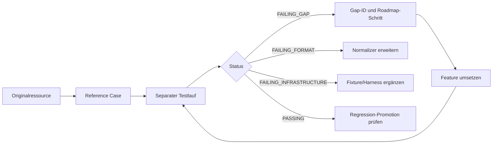
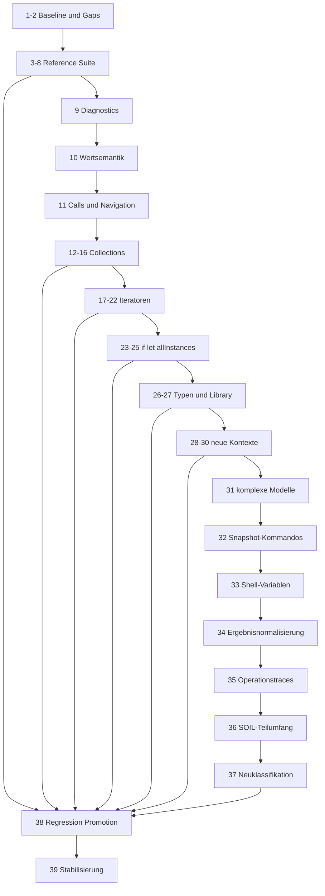

# OCL Extension Roadmap

## Zweck dieser Datei

Diese Roadmap beschreibt die schrittweise Erweiterung der eigenständigen
OCL-Komponente des neuen Backends. Sie verbindet den aktuellen Codezustand, die
Gap-Analyse, die im originalen USE-Projekt vorhandene Testbasis und das Ziel einer
breiten OMG-OCL-2.4-Unterstützung.

Die Reihenfolge ist technisch begründet: Messbarkeit und Diagnostik kommen vor
neuer Semantik, Typ- und Wertmodelle vor Operationen, Iterator-Scope vor
Iteratoren und Zustandsmodelle vor Pre-/Postconditions.

## Roadmap-Prinzipien

| Prinzip | Konsequenz |
|---|---|
| OCL 2.4 ist normativ | USE ist Example-, Kompatibilitäts- und Testreferenz, nicht automatisch das fachliche Oracle. |
| Eigene Pipeline bleibt erhalten | Jedes Feature wird durch Lexer, Parser, AST, Typechecker, Evaluator und Validation geführt. |
| Reference Tests sind ausführbar | Alle OCL-relevanten extrahierbaren Fälle werden langfristig ausgeführt. |
| Fehlschläge sind Daten | `FAILING_GAP`, `FAILING_FORMAT` und `FAILING_INFRASTRUCTURE` treiben die Planung. |
| Normale CI bleibt geschützt | Bekannte Reference-Gaps laufen separat und blockieren `mvn test` nicht. |
| Gaps besitzen stabile IDs | Umsetzung und Reports referenzieren `OCL-GAP-*` aus Datei 11. |
| Originalressourcen bleiben unverändert | Extraktion, Metadaten und Reports liegen getrennt von `original-use/`. |
| UML-Abhängigkeiten werden sichtbar | Fehlende Vererbung, Imports oder Operationstraces werden nicht im OCL-Kern simuliert. |

## Bezug zur Gap-Analyse

`11-backend-vs-original-use-gap-analysis.md` ist die technische Gap-Baseline.

| Gap-Gruppe | Schwerpunkt | Roadmap-Schritte |
|---|---|---:|
| `OCL-GAP-017A-F` | Inventar, Extraktion, Harness und Ausgabeformat | 3-8 |
| `OCL-GAP-015/016` | Source Locations, Diagnostics und UI-Mapping | 9 |
| `OCL-GAP-014` | `null`, `invalid` und vierwertige Logik | 10 |
| `OCL-GAP-002/003/008` | Operatoren, allgemeine Calls und Navigation | 11 |
| `OCL-GAP-004/005/006/019-022` | Collection-Typen, Literale und Bibliothek | 12-16, 27 |
| `OCL-GAP-007A-F` | Iteratoren | 17-22 |
| `OCL-GAP-009/010` | `if`, `let`, `allInstances()` | 23-25 |
| `OCL-GAP-001/013` | erweiterte Typen, Literale und Typoperationen | 26-27 |
| `OCL-GAP-011/012` | Contracts, Derived, Init, Body und Def | 28-30 |
| `OCL-GAP-018` | Modellimport und UML-Infrastruktur | 2, 31 |

## Bezug zu komplexeren USE-Examples

| Example | Relevante Features | Geplanter Einsatz |
|---|---|---:|
| `examples/Documentation/Demo/Demo.use` | `allInstances`, `forAll`, `implies`, Navigation, `includesAll` | 11, 14, 18, 25, 31 |
| `examples/Papers/1998/RichtersAndGogolla/CarRental.use` | `select`, Stringoperationen, Navigation | 11, 19, 27, 31 |
| `examples/Papers/2006/GogollaBuettnerRichters/civstat.use` | Enum, let, if, forAll, allInstances, pre/post, `@pre` | 18, 23-29, 31 |
| `examples/Others/Tree/Tree.use` | Set, union, collect, flatten, iterate, Rekursion | 12, 16, 20, 22, 30-31 |
| `examples/Others/DerivedProperties/derived.use` | derived End, select, subsets | 19, 30-31 |
| `examples/Documentation/Employee/Employee.use` | Operation Contract und `@pre` | 28-29, 31 |

Examples werden zuerst in minimale Feature-Fixtures zerlegt. Erst danach dienen
vollständige Modelle als Integrations- oder Regressionstests.

## Bezug zur originalen USE-Testbasis

Die Migrationsregeln stehen in `12-original-use-testbasis-migration.md`.

| Bereich | Original | Backend-Kopie | Aktueller Stand |
|---|---|---|---|
| Parser | `use/use-core/src/test/resources/org/tzi/use/parser` | `src/test/resources/reference/original-use/parser` | Die Referenzkopie, das Inventar und die extrahierten Parserfälle sind vorhanden. |
| Shell | `use/use-gui/src/it/resources/testfiles/shell` | `src/test/resources/reference/original-use/shell` | Die Referenzkopie, das Inventar und die extrahierten Shellfälle sind vorhanden. |

Die Referenzkopie wird unverändert gehalten. Inventar, extrahierte Metadaten und
ausführbare Harness-Logik liegen getrennt davon, damit spätere
Statusänderungen niemals die ursprünglichen Testressourcen verändern.

## Fehlschlagende Referenztests als Roadmap-Treiber



Jeder Feature-Schritt wählt vor der Implementierung eine feste Gruppe von
`FAILING_GAP`-Fällen. Akzeptiert ist der Schritt erst, wenn die fachlich
einschlägigen Fälle `PASSING` sind oder mit einer überprüften Abhängigkeit neu
klassifiziert wurden.

## Trennung von Reference-Test-Suite und normaler CI

| Suite | Ausführung | Erfolgsregel |
|---|---|---|
| normale Backendtests | `mvn test` | alle Tests müssen grün sein |
| Original-USE-Reference-Suite | separates Profil/Task/CI-Job | bekannte `FAILING_*` erlaubt; Report muss vollständig sein |
| Harness-Integritätsprüfung | Teil des Reference-Jobs | Absturz, ungültige Metadaten oder fehlender Report machen Job rot |

Ein `PASSING`-Referenzfall blockiert die normale CI erst, nachdem er zusätzlich
als normaler Regressionstest übernommen wurde.

## Schrittübersicht

| Phase | Schritte | Ergebnis |
|---|---:|---|
| Baseline und Referenzkorpus | 1-8 | gemessener Current State und ausführbare Gap-Suite |
| Semantische Grundlagen | 9-11 | präzise Diagnostics, OCL-Werte, Calls und Navigation |
| Collections | 12-16 | OCL-Collectionarten, Literale und Kernbibliothek |
| Iteratoren | 17-22 | Scope, Quantoren, Filter, Transformation und Fold/Closure |
| Kontroll- und Modellkontext | 23-25 | if, let und allInstances |
| Typen und Standardbibliothek | 26-27 | Vererbung, Enum, Tuple, Typ-/Standardoperationen |
| zusätzliche OCL-Kontexte | 28-30 | Contracts, Derived, Init, Body und Def |
| Integration der Referenzumgebung | 31-37 | komplexe Modelle, vollständiger Snapshotaufbau, Variablen, strukturierte Erwartungsuebersetzung, Operationstraces und fachlich relevante Szenario-Fixtures ohne Nachbildung der USE-Shell |
| Regression und Stabilisierung | 38-39 | Promotion stabiler Referenzfälle und dokumentiertes OCL-Profil |

## Zusammengefasste Umsetzungspakete

Die 39 Schritte bleiben als stabile Referenzen erhalten, weil Backend-Arbeiten
bereits unter diesen Nummern umgesetzt und dokumentiert wurden. Für Planung,
Aufwandsabschätzung und Releases werden sie jedoch zu elf Lieferpaketen
zusammengefasst. Ein Paket ist fachlich zusammenhängend; seine Einzelschritte
bleiben separat prüfbar, damit ein großes Thema nicht pauschal als erledigt gilt.

| Paket | Schritte | Gemeinsames Ziel | Konkretes Lieferergebnis |
|---|---:|---|---|
| A: Baseline | 1-2 | Ist-Zustand und priorisierte Gaps verbindlich machen | codebasierte Bestandsaufnahme, stabile Gap-IDs und Zuordnung zu Tests |
| B: Referenzkorpus | 3-4 | Originalressourcen nachvollziehbar und unverändert verfügbar machen | Referenzkopie, Prüfsummen, vollständiges Datei-Inventar |
| C: Fallgewinnung | 5-6 | Dateien in einzeln adressierbare Parser- und Shell-Fälle zerlegen | versionierte Parser- und Shell-Metadaten mit IDs, Quellen und Setupbedarf |
| D: Messbarer Harness | 7-8 | alle Fälle separat ausführen und belastbar klassifizieren | Maven-Profil, Runner, Reports und erste fachlich geprüfte Status-Baseline |
| E: Sprachfundament | 9-11 | Fehlerorte, OCL-Wertsemantik, Calls und Navigation stabilisieren | durchgängige Source Ranges, `null`/`invalid`, Operatorpräzedenz und Navigation Chains |
| F: Collections | 12-16 | spezifikationsnahes Collection-Typ- und Operationsmodell liefern | Set, Bag, Sequence, OrderedSet, Literale, Kernoperationen und Konvertierungen |
| G: Iteratoren | 17-22 | Scope-basierte Collection-Ausdrücke vollständig auswerten | Iterator-AST, Variablenbindung, Quantoren, Filter, Transformation, Fold und Closure |
| H: Ausdrucks- und Modellkontext | 23-25 | strukturierte Ausdrücke und snapshotweite Abfragen ermöglichen | `if`, `let` und `allInstances()` inklusive Typ- und Laufzeitregeln |
| I: Erweitertes Typsystem | 26-27 | fehlende Standardtypen und Bibliotheksoperationen ergänzen | Vererbung, Enum, Tuple, Typoperationen und priorisierte Standardbibliothek |
| J: Zusätzliche OCL-Kontexte | 28-30 | OCL außerhalb von Invarianten fachlich korrekt unterstützen | Zustandsmodell, Pre/Post, `@pre`, `result`, Derived, Init, Body und Def |
| K: Referenz-Fixtures | 31-33 | komplexe Modelle und fallbezogene Zustände reproduzierbar aufbauen | Example-Integration, Snapshot-Kommandos und typisierte Shell-Variablen |
| L: Referenzauswertung | 34-37 | alte Erwartungen fachlich entkoppelt prüfen und verbleibende Blocker korrekt klassifizieren | eigene strukturierte Assertions, eigene Szenario-Fixtures und bereinigter Gap-Bericht ohne USE-Shell-Nachbildung |
| M: Produktreife | 38-39 | stabile Referenzfälle schützen und das unterstützte Profil dokumentieren | Regression-Promotion und Compliance-Bericht |

### Paket A: Baseline und Gap-Vertrag

Schritt 1 beantwortet ausschließlich, was der aktuelle Code wirklich kann.
Schritt 2 übersetzt die Abweichungen zu OCL 2.4, USE-Kompatibilität und fehlender
UML-Infrastruktur in stabile Gap-IDs. Beide Schritte werden zusammen geplant,
weil ohne überprüften Ist-Zustand weder Priorität noch Fortschritt messbar sind.
Das Paket ändert keine produktive Semantik.

### Pakete B bis D: Referenztests von Dateien zu Messwerten

Diese drei Pakete bilden eine durchgehende Verarbeitungskette:

```text
Originalressourcen
-> unveränderte Referenzkopie und Inventar
-> Parser-/Shell-Reference-Cases
-> separater Reference-Test-Harness
-> fachlich klassifizierte Baseline
```

Paket B beweist Vollständigkeit auf Dateiebene. Paket C erzeugt stabile Fälle.
Paket D führt jeden Fall mit neuen Backend-Komponenten aus: Schritt 7 stellt
Harness und Rohbeobachtungen bereit, Schritt 8 leitet daraus die erste
Status-Baseline mit Ursachen, Gap-IDs und Roadmapzuordnung ab. Beide Schritte
sind umgesetzt; die Reports bleiben bei jedem weiteren Feature-Schritt
fortzuschreiben.

### Paket E: Sprachfundament vor neuen Features

Neue AST-Knoten und Operationen dürfen erst nach diesem Paket breit ergänzt
werden. Source Locations müssen von Lexer bis API erhalten bleiben. Das
Wertmodell muss `null` und `invalid` unterscheiden. Danach werden allgemeine
Operation Calls, Präzedenz und mehrstufige Navigation konsistent gemacht. Ohne
diese Reihenfolge müssten alle späteren Collection- und Iteratorfeatures erneut
überarbeitet werden.

### Paket F: Collections als geschlossener Lieferumfang

Schritt 12 definiert Typen, Ordnung, Duplikate und Elementkonformität. Schritt 13
stabilisiert vorhandene Basisoperationen. Schritte 14 bis 16 ergänzen zuerst
Prädikate, danach veränderungsfreie Collection-Erzeugung und schließlich
mengenartige beziehungsweise typkonvertierende Operationen. Das Paket gilt erst
als abgeschlossen, wenn Parser, Typechecker und Evaluator dieselbe Collectionart
und dieselben Ordnungseigenschaften verwenden.

### Paket G: Iteratoren auf einer gemeinsamen Scope-Infrastruktur

Schritt 17 implementiert noch keinen einzelnen Iterator, sondern Variablen,
Scopes, Shadowing und Evaluationsframes. Darauf folgen Quantoren, Filter,
Transformationen und schließlich komplexe Fold-/Closure-Operationen. Diese
Schritte werden als Paket geplant, aber nicht in einen einzigen Code-Change
gelegt: Kleine Gruppen halten Typ- und Semantikfehler einem konkreten Iterator
zuordenbar.

### Pakete H und I: Ausdrucksmächtigkeit und Typmodell

`if`, `let` und `allInstances()` nutzen die vorhandene Ausdruckspipeline, haben
aber unterschiedliche Laufzeitkontexte. Das erweiterte Typsystem folgt danach,
weil Generalisierung, Enums und Tuple die Common-Type-, Dispatch- und
Collectionregeln verbreitern. Falls Generalisierung für Navigation früher nötig
wird, darf Schritt 26 parallel vorbereitet, aber nicht stillschweigend im
Evaluator simuliert werden.

### Paket J: Zustandsabhängige OCL-Kontexte

Pre-/Postconditions sind nicht nur neue Parserkeywords. Sie benötigen
Operationsparameter, Rückgabewert, Vor- und Nachzustand sowie einen definierten
Operationsaufruf. Derived, Init, Body und Def bauen auf derselben Kontext- und
Binding-Infrastruktur auf. Deshalb werden die Schritte gemeinsam geplant, aber
erst nach einem expliziten Zustandsmodell implementiert.

### Paket K: Fallbezogene Referenz-Fixtures

Komplexe USE-Examples werden erst integriert, nachdem ihre benötigten Features
isoliert getestet sind. Danach rekonstruiert der Harness für jeden Referenzfall
das zugehörige Modell, den Snapshot und den Shell-Variablenkontext. Unbekannte
zustandsverändernde Kommandos dürfen nicht ignoriert werden, weil ein nur
teilweise aufgebauter Zustand ein fachlich falsches OCL-Ergebnis erzeugen kann.

### Paket L: Strukturierte Referenzauswertung

Die alte Shellausgabe wird in typisierte Erwartungen übersetzt, bevor ein
Ergebnis als OCL-Gap bewertet wird. Query-Operationen, Operationstraces und der
nachweislich benötigte SOIL-Teilumfang werden anschließend kontrolliert
ergänzt. Nach einem vollständigen Referenzlauf werden verbleibende Fehler neu
klassifiziert, sodass Infrastruktur-, Format- und Sprachprobleme klar getrennt
sind.

### Paket M: Produktreife und dauerhaftes Qualitätsniveau

Stabil grüne Referenzfälle werden zusätzlich als kleine normale Regressionen
übernommen. Der Abschlussbericht nennt unterstützte, teilweise unterstützte und
nicht unterstützte OCL-2.4-Bereiche. Er darf keine Vollständigkeit behaupten,
die nicht durch reproduzierbare Tests belegt ist.

## Ausführung eines einzelnen Schritts

Jeder nummerierte Schritt folgt demselben Ablauf:

1. Relevante Gap-IDs und Reference Cases festlegen.
2. Voraussetzungen im vorherigen Paket verifizieren.
3. Lexer-, Parser-, AST-, Typechecker- und Evaluatorauswirkungen getrennt planen.
4. Nur die für diesen Schritt nötige Produktions- und Testlogik umsetzen.
5. Normale Tests und getrennte Reference Suite ausführen.
6. Beobachtete Statusänderungen mit Ursache im Report dokumentieren.
7. Schritt erst abschließen, wenn seine Akzeptanzkriterien nachweisbar erfüllt sind.

Ein Schritt darf daher nicht allein deshalb als erledigt gelten, weil sein
Parserkonstrukt akzeptiert wird. Typprüfung, Evaluation, Validation, Fehlerformat
und Tests gehören zum selben Featureabschluss, sofern die Schrittbeschreibung
sie nicht ausdrücklich abgrenzt.

**Statuslegende:** `ERLEDIGT` bedeutet, dass das geforderte Artefakt im aktuellen
Workspace nachweisbar vorhanden ist. `OFFEN` bedeutet, dass es neu umgesetzt und
anschließend verifiziert werden muss. Spätere Pflege bleibt davon unberührt.

Aktueller Fortschritt: Die Schritte 1 bis 39 sind erledigt. Die geplante
OCL-Erweiterungsroadmap ist damit abgeschlossen; weitere Sprach- oder
Härtungsarbeiten benötigen neue, ausdrücklich abgegrenzte Schritte.

Die nach Abschluss festgestellten Arbeiten für eine weitergehende
OCL-2.4-Compliance werden nicht rückwirkend in diese Roadmap eingefügt. Sie sind
in `14-full-ocl-uml-compliance-matrix.md` vollständig klassifiziert und in
`15-full-ocl-uml-implementation-plan.md` als neuer, schrittweiser Folgeplan
einschließlich der notwendigen UML-Erweiterungen geordnet.

## Schritt 1: Current State

| Aspekt | Festlegung |
|---|---|
| Status | `ERLEDIGT`, vor jedem Release aktualisieren |
| Ziel | tatsächlich implementiertes OCL-Subset und Architekturgrenzen belegen |
| Enthalten | Lexer, Parser, AST, Typechecker, Evaluator, Validation, API, Frontend und Tests |
| Nicht enthalten | neue Features |
| Gap-Bezug | Ausgangsbasis aller `OCL-GAP-*` |
| USE-Testbasis | noch keine Statusänderung |
| Reference-Status | prognostische Baseline |
| Parser | vorhandene Grammatik dokumentieren |
| AST | vorhandene Knoten dokumentieren |
| Typechecker | unterstützte Typregeln dokumentieren |
| Evaluator | unterstützte Werte/Operationen dokumentieren |
| Validation | bestehendes Invariant-Mapping dokumentieren |
| API/Frontend | vorhandene OCL-Endpunkte und Editorgrenzen erfassen |
| Testaufgaben | bestehende Backendtests inventarisieren |
| Abhängigkeiten | keine |
| Akzeptanzkriterien | `01-ocl-current-state.md` stimmt mit Code und Tests überein |
| Risiken | Dokumentation behauptet geplante Features als implementiert |
| Beispiel | `self.books <= 5` |

## Schritt 2: Backend-vs-Original-USE-Gaps

| Aspekt | Festlegung |
|---|---|
| Status | `ERLEDIGT`, durch Reports fortzuschreiben |
| Ziel | stabile Gap-IDs und Trennung zwischen OCL 2.4, USE-Kompatibilität und UML-Abhängigkeit |
| Enthalten | Datei 11, Priorität und Roadmapzuordnung |
| Nicht enthalten | Gap-Implementierung |
| Gap-Bezug | definiert `OCL-GAP-001` bis `022` und Untergruppen |
| USE-Testbasis | repräsentative Parser-/Shellfälle zugeordnet |
| Reference-Status | Prognosen; später Messwerte |
| Parser | Syntaxgaps zuordnen |
| AST | fehlende Knotengruppen zuordnen |
| Typechecker | fehlende Typregeln zuordnen |
| Evaluator | fehlende Semantik zuordnen |
| Validation | Kontext-/Mappinggaps zuordnen |
| API/Frontend | DTO-/Editorauswirkungen erfassen |
| Testaufgaben | jeden High-Priority-Gap mit Kandidaten belegen |
| Abhängigkeiten | Schritt 1 |
| Akzeptanzkriterien | keine unklassifizierte hoch priorisierte Lücke |
| Risiken | USE-Dialekt wird normativ behandelt |
| Beispiel | `Employee.allInstances()->forAll(...)` |

## Schritt 3: Originale USE-Testbasis übernehmen

| Aspekt | Festlegung |
|---|---|
| Status | `ERLEDIGT` |
| Ziel | beide Originalkorpora vollständig und reproduzierbar im Backend bereitstellen |
| Enthalten | alle bei Ausführung tatsächlich vorhandenen Parser- und Shellressourcen plus README |
| Nicht enthalten | produktiver USE-Code, USE-Core, alte Runner |
| Gap-Bezug | Voraussetzung für `OCL-GAP-017A-F` |
| USE-Testbasis | relative Struktur und Inhalte unverändert kopieren |
| Reference-Status | noch keine Fallstatuswerte; unveränderte Ausgangsressourcen bereitgestellt |
| Parser/AST/Typechecker/Evaluator | keine Produktionsänderung |
| Validation | keine Produktionsänderung |
| API/Frontend | keine Auswirkung |
| Testaufgaben | Pfade und SHA-256 gegen Quellen prüfen |
| Abhängigkeiten | rechtliche Freigabe im Uni-Kontext |
| Akzeptanzkriterien | erfüllt: Parser- und Shell-Korpus liegen mit README und SHA-256-Nachweis unter `reference/original-use/` |
| Risiken | Korpus wird versehentlich durch Konverter verändert |
| Beispiel | `original-use/shell/t001.in` |

## Schritt 4: Testbasis inventarisieren

| Aspekt | Festlegung |
|---|---|
| Status | `ERLEDIGT` |
| Ziel | jede kopierte Datei maschinenlesbar erfassen |
| Enthalten | `inventory.json`, `inventory.md`, Generator und heuristische Tags |
| Nicht enthalten | fachlich bestätigte Blockstatuswerte |
| Gap-Bezug | soll den Dateianteil von `OCL-GAP-017A` schließen |
| USE-Testbasis | Anzahl und Verteilung werden aus der neu kopierten Testbasis berechnet |
| Reference-Status | Candidate-Hinweis, noch kein gemessener Status |
| Parser/AST/Typechecker/Evaluator | keine Produktionsänderung |
| Validation | keine Produktionsänderung |
| API/Frontend | keine Auswirkung |
| Testaufgaben | Schema, Summen, eindeutige Pfade und Drift prüfen |
| Abhängigkeiten | Schritt 3 |
| Akzeptanzkriterien | erfüllt: 387 Dateien erscheinen jeweils genau einmal in `inventory.json`; `inventory.md` fasst sie zusammen |
| Risiken | Regex-Tags werden mit Fachklassifikation verwechselt |
| Beispiel | Tag `ITERATOR` für Dateien mit `forAll` |

## Schritt 5: Parser-Testbasis klassifizieren

| Aspekt | Festlegung |
|---|---|
| Status | `ERLEDIGT` |
| Ziel | `.use`, `.fail` und `test_expr.in` in stabile Reference Cases zerlegen |
| Enthalten | Source Lines, positive/negative Erwartung, Imports, Feature Tags, IDs |
| Nicht enthalten | Shell-Szenarien |
| Gap-Bezug | `OCL-GAP-017A-C`, `018` |
| USE-Testbasis | Parserkorpus vollständig klassifizieren |
| Reference-Status | zunächst `UNCLEAR`, `FAILING_FORMAT` oder `FAILING_INFRASTRUCTURE`; ausführbare Fälle messen |
| Parser | Modell- und Expressionfälle unterscheiden |
| AST | erwartete Struktur nur bei Expressionfällen erfassen |
| Typechecker | semantische Fehlerphase von Syntaxfehler trennen |
| Evaluator | nur explizite Evaluationinputs berücksichtigen |
| Validation | Invarianten als spätere Validation Cases markieren |
| API/Frontend | keine direkte Auswirkung |
| Testaufgaben | `parser-reference-cases.json` erzeugen und reviewen |
| Abhängigkeiten | Schritte 2-4 |
| Akzeptanzkriterien | erfüllt: 197 Parser-Reference-Cases besitzen stabile ID, Quelle, Kategorie, Status und Gapbezug |
| Risiken | ganze Datei erhält fälschlich einen einzigen Status |
| Beispiel | negative `.fail`-Diagnose mit Range statt Textvergleich |

## Schritt 6: Shell-Testbasis analysieren

| Aspekt | Festlegung |
|---|---|
| Status | `ERLEDIGT` |
| Ziel | `?`-Inputs, `*`-Erwartungsblöcke und Setupabhängigkeiten extrahieren |
| Enthalten | OCL-Queries, erwartete Werte/Typen/Diagnostics, Modell-/Commandbezug |
| Nicht enthalten | Nachbau der USE-Shell |
| Gap-Bezug | `OCL-GAP-017D-F`, `012`, `018` |
| USE-Testbasis | alle 129 `.in` plus abhängige Ressourcen analysieren |
| Reference-Status | Formatlücken `FAILING_FORMAT`, Setup `FAILING_INFRASTRUCTURE` |
| Parser | Querytext isolieren |
| AST | Feature Tags aus Ausdruck ableiten |
| Typechecker | erwarteten statischen Typ normalisieren |
| Evaluator | Wert und Collectionart strukturiert abbilden |
| Validation | Check-/Contractblöcke getrennt kategorisieren |
| API/Frontend | keine direkte Auswirkung |
| Testaufgaben | `shell-ocl-reference-cases.json` generieren und reviewen |
| Abhängigkeiten | Schritte 2-4 |
| Akzeptanzkriterien | erfüllt: 1.221 `?`-Blöcke aus 129 `.in`-Dateien besitzen Reference-ID und zugeordneten `*`-Block |
| Risiken | mehrzeilige Outputs werden dem falschen Input zugeordnet |
| Beispiel | `? 4 <= 4` plus `*-> true : Boolean` |

## Schritt 7: Ausführbare Original-USE-Referenztestsuite

| Aspekt | Festlegung |
|---|---|
| Status | `ERLEDIGT` |
| Ziel | klassifizierte Fälle separat mit neuen Backend-Komponenten ausführen |
| Enthalten | Parser-, Shell-OCL- und Gap-Report-Runner, eigenes Maven-Profil/Task |
| Nicht enthalten | USE-Core oder normale CI-Blockierung durch bekannte Gaps |
| Gap-Bezug | `OCL-GAP-017` |
| USE-Testbasis | lädt nur Originalressourcen plus converted metadata |
| Reference-Status | alle sechs Statuswerte technisch unterstützt |
| Parser | dynamische Expression-/Diagnosefälle |
| AST | strukturierte Assertions wo sinnvoll |
| Typechecker | Fixture- und Type-Assertions |
| Evaluator | strukturierte Werte statt Shellstrings |
| Validation | Invariant-/Diagnostic-Cases |
| API/Frontend | primär Serviceebene; wenige API-Cases |
| Testaufgaben | Integrität, IDs, Status und Report testen |
| Abhängigkeiten | Schritte 5-6 |
| Akzeptanzkriterien | erfüllt: `mvn -Preference-tests test` verarbeitet 1.418 Fälle; drei JSON-Reports entstehen unter `target/reference-reports/`; `mvn test` bleibt getrennt |
| Risiken | erwartete Gaps werden als deaktivierte Tests versteckt |
| Beispiel | `OriginalUseReferenceShellOclTest` |

## Schritt 8: Fehlschläge klassifizieren

| Aspekt | Festlegung |
|---|---|
| Status | `ERLEDIGT`; Baseline bei jedem Reference-Lauf fortschreiben |
| Ziel | erste gemessene Reference-Baseline erzeugen |
| Enthalten | Status, observed result, Gap-ID, Roadmap-Schritt und Trenddaten |
| Nicht enthalten | pauschales Grünsetzen unbekannter Fälle |
| Gap-Bezug | alle Gaps, primär `OCL-GAP-017` |
| USE-Testbasis | jeder ausführbare Fall erhält beobachteten Status |
| Reference-Status | erste gemessene Baseline: 31 `PASSING`, 1.099 `FAILING_GAP`, 109 `FAILING_FORMAT`, 57 `FAILING_INFRASTRUCTURE`, 122 `UNCLEAR` |
| Parser | 1.292 Parse-Diagnostics und erfolgreiche Parse-Ergebnisse getrennt erfasst |
| AST | AST-Knotentyp für erfolgreich geparste Fälle im Report gespeichert |
| Typechecker | 22 Type-Diagnostics separat klassifiziert |
| Evaluator | 47 Fälle vollständig ausgewertet; Typ und strukturierter primitiver Wert verglichen |
| Validation | Mapping-/Kontextfehler separat erfassen |
| API/Frontend | Report, keine Produkt-UI nötig |
| Testaufgaben | JSON- und Markdown-Baseline, Statusübergänge, Gap-Häufigkeiten und Integritätsprüfung umgesetzt |
| Abhängigkeiten | Schritt 7 |
| Akzeptanzkriterien | erfüllt: alle 1.418 Fälle besitzen effektiven Status und Ursache; jeder `FAILING_GAP` zusätzlich primäre Gap-ID und Roadmap-Schritt |
| Risiken | `FAILING_INFRASTRUCTURE` verdeckt Sprachgaps |
| Beispiel | `forAll` wird `OCL-GAP-007B`, Schritt 18 zugeordnet |

## Schritt 9: Source Locations und bessere Fehler

| Aspekt | Festlegung |
|---|---|
| Status | `ERLEDIGT` (Backend, 2026-08-17) |
| Ziel | Diagnosevertrag vor neuen Sprachknoten stabilisieren |
| Enthalten | Phase, stabile Codes, Teilranges, Source Reference, Dokumentversion |
| Nicht enthalten | neue OCL-Semantik |
| Gap-Bezug | `OCL-GAP-015/016` |
| USE-Testbasis | `.fail`-Positionen und Shelldiagnostics fachlich normalisieren |
| Reference-Status | Baseline unverändert: `PASSING` 31, `FAILING_GAP` 1.099, `FAILING_FORMAT` 109, `FAILING_INFRASTRUCTURE` 57, `UNCLEAR` 122; die bestehende Harness wertet noch keine Positionsassertions aus |
| Parser | UTF-16-basierte Tokenranges; getrennte Codes für `INVALID_CHARACTER`, `UNTERMINATED_STRING`, `MISSING_TOKEN`, `UNEXPECTED_TOKEN` und `UNSUPPORTED_SYNTAX` |
| AST | alle vorhandenen Knoten behalten Gesamtranges; Property- und Binärknoten tragen zusätzlich `propertyRange` beziehungsweise `operatorRange` |
| Typechecker | unbekannte Properties markieren nur den Propertynamen; Operatorfehler verwenden den Operatorbereich |
| Evaluator | fehlerauslösenden Knoten referenzieren |
| Validation | Diagnosephase, stabiler Diagnosecode, Invariantenquelle und vollständige Start-/End-Offsets werden in die Validation-Details übernommen |
| API/Frontend | zentraler `OclDiagnosticMapper`, `SourceReferenceDto` sowie optionale `sourceId`, `sourceKind` und `documentVersion` in Parse-, Typecheck- und Evaluate-Requests; alte Requestformen bleiben gültig |
| Testaufgaben | CRLF, Unicode/UTF-16, EOF, Parserphase, Property-Teilrange und API-SourceReference umgesetzt |
| Abhängigkeiten | Schritte 1 und 8 |
| Akzeptanzkriterien | erfüllt für das bestehende OCL-Subset: Parse, Typecheck, Evaluate und Validate verwenden denselben UTF-16-Rangevertrag; normale Suite `73/73` grün, getrennte Reference-Suite `3/3` Runner grün |
| Risiken | Breaking DTO Change ohne Versionierung |
| Beispiel | `self.boks <= 5` markiert `boks` |

Tatsächliches Ergebnis: Der Diagnosevertrag ist additiv erweitert und damit für
das bestehende Frontend rückwärtskompatibel. `phase` trennt Lexer, Parser,
Typechecker und Evaluation; `source` bindet eine Diagnose optional an Quelle
und Dokumentversion. Die produktive OCL-Semantik wurde nicht erweitert. Die
Reference-Suite bleibt über `mvn -Preference-tests test` von der normalen CI
getrennt. Positionsbezogene Original-USE-Assertions bleiben eine spätere
Harness-Erweiterung und wurden nicht künstlich als `PASSING` umklassifiziert.

## Schritt 10: `null`, `invalid` und Typkonformität

| Aspekt | Festlegung |
|---|---|
| Status | `ERLEDIGT` (Backend, 2026-08-17) |
| Ziel | OCL-Werte statt Java-`null` und vollständige Propagation |
| Enthalten | OclVoid, OclInvalid, Boolean-Tabellen, Conformance und LUB |
| Nicht enthalten | Contracts |
| Gap-Bezug | `OCL-GAP-014`, Teil `001` |
| USE-Testbasis | undefined-/Booleanfälle aus `t001.in` |
| Reference-Status | Baseline unverändert: `PASSING` 31, `FAILING_GAP` 1.099, `FAILING_FORMAT` 109, `FAILING_INFRASTRUCTURE` 57, `UNCLEAR` 122. Die vorhandenen Originalfälle verwenden überwiegend `oclUndefined(T)`; allgemeine Operation Calls gehören erst zu Schritt 11. |
| Parser | eigenständige `null`- und `invalid`-Tokens und Literale umgesetzt |
| AST | `LiteralType.NULL` und `LiteralType.INVALID` ergänzen den allgemeinen Literalknoten |
| Typechecker | `OclVoid`, `OclInvalid`, Konformität, numerische Integer-zu-Real-Konformität und LUB-Grundregeln umgesetzt; interner Fehlertyp bleibt getrennt |
| Evaluator | `OclVoidValue` und `OclInvalidValue` statt Java-`null`; Boolean-Wahrheitstabellen, Gleichheit, Vergleiche, Slots, einwertige Navigation und Folgeoperationen propagieren fachliche Werte |
| Validation | `null` oder `invalid` als Invariantenergebnis erzeugt `EVALUATION_ERROR` mit `UNDEFINED_INVARIANT_RESULT`, nicht `INVARIANT_VIOLATION` |
| API/Frontend | `OclEvaluateResponseDto.valueKind` unterscheidet `DEFINED`, `NULL` und `INVALID`; bestehender Konstruktor bleibt kompatibel |
| Testaufgaben | Literale, Conformance/LUB, vollständige relevante `and`-/`or`-Invalid-Kombinationen, `not`, Null-Gleichheit, ungesetzte Slots und Validation umgesetzt |
| Abhängigkeiten | Schritt 9 |
| Akzeptanzkriterien | erfüllt für das bestehende Operator-Subset: kein OCL-null/invalid-Fall endet als unstrukturierte Java-Exception; normale Suite `78/78` grün, getrennte Reference-Suite `3/3` Runner grün |
| Risiken | historisches USE-undefined ungeprüft übernehmen |
| Beispiel | `true or invalid` |

Tatsächliches Ergebnis: Das Backend unterscheidet nun einen definierten Wert,
OCL-`null` (`OclVoid`) und OCL-`invalid` sowohl im Laufzeitmodell als auch im
API-Ergebnis. Ungesetzte Slotwerte werden als `OclVoid` gelesen; eine daraus
nicht definierte Vergleichs- oder Invariantenauswertung wird als `OclInvalid`
beziehungsweise strukturiertes Evaluation Finding weitergereicht. Die
Reference-Suite bleibt über `mvn -Preference-tests test` von der normalen CI
getrennt. Es wurden keine späteren Operationsaufrufe wie `oclUndefined(T)`,
keine Arithmetik und keine Contracts vorweggenommen.

## Schritt 11: Operatoren, Calls und Navigation

| Aspekt | Festlegung |
|---|---|
| Status | `ERLEDIGT` (Backend, 2026-08-17) |
| Ziel | vollständige Ausdruckspräzedenz und allgemeine Operationsauflösung |
| Enthalten | Arithmetik, `implies`, `xor`, Argumente, parameterlose Calls, Navigation Chains |
| Nicht enthalten | Iteratorvariablen, Collection-Literale, implizites Collect auf mehrwertiger Navigation und ausführbare UML-Operationsbodies |
| Gap-Bezug | `OCL-GAP-002/003/008` |
| USE-Testbasis | `t001.in`, `t004.in`, Demo und CarRental |
| Reference-Status | gemessen: `PASSING` 60, `FAILING_GAP` 1.098, `FAILING_FORMAT` 129, `FAILING_INFRASTRUCTURE` 68, `UNCLEAR` 63; gegenüber der Schritt-10-Baseline wurden insbesondere 21 deklarierte Gaps und 8 unklare Shellfälle `PASSING` |
| Parser | vollständige Präzedenzkette für `implies`, `xor`, `or`, `and`, Gleichheit, Relationen, additive und multiplikative Operatoren sowie Unary; allgemeine Calls mit Argumentlisten und beide `->size`-Profile |
| AST | `OperationCallExpression` trennt Receiver, Operationsname, Argumente und Source Range von `PropertyAccessExpression` |
| Typechecker | Numeric Promotion, Integerregeln für `div`/`mod`, Standardoperationssignaturen und UML-Operationssignaturen; einwertige Rollen bleiben verkettbar |
| Evaluator | Dispatch für Arithmetik, `implies`, `xor`, Unary Minus, String-/Numeric-/OclAny-Basisoperationen sowie vorhandene einwertige Navigation Chains |
| Validation | unbekannte oder unpassend parametrisierte Calls liefern `INVALID_OPERATION` mit Operation und Receiver-Signatur; unbekannte Attribute/Rollen bleiben strukturiert lokalisiert |
| API/Frontend | Parse-AST enthält Calls einschließlich Argumenten und Operationsrange; resolved references für Hover/Autocomplete bleiben optional und wurden nicht vorgezogen |
| Testaufgaben | umgesetzt: Präzedenzstruktur, Argumentcalls, parameterlose Calls, `->size` und `->size()`, Numeric Promotion, Division/Modulo, Boolean-Operatoren und negative Signaturauflösung |
| Abhängigkeiten | Schritte 9-10 |
| Akzeptanzkriterien | erfüllt: keine operationenspezifische Parser-Sonderliste; normale Suite `84/84` grün, getrennte Reference-Suite `3/3` Runner grün |
| Risiken | USE-Kurzformen werden unmarkiert Standardsyntax |
| Beispiel | `a implies b`, `self.department.budget` |

Tatsächliches Ergebnis: Lexer, Parser, AST, Typechecker und Evaluator verwenden
nun einen gemeinsamen allgemeinen Callpfad. Der Parser entscheidet nicht anhand
einer Liste einzelner Operationsnamen; die Signaturentscheidung liegt im
Typechecker. Unterstützt sind arithmetische Operatoren einschließlich `div` und
`mod`, `implies`, `xor`, Unary Minus, Standardcalls mit Argumenten sowie
parameterlose Arrow-Calls mit und ohne Klammern. Die vorhandene einwertige
Assoziationsnavigation kann über mehrere Property-Schritte verkettet werden.

Der Reference-Lauf verarbeitet weiterhin alle 1.418 Fälle getrennt von der
normalen CI. Der Statusanstieg auf 60 `PASSING` zeigt den Fortschritt bei
Operator- und Callfällen; verbleibende Collection-Literale, implizite
Collection-Navigation, Iteratoren, Typliterale und Modell-Setups bleiben bewusst
den Folgeschritten zugeordnet. Die Reference-Suite läuft ausschließlich über
`mvn -Preference-tests test` und blockiert `mvn test` nicht.

## Schritt 12: Collection-Typmodell

| Aspekt | Festlegung |
|---|---|
| Status | `ERLEDIGT` (Backend, 2026-08-17) |
| Ziel | Set, Bag, Sequence, OrderedSet und Collection-Literale korrekt modellieren |
| Enthalten | Ordnung, Duplikate, Collection-Equality, generische Typen, Literale, inklusive Integer-Ranges und verschachtelte Collections |
| Nicht enthalten | Iterator-Scope, Iteratoren und die in Schritten 13 bis 16 geplanten Collection-Operationen |
| Gap-Bezug | `OCL-GAP-004/006` |
| USE-Testbasis | Collectionblöcke aus `t001.in`, `t002.in`, `t004.in` |
| Reference-Status | 1.418 Fälle regulär klassifiziert: 114 `PASSING`, 1.067 `FAILING_GAP`, 117 `FAILING_FORMAT`, 57 `FAILING_INFRASTRUCTURE`, 63 `UNCLEAR`; keine Runner-Exception |
| Parser | `{}`, Kommaelemente, `..`-Ranges und verschachtelte `Set`-/`Bag`-/`Sequence`-/`OrderedSet`-Literale umgesetzt; nicht unterstützte Unterausdrücke liefern Diagnostics statt `null`-AST-Knoten |
| AST | `CollectionLiteralExpression`, `CollectionItem`, `CollectionRangeItem` und `CollectionKind` umgesetzt |
| Typechecker | konkrete Collectionart, Elementtyp, numerischer LUB, `OclAny` als gemeinsamer Obertyp und Konformität zu `Collection(T)` umgesetzt |
| Evaluator | `SetValue`, `BagValue`, `SequenceValue` und `OrderedSetValue` mit artgerechter Ordnung, Duplikat- und Equality-Semantik umgesetzt |
| Validation | Collectionausdrücke laufen durch dieselbe Parse-/Typecheck-/Evaluation-Pipeline; Invariant-Validation bleibt auf Boolean-Ergebnisse begrenzt |
| API/Frontend | Evaluationsantwort additiv um `collectionKind` und `elementType` ergänzt; Werte bleiben strukturiert im bestehenden `value`-Feld |
| Testaufgaben | umgesetzt: leere, gemischte, geordnete, duplikathaltige und verschachtelte Collections sowie Ranges und robuste Diagnostics |
| Abhängigkeiten | Schritte 10-11 |
| Akzeptanzkriterien | erfüllt: Collectionart bleibt in Typ und Wert erhalten; fokussierte OCL-Suite `30/30`, normale Suite `90/90` und getrennte Reference-Runner `3/3` grün |
| Risiken | geordnete Association Ends sind im UML-Modell noch nicht abgebildet; Operationen auf den Collectionarten werden erst ab Schritt 13 vollständig stabilisiert |
| Beispiel | `Set{1, 2}`, `Sequence{1, 1}` |

Tatsächliches Ergebnis: Das Backend besitzt ein eigenständiges Collection-Typ-
und Wertmodell für alle vier OCL-Collectionarten. `Set` und `OrderedSet`
entfernen fachlich gleiche Duplikate, `Sequence` und `OrderedSet` bewahren die
Reihenfolge, und `Bag` bewahrt Mehrfachvorkommen. Collection-Literale können leer,
gemischt, verschachtelt oder über inklusive Integer-Ranges aufgebaut werden. Der
Typechecker leitet den gemeinsamen Elementtyp ab; beispielsweise wird aus
`Sequence{1, 2.5}` der Typ `Sequence(Real)`.

Der Reference-Lauf verarbeitet alle 1.418 Fälle ohne Runner-Exception. Gegenüber
der vor Schritt 12 dokumentierten Baseline bleiben 114 Fälle `PASSING`; 23 zuvor
infrastrukturell blockierte Fälle werden nun als echte `FAILING_GAP` und drei als
`FAILING_FORMAT` klassifiziert. Das ist ein gewünschter Fortschritt der
Messbarkeit, kein Vorziehen der fehlenden Collection-Operationen. Die Reference-
Suite läuft weiterhin ausschließlich über `mvn -Preference-tests test` und
blockiert die normale Ausführung mit `mvn test` nicht.

## Schritt 13: Collection-Basisgaps grün machen

| Aspekt | Festlegung |
|---|---|
| Status | `ERLEDIGT` (Backend, 2026-08-17) |
| Ziel | vorhandene `size`, `isEmpty`, `notEmpty` auf neuem Modell stabilisieren |
| Enthalten | alle vier Collectionarten, Aufruf mit und ohne Klammern sowie definierte `null`-/`invalid`-Semantik |
| Nicht enthalten | Operationen mit Argument und die ab Schritt 14 geplanten Membership-/Produktionsoperationen |
| Gap-Bezug | `OCL-GAP-005` |
| USE-Testbasis | `->size` und `->size()` Fälle |
| Reference-Status | unverändert 114 `PASSING`, 1.067 `FAILING_GAP`, 117 `FAILING_FORMAT`, 57 `FAILING_INFRASTRUCTURE`, 63 `UNCLEAR`; die direkt extrahierten Basisfälle aus `t001.in` waren bereits grün |
| Parser | allgemeiner parameterloser Callpfad unterstützt `->size` und `->size()` ohne Operations-Sonderliste |
| AST | ausschließlich `OperationCallExpression`; alter ungenutzter `CollectionOperationExpression`-Parallelpfad entfernt |
| Typechecker | `Collection(T) -> Integer/Boolean` für Set, Bag, Sequence und OrderedSet; Bottom-Type-Signaturen für die kontrollierte `null`-/`invalid`-Propagation |
| Evaluator | artunabhängige Queries; Duplikate zählen entsprechend der konkreten Collection; `null->isEmpty()` ist `true`, `null->notEmpty()` ist `false`, übrige undefinierte Basisaufrufe propagieren `invalid` |
| Validation | unveränderte Invariant-Pipeline verwendet die gehärteten Typechecker-/Evaluatorregeln |
| API/Frontend | keine Vertrags- oder UI-Änderung erforderlich; bestehende Ergebniswerte und Diagnostics bleiben erhalten |
| Testaufgaben | umgesetzt: jede Collectionart, leer/nicht leer, Duplikate, beide Syntaxprofile, falsche Argumentzahl, Nicht-Collection, `null` und `invalid` |
| Abhängigkeiten | Schritt 12 |
| Akzeptanzkriterien | erfüllt: fokussierte OCL-Suite `41/41`, normale Suite `94/94` und getrennte Reference-Runner `3/3` grün; Basisfälle aus `t001.in` bleiben `PASSING` |
| Risiken | `oclEmpty(Type)` und Collection-Typliterale bleiben späteren Typ-/Literal-Schritten zugeordnet; Association-Navigation ohne Modellfixture bleibt infrastrukturell blockiert |
| Beispiel | `self.borrowedBooks->size() <= 5` |

Tatsächliches Ergebnis: `size`, `isEmpty` und `notEmpty` werden einheitlich als
allgemeine `OperationCallExpression` verarbeitet. Der vorherige, vom Parser nicht
mehr erzeugte Collection-Sonder-AST wurde entfernt. Die Operationen arbeiten auf
allen vier Collection-Werten aus Schritt 12 und respektieren deren Duplikatregeln;
beispielsweise liefern `Set{1,1}->size()` den Wert `1` und
`Bag{1,1}->size()` den Wert `2`.

Die in der Analyse festgelegte Bottom-Value-Semantik ist durch Typechecker- und
Evaluator-Tests abgesichert: `null->isEmpty()` ergibt `true`,
`null->notEmpty()` ergibt `false`; `invalid` propagiert und `null->size()` bleibt
undefiniert. Der getrennte Reference-Lauf klassifiziert weiterhin alle 1.418
Fälle ohne Runner-Exception. Die Statuszahlen ändern sich nicht, weil die direkt
extrahierbaren `size`-/Leerheitsfälle aus `t001.in` bereits nach Schritt 12
`PASSING` waren; die verbleibenden Treffer hängen überwiegend von `oclEmpty`,
Iteratoren, `allInstances`, Enums oder Modellfixtures ab. `mvn test` und
`mvn -Preference-tests test` bleiben voneinander getrennt.

## Schritt 14: `includes`, `excludes`, `includesAll`, `excludesAll`

| Aspekt | Festlegung |
|---|---|
| Status | `ERLEDIGT` (Backend, 2026-08-17) |
| Ziel | Membership-Queries implementieren |
| Enthalten | `includes`/`excludes` mit Einzelargument sowie `includesAll`/`excludesAll` mit Collectionargument; Set, Bag, Sequence und OrderedSet; Typkonformität und Bottom-Elementtypen |
| Nicht enthalten | produzierende Collectionoperationen `including`/`excluding`, `count`, Iteratoren und Collection-Konvertierungen |
| Gap-Bezug | `OCL-GAP-019` |
| USE-Testbasis | Demo/Tree und Shell-Membershipfälle |
| Reference-Status | 40 Fälle wechseln von `FAILING_GAP` zu `PASSING`; gesamt 154 `PASSING`, 1.027 `FAILING_GAP`, 117 `FAILING_FORMAT`, 57 `FAILING_INFRASTRUCTURE`, 63 `UNCLEAR` |
| Parser | keine Änderung: vorhandene Argumentcalls verarbeiten alle vier Operationen bereits syntaktisch |
| AST | keine Änderung: allgemeine `OperationCallExpression` trägt Empfänger, Namen, Argumente und Source Range |
| Typechecker | genau ein Argument; Einzelargument muss zum Elementtyp kompatibel sein, `includesAll`/`excludesAll` verlangen eine Collection mit kompatiblem Elementtyp; leere Collections werden über `OclVoid` als Bottom-Typ inferiert |
| Evaluator | Membership über zentrale `OclValueEquality`; numerische Promotion, verschachtelte Collections, `null` als Element und `invalid`-Propagation; Duplikate im rechten Argument ändern `includesAll` nicht |
| Validation | bestehende Operation-Diagnostics nennen die konkrete Operation; Invarianten verwenden ohne Sonderpfad dieselbe Typechecker-/Evaluatorlogik |
| API/Frontend | keine strukturelle Änderung; Boolean-Ergebnis und vorhandene Diagnostics passen in bestehende DTOs |
| Testaufgaben | umgesetzt: alle Collectionarten, numerische OCL-Gleichheit, verschachtelte Collections, Duplikate, leere Collections, `null`, falscher Typ und falsche Signatur |
| Abhängigkeiten | Schritte 12-13 |
| Akzeptanzkriterien | erfüllt: fokussierte Typechecker-/Evaluator-Suite `30/30`, normale Suite `98/98` und getrennte Reference-Runner `3/3` grün; alle vier Operationen für zulässige Collectionarten ausgewertet |
| Risiken | Objekt-Membership verwendet die bereits zentrale OCL-Wertgleichheit; vollständige Objektidentitäts- und Vererbungsfälle bleiben von späteren Modellfixtures bzw. UML-Erweiterungen abhängig |
| Beispiel | `self.employee->includesAll(self.project)` |

Tatsächliches Ergebnis: Die vier Membership-Queries nutzen den in Schritt 11
vereinheitlichten Operationspfad. Der Typechecker prüft sowohl Einzelwerte als
auch Collectionargumente gegen den Empfänger-Elementtyp und lehnt falsche
Argumentanzahl, Nicht-Collections bei `includesAll`/`excludesAll` sowie klar
inkompatible Elementtypen ab. `Set{}->includes(1)` bleibt typisierbar, weil der
Elementtyp der leeren Collection `OclVoid` als Bottom-Typ ist.

Der Evaluator durchsucht Collections über `OclValueEquality` statt über
Java-Collectionmethoden. Dadurch gelten beispielsweise `1` und `1.0` als gleich,
und verschachtelte Collectionwerte behalten ihre OCL-Gleichheitsregeln.
`includesAll` prüft Membership und keine Bag-Häufigkeiten, daher ist
`Set{1}->includesAll(Bag{1,1})` wahr. Leere rechte Collections erfüllen
`includesAll` und `excludesAll` vacuously; ein `invalid`-Argument propagiert
`invalid`.

Der getrennte Reference-Lauf klassifiziert alle 1.418 Fälle ohne Runner-Exception.
Gegenüber Schritt 13 wechseln 40 bereits extrahierte Membershipfälle von
`FAILING_GAP` zu `PASSING`. Die normale Suite bleibt über `mvn test` getrennt und
vollständig grün; die Reference-Suite läuft ausschließlich über
`mvn -Preference-tests test`.

## Schritt 15: `including`, `excluding`, `count`

| Aspekt | Festlegung |
|---|---|
| Status | `ERLEDIGT` (Backend, 2026-08-17) |
| Ziel | elementbezogene produzierende Operationen ergänzen |
| Enthalten | `including`, `excluding` und `count` für Set, Bag, Sequence und OrderedSet; konkrete Ergebnisart, Elementtyp-LUB, Duplikat- und Reihenfolgesemantik |
| Nicht enthalten | `union`, `intersection`, `flatten`, Konvertierungen, Iteratoren und weitere Mengenverknüpfungen |
| Gap-Bezug | `OCL-GAP-020` |
| USE-Testbasis | `t002.in` und Collectionfälle |
| Reference-Status | 4 Fälle wechseln von `FAILING_GAP` zu `PASSING`, 21 von `FAILING_GAP` zu `FAILING_FORMAT`; gesamt 158 `PASSING`, 1.002 `FAILING_GAP`, 138 `FAILING_FORMAT`, 57 `FAILING_INFRASTRUCTURE`, 63 `UNCLEAR` |
| Parser | keine Änderung: allgemeine Operation Calls mit einem Argument sind bereits vorhanden |
| AST | keine Änderung: `OperationCallExpression` genügt für alle drei Operationen |
| Typechecker | genau ein elementtypkompatibles Argument; `count` liefert `Integer`; `including` und `excluding` liefern den konkreten Source-Kind mit dem LUB aus Source-Element- und Argumenttyp |
| Evaluator | unveränderliche neue Collectionwerte; Set/OrderedSet bleiben eindeutig, Bag/Sequence bewahren Häufigkeiten, Sequence/OrderedSet bewahren Ordnung; `excluding` entfernt alle OCL-gleichen Vorkommen; `count` zählt per OCL-Gleichheit |
| Validation | bestehende strukturierte `INVALID_OPERATION`-Diagnostics decken falsche Argumentzahl, Empfänger und inkompatible Typen ab |
| API/Frontend | keine neue UI oder DTO-Struktur; Collection- und Integer-Ergebnisse verwenden den bestehenden OCL-Ergebnisvertrag |
| Testaufgaben | umgesetzt: alle Collectionarten mit vorhandenem/neuem Element, LUB, leere Collections, `null`, numerische OCL-Gleichheit, alle Vorkommen, falsche Typen und Signaturen |
| Abhängigkeiten | Schritt 14 |
| Akzeptanzkriterien | erfüllt: fokussierte OCL-Suite `34/34`, normale Suite `102/102` und getrennte Reference-Runner `3/3` grün; Ergebniswerte sind neu erzeugt und die Source-Listen bleiben unverändert |
| Risiken | 21 neu ausführbare Referenzfälle bleiben wegen der alten USE-Collection-Ausgabe `FAILING_FORMAT`; Modell- und Iteratorfälle bleiben ihren späteren Abhängigkeiten zugeordnet |
| Beispiel | `Set{book}->including(otherBook)` |

Tatsächliches Ergebnis: `including` und `excluding` behalten den konkreten
Collection-Kind des Empfängers. Die bestehenden unveränderlichen Wertklassen
erzeugen neue Listen; dadurch wird der Source-Wert nicht verändert. Die
Konstruktoren von Set und OrderedSet entfernen OCL-gleiche Duplikate, während
Bag und Sequence diese erhalten. `including` hängt bei geordneten Collections
das neue Element an. `excluding` entfernt alle OCL-gleichen Vorkommen und lässt
die relative Reihenfolge der übrigen Elemente unverändert.

Der Typechecker bestimmt den Ergebnis-Elementtyp über den Least Upper Bound. So
ergibt `Sequence{1}->including(2.0)` den Typ `Sequence(Real)`, während
`Set{}->including(1)` zu `Set(Integer)` wird. Klar inkompatible Argumente sowie
falsche Empfänger oder Argumentzahlen werden als ungültige Operation gemeldet.
`count` verwendet dieselbe zentrale OCL-Gleichheit wie die Membership-Queries;
damit zählt beispielsweise `Bag{1,1.0}->count(1)` zwei Vorkommen.

Im getrennten Reference-Lauf werden alle 1.418 Fälle ohne Runner-Exception
klassifiziert. 25 zuvor sprachlich blockierte Fälle erreichen jetzt die
Evaluation: 4 werden unmittelbar `PASSING`, 21 wechseln sachgerecht zu
`FAILING_FORMAT`, weil ihre alten USE-Shell-Collectionausgaben noch nicht in
strukturierte Assertions normalisiert sind. Die normale CI bleibt davon über
die Trennung von `mvn test` und `mvn -Preference-tests test` unberührt.

## Schritt 16: `union`, `intersection`, `flatten` und Konvertierungen

| Aspekt | Festlegung |
|---|---|
| Status | `ERLEDIGT` (Backend, 2026-08-17) |
| Ziel | Collectionkombination und -normalisierung implementieren |
| Enthalten | subtype-spezifisches `union`/`intersection`, rekursives `flatten` sowie `asSet`, `asBag`, `asSequence`, `asOrderedSet` |
| Nicht enthalten | Iteratorbody-Auswertung, `collect`, Set-Differenz, `symmetricDifference`, Aggregate, geordnete Indexoperationen und Tuple-Produkte |
| Gap-Bezug | `OCL-GAP-021` |
| USE-Testbasis | Tree und `t004.in` |
| Reference-Status | 2 Fälle wechseln von `FAILING_GAP` zu `PASSING`, 133 von `FAILING_GAP` zu `FAILING_FORMAT`; gesamt 160 `PASSING`, 867 `FAILING_GAP`, 271 `FAILING_FORMAT`, 57 `FAILING_INFRASTRUCTURE`, 63 `UNCLEAR` |
| Parser | keine Änderung: vorhandene allgemeine Calls verarbeiten parameterlose Konvertierungen/`flatten` und einargumentige Kombinationen |
| AST | keine Änderung: `OperationCallExpression` bildet alle Operationen ab; Iterator-/Collect-AST bleibt Schritt 17 ff. |
| Typechecker | explizite Source-/Argument-Kind-Matrix; LUB der Elementtypen; rekursive Ableitung des nicht verschachtelten `flatten`-Elementtyps; konkrete Konvertierungs-Ergebnisart |
| Evaluator | OCL-Equality für Eindeutigkeit und Multiset-Schnitt; subtype-spezifische Ergebniswerte, Reihenfolge und Häufigkeiten; rekursives Flattening bei erhaltenem Source-Kind |
| Validation | nicht definierte Kombinationen laufen als strukturierte ungültige Operation mit tatsächlichen Source-/Argumenttypen durch den bestehenden Diagnosevertrag |
| API/Frontend | keine Vertragsänderung: vorhandene Felder `collectionKind` und `elementType` transportieren Ergebnisse strukturiert; keine stille Kürzung semantischer Werte |
| Testaufgaben | umgesetzt: alle definierten Set-/Bag-, Sequence- und OrderedSet-Kombinationen, Häufigkeiten, Ordnung, tiefe Verschachtelung, alle Konvertierungen und unzulässige Overloads |
| Abhängigkeiten | Schritte 12-15 |
| Akzeptanzkriterien | erfüllt: fokussierte OCL-Suite `39/39`, normale Suite `107/107` und getrennte Reference-Runner `3/3` grün; definierte Operationstabellen aus Datei 04 umgesetzt |
| Risiken | 133 neu ausführbare Fälle bleiben wegen alter USE-Collectionausgaben `FAILING_FORMAT`; Result-Limits brauchen später einen expliziten, nicht verlustbehafteten API-Vertrag |
| Beispiel | `self.child->collect(t | t.child)->flatten()` |

Tatsächliches Ergebnis: `union` und `intersection` werden nicht als generische
Listenoperationen ausgewertet. `Set union Set` liefert ein Set, Set/Bag- und
Bag/Set-Kombinationen liefern beim `union` ein Bag, Bag/Bag addiert
Häufigkeiten, Sequence/Sequence konkateniert und OrderedSet/OrderedSet erhält
die Source-Reihenfolge mit eindeutigen Elementen. Nicht definierte Kombinationen
wie `Set union Sequence` werden bereits bei der Typprüfung abgelehnt.

Beim `intersection` liefert Set mit Set oder Bag ein Set, Bag mit Set ebenfalls
ein Set und Bag mit Bag die minimale Häufigkeit jedes OCL-gleichen Elements.
OrderedSet/OrderedSet erhält die Reihenfolge des linken Operanden. Sequence-
Intersection ist nicht definiert und wird nicht implizit als Listenfilter
erfunden.

`flatten` entfernt rekursiv beliebig viele Collection-Schichten, behält aber den
konkreten Kind der äußeren Collection. Es ist damit eine reine Wertnormalisierung
und enthält keine Iterator- oder `collect`-Auswertung. Die vier Konvertierungen
verwenden die vorhandenen unveränderlichen Collection-Wertklassen und deren
Eindeutigkeitsregeln.

Der getrennte Reference-Lauf klassifiziert weiterhin alle 1.418 Fälle ohne
Runner-Exception. 135 zuvor sprachlich blockierte Fälle erreichen nun die
Evaluation: 2 werden direkt `PASSING`, 133 wechseln zu `FAILING_FORMAT`, weil
ihre alten USE-Shell-Collectionausgaben noch nicht vollständig in strukturierte
Assertions normalisiert sind. Normale CI und Reference-Suite bleiben über
`mvn test` beziehungsweise `mvn -Preference-tests test` getrennt.

## Schritt 17: Iterator-Grundstruktur

| Aspekt | Festlegung |
|---|---|
| Status | `ERLEDIGT` (Backend, 2026-08-17) |
| Ziel | lexikalische Variablenscopes und Iterator-AST schaffen |
| Enthalten | Deklarationen, optionale einfache OCL-/UML-Typen, Body, mehrere Variablen, Shadowing, Variablenausdrücke, unveränderliche Typ- und Wertscopes |
| Nicht enthalten | konkrete Iteratorsemantik |
| Gap-Bezug | `OCL-GAP-007A` |
| USE-Testbasis | Iteratorfälle aus `t002.in`, Demo und Tree parse-/typecheckbar machen |
| Reference-Status | 160 `PASSING`, 919 `FAILING_GAP`, 254 `FAILING_FORMAT`, 64 `FAILING_INFRASTRUCTURE`, 21 `UNCLEAR`; 42 unklare und 17 zuvor formatgebundene Fälle sind nun konkrete Gaps |
| Parser | umgesetzt: `source->iterator(vars | body)` mit `|`, optionalem `: Type`, mehreren Variablen und verschachtelten Iteratoren |
| AST | umgesetzt: eigener `IteratorExpression`, `IteratorKind`, `VariableDeclaration` und `VariableExpression` mit Teilranges |
| Typechecker | umgesetzt: unveränderliche Child-Environments, Elementtypbindung, Shadowing, Annotationprüfung sowie Diagnosen für unbekannte und doppelte Variablen; konkrete Iterator-Ergebnistypen bleiben gesperrt |
| Evaluator | umgesetzt: unveränderliche Runtime-Child-Contexts und Variablenauflösung; Iteratorauswertung endet kontrolliert mit `EVALUATION_ERROR` statt Scheinauswertung |
| Validation | Variablen-, Typ- und Operationsranges laufen durch den bestehenden Diagnosevertrag |
| API/Frontend | Parse-AST enthält Iteratorart, Deklarationen sowie Operation-, Variablen-, Typ- und Body-Ranges für den Editor |
| Testaufgaben | umgesetzt: mehrere/typisierte Deklarationen, nested AST, Shadowing, unbekannte Variable, falsche Annotation, doppelter Name und immutable Runtime-Scopes |
| Abhängigkeiten | Schritte 9, 12, 16 |
| Akzeptanzkriterien | erfüllt: Iteratorbody wird ohne globalen Mutable State gebunden; normale Suite `112/112`, getrennte Reference-Runner `3/3` grün |
| Risiken | konkrete Iteratorsemantik fehlt absichtlich; 7 nun weiter analysierbare Fälle benötigen noch Modell-/Harness-Infrastruktur; Collection-Typannotationen folgen mit dem erweiterten Typgrammatik-Ausbau |
| Beispiel | `books->forAll(b | b.available)` |

Tatsächliches Ergebnis: Der Lexer erkennt `|` und `:`, während der Parser
Iteratoraufrufe nicht mehr als normale Operationsaufrufe mit Argumenten
modelliert. Deklarationsname, optionale Typannotation, Body und Gesamtaufruf
besitzen getrennte Source Ranges. Standardisierte Iteratornamen werden bereits
als `IteratorKind` erfasst; ihre fachliche Ergebnis- und Laufzeitsemantik wird
jedoch bewusst erst ab Schritt 18 implementiert.

Typechecker und Evaluator verwenden jeweils unveränderliche Child-Environments.
Eine innere Bindung darf damit einen äußeren Namen lexikalisch verdecken, ohne
den Parent-Scope oder andere Invarianten zu verändern. Der Typechecker bindet
den Collection-Elementtyp, prüft optionale einfache Typannotationen und meldet
`UNKNOWN_VARIABLE`, `DUPLICATE_ITERATOR_VARIABLE` oder einen rangegenauen
Typfehler. Ein strukturell korrekter Iterator endet weiterhin explizit als
`UNSUPPORTED_ITERATOR_SEMANTICS`; dadurch wird keine spätere Semantik
vorweggenommen.

Der getrennte Reference-Lauf klassifiziert alle 1.418 Fälle ohne technischen
Runnerfehler. Die Pipeline enthält nun 7 vollständig geparste, 327 mit
Parserdiagnose und 623 mit Typdiagnose klassifizierte Fälle. 42 zuvor unklare
Fälle und 17 frühere Formatfälle werden als konkrete `FAILING_GAP` sichtbar;
7 Fälle wechseln nachvollziehbar zu `FAILING_INFRASTRUCTURE`, weil nach dem nun
erfolgreichen Parsen Modell- oder Harness-Setup fehlt. Normale CI und
Reference-Suite bleiben über `mvn test` und `mvn -Preference-tests test`
getrennt.

## Schritt 18: `forAll` und `exists`

| Aspekt | Festlegung |
|---|---|
| Status | `ERLEDIGT` (Backend, 2026-08-17) |
| Ziel | Quantoren inklusive leerer Collections und Short-Circuiting |
| Enthalten | `forAll`, `exists`, ein/mehrere Iteratorvariablen, Boolean-Body, leere Sources, `null`/`invalid`-Regeln, kartesische Bindungen, Short-Circuiting und Bindungslimit |
| Nicht enthalten | Filter-/Transformationscollections |
| Gap-Bezug | `OCL-GAP-007B` |
| USE-Testbasis | Demo, civstat, `t002.in` |
| Reference-Status | 16 Fälle `FAILING_GAP -> PASSING`, 12 Fälle `FAILING_GAP -> FAILING_FORMAT`; gesamt 176 `PASSING`, 891 `FAILING_GAP`, 266 `FAILING_FORMAT`, 64 `FAILING_INFRASTRUCTURE`, 21 `UNCLEAR` |
| Parser | keine Änderung: nutzt die in Schritt 17 implementierte Iteratorgrammatik |
| AST | keine Änderung: `IteratorKind.FOR_ALL` und `IteratorKind.EXISTS` werden semantisch aktiviert |
| Typechecker | umgesetzt: Collection-Source, Elementtypbindung und Boolean-Konformität des Bodys; `INVALID_ITERATOR_BODY_TYPE` am Body-Range |
| Evaluator | umgesetzt: kartesische Bindung, verschachtelte Quantoren, OCL-Dominanzregeln, zulässiges Short-Circuiting und maximal 100.000 Bindungen pro Iteratorausdruck |
| Validation | umgesetzt und getestet: Quantorverletzung bleibt auf Invariante, Kontextklasse und Kontextobjekt gemappt |
| API/Frontend | keine Vertragsänderung; vorhandene Boolean-Ergebnisse, Diagnostics und Source Ranges reichen aus; Iterator-Trace bleibt optional |
| Testaufgaben | umgesetzt: leer, true/false, `null`, `invalid`, nested, Association Navigation, mehrere Variablen, falscher Body-/Source-Typ, Budget und Validation Mapping |
| Abhängigkeiten | Schritt 17 |
| Akzeptanzkriterien | erfüllt: Quantor-Wahrheitstabellen getestet, normale Suite `117/117` und getrennte Reference-Runner `3/3` grün |
| Risiken | Limit ist zunächst ein fester Backend-Schutzwert; requestbezogene Konfiguration und optionale Iterator-Traces bleiben spätere Betriebsverbesserungen |
| Beispiel | `Employee.allInstances()->forAll(e | e.salary > 0)` |

Tatsächliches Ergebnis: `forAll` liefert auf einer leeren Collection `true` und
`exists` `false`. Mehrere Deklarationen werden als kartesisches Produkt derselben
Source ausgewertet. Verschachtelte Quantoren erzeugen jeweils immutable
Child-Contexts, sodass äußere Bindungen und `self` sichtbar bleiben und lokale
Variablen nicht aus ihrem Scope austreten.

Die Aggregation bildet die in Datei 05 festgelegten OCL-Wahrheitswerte explizit
ab. Bei `forAll` dominiert `false`; ohne `false` folgt `invalid`, danach `null`
und schließlich `true`. Bei `exists` dominiert `true`; ohne `true` folgt
`invalid`, danach `null` und schließlich `false`. Deshalb wird weder beim ersten
`invalid` noch beim ersten `null` unzulässig abgebrochen. Ein `null`- oder
`invalid`-Sourcewert ergibt `invalid`.

Vor der kartesischen Auswertung wird die Zahl der Bindungen überlaufsicher
berechnet. Mehr als 100.000 Kombinationen erzeugen die strukturierte Diagnose
`ITERATION_LIMIT_EXCEEDED` am Iteratorausdruck. Eine fehlschlagende
`forAll`-Invariante läuft durch den vorhandenen Validation Flow und referenziert
weiterhin Invariante, Kontextklasse und Kontextobjekt.

Im Reference-Lauf erreichen 28 weitere Fälle die Evaluation. Davon wechseln 16
von `FAILING_GAP` zu `PASSING`; 12 sind fachlich ausführbar, benötigen aber noch
die Normalisierung alter USE-Ausgabeformate und werden deshalb
`FAILING_FORMAT`. Die normale CI und die Reference-Suite bleiben über
`mvn test` beziehungsweise `mvn -Preference-tests test` getrennt.

## Schritt 19: `select` und `reject`

| Aspekt | Festlegung |
|---|---|
| Status | `ERLEDIGT` am 2026-08-17 |
| Ziel | Collectionfilter mit erhaltener Collectionart |
| Enthalten | Boolean-Body, Ordnung/Duplikate, null/invalid |
| Nicht enthalten | Bodywert-Transformation |
| Gap-Bezug | `OCL-GAP-007C` |
| USE-Testbasis | CarRental und DerivedProperties |
| Reference-Status | Filter-Gaps grün |
| Parser | Iteratorgrundstruktur |
| AST | SELECT/REJECT |
| Typechecker | Ergebnisart entspricht Sourceart |
| Evaluator | stabile Filterung |
| Validation | Body-Type-Fehler präzise markieren |
| API/Frontend | keine neue UI |
| Testaufgaben | alle Collectionarten, leer, invalid Body |
| Abhängigkeiten | Schritt 18 |
| Akzeptanzkriterien | Ergebnisart, Reihenfolge und Duplikate korrekt |
| Risiken | invalid-Element wird still verworfen |
| Beispiel | `books->select(b | b.available)` |

**Tatsaechlich umgesetzt:** Der bestehende Iterator-AST und Parser aus Schritt 17
werden fuer `select` und `reject` verwendet. Der Typechecker verlangt genau eine
Iteratorvariable und einen Boolean-Body. Als statischer Ergebnistyp bleibt die
konkrete Art der Quellcollection (`Set`, `Bag`, `Sequence` oder `OrderedSet`)
einschliesslich ihres Elementtyps erhalten. Der Evaluator filtert stabil, behaelt
Reihenfolge und Duplikate gemaess Collectionart bei und behandelt `null` oder
`invalid` im Praedikat sowie eine `null`/`invalid`-Quelle als `invalid`, statt das
betroffene Element still zu verwerfen. `collect`, `collectNested` und implizites
Collect bleiben ausdruecklich Schritt 20 vorbehalten.

**Verifikation:** `mvn test` ist mit 120 Tests ohne Fehler erfolgreich. Die
separate Reference-Suite (`mvn -Preference-tests test`) bleibt gruen und
klassifiziert weiterhin alle 1.418 Referenzfaelle, ohne die normale CI zu
blockieren. Nach Schritt 19 lauten die effektiven Stati: 176 `PASSING`, 871
`FAILING_GAP`, 286 `FAILING_FORMAT`, 64 `FAILING_INFRASTRUCTURE` und 21
`UNCLEAR`. Gegenueber Schritt 18 erreichen 20 weitere Faelle die Evaluation und
wechseln von `FAILING_GAP` zu `FAILING_FORMAT`; sie benoetigen noch die
Normalisierung der historischen USE-Shell-Ausgabe. Die kopierten
Original-USE-Ressourcen wurden dabei nur gelesen und nicht veraendert.

## Schritt 20: `collect`, `collectNested` und implizites Collect

| Aspekt | Festlegung |
|---|---|
| Status | `ERLEDIGT` am 2026-08-17 |
| Ziel | Transformation und spezifikationsgemäßes Flattening |
| Enthalten | collect, collectNested, Navigation-Shorthand/implicit collect gemäß Profil |
| Nicht enthalten | allgemeines Fold |
| Gap-Bezug | `OCL-GAP-007D/008` |
| USE-Testbasis | Tree und `t004.in` |
| Reference-Status | Transformations-/Chain-Gaps grün |
| Parser | expliziter Iterator und profilkonformes Shorthand |
| AST | COLLECT/COLLECT_NESTED, ggf. desugared marker |
| Typechecker | Bodytyp und Ergebniscollection |
| Evaluator | Mapping plus genau definierte Flatten-Stufe |
| Validation | Fehler auf Body/Subnavigation mappen |
| API/Frontend | resolved desugaring optional anzeigen, Originalrange bewahren |
| Testaufgaben | primitive/collection Bodywerte und Chains |
| Abhängigkeiten | Schritte 16-19 |
| Akzeptanzkriterien | `a.b.c` entspricht beschlossenem collect-Profil |
| Risiken | implizite Semantik verschleiert Fehler |
| Beispiel | `self.books->collect(b | b.title)` |

**Tatsaechlich umgesetzt:** `collect` und `collectNested` verwenden den bereits
vorhandenen Iterator-AST mit genau einer expliziten Iteratorvariable. Der
Typechecker leitet den Bodytyp ab und bildet `Set`/`Bag` auf `Bag` sowie
`Sequence`/`OrderedSet` auf `Sequence` ab. `collectNested` erhaelt verschachtelte
Body-Collections; `collect` fuehrt anschliessend das zentrale rekursive
`flatten` aus. Der Evaluator erhaelt bei geordneten Quellen die Reihenfolge und
bei Bag-/Sequence-Ergebnissen die Duplikate. `invalid` im Body propagiert auf das
Gesamtergebnis, waehrend `null` als OCL-Wert gesammelt wird.

Property-Zugriff auf Collectionelemente wird als Navigation-Shorthand fuer
implizites Collect unter Beibehaltung der originalen Source Range typgeprueft
und ausgewertet. Damit funktionieren Chains wie `self.borrowedBooks.title`.
Eine allgemeine implizite Iteratorvariable sowie Kurzformen wie `collect(1)`
werden noch nicht synthetisch desugared; dies benoetigt vor einer Erweiterung
eine eigene, standardkonforme Namensaufloesung und wird nicht ad hoc im Parser
umgeschrieben. `any`, `one`, `isUnique` und `sortedBy` bleiben Schritt 21
vorbehalten.

**Verifikation:** `mvn test` ist mit 123 Tests ohne Fehler erfolgreich. Die
separate Reference-Suite (`mvn -Preference-tests test`) bleibt gruen und
klassifiziert alle 1.418 Referenzfaelle, ohne die normale CI zu blockieren. Nach
Schritt 20 lauten die effektiven Stati: 176 `PASSING`, 860 `FAILING_GAP`, 297
`FAILING_FORMAT`, 64 `FAILING_INFRASTRUCTURE` und 21 `UNCLEAR`. Gegenueber
Schritt 19 erreichen 11 weitere Faelle die Evaluation und wechseln von
`FAILING_GAP` zu `FAILING_FORMAT`; ihre fachliche Auswertung ist moeglich, die
historische USE-Shell-Ausgabe aber noch nicht normalisiert. Die kopierten
Original-USE-Ressourcen wurden nur gelesen und nicht veraendert.

## Schritt 21: `any`, `one`, `isUnique`, `sortedBy`

| Aspekt | Festlegung |
|---|---|
| Status | `ERLEDIGT` am 2026-08-18 |
| Ziel | weitere Standarditeratoren vollständig ergänzen |
| Enthalten | any, one, isUnique, sortedBy |
| Nicht enthalten | iterate/closure |
| Gap-Bezug | `OCL-GAP-007E` |
| USE-Testbasis | passende Shell-/Standardfälle |
| Reference-Status | zugehörige Iterator-Gaps grün |
| Parser | IteratorKind erweitern |
| AST | gleiche Grundstruktur |
| Typechecker | Bodyregeln je Iterator |
| Evaluator | Determinismusprofil für any, Sortiervergleich |
| Validation | nicht vergleichbare sortedBy-Werte melden |
| API/Frontend | keine neue Oberfläche |
| Testaufgaben | 0/1/n Treffer, Duplikate, invalid, stabile Sortierung |
| Abhängigkeiten | Schritte 18-20 |
| Akzeptanzkriterien | Operationstabellen aus Datei 05 erfüllt |
| Risiken | `any` wird fälschlich deterministisch spezifiziert |
| Beispiel | `books->one(b | b.title = 'Moby Dick')` |

**Tatsaechlich umgesetzt:** Der bestehende Iterator-AST und Parser werden fuer
alle vier Iteratoren weiterverwendet. Der Typechecker verlangt jeweils genau
eine Iteratorvariable. `any` und `one` erfordern einen Boolean-Body;
`isUnique` akzeptiert einen beliebigen OCL-Wert und verwendet zentrale
OCL-Equality; `sortedBy` akzeptiert Integer-, Real- und String-Schluessel und
meldet `NON_COMPARABLE_SORT_KEY` am Body fuer nicht sortierbare Typen.

Der Evaluator liefert bei `any` reproduzierbar den ersten passenden Wert der
internen Iterationsreihenfolge, ohne diese Wahl als fachliche OCL-Ordnungszusage
zu behandeln. Kein Treffer ergibt `invalid`. `one` prueft exakt einen Treffer
einschliesslich undefinierter Praedikate. `isUnique` wertet zuerst alle
Schluessel aus, propagiert `invalid` und prueft danach paarweise mit
`OclValueEquality`; doppelte `null`-Werte sind daher nicht eindeutig.
`sortedBy` sortiert stabil und bildet `Set` auf `OrderedSet`, `Bag` und
`Sequence` auf `Sequence` sowie `OrderedSet` auf `OrderedSet` ab. Numerische
Mischtypen und Strings werden vergleichbar ausgewertet.

**Verifikation:** `mvn test` ist mit 126 Tests ohne Fehler erfolgreich. Die
separate Reference-Suite (`mvn -Preference-tests test`) bleibt gruen und
klassifiziert alle 1.418 Referenzfaelle, ohne die normale CI zu blockieren. Nach
Schritt 21 lauten die effektiven Stati: 190 `PASSING`, 833 `FAILING_GAP`, 310
`FAILING_FORMAT`, 64 `FAILING_INFRASTRUCTURE` und 21 `UNCLEAR`. Beim ersten Lauf
gegen den Stand von Schritt 20 wechselten 14 Faelle von `FAILING_GAP` zu
`PASSING` und 13 weitere zu `FAILING_FORMAT`. Die kopierten
Original-USE-Ressourcen wurden nur gelesen und nicht veraendert.

## Schritt 22: `iterate` und `closure`

| Aspekt | Festlegung |
|---|---|
| Status | `ERLEDIGT` am 2026-08-18 |
| Ziel | Fold und transitive Traversierung als späte Iteratorfeatures |
| Enthalten | Akkumulator, Initialwert, Resulttyp, closure-Fixpunkt, Limits |
| Nicht enthalten | Operation Contracts |
| Gap-Bezug | `OCL-GAP-007F` |
| USE-Testbasis | `t002.in` und Tree |
| Reference-Status | späte Iteratorgaps grün |
| Parser | Akkumulatordeklaration/Initializer |
| AST | IterateExpression und Closure-Kind |
| Typechecker | Akkumulator- und Bodykonformität |
| Evaluator | Fold, visited set, Iterationsbudget |
| Validation | kontrollierter Budget-/Cycle-Error |
| API/Frontend | Evaluation Limit strukturiert melden |
| Testaufgaben | leer, nested, Zyklus, großes Modell, invalid |
| Abhängigkeiten | Schritte 17-21 |
| Akzeptanzkriterien | keine Endlosschleife oder unkontrollierte Rekursion |
| Risiken | Performance/DoS |
| Beispiel | `nodes->iterate(n; acc : Integer = 0 | acc + 1)` |

**Tatsaechlich umgesetzt:** Der Lexer erkennt das fuer `iterate` erforderliche
Semikolon. Der Parser bildet die Iteratorvariable, eine typisierte
Akkumulatorvariable, den Initialwert und den Body in einem eigenen
`IterateExpression` ab. Deklarierte Typen koennen dabei auch verschachtelte
Collection-Typen wie `Set(Sequence(Integer))` ausdruecken. Das Parse-DTO gibt
beide Variablen sowie die Source Ranges von Operation, Initialwert und Body
strukturiert aus.

Der Typechecker prueft den Source-Elementtyp gegen die Iteratorvariable, den
Initialwert und den Body gegen den Akkumulatortyp und meldet Abweichungen als
`INVALID_ACCUMULATOR_TYPE`. `closure` akzeptiert als Body den Elementtyp oder
eine kompatible Collection davon und liefert fuer geordnete Quellen
`OrderedSet(T)`, sonst `Set(T)`. Collection-Konformitaet ist fuer gleiche
Collection-Kinds kovariant, sodass leere oder spezifischere Elementtypen in
typisierten Akkumulatoren korrekt behandelt werden.

Der Evaluator fuehrt `iterate` als Fold in der vorhandenen Collection-Reihenfolge
aus; eine leere Source liefert unveraendert den Initialwert. `closure` verwendet
eine iterative Worklist und OCL-Wertgleichheit als Visited-Pruefung. Dadurch
terminieren Zyklen ohne Duplikate und ohne Rekursion. Source- oder Ergebnisgroessen
oberhalb von 100.000 Bindungen werden kontrolliert mit
`ITERATION_LIMIT_EXCEEDED` und Source Range abgebrochen. Operation Contracts,
`if`, `let` und implizite beziehungsweise mehrere `iterate`-Iteratorvariablen
bleiben ihren spaeteren Roadmap-Schritten zugeordnet.

**Verifikation:** `mvn test` ist mit 130 Tests ohne Fehler erfolgreich. Die
Tests decken Akkumulator-Parsing, verschachtelte Collection-Typen,
Initialwert-/Body-Konformitaet, leere und verschachtelte Folds,
`closure`-Resulttypen, Zyklusterminierung und das Iterationsbudget ab. Die
separate Reference-Suite (`mvn -Preference-tests test`) bleibt gruen und
klassifiziert 1.418 Faelle, ohne die normale CI zu blockieren. Nach Schritt 22
lauten die effektiven Stati: 211 `PASSING`, 803 `FAILING_GAP`, 319
`FAILING_FORMAT`, 64 `FAILING_INFRASTRUCTURE` und 21 `UNCLEAR`. Gegen den Stand
von Schritt 21 wechselten 21 Faelle von `FAILING_GAP` zu `PASSING` und 9 weitere
zu `FAILING_FORMAT`. Erfolgreich sind unter anderem einfache und typisierte
`iterate`-Folds sowie `closure`-Auswertungen aus `shell/t001.in`; komplexe
Referenzfaelle bleiben wegen spaeterer Sprachfeatures oder fehlender
Erwartungswertnormalisierung klassifiziert. Die kopierten Original-USE-Ressourcen
wurden nur gelesen und nicht veraendert.

## Schritt 23: `if-then-else`

| Aspekt | Festlegung |
|---|---|
| Status | `ERLEDIGT` am 2026-08-18 |
| Ziel | bedingte Ausdrücke mit lazy branches |
| Enthalten | Boolean-Bedingung, Branch-LUB, null/invalid |
| Nicht enthalten | lokale Bindung |
| Gap-Bezug | Teil `OCL-GAP-009` |
| USE-Testbasis | civstat und RecursiveOperations |
| Reference-Status | If-Gaps grün |
| Parser | `if expr then expr else expr endif` |
| AST | IfExpression |
| Typechecker | Condition Boolean, gemeinsamer Branchtyp |
| Evaluator | nur gewählten Branch auswerten |
| Validation | Condition-/Branchrange in Fehlern |
| API/Frontend | Syntaxmarker/Autocomplete optional |
| Testaufgaben | branch typing, lazy invalid, nested if |
| Abhängigkeiten | Schritte 9-11 |
| Akzeptanzkriterien | nicht gewählter fehlerhafter Branch wird nicht evaluiert |
| Risiken | eager Evaluation |
| Beispiel | `if self.books > 0 then self.books <= 5 else true endif` |

**Tatsaechlich umgesetzt:** Der Lexer erkennt `if`, `then`, `else` und `endif`
als eigene Schluesselwoerter. Der Parser behandelt die vollstaendige Form als
primaeren Ausdruck und erzeugt einen eigenen `IfExpression` fuer Condition,
Then- und Else-Zweig. Der Knoten traegt getrennte Source Ranges fuer alle drei
Teilausdruecke; das Parse-DTO gibt diese Ranges und die drei AST-Unterbaeume
strukturiert aus. Fehlende Strukturwoerter werden lokal als `MISSING_TOKEN` mit
dem konkret erwarteten Schluesselwort gemeldet.

Der Typechecker verlangt fuer die Condition einen Boolean-konformen Typ und
meldet sonst `INVALID_IF_CONDITION_TYPE` am Condition-Range. Der Ergebnistyp
entsteht ueber den zentralen Least Upper Bound der beiden statisch geprueften
Zweige. Damit ergeben Integer/Real den Typ `Real`, verschiedene konkrete
Collection-Kinds einen gemeinsamen `Collection(T)`-Typ und heterogene Werte
gegebenenfalls `OclAny`. Ein nicht bestimmbarer gemeinsamer Typ wird als
`INCOMPATIBLE_BRANCH_TYPES` gemeldet.

Der Evaluator wertet zuerst nur die Condition und danach ausschliesslich den
gewaehlten Zweig aus. Fehler oder `invalid` im nicht gewaehlten Zweig bleiben
deshalb ohne Wirkung. `null` und `invalid` als Condition werden nicht als
`false` interpretiert, sondern liefern `invalid`. Verschachtelte Bedingungen
verwenden dieselbe lazy Semantik. `let`, lokale Bindungen und `allInstances`
bleiben unveraendert fuer die folgenden Schritte offen.

**Verifikation:** `mvn test` ist mit 134 Tests ohne Fehler erfolgreich. Die
Tests decken vollstaendige und fehlerhafte Syntax, verschachtelte Bedingungen,
Teilranges, Condition-Typfehler, numerische und Collection-LUBs, beide
Branchrichtungen, lazy nicht gewaehlte Fehlerzweige sowie `null`/`invalid` ab.
Die separate Reference-Suite (`mvn -Preference-tests test`) bleibt gruen und
klassifiziert 1.418 Faelle, ohne die normale CI zu blockieren. Nach Schritt 23
lauten die effektiven Stati: 213 `PASSING`, 800 `FAILING_GAP`, 320
`FAILING_FORMAT`, 64 `FAILING_INFRASTRUCTURE` und 21 `UNCLEAR`. Gegen Schritt 22
wechselten zwei Faelle von `FAILING_GAP` zu `PASSING` und zwei weitere zu
`FAILING_FORMAT`. Ein zuvor als Formatfall gefuehrter heterogener
String/Integer-Ausdruck wird nun wegen des standardorientierten statischen
`OclAny`-LUB gegenueber der historischen USE-Ausgabe als `FAILING_GAP`
klassifiziert; dies bleibt fuer die Referenznormalisierung zu pruefen. Die
kopierten Original-USE-Ressourcen wurden nur gelesen und nicht veraendert.

## Schritt 24: `let`

**Status: ERLEDIGT (2026-08-18).**

| Aspekt | Festlegung |
|---|---|
| Ziel | lokale Werte und lexikalische Scopes |
| Enthalten | optionale Typannotation, Binding, Shadowing, nested let |
| Nicht enthalten | globale `def`-Definitionen |
| Gap-Bezug | Teil `OCL-GAP-009` |
| USE-Testbasis | `t004.in`, civstat |
| Reference-Status | Let-/Scope-Gaps grün |
| Parser | `let declaration in expression` |
| AST | LetExpression/VariableDeclaration |
| Typechecker | Initializerkonformität und Body-Scope |
| Evaluator | Initializer einmal auswerten, immutable environment |
| Validation | Binding-/Nutzungsrange melden |
| API/Frontend | lokale Variable für Completion optional |
| Testaufgaben | Shadowing, Annotation, nested let, self-Zugriff |
| Abhängigkeiten | Schritt 17, optional 23 |
| Akzeptanzkriterien | Scope endet exakt am Bodyende |
| Risiken | Variablenleak |
| Beispiel | `let max : Integer = 5 in self.books <= max` |

**Tatsaechlich umgesetzt:** Der Lexer erkennt `let` und `in` als eigene
Schluesselwoerter. Der Parser erzeugt einen `LetExpression` mit
`VariableDeclaration`, Initializer, Body und getrennten Source Ranges. Eine
optionale Typannotation wird ueber die bereits fuer Iteratorvariablen genutzte
Typgrammatik verarbeitet. Kommagetrennte Deklarationen werden in verschachtelte
`LetExpression`-Knoten ueberfuehrt; dadurch ist ihre Sichtbarkeit identisch zu
sequentiellen lexikalischen Bindings. Fehlende Namen, `=`, Initializer oder `in`
werden lokal als Parserdiagnose gemeldet. Das Parse-DTO enthaelt Variable,
Initializer, Body und deren Ranges strukturiert.

Der Typechecker wertet den Initializer im aeusseren `TypeEnvironment` aus. Ohne
Annotation wird dessen statischer Typ uebernommen; mit Annotation muss der
Initializertyp dem deklarierten Typ entsprechen, andernfalls entsteht
`LET_TYPE_MISMATCH`. Erst der Body wird in einem immutable Child-Environment
geprueft. Damit ist eine Variable weder im eigenen Initializer noch nach dem
Body sichtbar. Verschachtelte Bindings und Shadowing bleiben lokal, waehrend
`self` und aeussere Variablen sichtbar bleiben.

Der Evaluator berechnet jeden Initializer einmal im jeweils aeusseren
`EvaluationContext`, bindet den Wert in einem immutable Child-Context und
wertet darin den Body aus. `invalid` wird propagiert; `null` kann als
`OclVoid`-Wert gebunden und im Body verwendet werden. Globale `def`-Definitionen
und `allInstances()` wurden nicht umgesetzt.

**Verifikation:** Die fokussierten Parser-, Typechecker- und Evaluator-Tests
sind mit 78 Tests ohne Fehler erfolgreich. `mvn test` ist mit 139 Tests gruen.
Die separat ausgefuehrte Reference-Suite (`mvn -Preference-tests test`) bleibt
mit drei Harness-Tests gruen und blockiert die normale CI nicht. Sie
klassifiziert 1.418 Faelle als 290 `PASSING`, 717 `FAILING_GAP`, 326
`FAILING_FORMAT`, 64 `FAILING_INFRASTRUCTURE` und 21 `UNCLEAR`. Von 114 direkt
als `let` erkannten Shell-Referenzfaellen sind 76 `PASSING`, 29
`FAILING_GAP` und 9 `FAILING_FORMAT`. Die verbleibenden Let-Faelle benoetigen
ueberwiegend spaetere Collection-, Typoperations- oder Ausgabeformat-Features;
sie werden nicht durch Schritt 24 vorgezogen. Die kopierten Originalressourcen
wurden nicht veraendert.

## Schritt 25: `allInstances()`

**Status: ERLEDIGT (2026-08-18).**

| Aspekt | Festlegung |
|---|---|
| Ziel | modellweite Instanzabfrage im aktuellen Snapshot |
| Enthalten | Type Reference, Set(T), Projektisolation, Klammerprofil |
| Nicht enthalten | historische/global projektübergreifende Instanzen |
| Gap-Bezug | `OCL-GAP-010`, später `013` für Subtypen |
| USE-Testbasis | `t002.in`, `t038.in`, Demo, civstat |
| Reference-Status | Exact-Class-Gaps grün; Subtypefälle ggf. bis 26 rot |
| Parser | TypeReference/AllInstancesCall |
| AST | AllInstancesExpression oder statischer Call |
| Typechecker | bekannte Klasse, Ergebnis Set(T) |
| Evaluator | Snapshotindex und später Subtypen |
| Validation | globale Invariante mehreren Kontexten zuordnen |
| API/Frontend | Klasse/Snapshot in Diagnostics |
| Testaufgaben | leer, mehrere Objekte, Projektisolation, Subtypen |
| Abhängigkeiten | Schritte 12, 17-18; Subtypen Schritt 26 |
| Akzeptanzkriterien | Ergebnis enthält genau existierende passende Snapshotobjekte |
| Risiken | Performance und stale index |
| Beispiel | `Book.allInstances()->exists(b | b.title = 'Moby Dick')` |

**Tatsaechlich umgesetzt:** Der Parser erkennt eine UML-Klassenreferenz vor
`allInstances` und akzeptiert gemaess festgelegtem Kompatibilitaetsprofil sowohl
`Book.allInstances` als auch `Book.allInstances()`. Dafuer existiert ein eigener
`AllInstancesExpression`-AST-Knoten mit Source Ranges fuer Typreferenz, Operation
und Gesamtausdruck. Der allgemeine Property-/Iterator-Postfix bleibt anschliessend
verfuegbar, sodass beispielsweise
`Book.allInstances()->exists(book | book.title = 'Moby Dick')` ohne Sonderpfad
weiterverarbeitet wird. Das Parse-DTO bildet den neuen Knoten strukturiert ab.

Der Typechecker loest den Typnamen ausschliesslich gegen das aktuelle
`UmlModel` auf. Eine bekannte Klasse ergibt statisch `Set(T)`; eine unbekannte
Klasse erzeugt `UNKNOWN_CLASS` an der Typreferenz. Primitive Typen und
projektfremde Klassen werden nicht als `allInstances`-Quelle akzeptiert. Die
Einbeziehung von Unterklassen bleibt bis zur zentralen
Generalisierungs-/Konformitaetslogik aus Schritt 26 bewusst ausgeschlossen.

Der `EvaluationContext` baut aus dem uebergebenen, unveraenderlichen
`ObjectModel` einen nach `UmlClassId` gruppierten Exact-Class-Index auf und gibt
diesen unveraendert an Child-Contexts weiter. Der Evaluator liefert daraus ein
`SetValue` mit den vorhandenen `ObjectValue`-Instanzen derselben Klasse. Leere
Klassenmengen ergeben ein leeres Set. Da Modell und Snapshot aus demselben
Projektkontext stammen, findet weder ein globaler Repository-Zugriff noch eine
projektuebergreifende oder historische Suche statt. Die bestehende
Auswertungsgrenze wird auch auf die erzeugte Instanzmenge angewandt.

**Verifikation und Reference-Status:** Die fokussierte Parser-/Typechecker-/
Evaluator-Suite umfasst 81 erfolgreiche Tests. Die normale CI bleibt mit 142
Tests gruen. Abgedeckt sind beide Klammerformen, Source Ranges, fehlende
Schlussklammer, unbekannte Klassen, statisches `Set(T)`, Iteratorverkettung,
leere und mehrfach belegte Klassenmengen sowie Exact-Class- und
Snapshotisolation. Das getrennte Reference-Profil laeuft mit drei erfolgreichen
Harness-Tests und blockiert die normale CI nicht. Sein aktueller Gesamtbericht
enthaelt 290 `PASSING`, 717 `FAILING_GAP`, 326 `FAILING_FORMAT`, 64
`FAILING_INFRASTRUCTURE` und 21 `UNCLEAR`.

Die 31 in den Shell-Metadaten erkannten `allInstances`-Faelle bleiben aktuell
`FAILING_GAP`: Der generische Reference-Runner verwendet noch ein minimales
`ReferenceContext`-Fixture und spielt die je Fall referenzierten `.use`-Modelle
sowie Shell-Snapshots nicht nach. Daher koennen Typen wie `A`, `B` oder `Person`
dort noch nicht aufgeloest werden. Diese Statuswerte widerlegen nicht die durch
die isolierten Engine-Tests belegte Exact-Class-Semantik; sie dokumentieren die
noch fehlende fallbezogene Modell-/Snapshot-Infrastruktur fuer spaetere
Reference- und Example-Schritte. Die kopierten Original-USE-Ressourcen wurden
nicht veraendert.

## Schritt 26: Generalisierung, Enums und erweitertes Typmodell

**Status: ERLEDIGT (2026-08-18).**

| Aspekt | Festlegung |
|---|---|
| Ziel | OCL-Type-Conformance an vollständigeres UML-Typmodell anbinden |
| Enthalten | Subtyping/LUB, abstract classes, Enum literals, UnlimitedNatural-Profil |
| Nicht enthalten | UML Association Classes/n-äre Semantik vollständig |
| Gap-Bezug | `OCL-GAP-001/013/018` |
| USE-Testbasis | `t002.in`, civstat, MultipleInheritance |
| Reference-Status | Typ-/Enum-/Subtype-Gaps grün; UML-Infrastruktur separat |
| Parser | Enum-/Typliterale und Namespace |
| AST | EnumLiteral/TypeReference |
| Typechecker | Vererbungsgraph und Konformität |
| Evaluator | allInstances inklusive Subtypen und Enumwerte |
| Validation | unbekannter/ambiger Typ strukturiert |
| API/Frontend | Generalisierungen/Enums in DTO und Completion erforderlich |
| Testaufgaben | single/multiple inheritance, abstract, enum, cycles |
| Abhängigkeiten | UML-Domänenänderung, Schritte 10 und 25 |
| Akzeptanzkriterien | Typoperationen nutzen dieselbe zentrale Konformitätslogik |
| Risiken | OCL-Ausbau blockiert an UML-Modellgap |
| Beispiel | `self.oclIsKindOf(Person)` |

**Tatsaechlich umgesetzt:** Das eigenstaendige UML-Domaenenmodell bildet nun
abstrakte Klassen und mehrere direkte Oberklassen ueber `abstractClass` und
`superClassIds` ab. `UmlModel` validiert unbekannte Oberklassen,
Selbstgeneralisierung, doppelte direkte Oberklassen, doppelte Classifier und
Vererbungszyklen. Eine deterministische, breitensuchende
`typeConformanceOrder` ist die zentrale Quelle fuer transitive Subtyppruefung,
geerbte Attribute und konkrete Unterklassen. Klassenerstellung, Umbenennen,
Attribut-/Operationsaenderungen und Loeschoperationen bewahren diese Metadaten;
eine weiterhin referenzierte Oberklasse kann nicht geloescht werden.

Enumerationen sind als `UmlEnumeration` mit stabiler ID, eindeutigem Namen und
eindeutigen Literalen Teil des `UmlModel`. Klassen- und Enum-Namen teilen einen
eindeutigen Classifier-Namensraum. Attribute, Parameter und Rueckgabetypen
koennen Enumtypen verwenden. Parser und AST unterstuetzen qualifizierte
Enumliterale wie `Status::active`; Typechecker und Evaluator liefern dafuer
einen identitaetsbasierten Enumtyp bzw. `EnumValue`. Unbekannte Enumerationen
und Literale werden mit `UNKNOWN_ENUMERATION` bzw. `UNKNOWN_ENUM_LITERAL` an
der passenden Source Range diagnostiziert. Enum-Slots werden bei Erstellung,
Validierung und Evaluation gegen die im Modell deklarierten Literale geprueft.

Das dokumentierte `UnlimitedNatural`-Profil umfasst den Typ, das Literal `*`,
Parser-/AST-Abbildung, Typkonformitaet zu `Integer`/`Real`, den LUB mit
numerischen Typen und den Laufzeitwert `UnlimitedNaturalValue`. Die DTO-Liste
der primitiven Typen weist `UnlimitedNatural` aus. Weitere Standardoperationen
auf diesem Wert bleiben zusammen mit der restlichen Standardbibliothek in
Schritt 27.

`OclType` traegt fuer Klassentypen die geordnete transitive
Konformitaetsinformation. Damit funktionieren Subtyping und Least Upper Bound
auch bei Mehrfachvererbung und in Collections, `if`, `let`, Iteratorvariablen
und Operationsparametern ueber denselben Mechanismus. Attribute,
Operationssignaturen und Association Roles werden entlang dieser Hierarchie
aufgeloest. Association Ends akzeptieren Instanzen kompatibler Unterklassen;
Multiplizitaets-, Link-, Snapshot- und Invariantenvalidierung verwenden dieselbe
Subtypbeziehung. Invarianten einer Oberklasse werden somit auch fuer ihre
Unterklasseninstanzen ausgewertet.

`allInstances()` nutzt jetzt die vollstaendige OCL-Extent-Semantik des aktuellen
Snapshots: Instanzen der angefragten Klasse und aller konkreten Unterklassen
werden einbezogen; abstrakte Klassen selbst koennen nicht instanziiert werden.
Historische und projektuebergreifende Instanzen bleiben ausgeschlossen.
Generalisierungen, Abstract-Flags und Enumerationen werden ueber UML-/Projekt-
DTOs und JSON-Roundtrips erhalten. Der ModelText-Importer fuer vollstaendige
originale USE-Generalization-/Enum-Deklarationen bleibt als getrenntes
`OCL-GAP-018` bestehen und wurde nicht verdeckt.

**Verifikation und Reference-Status:** Die fokussierte Suite umfasst 101
erfolgreiche OCL-, Snapshot-, Validation- und Persistenztests. Die normale CI
ist mit 147 Tests gruen. Neue Tests decken Single-/Multiple-Inheritance,
transitive Reihenfolge, Zyklusabwehr, abstrakte Klassen, geerbte Properties,
Subtypkonformitaet und LUB, Enumsyntax/-typen/-werte/-slots,
`UnlimitedNatural`, polymorphes `allInstances()` sowie DTO-Roundtrips ab. Das
separate Reference-Profil laeuft weiterhin mit drei erfolgreichen Harness-Tests
und blockiert die normale CI nicht. Der Gesamtbericht enthaelt unveraendert 290
`PASSING`, 717 `FAILING_GAP`, 326 `FAILING_FORMAT`, 64
`FAILING_INFRASTRUCTURE` und 21 `UNCLEAR`.

Die Original-USE-Faelle zu Generalisierung und Enums wechseln im generischen
Report noch nicht auf `PASSING`, weil dessen minimales `ReferenceContext`-
Fixture die pro Fall referenzierten `.use`-Modelle, Classifier und Shell-
Snapshots nicht rekonstruiert. Ein Enumfall erreicht nun statt einer
Parserdiagnose die Typpruefung; die effektive Gap-Klassifikation bleibt mangels
Modellfixture bestehen. Typoperationen wie `oclIsKindOf`, `oclIsTypeOf` und
`oclAsType` sind bewusst nicht enthalten und folgen in Schritt 27. Die
kopierten Original-USE-Ressourcen wurden nicht veraendert.

## Schritt 27: Typoperationen, Tuple und restliche Standardbibliothek

**Status: ERLEDIGT (2026-08-18).**

| Aspekt | Festlegung |
|---|---|
| Ziel | verbleibende zentrale OCL-2.4-Bibliotheks- und Typfeatures schließen |
| Enthalten | oclIsTypeOf/KindOf/AsType, Tuple, String/Numeric/Collection-Restoperationen |
| Nicht enthalten | optionale, bewusst ausgeschlossene Compliance Points |
| Gap-Bezug | `OCL-GAP-001/003/013/022` |
| USE-Testbasis | `t001.in`, `t002.in`, `t004.in` und Standardoperationsfälle |
| Reference-Status | pro Bibliotheksgruppe Gaps grün |
| Parser | Type-Argument-Calls, Tuple literal/type |
| AST | TupleExpression und TypeArgumentCall |
| Typechecker | Signaturregistry statt Switches |
| Evaluator | modulare Standard Library |
| Validation | konkrete Operation/Signatur melden |
| API/Frontend | Typdarstellung für Tuple/Collections |
| Testaufgaben | Signaturmatrix, boundary, null/invalid, locale-unabhängige Strings |
| Abhängigkeiten | Schritte 10-26 |
| Akzeptanzkriterien | beschlossene Standardbibliotheksmatrix vollständig getestet |
| Risiken | Umfang wird ohne Complianceprofil unkontrollierbar |
| Beispiel | `self.name.substring(1, 3)`, `Tuple{a = 1}` |

**Tatsaechlich umgesetzt:** Der Parser erkennt `oclIsTypeOf(T)`,
`oclIsKindOf(T)` und `oclAsType(T)` als eigene Typargument-Aufrufe. Der neue
`TypeArgumentCallExpression` trennt den Classifiernamen bewusst von normalen
Wertargumenten und traegt getrennte Source Ranges fuer Operation und Typ. Der
Typechecker verwendet dafuer dieselbe transitive Class-Conformance aus Schritt
26. `oclIsTypeOf` prueft den exakten Laufzeittyp, `oclIsKindOf` die polymorphe
Konformitaet und `oclAsType` akzeptiert nur statisch verwandte Typen und liefert
bei einem unzulaessigen Laufzeitcast `invalid`. Primitive Typnamen und `OclAny`
werden ebenfalls ueber die vorhandene zentrale Typnamensaufloesung behandelt.

Tuple-Literale der Form `Tuple{answer = 42, title = 'USE'}` besitzen mit
`TupleExpression`, `TuplePart`, `OclType.Kind.TUPLE` und `TupleValue` eine
durchgaengige Parser-, AST-, Typ- und Wertrepraesentation. Parts behalten ihre
Deklarationsreihenfolge, muessen eindeutig sein und sind ueber normalen
Property-Zugriff erreichbar. Tuple-Konformitaet ist strukturell; Gleichheit
vergleicht Parts rekursiv mit OCL-Wertgleichheit. Parse-Responses und
Evaluate-Responses koennen Tuple-Struktur deshalb ohne neuen REST-Endpunkt als
strukturierte Maps ausgeben.

Die bereits in den Schritten 10 bis 25 aufgebaute Standardbibliotheksmatrix
umfasst Collection-Kinds, Basis-/Mengen-/Sequenzoperationen, Konvertierung,
`flatten`, Numeric-Grundoperationen sowie Iteratoren. Schritt 27 ergaenzt die
noch offenen stabilen String-Signaturen `toUpperCase`, `toLowerCase`, `indexOf`,
`toInteger` und `toReal`. Gross-/Kleinschreibung verwendet `Locale.ROOT`,
`indexOf` liefert den OCL-konformen 1-basierten Index beziehungsweise `0`, und
nicht parsebare numerische Strings ergeben `invalid`. Die bereits vorhandenen
Signaturdiagnosen nennen Operation, Receiver und Argumenttypen; unbekannte
Tuple-Parts und Classifier werden an ihrer konkreten Source Range gemeldet.

**Verifikation und Reference-Status:** 84 fokussierte Parser-, Typechecker- und
Evaluatortests sind gruen. Die normale CI besteht mit 150 Tests. Das getrennte
Reference-Profil besteht weiterhin mit drei Harness-Tests und blockiert die
normale CI nicht. Der neu erzeugte Bericht enthaelt 312 `PASSING`, 679
`FAILING_GAP`, 344 `FAILING_FORMAT`, 64 `FAILING_INFRASTRUCTURE` und 19
`UNCLEAR`. Im abschliessenden Schritt-27-Lauf wechseln weitere fuenf zuvor als
`FAILING_GAP` gefuehrte Faelle zu `PASSING`; weitere Faelle werden nach dem
tieferen Parserfortschritt als Format-Gap klassifiziert. Die kopierten
Original-USE-Testressourcen wurden nicht veraendert. Verbleibende Contract-,
Derived-/Init-, Modellimport- und Shell-Fixture-Gaps gehoeren zu den folgenden
Roadmap-Schritten, nicht zu Schritt 27.

## Schritt 28: Pre/Post vorbereiten

**Status: ERLEDIGT (2026-08-18).**

| Aspekt | Festlegung |
|---|---|
| Ziel | Operations- und Zustandsinfrastruktur für Contracts schaffen |
| Enthalten | OperationContext, Parameter, pre/post snapshots, Resultslot, Invocation ID |
| Nicht enthalten | vollständige Contractevaluation |
| Gap-Bezug | `OCL-GAP-011/012` |
| USE-Testbasis | Employee, civstat und `t084.in` werden ausführbarer |
| Reference-Status | `FAILING_INFRASTRUCTURE` wird ggf. `FAILING_GAP` |
| Parser | ConstraintKind PRE/POST und Context Reference vorbereiten |
| AST | Context/Constraint-Metadaten außerhalb Expression AST |
| Typechecker | self, Parameter und result scopes vorbereiten |
| Evaluator | EvaluationContext mit zwei Snapshots |
| Validation | ContractResult-Modell vorbereiten |
| API/Frontend | Operation invocation/contract DTO-Entscheidung |
| Testaufgaben | Snapshotisolation, Parameterbindung, fehlendes Ergebnis |
| Abhängigkeiten | UML Operation Model und Snapshot Service |
| Akzeptanzkriterien | Context kann deterministisch ohne USE-Runtime aufgebaut werden |
| Risiken | implizite vollständige Operationsausführung wird vorausgesetzt |
| Beispiel | Kontext `Employee::raise(rate : Real)` |

**Tatsaechlich umgesetzt:** Das neue, eigenstaendige Paket `ocl.contract`
stellt mit `OperationInvocationId` eine stabile Aufrufidentitaet und mit
`OperationContextReference` eine eindeutige Referenz aus Owner-Klasse und
UML-Operation bereit. `OperationConstraintKind` trennt PRECONDITION und
POSTCONDITION als Kontextmetadaten ausserhalb des Expression-AST. Es wurde keine
Contract-Grammatik und keine Contract-Auswertung vorgezogen.

`OperationContext` bildet Receiver-ID, unveraenderlichen Vorzustand, optionalen
und davon verschiedenen Nachzustand, vollstaendige Parameterbindungen sowie
einen expliziten `OperationResultSlot` ab. Beim Aufbau werden Owner und
Operation, Receiver-Konformitaet und die exakte Parameterbelegung validiert.
Damit kann ein Context deterministisch allein aus dem neuen UML-Modell und den
neuen Snapshots aufgebaut werden; eine USE-Runtime oder Operationsausfuehrung
ist nicht erforderlich.

Fuer die spaetere Typpruefung erzeugt der Context getrennte
`TypeEnvironment`s: Parameter sind in beiden Contractarten sichtbar, `result`
nur im Postcondition-Scope. Analog werden getrennte `EvaluationContext`s fuer
Vor- und Nachsnapshot erzeugt. Fehlender Nachzustand, fehlendes Ergebnis oder
ein im gewaehlten Zustand fehlender Receiver werden kontrolliert vor einer
spaeteren Evaluation abgewiesen. Eine `@pre`-Auswertung oder
`oclIsNew()`-Semantik ist bewusst noch nicht implementiert.

`OperationContractResult` bereitet das Validation-Ergebnismodell mit Invocation,
Operation, Constraint-Art, Status und strukturierten OCL-Diagnostics vor. In
diesem Schritt wird ausschliesslich `CONTEXT_READY` erzeugt; SATISFIED,
VIOLATED und Contractdiagnosen werden erst durch den Validation-Flow aus Schritt
29 fachlich verwendet. Es wurden keine REST-Endpunkte oder Frontendvertraege
hinzugefuegt, weil Schritt 28 nur die dafuer benoetigten Backendtypen festlegt.

**Verifikation und Reference-Status:** Vier neue Tests pruefen deterministische
Parameter-/Typbindung, PRE-/POST-Snapshotisolation, Result-Sichtbarkeit,
fehlenden Nachzustand, fehlendes Ergebnis und ungueltige Modellreferenzen. Die
normale CI besteht mit 154 Tests. Das getrennte Reference-Profil besteht mit
drei Harness-Tests und blockiert die normale CI nicht. Der Bericht bleibt bei
312 `PASSING`, 679 `FAILING_GAP`, 344 `FAILING_FORMAT`, 64
`FAILING_INFRASTRUCTURE` und 19 `UNCLEAR`, da noch keine Pre-/Post-Syntax oder
Semantik ausgefuehrt wird. Die Original-USE-Testressourcen wurden nicht
veraendert.

## Schritt 29: Pre/Post, `result`, `@pre`, `oclIsNew()` umsetzen

| Aspekt | Festlegung |
|---|---|
| Status | `ERLEDIGT` (2026-08-18) |
| Ziel | Operation Contracts fachlich auswerten |
| Enthalten | pre, post, result, @pre, oclIsNew und Contractdiagnostics |
| Nicht enthalten | allgemeine SOIL-/Action-Language-Engine |
| Gap-Bezug | `OCL-GAP-011/012` |
| USE-Testbasis | Employee, civstat, Graph und `t084.in` |
| Reference-Status | Contract-Gaps grün; reine Shelltraces ggf. nicht relevant |
| Parser | @pre und Contractdeklarationen |
| AST | AtPreExpression und ResultExpression |
| Typechecker | Scope je Contractphase |
| Evaluator | pre-/post-state navigation und newness |
| Validation | Contractverletzung mit Operation/Invocation/Objekt |
| API/Frontend | eigener Contractflow erst bei Produktfreigabe |
| Testaufgaben | pre false, post false, result type, new/deleted objects |
| Abhängigkeiten | Schritt 28 |
| Akzeptanzkriterien | keine Abhängigkeit zu USE-Shell oder USE-Core |
| Risiken | State identity und Objektlebenszeit falsch |
| Beispiel | `salary = salary@pre * (1.0 + rate)` |

**Tatsaechlich umgesetzt:** Das Backend besitzt jetzt eine eigenstaendige
Contractdeklaration fuer `context Klasse::operation ... pre|post ...`, stabile
Contract-IDs und einen `OperationContractService`. Der Parser bildet `result`
und den Postfix `@pre` als eigene AST-Knoten ab. Typechecker und Evaluator
arbeiten phasenbezogen: Parameter und `self` sind in beiden Phasen sichtbar,
`result`, `@pre` und `oclIsNew()` nur in Postconditions. `@pre` wertet seinen
Operanden gegen den Vorzustand aus; `oclIsNew()` vergleicht die Objektidentitaet
mit dessen Objektmenge. Contractergebnisse unterscheiden erfuellte, verletzte
und technisch nicht auswertbare Contracts und enthalten Invocation-, Contract-,
Operations- und Receiver-Bezug. Ein REST-Endpunkt und eine Operationsexecution
wurden entsprechend der Schrittgrenze nicht eingefuehrt.

**Verifikation und Reference-Status:** Fuenf neue Tests decken das Parsen von
Contractdeklarationen, PRE- und POST-Verletzungen, `result`, `@pre`, neue und im
Nachzustand nicht mehr vorhandene Objekte sowie Phasen- und Kontextfehler ab. Die
normale CI besteht mit 159 Tests. Das getrennte Reference-Profil besteht mit
drei Harness-Tests und blockiert die normale CI nicht. Der Bericht bleibt bei
312 `PASSING`, 679 `FAILING_GAP`, 344 `FAILING_FORMAT`, 64
`FAILING_INFRASTRUCTURE` und 19 `UNCLEAR`; die bestehenden Metadaten extrahieren
Contractdeklarationen noch nicht als direkt ausfuehrbare Contractfaelle. Die
kopierten Original-USE-Testressourcen wurden nicht veraendert.

## Schritt 30: Derived, Init, Body und Def

| Aspekt | Festlegung |
|---|---|
| Status | `ERLEDIGT` (2026-08-18) |
| Ziel | verbleibende OCL-Kontexte integrieren |
| Enthalten | derive, init, operation body und additional definitions |
| Nicht enthalten | imperative SOIL-Semantik |
| Gap-Bezug | `OCL-GAP-011/012` |
| USE-Testbasis | DerivedProperties, RecursiveOperations und Kontextfälle |
| Reference-Status | Infrastruktur- und Semantikgaps je Kontext grün |
| Parser | Kontextdeklarationen und Bodies |
| AST | Expression AST wiederverwenden, ContextKind ergänzen |
| Typechecker | Zieltyp, Parameter, Rekursion und Sichtbarkeit |
| Evaluator | lazy derived, init bei Erstellung, Body call stack |
| Validation | Zyklen und Evaluation Errors strukturiert |
| API/Frontend | Attribute/Operation Properties und readonly derived values |
| Testaufgaben | Typabweichung, Zyklen, Initdefault, Rekursionlimit |
| Abhängigkeiten | Schritte 17, 24, 27-29 und UML-Domäne |
| Akzeptanzkriterien | jeder Kontext hat klaren Lebenszyklus und Testmatrix |
| Risiken | Caching/Zyklen erzeugen stale values oder Endlosschleifen |
| Beispiel | `derive: self.items->size()`, `init: 0` |

**Tatsaechlich umgesetzt:** Ein eigenstaendiger Definition-Layer repraesentiert
`derive`, `init`, query `body`, Property-`def` und Operation-`def` mit stabilen
IDs, Kontextklasse, Zieltyp, Parametern, Ausdruckstext und Expression-AST. Ein
spezialisierter Deklarationsparser loest vorhandene Attribute und Operationen
gegen das UML-Modell auf. Der Definition-Service typprueft jeden Kontext gegen
seinen Zieltyp, bindet Body-/Def-Parameter und stellt Init-Werte als
serverseitige Erstellungsdefaults bereit. Der Evaluator kann Derived- und
Def-Properties lazy aufloesen sowie OCL-Operation-Bodies und Operation-Defs
ausfuehren. Ein pro Auswertung gefuehrter Definition-Stack stoppt direkte und
indirekte Zyklen sowie zu tiefe Rekursion mit strukturierten Diagnosen. Normale
Slotwerte bleiben unveraendert. Attribut-DTOs transportieren Derived-, Derive-
und Init-Metadaten, Operations-DTOs den optionalen Body. Die Objekterstellung
wendet Init-Defaults serverseitig an, explizite Werte haben Vorrang, und direkte
Writes auf Derived Attributes werden abgelehnt. Imperative SOIL-Semantik, eine
globale mutable Definition-Registry und neue Ausfuehrungsendpunkte wurden nicht
eingefuehrt.

**Lebenszyklen:** Derived- und Property-Def-Werte werden bei Zugriff berechnet
und nicht als autoritative Slots gespeichert. Init-Definitionen werden vor dem
Persistieren eines neuen Objekts gesammelt; ein Fehler bricht den Aufruf ab,
ohne einen Teilwert zurueckzugeben. Query Bodies und Operation-Defs erhalten
einen eigenen Receiver-, Parameter- und Call-Stack-Kontext. Alle Definitionen
werden vor der Evaluation gegen ihren deklarierten Attribut-, Operations- oder
Def-Zieltyp geprueft.

**Verifikation und Reference-Status:** Fuenf neue Tests pruefen lazy Derived-
Auswertung, Init-Defaults, Query Bodies, Property-/Operation-Defs,
Parameter-Sichtbarkeit, Zieltypabweichungen und indirekte Derived-Zyklen. Ein
weiterer Integrationstest prueft Init bei realer Objekterstellung und den
Readonly-Schutz fuer Derived Attributes. Die normale CI besteht mit 165 Tests.
Das getrennte Reference-Profil besteht mit
drei Harness-Tests und blockiert die normale CI nicht. Der Bericht bleibt bei
312 `PASSING`, 679 `FAILING_GAP`, 344 `FAILING_FORMAT`, 64
`FAILING_INFRASTRUCTURE` und 19 `UNCLEAR`, weil der Reference-Extractor
vollstaendige Definition-Deklarationen noch nicht als Definitionseinheiten
ausfuehrt. Die kopierten Original-USE-Testressourcen wurden nicht veraendert.

## Schritt 31: Komplexe Example-Modelle

| Aspekt | Festlegung |
|---|---|
| Status | `ERLEDIGT` (2026-08-18) |
| Ziel | isolierte Features in realistischen Modellen integrieren |
| Enthalten | Demo, CarRental, civstat, Tree, Employee, DerivedProperties stufenweise |
| Nicht enthalten | pauschale Zusage, jedes USE-Feature auszuführen |
| Gap-Bezug | alle Feature-Gaps plus `OCL-GAP-018` |
| USE-Testbasis | Shellmodelle und Examples als Integrationsfixtures |
| Reference-Status | modellweite `FAILING_INFRASTRUCTURE/GAP -> PASSING` |
| Parser | vollständige relevante Modelltexte |
| AST | mehrere Constraints/Contexts |
| Typechecker | modelweite Symboltabellen |
| Evaluator | realistische Snapshots und Performance |
| Validation | mehrere Findings deterministisch |
| API/Frontend | E2E über OCL Editor und Check Constraints gezielt |
| Testaufgaben | zuerst minimiertes, dann vollständiges Modell |
| Abhängigkeiten | jeweils benötigte Features aus 9-30 |
| Akzeptanzkriterien | unterstützte Teilprofile pro Example explizit dokumentiert |
| Risiken | Fehlerursache in monolithischem Modell unklar |
| Beispiel | Demo-Regel mit `allInstances()->forAll` |

**Tatsaechlich umgesetzt:** Sechs backend-eigene Integrationsprofile verbinden
jeweils mehrere bereits implementierte Sprach- und Modellfeatures. Das
Demo-Profil prueft drei Klassen, drei Assoziationen, Navigation,
`allInstances`, mehrvariable `forAll`, `implies` und `includesAll`. CarRental
prueft einen Collection-rueckgebenden Query Body mit `select` und `substring`.
civstat kombiniert Enums, `let`, Stringoperationen und globale Eindeutigkeit.
Tree fuehrt einen rekursiven Query Body ueber `collect`, `flatten`, `union` und
Navigation auf einem azyklischen Snapshot aus. Employee prueft `result` und
`@pre` in einem Zustandspaar. DerivedProperties wird als lazy Derived Attribute
mit `select` integriert; der USE-spezifische derived Association End mit
`subsets` bleibt explizit ausgeschlossen.

Der modellweite Abgleich hat ausserdem die allgemeine UML-zu-OCL-Typaufloesung
fuer `Collection(T)`, `Set(T)`, `Bag(T)`, `Sequence(T)` und `OrderedSet(T)`
ergaenzt. Rekursive Definitionen werden nun pro Definition und Receiver
verfolgt: Rekursion ueber verschiedene TreeNode-Objekte ist erlaubt, ein echter
Zyklus auf demselben Receiver bleibt kontrolliert abgebrochen.

**Teilprofile und Provenienz:**

| Profil | Ausgefuehrter Teil | Weiter ausgeschlossen |
|---|---|---|
| Demo | alle vier dokumentierten Invariantausdruecke | keine Aussage zu Shell-Kommandos |
| CarRental | Query Body, Vererbungstyp, Navigation, `select`, `substring` | Aggregation Ownership |
| civstat | Enum, `let`, String, Quantor | imperative Operation Execution |
| Tree | rekursiver Query Body auf azyklischem Graph | unbeschraenkte zyklische Graphauswertung |
| Employee | Postcondition, `result`, `@pre` | SOIL Invocation Commands |
| DerivedProperties | adaptierter Derived-Property-Flow | derived Association Ends und `subsets` |

**Verifikation und Reference-Status:** Sechs neue Integrationstests laufen in
der normalen CI; insgesamt bestehen 171 Tests. Das getrennte Reference-Profil
besteht weiterhin mit drei Harness-Tests und blockiert die normale CI nicht.
Der Reference-Bericht bleibt bei 312 `PASSING`, 679 `FAILING_GAP`, 344
`FAILING_FORMAT`, 64 `FAILING_INFRASTRUCTURE` und 19 `UNCLEAR`, weil die neuen
Profile bewusst backend-eigene, reviewte Adaptationen sind und noch keine
Reference-Cases promovieren. Die Original-USE-Dateien wurden nicht veraendert.

## Schritt 32: Snapshot-Kommandos im Reference-Harness vervollständigen

Dieser Schritt vervollständigt die zustandsverändernden Shell-Kommandos, die für
die reproduzierbare Vorbereitung eines Objektdiagramms benötigt werden. Der
Reference-Harness soll eine Abfrage erst dann an Typechecker und Evaluator
übergeben, wenn der bis zu dieser Abfrage aufgebaute Snapshot fachlich korrekt
rekonstruiert wurde.

| Aspekt | Festlegung |
|---|---|
| Status | `ERLEDIGT` (2026-08-21). Der Harness lädt das fallbezogene `.use`-Modell und rekonstruiert den in diesem Schritt definierten grundlegenden Snapshotzustand. |
| Ziel | Der Harness soll alle für OCL-Abfragen relevanten grundlegenden Objekt- und Linkänderungen deterministisch wiederholen können. |
| Enthalten | Der Schritt ergänzt `!destroy`, Link-Löschung, Mehrfacherzeugung, robuste Leerraumvarianten und einfache Navigation auf der linken Seite eines `!set`-Kommandos. |
| Nicht enthalten | Der Schritt implementiert noch keine Operationsausführung, keine Schleifen und keine vollständige imperative SOIL-Sprache. |
| Gap-Bezug | Der Schritt reduziert vor allem `FAILING_INFRASTRUCTURE` und verhindert, dass ein unvollständiger Snapshot fälschlich als OCL-Sprachlücke klassifiziert wird. |
| Modellbezug | Klassen, Attribute, Generalisierungen und binäre Assoziationen werden aus der jeweils referenzierten `.use`-Datei geladen. |
| Snapshot-Bezug | Objekte, Slotwerte und Links werden in der Reihenfolge der Shell-Kommandos erzeugt, geändert und entfernt. |
| Fehlerbehandlung | Ein unbekanntes Objekt, Attribut, Association-Ende oder ein nicht unterstütztes Kommando erzeugt einen strukturierten Setup-Fehler mit Quelldatei und Zeile. |
| Testaufgaben | Positive und negative Tests prüfen Erzeugung, Änderung, Löschung, Link-Erzeugung, Link-Löschung und die Sichtbarkeit des resultierenden Zustands in einer OCL-Abfrage. |
| Abhängigkeiten | Der Schritt baut auf dem in den Roadmap-Schritten 3 bis 8 erstellten Inventar, den Metadaten und der getrennten Reference-Suite auf. |
| Akzeptanzkriterien | Alle Fälle, die ausschließlich grundlegende Objekt- und Linkkommandos benötigen, erreichen mindestens Parser, Typechecker und gegebenenfalls Evaluator. |
| Risiken | Eine nur teilweise wiederholte Kommandofolge kann ein plausibles, aber fachlich falsches Evaluationsergebnis erzeugen. Deshalb darf der Harness unbekannte zustandsverändernde Kommandos nicht stillschweigend ignorieren. |

**Tatsaechlich umgesetzt:** Der test-only
`OriginalUseReferenceFixtureLoader` liest pro Referenzfall `modelFile`,
`replaySourceFile` und `replayThroughLine`. Er erzeugt ein eigenständiges
`UmlModel` und rekonstruiert den Snapshot in Quellreihenfolge. Unterstützt sind
nun einzelne und kommagetrennte `!create`-Kommandos, direkte `!set`-Ziele,
eindeutige Navigation auf der linken Seite eines `!set`-Kommandos, `!insert`,
direkte binäre `!delete`-Kommandos sowie einzelne und kommagetrennte
`!destroy`-Kommandos. Beim Löschen eines Objekts werden seine Links entfernt,
direkte Objektreferenzen in verbleibenden Slots werden undefiniert, und ein
leerer Snapshot erhält kein künstliches Objekt. Link-Erzeugung prüft vorhandene
Objekte, binäre Association, Typkonformität und Duplikate. Unbekannte Klassen,
Objekte, Attribute, Links oder komplexe Selektoren führen zu einem strukturierten
Setupfehler mit Ressource und Zeile. Der Replay stoppt beim ersten Setupfehler,
damit keine irreführenden Folgefehler entstehen.

Komplexe Selektoren wie `Class.allInstances`, Collectionausdrücke, qualifizierte
Association-Ends, `self` innerhalb eines Operationstraces sowie `!let`,
Operationsaufrufe und Schleifen bleiben ausdrücklich außerhalb dieses Schritts.
Sie werden in den Schritten 33, 35 und 36 behandelt. Die kopierten
Original-USE-Testressourcen werden ausschließlich gelesen und wurden nicht
verändert.

**Verifikation und Reference-Status:** Sechs fokussierte Tests prüfen
Modellaufbau, Mehrfacherzeugung, primitive Slotwerte, Link-Erzeugung,
navigiertes Setzen, Objekt- und Referenzbereinigung, leere Snapshots,
Link-Löschung und Diagnoseorte. Die normale CI besteht mit 177 Tests. Das
getrennte Reference-Profil besteht mit drei Runnern und blockiert die normale CI
nicht. Der Bericht klassifiziert 1.418 Fälle als 371 `PASSING`, 453
`FAILING_GAP`, 406 `FAILING_FORMAT`, 169 `FAILING_INFRASTRUCTURE` und 19
`UNCLEAR`. Die höhere Infrastrukturzahl gegenüber dem früheren generischen
Fixture ist beabsichtigt: Ungültige, unvollständig importierte oder noch nicht
unterstützte Snapshotaufbauten werden nicht mehr fälschlich als OCL-Sprach- oder
Wertabweichung ausgewiesen.

## Schritt 33: Shell-Variablen und Ausdruckszuweisungen unterstützen

Dieser Schritt führt einen eigenen, pro Referenzfall isolierten
Shell-Variablenkontext ein. Dadurch können spätere Abfragen Werte verwenden,
die zuvor durch `!let`, `!assign` oder eine Shell-Zuweisung berechnet wurden.

| Aspekt | Festlegung |
|---|---|
| Status | `ERLEDIGT` (2026-08-21). Der Reference-Harness besitzt einen falllokalen, typisierten Shell-Variablenkontext. |
| Ziel | Der Harness soll primitive Werte, Objektreferenzen, Collections und Tupel aus vorherigen Shell-Zuweisungen typisiert verfügbar machen. |
| Enthalten | Der Schritt unterstützt `!let`, `!assign`, Zuweisungen der Form `!x := expression` und die Wiederverwendung der Variablen in nachfolgenden Abfragen. |
| Nicht enthalten | Der Schritt führt noch keine allgemeinen Kontrollstrukturen oder Operationsaufrufe mit Seiteneffekten aus. |
| Typechecker | Jede Variable erhält den vom OCL-Typechecker bestimmten Typ. Eine erneute Zuweisung muss die festgelegten Shell-Kompatibilitätsregeln erfüllen. |
| Evaluator | Der ausgewertete `OclValue` wird in einem falllokalen Variablenkontext gespeichert und bei der nächsten Abfrage wiederverwendet. |
| Fehlerbehandlung | Unbekannte Variablen, fehlerhafte Initialausdrücke und inkompatible Zuweisungen werden als konkrete Setup- oder OCL-Diagnose berichtet. |
| Testaufgaben | Tests decken primitive Werte, Objektwerte, Collections, Shadowing, erneute Zuweisung und die Isolation zwischen zwei Referenzfällen ab. |
| Abhängigkeiten | Der Schritt setzt den stabilen Modell- und Snapshotaufbau aus Schritt 32 voraus. |
| Akzeptanzkriterien | Referenzfälle mit ausschließlich unterstützten Zuweisungen erreichen die fachliche Ergebnisprüfung und werden nicht mehr als `FAILING_INFRASTRUCTURE` geführt. |
| Risiken | Ein global geteilter Variablenkontext würde Testreihenfolgeabhängigkeiten erzeugen. Deshalb muss jeder Fall einen vollständig isolierten Kontext erhalten. |

**Tatsaechlich umgesetzt:** Der Reference-Fixture-Loader erkennt deklarierende
`!let`-Kommandos mit optionalem Typ, allgemeine Zuweisungen der Form
`!variable := expression` und die ältere Form
`!assign variable := create Class`. Jeder Ausdruck wird mit der neuen
OCL-Pipeline geparst, gegen das aktuelle Modell, den aktuellen Snapshot, die
Objektvariablen und alle zuvor gebundenen Shell-Variablen typgeprüft und danach
ausgewertet. Erfolgreiche Werte werden als `OclValue` und ihr Typ als `OclType`
im falllokalen Kontext gespeichert. Primitive Werte, Collections, Tupel und
Objektreferenzen werden unterstützt. Objektalias werden beim Erzeugen des
abschließenden Evaluation Context gegen die aktuelle Objektinstanz aufgelöst.

Eine typisierte Deklaration prüft die Konformität des Initialausdrucks. Eine
spätere Zuweisung muss zum bereits festgelegten Variablentyp passen. Eine neue
lokale Variable darf eine gleichnamige Objektvariable im Ausdruckskontext
überschatten. Der Zustand wird nicht global gespeichert; zwei Referenzfälle
teilen weder Typen noch Werte. Parser-, Typechecker- oder Evaluatorfehler in
einem Setupausdruck werden als `SETUP_OCL_DIAGNOSTIC` beobachtet und als
`FAILING_GAP` statt als fehlende Harness-Infrastruktur klassifiziert.

Direkte Operationsausführung, `new`-Ausdrücke, imperative Operationskörper und
Kontrollstrukturen wurden nicht eingeführt. Diese Funktionen bleiben den
Schritten 35 und 36 vorbehalten. Die kopierten Original-USE-Testressourcen
wurden nicht verändert.

**Verifikation und Reference-Status:** Elf fokussierte Fixture-Tests prüfen
primitive und typisierte Variablen, Collections, Tupel, Objektalias,
`!assign ... create`, Wiederzuweisung, Typfehler, Shadowing, OCL-Setupfehler und
Fallisolation. Die normale CI besteht mit 182 Tests. Das getrennte
Reference-Profil besteht mit drei Runnern und blockiert die normale CI nicht.
Der Bericht klassifiziert 1.418 Fälle als 371 `PASSING`, 470 `FAILING_GAP`, 407
`FAILING_FORMAT`, 151 `FAILING_INFRASTRUCTURE` und 19 `UNCLEAR`. Gegenüber
Schritt 32 wechseln 17 Fälle von `FAILING_INFRASTRUCTURE` zu `FAILING_GAP`, weil
ihre Shell-Zuweisung nun ausgeführt wird und dabei eine konkrete noch fehlende
OCL-Syntax oder Operationssemantik sichtbar wird. Ein weiterer Fall wechselt
von Infrastruktur zu Format. Insgesamt verbleiben 87 Fälle mit einem wirklich
noch nicht unterstützten Setupkommando und 17 Fälle mit einer ausführbaren,
aber fachlich noch nicht unterstützten OCL-Setupexpression.

## Schritt 34: Strukturierte Ergebnisnormalisierung vervollständigen

Dieser Schritt trennt semantische Abweichungen von reinen Unterschieden im
Ausgabeformat. Alte USE-Shell-Ausgaben werden nicht als vollständige Strings
verglichen, sondern in typisierte erwartete Werte überführt.

Die Ueberfuehrung rekonstruiert weder das alte Ausgabeformat noch die alte
Testinfrastruktur. Sie extrahiert ausschliesslich die fachliche Erwartung fuer
eigene Assertions des neuen Backends. Reine Shell-, GUI-, SOIL- oder
ASSL-Eigenschaften werden als nicht OCL-relevant abgegrenzt.

| Aspekt | Festlegung |
|---|---|
| Ziel | Der Harness soll fachlich gleiche Ergebnisse unabhängig von der textuellen Darstellung als gleich erkennen. |
| Enthalten | Der Schritt normalisiert `Set`, `Bag`, `Sequence`, `OrderedSet`, Tupel, Enums, Objektreferenzen, verschachtelte Collections, `null`, `invalid`, Zahlen und Strings. |
| Nicht enthalten | Der Schritt verändert weder OCL-Semantik noch die produktive API-Ausgabe, sofern kein separat dokumentierter API-Fehler gefunden wird. |
| Reihenfolge | Für `Set` und `Bag` ist die Textreihenfolge nicht relevant. Für `Sequence` und `OrderedSet` bleibt die Reihenfolge Bestandteil der Assertion. |
| Multiplizität | Bei `Bag` muss die Häufigkeit gleicher Elemente erhalten bleiben. Bei `Set` und `OrderedSet` müssen Duplikate entsprechend der OCL-Semantik entfernt sein. |
| Objekte | Objektergebnisse werden über stabile Namen und fachliche Typen verglichen. Interne, laufabhängige IDs werden nicht als fachliche Erwartung verwendet. |
| Fehlerwerte | `null` und `invalid` werden als unterschiedliche Ergebnisarten behandelt und dürfen nicht auf denselben Java-Wert reduziert werden. |
| Testaufgaben | Für jede Ergebnisart werden Parser-, Normalisierungs- und Vergleichstests mit positiven und bewusst abweichenden Beispielen ergänzt. |
| Abhängigkeiten | Der Schritt benötigt die bereits extrahierten `*`-Erwartungszeilen und die aktuelle strukturierte OCL-Wertrepräsentation. |
| Akzeptanzkriterien | Ein `FAILING_FORMAT`-Fall bleibt nur dann bestehen, wenn seine Erwartung noch nicht eindeutig strukturiert werden kann. Ein echter Wertunterschied wird als `FAILING_GAP` klassifiziert. |
| Risiken | Eine zu aggressive Normalisierung kann echte Typ-, Reihenfolge- oder Multiplizitätsfehler verdecken. Jede Normalisierungsregel muss deshalb typabhängig sein. |

**Tatsächlich umgesetzt:** Der Reference-Harness überführt die extrahierten
USE-Erwartungswerte und die vom neuen Evaluator gelieferten `OclValue`-Instanzen
in dieselbe testseitige, rekursive Wertrepräsentation. Unterstützt werden
Integer, Real, Boolean, String, UnlimitedNatural, `null`, `invalid`, Enums,
Objektreferenzen, Tupel sowie `Set`, `Bag`, `Sequence` und `OrderedSet`, auch
wenn diese Werte ineinander verschachtelt sind. Für `Set` wird Reihenfolge und
Duplikation ignoriert, für `Bag` nur die Reihenfolge. `Sequence` und
`OrderedSet` bleiben reihenfolgesensitiv. Tupelteile werden anhand ihrer Namen
verglichen. Objektreferenzen werden mit dem stabilen Objektnamen und dem im
UML-Modell aufgelösten Klassennamen normalisiert; interne Objekt-IDs gelangen
nicht in den fachlichen Vergleich.

Der Harness stuft einen ausführbaren Fall mit strukturiert lesbarer Erwartung
und abweichendem Typ oder Wert nun als `FAILING_GAP` ein. Nur eine Erwartung,
die noch nicht verlustfrei in die kanonische Darstellung überführt werden kann,
bleibt `FAILING_FORMAT`. Die produktive OCL-Pipeline, die REST-API und die
kopierten Original-USE-Ressourcen wurden nicht verändert.

**Verifikation und Reference-Status:** Vier neue Normalisierungstests prüfen
ungeordnete Sets, Bag-Multiplizität, Sequence-Reihenfolge, verschachtelte
Collections, Tupel, Strings sowie die Trennung von `null` und `invalid`.
Zusammen mit den elf Fixture-Tests bestehen 15 fokussierte Tests. Die normale
CI besteht mit 186 Tests. Das getrennte Reference-Profil besteht weiterhin mit
drei Runnern. Der Bericht klassifiziert 1.418 Fälle als 589 `PASSING`, 548
`FAILING_GAP`, 111 `FAILING_FORMAT`, 151 `FAILING_INFRASTRUCTURE` und 19
`UNCLEAR`. Gegenüber Schritt 33 wechseln 218 Fälle von `FAILING_FORMAT` zu
`PASSING`; 78 weitere wechseln von `FAILING_FORMAT` zu `FAILING_GAP`, weil nach
der strukturierten Normalisierung eine echte fachliche Abweichung sichtbar ist.
Von den verbleibenden 111 Formatfällen betreffen 102 noch nicht eindeutig
normalisierte Werte oder Typen, sechs erwartete Diagnostics und drei andere
nicht als Wert strukturierte Ergebnisse.

## Schritt 35: Query-Operationen und Operationstraces ausführen

Dieser Schritt verbindet die bereits vorhandenen OCL-Operationskörper sowie
Pre- und Postconditions mit dem Reference-Harness. Er ist notwendig, weil viele
Shellfälle ihre Ausgangslage oder ihr erwartetes Ergebnis über einen
Operationsaufruf herstellen.

| Aspekt | Festlegung |
|---|---|
| Ziel | Unterstützte Query-Operationen und explizite Operationstraces sollen mit Receiver, Parametern, Rückgabewert, Vorzustand und Nachzustand ausführbar sein. |
| Enthalten | Der Schritt unterstützt direkte Query-Aufrufe, Parameterbindung, `result`, `@pre` sowie die für Referenzfälle benötigten `openter`- und `opexit`-Informationen. |
| Nicht enthalten | Imperative Operationskörper werden nur ausgeführt, wenn ihre verwendeten SOIL-Kommandos durch einen ausdrücklich unterstützten Teilumfang abgedeckt sind. |
| Parser | Operationssignaturen, Body-Deklarationen sowie Pre- und Postconditions müssen dem richtigen Klassen- und Operationskontext zugeordnet werden. |
| Typechecker | Receiver, Parameter, `result` und Vorzustandszugriffe werden abhängig von der Vertragsphase gebunden. |
| Evaluator | Query-Bodies laufen im bestehenden Definition-Stack. Vertragsauswertungen erhalten getrennte Vor- und Nachsnapshots. |
| Validation | Verletzungen werden mit Operationsname, Constraintname, Phase und betroffenem Objekt strukturiert berichtet. |
| Testaufgaben | Tests prüfen erfolgreiche Query-Aufrufe, falsche Parameter, Rekursionsgrenzen, Precondition-Verletzungen, Postcondition-Verletzungen und `@pre`. |
| Abhängigkeiten | Der Schritt setzt die Schritte 32 bis 34 sowie die in den Schritten 28 bis 30 geschaffene Contract- und Definition-Infrastruktur voraus. |
| Akzeptanzkriterien | Ein Referenzfall mit vollständig unterstütztem Operationstrace erreicht eine strukturierte Wert- oder Vertragsassertion. |
| Risiken | Vermischte Vor- und Nachzustände erzeugen fachlich falsche Postcondition-Ergebnisse. Zustände müssen deshalb unveränderlich und explizit zugeordnet bleiben. |

**Tatsaechlich umgesetzt:** Der Reference-Fixture-Loader liest deklarative
Operationssignaturen, Parameter, Query-Bodies sowie `pre`- und
`post`-Deklarationen aus den kopierten Modellen. Direkte Query-Aufrufe verwenden
den vorhandenen Definition-Stack. `openter` erzeugt einen Operationsrahmen mit
Receiver, gebundenen Parametern und einer separaten Kopie des Vorzustands;
`opexit` bindet bei Bedarf `result`, erzeugt den Nachzustand und wertet die
Vertraege phasengerecht aus. Objektselektoren in Trace-Kommandos koennen ueber
den OCL-Evaluator aufgeloest werden. Imperative Operationskoerper und weitere
SOIL-Kommandos bleiben ausdruecklich Schritt 36 vorbehalten.

**Verifikation:** Die gezielte Suite fuer Fixture-Loader, Typechecker und
Evaluator umfasst 81 grüne Tests. `mvn test` umfasst 190 grüne Tests. Die
getrennte Reference-Suite `mvn -Preference-tests test` bleibt mit drei gruenen
Runner-Tests nicht blockierend und klassifiziert 1.418 Referenzfaelle als 592
`PASSING`, 570 `FAILING_GAP`, 112 `FAILING_FORMAT`, 125
`FAILING_INFRASTRUCTURE` und 19 `UNCLEAR`. Gegenueber dem Abschluss von Schritt
34 wechselten drei Faelle von `FAILING_GAP` zu `PASSING`. 31 zuvor
infrastrukturell blockierte Faelle erreichen nun eine fachliche Gap-Diagnose;
fuenf Faelle werden nach dem vollstaendigeren Operationssetup genauer als
Infrastrukturproblem erkannt und ein Fall als Formatproblem klassifiziert.

## Schritt 36: Benötigten SOIL-Teilumfang kontrolliert ergänzen

Dieser Schritt implementiert keinen vollständigen Ersatz der alten USE-Shell.
Er ergänzt ausschließlich solche imperativen Konstrukte, die für eine relevante
Gruppe von OCL-Referenzfällen benötigt werden und mit der neuen Backenddomäne
sauber abbildbar sind.

| Aspekt | Festlegung |
|---|---|
| Ziel | Wiederkehrende, bisher blockierende Setup-Sequenzen sollen reproduzierbar ausgeführt werden können, ohne alten USE-Code oder den USE-Core zu übernehmen. |
| Enthalten | Kandidaten sind `new`, sequenzielle Blöcke, begrenzte `for`-Schleifen, verschachtelte Objekt- und Linkerzeugung sowie unterstützte imperative Operationskörper. |
| Nicht enthalten | GUI-Kommandos, Dateisystemkommandos, interaktive Shellsteuerung, ASSL-Generatorlogik und nicht benötigte Altsystemfunktionen bleiben ausgeschlossen. |
| Sicherheitsgrenzen | Schleifen, Rekursion, erzeugte Objekte und ausgeführte Kommandos erhalten feste Budgets und reproduzierbare Abbruchdiagnosen. |
| Transaktionen | Eine fehlerhafte Kommandosequenz darf keinen teilweise angewendeten Snapshot als gültiges Test-Fixture zurücklassen. |
| Testaufgaben | Jeder neue Befehl erhält isolierte Tests sowie mindestens einen Referenzfall, der vorher `FAILING_INFRASTRUCTURE` war. |
| Abhängigkeiten | Der Schritt baut auf Snapshot-Kommandos, Variablenkontext und Operationsausführung aus den Schritten 32, 33 und 35 auf. |
| Akzeptanzkriterien | Jeder aufgenommene SOIL-Befehl besitzt eine dokumentierte Grammatik, Semantik, Fehlerbehandlung, Ausführungsgrenze und Reference-Test-Zuordnung. |
| Risiken | Ein unkontrollierter Ausbau würde eine zweite vollständige Shell erzeugen und den OCL-Fokus verlieren. Neue Befehle müssen deshalb anhand messbarer Referenzfälle priorisiert werden. |

**Tatsaechlich umgesetzt:** Der Reference-Fixture-Loader unterstuetzt nun
`!new Class`, `!new Class('objectName')` und semikolongetrennte, sequenzielle
Kommandos. Namenlos erzeugte Objekte erhalten deterministische Namen wie
`@Class1`. Der Modell-Fixture-Parser uebernimmt einfache imperative
Operationskoerper in `begin ... end`, Attribut-Initialwerte und geerbte
Attribute. Direkte Aufrufe wie `!object.operation(arguments)` werden ueber den
Operationsrahmen aus Schritt 35 ausgefuehrt. Der bewusst begrenzte Body-Teilumfang
enthaelt skalare Attributzuweisungen, deren rechte Seite durch die eigene
OCL-Pipeline ausgewertet wird. Pre- und Postconditions werden weiterhin mit
getrennten Snapshots geprueft; `Void`-Operationen benoetigen dabei keinen
kuenstlichen `result`-Wert.

**Ausfuehrungsgrenzen und Transaktionen:** Ein Replay ist auf 10.000 Kommandos,
eine einzelne Sequenz auf 100 Kommandos, ein Operationskoerper auf 100 Kommandos
und ein Fixture auf 5.000 Objekte begrenzt. Scheitert ein direkt ausgefuehrter
Operationskoerper an einem nicht unterstuetzten Kommando oder einer
OCL-Diagnose, werden Objekte, Links und lokale Operationsbindungen auf den
Zustand vor dem Aufruf zurueckgesetzt. Allgemeine Schleifen, Rekursion,
n-äre Associations, Association Classes, ASSL, GUI- und Dateisystemkommandos
bleiben ausgeschlossen.

**Verifikation:** Der Fixture-Loader besitzt 19 gruene Tests, darunter einen
direkt aus `shell/t105.in` und `shell/t105.use` abgeleiteten Test fuer einen
ueberschriebenen imperativen Operationskoerper. `mvn test` umfasst 194 gruene
Tests. Die getrennte Reference-Suite `mvn -Preference-tests test` umfasst drei
gruene Runner-Tests und klassifiziert weiterhin 1.418 Faelle. Nach Schritt 36
liegen 594 `PASSING`, 574 `FAILING_GAP`, 114 `FAILING_FORMAT`, 117
`FAILING_INFRASTRUCTURE` und 19 `UNCLEAR` vor. Gegenueber Schritt 35 sinkt
`FAILING_INFRASTRUCTURE` damit von 125 auf 117 und `SETUP_UNSUPPORTED` von 50
auf 42. Zwei Faelle werden `PASSING`; weitere zuvor blockierte Faelle erreichen
nun eine fachlich genauere Gap- oder Formatklassifikation.

## Schritt 37: Verbleibende Referenzfälle neu klassifizieren und echte Gaps bearbeiten

Nach den Infrastruktur- und Formatverbesserungen wird der gesamte Referenzkorpus
erneut ausgeführt. Erst dieser bereinigte Bericht ist die Grundlage für weitere
Änderungen an Parser, Typechecker und Evaluator.

| Aspekt | Festlegung |
|---|---|
| Ziel | Jeder verbleibende Fehler soll einer reproduzierbaren Sprach-, Semantik-, Format- oder Infrastrukturursache zugeordnet sein. |
| Vorgehen | Zuerst wird die gesamte getrennte Reference-Suite ausgeführt. Danach werden Fälle nach Pipelinephase, Diagnosecode, Feature-Tags und betroffenem OCL-Standardbereich gruppiert. |
| `FAILING_GAP` | Ein Fall bleibt nur dann ein Gap, wenn Modell, Snapshot, Variablen und erwartetes Ergebnis vollständig aufgebaut sind und Parser, Typechecker oder Evaluator fachlich abweichen. |
| `FAILING_FORMAT` | Ein Fall bleibt nur dann ein Formatfall, wenn seine fachliche Erwartung bekannt ist, aber noch keine verlustfreie strukturierte Assertion existiert. |
| `FAILING_INFRASTRUCTURE` | Ein Fall bleibt nur dann ein Infrastrukturfall, wenn weiterhin ein konkreter Modell-, Import-, Shell-, Operations- oder Harnessbaustein fehlt. |
| Priorisierung | Gaps werden nach OCL-Standardrelevanz, Zahl betroffener Fälle, technischer Abhängigkeit und Risiko priorisiert. USE-spezifische Kurzformen werden getrennt markiert. |
| Umsetzung | Jede Gap-Gruppe erhält einen kleinen Implementierungsschritt mit Parser-, AST-, Typechecker-, Evaluator- und Negativtests, soweit diese Schichten betroffen sind. |
| Reporting | Der Bericht zeigt absolute Statuszahlen, Statusübergänge, Ursachen, Roadmap-Zuordnung und die unveränderte Referenz-ID. |
| Abhängigkeiten | Der Schritt setzt die Schritte 32 bis 36 voraus, soweit die jeweils betroffenen Fälle deren Funktionalität benötigen. |
| Akzeptanzkriterien | Es gibt keine pauschalen Setup-Diagnosen mehr für Fälle, deren benötigte Umgebung bereits unterstützt wird. Jede Statusänderung ist im Report nachvollziehbar. |
| Risiken | Eine vorschnelle OCL-Implementierung vor der Bereinigung des Fixtures kann falsche Semantik festschreiben. Deshalb werden Infrastruktur und Erwartungsformat zuerst validiert. |

**Tatsaechlich umgesetzt:** Das Report-Schema wurde auf Version 1.2 erweitert.
Jeder Referenzfall fuehrt nun seine Feature-Tags und explizit extrahierten
Diagnosecodes mit. Der Gesamtbericht aggregiert Status, Pipelinephase,
Pipeline-Outcome, Klassifikationsursache, Diagnosecode, fehlschlagende
Feature-Tags, Blockierungsgrund und Roadmap-Schritt. Ein priorisiertes
Gap-Backlog gruppiert jeden echten Sprach-Gap nach Phase, Diagnosecodes,
Feature-Tags, Roadmap-Zuordnung und stabilen Beispiel-IDs. `Primary Gaps` und
dieses Backlog enthalten ausschliesslich Faelle mit dem effektiven Status
`FAILING_GAP`; geerbte Gap-IDs von Format- oder Infrastrukturfaellen verfälschen
die Priorisierung nicht mehr.

**Konsistenzregeln:** Ein `FAILING_GAP` darf nicht aus `METADATA_ONLY`,
`RUNNER_EXCEPTION` oder `SETUP_UNSUPPORTED` entstehen und muss eine primaere
Gap-ID sowie einen Roadmap-Schritt besitzen. `FAILING_FORMAT` und
`FAILING_INFRASTRUCTURE` muessen einen konkreten Blockierungsgrund besitzen.
Jeder Fall mit Diagnostics muss mindestens einen strukturierten Diagnosecode
liefern. Die Summe aller Eintraege in `primaryGapCounts` muss exakt der Zahl der
`FAILING_GAP`-Faelle entsprechen.

**Tatsaechlicher bereinigter Befund:** Von 1.418 Faellen sind 594 `PASSING`,
574 `FAILING_GAP`, 114 `FAILING_FORMAT`, 117 `FAILING_INFRASTRUCTURE` und 19
`UNCLEAR`. Die groessten echten Gap-Gruppen sind `OCL-GAP-004` mit 258 Faellen,
`OCL-GAP-003` mit 225, `OCL-GAP-001` mit 38 und `OCL-GAP-014` mit 29. Es folgen
`OCL-GAP-010` mit neun, `OCL-GAP-002` mit fuenf, `OCL-GAP-009` mit vier sowie
`OCL-GAP-007` und `OCL-GAP-013` mit jeweils drei Faellen. Die 114 Formatfaelle
bestehen aus 102 nicht normalisierten Wert-/Typerwartungen sowie je sechs
Diagnostic- und nicht als Wert strukturierten Erwartungen. Die 117
Infrastrukturfaelle verteilen sich auf 57 Modell-/Import-Fixtures, 42 noch nicht
unterstuetzte Setup-Kommandos, elf Runner-Ausnahmen und sieben noch fehlende
Validation-/Modell-Harnesses.

**Verifikation:** `mvn test` bleibt mit 194 Tests gruen. Die getrennte Suite
`mvn -Preference-tests test` bleibt mit drei Runner-Tests gruen und erzeugt den
vollstaendigen JSON- und Markdown-Report. Bekannte Referenzluecken blockieren die
normale CI weiterhin nicht. Schritt 37 implementiert bewusst keine der erkannten
Sprachluecken; seine Aufgabe ist die belastbare Klassifikation und
Priorisierung als Grundlage fuer nachfolgende, einzeln abgegrenzte Arbeiten.

## Schritt 38: `PASSING`-Referenztests in normale Regression

| Aspekt | Festlegung |
|---|---|
| Status | `ERLEDIGT` |
| Ziel | stabil unterstützte Semantik blockierend schützen |
| Enthalten | deterministische, reviewte und produktrelevante PASSING-Cases |
| Nicht enthalten | unklare USE-Dialekte oder reine Shellfälle |
| Gap-Bezug | insbesondere `OCL-GAP-017`; Reference-ID und Gap-ID bleiben erhalten |
| USE-Testbasis | Quelle im normalen Test dokumentieren |
| Reference-Status | Fall bleibt zusätzlich PASSING in Reference Suite |
| Parser | Regression auf niedrigster sinnvoller Ebene |
| AST | Strukturtests nur wo vertraglich relevant |
| Typechecker | positive/negative Typregeln |
| Evaluator | fachliche Ergebnisassertion |
| Validation | E2E nur bei Mapping-/Workflowrelevanz |
| API/Frontend | nur echte Schichtverträge als E2E |
| Testaufgaben | Fixture minimieren, Duplikate vermeiden |
| Abhängigkeiten | mehrfach stabiler Lauf und OCL-2.4-/Compatibility-Review |
| Akzeptanzkriterien | promovierter Test läuft in `mvn test` und blockiert Regression |
| Risiken | vollständiger Shelltext wird fragile Assertion |
| Beispiel | `forAll` auf leerem Set ergibt `true` |

### Tatsächlich umgesetztes Ergebnis von Schritt 38

Zwei kleine, deterministische und produktrelevante Shell-OCL-Fälle wurden nach
ihrem strukturierten `PASSING`-Ergebnis als blockierende Evaluator-Regressionen
übernommen. Die normalen Tests verwenden ausschließlich die neue Parser-,
Typechecker- und Evaluator-Pipeline. Sie lesen weder die kopierten USE-Ressourcen
noch den Reference-Test-Harness ein. Dadurch bleibt die normale CI unabhängig
von Shellformaten und erwarteten Reference-Gaps.

| Reference-ID | Originalquelle | Geschützte Semantik | Strukturierte Erwartung | Normaler Regressionstest |
|---|---|---|---|---|
| `USE-SHELL-E33829A9C98C-L000613` | `shell/t001.in:613` | `Set::isEmpty()` | `false : Boolean` | `preservesPromotedReferenceCollectionIsEmptySemantics` |
| `USE-SHELL-E33829A9C98C-L001121` | `shell/t001.in:1121` | `Set::forAll` mit Iterator-Scope | `true : Boolean` | `preservesPromotedReferenceForAllSemantics` |

Beide Reference-IDs bleiben zugleich unverändert in der getrennten
Reference-Suite und werden dort weiterhin als `PASSING` ausgewiesen. Ein späterer
Statuswechsel dieser Fälle ist damit zusätzlich über `mvn test` blockierend.
Die übrigen `PASSING`-Fälle werden nicht pauschal übernommen; ihre Promotion
bleibt eine fortlaufende, fallbezogene Reviewaufgabe.

Der zunächst geprüfte Arithmetikfall
`USE-SHELL-E33829A9C98C-L000056` wurde nicht promoviert: Obwohl der
Reference-Report ihn als `PASSING` klassifiziert, scheitert seine unveränderte
Schreibweise in der normalen Invariant-Pipeline bereits beim Parsen. Dieser
Unterschied muss vor einer späteren Promotion separat geklärt werden.

Die Verifikation von Schritt 38 umfasst 39 erfolgreiche Evaluator-Tests sowie
196 erfolgreiche Tests der normalen Suite. Der separat ausgeführte
`reference-tests`-Lauf blieb ebenfalls erfolgreich und klassifizierte weiterhin
594 Fälle als `PASSING`, 574 als `FAILING_GAP`, 114 als `FAILING_FORMAT`, 117 als
`FAILING_INFRASTRUCTURE` und 19 als `UNCLEAR`.

## Schritt 39: Stabilisierung und Dokumentation

| Aspekt | Festlegung |
|---|---|
| Status | `ERLEDIGT` |
| Ziel | unterstütztes OCL-Profil messbar und wartbar abschließen |
| Enthalten | Performance, Security, Fehlerkonsistenz, API-Versionen, Coverage, Gaptrend und Doku |
| Nicht enthalten | undokumentierte Restfeatures |
| Gap-Bezug | Restgaps geplant, ausgeschlossen oder Compatibility markieren |
| USE-Testbasis | vollständiger Trendreport und Provenienzprüfung |
| Reference-Status | keine unklassifizierten High-Priority-Cases |
| Parser | Fuzzing, Recovery und Limits |
| AST | Stabilität/Visitor-Coverage |
| Typechecker | Registry-/Cachekonsistenz |
| Evaluator | Budgets, Performance und Determinismus |
| Validation | Reihenfolge, Deduplizierung und große Ergebnismengen |
| API/Frontend | finaler DTO-/Editorvertrag und Featureanzeige |
| Testaufgaben | normale Suite, Reference Suite, Performance, Mutation/Fuzzing gezielt |
| Abhängigkeiten | alle freigegebenen vorherigen Schritte |
| Akzeptanzkriterien | dokumentierte Compliance-Matrix und reproduzierbare Reports |
| Risiken | „vollständiges OCL“ wird ohne Profil behauptet |
| Beispiel | Releasebericht mit Status je OCL-Featuregruppe |

### Tatsächlich umgesetztes Ergebnis von Schritt 39

Das Backend veröffentlicht das Profil `use-web-ocl-2.4-subset-v1` über
`GET /api/v1/ocl/profile`. Die Antwort nennt OCL-Version, Compliance-Aussage,
API-Version, aktivierte optionale Compliance Points, 14 Featuregruppen mit
explizitem Status sowie das Evaluator-Limit von 100000 Iteratorbindungen. Der
Evaluator bezieht diesen Grenzwert aus derselben Profilquelle, sodass API und
Laufzeit nicht unabhängig voneinander driften.

Die Matrix behauptet ausdrücklich keine vollständige Syntax-, Evaluation- oder
XMI-Compliance. `OclMessage` und Navigation über nicht navigierbare Associations
sind `NOT_SUPPORTED`; XMI ist `OUT_OF_SCOPE`. Operationsverträge und
Derived-/Init-/Body-/Def-Kontexte bleiben wegen ihrer begrenzten
Produktintegration `PARTIAL`.

Die ausführliche Compliance-Matrix, Statussemantik, API-Antwort, Provenienz,
Runtime-Limits und reproduzierbaren Befehle sind in
`09-ocl-extension-analysis/13-ocl-compliance-profile.md` dokumentiert. Normale
Suite und Reference-Suite bleiben getrennt. Der Abschlusslauf enthält 199 grüne
normale Tests und drei grüne Reference-Runner. Die Reference-Baseline umfasst
594 `PASSING`, 574 `FAILING_GAP`, 114 `FAILING_FORMAT`, 117
`FAILING_INFRASTRUCTURE` und 19 `UNCLEAR` bei insgesamt 1418 Reference-Cases.

## Abhängigkeiten



Die Reference Suite läuft ab Schritt 7 parallel zu allen Feature-Schritten.
Schritt 38 ist kein einmaliger Abschluss, sondern beginnt mit dem ersten stabilen
`PASSING`-Fall und wird fortlaufend angewendet.

## Querschnittliche Akzeptanzregeln

Ein OCL-Feature gilt nur als umgesetzt, wenn:

1. Syntax und Präzedenz dokumentiert sind,
2. AST und Source Ranges vollständig sind,
3. positive und negative Typregeln existieren,
4. Wert-, null- und invalid-Semantik getestet ist,
5. Validation das Feature ohne technische Exception verarbeitet,
6. API und Frontend Diagnostics korrekt transportieren,
7. zugehörige normale Tests grün sind,
8. ausgewählte `FAILING_GAP`-Referenzfälle erneut ausgeführt wurden,
9. Statusänderungen im Reference-Report nachvollziehbar sind,
10. normale CI grün bleibt.

## Risiken

| Risiko | Auswirkung | Gegenmaßnahme |
|---|---|---|
| Reference Suite bleibt passive Liste | Gaps bleiben unsichtbar | Schritte 5-8 vor Sprachfeatures abschließen |
| bekannte Gaps blockieren normale CI | Entwicklung wird langsam | strikt separater Task/Job |
| USE wird als Norm verwendet | falsche Semantik | OCL 2.4 und Compatibility getrennt reporten |
| Collectionmodell bleibt generisch | Iteratorergebnisse fachlich falsch | Schritt 12 vor Iteratoren |
| null/invalid kommt zu spät | jede Operation muss nachgebessert werden | Schritt 10 vor Bibliotheksausbau |
| Source Ranges kommen zu spät | Editor-Mapping unpräzise | Schritt 9 vor neuen AST-Knoten |
| UML-Gaps werden im Evaluator umgangen | inkonsistentes Domänenmodell | `OCL-GAP-018` separat koordinieren |
| zu große Feature-Schritte | Ursache roter Fälle unklar | feste kleine Gap-Gruppe pro Schritt |
| `FAILING_INFRASTRUCTURE` altert | fachliche Gaps werden verdeckt | Alter und Blocker im Report |
| PASSING bleibt nur nicht blockierend | Regression kann zurückkehren | Schritt 38 kontinuierlich anwenden |

## Offene Fragen

| Frage | Entscheidungspunkt |
|---|---|
| Welches OCL-2.4-Compliance-Profil ist verbindlich? | vor Schritt 9/10 |
| Welche USE-Kurzformen werden unterstützt? | Schritt 11/13 |
| Maven-Profil, JUnit-Tag oder Source Set? | Schritt 7 |
| Werden Reference-Reports versioniert? | Schritt 7/8 |
| Wie werden Shellcommands in Fixtures überführt? | Schritte 32, 33, 35 und 36 |
| Wann ist ein PASSING-Fall regressionsreif? | Schritt 38 |
| Welche UML-Gaps erhalten eigene Roadmap-Schritte? | Schritte 26, 28-31 |

## Zusammenfassung

Die Roadmap startet nicht bei neuen Sprachfeatures, sondern bei einer messbaren
und getrennt ausführbaren Referenzbasis. Die operativen Arbeiten beginnen mit
der kontrollierten Kopie und dem Dateiinventar. Erst danach werden Parser- und Shellfälle blockweise
klassifiziert, ausführbar gemacht und erstmals gemessen.

Danach folgt der OCL-Ausbau in technischer Reihenfolge: Diagnostics und
Wertsemantik, allgemeine Calls, Collections, Iteratoren, Kontrollausdrücke,
modellweite Abfragen, erweitertes Typsystem und zusätzliche OCL-Kontexte. Jeder
Schritt wird an einer festen `FAILING_GAP`-Gruppe gemessen. Stabil grüne Fälle
werden zusätzlich in die normale Regression übernommen, während bekannte Gaps
die normale CI nicht blockieren.
