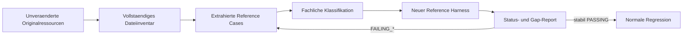

# Original USE Testbasis Migration

## Zweck dieser Datei

Diese Datei beschreibt die kontrollierte Übernahme der originalen USE-Testbasis
in das eigenständige Java-/Spring-Boot-Backend und ihre schrittweise Überführung
in eine ausführbare Original-USE-Referenztestsuite.

Die Migration umfasst:

1. unveränderte Referenzkopien,
2. vollständige Inventarisierung,
3. fachliche und technische Klassifizierung,
4. Extraktion neutraler Reference Cases,
5. Ausführung ausschließlich mit der neuen OCL-Pipeline,
6. nicht blockierende Gap-Reports,
7. gezielte Übernahme stabiler Fälle in die normale Regression.

Produktiver USE-Code, der USE-Core, die USE-GUI und alte Test-Runner sind nicht
Teil dieser Migration.

## Grundannahme

Die Nutzung und vollständige Übernahme der originalen USE-Testdateien ist im
gegebenen Universitätskontext erlaubt. Herkunft und Originalpfade müssen dennoch
dokumentiert und die Dateien als fremde, unveränderte Referenzressourcen
erkennbar bleiben.

Normative Quelle für OCL-Syntax und -Semantik ist OMG OCL 2.4. Ein Unterschied
zum originalen USE-Verhalten ist daher zunächst ein Vergleichsbefund. Erst der
Abgleich mit der Spezifikation entscheidet, ob ein Backend-Gap, eine gewünschte
USE-Kompatibilität oder ein nicht zu übernehmender Dialektfall vorliegt.

## Aktueller Umsetzungsstand

Die Migration ist noch nicht umgesetzt. Sie beginnt mit der kontrollierten
Übernahme der beiden Originalkorpora. Anschließend werden Dateiinventar,
fachliche Reference Cases, Test-Harness und Reports aufgebaut.

| Artefakt | Stand |
|---|---|
| `use-web-backend/src/test/resources/reference/original-use/parser/` | offen |
| `use-web-backend/src/test/resources/reference/original-use/shell/` | offen |
| `.../original-use/README.md` | offen |
| `.../original-use/inventory.md` | offen; folgt nach der Kopie |
| `.../original-use/inventory.json` | offen; folgt nach der Kopie |
| `use-web-backend/scripts/generate-original-use-inventory.ps1` | optionales Umsetzungsartefakt |
| fachlich klassifizierte Reference Cases | offen |
| aktive Reference-Test-Suite | offen |
| Reference-Test-Reports | offen |

Die Anzahl der `.use`-, `.fail`-, `.in`- und sonstigen Dateien wird aus den
Originalquellen ermittelt. Dateibestände und fachlich extrahierte Testfälle werden dabei
getrennt ausgewiesen; heuristische Tags gelten nicht als fachlich geprüfte
Klassifikation.

## Neue Strategie: ausführbare Reference-Test-Suite

Die Ressourcen bleiben nicht als passiver Archivordner liegen. Alle
OCL-relevanten und technisch extrahierbaren Fälle sollen einen maschinenlesbaren
Reference Case erhalten und in einer getrennten Suite ausgeführt werden.



Ein technisch extrahierbarer Fall wird nicht deaktiviert, nur weil sein Feature
noch fehlt. Er läuft soweit möglich und erhält einen beobachtbaren Status.

## Warum fehlschlagende Tests erlaubt sind

Ein fehlschlagender Referenzfall zeigt den Abstand zwischen Referenzkorpus und
aktuellem Backend. Er kann auf unterschiedliche Ursachen hinweisen:

| Ursache | Status | Bedeutung |
|---|---|---|
| OCL-Syntax oder Semantik fehlt | `FAILING_GAP` | produktseitiger Feature-Gap oder zu prüfende Abweichung |
| Erwartung liegt nur als USE-Shelltext vor | `FAILING_FORMAT` | Normalisierung/Assertion fehlt |
| Modell, Snapshot, Import oder Harness fehlt | `FAILING_INFRASTRUCTURE` | Ausführungsumgebung fehlt |
| Fall ist nicht OCL-relevant | `NON_OCL_OR_SHELL_ONLY` | bleibt sichtbar, wird aber nicht durch die OCL-Engine ausgeführt |
| Bedeutung ist nicht eindeutig | `UNCLEAR` | manueller Review notwendig |

Fehlschläge dürfen nicht pauschal als erwartete Exceptions implementiert werden.
Der Report muss erwartete Fähigkeit, beobachtetes Ergebnis und Ursache enthalten.

## Schutz der normalen CI

Normale Tests und Reference Suite besitzen getrennte Ausführungswege und
Erfolgsregeln.

| Lauf | Inhalt | Blockiert normale CI? |
|---|---|---|
| `mvn test` | normale Unit-, Service- und API-Regression | ja |
| Reference-Profil/Task | vollständige klassifizierte Original-USE-Fälle | nein bei bekannten `FAILING_*` |
| Reference-Harness-Integrität | Inventar, Metadaten, Runner und Reporter | nur separaten Reference-Job |

Der Reference-Job gilt trotz fachlicher `FAILING_*` als technisch erfolgreich,
wenn alle vorgesehenen Fälle verarbeitet und ein konsistenter Report erzeugt
wurde. Er muss fehlschlagen bei:

- nicht lesbarem Inventar oder Metadaten,
- doppelten bzw. fehlenden IDs,
- Harness-Absturz,
- fehlendem Report,
- unbekanntem Statuswert,
- still übersprungenem ausführbarem Fall.

Empfohlen ist ein Maven-Profil `original-use-reference` mit separater
Surefire-/Failsafe-Execution oder eigenem Test-Source-Set. Die endgültige
Buildentscheidung fällt beim Aufbau des Harness.

## Originale Parser-Testbasis

Originalpfad:

`use/use-core/src/test/resources/org/tzi/use/parser`

Zielpfad:

`use-web-backend/src/test/resources/reference/original-use/parser`

Alle Dateien am Originalpfad werden kontrolliert übernommen; Anzahl und
Endungsverteilung werden
im neu erzeugten Inventar dokumentiert.

| Gruppe | Bedeutung | Migrationsziel |
|---|---|---|
| positive `.use` | Modell- und Parserfälle | Modellkontext erkennen, OCL-Deklarationen extrahieren, Parse-/Typziele ableiten |
| negative `.fail` | erwartete Compiler-/Parserfehler | Fehlerphase, Kategorie und Source Location statt Meldungstext prüfen |
| `imports/` | Importauflösung | kontrollierten Testresolver und Abhängigkeitsgraphen vorbereiten |
| `test_expr.in` | Ausdrucksreferenzen | einzelne Expression Cases extrahieren |

Eine `.use`-Datei kann gleichzeitig Modellparser-, OCL-Parser-, Typechecker- und
Importfeatures enthalten. Deshalb wird nicht die ganze Datei pauschal einem
Status zugeordnet; relevante Deklarationen oder Fehlerblöcke werden eigene
Reference Cases.

## Originale Shell-Testbasis

Originalpfad:

`use/use-gui/src/it/resources/testfiles/shell`

Zielpfad:

`use-web-backend/src/test/resources/reference/original-use/shell`

Bei der Übernahme bleiben auch zusätzliche Ressourcen wie `.cmd`, `.assl`, `.clt`, `.olt` oder
Importmodelle erhalten, sofern sie am Originalpfad vorkommen, weil sie Kontext
für Shellfälle bereitstellen können. Anzahl und Endungsverteilung werden neu
ermittelt.

| Inhalt | Behandlung |
|---|---|
| `? expression` | potentieller OCL-Evaluation Case |
| Shellcommand vor `?` | Setupabhängigkeit erfassen, nicht als OCL-Ausdruck parsen |
| zugehörige `.use` | Modell-/Typkontext und Fixturequelle |
| `*`-Zeilen | erwarteten Ausgabeabschnitt dem vorherigen Inputblock zuordnen |
| SOIL/ASSL | gegebenenfalls `FAILING_INFRASTRUCTURE` oder `NON_OCL_OR_SHELL_ONLY` |
| Layout/GUI | meist `NON_OCL_OR_SHELL_ONLY` |

## Bedeutung der `.use`, `.fail` und `.in` Dateien

| Endung | Originalrolle | Neue Rolle |
|---|---|---|
| `.use` | USE-Modell mit UML-/OCL-Deklarationen | unveränderte Quelle, Fixture und Parserreferenz |
| `.fail` | absichtlich ungültiges Modell | negative Parser-/Semantikreferenz |
| `.in` | Folge von Shell-Eingaben und eingebetteten Erwartungen | Container für mehrere extrahierbare Reference Cases |

Die Originaldateien werden niemals durch normalisierte oder annotierte Varianten
ersetzt. Alle zusätzlichen Informationen liegen unter `reference/converted/`.

## Bedeutung der `*`-Erwartungszeilen

In Shelldateien beschreiben Zeilen mit Präfix `*` die erwartete Ausgabe einer
vorherigen Eingabe. Mehrere aufeinanderfolgende `*`-Zeilen gehören zu einem
Erwartungsblock.

Beispiel:

```text
? Set{true,1,'foo',3.4}
*-> Set{'foo',1,3.4,true} : Set(OclAny)
```

Die Migration speichert den Originaltext zur Provenienz, erzeugt aber eine
strukturierte Erwartung:

```json
{
  "expectedResultKind": "VALUE",
  "expectedType": "Set(OclAny)",
  "expectedValueSummary": {
    "collectionKind": "SET",
    "elements": ["foo", 1, 3.4, true],
    "orderRelevant": false
  }
}
```

Solange diese Interpretation nicht belastbar möglich ist, bleibt der Fall
`FAILING_FORMAT`. Fehlt zusätzlich das Modell- oder Snapshotsetup, hat
`FAILING_INFRASTRUCTURE` Vorrang; die Formatlücke wird als sekundäre Ursache
dokumentiert.

## Zielstruktur im neuen Backend

```text
src/test/resources/reference/
|- original-use/
|  |- README.md
|  |- inventory.md
|  |- inventory.json
|  |- parser/
|  `- shell/
|- converted/
|  `- metadata/
|     |- parser-reference-cases.json
|     `- shell-ocl-reference-cases.json
`- reports/
   |- original-use-reference-report.json
   `- original-use-reference-report.md

src/test/java/de/useweb/backend/reference/
|- OriginalUseReferenceParserTest.java
|- OriginalUseReferenceShellOclTest.java
`- OriginalUseReferenceGapReportTest.java

scripts/
|- generate-original-use-inventory.ps1
`- convert-original-use-reference-cases.ps1
```

Die Reports sind generierte Artefakte. Ob sie versioniert oder nur als
CI-Artefakte gespeichert werden, ist noch zu entscheiden. Die unveränderten
Originalressourcen und fachlich reviewten Metadaten sollen versioniert werden.

## Inventarisierungsstrategie

Die Inventarisierung folgt auf die Kopie. Sie bildet zunächst **Dateien**, noch
nicht einzelne Testfälle, ab.

### Phase A: Dateiinventar

Neu umzusetzen:

1. rekursiv alle Dateien erfassen,
2. Bereich, relativen Pfad, Endung und Größe speichern,
3. Unterordner und Dateitypen zählen,
4. Content Types und Feature Tags heuristisch erkennen,
5. Candidate-Hinweis und Annahmen dokumentieren.

### Phase B: Blockinventar

Noch umzusetzen:

1. Parsermodelle in Deklarationen und erwartete Fehlerblöcke zerlegen,
2. Shell-Inputs mit ihren `*`-Blöcken verbinden,
3. Source Line und optional Endzeile erfassen,
4. jedem Block eine stabile ID zuweisen,
5. Setupabhängigkeiten auf `.use`, Imports, Commands und Snapshots erfassen,
6. nicht erkannte Inhalte als `UNCLEAR` sichtbar lassen.

### Stabilität der IDs

Empfohlenes Schema:

```text
USE-PARSER-<relative-path-hash>-<block-index>
USE-SHELL-<relative-path-hash>-<input-line>
```

Ein Hash darf nur aus normalisiertem relativem Quellpfad entstehen, nicht aus
dem Inhalt. Dadurch bleibt die ID bei reiner Erwartungsnormalisierung stabil.
Lesbare Dateinamen können zusätzlich als Slug gespeichert werden.

## Klassifikationsschema

Jeder Reference Case erhält voneinander getrennte Dimensionen:

| Dimension | Beispielwerte |
|---|---|
| Herkunft | parser, shell |
| technische Kategorie | lexer, expression-parser, model-parser, typechecker, evaluator, validation, import, shell-scenario |
| Standardstatus | OCL_2_4, USE_COMPATIBILITY, USE_EXTENSION, UNCLEAR |
| Feature Tags | ITERATOR_FOR_ALL, COLLECTION_SET, ALL_INSTANCES, PRE_POST |
| Setupbedarf | NONE, UML_MODEL, SNAPSHOT, IMPORT_GRAPH, OPERATION_TRACE, SOIL_ASSL |
| Zieltesttyp | PARSER, TYPECHECKER, EVALUATOR, VALIDATION, API, INFRASTRUCTURE |
| Ausführungsstatus | eines der sechs Statuslabels |
| Roadmapbezug | primärer Schritt plus optionale Abhängigkeiten |

Ein Fall ist nur `NON_OCL_OR_SHELL_ONLY`, wenn nach Review keine relevante
OCL-, Modellparser-, Typ- oder Validierungsaussage extrahierbar ist.

## Statusmodell

| Status | Eintrittsbedingung | Erforderliche Dokumentation | Nächster Übergang |
|---|---|---|---|
| `PASSING` | belastbare Assertion erfüllt | beobachtetes Ergebnis und Laufversion | normale Regression prüfen |
| `FAILING_GAP` | ausführbar, erwartete Fähigkeit fehlt/abweicht | Gap-ID, Roadmap-Schritt, observed result | Feature implementieren |
| `FAILING_FORMAT` | Erwartung fachlich klar, noch nicht strukturiert | Originalausgabe und offene Normalisierung | Normalizer erweitern |
| `FAILING_INFRASTRUCTURE` | Ausführung wegen Setup/Harness unmöglich | konkrete fehlende Infrastruktur | Setup bereitstellen |
| `NON_OCL_OR_SHELL_ONLY` | keine relevante Aussage für neue Engine | Reviewbegründung | keine Ausführung nötig |
| `UNCLEAR` | Bedeutung/Standardstatus offen | konkrete Reviewfrage | fachlich klassifizieren |

`PASSING` darf nur aus einem erfolgreichen Lauf entstehen. Die übrigen Status
werden ebenfalls nicht nur aus Feature Tags abgeleitet, sondern durch Extraktion,
Ausführungsversuch und dokumentierte Triage bestimmt.

## Ausführbare Reference-Test-Suite

### Parser Runner

`OriginalUseReferenceParserTest.java` lädt die Parser-Metadaten dynamisch und
führt abhängig von `targetTestType` aus:

- isolierten OCL-Expression Parser,
- Typechecker mit minimalem Fixture,
- ModelText-/Importpfad, sofern erforderlich,
- negative Diagnoseassertionen.

### Shell OCL Runner

`OriginalUseReferenceShellOclTest.java` verarbeitet extrahierte `?`-Fälle. Es
verwendet ausschließlich neue Backend-Komponenten:

```text
normalizedExpression
-> OclLexer
-> OclParser
-> OclTypeChecker
-> OclEvaluator
-> strukturierter Vergleich
```

Shellkommandos werden nicht durch einen nachgebauten USE-Shellrunner ausgeführt.
Für notwendige Zustände wird ein eigener Fixture-/Scenario-Adapter verwendet.

### Gap Report Runner

`OriginalUseReferenceGapReportTest.java` prüft Harness-Integrität und schreibt
den aggregierten Bericht. Bekannte fachliche Gaps sind Daten im Report, keine
JUnit-Fehler. Inkonsistente Metadaten oder fehlende Verarbeitung sind echte
Fehler des Reference-Jobs.

## Reference-Test-Reports

Der JSON-Report ist maschinenlesbar; Markdown dient Review und Planung.

| Kennzahl | Nutzen |
|---|---|
| Gesamtfälle pro Korpus | Abdeckung |
| Statusanzahl und Anteil | Fortschritt |
| Gaps pro Feature/Gap-ID | Roadmapsteuerung |
| Gaps pro Pipelinephase | technische Planung |
| neue/veränderte/behobene Fälle | Driftkontrolle |
| PASSING -> FAILING_* | Referenzregression |
| Alter von FAILING_INFRASTRUCTURE | Infrastrukturstau sichtbar machen |

Jeder Reporteintrag enthält mindestens Reference-ID, Herkunft, Status,
erwartete Fähigkeit, beobachtetes Ergebnis, Gap-ID und Roadmap-Schritt.

## Metadatenformat

Die beiden Dateien

- `parser-reference-cases.json`
- `shell-ocl-reference-cases.json`

verwenden dasselbe versionierte Schema.

| Feld | Typ | Pflicht | Bedeutung |
|---|---|---:|---|
| `id` | String | ja | stabile Reference-Test-ID |
| `sourceFile` | String | ja | relativer Pfad unter `original-use/` |
| `sourceLine` | Integer | ja | 1-basierte Startzeile |
| `sourceEndLine` | Integer | nein | Ende eines mehrzeiligen Blocks |
| `originalInput` | String | ja | unveränderter Inputtext |
| `originalExpectedOutput` | String/Array | nein | unveränderte `*`-Ausgabe bzw. Fehlererwartung |
| `normalizedExpression` | String | nein | für neue OCL-Pipeline normalisierter Ausdruck |
| `category` | Enum | ja | technische/fachliche Kategorie |
| `standardStatus` | Enum | ja | OCL 2.4, USE-Kompatibilität, Extension oder unklar |
| `featureTags` | String[] | ja | benötigte Features |
| `setup` | Objekt | ja | Modell, Snapshot, Imports und Commands |
| `expectedResultKind` | Enum | ja | VALUE, TYPE, DIAGNOSTIC, VALIDATION, INFRASTRUCTURE |
| `expectedType` | String | nein | normalisierte OCL-Typbezeichnung |
| `expectedValueSummary` | Objekt/String | nein | strukturierte fachliche Erwartung |
| `currentStatus` | Enum | ja | aktueller Reference-Status |
| `failureCategory` | String | nein | konkrete Ursache bei Nicht-PASSING |
| `gapIds` | String[] | ja | Gap-Analyse-Bezug |
| `targetTestType` | Enum | ja | auszuführende Pipelineebene |
| `roadMapStep` | Integer/String | nein | primärer Roadmap-Schritt |
| `dependencySteps` | Array | nein | weitere Voraussetzungen |
| `notes` | String | nein | Annahmen und Reviewhinweise |

### Vollständiges Beispiel

```json
{
  "schemaVersion": "1.0",
  "cases": [
    {
      "id": "USE-SHELL-T038-L2",
      "sourceFile": "shell/t038.in",
      "sourceLine": 2,
      "sourceEndLine": 3,
      "originalInput": "?C.allInstances",
      "originalExpectedOutput": ["*-> Set{c1} : Set(C)"],
      "normalizedExpression": "C.allInstances()",
      "category": "OCL_EVALUATION",
      "standardStatus": "USE_COMPATIBILITY",
      "featureTags": ["ALL_INSTANCES", "PARAMETERLESS_CALL_COMPATIBILITY"],
      "setup": {
        "modelFile": "shell/t038.use",
        "snapshotCommands": [],
        "imports": []
      },
      "expectedResultKind": "VALUE",
      "expectedType": "Set(C)",
      "expectedValueSummary": {
        "collectionKind": "SET",
        "objects": ["c1"],
        "orderRelevant": false
      },
      "currentStatus": "FAILING_GAP",
      "failureCategory": "ALL_INSTANCES_NOT_IMPLEMENTED",
      "gapIds": ["OCL-GAP-010"],
      "targetTestType": "EVALUATOR",
      "roadMapStep": 25,
      "dependencySteps": [12],
      "notes": "Klammerlose USE-Schreibweise wird getrennt als Compatibility-Profil bewertet."
    }
  ]
}
```

## Beispielkonvertierung

Ausgangsblock aus einer `.in`-Datei:

```text
? 4 <= 4
*-> true : Boolean
```

Konvertierung:

1. `?` entfernen und Quellzeile speichern.
2. Ausdruck ohne semantische Änderung normalisieren: `4 <= 4`.
3. `*->` als Value-Erwartung erkennen.
4. Wert `true` und Typ `Boolean` strukturiert speichern.
5. `targetTestType = EVALUATOR` setzen.
6. Fall gegen die neue OCL-Pipeline ausführen.
7. Bei erfolgreichem Ergebnis `PASSING` berichten.

Der Originalblock bleibt vollständig in den Metadaten erhalten.

## Umgang mit PASSING

Ein Fall wird `PASSING`, wenn:

- Setup und Pipeline vollständig liefen,
- eine fachlich belastbare strukturierte Assertion existiert,
- Wert, Typ oder Diagnostic der gewählten OCL-2.4-/Kompatibilitätserwartung entspricht,
- kein unerwarteter Fehler auftrat.

Ein grüner Lauf wird nicht automatisch normaler Regressionstest. Dafür sind
fachlicher Review, deterministische Wiederholung und Relevanz erforderlich.

## Umgang mit FAILING_GAP

Jeder `FAILING_GAP` benötigt:

- mindestens eine `gapId`,
- betroffene Pipelinephase,
- erwartete Fähigkeit,
- beobachtetes Ergebnis,
- primären `roadMapStep`,
- Standard-/Kompatibilitätsklassifikation.

Pro OCL-Erweiterungsschritt wird vor Implementierung eine feste Gap-Gruppe
gewählt. Nach Implementierung werden genau diese Fälle erneut ausgeführt. Ein
Statuswechsel zu `PASSING` erfolgt nur durch erfüllte Assertions, nicht durch
Anpassung der Erwartung an fehlerhaftes Backendverhalten.

## Umgang mit FAILING_FORMAT

Die Migration rekonstruiert nicht das alte USE-Ausgabeformat. Sie extrahiert
die fachliche Erwartung und speichert sie im eigenen Metadaten- und
Assertionsmodell. Ein Stringvergleich gegen komplette Shellausgaben ist kein
Zielzustand.

Der Runner darf Parser, Typechecker oder Evaluator bereits ausführen und den
beobachteten strukturierten Wert berichten. Der Fall bleibt jedoch
`FAILING_FORMAT`, solange die ursprüngliche Shellausgabe nicht fachlich sicher
normalisiert ist.

Priorisierte Normalizer:

1. primitive Werte plus Typ,
2. Set/Bag/Sequence/OrderedSet,
3. Objekt- und Enumwerte,
4. Diagnostics mit Source Location,
5. mehrzeilige Validation-/Contract-Ausgaben.

## Umgang mit FAILING_INFRASTRUCTURE

Es wird ausschliesslich eigene, fuer das neue Backend notwendige
Testinfrastruktur aufgebaut. Produktiver USE-Code, USE-Core, alte Runner und
Shell-Lebenszyklen werden nicht uebernommen. Faelle ohne eigenstaendigen
OCL-/UML-Nutzen wechseln zu `NON_OCL_OR_SHELL_ONLY`, statt eine technische
Nachbildung des Altsystems zu erzwingen.

Dieser Status nennt die konkrete fehlende Voraussetzung:

- Modellimport,
- Importresolver,
- Snapshot/Command-Replay,
- Objektbindung,
- Operationskontext,
- Pre-/Post-Snapshot,
- noch fehlender Runner.

Sobald Ausführung möglich ist, muss der Fall zu `PASSING`, `FAILING_GAP`,
`FAILING_FORMAT` oder `NON_OCL_OR_SHELL_ONLY` wechseln. Der Status darf kein
dauerhaftes Sammelbecken für fehlende Sprachfeatures werden.

## Umgang mit NON_OCL_OR_SHELL_ONLY

Solche Fälle bleiben im Dateiinventar und gegebenenfalls als klassifizierter
Metadateneintrag sichtbar. Sie werden nicht durch die OCL-Pipeline ausgeführt.
Die Begründung nennt beispielsweise:

- ausschließlich GUI-/Layoutverhalten,
- Shell-Hilfe oder Pluginsteuerung,
- reiner ASSL-Generatorlauf,
- State-Machine-/Sequenzdiagrammsteuerung,
- altsystemspezifisches Ausgabeformat ohne fachliche Assertion.

## Umgang mit UNCLEAR

`UNCLEAR` ist ein temporärer Reviewstatus. Der Eintrag muss eine konkrete Frage
enthalten, zum Beispiel:

- Ist die Syntax OCL 2.4 oder USE-Erweiterung?
- Gehört die Erwartung zur OCL-Engine oder zur Shell?
- Welche vorherigen Commands erzeugen den benötigten Snapshot?
- Ist der alte erwartete Wert fachlich korrekt oder historisches Verhalten?

## Übergang in normale Regression

Ein Reference Case kann zusätzlich in `src/test/java` als normaler Test
übernommen werden, wenn:

1. er mehrfach deterministisch `PASSING` war,
2. die Erwartung gegen OCL 2.4 oder ein beschlossenes Kompatibilitätsprofil geprüft ist,
3. der Test ein unterstütztes Produktfeature schützt,
4. Setup und Assertion klein und wartbar sind,
5. keine Abhängigkeit zur alten USE-Runtime besteht.

Der normale Test erhält eine neue Backend-Test-ID und referenziert die
ursprüngliche Reference-ID. Der Fall bleibt zusätzlich in der Reference Suite,
damit die Korpusabdeckung vollständig bleibt.

## Roadmap-Zuordnung

Die Gap-IDs stammen aus
`11-backend-vs-original-use-gap-analysis.md`.

| Gap-Gruppe | Roadmap-Schritte |
|---|---:|
| `OCL-GAP-017A-F` Inventar, Extraktion, Format und Harness | 3-8 |
| `OCL-GAP-015/016` Source Locations und Mapping | 9 |
| `OCL-GAP-014` null/invalid | 10 |
| `OCL-GAP-002/003/008` Operatoren, Calls, Navigation | 11 |
| `OCL-GAP-004/005/006/019-022` Collections | 12-16, 27 |
| `OCL-GAP-007A-F` Iteratoren | 17-22 |
| `OCL-GAP-009/010` let, if, allInstances | 23-25 |
| `OCL-GAP-001/013` Typen, Literale und Typoperationen | 26-27 |
| `OCL-GAP-011/012` zusätzliche Kontexte/Zustände | 28-30 |
| `OCL-GAP-018` Modell-/Importinfrastruktur | koordiniert mit 2 und 32 |

Ein Fall besitzt genau einen primären Roadmap-Schritt. Zusätzliche technische
Voraussetzungen stehen in `dependencySteps`, damit Statistiken nicht doppelt
gezählt werden.

## Konkrete Migrationsschritte

| Schritt | Ergebnis | Status |
|---:|---|---|
| 1 | Originalkorpora unverändert kopieren | erledigt |
| 2 | Herkunft und Abgrenzung dokumentieren | erledigt |
| 3 | vollständiges Dateiinventar erzeugen | erledigt |
| 4 | Parserfälle blockweise extrahieren | offen |
| 5 | Shell-`?`-/`*`-Blöcke extrahieren | offen |
| 6 | Metadaten fachlich klassifizieren und reviewen | offen |
| 7 | strukturierte Expected Values/Diagnostics implementieren | offen |
| 8 | getrennten Parser- und Shell-Runner implementieren | offen |
| 9 | Status-/Gap-Reporter implementieren | offen |
| 10 | erste vollständige Reference-Baseline erzeugen | offen |
| 11 | pro OCL-Roadmapschritt Gap-Gruppen grün machen | fortlaufend |
| 12 | stabile PASSING-Fälle in normale Regression übernehmen | fortlaufend |

## Risiken

| Risiko | Auswirkung | Gegenmaßnahme |
|---|---|---|
| USE-Verhalten wird als OCL-Norm behandelt | falsche Zielsemantik | OCL 2.4 und Compatibility getrennt klassifizieren |
| vollständiger Shelltext wird verglichen | fragile Tests | strukturierte Werte, Typen und Diagnostics |
| eine Datei wird als ein Test behandelt | ungenaue Statuswerte | blockweise Reference Cases |
| heuristische Tags gelten als fachliche Wahrheit | Fehlklassifikation | Review vor belastbarer Assertion |
| `FAILING_INFRASTRUCTURE` bleibt dauerhaft | Gaps werden verdeckt | Alter und konkrete Blocker reporten |
| Reference Suite läuft in normaler CI | bekannte Gaps blockieren Entwicklung | eigenes Profil und eigener Job |
| bekannte Gaps werden ignoriert | Report wirkt grün, obwohl Harness kaputt ist | Harnessintegrität blockierend im Reference-Job |
| Originaldateien werden beim Konvertieren geändert | Provenienzverlust | nur lesen; Ergebnisse unter `converted/` |
| Testkorpus vergrößert Repository stark | Clone-/Reviewkosten | Korpus bewusst versionieren, Reports ggf. nur als CI-Artefakte |

## Offene Fragen

| Frage | Benötigte Entscheidung |
|---|---|
| Maven-Profil, JUnit-Tag oder separates Source Set? | Buildorganisation der Reference Suite |
| Werden Reports versioniert oder als CI-Artefakte gespeichert? | Drift- und Reviewprozess |
| Welche USE-Dialekte gehören zum Kompatibilitätsprofil? | erwartete Parser-/Evaluatorsemantik |
| Wie werden Shellkommandos in Backend-Fixtures übersetzt? | Abbau von `FAILING_INFRASTRUCTURE` |
| Wie werden Imports sicher und reproduzierbar aufgelöst? | kontrollierter Testresolver |
| Welche Statusänderungen erzeugen Warnung oder Reviewpflicht? | Governance des separaten Jobs |
| Nach wie vielen stabilen Läufen erfolgt Regression-Promotion? | Übergang zu normalen Tests |

## Abgeschlossene B23-Migration

Die technische Migration der Referenzerwartungen ist seit dem 22. August 2026
abgeschlossen. Das eigene Assertionsmodell liest primitive und komplexe Werte,
OCL-Typen, Collection-Arten und fachlich verwertbare Diagnosecodes, ohne alte
Shellausgaben als Produktvertrag zu behandeln. Das eigene Fixture meldet
fehlende UML-/OCL-Faehigkeiten als `FAILING_GAP`; alte `.use`-Parser-,
Importformat-, Explain- und Generatormechanismen werden begruendet als
`NON_OCL_OR_SHELL_ONLY` gefuehrt.

Der aktuelle Report umfasst 799 `PASSING`, 543 `FAILING_GAP`, 0
`FAILING_FORMAT`, 0 `FAILING_INFRASTRUCTURE`, 59
`NON_OCL_OR_SHELL_ONLY` und 17 `UNCLEAR`. Originaldateien und
Provenienzmetadaten wurden nicht veraendert.

## Zusammenfassung

Die originale USE-Testbasis soll vollständig und unverändert als
Referenzressource in das Backend übernommen werden. Die nachprüfbare Ausgangslage
entsteht durch ein Quell-/Zielmanifest mit Pfaden, Anzahlen und Prüfsummen.

Der erste technische Schritt ist die kontrollierte Referenzkopie. Darauf folgen
Dateiinventar und erst danach die blockweise Extraktion stabil identifizierter
Reference Cases mit strukturierten Metadaten. Anschließend führt ein eigener Harness alle
OCL-relevanten und technisch extrahierbaren Fälle mit der neuen Backend-Pipeline
aus. Fehlschläge bleiben als `FAILING_GAP`, `FAILING_FORMAT` oder
`FAILING_INFRASTRUCTURE` sichtbar und treiben die OCL-Roadmap, ohne die normale
CI zu blockieren.
