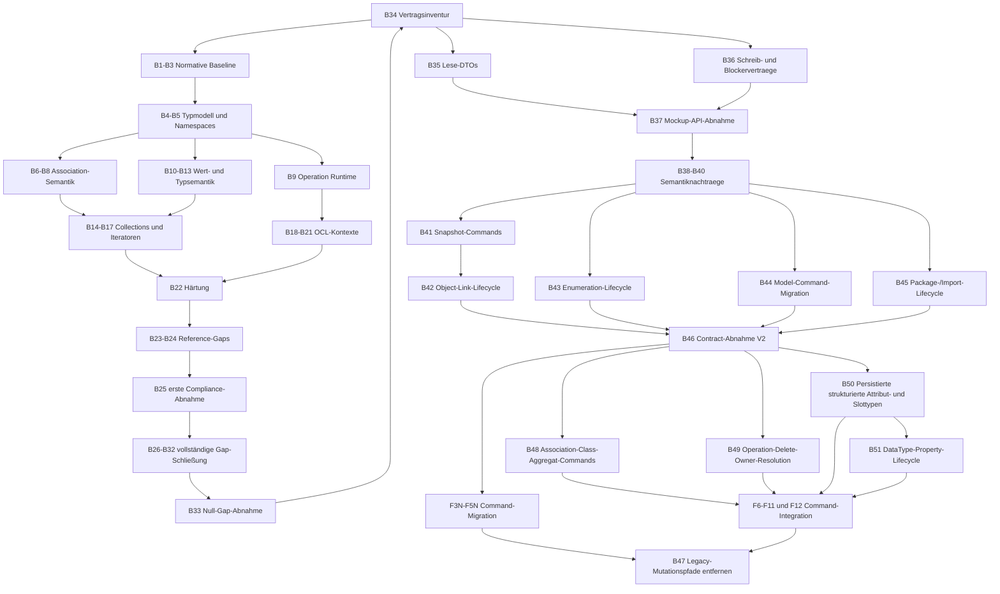

# Full OCL and UML Backend Implementation Plan

## Ziel und Abgrenzung

Dieser Plan setzt die Matrix aus
`14-full-ocl-uml-compliance-matrix.md` in eine technisch abhängige Reihenfolge
um. Er beginnt nicht mit seltenen OCL-Operationen, sondern mit den UML- und
Semantikgrundlagen, von denen korrekte OCL-Ergebnisse abhängen.

Diese Datei enthaelt ausschliesslich die Backend-Schritte. Jeder Schritt ist
einzeln umzusetzen und abzunehmen. Ein Schritt darf keine spaeteren Features
stillschweigend mitimplementieren. Die getrennten Frontend-Schritte stehen in
`17-full-ocl-uml-frontend-implementation-plan.md`; die gemeinsame Reihenfolge
und die Uebergabepunkte stehen in
`16-full-ocl-uml-implementation-coordination.md`.

Vor Beginn der Backend-Feature-Umsetzung wird zuerst die vollständige
Mockup-Phase aus `04-ui-ux-analysis/06-full-ocl-uml-mockup-roadmap.md`
abgeschlossen. Die verpflichtenden Mockups M1 bis M11 und M14 müssen
freigegeben sein. Für die optionalen Mockups M12 und M13 muss eine dokumentierte
Include-/Exclude-Entscheidung vorliegen. Erst danach beginnen die nachfolgenden
Backend-Schritte. Reine Engine- und Testfeatures benötigen zwar keine eigenen
Ansichten, werden aber ebenfalls erst nach diesem gemeinsamen Stage-Gate
umgesetzt, damit die Roadmap eine eindeutige Reihenfolge behält.

## Phase 0: Mockups vollständig erstellen und freigeben

Diese Phase liegt zeitlich vor Schritt 1 dieses Backend-Plans.

1. M1 dokumentiert die bestehende UI-Baseline und das Komponentenraster.
2. M2 bis M11 definieren sämtliche verpflichtenden UML-/OCL-Interaktionen und
   sichtbaren Zustände des Zielprofils.
3. Für M12 und M13 wird entweder ein Mockup erstellt oder fachlich dokumentiert,
   dass State Machines beziehungsweise Operation Traces nicht zum Zielprofil
   gehören.
4. M14 prüft die Mockups auf responsive Darstellung, Scrollverhalten,
   Barrierefreiheit und visuelle Konsistenz.
5. Die Mockups werden fachlich freigegeben und auf Matrix-IDs abgebildet.
6. Aus den Mockups werden Anforderungen an Domänenmodell, API und DTOs
   dokumentiert. Produktiver Backend-Code wird in Phase 0 nicht geändert.

**Akzeptanz:** Der Status `BACKEND_READY` ist dokumentiert. Kein offenes
Pflicht-Mockup besitzt ungeklärte Felder, Interaktionen oder UML-Notation.

### Kanonische Layoutreferenzen für Backendverträge

Backend-, API- und DTO-Anforderungen aus sichtbaren Zuständen werden gegen
drei gemeinsame Workspace-Referenzen gelesen:

1. `assets/mockups/workspace-model-explorer.html` für Class-Diagram-Shell,
   Model Explorer, Canvas-Aktionen und Properties-Rahmen.
2. `assets/mockups/workspace-object-explorer.html` für Object-Diagram-Shell,
   Objects, Object Links und Object Properties.
3. `assets/mockups/workspace-bottom-panel.html` für Console, Diagnostics,
   Validation Results und Invocation Results.

Layout, Fokus, Scrollen und aktive Reiter bleiben Frontendverantwortung. Die
darin dargestellten UML-/OCL-Ergebnisse, stabilen Elementreferenzen und
fachlichen Validierungen bleiben Backendverantwortung.

## Einheitlicher Ablauf jedes Schritts

1. Die betroffenen Matrix-IDs und normativen OCL-2.4-Regeln werden festgelegt.
2. Relevante `FAILING_GAP`, `FAILING_FORMAT`, `FAILING_INFRASTRUCTURE` und
   `UNCLEAR` Reference-Cases werden als feste Zielgruppe ausgewählt.
3. UML-Domänenmodell und Persistenz werden zuerst erweitert, falls erforderlich.
4. Danach folgen Lexer/Parser, AST, Typechecker und Evaluator in dieser Reihenfolge.
5. Validation, API und Frontendvertrag werden nur angepasst, wenn sich ihr
   fachlicher Vertrag ändert.
6. Positive, negative, `null`-, `invalid`- und Grenzwerttests werden ergänzt.
7. Normale Suite und getrennte Reference-Suite werden ausgeführt.
8. Statusänderungen, Matrix und öffentliches OCL-Profil werden aktualisiert.

## Phasenübersicht

| Phase | Schritte | Ergebnis |
|---|---:|---|
| 0 | Mockups M1-M14 | freigegebene Produktoberfläche und `BACKEND_READY` |
| A | B1-B3 | belastbare normative Baseline und Gap-Zuordnung |
| B | B4-B9 | vollständigeres UML-Typ-, Association- und Operationsmodell |
| C | B10-B13 | korrekte OCL-Grundwert- und Auflösungssemantik |
| D | B14-B17 | vollständige Collections, Iteratoren und Standardbibliothek |
| E | B18-B21 | Kontexte, Zustände und optionale Compliance Points |
| F | B22-B25 | Härtung, Reference-Gaps und erste Compliance-Abnahme |
| G | B26-B33 | vollständige Reference-Gap-Schließung und Null-Gap-Abnahme |
| H | B34-B37 | Mockup-zu-Backend-Vertragsabgleich und Frontend-Freigabe |

## Backend-Schritt B1: Normatives OCL-2.4-Inventar fixieren

**Status:** `ABGESCHLOSSEN` am 22. August 2026.

**Ziel:** Jede relevante Grammar Rule, Well-formedness Rule, Semantikregel und
Standard-Library-Signatur erhält eine stabile Compliance-ID.

- Enthalten: `CM-OCL-*`, `CM-LIB-*`, `CM-CTX-*` und optionale Compliance Points.
- Nicht enthalten: Implementierungsänderungen.
- Tests: Matrixschema und eindeutige IDs.
- Akzeptanz: Kein OCL-2.4-Bereich existiert nur als Freitext ohne Status.

**Tatsaechliches Ergebnis:** Das Inventar ist unter
`18-ocl-24-normative-inventory.md` dokumentiert und liegt zusaetzlich als
maschinenlesbare CSV-Testressource im Backend. `Ocl24NormativeInventoryTest`
erzwingt eindeutige IDs, Schema, Parent-Zuordnung und Einzelsignaturen. Es wurde
keine OCL-Funktion implementiert und kein oeffentlicher API-Vertrag geaendert.

## Backend-Schritt B2: Reference-Cases featureweise zuordnen

**Status:** `ABGESCHLOSSEN` am 22. August 2026.

**Ziel:** Die 824 nicht `PASSING` klassifizierten Fälle werden nach gemeinsamer
Ursache gruppiert statt einzeln geplant.

- Jeder OCL-relevante Fall erhält Matrix-ID, Phase und konkrete Blockerklasse.
- USE-spezifische Shell- oder SOIL-Fälle bleiben getrennt.
- Akzeptanz: Reports zeigen Anzahl und Status pro Matrix-ID.

**Tatsaechliches Ergebnis:** Alle 824 nicht `PASSING` klassifizierten Faelle
erhalten im Reference-Report eine `complianceMatrixId`, einen
`targetBackendStep` und eine `blockerClass`. Report-Schema 1.3 aggregiert diese
Dimensionen. Die Zuordnungsregeln und Ist-Zahlen sind in
`19-b2-reference-case-feature-mapping.md` dokumentiert. Originalressourcen,
produktive OCL-Logik und REST-Vertraege wurden nicht veraendert.

## Backend-Schritt B3: Compliance-Test-Harness ergänzen

**Ziel:** Neben USE-Kompatibilität entsteht eine normative OCL-2.4-Testsuite.

**Status:** `ABGESCHLOSSEN` am 22. August 2026.

- Data-driven Tests für Syntax, Typechecker, Evaluator und Diagnostics.
- Normative Erwartung und USE-Kompatibilität werden getrennt gespeichert.
- Akzeptanz: Jeder spätere Schritt kann gezielt eine Matrix-ID ausführen.

**Tatsaechliches Ergebnis:** Das Maven-Profil `compliance-tests` fuehrt den
getaggten `Ocl24ComplianceHarnessTest` getrennt von normaler Regression und
Original-USE-Reference-Suite aus. Acht erste normative Faelle referenzieren
B1-Inventar-IDs und Compliance-Matrix-IDs und decken alle vier geplanten
Pipelinearten ab. Mit `-Dcompliance.matrixId=<CM-ID>` kann eine Matrix-ID
gezielt ausgefuehrt werden. Details und Befehle stehen in
`20-b3-ocl-24-compliance-test-harness.md`.

## Backend-Schritt B4: UML-Generalisierung vollständig stabilisieren

**Status:** `ABGESCHLOSSEN` am 22. August 2026.

**Matrix:** `CM-UML-002`, `CM-UML-003`, `CM-OCL-005`, `CM-OCL-014`,
`CM-OCL-015`.

- Abstract Classes, Mehrfachvererbung, Zyklenerkennung und eindeutige
  Featureauflösung vervollständigen.
- LUB/Common Type und dynamischen Dispatch zentralisieren.
- `allInstances()` muss Instanzen kompatibler Untertypen einschließen.
- Akzeptanz: Diamond-, Konflikt-, abstrakte und Subtyp-Snapshotfälle sind grün.

**Tatsaechliches Ergebnis:** Der Klassen-Update-Flow persistiert `abstractClass`
und `superClassIds` atomar. Das Domänenmodell validiert unbekannte, doppelte und
selbstbezogene Generalisierungen, erkennt Zyklen und meldet nicht eindeutig
geerbte Attribute oder Operationssignaturen strukturiert. Eine zentrale
hierarchiebewusste Least-Upper-Bound-Auflösung wird vom OCL-Typechecker für
Branch-, Literal- und Collection-Typen verwendet. Abstrakte Klassen können
nicht direkt instanziiert werden; `allInstances()` berücksichtigt ihre
konkreten Untertypen. Die Details, Fehlercodes und Testnachweise stehen in
`21-b4-uml-generalization-stabilization.md`. Explizite UML-Redefinition,
vollständige Call-/Operation-Dispatch-Regeln und Evaluationsbudgets bleiben B6,
B9/B12 beziehungsweise B17 zugeordnet.

## Backend-Schritt B5: UML-Sichtbarkeit, Namespaces und Imports

**Status:** `ABGESCHLOSSEN` am 22. August 2026.

**Matrix:** `CM-UML-004`, `CM-UML-018`, `CM-OCL-001`, `CM-CTX-008`.

- `public`, `protected`, `private`, Package- und qualifizierte Namen modellieren.
- Importresolver mit Zyklusdiagnosen und stabiler Provenienz ergänzen.
- Akzeptanz: Typechecker akzeptiert und verweigert Zugriff kontextabhängig.

**Tatsaechliches Ergebnis:** Classifier, Attribute und Operationen persistieren
`PUBLIC`, `PRIVATE`, `PROTECTED` oder `PACKAGE`. Packages besitzen stabile IDs
und qualifizierte Namen; Imports speichern Quell- und Zielpackage, Alias,
Quelle und Provenienz. Der Resolver priorisiert lokale Namen, löst eindeutige
Imports und Aliase auf, akzeptiert direkte qualifizierte Namen und verweigert
mehrdeutige oder unsichtbare Zugriffe. Importzyklen, unbekannte Namespaces und
Alias-Konflikte liefern strukturierte Fehlercodes. OCL unterstützt
qualifizierte Classifier in `allInstances()`, Typoperationen und
Typdeklarationen. Details stehen in
`22-b5-visibility-namespaces-imports.md`. Vollständige Unicode-, Escape- und
Keyword-Regeln aus `CM-OCL-001` bleiben ein eigener Parser-/Lexer-Ausbau.

## Backend-Schritt B6: Association-End-Metadaten

**Status:** `ABGESCHLOSSEN`.

**Matrix:** `CM-UML-008`, `CM-UML-012`, `CM-UML-014`, `CM-OCL-013`.

- `ordered`, `unique`, `derived`, `union`, `subsets` und `redefines` persistieren.
- Navigationstypen aus End-Metadaten ableiten.
- Reflexive Rollen eindeutig auflösen.
- Akzeptanz: Navigation liefert normativ korrekte Collection-Arten.

**Tatsächliches Ergebnis:** `UmlAssociationEnd` persistiert `ordered`, `unique`,
`derived`, `union`, `subsettedEndIds` und `redefinedEndIds` mit
rückwärtskompatiblen Defaults. Das Modell prüft stabile End-IDs, unbekannte und
zyklische Referenzen, Typ-/Multiplizitätskonformität, Redefinition Context,
`union => derived` und eindeutige Rollen reflexiver Associations. Typechecker
und Evaluator berücksichtigen Navigierbarkeit und leiten bei mehrwertiger
Navigation `Set`, `Bag`, `Sequence` oder `OrderedSet` ab. Der atomare
`PUT /api/projects/{projectId}/uml/associations/{associationId}`-Vertrag ist für
F4 verfügbar. Qualifier, n-äre Associations und Association Classes bleiben
B7/B8 vorbehalten. Details stehen in `23-b6-association-end-metadata.md`.

## Backend-Schritt B7: Qualifizierte und n-äre Associations

**Matrix:** `CM-UML-009`, `CM-UML-010`, `CM-OCL-013`.

**Status:** `DONE` (22. August 2026).

- Linkmodell von binären Source-/Target-Annahmen auf endbasierte Belegung
  erweitern.
- Qualifierwerte typisieren und validieren.
- Akzeptanz: Navigation, Multiplizität und Linkidentität funktionieren für
  qualifizierte und n-äre Fälle.

**Tatsächliches Ergebnis:** Associations und Objektlinks besitzen nun eine
vollständig endbasierte Struktur mit mindestens zwei statt genau zwei Enden.
Association Ends können geordnete, typisierte Qualifierdefinitionen tragen;
Object-Link-Enden speichern die dazugehörigen Qualifierwerte. Service und
Validation prüfen vollständige Endbelegung, eindeutige End- und Qualifier-IDs,
Objekttypen sowie Qualifiertypen. Die Multiplizitätsprüfung arbeitet für ein
Zielende relativ zur Belegung aller übrigen Enden und partitioniert
qualifizierte Ziele nach Qualifierwerten. Parser, AST, Typechecker und Evaluator
unterstützen qualifizierte OCL-Navigation wie `self.items['B']`; normale
Navigation sucht Rollen über beliebig viele Association Ends. Die bestehenden
binären JSON-Verträge bleiben durch leere Qualifierlisten kompatibel. Details
und Übergabeverträge stehen in `24-b7-qualified-and-nary-associations.md`.
Association Classes und Composition bleiben ausdrücklich B8 vorbehalten.

## Backend-Schritt B8: Association Classes und Composition

**Status:** `ABGESCHLOSSEN` am 22. August 2026.

**Matrix:** `CM-UML-011`, `CM-UML-013`, `CM-OCL-013`.

- Association-Class-Instanzen besitzen Objekt- und Linkidentität.
- Composition erhält No-share-, No-cycle- und Lebenszyklusregeln.
- Akzeptanz: OCL kann Linkobjekte und deren Properties navigieren.

**Tatsächliches Ergebnis:** `UmlAssociation` bindet optional genau eine
Association Class, und `ObjectLink` bindet die korrespondierende Objektinstanz.
Service und Validation erzwingen eine kompatible Eins-zu-eins-Identität zwischen
Link und Linkobjekt. Association Ends persistieren `NONE`, `SHARED` oder
`COMPOSITE`. Für Composition werden exklusive Ownership, azyklische
Whole-Part-Graphen und rekursives Löschen von Parts samt gekoppelten
Association-Class-Objekten durchgesetzt; Shared Aggregation löst keinen Cascade
aus. Typechecker und Evaluator unterstützen die Navigation vom beteiligten
Objekt zum Linkobjekt und weiter zu dessen Properties. Der bestehende JSON- und
REST-Vertrag wurde rückwärtskompatibel erweitert. Details und Testnachweise
stehen in `25-b8-association-classes-composition.md`. Eine UI-seitige
Auswirkungsvorschau bleibt F6 vorbehalten und ist keine Backend-Semantikregel.

## Backend-Schritt B9: Operations- und Objektlebenszyklus

**Status:** `ABGESCHLOSSEN` am 22. August 2026.

**Matrix:** `CM-UML-015` bis `CM-UML-017`, `CM-OCL-025`, `CM-CTX-002` bis
`CM-CTX-006`.

- Atomaren Invocation Service mit Parameterbindung, Vor-/Nachsnapshot, Ergebnis
  und Create/Delete-Tracking bereitstellen.
- Overload und dynamischen Dispatch festlegen.
- Akzeptanz: Pre/Post und Rollback sind ohne UI ausführbar und deterministisch.

**Tatsächliches Ergebnis:** Operationssignaturen persistieren `abstract`,
`query`, Parameter-Direction und Position. Overloads werden anhand von Name und
geordneten Parametertypen unterschieden; der Resolver wählt für den Laufzeittyp
deterministisch die nächste Override-Signatur und weist Mehrdeutigkeit zurück.
Der neue Invocation Service bindet typisierte `in`-/`inout`-Argumente, prüft
eine optimistische Projektrevision und führt registrierte, eigenständige
Backend-Implementierungen auf einem isolierten Candidate Snapshot aus. Nur ein
vollständig typ- und modellvalider Candidate wird atomar gespeichert. Fehler,
Query-Mutationen und ungültige Candidates liefern Rollback ohne partielle
Persistenz. Das Ergebnis enthält fachliche Receiver-/Operationsnamen,
Rückgabe-/Out-Werte und den Create/Change/Delete-Diff. Der REST-Vertrag ist
unter `POST /api/v1/projects/{projectId}/operations/{operationId}/invocations`
verfügbar. Details stehen in `26-b9-operation-invocation-lifecycle.md`.
Pre-/Postcondition-Gates, `@pre`, `result`, `oclIsNew()` und OCL Operation Bodies
bleiben ausdrücklich B18/B19 zugeordnet.

## Backend-Schritt B10: `null`, `invalid` und Vierwertlogik

**Status:** `ABGESCHLOSSEN` am 22. August 2026.

**Matrix:** `CM-OCL-006`, `CM-OCL-007`, `CM-OCL-010`, `CM-LIB-001` bis
`CM-LIB-004`.

- Wahrheitstabellen und Invalid-Propagation zentral implementieren.
- Java `null` darf nicht als OCL-Wertsemantik verwendet werden.
- Akzeptanz: tabellengesteuerte Tests decken jede boolesche Operation ab.

**Tatsaechliches Ergebnis:** `OclBooleanLogic` bildet `true`, `false`, `null`
und `invalid` ohne Java-`null` als Laufzeitwert ab. Die vollstaendigen Tabellen
fuer `not`, `and`, `or`, `xor` und `implies` sowie OCL-Gleichheit sind zentral
implementiert und getestet. Absorbierende Ergebnisse wie `false and invalid`
und `true or invalid` unterdruecken ausschliesslich die dadurch semantisch
irrelevante Operandendiagnose. Objektgleichheit verwendet stabile Objekt-IDs;
Tuple- und geordnete Collection-Gleichheit propagieren enthaltenes `invalid`.
Die vollstaendige Spezialwertsemantik aller Collection-Operationen und
Iteratoren bleibt B14 bis B16 zugeordnet. Details und Testnachweise stehen in
`27-b10-null-invalid-four-valued-logic.md`.

## Backend-Schritt B11: Numerische und String-Standardbibliothek

**Matrix:** `CM-OCL-008`, `CM-OCL-009`, `CM-LIB-005`, `CM-LIB-006`.

**Status:** `ABGESCHLOSSEN` (22. August 2026).

- Alle vorgesehenen OCL-2.4-Signaturen inventarisieren und registrieren.
- Numeric Promotion, Division durch null, Indexregeln und String Escapes prüfen.
- Akzeptanz: Signatur-, Typ- und Werttests pro Operation.

**Tatsaechliches Ergebnis:** Die primitive Standardbibliothek besitzt nun eine
gemeinsame Signatur- und Auswertungsimplementierung fuer `String`, `Integer`,
`Real` und `UnlimitedNatural`. String-Literale unterstuetzen die normativen
Escape-Sequenzen und benachbarte Literalfragmente. String-Indizes werden
einsbasiert und Unicode-Codepoint-basiert ausgewertet. Numeric Promotion,
`div`, `mod`, Division durch null, Rundung, endliche Real-Werte und der
begrenzte Integer-Laufzeitbereich sind durch Typ- und Werttests festgelegt.
Die allgemeine Call Resolution bleibt ausdruecklich B12 zugeordnet.

Die normale Testsuite ist mit 240 Tests gruen. Die getrennte
Original-USE-Referenzsuite klassifiziert nach B11 619 Faelle als `PASSING`, 511
als `FAILING_GAP`, 113 als `FAILING_FORMAT`, 156 als
`FAILING_INFRASTRUCTURE` und 19 als `UNCLEAR`. B11 hat dabei 25 bisherige
`FAILING_GAP`-Faelle in `PASSING` ueberfuehrt. Details stehen in
`28-b11-numeric-string-standard-library.md`.

## Backend-Schritt B12: Call Resolution und Dispatch

**Matrix:** `CM-OCL-011`, `CM-OCL-012`, `CM-OCL-014`, `CM-LIB-015`.

**Status:** `ABGESCHLOSSEN` (22. August 2026).

- Ein gemeinsames Resolvermodell für Properties, Operationen, Definitions und
  Standard-Library-Overloads verwenden.
- Akzeptanz: gleiche Auflösung in Typechecker und Evaluator; keine
  namensbasierte Sonderlogik mit abweichendem Verhalten.

**Tatsaechliches Ergebnis:** `OclCallResolver` waehlt Standard-Library-
Signaturen, UML-Attribute, UML-Operationen sowie Property- und Operation-`def`
ueber ein gemeinsames typbasiertes Modell. Das Ergebnis enthaelt Call-Art,
Ergebnistyp, stabilen Feature-Identifier und fachlichen Namen. Sichtbarkeit,
Argumentkonformitaet, Spezifitaet und Mehrdeutigkeit werden vor der Auswertung
entschieden. Typechecker und Evaluator verwenden denselben Resolver; die
Definition-Runtime fuehrt den ausgewaehlten Identifier aus. Implizites `self`
funktioniert fuer Properties und Operationen. Implizite Collection-Kurzformen
bleiben B16 und Classifier-Werte B13 zugeordnet.

Die normale Testsuite ist mit 245 Tests gruen. Die getrennte Reference-Test-
Suite klassifiziert 622 Faelle als `PASSING`, 512 als `FAILING_GAP`, 112 als
`FAILING_FORMAT`, 155 als `FAILING_INFRASTRUCTURE` und 17 als `UNCLEAR`.
Details stehen in `29-b12-call-resolution-and-dispatch.md`.

## Backend-Schritt B13: Tuple, Enum, DataType und Classifier Values

**Matrix:** `CM-OCL-016`, `CM-OCL-017`, `CM-LIB-007`, `CM-UML-005`,
`CM-UML-006`.

**Status:** `ABGESCHLOSSEN` (22. August 2026).

- Strukturelle Tuple-Typen und benutzerdefinierte Werttypen vervollständigen.
- Qualifizierte Enum- und Classifiernamen unterstützen.
- Akzeptanz: Common Type, Gleichheit, Persistenz und API-Mapping sind grün.

**Tatsaechliches Ergebnis:** Tuple-Typen vergleichen ihre Parts strukturell,
unterstuetzen Breitenkonformitaet und bilden einen strukturellen Common Type.
Enumerationen besitzen optional einen Namespace und werden anhand kurzer,
qualifizierter oder importierter Namen eindeutig aufgeloest. `UmlDataType`
modelliert Value Properties ohne Objektidentitaet; strukturierte Slotwerte
werden rekursiv validiert, persistiert und ausgewertet. `oclType()` liefert
einen strukturierten `ClassifierValue` mit stabiler Classifier-ID,
qualifiziertem Namen und repraesentiertem OCL-Typ. Projekt-DTO und JSON-Format
transportieren Enumerations-Namespaces und DataTypes rueckwaertskompatibel.

Die normale Testsuite ist mit 248 Tests gruen. Die getrennte Reference-Test-
Suite klassifiziert unveraendert 622 Faelle als `PASSING`, 512 als
`FAILING_GAP`, 112 als `FAILING_FORMAT`, 155 als `FAILING_INFRASTRUCTURE` und
17 als `UNCLEAR`. Details stehen in `30-b13-tuple-enum-datatype-classifier-values.md`.

## Backend-Schritt B14: Collection-Literale und abstrakte Collection-Semantik

**Matrix:** `CM-OCL-018`, `CM-LIB-008`.

**Status:** `ABGESCHLOSSEN` (22. August 2026).

- Leere Collection, Range, Common Type, `null` und `invalid` vollständig prüfen.
- Akzeptanz: jede abstrakte Collection-Operation besitzt Typ- und Werttests.

**Tatsächliches Ergebnis:** Leere Literale, auf- und absteigende Integer-Ranges,
Common Types und die Duplikatregeln der vier Laufzeitarten sind geprüft. Die
gemeinsame Standardbibliothek unterstützt und testet `size`, `isEmpty`,
`notEmpty`, `includes`, `excludes`, `count`, `includesAll`, `excludesAll`,
`max`, `min`, `sum`, `product`, `selectByKind` und `selectByType`. Vergleiche
gegen enthaltenes `invalid` folgen jetzt der Vierwertlogik; ein sicherer Treffer
dominiert, andernfalls wird `invalid` weitergegeben. Subtypspezifische
Collection-Operationen bleiben ausdrücklich B15 vorbehalten.

Die normale Suite ist mit 252 Tests grün. Die getrennte Reference-Suite ist mit
drei Harness-Tests grün und klassifiziert 643 Fälle als `PASSING`, 491 als
`FAILING_GAP`, 112 als `FAILING_FORMAT`, 155 als `FAILING_INFRASTRUCTURE` und
17 als `UNCLEAR`. Damit wechselten 21 Collection-Fälle von `FAILING_GAP` nach
`PASSING`. Details stehen in
`31-b14-collection-literals-and-abstract-semantics.md`.

## Backend-Schritt B15: Konkrete Collection-Typen vollständig machen

**Matrix:** `CM-LIB-009` bis `CM-LIB-014`.

**Status:** `ABGESCHLOSSEN` (22. August 2026).

- Set-/Bag-Häufigkeiten sowie Sequence-/OrderedSet-Reihenfolge normgerecht
  umsetzen.
- Alle subtype-spezifischen Overloads und Ergebnisarten prüfen.
- Akzeptanz: vollständige Signaturmatrix ohne generische Listenabkürzung.

**Tatsächliches Ergebnis:** Die Standardbibliothek besitzt nun eine explizite
Signaturmatrix je konkreter Collection-Art. `Set` unterstützt Differenz und
`symmetricDifference`; `Bag` erhält seine Häufigkeiten bei Kombinationen;
`Sequence` und `OrderedSet` unterstützen die geordneten Operationen `append`,
`prepend`, `insertAt`, Slice, `at`, `indexOf`, `first`, `last` und `reverse` mit
einbasierten Indizes. Konvertierungen, `flatten`, `union`, `intersection`,
`including` und `excluding` sind hinsichtlich konkreter Ergebnisart,
Duplikaten und Ordnung geprüft. Nicht definierte Kombinationen werden bereits
in der Typprüfung abgelehnt. Iteratoroperationen bleiben B16 vorbehalten.

Die normale Suite ist mit 256 Tests grün. Die getrennte Reference-Suite ist mit
drei Harness-Tests grün und klassifiziert 670 Fälle als `PASSING`, 450 als
`FAILING_GAP`, 126 als `FAILING_FORMAT`, 155 als
`FAILING_INFRASTRUCTURE` und 17 als `UNCLEAR`. Gegenüber B14 wurden 27 weitere
Fälle grün; zusätzliche bis zur Ergebnisprüfung ausführbare Fälle machen nun
Formatabweichungen statt Language Gaps sichtbar. Details stehen in
`32-b15-concrete-collection-types.md`.

## Backend-Schritt B16: Iteratoren und implizite Collect-Semantik

**Matrix:** `CM-OCL-019` bis `CM-OCL-024`.

**Status:** `ABGESCHLOSSEN` (22. August 2026).

- Mehrere Iteratorvariablen, Vierwertlogik, Flattening und Ergebnisarten prüfen.
- Implizite Collect-/Call-Kurzformen strikt nach OCL 2.4 behandeln.
- Akzeptanz: verschachtelte Iteratoren, Shadowing und leere Collections grün.

**Tatsächliches Ergebnis:** Mehrfachvariablen werden für Quantoren als
kartesisches Produkt ausgewertet; verschachtelte Scopes, Shadowing, leere
Collections und entscheidende Vierwertfälle sind durch Pipeline-Tests belegt.
`collect`, `collectNested`, `select` und `reject` besitzen die normativen
konkreten Ergebnisarten und Invalid-Regeln. Operationsaufrufe speichern nun den
geschriebenen Navigation Operator. Ein unbekannter Punktaufruf auf einer
Collection darf dadurch auf dem Elementtyp aufgelöst und als implizites
`collect` ausgewertet werden, während echte Collection-Operationen Vorrang
haben und Pfeilaufrufe nicht umgedeutet werden.

Die normale Suite ist mit 259 Tests grün. Die getrennte Reference-Suite ist mit
drei Harness-Tests grün und klassifiziert 676 Fälle als `PASSING`, 444 als
`FAILING_GAP`, 126 als `FAILING_FORMAT`, 155 als
`FAILING_INFRASTRUCTURE` und 17 als `UNCLEAR`. Sechs Fälle wechselten durch B16
von `FAILING_GAP` nach `PASSING`. `CM-OCL-019`, `CM-OCL-020`, `CM-OCL-021` und
`CM-OCL-024` sind verifiziert; die rekursions- und budgetbezogenen Anteile von
`CM-OCL-022` und `CM-OCL-023` bleiben B17 vorbehalten. Details stehen in
`33-b16-iterators-and-implicit-collect.md`.

## Backend-Schritt B17: Rekursion, `closure`, `iterate` und Budgets

**Matrix:** `CM-OCL-022`, `CM-OCL-023`.

**Status:** `ABGESCHLOSSEN` (22. August 2026).

- Rekursions-, AST-, Token-, Zeit- und Bindingbudgets ergänzen.
- Zyklen und deterministische Ergebnisreihenfolge testen.
- Akzeptanz: Budgetüberschreitungen liefern Diagnostics statt Exceptions.

**Tatsächliches Ergebnis:** Das maschinenlesbare Profil veröffentlicht nun
Grenzen für Iteratorbindungen, Tokenzahl, AST-/Auswertungstiefe,
Auswertungszeit und Definitionsrekursion. Der Parser schützt rekursive Syntax
und misst die tatsächliche AST-Tiefe zusätzlich iterativ. Der Evaluator prüft
Tiefe und Zeit thread-sicher pro Auswertung sowie an langen `closure`- und
`iterate`-Schleifen. `closure` terminiert bei Zyklen in stabiler
Breadth-first-Reihenfolge; `iterate` und `closure` beachten das gemeinsame
Bindinglimit. Überschreitungen liefern strukturierte Diagnostics.

Die normale Suite ist mit 264 Tests grün. Die getrennte Reference-Suite ist mit
drei Harness-Tests grün und bleibt bei 676 `PASSING`, 444 `FAILING_GAP`, 126
`FAILING_FORMAT`, 155 `FAILING_INFRASTRUCTURE` und 17 `UNCLEAR`. B17 verändert
keine Referenzsyntax, sondern härtet Termination und Ressourcenverbrauch.
`CM-OCL-022` und `CM-OCL-023` sind verifiziert. Details stehen in
`34-b17-recursion-closure-iterate-budgets.md`.

## Backend-Schritt B18: Preconditions und Postconditions vollständig integrieren

**Matrix:** `CM-OCL-025`, `CM-CTX-002`, `CM-CTX-003`.

**Status:** `ABGESCHLOSSEN` (22. August 2026).

- Parameter, `self`, `result`, `@pre`, `oclIsNew()` und Objektlebenszyklus
  vollständig anbinden.
- Akzeptanz: positive, verletzte, ungültige und abgebrochene Invocations.

**Tatsächliches Ergebnis:** Operationen persistieren benannte, aktivierbare
`PRE`- und `POST`-Contracts. Die Invocation prüft Preconditions auf dem
unveränderlichen Before State, führt nur bei erfülltem Gate aus, prüft
Postconditions auf dem isolierten Candidate State und committet erst danach.
`result`, `@pre` und `oclIsNew()` sind an den jeweiligen Kontext gebunden.
Verletzte Preconditions liefern `BLOCKED` ohne Candidate State; verletzte oder
ungültige Postconditions liefern `ROLLED_BACK` mit diagnostizierbarer
Candidate-Referenz. Die normale Suite ist mit 268 Tests grün. Die getrennte
Reference-Suite ist mit drei Harness-Tests grün und bleibt bei 676 `PASSING`,
444 `FAILING_GAP`, 126 `FAILING_FORMAT`, 155 `FAILING_INFRASTRUCTURE` und 17
`UNCLEAR`. `CM-OCL-025`, `CM-CTX-002` und `CM-CTX-003` sind verifiziert. Details
stehen in `35-b18-operation-contract-runtime.md`.

## Backend-Schritt B19: Derived, Init, Body und Def vervollständigen

**Matrix:** `CM-CTX-004` bis `CM-CTX-007`.

**Status:** `IMPLEMENTED` (Package-weite und eigenständig persistierte `def`-Einträge bleiben als dokumentierter Teilaspekt offen.)

- Rekursionsdiagnosen, Abhängigkeitsgraph und Cacheinvalidierung einführen.
- Init Values atomar bei Objekterstellung anwenden.
- Akzeptanz: keine veralteten Derived-Werte nach Modelländerungen.

**Tatsächliches Ergebnis:** Derived- und Property-`def`-Werte werden innerhalb
einer Top-Level-Auswertung memoisiert; der Cache und der dynamische
Abhängigkeitsgraph sind an genau einen Snapshot-Kontext gebunden. Neue
Snapshots beginnen ohne Cache. Parametrisierte OCL-Query-Bodies werden über die
Operationsruntime ausgeführt, wenn keine imperative Implementierung registriert
ist. Init-Fehler verhindern den Objekt-Commit. Die normale Suite ist mit 271
Tests grün; die getrennte Reference-Suite bleibt bei 676 `PASSING`, 444
`FAILING_GAP`, 126 `FAILING_FORMAT`, 155 `FAILING_INFRASTRUCTURE` und 17
`UNCLEAR`. Details stehen in `36-b19-derived-init-body-def-runtime.md`.

## Backend-Schritt B20: Nicht navigierbare Associations und Sichtbarkeits-Compliance

**Matrix:** optionale Compliance Points und `CM-OCL-013`.

**Status:** `IMPLEMENTED`

- Profilentscheidung treffen und Verhalten entweder implementieren oder explizit
  ausgeschlossen lassen.
- Akzeptanz: öffentliche Profilantwort und Tests stimmen überein.

**Tatsächliches Ergebnis:** Das Profil unterstützt weder Navigation über
nicht navigierbare Association Ends noch einen Bypass der UML-Sichtbarkeit.
`OclOptionalCompliancePolicy` wird von Typechecker, Evaluator und Call-Resolver
verwendet. Die öffentliche Antwort weist `OCL-PROFILE-013` und
`OCL-PROFILE-015` als `NOT_SUPPORTED` aus. Die normale Suite ist mit 273 Tests
grün; die getrennte Reference-Suite bleibt bei 676 `PASSING`, 444
`FAILING_GAP`, 126 `FAILING_FORMAT`, 155 `FAILING_INFRASTRUCTURE` und 17
`UNCLEAR`. Details stehen in
`37-b20-optional-navigation-visibility-profile.md`.

## Backend-Schritt B21: State und Message Expressions

**Status:** `ABGESCHLOSSEN (EXCLUDE-ENTSCHEIDUNG)` am 22. August 2026.

**Matrix:** `CM-OCL-026`, `CM-OCL-027`, `CM-LIB-016`, `CM-LIB-017`,
`CM-UML-019`.

- Zuerst State-Machine- und Operation-Trace-Domänenmodell erstellen.
- Danach `oclInState`, `OclMessage`, `^` und `^^` implementieren.
- Akzeptanz: nur erforderlich, wenn diese optionalen Bereiche Teil des
  Zielprofils werden.

**Tatsächliches Ergebnis:** Die optionalen Bereiche wurden nicht in das
aktuelle Zielprofil aufgenommen. Deshalb wurden weder ein State-Machine- noch
ein Operation-Trace-Domänenmodell und auch keine produktive Syntax oder Runtime
eingeführt. Das öffentliche Profil weist `OCL-PROFILE-012` als
`NOT_SUPPORTED` und das neue `OCL-PROFILE-016` als `OUT_OF_SCOPE` aus.
Regressionstests belegen strukturierte Ablehnungen für `oclInState`, `^` und
`^^`. Die normale Suite ist mit 276 Tests grün; die getrennte Reference-Suite
bleibt bei 676 `PASSING`, 444 `FAILING_GAP`, 126 `FAILING_FORMAT`, 155
`FAILING_INFRASTRUCTURE` und 17 `UNCLEAR`. Details stehen in
`38-b21-state-message-exclusion-profile.md`.

## Backend-Schritt B22: Parser- und Evaluator-Härtung

**Status:** `ABGESCHLOSSEN` am 22. August 2026.

- Grammar-basierte Fuzztests, Recoverytests und Größenlimits ergänzen.
- Evaluationszeit, Bindings, Rekursion und Ergebnismenge budgetieren.
- Akzeptanz: keine unkontrollierten Exceptions bei generierten Eingaben.

**Tatsächliches Ergebnis:** Der Parser begrenzt Quelltextlänge und Anzahl
zurückgegebener Diagnostics, behandelt `null` kontrolliert und isoliert seinen
zustandsbehafteten Parsevorgang bei paralleler Wiederverwendung. Deterministische
grammar-basierte Mutationen und 500 generierte Eingaben laufen ohne
unkontrollierte Exception. Der Evaluator begrenzt zusätzlich Collection-
Ergebnisse auf 1000000 Elemente und weist große Ranges sowie kartesische
Produkte vor ihrer Materialisierung mit `RESULT_LIMIT_EXCEEDED` ab. Bereits
vorhandene Token-, AST-, Zeit-, Binding-, Evaluations- und
Definitionsrekursionsbudgets bleiben unverändert wirksam. Die normale Suite ist
mit 281 Tests grün; die getrennte Reference-Suite bleibt bei 676 `PASSING`, 444
`FAILING_GAP`, 126 `FAILING_FORMAT`, 155 `FAILING_INFRASTRUCTURE` und 17
`UNCLEAR`. Details stehen in `39-b22-parser-evaluator-hardening.md`.

## Backend-Schritt B23: Referenzerwartungen in die eigene Testarchitektur überführen

**Status:** `ABGESCHLOSSEN` am 22. August 2026.

**Ziel:** Fachlich relevante Erwartungen aus dem Original-USE-Korpus werden
von Shelltext und alter Testinfrastruktur entkoppelt. Das neue Backend bildet
weder das alte Ausgabeformat noch die alte Infrastruktur nach.

- Die 126 `FAILING_FORMAT`-Faelle werden in eigene typisierte Assertions fuer
  Wert, OCL-Typ, Collection-Art, Diagnostic-Code und Source Range uebersetzt.
- Die 155 `FAILING_INFRASTRUCTURE`-Faelle erhalten nur dann eigene minimale
  Modell-, Snapshot-, Import- oder Invocation-Fixtures, wenn ihr fachlicher
  Inhalt fuer das neue OCL-/UML-Backend relevant ist.
- Reine USE-Shell-, GUI-, SOIL-, ASSL- oder Altsystemfaelle werden nicht
  nachgebaut, sondern nachvollziehbar als `NON_OCL_OR_SHELL_ONLY` abgegrenzt.
- Produktive APIs, DTOs und Ausgaben werden nicht an alte USE-Strings oder
  Kommandos angepasst. Die neue Testarchitektur verwendet ausschliesslich
  eigene Runner, Fixtures und strukturierte Assertions.
- Nach der Entkopplung wird jeder Fall neu ausgefuehrt und als `PASSING`,
  `FAILING_GAP`, `NON_OCL_OR_SHELL_ONLY` oder begruendet `UNCLEAR`
  klassifiziert.
- Konsistenzpruefung: Teststrategie, Migration, Gap-Analyse, B2-Zuordnung,
  Roadmap, Compliance-Matrix und Koordinationsplan werden auf dieselbe
  Entkopplungsregel geprueft und widerspruechliche Formulierungen korrigiert.
- Akzeptanz: Kein verbleibender Fall verlangt die Nachbildung des alten
  USE-Ausgabeformats, des USE-Core oder der alten USE-Testinfrastruktur. Jeder
  verbleibende Blocker benennt stattdessen eine fachliche Luecke, eine eigene
  noch fehlende Test-Fähigkeit oder eine begruendete Nichtrelevanz.

**Tatsächliches Ergebnis:** Die vor B23 gemessenen 126 `FAILING_FORMAT`- und
155 `FAILING_INFRASTRUCTURE`-Fälle wurden vollständig aus diesen technischen
Blockerklassen überführt. Alte `Wert : Typ`-Darstellungen und fachlich
verwertbare Diagnoseausgaben werden durch den eigenen Harness in typisierte
Wert-, Typ- und Diagnostic-Code-Assertions übersetzt. Reine `.use`-Parser-,
Importformat-, Shell-Explain- und Generatorfälle werden nicht nachgebaut.
Eigene Fixture- oder Backend-Ausnahmen werden als fachliche UML-/OCL-Gaps
sichtbar. Der getrennte Lauf ergibt 799 `PASSING`, 543 `FAILING_GAP`, 0
`FAILING_FORMAT`, 0 `FAILING_INFRASTRUCTURE`, 59
`NON_OCL_OR_SHELL_ONLY` und 17 `UNCLEAR`. Details stehen in
`40-b23-reference-expectation-migration.md`.

## Backend-Schritt B24: OCL-Gaps schließen und Regression promovieren

- 543 `FAILING_GAP` nach Matrix-ID priorisiert erneut ausführen.
- Behobene Fälle zu `PASSING` umklassifizieren.
- Stabile, standardkonforme Fälle zusätzlich in normale Regression übernehmen.
- Akzeptanz: Keine offene P0-/P1-Matrix-ID ohne dokumentierte Entscheidung.

**Status:** `ABGESCHLOSSEN` (22. August 2026)

**Tatsächliches Ergebnis:** Der eigenständige semantische Vergleich promoviert
24 Reference-Fälle zu `PASSING` und entscheidet 132 USE-spezifische oder von
OCL 2.4 abweichende Erwartungen als `NON_OCL_OR_SHELL_ONLY`. Der getrennte
Lauf ergibt 823 `PASSING`, 387 `FAILING_GAP`, 0 `FAILING_FORMAT`, 0
`FAILING_INFRASTRUCTURE`, 192 `NON_OCL_OR_SHELL_ONLY` und 16 `UNCLEAR`.
Stabile Objektidentitäts- und Nullwertfälle sind in der normalen Regression
gesichert. Alle offenen P0-/P1-Matrixzeilen besitzen eine dokumentierte
Entscheidung; Details stehen in `41-b24-ocl-gap-closure-and-regression.md`.

## Backend-Schritt B25: Compliance-Abnahme und Profilversionierung

- Vollständige Syntax-, Evaluation- und optionale Compliance-Matrix erzeugen.
- `UNCLEAR` auf null reduzieren oder jeden Fall normativ entscheiden.
- Performance-, Security-, API- und Frontendverträge abnehmen.
- Profil-ID nur bei unverändertem Vertrag behalten; andernfalls versionieren.
- Akzeptanz: Jede beanspruchte Compliance-Zeile ist `VERIFIED` und durch
  reproduzierbare Tests belegt.

**Status:** `ABGESCHLOSSEN` (22. August 2026)

**Tatsächliches Ergebnis:** Das veröffentlichte Profil wurde wegen materiell
geänderter Fähigkeiten auf `use-web-ocl-2.4-subset-v2` versioniert; der
strukturell unveränderte API-Vertrag bleibt `v1`. Eine ausführbare
Abnahmematrix ordnet alle 16 Profilfeatures Syntax, Evaluation, optionaler
Compliance oder XMI sowie normalen Testnachweisen zu. Nur verifizierte Gruppen
werden als `SUPPORTED` beansprucht. Alle 16 `UNCLEAR`-Reference-Fälle wurden
normativ entschieden. Der Abschlusslauf ergibt 823 `PASSING`, 382
`FAILING_GAP`, 0 `FAILING_FORMAT`, 0 `FAILING_INFRASTRUCTURE`, 213
`NON_OCL_OR_SHELL_ONLY` und 0 `UNCLEAR`. Details stehen in
`42-b25-compliance-acceptance-and-profile-v2.md`.

## Backend-Schritt B26: Modell- und Fixture-Ausnahmen beseitigen

**Status:** `ABGESCHLOSSEN` am 22. August 2026.

- 34 Backend-Modell- oder Evaluationsausnahmen strukturiert behandeln.
- 55 minimale Fixture-Gaps auf eigene UML-/OCL-Domänenpfade abbilden.
- Keine alte USE-Import- oder Shell-Infrastruktur nachbauen.
- Akzeptanz: Beide Ausgangsursachen sind null; echte Folge-Gaps sind eindeutig B27 bis B32 zugeordnet.

**Tatsächliches Ergebnis:** Der eigenständige Reference-Harness liefert keine
`RUNNER_EXCEPTION`-Beobachtungen mehr. Laufzeitfehler beim Aufbau der kopierten
Referenzmodelle werden als kontrollierte Backend-Diagnosen erfasst. Die vormals
unspezifischen Fixture-Gaps sind nun in Association-Class-Instanziierung,
Association-Redefinition, Importauflösung und sonstige Modellvalidierung
aufgeteilt. Von den 89 Ausgangsfällen sind 10 dem Setup-OCL-Schritt B27 und 74
dem UML-/Typauflösungsschritt B29 zugeordnet. Fünf Fälle betreffen ausschließlich
alte USE-Shell- oder qualifizierte USE-Importsyntax und sind deshalb
`NON_OCL_OR_SHELL_ONLY`. Der Reference-Lauf ergibt 823 `PASSING`, 377
`FAILING_GAP`, 0 `FAILING_FORMAT`, 0 `FAILING_INFRASTRUCTURE`, 218
`NON_OCL_OR_SHELL_ONLY` und 0 `UNCLEAR`. Beide B26-Ausgangsursachen haben den
Zählwert null.

## Backend-Schritt B27: OCL-Ausdrücke im Reference-Setup ausführen

**Status:** `ABGESCHLOSSEN` am 22. August 2026.

- 61 Setup-Ausdrucksfälle über die produktive OCL-Pipeline ausführen.
- Keine zweite Parser-, Typprüfungs- oder Evaluationssemantik im Harness einführen.
- Nicht normative Shell-Kommandos ausgeschlossen lassen.
- Akzeptanz: `REFERENCE_SETUP_OCL_EXPRESSION_NOT_SUPPORTED = 0`.

**Tatsächliches Ergebnis:** Fachliche Setup-Ausdrücke durchlaufen ausschließlich
die produktiven Komponenten `OclParser`, `OclTypeChecker` und `OclEvaluator`.
Der Fixture-Loader erkennt zusätzlich gebundene Objekterzeugungen der Form
`!variable := new Class('objectName')`, ohne die Erzeugung als OCL-Ausdruck zu
interpretieren. Setup-Diagnostics werden nach Parser-, Typ-, Evaluations- oder
UML-Fixture-Ursache unterschieden und an B28, B29 beziehungsweise B31
übergeben. USE-spezifische `oclEmpty`-Aufrufe, SOIL-Operationsausführung,
Hash-Enumliterale und die ausgeschlossene State-Machine-Option werden nicht in
die neue OCL-Semantik übernommen. Der Abschlusslauf ergibt 824 `PASSING`, 342
`FAILING_GAP`, 0 `FAILING_FORMAT`, 0 `FAILING_INFRASTRUCTURE`, 252
`NON_OCL_OR_SHELL_ONLY` und 0 `UNCLEAR`.
`REFERENCE_SETUP_OCL_EXPRESSION_NOT_SUPPORTED` und
`REFERENCE_MODEL_OCL_DEFINITION_DIAGNOSTIC` haben jeweils den Zählwert null.

## Backend-Schritt B28: Verbleibende normative Syntax schließen

**Status:** `ABGESCHLOSSEN` am 22. August 2026.

- 27 allgemeine Parser-Gaps und ein Exponentialliteral-Gap normativ prüfen.
- Lexer, Parser, AST, Source Ranges und Recovery gemeinsam aktualisieren.
- USE-Dialektsyntax nicht ungeprüft übernehmen.
- Akzeptanz: Kein normativer Reference-Fall scheitert mehr in der Parserphase.

**Tatsächliches Ergebnis:** Der Lexer erkennt ganzzahlige und dezimale
Exponentialliterale mit optionalem Vorzeichen im Exponenten als `Real` und
erhält ihre vollständigen Source Ranges. `iterate` bildet mehrere deklarierte
Iteratorvariablen als geordnete AST-Liste ab; die Parse-API liefert diese
additiv als `iterators` und behält das bisherige Feld `iterator` für den ersten
Eintrag. USE-spezifische Hash-Enumliterale, Punktaufrufe von `mod`, unäres Plus
und untypisierte Tuple-Kurzsyntax wurden nicht übernommen, sondern im
Reference-Harness explizit als Nicht-OCL klassifiziert. Die sechs vermeintlichen
Parserfälle aus `shell/t109.in` entstehen beim Einlesen mehrzeiliger
Modelloperationen und werden deshalb als UML-Reference-Fixture-Gap an B29
übergeben. Der Abschlusslauf ergibt 826 `PASSING`, 314 `FAILING_GAP`, 0
`FAILING_FORMAT`, 0 `FAILING_INFRASTRUCTURE`, 278
`NON_OCL_OR_SHELL_ONLY` und 0 `UNCLEAR`. Die Ursachen
`OCL_PARSE_FEATURE_NOT_SUPPORTED` und
`OCL_EXPONENTIAL_REAL_LITERAL_NOT_SUPPORTED` haben jeweils den Zählwert null.

## Backend-Schritt B29: Nicht-collectionbezogene Typregeln schließen

**Status:** `ABGESCHLOSSEN` am 22. August 2026.

**Matrix:** `CM-OCL-014`, `CM-LIB-001`, `CM-LIB-003`, `CM-LIB-004`.

- 44 nicht-collectionbezogene Typregel-Gaps bearbeiten.
- Resolver, primitive Signaturen, Typoperationen, LUB und UML-Featurezugriffe vereinheitlichen.
- Typechecker und Evaluator müssen dieselbe Auflösung verwenden.
- Akzeptanz: Kein beanspruchter nicht-collectionbezogener Typregel-Gap bleibt offen.

**Tatsächliches Ergebnis:** Der gemeinsame Standardbibliotheks-Resolver kennt
`Boolean::toString()` und die Type-Argument-Auflösung kennt `OclVoid` und
`OclInvalid`. Typechecker und Evaluator verwenden damit dieselben Signaturen
und Laufzeittypen. Erwartete Typdiagnosen gelten als bestandene
Diagnostikreferenzen; die USE-spezifischen Aliase `isUndefined()` und
`isDefined()` werden ausdrücklich nicht als OCL 2.4 übernommen. Die
Schrittzuordnung trennt Collection- und Iteratorausdrücke jetzt von B29 und
weist sie B30 zu. Im Abschlussreport verbleibt unter B29 kein Fall mit der
Ursache `OCL_TYPE_RULE_NOT_SUPPORTED`. Die weiterhin B29 zugeordneten 162
Fälle tragen ausschließlich konkrete UML-Reference-Fixture-Ursachen und sind
keine offenen nicht-collectionbezogenen Typregeln. Der Gesamtreport enthält
906 `PASSING`, 230 `FAILING_GAP`, 0 `FAILING_FORMAT`, 0
`FAILING_INFRASTRUCTURE`, 282 `NON_OCL_OR_SHELL_ONLY` und 0 `UNCLEAR`.

## Backend-Schritt B30: Collection- und Iterator-Typregeln schließen

**Status:** `ABGESCHLOSSEN` (2026-08-22)

- 127 Collection- und Iterator-Typregel-Gaps bearbeiten.
- Overloads, konkrete Ergebnisarten, Common Types und Spezialwertpropagation prüfen.
- Geordnete und ungeordnete Semantik strikt unterscheiden.
- Akzeptanz: Kein Collection- oder Iteratorfall scheitert wegen einer fehlenden Typregel.

**Tatsächliches Ergebnis:** `including` bestimmt den gemeinsamen Elementtyp nun
auch für unterschiedliche Classifier und verschachtelte konkrete
Collection-Arten. Leere Collections liefern für `min` und `max` den statischen
Bottom Type `OclVoid`. Punktnavigation wird gegenüber Pfeilnavigation im AST,
Typechecker und Evaluator unterschieden und als implizites `collect` mit
korrekter Bag-/Sequence-Ergebnisart ausgewertet. Das gilt auch für
parameterlose Primitive-Operationen und Type-Argument-Operationen. `one`
unterstützt mehrere Iteratorvariablen über kartesische Bindungen. Implizite
Iterator-Kurzformen ohne Variablendeklaration werden als Iterator-AST
repräsentiert; für Tuple-Quellen stehen die Parts im impliziten Scope zur
Verfügung. Der aktuelle Reference-Report enthält unter B30 keinen Fall mit
`OCL_TYPE_RULE_NOT_SUPPORTED`. Fünf vorher fälschlich dort geführte Fälle ohne
Referenz-Classifier-, Enum- oder Objektkontext tragen nun konkrete
UML-Reference-Fixture-Ursachen. Der Gesamtreport enthält 910 `PASSING`, 216
`FAILING_GAP`, 0 `FAILING_FORMAT`, 0 `FAILING_INFRASTRUCTURE`, 292
`NON_OCL_OR_SHELL_ONLY` und 0 `UNCLEAR`.

## Backend-Schritt B31: Verbleibende Evaluationssemantik schließen

**Status:** `ABGESCHLOSSEN` am 24. August 2026.

- Sieben Fälle mit `OCL_EVALUATION_NOT_SUPPORTED` bearbeiten.
- Vierwertlogik, Objektidentität, Snapshotbindung und Collection-Arten einhalten.
- Jeden neuen Laufzeitpfad in die normale Regression übernehmen.
- Akzeptanz: `OCL_EVALUATION_NOT_SUPPORTED = 0`.

**Tatsächliches Ergebnis:** Der Evaluator führt mehrvariabliges `iterate` über
deterministische kartesische Bindungen unter dem vorhandenen Binding-Budget
aus. `sortedBy` unterstützt die normative implizite Iteratorform ohne explizite
Variable und bewahrt die konkrete Ergebnisart. Operationsaufrufe auf `null`
oder `invalid` propagieren normatives `invalid`, ohne eine sachlich falsche
Laufzeit-Auflösungsdiagnose zu erzeugen. Objektwertige Snapshot-Slots werden
über stabile Objekt-ID oder fachlichen Objektnamen aufgelöst und gegen den
deklarierten Classifier geprüft. Erwartete Evaluationsdiagnosen werden im
getrennten Reference-Harness als solche erkannt. Der Abschlusslauf ergibt 918
`PASSING`, 205 `FAILING_GAP`, 0 `FAILING_FORMAT`, 0
`FAILING_INFRASTRUCTURE`, 295 `NON_OCL_OR_SHELL_ONLY` und 0 `UNCLEAR`.
`OCL_EVALUATION_NOT_SUPPORTED` hat den Zählwert null.

## Backend-Schritt B32: Werte und Diagnostics normativ angleichen

Status: `ABGESCHLOSSEN`.

B32 vergleicht Collection-Laufzeittypen einschliesslich Elementtyp, fuehrt
deklarierte `let`-Typen fuer die statische `sortedBy`-Ergebnisart mit und
erhaelt `ordered` in den Reference-UML-Fixtures. Nicht normative USE-Regeln
werden explizit abgegrenzt und nicht produktiv nachgebildet. Der Abschlusslauf
ergibt 937 `PASSING`, 146 `FAILING_GAP`, 0 `FAILING_FORMAT`, 0
`FAILING_INFRASTRUCTURE`, 335 `NON_OCL_OR_SHELL_ONLY` und 0 `UNCLEAR`.
Alle B32-Mismatch-Ursachen sind null. Das vollstaendige Ergebnis steht in
`47-b32-structured-result-and-diagnostic-alignment.md`.

### Tatsaechlich genutzte Analyse-Dateien

- `00-overview/03-documentation-map.md`
- `07-integration-and-api/07-dto-reference.md`
- `09-ocl-extension-analysis/14-full-ocl-uml-compliance-matrix.md`
- `09-ocl-extension-analysis/15-full-ocl-uml-implementation-plan.md`
- `09-ocl-extension-analysis/16-full-ocl-uml-implementation-coordination.md`
- `09-ocl-extension-analysis/43-post-b25-reference-gap-closure-plan.md`
- `09-ocl-extension-analysis/46-backend-step-analysis-file-traceability.md`

- 22 strukturierte Ergebnisabweichungen und vier Diagnostic-Abweichungen bearbeiten.
- Werte nach OCL-Typ und -Semantik statt nach USE-Ausgabetext vergleichen.
- Diagnostics anhand Code, Phase und Source Range prüfen.
- Akzeptanz: Alle vier zugeordneten Mismatch-Ursachen sind null.

## Backend-Schritt B33: Null-Gap-Abnahme und Profil v3

Status: `ABGESCHLOSSEN`.

B33 schliesst fuenf echte Gaps fuer ausgelassene Iteratorparameter. Die
verbleibenden alten USE-Modell-/Shell-Fixture-Signale sowie eine abweichende
USE-Invalid-Regel sind keine Produktanforderungen und bleiben sichtbar als
`NON_OCL_OR_SHELL_ONLY`. Der Abschlussstand enthaelt 942 `PASSING`, 0
`FAILING_GAP`, 0 `FAILING_FORMAT`, 0 `FAILING_INFRASTRUCTURE`, 476
`NON_OCL_OR_SHELL_ONLY` und 0 `UNCLEAR`. Profil v3 ist als
`use-web-ocl-2.4-subset-v3` veroeffentlicht; Details stehen in
`48-b33-null-gap-acceptance-and-profile-v3.md`.

### Tatsaechlich genutzte Analyse-Dateien

- `00-overview/03-documentation-map.md`
- `09-ocl-extension-analysis/13-ocl-compliance-profile.md`
- `09-ocl-extension-analysis/14-full-ocl-uml-compliance-matrix.md`
- `09-ocl-extension-analysis/15-full-ocl-uml-implementation-plan.md`
- `09-ocl-extension-analysis/16-full-ocl-uml-implementation-coordination.md`
- `09-ocl-extension-analysis/43-post-b25-reference-gap-closure-plan.md`
- `09-ocl-extension-analysis/46-backend-step-analysis-file-traceability.md`

- Normale, normative und getrennte Reference-Suite vollständig ausführen.
- Zielwerte für `FAILING_GAP`, `FAILING_FORMAT`, `FAILING_INFRASTRUCTURE` und `UNCLEAR` sind jeweils null.
- Bewusst entschiedene `NON_OCL_OR_SHELL_ONLY`-Fälle dürfen bestehen bleiben.
- Profil v3 veröffentlichen, wenn Fähigkeiten oder Status gegenüber v2 geändert wurden.
- Akzeptanz: Jede beanspruchte Profilzeile ist `VERIFIED`; alle Reports sind reproduzierbar.

Die vollständige Abgrenzung, Ausgangszahlen und Mockup-Regel stehen in
`43-post-b25-reference-gap-closure-plan.md`.

## Backend-Schritt B34: Mockup-zu-Backend-Vertragsinventur

**Status:** `ABGESCHLOSSEN` am 27. August 2026.

**Ziel:** Für jeden verpflichtenden Mockup-Zustand wird nachgewiesen, ob das
Backend die benötigten Daten, Aktionen und strukturierten Fehler bereits
liefert. B34 implementiert noch keine neue Fachfunktion.

- Den kanonischen Index aus `04-ui-ux-analysis/48-mockup-file-naming.md`
  vollständig gegen Domänenmodell, Services, REST-Endpunkte und DTOs prüfen.
- Pro Mockup-Feld festhalten: Backend-Quelle, stabile ID, fachlicher Name,
  Read-/Write-Verhalten, Nullability und Berechtigungs- beziehungsweise
  Read-only-Regel.
- Pro Aktion festhalten: Endpoint, Request, Response, Fehlercodes,
  Nebenwirkungen und erwartete Modellrevision.
- Die Inventur als versionierte Matrix mit mindestens den Spalten Mockup,
  UI-Zustand, F-Schritt, Backend-Faehigkeit, Endpoint/DTO, Fehlercodes,
  Status und Folgeschritt ablegen.
- Rein visuelle Zustände ausdrücklich als `FRONTEND_ONLY` kennzeichnen.
- Fehlende Verträge B35 oder B36 zuordnen; echte UML-/OCL-Semantiklücken nicht
  als bloße DTO-Lücke behandeln.
- Akzeptanz: Alle kanonischen Mockups besitzen eine vollständige
  Vertragszuordnung ohne `UNCLEAR`.

**Ergebnis:** Die versionierte Inventur steht in
`49-b34-mockup-backend-contract-matrix-v1.md`. Die fortgeschriebene Version erfasst 46 kanonische
Mockups und 12 Querschnittszustände ohne `UNCLEAR`, trennt B35-/B36-Verträge
von echten Semantiklücken und gleicht vorgeschlagene Mockup-Fehlercodes
gegen den realen Backendkatalog ab.

## Backend-Schritt B35: Vollständige Lese- und Ergebnis-DTOs

**Status:** `ABGESCHLOSSEN` am 28. August 2026.

**Ziel:** Das Frontend kann alle fachlichen Eigenschaften und Zustände aus den
Mockups darstellen, ohne UML- oder OCL-Semantik selbst zu berechnen.

- Geerbte Features und Objekt-Slots mit definierendem Classifier ausliefern.
- `static`, `derived`, `readOnly`, Wertstatus (`VALUE`, `NULL`, `INVALID`)
  und strukturierte Diagnostic-Referenzen explizit modellieren. `LOADING`
  bleibt ein Frontendzustand und wird nicht als fachlicher Wert persistiert.
- Enumeration-, DataType-, Tuple- und Collection-Werte typisiert übertragen;
  Set, Bag, Sequence und OrderedSet unterscheidbar erhalten.
- Generalization-/Redefinition-Konflikte, Association-Class-Instanzen,
  n-aere Object Links sowie Ordered-/Unique-Ergebnisse strukturiert liefern.
- Package-/Import-Baeume mit qualifizierten Namen, stabilen IDs und
  Read-only-Herkunft bereitstellen.
- Bestehende API-v1-Verträge kompatibel erweitern oder eine dokumentierte
  Versionierungsentscheidung treffen.
- Akzeptanz: Komponenten- und Controller-Tests decken jeden in B34 als fehlend
  markierten Lesevertrag ab.

**Ergebnis:** Der additive API-v1-Endpoint
`GET /api/v1/projects/{projectId}/read-model` liefert die versionierte
Frontendprojektion für Explorer, Vererbung, geerbte Features, Definitions-,
Slot-, Wert-, Object-Link- und Diagnostic-Ergebnisse. Details und Testnachweise
stehen in `50-b35-read-and-result-contracts.md`. Zwei vermeintliche DTO-Lücken
für Class-/Package-`def` wurden als echte Domain-/Persistenzlücke S3 korrigiert;
S1/S2 wurden nicht vorgezogen.

## Backend-Schritt B36: Schreib-, Lösch- und Blockerverträge

**Status:** `ABGESCHLOSSEN` am 28. August 2026.

**Ziel:** Alle in den Mockups vorgesehenen fachlichen Aktionen besitzen einen
atomaren Backend-Befehl mit nachvollziehbarem Ergebnis.

- Create-/Update-Verträge für Classifier, Attribute, Operations, Definitions,
  Generalizations, Associations, Invariants, Objects und Object Links prüfen
  und nur belegte Lücken ergänzen.
- Association Classes, Qualifier, n-aere Ends, Redefinitionsbeziehungen,
  typisierte Slots und strukturierte Collection-Werte berücksichtigen.
- Delete-Impact, Referenzblocker und erlaubte Cascade-Auswahl mit stabilen
  Elementreferenzen liefern; verbleibende Referenzen blockieren das Löschen.
- Abstrakt-Schalten einer Klasse mit direkten Instanzen und Änderungen an
  derived/read-only/static Features als strukturierte Konflikte beantworten.
- Jeder erfolgreiche Befehl liefert die neue Modell- oder Snapshot-Revision;
  Fehler bleiben seiteneffektfrei.
- Akzeptanz: API-Integrationstests decken Erfolg, Validation, Conflict,
  Not-found und konkurrierende Revision für jede ergänzte Aktion ab.

**Ergebnis:** Die additive API-v1-Command-Schicht stellt atomare, revisions-
geschuetzte Class-, Generalization-, Operation-, Association-, Invariant- und
DataType-Befehle sowie Delete-Impact, explizite Cascades und strukturierte
Blocker bereit. Fehler enthalten den vollstaendigen Draft und stabile
Elementreferenzen. `delete-definition` wurde nicht als scheinbarer Command
implementiert, sondern korrekt der bereits durch B35 bestaetigten Semantikluecke
S3 zugeordnet. Details und Testnachweise stehen in
`51-b36-write-delete-and-blocker-contracts.md`.

## Backend-Schritt B37: Mockup-API-Contract-Acceptance

**Status:** `ABGESCHLOSSEN - ABNAHME BESTANDEN` am 28. August 2026.

**Ziel:** Der Backendvertrag für die Frontend-Schritte F1-F11 und F12 wird vollständig
und reproduzierbar freigegeben.

- Alle Zuordnungen aus B34 automatisiert oder durch versionierte
  Contract-Fixtures prüfen.
- Nachweisen, dass das Frontend weder Vererbung, Redefinition,
  Association-Semantik, Typkompatibilität noch OCL-Auswertung berechnen muss.
- API-/DTO-Dokumentation, Fehlercodekatalog und Koordinationsübergaben auf den
  tatsächlichen Stand aktualisieren.
- Normale Regression und getrennte Reference-Suite ausführen. B33s
  Null-Gap-Stand darf nicht regressieren.
- Neue fachliche Standardlücken führen zu einem eigenen, explizit geplanten
  Semantikschritt und werden nicht in der Acceptance kaschiert.
- Akzeptanz: Jeder verpflichtende Mockup-Zustand ist `SUPPORTED` oder
  nachweislich `FRONTEND_ONLY`; F1-F11 und F12 erhalten den Status `BACKEND_CONTRACT_READY`.
- Ergebnisartefakte: versionierte Contract-Matrix, aktualisierte
  API-/DTO-Referenz, Fehlercodekatalog und ausführbarer Acceptance-Report.

**Abnahmeergebnis:** Die erneute ausführbare Abnahme nach B38-B40 erfasst alle
46 kanonischen Mockups. 45 fachliche Zustände sind `SUPPORTED`, ein rein
visueller Zustand ist `FRONTEND_ONLY`; kein `MISSING_*`, `UNCLEAR` oder
ungeplanter fachlicher Vertrag verbleibt. Normale Suite und getrennte
Reference-Suite sind grün, der B33-Null-Gap-Stand bleibt erhalten.
`BACKEND_CONTRACT_READY` ist für F1-F11 und F12 gesetzt. Der vollständige Befund steht
in `52-b37-mockup-api-contract-acceptance.md`.

## Backend-Schritt B38: Explizite Feature-Redefinition (S1)

**Status:** `ABGESCHLOSSEN` am 28. August 2026.

- Stabile Redefinitionsbeziehungen für Properties und Operations modellieren.
- Konformität, Mehrfachvererbungs-Konflikte und OCL-Dispatch backendseitig
  entscheiden und strukturiert projizieren.
- Read-, Command-, Diagnostic- und Revision-Verträge für F2 bereitstellen.
- `CM-UML-003` erst nach Domain-, API- und Regressionstests aktualisieren.

**Ergebnis:** Attribute und Operationen besitzen stabile explizite
Redefinitionsziele. Domainvalidierung, OCL-Dispatch, JSON-Roundtrip, Read Model,
revisionsgeschützter atomarer Command, Draft-/Konfliktvertrag und Delete-
Blocker sind umgesetzt und getestet. Details stehen in
`53-b38-explicit-feature-redefinition.md`. Die nachfolgenden Schritte B39,
B40 und die erneute B37-Abnahme sind inzwischen abgeschlossen.

## Backend-Schritt B39: Statische Features und Classifier-Werte (S2)

**Status:** `ABGESCHLOSSEN` am 28. August 2026.

- `isStatic` fachlich modellieren und statische Werte getrennt von
  Objekt-Slots persistieren.
- Typisierte Classifier-Werte, Null-/Invalid-Status, Revisionen und
  strukturierte Fehler für F2/F10 bereitstellen.
- Sicherstellen, dass statische Attribute niemals Objekt-Slots erzeugen.

**Ergebnis:** `UmlAttribute` modelliert `staticAttribute` und einen getrennt
persistierten typisierten `classifierValue`. Read Model, revisionsgeschützter
Update-Command, strukturierte Fehler, OCL-Classifier-Auflösung und JSON-
Roundtrip sind umgesetzt; Objektinstanzen erzeugen und akzeptieren dafür keine
Slots. Details stehen in `54-b39-static-classifier-values.md`. B40 und die
erneute B37-Abnahme sind inzwischen abgeschlossen.

## Backend-Schritt B40: Persistierte Class-/Package-Definitionen (S3)

**Status:** `ABGESCHLOSSEN` am 28. August 2026.

- Property-/Operation-Definitionen mit stabiler ID, Class- oder Package-Owner,
  Namespace und Source Range persistieren.
- Auflösung, Dispatch, Zyklen, Invalidierung sowie Create/Update/Delete mit
  Blockern und Revisionen vollständig backendseitig implementieren.
- Read-, Command- und Diagnostic-Verträge für F9 bereitstellen und
  `CM-CTX-007`/`OCL-PROFILE-011` erst nach Regression aktualisieren.

**Ergebnis:** Class- und Package-Definitionen besitzen persistente stabile IDs,
Owner-/Namespace- und Source-Range-Metadaten. API-v1 bietet Read,
Create/Update, Delete Impact und Delete mit Revision, Draft-Erhalt,
strukturierten Diagnostics und Referenzblockern. Class-Definitionen sind in
den typisierten Runtime-Dispatch eingebunden; Package-Definitionen bleiben
korrekt `self`-frei. Details: `55-b40-persisted-class-package-definitions.md`.
Die erneute B37-Abnahme ist bestanden; `BACKEND_CONTRACT_READY` ist gesetzt.

## Backend-Schritt B41: Revisionsgeschuetzte Snapshot-Commands

**Status:** `ABGESCHLOSSEN` (29. August 2026).

**Ziel:** Alle fachlichen Mutationen am Object Model verwenden denselben
revisionsgeschuetzten, atomaren und Draft-erhaltenden Command-Vertrag wie die
Model-Mutationen.

- Eigene Request-DTOs fuer Object Create, Slot Update und Object-Link Create
  einfuehren; Response-DTOs duerfen nicht mehr zugleich Command-DTOs sein.
- `expectedRevision` auf Basis der Snapshotrevision verpflichtend machen und
  bei Erfolg die neue Snapshotrevision liefern.
- `REVISION_CONFLICT`, Validation, Not Found und Conflict mit vollstaendigem
  Draft sowie stabilen Object-, Slot-, Association-End- und Qualifier-IDs
  ausgeben.
- Create Object, Update Slot und Create Object Link atomar und bei Fehlern
  seiteneffektfrei ausfuehren.
- Die bestehenden API-v1-Endpunkte kompatibel migrieren oder neue
  `/commands/object-model/...`-Endpunkte additiv bereitstellen.
- B41 implementiert noch keinen Object-Link-Update- oder Delete-Impact-
  Workflow; diese gehoeren zu B42.

**Betroffene Frontendschritte:** F5, F6, F10 und F12.

**Akzeptanzkriterien:** Erfolg, Validation, Not Found und Revision Conflict sind
fuer alle drei Mutationstypen getestet; konkurrierende Snapshotaenderungen
koennen sich nicht unbemerkt ueberschreiben; JSON-Roundtrip und Draft-Erhalt
sind nachgewiesen.

**Ergebnis:** Die additiven API-v1-Endpunkte unter
`/commands/object-model` besitzen getrennte Request-Drafts fuer Object Create,
Slot Update und Object-Link Create. `expectedRevision` ist verpflichtend,
Erfolge liefern die neue `SNAPSHOT`-Revision und strukturierte fachliche
Referenzen. Validation, Not Found und stale Revision erhalten den vollstaendigen
Draft; die drei Mutationen sind pro Projekt serialisiert und speichern erst
nach vollstaendiger Domainvalidierung. Legacy-Endpunkte bleiben kompatibel.
Object-Link-Update und Delete-Lifecycle bleiben B42. Details:
`56-b41-revision-protected-snapshot-commands.md`.

## Backend-Schritt B42: Object-Link-Update und strukturierter Delete-Lifecycle

**Status:** `ABGESCHLOSSEN`.

**Ziel:** Bestehende binaere, qualifizierte, n-aere und Association-Class-Links
koennen atomar aktualisiert und nachvollziehbar geloescht werden.

- Revisionsgeschuetzten Update-Command fuer Association, End-Zuordnungen,
  Qualifierwerte und `associationClassObjectId` bereitstellen.
- Vollstaendige Multiplizitaets-, Qualifier-, Ordered-/Unique-, n-aere,
  Association-Class- und Composition-Validierung backendseitig wiederverwenden.
- Delete Impact fuer `OBJECT_LINK` mit stabilen Referenzen, Blockern,
  erlaubten Cascades und Navigationszielen bereitstellen.
- Das implizite Loeschen eines Association-Class-Objekts ausdruecklich als
  erlaubte und dokumentierte Cascade modellieren.
- Direkten Object-Delete und generischen Command-Delete semantisch angleichen;
  verbleibende Referenzen duerfen nicht durch einen Legacy-Endpunkt umgangen
  werden.
- Fehler duerfen keine Teilmutation an Link, Linkobjekt oder Layout persistieren.

**Abhaengigkeit:** B41.

**Betroffene Frontendschritte:** F5, F6 und F12.

**Akzeptanzkriterien:** Update und Delete liefern neue Snapshotrevisionen;
Blocker und Cascades sind reproduzierbar; nicht ausgewaehlte Referenzen
blockieren; binaere, qualifizierte, n-aere, Ordered-/Unique- und
Association-Class-Faelle sind getestet.

**Ergebnis:** `PUT .../commands/object-model/links/{linkId}` aktualisiert den
vollstaendigen Link-Draft unter Beibehaltung der stabilen Pfad-ID und verwendet
dieselbe End-, Qualifier-, Duplicate-, Association-Class- und
Composition-Validierung wie Create. `GET .../links/{linkId}/delete-impact`
trennt Kontext, feste Blocker, erlaubte Cascades und Revalidierungsziele;
`DELETE .../links/{linkId}` verlangt Snapshotrevision und ausdrueckliche
Auswahl der Association-Class-Identitaet. Fremde Links auf das Linkobjekt
blockieren. Der Legacy-Object-Delete entfernt referenzierte Links nicht mehr
stillschweigend; nur der gepruefte Command-Pfad darf bestaetigte Abhaengigkeiten
atomar entfernen. Details: `57-b42-object-link-update-delete-lifecycle.md`.

**Tatsaechlich genutzte Analyse-Dateien:**
`00-overview/03-documentation-map.md`,
`04-ui-ux-analysis/30-object-link-association-sidebar.md`,
`04-ui-ux-analysis/31-object-properties-validation-and-delete.md`,
`04-ui-ux-analysis/40-delete-object-link-modal.md`,
`04-ui-ux-analysis/41-association-class-instance.md`,
`04-ui-ux-analysis/47-unified-object-associations.md`,
`04-ui-ux-analysis/48-mockup-file-naming.md`,
`07-integration-and-api/01-frontend-backend-contract.md`,
`07-integration-and-api/07-dto-reference.md`,
`07-integration-and-api/08-error-contract.md`,
`09-ocl-extension-analysis/15-full-ocl-uml-implementation-plan.md`,
`09-ocl-extension-analysis/16-full-ocl-uml-implementation-coordination.md`,
`09-ocl-extension-analysis/49-b34-mockup-backend-contract-matrix-v1.md`,
`09-ocl-extension-analysis/52-b37-mockup-api-contract-acceptance.md`,
`assets/mockups/association-class-instance.html`,
`assets/mockups/delete-object-link-modal.html`,
`assets/mockups/object-link-association-sidebar.html`,
`assets/mockups/object-link-association-sidebar-ordered-unique.html` und
`assets/mockups/object-properties-associations.html`.

## Backend-Schritt B43: Vollstaendiger Enumeration-Lifecycle

**Status:** `ABGESCHLOSSEN`.

**Ziel:** Enumerationen sind nicht nur lesbar, sondern besitzen vollstaendige
revisionsgeschuetzte Create-, Update- und Delete-Vertraege.

- Enumeration mit stabiler ID, Name, Package, Visibility und geordneten
  Literalen erstellen und aktualisieren.
- Literale mit stabiler ID erstellen, umbenennen, umordnen und loeschen.
- Eindeutigkeit, Namespacekonflikte, leere oder doppelte Literale und
  Typreferenzen backendseitig validieren.
- Delete Impact fuer Enumeration und Literal mit Referenzen aus Attributen,
  Parametern, DataTypes, Slots, Qualifierwerten und OCL-Ausdruecken liefern.
- Persistenz, Import/Export, Read Model und strukturierte Wertprojektionen
  aktualisieren, ohne Enum-Literale clientseitig zu rekonstruieren.

**Betroffene Frontendschritte:** F10 und F12.

**Akzeptanzkriterien:** CRUD, Reorder, Revision Conflict, Referenzblocker,
Persistenz-Roundtrip und typisierte Slot-/OCL-Verwendung sind getestet.

**Ergebnis:** B43 fuehrt stabile `UmlEnumerationLiteralId`-Identitaeten,
Visibility und geordnete Literaldefinitionen ein. API v1 behaelt die bisherige
`literals: string[]`-Projektion additiv bei und liefert zusaetzlich
`literalDefinitions`. Revisionsgeschuetzte Create-/Update-Commands sowie
Delete Impact und Delete fuer Enumeration und Literal sind implementiert.
Typ-, Slot-, Qualifier-, Classifierwert- und OCL-Referenzen blockieren
destruktive Aenderungen. Das Read Model liefert die autoritative Literalliste
mit stabiler ID und Reihenfolge. Details und Teststand stehen in
`58-b43-enumeration-lifecycle.md`.

**Tatsaechlich genutzte Analyse-Dateien:**
`00-overview/03-documentation-map.md`,
`04-ui-ux-analysis/17-m10-enum-datatype-type-picker.md`,
`04-ui-ux-analysis/48-mockup-file-naming.md`,
`07-integration-and-api/01-frontend-backend-contract.md`,
`07-integration-and-api/07-dto-reference.md`,
`07-integration-and-api/08-error-contract.md`,
`09-ocl-extension-analysis/14-full-ocl-uml-compliance-matrix.md`,
`09-ocl-extension-analysis/15-full-ocl-uml-implementation-plan.md`,
`09-ocl-extension-analysis/16-full-ocl-uml-implementation-coordination.md`,
`09-ocl-extension-analysis/49-b34-mockup-backend-contract-matrix-v1.md`,
`09-ocl-extension-analysis/52-b37-mockup-api-contract-acceptance.md` und
`assets/mockups/classifier-type-picker.html`.

## Backend-Schritt B44: Einheitliche Model-Commands fuer Features und Associations

**Status:** `ABGESCHLOSSEN` (29. August 2026).

**Ziel:** Attribute, Operations und Associations verwenden fuer Create und
Update durchgehend die revisionsgeschuetzte Command-Schicht.

- Revisionsgeschuetzte Create-Commands fuer Attribute und Operations
  bereitstellen.
- Association Update einschliesslich aller Ends, Qualifier,
  `aggregationKind`, `associationClassId` und End-Metadaten in die
  Command-Schicht uebernehmen.
- Operation Contracts, Parameter, Body, Query, Abstract/Static und explizite
  Redefinition als einen atomaren Operation-Draft validieren.
- Attributtyp, Static/Derived, Init/Derive, Classifier-Wert und Redefinition als
  einen atomaren Attribute-Draft validieren.
- Legacy-Endpunkte kompatibel delegieren oder als abgeloest dokumentieren;
  fachlich unterschiedliche Fehlervertraege sind unzulaessig.

**Betroffene Frontendschritte:** F4, F5, F6, F7, F8, F9, F10 und F12.

**Akzeptanzkriterien:** Create und Update liefern Modellrevision und
strukturierte Elementreferenzen; Draft-Erhalt und Seiteneffektfreiheit sind
getestet; bestehende API-v1-Clients bleiben kompatibel oder erhalten eine
dokumentierte Migration.

**Ergebnis:** Attribute und Operations besitzen revisionsgeschuetzte
Create-/Update-Commands; Association Update uebernimmt den vollstaendigen
Association-Draft. OCL-Ausdruecke, Parameter und Contract-Arten werden vor dem
Speichern atomar validiert. `UmlOperationDto.staticOperation` ist additiv und
rueckwaertskompatibel. Commanderfolg liefert Modellrevision sowie stabile
Feature-, End- und Qualifierreferenzen; Fehler behalten Draft, Diagnostics und
Targets. Direkte Legacy-API-v1-Endpunkte bleiben kompatibel und verwenden
dieselben Domainservices, neue Frontendmutationen verwenden die Command-Schicht.
Details: `59-b44-model-feature-association-commands.md`; Eingabereferenzen:
`46-backend-step-analysis-file-traceability.md`, Zeile B44.

## Backend-Schritt B45: Package- und Import-Lifecycle

**Status:** `ABGESCHLOSSEN` am 30. August 2026.

**Ziel:** Packages und Imports besitzen neben Create/Read auch konsistente
Update-, Move- und Delete-Vertraege.

- Package Rename, Parent-Wechsel und Delete mit Modellrevision bereitstellen.
- Import Update sowie revisionsgeschuetzten Import Delete bereitstellen.
- Package-/Import-Zyklen, qualifizierte Namenskonflikte, Sichtbarkeit,
  Read-only-Herkunft und verschobene Classifier backendseitig validieren.
- Delete Impact fuer Packages und Imports mit enthaltenen beziehungsweise
  referenzierenden Classifiers, Definitions und OCL-Ausdruecken liefern.
- Keine implizite Verschiebung oder Cascade ohne ausdrueckliche Auswahl.

**Betroffene Frontendschritte:** F3, F9, F10 und F12.

**Akzeptanzkriterien:** Rename, Move, Update, Delete Impact, Cascade-Auswahl,
Revision Conflict, Importbaum-Projektion und Persistenz-Roundtrip sind getestet.

**Tatsaechliches Ergebnis:** Die additive Command-Schicht stellt
`POST/PUT .../commands/packages`, `POST/PUT .../commands/imports` sowie den
generischen revisionsgeschuetzten Delete-Impact und Delete fuer `PACKAGE` und
`IMPORT` bereit. Package-Rename und Parent-Wechsel behalten Package- und
Classifier-IDs, aktualisieren den Package-Unterbaum und werden im Read Model
mit neuen qualifizierten Namen und Parent-Knoten projiziert. Import-Update
persistiert Alias, Quelle und Provenienz; Importwurzeln bleiben autoritativ
`readOnly`. Package-/Import-Zyklen, Alias-/Namenskonflikte, unbekannte Ziele,
stale Revisionen und ungueltige Drafts bleiben seiteneffektfrei und liefern
den vollstaendigen Draft samt stabilen Targets. Delete Impact unterscheidet
ausdruecklich waehlbare enthaltene Elemente von nicht cascadefaehigen
Generalization-, Typ- und OCL-Referenzen; auch OCL-Nutzung eines Imports
blockiert das Loeschen seines Zielpackages. Details:
`60-b45-package-import-lifecycle.md`; Eingabereferenzen:
`46-backend-step-analysis-file-traceability.md`, Zeile B45.

## Backend-Schritt B46: Strenge Mockup- und Mutation-Contract-Abnahme V2

**Status:** `ABGESCHLOSSEN` (30. August 2026).

**Ziel:** Die B37-Abnahme wird nach B41 bis B45 mit strengeren Kriterien erneut
ausgefuehrt. Das blosse Vorhandensein eines Endpoints reicht nicht mehr fuer
`SUPPORTED`.

- Jede fachliche Mutation muss Revision, Atomaritaet, Draft-Erhalt,
  strukturierte Diagnostics und stabile Elementreferenzen nachweisen.
- Legacy- und Command-Endpunkte muessen dieselbe Fachsemantik besitzen oder der
  Legacy-Weg muss eindeutig als kompatible Delegation dokumentiert sein.
- Object-, Slot-, Object-Link-, Enumeration-, Feature-, Association-, Package-
  und Import-Workflows gegen alle kanonischen Mockups erneut abnehmen.
- Contract-Matrix, API-/DTO-Referenz, Fehlercodekatalog, Compliance-Matrix und
  Frontend-Uebergaben auf den tatsaechlichen Stand aktualisieren.
- Erst nach erfolgreicher Abnahme `BACKEND_CONTRACT_READY_V2` setzen.

**Ergebnis:** Die strenge Abnahme ist erfolgreich. Alle 46 kanonischen
Mockups sind mit 45 `SUPPORTED`- und einem `FRONTEND_ONLY`-Eintrag abgedeckt;
es verbleibt kein `MISSING_*` und kein `UNCLEAR`. Der B41-B45-Vertragsbatch
(40 Tests), die normale Backend-Suite (339 Tests) und die getrennte
Reference-Suite (3 Tests) sind gruen. Der Reference-Report bleibt bei null
`FAILING_GAP`, `FAILING_FORMAT`, `FAILING_INFRASTRUCTURE` und `UNCLEAR`.
Legacy-Endpunkte delegieren fachlich an dieselben Domain Services, gelten aber
ohne den strengeren Command-Umschlag nicht als V2-Schreibvertrag.
`BACKEND_CONTRACT_READY_V2` ist gesetzt. Details:
`61-b46-strict-contract-acceptance.md`; Eingabereferenzen:
`46-backend-step-analysis-file-traceability.md`, Zeile B46.

**Abhaengigkeiten:** B41 bis B45.

**Akzeptanzkriterien:** Kein `MISSING_READ`, `MISSING_WRITE`,
`MISSING_DIAGNOSTIC`, `MISSING_SEMANTICS` oder `UNCLEAR`; normale CI und
getrennte Reference-Suite sind gruen; der B33-Null-Gap-Stand bleibt erhalten;
alle betroffenen Workflows aus F5-F11 und F12 besitzen reproduzierbare Vertrage.

**Nachtraegliche Praezisierung:** Die reale F6-Feld-fuer-Feld-Abnahme hat zwei
atomare Association-Class-Schreibablaeufe als nicht abgedeckt nachgewiesen.
Matrix 1, 2 und der Association-Class-Zweig von Matrix 20 sind bis B48
`MISSING_WRITE`; die uebrigen B46-Freigaben bleiben bestehen.

## Backend-Schritt B48: Atomare Association-Class-Aggregat-Commands

**Status:** `IMPLEMENTIERT` (30. August 2026).

**Ziel:** Die bei F6 nachgewiesenen Aggregatsluecken werden geschlossen, ohne
Association-Class-Atomaritaet oder UML-Semantik in das Frontend zu verlagern.

**Umfang:**

- ein revisionsgeschuetzter Model-Command erzeugt Association Class,
  Attribute/Operations und Association-Class-Bindung in einer atomaren
  Modellmutation;
- ein revisionsgeschuetzter Snapshot-Command erzeugt beziehungsweise
  aktualisiert Object Link, gekoppeltes Association-Class-Object und typisierte
  Slots in einer atomaren Snapshotmutation;
- Requests enthalten den vollstaendigen Aggregate-Draft; Fehler geben ihn
  unveraendert mit stabilen Class-, Feature-, Association-, End-, Link-,
  Object- und Slot-Targets zurueck;
- Erfolg liefert genau eine neue Modell- beziehungsweise Snapshotrevision und
  die autoritative Aggregateprojektion;
- Validation, Not Found, Conflict und Revision Conflict bleiben
  seiteneffektfrei; Composition-, Identitaets- und Typregeln bleiben im
  Backend;
- API-/DTO-Referenz, Fehlerkatalog, Matrix 1/2/20, Koordination und
  Backend-Traceability werden entsprechend dem realen Ergebnis aktualisiert.

**Abhaengigkeiten:** B41, B42, B44 und der nachtraegliche F6-Vertragsbefund.

**Akzeptanzkriterien:** Atomarer Create/Update-Roundtrip fuer beide Aggregate,
vollstaendiger Draft-Erhalt, strukturierte Feldziele, Persistenz-Roundtrip und
Regressionstests fuer bestehende Link-/Association-Commands. Anschliessend
wird die betroffene F6-Desktop-Abnahme wiederholt. Produktiver Frontendcode
wird in B48 nicht veraendert.

**Ergebnis:** `62-b48-association-class-aggregate-commands.md`. Der Model-
Command erzeugt und bindet die Association Class mitsamt Features in genau
einer Modellmutation. Die Snapshot-Commands erzeugen beziehungsweise ersetzen
Object Link, Linkobjekt und Slots in genau einer Snapshotmutation. Matrix 1, 2
und 20 sind damit backendseitig `SUPPORTED`; die erneute F6-Abnahme bleibt ein
Frontend-Nachholschritt. `BACKEND_CONTRACT_READY_V2` wurde durch B48 nicht neu
gesetzt.

**Tatsaechlich genutzte Referenzen:** **VOLLSTAENDIG:**
`00-overview/03-documentation-map.md`;
`04-ui-ux-analysis/13-m6-association-classes-aggregation-composition.md`;
`04-ui-ux-analysis/29-create-object-link-modal.md`;
`04-ui-ux-analysis/41-association-class-instance.md`;
`04-ui-ux-analysis/48-mockup-file-naming.md`;
`05-backend-analysis/04-domain-model-implementation.md`;
`05-backend-analysis/06-uml-model-service.md`;
`05-backend-analysis/07-object-model-service.md`;
`05-backend-analysis/13-api-design.md`;
`05-backend-analysis/15-error-and-result-model.md`;
`07-integration-and-api/01-frontend-backend-contract.md`;
`07-integration-and-api/07-dto-reference.md`;
`07-integration-and-api/08-error-contract.md`;
`09-ocl-extension-analysis/16-full-ocl-uml-implementation-coordination.md`;
`09-ocl-extension-analysis/49-b34-mockup-backend-contract-matrix-v1.md`;
`09-ocl-extension-analysis/52-b37-mockup-api-contract-acceptance.md`;
`09-ocl-extension-analysis/56-b41-revision-protected-snapshot-commands.md`;
`09-ocl-extension-analysis/57-b42-object-link-update-delete-lifecycle.md`;
`09-ocl-extension-analysis/59-b44-model-feature-association-commands.md`;
`assets/mockups/association-class-instance.html`;
`assets/mockups/association-class-properties.html`;
`assets/mockups/create-object-link-modal.html`. **ABSCHNITTE:**
`09-ocl-extension-analysis/15-full-ocl-uml-implementation-plan.md` (B48 und
B47-Abgrenzung); `09-ocl-extension-analysis/14-full-ocl-uml-compliance-matrix.md`
(`CM-UML-011`, `CM-UML-013`); `09-ocl-extension-analysis/17-full-ocl-uml-frontend-implementation-plan.md`
(F6); `09-ocl-extension-analysis/46-backend-step-analysis-file-traceability.md`
(Pflegeformat); `09-ocl-extension-analysis/53-frontend-step-analysis-file-traceability.md`
(F6-Gap-Evidenz).

## Backend-Schritt B49: Operation-Delete-Owner-Resolution

**Status:** `IMPLEMENTED_BACKEND_F7_REACCEPTANCE_PENDING` (31. August 2026).

**Ziel:** Die durch die reale F7-Feldabnahme nachgewiesene Luecke im
generischen Operation-Delete-Command wird geschlossen. Der Backendservice
ermittelt den definierenden Classifier anhand der stabilen `operationId`,
anstatt vom Frontend eine `classId` zu verlangen, die der generische
`DeleteCommandRequestDto` nicht transportiert. Matrixeintrag 30 wird erst nach
vollstaendiger realer Abnahme wieder `SUPPORTED`.

**Scope:** Ausschliesslich
`GET .../commands/delete-impact/OPERATION/{operationId}` und
`DELETE .../commands/OPERATION/{operationId}` sowie die dafuer erforderliche
Owner-Aufloesung, Fehlerprojektion und Tests. B49 fuegt keine neue UML-/OCL-
Funktion hinzu und veraendert weder Operationssignaturen noch Invocation,
Contracts oder Bodies.

**Vertrag:**

- Das Backend findet Operation und definierenden Classifier projektweit ueber
  stabile IDs. Eine unbekannte Operation liefert `ELEMENT_NOT_FOUND` mit
  Operation-Referenz statt `OWNER_REQUIRED`.
- Delete Impact und Delete verwenden dieselbe Owner-Aufloesung und dieselbe
  Referenzanalyse fuer Body-, Contract-, Invariant- und sonstige OCL-Nutzung.
- Nicht ausgewaehlte oder unzulaessige Referenzen liefern `DELETE_BLOCKED` mit
  stabilen Source-/Definition-/Contract-/Operation-/Classifier-IDs und
  fachlichen Namen. Cascades bleiben explizit und auf erlaubte Abhaengigkeiten
  begrenzt.
- `expectedRevision` schuetzt Impact/Mutation konsistent. Ein veralteter
  Command liefert `STALE_MODEL_REVISION`, den vollstaendigen Delete-Draft und
  den aktuellen Impact; eine erfolgreiche Mutation liefert die neue
  Modellrevision.
- Die Mutation ist atomar und seiteneffektfrei bei Validation, Not Found,
  Blocker oder Revision Conflict. Persistenz und JSON-Roundtrip entfernen die
  Operation nur bei Erfolg.
- API-v1-Kompatibilitaet bleibt erhalten. `DeleteCommandRequestDto` erhaelt
  kein operationsspezifisches Pflichtfeld; Legacy-Routen werden in B49 weder
  verwendet noch entfernt.

**Tests:** Service- und Controller-Tests fuer erfolgreichen Delete, unbekannte
Operation, stale Revision, Body-/Contract-/Invariantblocker, erlaubte und
unzulässige Cascades, Atomaritaet sowie Persistenz-/Serialisierungs-Roundtrip.
Normale CI und getrennte Reference-Suite bleiben gruen. Produktiver
Frontendcode wird nicht veraendert.

**Akzeptanzkriterien:** Der reale F7-Request ohne `classId` loescht eine
unreferenzierte Operation erfolgreich; alle strukturierten Fehler behalten
stabile Elementreferenzen und Draft; Matrix 30 ist nach Tests und erneuter
F7-Desktop-Abnahme `SUPPORTED`; F7 kann danach auf `IMPLEMENTED` gesetzt
werden. `BACKEND_CONTRACT_READY_V2` wird nicht pauschal neu gesetzt, sondern
nur der korrigierte Vertrag wird versioniert nachabgenommen.

**Erwartetes Ergebnisartefakt:**
`63-b49-operation-delete-owner-resolution.md`. Tatsaechlich gelesene
Referenzen sind bei der Umsetzung als B49-Eintrag in
`46-backend-step-analysis-file-traceability.md` zu protokollieren; das
Ergebnisdokument selbst ist keine Eingabereferenz.

**Ergebnis vom 31. August 2026:** Delete Impact und Delete loesen den
definierenden Classifier nun projektweit aus der stabilen `operationId` auf.
`DeleteCommandRequestDto` bleibt unveraendert; ein `classId`-Sonderfeld wurde
nicht eingefuehrt. Unbekannte Operationen liefern `ELEMENT_NOT_FOUND` mit
strukturiertem Operation-Target, veraltete Revisionen liefern den
vollstaendigen Draft und den aktuellen Impact, und verbleibende Body-,
Contract-, Invariant-, Definition-, Redefinitions- oder
Attributausdrucksreferenzen blockieren atomar. Erfolgreicher Delete liefert
die neue Modellrevision sowie Operation- und Owner-Class-Referenzen. Der
Persistenz-/JSON-Roundtrip und die Erhaltung der Owner-Metadaten sind getestet.
Die normale Suite ist mit 345 Tests und die getrennte Reference-Suite mit 3
Tests gruen. Matrix 30 ist backendseitig wieder `SUPPORTED`; F7 bleibt bis zur
realen Delete-Nachabnahme offen.

## Backend-Schritt B50: Persistierte strukturierte Attribut- und Slottypen

**Status:** `IMPLEMENTED_BACKEND_F10_REACCEPTANCE_PENDING`.

**Ziel:** Die durch die reale F10-Feldabnahme nachgewiesene Luecke zwischen
Typkatalog, Class-/Attribute-Commands und Snapshot-Werten wird geschlossen.
Benutzerdefinierte DataTypes, Tuple-Typen sowie `Set`, `Bag`, `Sequence`
und `OrderedSet` muessen als persistierte Attributtypen aufgeloest, validiert,
serialisiert und fuer Object Create sowie Slot Update verwendet werden
koennen. F10 darf erst nach B50 und einer realen Nachabnahme abgeschlossen
werden.

**Nachgewiesener Ausgangsfehler:** Der reale revisionsgeschuetzte
Class-Command liefert fuer Attribute mit `type: "Money"` und
`type: "Sequence(String)"` jeweils `400 TYPE_ERROR` mit
`Unknown type`, obwohl der DataType-Lifecycle und strukturierte
Wertprojektionen als freigegeben dokumentiert sind.

**Scope:**

- gemeinsame kanonische Typaufloesung fuer Primitive, Class, Enumeration,
  DataType, `Tuple(...)`, `Set(T)`, `Bag(T)`, `Sequence(T)` und
  `OrderedSet(T)`,
- verschachtelte Typen, beispielsweise
  `Sequence(Tuple(label:String,amount:Money))`,
- Class Create/Update und Attribute Create/Update,
- statische Classifierwerte,
- Object Create mit typisierten Initialwerten,
- Slot Update und rekursive Read-/Value-Projektion,
- Persistenz und JSON-Roundtrips,
- strukturierte Diagnostics und Referenzanalyse.

B50 erweitert weder die OCL-Standardbibliothek noch Collection-Operationen und
fuegt keine clientseitige Typsemantik hinzu.

**Vertrag:**

- Das bestehende API-v1-Feld `type` bleibt kompatibel und verwendet eine
  serverseitig geparste kanonische Typnotation. Es wird kein paralleles
  Freitext-Sonderformat eingefuehrt.
- Benannte Typen werden namespace- und importsensitiv gegen stabile
  Classifier-/Enumeration-/DataType-IDs aufgeloest. Mehrdeutige oder unbekannte
  Namen liefern strukturierte Typfehler.
- Tuple-Felder behalten fachliche Namen und deklarierte Reihenfolge.
  Collection-Arten bleiben verschieden; Ordered-/Unique-Semantik wird
  serverseitig validiert.
- Object Create und Slot Update pruefen Werte rekursiv gegen den aufgeloesten
  Attributtyp. `null`, unset und `invalid` bleiben getrennte fachliche
  Zustaende.
- Statische Attribute speichern genau einen typisierten Classifierwert und
  erzeugen weiterhin keinen Object-Slot. Derived Attribute bleiben read-only.
- Fehler enthalten den vollstaendigen Draft sowie stabile Classifier-,
  Attribute-, DataType-, Tuple-Feld-, Slot- und Objectreferenzen. Verschachtelte
  Fehler liefern einen stabilen Feldpfad.
- Erfolgreiche Modellmutationen liefern die neue Modellrevision; erfolgreiche
  Snapshotmutationen liefern die neue Snapshotrevision. Validation, Not Found
  und Revision Conflict sind atomar und seiteneffektfrei.
- Delete Impact fuer verwendete DataTypes und Enumerations beruecksichtigt
  auch verschachtelte Tuple-/Collection-Typreferenzen. Cascades bleiben
  explizit und duerfen keine weiter verwendeten Typen entfernen.

**Tests:**

- Resolver- und Parser-Tests fuer alle genannten Typarten, Verschachtelung,
  Namespaces, Imports, Mehrdeutigkeit und unbekannte Typen,
- Controller-/Service-Tests fuer Class/Attribute Create und Update,
  Classifierwerte, Object Create und Slot Update,
- Erfolg, Validation, Not Found, Model-/Snapshot-Revision Conflict,
  Atomaritaet und vollstaendigen Draft-Erhalt,
- rekursive Diagnostics mit stabilen Elementreferenzen und Feldpfaden,
- Persistenz-/JSON-Roundtrips fuer DataType-, Tuple- und alle vier
  Collection-Arten,
- Delete-Impact-Tests fuer direkte und verschachtelte Typreferenzen,
- normale Backend-CI und getrennte Reference-Suite.

**Akzeptanzkriterien:**

- Attribute mit DataType-, Tuple- und Collection-Typen lassen sich ueber die
  realen Commands erstellen, neu laden und erneut bearbeiten.
- Object Create und Slot Update bestehen Save/Reload/Edit fuer DataType,
  Tuple, Set, Bag, Sequence und OrderedSet.
- Statische strukturierte Classifierwerte bestehen denselben Roundtrip, ohne
  Object-Slot zu erzeugen.
- Ungueltige verschachtelte Werte und veraltete Revisionen behalten den
  vollstaendigen Draft und referenzieren das genaue Element beziehungsweise
  Tuple-/Collection-Feld.
- Matrix 14, 15, 21, 33, 34 und 45 werden erst nach Backendtests und realer
  F10N-Desktop-Nachabnahme wieder `SUPPORTED`.
- Produktiver Frontendcode wird in B50 nicht veraendert.

**Erwartetes Ergebnisartefakt:**
`64-b50-persisted-structured-value-types.md`. Tatsaechlich gelesene
Referenzen sind bei der Umsetzung als B50-Eintrag in
`46-backend-step-analysis-file-traceability.md` zu protokollieren; das
Ergebnisdokument selbst ist keine Eingabereferenz.

**Umsetzung vom 31. August 2026:** Eine gemeinsame rekursive Typaufloesung
verarbeitet Primitive, Class, Enumeration, DataType, Tuple und alle vier
Collection-Arten fuer Modell- und Snapshotmutationen. Verschachtelte Werte,
statische Classifierwerte, namespace-/importsensitive Namen, Unique-Regeln,
stabile Feldpfade sowie zyklische DataType-Wertdefinitionen werden
serverseitig validiert. DataType Delete Impact verfolgt direkte und
verschachtelte Typreferenzen. API-v1-DTOs und das Stringfeld `type` bleiben
kompatibel. 61 fokussierte Tests, 350 normale Tests und 3 getrennte
Reference-Tests sind gruen; der Reference-Report behaelt alle vier
Fehlerkategorien bei null. Matrix 14, 15, 21, 33, 34 und 45 bleiben gemaess
dem Akzeptanzkriterium bis zur realen F10-Desktop-Nachabnahme formal offen.
`BACKEND_CONTRACT_READY_V2` wurde durch B50 nicht neu gesetzt.

**Tatsaechlich genutzte Referenzen:** **VOLLSTAENDIG:**
`00-overview/03-documentation-map.md`; `03-uml-ocl-domain/02-domain-model.md`;
`04-ui-ux-analysis/17-m10-enum-datatype-type-picker.md`;
`04-ui-ux-analysis/20-m10-5-datatype-properties.md`;
`04-ui-ux-analysis/26-unified-object-diagram-workspace.md`;
`04-ui-ux-analysis/27-create-object-modal.md`;
`04-ui-ux-analysis/42-object-diagram-typed-attribute-values.md`;
`04-ui-ux-analysis/43-class-properties-static-attribute-values.md`;
`04-ui-ux-analysis/48-mockup-file-naming.md`;
`05-backend-analysis/04-domain-model-implementation.md`;
`05-backend-analysis/06-uml-model-service.md`;
`05-backend-analysis/07-object-model-service.md`;
`05-backend-analysis/14-json-project-format.md`;
`05-backend-analysis/15-error-and-result-model.md`;
`07-integration-and-api/01-frontend-backend-contract.md`;
`07-integration-and-api/07-dto-reference.md`;
`07-integration-and-api/08-error-contract.md`;
`09-ocl-extension-analysis/15-full-ocl-uml-implementation-plan.md`;
`09-ocl-extension-analysis/16-full-ocl-uml-implementation-coordination.md`;
`09-ocl-extension-analysis/49-b34-mockup-backend-contract-matrix-v1.md`;
`09-ocl-extension-analysis/50-b35-read-and-result-contracts.md`;
`09-ocl-extension-analysis/51-b36-write-delete-and-blocker-contracts.md`;
`09-ocl-extension-analysis/52-b37-mockup-api-contract-acceptance.md`;
`09-ocl-extension-analysis/54-b39-static-classifier-values.md`;
`09-ocl-extension-analysis/56-b41-revision-protected-snapshot-commands.md`;
`09-ocl-extension-analysis/58-b43-enumeration-lifecycle.md`;
`09-ocl-extension-analysis/61-b46-strict-contract-acceptance.md`;
`assets/mockups/class-properties-static-attribute-values.html`;
`assets/mockups/classifier-type-picker.html`;
`assets/mockups/create-object-modal.html`;
`assets/mockups/datatype-properties.html`;
`assets/mockups/object-diagram-typed-attribute-values.html`;
`assets/mockups/object-diagram-workspace.html`;
`assets/mockups/workspace-object-explorer.html`. **ABSCHNITTE:**
`09-ocl-extension-analysis/14-full-ocl-uml-compliance-matrix.md`
(`CM-UML-006`); `09-ocl-extension-analysis/46-backend-step-analysis-file-traceability.md`
(Pflegeformat und B50-Eintrag). Das Ergebnisdokument
`64-b50-persisted-structured-value-types.md` wurde erst nach der Umsetzung
erstellt und ist keine Eingabereferenz.

## Backend-Schritt B51: DataType-Value-Property-Lifecycle und Struktur-Gate

**Status:** `IMPLEMENTED` (1. September 2026).

**Ziel:** Das Entfernen einer einzelnen Value Property aus einem UML DataType
wird referenzbewusst, revisionsgeschuetzt und atomar. Bestehende strukturierte
Classifier- und Object-Werte sowie OCL-Verwendungen duerfen durch einen
DataType-Update-Draft nicht unbemerkt ungueltig werden. Es findet keine
automatische Typ- oder Wertmigration statt.

**Nachgewiesener Ausgangsfehler:** Das Frontend kann eine Value Property aus
dem lokalen DataType-Draft entfernen und den verkleinerten Draft ueber
`PUT .../commands/datatypes/{dataTypeId}` speichern. Der aktuelle Backendweg
ersetzt die Property-Liste, ohne zuvor einen property-spezifischen Impact fuer
persistierte direkte oder verschachtelte DataType-Werte nachzuweisen. Ein
eigener `DATATYPE_PROPERTY`-Impact-/Delete-Vertrag fehlt.

**Scope:**

- stabile Kombination aus DataType- und Property-ID,
- Read-/Impact-Projektion fuer Property und Owner-DataType,
- direkte und rekursiv in DataType-, Tuple- und Collection-Werten enthaltene
  Classifier- und Object-Slot-Verwendungen,
- OCL-Verwendungen der Property mit Source Range und navigierbarem Owner,
- revisionsgeschuetzter Property-Delete,
- Schutz des bestehenden Full-DataType-`PUT` gegen Umgehung des Impact-Gates,
- Persistenz, JSON-Roundtrip, strukturierte Diagnostics und Atomaritaet.

B51 erweitert weder OCL-Sprache noch Collection-Semantik. Enumeration-Literal-
Delete ist bereits durch B43 abgedeckt und wird nicht erneut implementiert.

**API- und DTO-Vertrag:**

- `GET /api/v1/projects/{projectId}/commands/datatypes/{dataTypeId}/properties/{propertyId}/delete-impact`
  liefert `DeleteImpactDto` mit Modellrevision, stabiler Property- und
  Owner-DataType-Referenz, fachlichen Namen, Feldpfad beziehungsweise Source
  Range und vollstaendigen Blockern.
- `DELETE /api/v1/projects/{projectId}/commands/datatypes/{dataTypeId}/properties/{propertyId}`
  verwendet `DeleteCommandRequestDto` mit `expectedRevision`. Der
  verschachtelte Pfad ist erforderlich, solange Property-IDs nur innerhalb
  ihres Owner-DataType eindeutig garantiert sind.
- Erfolg liefert `MutationResultDto`, die neue Modellrevision, den
  aktualisierten DataType und strukturierte `affectedElements`.
- `PUT .../commands/datatypes/{dataTypeId}` erkennt entfernte Property-IDs und
  delegiert an dieselbe Impact-/Blockerlogik. Der Full-Draft darf den
  dedizierten Delete-Vertrag nicht umgehen.
- Property-, Owner-DataType- und Revisions-ID sind nicht null.

**Fachregeln:**

- Persistierte strukturierte Werte des Owner-DataType blockieren die
  Entfernung, auch innerhalb verschachtelter Tuple-/Collection-Werte.
- Statische Classifierwerte und Object Slots werden gleichartig rekursiv
  geprueft.
- OCL-Ausdruecke mit Propertyzugriff blockieren mit Source Location und
  stabilem Definition-/Feature-Ziel.
- Referenzen werden nicht automatisch entfernt, umbenannt, umgetypt oder auf
  `null` gesetzt; B51 bietet fuer diese Abhaengigkeiten keine Cascade an.
- Nur ein leerer Impact erlaubt die atomare Entfernung. Reihenfolge und IDs
  der verbleibenden Properties bleiben stabil.
- Not Found, Validation, Delete Blocked und Revision Conflict persistieren
  weder Teilmutation noch veraenderten Snapshot.

**Fehlervertrag:** Bestehende Codes `ELEMENT_NOT_FOUND`, `DELETE_BLOCKED`,
`INVALID_CASCADE_SELECTION` und `STALE_MODEL_REVISION` werden verwendet,
soweit ihre Semantik passt. Ein neuer property-spezifischer Code muss vor
Implementierung im Fehlerkatalog und in der API-/DTO-Referenz definiert
werden. Fehler enthalten den vollstaendigen Draft, den aktuellen Impact und
stabile DataType-, Property-, Attribute-, Object-, Slot- und Source-Ziele.

**Tests:**

- unreferenzierte Property ueber Impact und Delete entfernen,
- korrekte Owner-/Property-Aufloesung aus beiden stabilen Pfad-IDs,
- Not Found fuer DataType und Property,
- Blocker durch statischen Classifierwert und Object Slot,
- rekursive Blocker in DataType-, Tuple-, Set-, Bag-, Sequence- und
  OrderedSet-Werten,
- OCL-Blocker mit Source Range und fachlichem Owner,
- echter `STALE_MODEL_REVISION` mit Draft und aktuellem Impact,
- Full-DataType-`PUT` mit entfernter Property verwendet dasselbe Gate,
- Seiteneffektfreiheit und stabile verbleibende Property-IDs,
- Projekt-JSON-/Serialisierungs-Roundtrip,
- normale Backend-CI und getrennte Reference-Suite.

**Akzeptanzkriterien:** Dedizierter Delete und DataType-Update sind semantisch
konsistent; kein Request kann eine verwendete Property ohne leeren Impact
entfernen; Blocker besitzen navigierbare stabile Ziele und fachliche Namen;
Erfolg liefert die neue Modellrevision; Fehler erhalten Draft und
Projektzustand. Matrixeintrag 47 wird erst nach erfolgreicher B51-Umsetzung
`SUPPORTED`. B51 setzt `BACKEND_CONTRACT_READY_V2` nicht neu. Produktiver
Frontendcode wird nicht veraendert.

**Erwartetes Ergebnisartefakt:**
`65-b51-datatype-property-delete-lifecycle.md`. Tatsaechlich gelesene
Referenzen sind bei der Umsetzung als B51-Eintrag in
`46-backend-step-analysis-file-traceability.md` zu protokollieren; das
Ergebnisdokument selbst ist keine Eingabereferenz.

**Umsetzungsergebnis:** Die beiden verschachtelten Impact-/Delete-Endpunkte
sind produktiv. Persistierte Classifier- und Slotwerte werden anhand der
aufgeloesten DataType-, Tuple- und Collection-Typstruktur rekursiv geprueft;
geparste OCL-Propertyzugriffe liefern Source Ranges und fachliche Ownerziele.
Direkter Delete und das Entfernen von Property-IDs ueber den vollstaendigen
DataType-Update verwenden dieselbe Blockerlogik. Cascades sind ausgeschlossen.
Erfolg liefert den aktualisierten DataType und eine neue Modellrevision;
Validation, Not Found, Delete Blocked und Revision Conflict sind atomar und
erhalten Draft sowie aktuellen Impact. Normale Suite: 352 Tests gruen;
Reference-Suite: 3 Tests gruen; Null-Gap-Klassen bleiben 0. Ergebnis:
`65-b51-datatype-property-delete-lifecycle.md`.

**Tatsaechlich gelesene Referenzen:** **VOLLSTAENDIG:**
`00-overview/03-documentation-map.md`;
`04-ui-ux-analysis/20-m10-5-datatype-properties.md`;
`04-ui-ux-analysis/48-mockup-file-naming.md`;
`04-ui-ux-analysis/52-delete-datatype-value-property-modal.md`;
`09-ocl-extension-analysis/49-b34-mockup-backend-contract-matrix-v1.md`;
`09-ocl-extension-analysis/52-b37-mockup-api-contract-acceptance.md`;
`09-ocl-extension-analysis/64-b50-persisted-structured-value-types.md`;
`assets/mockups/datatype-properties.html`;
`assets/mockups/delete-datatype-value-property-modal.html`. **ABSCHNITTE:**
`07-integration-and-api/01-frontend-backend-contract.md` (B36/B46/B50-Vertraege);
`07-integration-and-api/07-dto-reference.md` (Command-, Impact- und Ergebnis-DTOs);
`07-integration-and-api/08-error-contract.md` (Delete-/Revisionfehler);
`09-ocl-extension-analysis/14-full-ocl-uml-compliance-matrix.md` (`CM-UML-006`);
`09-ocl-extension-analysis/15-full-ocl-uml-implementation-plan.md` (B51-Scope);
`09-ocl-extension-analysis/16-full-ocl-uml-implementation-coordination.md`
(B51/F10N/B47-Uebergabe);
`09-ocl-extension-analysis/46-backend-step-analysis-file-traceability.md`
(Pflegeformat und B44-B50-Eintraege). Das Ergebnisdokument wurde erst nach
Implementierung und Abnahme erstellt und ist keine Eingabereferenz.

## Backend-Schritt B57: Imperative Operationskoerper und atomare Invocation

**Status:** `GEPLANT`.

**Ziel:** Nebenwirkende UML-Operationen erhalten einen sicher begrenzten,
persistierten imperativen USE/SOIL-Koerper. Die bestehende OCL-Query-Body-
Semantik bleibt unveraendert: `bodyExpression` ist weiterhin ausschliesslich
der nebenwirkungsfreie OCL-Body einer nicht-abstrakten Query-Operation.

**Abgrenzung:** B57 implementiert keinen allgemeinen Script-Interpreter und
keine vollstaendige USE-Shell. Der zugelassene Koerper ist ein deterministisches
Statement-Subset in `begin ... end` mit Zugriff auf `self` und die deklarierten
IN-Parameter:

- Objekt erzeugen und zerstoeren,
- Object-Slots setzen oder auf `null` setzen,
- Links erzeugen und entfernen,
- sequenzielle Statements und begrenzte bedingte Verzweigungen,
- Literale, Parameter, `self` und den vorhandenen OCL-Ausdrucksevaluator fuer
  Wertausdruecke.

Schleifen, Rekursion, dynamische Dateisystem- oder Shellzugriffe,
interaktive Eingabe, ASSL, beliebige Fremdspracheinbettung und unkontrollierte
Operation-zu-Operation-Aufrufe sind nicht Teil von B57. Nicht unterstuetzte
Syntax wird nicht angenaehert ausgefuehrt, sondern strukturiert abgelehnt.

**Domäne und Persistenz:**

- `UmlOperation` erhaelt additiv einen typisierten Koerpervertrag mit stabiler
  Koerper-ID, `kind` (`OCL_QUERY` oder `IMPERATIVE_SOIL`), Source, Source Range
  und optionaler Provenienz aus einem USE-Import.
- Bestehende `bodyExpression`-Daten werden verlustfrei als `OCL_QUERY`
  migriert/projiziert; API-v1 bleibt fuer Query-Bodies kompatibel.
- Imperative Bodies duerfen nur auf nicht-abstrakten Nicht-Query-Operationen
  gespeichert werden. Query- und imperative Bodies sind gegenseitig
  ausschliessend.
- Projekt-JSON, Import/Export und Read Model serialisieren den Body mitsamt
  stabiler ID und Source Ranges. Unbekannte oder inkonsistente Body-Kinds werden
  beim Laden diagnostisch abgewiesen, ohne den Modellzustand teilweise zu
  mutieren.

**Runtime und Transaktion:**

- Ein Parser erzeugt einen typisierten Statement-AST mit Source Ranges; ein
  separater Validator prueft Namespaces, Classifier, Features, Association Ends,
  Qualifier, Typen und erlaubte Statements vollstaendig im Backend.
- `OperationInvocationService` arbeitet auf einer isolierten
  Kandidaten-Snapshotkopie. Preconditions sehen den Before-Snapshot,
  Statements und OCL-Wertausdruecke sehen den fortlaufenden Kandidaten,
  Postconditions sehen ausschliesslich den vollstaendigen Candidate After.
- Jede Fachverletzung, jeder Parser-/Typecheckfehler und jeder Runtimefehler
  verwirft den gesamten Kandidaten. Erfolg allein persistiert den neuen Snapshot
  mit neuer Snapshotrevision und liefert die vorhandene strukturierte
  Invocation-Projektion inklusive Lifecycle-Diff.
- Objekt-, Slot- und Linkaenderungen delegieren an die bestehenden
  Domain-Services. B57 dupliziert weder Multiplizitaet, Qualifier-,
  Ordered-/Unique-, Association-Class- noch OCL-Semantik.
- Feste Statement-, Objekt- und Auswertungsbudgets verhindern endlose oder
  unbeschraenkte Ausfuehrungen und liefern reproduzierbare Abbruchdiagnosen.

**API und Diagnostics:**

- Der bestehende revisionsgeschuetzte Operations-Update-Command nimmt den
  additiven Bodyvertrag als vollstaendigen Draft entgegen und gibt ihn im
  Mutationsergebnis zurueck. Validation und Revision Conflict erhalten den
  vollstaendigen unveraenderten Draft.
- Der bestehende Invocation-Endpunkt unterscheidet Query-Ergebnis,
  erfolgreich committete imperative Ausfuehrung und zurueckgerollte Ausfuehrung
  eindeutig; die neue Snapshotrevision ist nur bei Commit nicht `null`.
- Neue Fehlercodes werden vor Implementierung im Fehlerkatalog dokumentiert:
  `IMPERATIVE_BODY_PARSE_ERROR`, `IMPERATIVE_BODY_VALIDATION_ERROR`,
  `UNSUPPORTED_IMPERATIVE_STATEMENT`, `IMPERATIVE_BODY_RUNTIME_ERROR` und
  `IMPERATIVE_EXECUTION_BUDGET_EXCEEDED`.
- Jede Diagnostic traegt stabile Operation-, Body-, Statement-, Object-, Slot-,
  Association-, Association-End- oder Qualifier-IDs und fachliche Namen sowie
  eine Source Range. Existierende `STALE_SNAPSHOT_REVISION`, Pre-/Postcondition-
  und Delete-/Multiplicity-Codes bleiben semantisch konsistent.

**Tests:**

- Parser- und Typechecktests fuer jedes erlaubte Statement und jede abgelehnte
  Syntax,
- Commit eines mehrschrittigen Bodies mit Objekt-, Slot- und Linkdiff,
- atomarer Rollback bei Statement-, Multiplizitaets-, Pre- und
  Postconditionfehlern,
- Revision Conflict, Not Found und vollstaendiger Draft-Erhalt beim
  Operations-Update,
- Budgetueberschreitung ohne Persistenz,
- Persistenz-/Serialisierungs- und USE-Import-Roundtrip,
- Konsistenz zwischen direkter Invocation und aus USE importiertem Body,
- normale Backend-CI und getrennte Reference-Suite.

**Akzeptanzkriterien:** Ein imperativer Body wird nur fuer den definierten
Statementumfang gespeichert und ausgefuehrt; jeder Lauf ist atomar,
revisionsgeschuetzt und diagnostisch navigierbar. OCL-Query-Bodies bleiben
seiteneffektfrei kompatibel. Das Frontend muss keine Statement-, Typ-,
Association- oder Transaktionssemantik berechnen. Ein zugeordneter
Frontend-Nachfolgeschritt darf erst nach einer eigenen Mockup-, API- und
Desktop-Abnahme geplant werden; B57 aendert keinen produktiven Frontendcode.

## Backend-Schritt B47: Retirement unbenutzter Legacy-Mutationspfade

**Status:** `BLOCKIERT_DURCH_FRONTEND_MIGRATION`.

**Ziel:** Nach Abschluss von F3N, F4N, F5N und der betroffenen Integrationen aus
F6-F11 und F12 werden direkte Legacy-Mutationsendpunkte entfernt, die weder vom
produktiven Frontend noch von einem weiterhin zugesagten externen Vertrag
verwendet werden. Die revisionsgeschuetzte Command-Schicht ist danach der
einzige produktive Schreibweg.

**Vorgehen:**

- Repositoryweite Usage-Inventur fuer Frontend, Tests, Dokumentation und
  sonstige Clients erstellen.
- Direkte Legacy-Create-/Update-/Delete-Routen fuer Package, Import,
  Association, Object, Slot und Object Link nur entfernen, wenn ihre
  Command-Migration abgeschlossen und nachgewiesen ist.
- Ausschliesslich fuer diese Routen vorhandene Controllerpfade, Request-DTOs,
  Mapper und Adapter loeschen.
- Gemeinsam von Command- und Legacy-Routen verwendete Domain Services,
  Fachvalidierung, Persistenz und Projektionen bleiben erhalten.
- Veraltete Frontend-API-Clients, Tests und Dokumentationsbeispiele entfernen;
  keine tote Kompatibilitaetsschicht behalten.
- Falls ein Legacy-Pfad noch ein externer API-v1-Vertrag ist, muss vor seiner
  Entfernung eine ausdrueckliche Breaking-Version-Entscheidung dokumentiert
  werden. Er darf nicht stillschweigend geloescht werden.

**Abhaengigkeiten:** B48, B49, B50, B51 sowie F3N, F4N und F5N einschliesslich ihrer visuellen und
funktionalen Feld-fuer-Feld-Abnahme sowie Abschluss aller Workflows aus F6-F11 und F12, die
den jeweiligen Mutationstyp verwenden.

**Akzeptanzkriterien:** Keine produktive Frontendreferenz auf entfernte
Legacy-Routen; keine unbenutzten exklusiven Legacy-DTOs oder Adapter; OpenAPI-
und API-Dokumentation nennen nur noch reale Vertraege; normale Backend- und
Frontend-CI, getrennte Reference-Suite und F12-End-to-End-Abnahme bleiben
gruen. Entfernte Routen liefern nachweislich 404/405 und Command-Routen decken
alle bisherigen produktiven Workflows ab.

## Kritischer Pfad

## Definition of Done

Der Gesamtplan ist erst abgeschlossen, wenn:

1. die Mockup-Phase vor der Backend-Feature-Umsetzung als `BACKEND_READY`
   freigegeben wurde,
2. jede Matrixzeile einen normativen und technischen Status besitzt,
3. jede beanspruchte OCL-Funktion `VERIFIED` ist,
4. UML-Abhängigkeiten nicht durch Evaluator-Sonderfälle umgangen werden,
5. normale CI vollständig grün ist,
6. Reference-Gaps nach Ursache nachvollziehbar sind,
7. `UNCLEAR` fachlich entschieden ist,
8. Runtime-Limits und API-Versionen veröffentlicht sind,
9. Frontend keine nicht unterstützten Features als verfügbar darstellt,
10. XMI und optionale Compliance Points ausdrücklich ein- oder ausgeschlossen
   sind,
11. das Produkt keine weitergehende OCL-Compliance behauptet als getestet.
12. `FAILING_GAP`, `FAILING_FORMAT`, `FAILING_INFRASTRUCTURE` und `UNCLEAR`
    im finalen B33-Report jeweils null sind,
13. alle verpflichtenden Mockups nach B37 einen nachgewiesenen Backendvertrag
    oder die Kennzeichnung `FRONTEND_ONLY` besitzen,
14. B46 fuer alle schreibenden Mockup-Vertraege Revision, Atomaritaet,
    Draft-Erhalt und strukturierte Fehler nachgewiesen hat.
15. B48 die nachtraeglich durch F6 nachgewiesenen atomaren Association-Class-
    Aggregatsluecken geschlossen hat.
16. B49 den generischen Operation-Delete ohne redundante Owner-ID repariert
    und Matrix 30 nach realer F7-Nachabnahme wieder `SUPPORTED` ist.
17. B50 DataType-, Tuple- und Collection-Typen fuer persistierte Attribute,
    Classifierwerte und Slots inklusive realer F10N-Nachabnahme geschlossen hat.
18. B51 den referenzbewussten DataType-Property-Delete und das entsprechende
    Struktur-Gate fuer den Full-DataType-Update bereitstellt.
19. B47 nach vollstaendiger Frontendmigration alle nachweislich unbenutzten
    Legacy-Mutationspfade und deren exklusive technische Artefakte entfernt
    hat.

## Zusammenfassung

Der Plan beginnt mit einer vollständig abgeschlossenen und freigegebenen
Mockup-Phase. Danach trennt er UML-Infrastruktur, OCL-Semantik und
Compliance-Nachweis. Der erste Backend-Ausbau betrifft Generalisierung,
Association-End-Metadaten, Operationsruntime sowie `null`/`invalid`. Erst darauf
können vollständige Navigation, Standardbibliothek, Contracts und optionale
OCL-Bereiche zuverlässig aufbauen.

B26 bis B32 schließen anschließend den nach B25 verbliebenen fachlichen
Reference-Bestand ursachenbezogen. B33 beendet die Compliance-Phase erst mit einem
reproduzierbaren Null-Gap-Report und einer gegebenenfalls notwendigen
Profilfolgeversion. B34 bis B37 gleichen anschließend die nachträglich
konkretisierten Mockups mit den eigenständigen Backendverträgen ab und geben
die Frontendumsetzung frei, ohne visuelle Aufgaben oder Fachsemantik in die
falsche Schicht zu verschieben.

B41 bis B45 schliessen die bei der Frontendintegration sichtbar gewordenen
Asymmetrien zwischen historischer CRUD-API und revisionsgeschuetzter
Command-Schicht. B46 hat die Contract-Abnahme mit strengeren
Mutationskriterien wiederholt und `BACKEND_CONTRACT_READY_V2` gesetzt.
F3N bis F5N migrieren die bereits implementierten F3-F5-Oberflaechen auf
diese Vertraege. Die reale F6-Integration hat danach zwei atomare
Association-Class-Aggregatsluecken nachgewiesen, die B48 vor dem Abschluss von
F6 schliesst. Die reale F7-Abnahme hat danach die Operation-Delete-Owner-Luecke
nachgewiesen, die B49 vor dem Abschluss von F7 schliesst. Nach Abschluss aller
betroffenen Frontendworkflows entfernt B47 die danach nachweislich unbenutzten
Legacy-Mutationspfade.

Die reale F10-Abnahme hat zusaetzlich gezeigt, dass der Type-Resolver
DataType- und Collection-Typen zwar im Typkatalog projiziert, aber in
persistierten Class-Attributen noch als unbekannt ablehnt. B50 schliesst diese
Luecke fuer DataType-, Tuple- und Collection-Werte vor der F10N-Nachabnahme und
vor B47.

Die nachtraegliche F10N-Delete-Planung hat ausserdem gezeigt, dass der bestehende
Full-DataType-Update eine entfernte Value Property ohne eigenen Impact
speichern kann. B51 schliesst diese Luecke vor F10N und B47, ohne die bereits
durch B43 vorhandene Enumeration-Literal-Semantik zu duplizieren.
